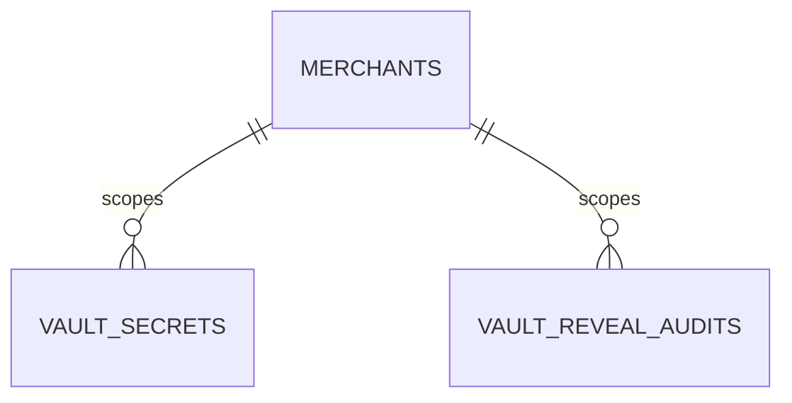

# Merchants Module Reference

> As-built 2026-08-13. Covers merchant profile, merchant-user OIDC BFF, registration/KYC, commerce actor binding
> และ Admin control plane ที่จัดการ merchant identity, originator และ PSP/routing.

## Identity and session

- OIDC BFF providers: Google and Microsoft Entra
- Browser holds opaque `__Host-mch_session` cookie; no bearer/id token in SPA
- CSRF double-submit on merchant-user mutations
- session family rotation, reuse detection, revoke one/all and bounded pruning
- request resolves active user, merchant, SaleCode and Active-only IAM permissions
- unknown/not-configured provider `404`; absent/expired session `401`; permission denial `403`

Frontend never supplies merchant ID or SaleCode for commerce operations.

## Registration and KYC

Anonymous registration uses signed Data Protection ticket. User submits scalar identity fields plus optional multipart
`kycPhoto`:

- maximum 2 MiB
- allowlisted media type + magic bytes
- deterministic private staged object keyed by `KycOperationId`
- staging returns `(Key, CreatedNew)`; same operation + same bytes is idempotent, different bytes is rejected
- DB stores key only
- lifecycle outbox commits/replaces/deletes object idempotently
- failed registration discards staging only when current attempt created the object
- orphan staging TTL is 24 hours; `PhotoStagingPruneService` sweeps every hour after a 5-minute startup delay
- omission keeps existing key

Public/API/history/log surfaces never expose object key, filesystem path, credentials or unnecessary PII.
Admin approve/reject uses authorization lease and concurrency checks. Registration notices live in raw
`merch.RegistrationNotices`.

## Merchant profile and provisioning

`POST /api/v1/merchants` เป็น provisioning endpoint สำหรับ Super admin. Request ต้องผ่าน admin session, CSRF,
captive Merchant-code allowlist และส่ง PSP connection อย่างน้อยหนึ่งรายการ.

```json
{
  "merchant": {
    "code": "vcommerce",
    "name": "vCommerce Co., Ltd.",
    "country": "TH",
    "currency": "THB",
    "enabledChannels": ["card", "promptpay"],
    "branding": { "statementName": "VCOMMERCE" },
    "routing": { "installment": ["2c2p"] },
    "session": { "ttlSeconds": 3600 },
    "timezone": "Asia/Bangkok",
    "locale": "th-TH"
  },
  "pspConnections": [
    {
      "psp": "2c2p",
      "enabledMethods": ["card", "promptpay"],
      "merchantId": "provider-merchant-id",
      "secrets": { "secretKey": "write-only-value" },
      "environment": "production"
    }
  ]
}
```

Secret-owned fields เช่น `secretKey`, `publicKey` และ `webhookSecret` ต้องอยู่ใน `secrets` เท่านั้น.
Typed Merchant metadata ปฏิเสธ unknown field; PSP config ที่ไม่ใช่ secret เก็บเป็น readable connection metadata.

Provisioning commit entity set ต่อไปนี้ใน transaction เดียว:

| Entity | Result |
|---|---|
| `merch.Merchants` | Merchant สถานะ Active |
| `txn.PspConnections` | หนึ่งแถวต่อ PSP ที่ส่งมา |
| `merch.VaultSecrets` | envelope-encrypted credential หนึ่งชุดต่อ connection |
| `merch.ProvisioningAudits` | actor และ correlation ของ provisioning |
| `admin.ProvisioningOperations` | idempotency key, request hash และ stored result |

Failure ก่อน commit rollback ทั้งชุด. Replay ด้วย key/payload เดิมคืน stored result โดยไม่สร้าง Merchant ซ้ำ.
Response คืนเฉพาะ `merchantId`, `pspConnectionId`, PSP code และ masked secret hints รูป `****1234`.

| Condition | HTTP |
|---|---:|
| Request validation, unknown PSP/method หรือ secret ผิดตำแหน่ง | 400 |
| Merchant code ซ้ำ หรือ operation key ถูกใช้กับ payload อื่น | 409 |
| ไม่มี admin session | 401 |
| CSRF ไม่ผ่าน, admin ไม่ใช่ Super หรือ permission ไม่พอ | 403 |
| Runtime dependency ใช้งานไม่ได้ | 503 |

Baseline synthetic merchant มี disabled PSP connection และไม่มี credential/PII.

## Provision, register and approve

Merchant user registration ยังเป็น self-service แบบ ticket-gated และไม่รับ Merchant id จาก client.

1. Super admin provision Merchant และ PSP credentials ผ่าน `POST /api/v1/merchants`.
2. User ลงทะเบียนเป็น `PendingApproval` โดย `MerchantId` ยังเป็น `NULL`.
3. Admin เรียก `POST /api/v1/admins/merchants/users/{subject}/approve` พร้อม `merchantCode` และ role codes.
4. Host resolve Merchant ผ่าน accessible-Merchant boundary ก่อน dispatch approval.
5. Merchant ไม่พบหรือนอก scope คืน 404; Merchant ไม่ Active คืน 409.
6. Merchant Active จึง bind `MerchantId`, assign roles, เปลี่ยน user เป็น Active และเขียน registration audit ใน transaction เดียว.

Registration submission อาจเกิดก่อน provisioning; prerequisite บังคับตอน approval. Merchant lifecycle, originator,
PSP connection, routing และ merchant-user/role management มี top-level Admin routes แล้ว ดู
[`admin-control-plane.md`](admin-control-plane.md) สำหรับ route, permission, approval และ concurrency contract.

## Vault custody and reveal audit

`merch.VaultSecrets` และ `merch.VaultSecretVersions` เก็บ ciphertext, wrapped DEK, key id, hint และ timestamps. Plaintext ไม่อยู่ใน
database response, readable config หรือ log. Master-key rotation re-wrap เฉพาะ DEK; ไม่ decrypt/re-encrypt secret payload.

`merch.VaultRevealAudits` ว่างหลัง provisioning และเพิ่มแถวเมื่อ server reveal secret เพื่อเรียก PSP เท่านั้น.
Reveal ต้องเขียน audit สำเร็จก่อนคืน plaintext ให้ caller; audit failure ทำให้ reveal fail-closed.

แต่ละ Merchant มี append-only SHA-256 hash chain ของตัวเอง. แถว audit เก็บ `MerchantId`, `SecretName`,
`RevealedAt`, sequence, previous hash และ current hash; ไม่เก็บ plaintext, DEK, KEK หรือ hint. Unique
`(MerchantId, Seq)` ป้องกัน chain fork และ verifier ตรวจ sequence gap, modified row และ broken linkage.

Logical relationships:



ทั้งสองความสัมพันธ์ใช้ `MerchantId` เป็น logical scope. ไม่มี physical FK หรือ cascade delete.

## Commerce routes

Merchant user can:

- query live Products with server-bound SaleCode
- create/mutate/read Carts
- create Order directly from Cart
- create/read/redirect Payment session under IAM permissions
- read/cancel own Orders and resend summary

No Checkout or policy route exists. Full cutover mapping:
`.ai/specs/merchant-commerce-erd-reset/FE-MIGRATION.md`.

Production single-host deployment persists local staged/final photos in named volume
`merchant-user-photos:/app/merchant-user-photos`. A shared object-store adapter is still required for
horizontal or multi-host deployment.

## Persistence boundaries

- Merchant identity/session/invitation/outbox: `MerchantUserDbContext`
- Merchant profile/vault/originator/Carts/Orders/Payments: `MerchantRuntimeDbContext`
- Admin control-plane operation records: `ControlPlaneDbContext`, `MerchantUserDbContext` หรือ `MerchantRuntimeDbContext`
  ตาม aggregate ที่ถูกแก้
- global query filters deny unbound/wrong merchant
- sealed write guard rechecks tenant key and operation authority
- `PolDbContext` is migration owner only
