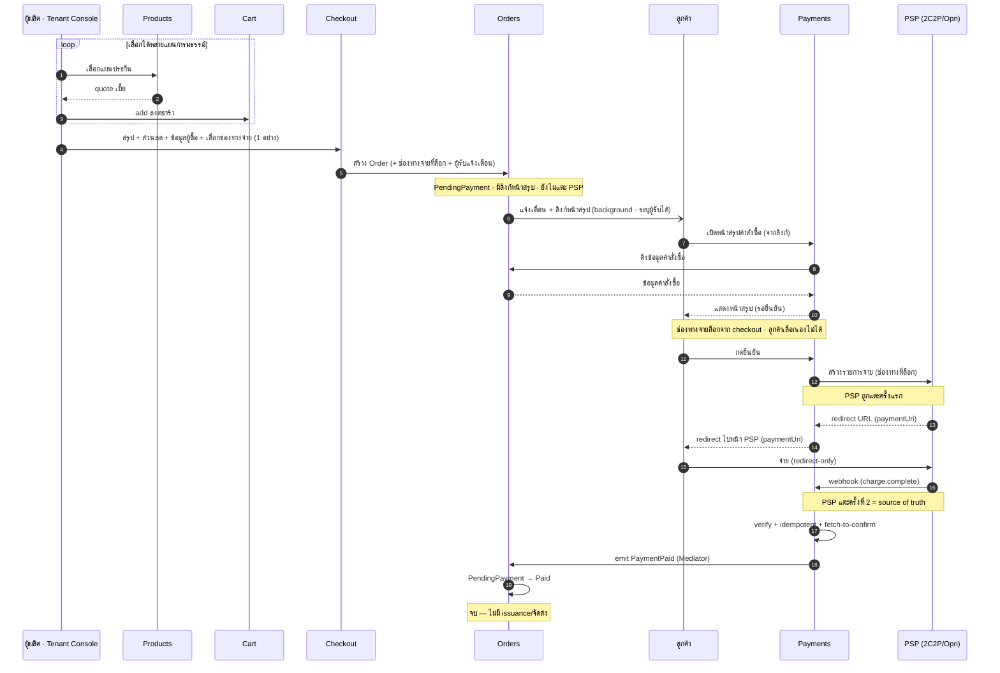
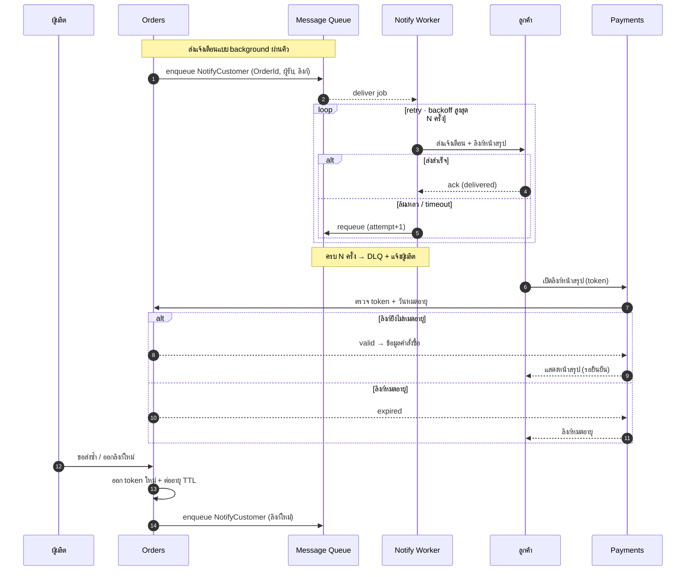
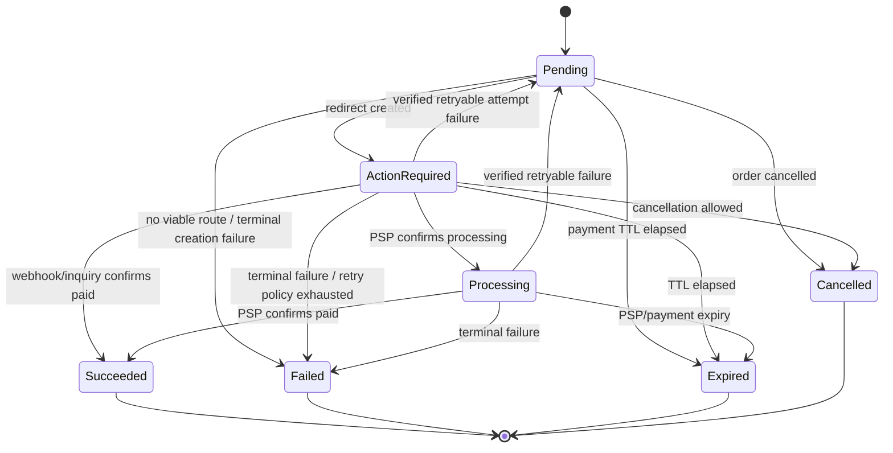
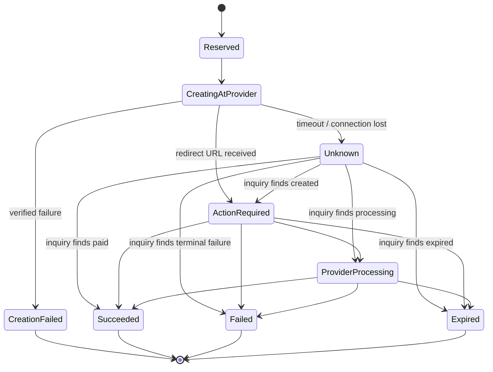
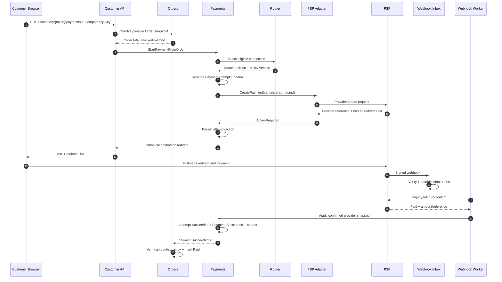
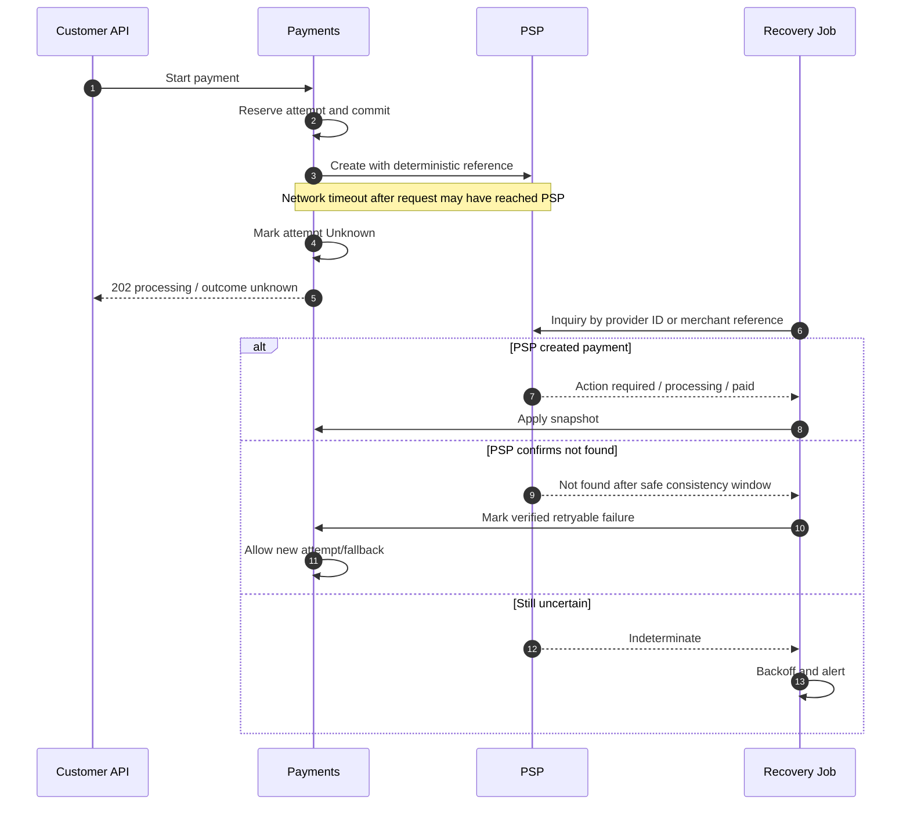
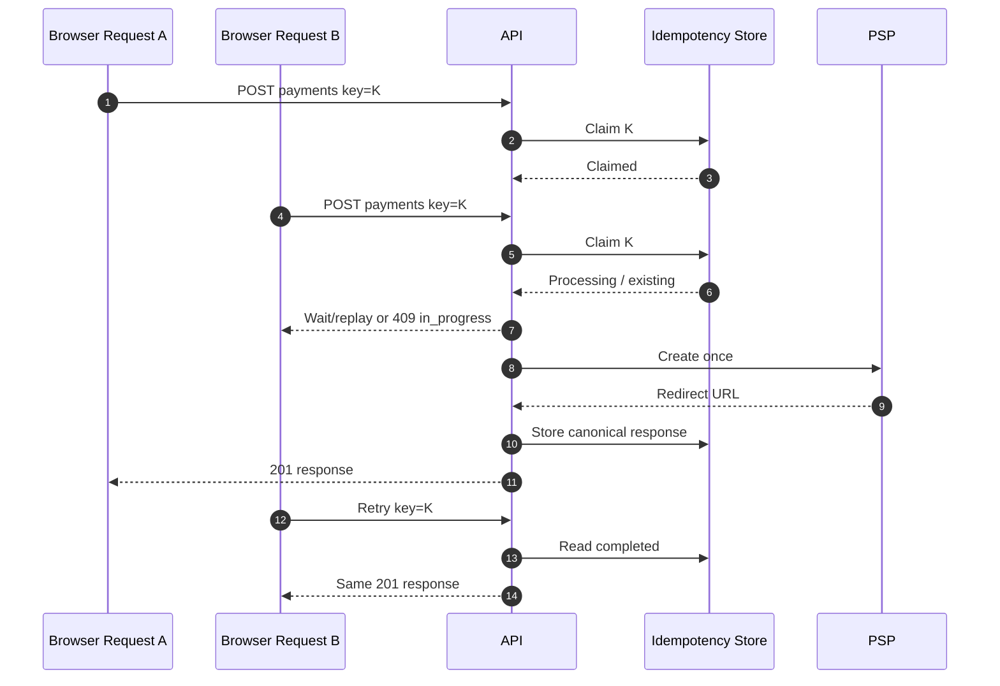

# สรุปโมดูลและบทบาท — Internal Payment Orchestration Platform (captive)

> โมเดล **captive / internal** · redirect-only · multi-tenant · ไม่ถือเงิน · ใช้ฟรีภายในเครือ
> Tenant: **vPrivilege · vCommerce · vSouvenir** · PSP ปลายทาง: 2C2P + Omise/Opn
> เวอร์ชันอัปเดต: สะท้อนการตัดสินใจล่าสุด (2 SaaS console, no payout, no fee, captive)
>
> **[intake 2026-07-05]** ไฟล์นี้รวมสองส่วน: ภาค 1-7 + Naming = canon เดิม (design แรก + as-built
> mechanics — PSP mechanics, provisioning payload, naming ยังใช้ต่อ) และ
> [ภาค 8 Canonical Payment API](#8-canonical-payment-api--target-design-normative) = **normative
> target design** ที่รับเข้า 2026-07-05 — จุดของเดิมที่ถูก supersede มี annotation กำกับรายจุด;
> module map + สถานะ as-built ต่อฟีเจอร์ดูที่ [platform-modules.md](platform-modules.md)

---

## ภาพรวม

**ทั้งระบบคือ scope เดียวกัน — SaaS อีคอมเมิร์ซประกันภัย** ที่มี 5 โมดูลอยู่ใน scope เดียว (**Products · Cart · Checkout · Orders · Payments**) คุยกันผ่าน **Mediator (martinothamar/Mediator)** แบบ modular ไม่อ้างถึงกันตรง · เอกสารนี้ลงรายละเอียด **โมดูล Payments** เป็นหลัก (โมดูลที่ build out มากสุด)

โมดูล Payments นี้คือ **แพลตฟอร์ม orchestration การชำระเงินภายในเครือ** ที่ให้บริษัทในเครือ (vPrivilege/vCommerce/vSouvenir) รับชำระเงินผ่าน PSP ที่ถือใบอนุญาตอยู่แล้ว — คุณ **"ใช้" PSP ไม่ใช่ "เป็น" PSP** และ **เงินจริงไม่วิ่งผ่านแพลตฟอร์ม**

แบ่งเป็น 2 ระนาบที่แยกขาดกัน:
- **Control plane** — การตั้งค่า/กำกับดูแล (console → backend) ไม่แตะเส้นทางเงิน
- **Data plane** — request การจ่าย + สถานะ (ไม่ใช่ตัวเงิน เงิน settle ตรงจาก PSP เข้าบริษัท)

หลักการที่บังคับทั้งระบบ: **multi-tenant isolation (RLS)**, **redirect-only (PCI SAQ A รายนิติบุคคล)**, **webhook = source of truth**, **maker-checker สำหรับ action อ่อนไหว**, **idempotency**, **credential vault security**, **แยก Tenant/Admin console เป็นคนละแอป (blast radius)**

ชั้นจากบนลงล่าง: ช่องทางบริษัทในเครือ → control plane (2 console) → platform core → PSP adapter → PSP (ใน PCI scope) โดยเงิน settle จาก PSP เข้าบัญชีบริษัทโดยตรง

---

## ขอบเขตงาน (in scope) — ทั้ง SaaS

**ทั้งระบบคือ scope เดียวกัน** — SaaS อีคอมเมิร์ซประกันภัยที่มี 5 โมดูลอยู่ใน scope เดียวกัน คุยกันผ่าน Mediator แบบ modular:

| โมดูลใน SaaS (in scope) | บทบาท | เทียบอีคอมเมิร์ซ |
|---|---|---|
| **Products** | แผนประกัน / กรมธรรม์ (แคตตาล็อก + quote เบี้ย) | สินค้า / SKU |
| **Cart** | ตะกร้าสินค้า — รวมแผนที่เลือก + quote (แก้ไขได้) | ตะกร้า / cart |
| **Checkout** | หน้าสรุปคำสั่งซื้อ + ส่วนลด + ข้อมูลผู้ซื้อ + **เลือกช่องทางจ่าย 1 ช่องทาง (ล็อก)** + ตั้งค่าผู้รับแจ้งเตือน → สร้าง Order | checkout |
| **Orders** | ข้อมูลคำสั่งซื้อ + **ลิงก์**ไปหน้าสรุป (ที่ Payments ให้บริการ) · **ส่งแจ้งเตือน + ลิงก์ให้ลูกค้าแบบ background** (ระบุผู้รับได้) · `PendingPayment` **ยังไม่แตะ PSP** · รับ `PaymentPaid` → Paid | คำสั่งซื้อ / order |
| **Payments** | **หน้าจอสรุปคำสั่งซื้อสำหรับลูกค้า** (ดึงข้อมูลจาก Orders) · ลูกค้ากดยืนยัน → สร้าง **รายการจ่ายกับ PSP** + redirect URL (`paymentUri`) → รับชำระ redirect-only, captive | ชำระเงิน / payment |

Flow ใน SaaS: Products → **Cart** → **Checkout** → Orders → **Payments** · จบที่ **"รับชำระเสร็จ → emit `PaymentPaid`"** — SaaS **ไม่มีขั้นจัดส่ง/ออกกรมธรรม์ (issuance)**

**ผู้เกี่ยวข้อง:** *ผู้ผลิต (Tenant Console)* = ผู้เลือกแผน/กรมธรรม์ → ตะกร้า → checkout · *ลูกค้า* = เปิดลิงก์หน้าสรุปคำสั่งซื้อ → กดยืนยัน → จ่าย (เท่านั้น)

> **ลำดับสำคัญ:** สร้าง Order **ไม่ได้สร้างรายการกับ PSP** — Order อยู่ `PendingPayment` + มีลิงก์ไปหน้าสรุป · รายการกับ PSP (`paymentUri`) ถูกสร้างใน **Payments เมื่อลูกค้าเปิดหน้าสรุป (ของ Payments) แล้วกดยืนยัน** → Orders ไม่ผูกกับ PSP โดยตรง เปลี่ยน/เพิ่ม PSP ได้โดยไม่แตะ Orders

> **การแจ้งเตือน (background):** Orders ส่งผ่าน **Message Queue → Notification Worker** · ล้มเหลว → **retry แบบ backoff** สูงสุด N ครั้ง → ครบแล้วเข้า **DLQ** + แจ้งผู้ผลิต · **ลิงก์หน้าสรุปมี TTL** เปิดหลังหมดอายุ = error · **ส่งซ้ำ / ออกลิงก์ใหม่** = Orders ออก token ใหม่ + ต่ออายุ แล้ว enqueue รอบใหม่

> **ช่องทางชำระเงิน:** Checkout เลือก **1 ช่องทางต่อ Order** (บัตร / PromptPay / ผ่อน อย่างใดอย่างหนึ่ง) แล้ว **ล็อก** — ลูกค้า **เลือก/เปลี่ยนเองไม่ได้** ที่หน้าสรุป · Payments สร้างรายการ PSP ตามช่องทางที่ล็อกไว้ (routing primary/fallback เป็นเรื่องภายในของช่องทางนั้น)

> เอกสารนี้ลงรายละเอียด **โมดูล Payments** เป็นหลัก (หัวข้อ 1–7) · Products/Cart/Checkout/Orders มีสเปกของตัวเองแยก แต่ทั้งหมดอยู่ใน **scope เดียวกันของ SaaS**

**โมดูล Payments ทำอะไร:**
- รับ payment intent จากช่องทางของบริษัทในเครือ → ออก **redirect ไปหน้า PSP** (สัญญากลางรูปทรงเดียวทุก PSP)
- รับผลจริงทาง **webhook (source of truth)** → verify ลายเซ็น + fetch-to-confirm → อัปเดตสถานะ → emit `PaymentPaid`
- **Multi-tenant provisioning** — Admin Console สร้าง tenant + เก็บ PSP credential/config ต่อบริษัท (vault)
- **2 SaaS console** (Tenant/Admin) คนละแอป + **RBAC** + **identity (Google SSO)**
- **PSP adapter** 2C2P + Omise/Opn — redirect-only ครบ 3 ช่องทาง (บัตร/PromptPay/ผ่อน)
- **Reconciliation = reporting**, retry/dunning, idempotency, audit log

**โมเดล Payments (captive):**
- **Captive** — เปิดเฉพาะ 3 นิติบุคคลในเครือ (allowlist) ไม่รับคนนอก
- **No payout** — เงิน settle จาก PSP เข้าบัญชี merchant ของแต่ละบริษัท **โดยตรง** → อยู่นอก funds flow
- **Free** — ไม่มี billing/ค่าบริการ
- **Regulatory** — captive + ไม่ถือเงิน → เป็น merchant/tech provider ไม่เข้าข่ายใบอนุญาตประเภทที่ 3 ของ ธปท. ใบอนุญาตอยู่ที่ PSP *(ควรคอนเฟิร์ม ธปท. หากนิติบุคคลไม่ได้อยู่ใต้การควบคุมเดียวกัน หรือวันใดเปิดให้คนนอกใช้)*
- **PCI** — SAQ A รายนิติบุคคล (redirect-only ไม่แตะข้อมูลบัตร)

**รอยต่อข้ามโมดูล (Payments ↔ Orders) ที่ต้องระวัง:**
- ชนิดเงินที่ seam `PaymentPaid` — `Amount` เป็น `Money` (SharedKernel) ใช้ร่วมทุกโมดูลแล้ว — ห้ามถอยกลับไป scalar/decimal ที่ seam
- **verify amount/currency** ตอน Orders รับ `PaymentPaid` ไม่ใช่แค่ id (กันจ่ายไม่ครบ/สกุลผิด) — ทำแล้วใน `Order.MarkPaid`
- **correlation:** Orders จับคู่ order ด้วย **`PaymentPaid.OrderId`** (field ชั้นหนึ่งของ contract; PR #44, spec `bugfix-order-paid-link`) — `Order.PaymentSessionId` เป็น legacy ไม่มี production writer ห้ามใช้เป็น join key

---

## ลำดับเหตุการณ์ E2E (sequence)

ไดอะแกรมเรนเดอร์ด้วย mermaid.js (โหลดจาก CDN — ต้องต่อเน็ตครั้งแรก)

### เส้นทางหลัก (happy path)



### การแจ้งเตือน (Message Queue + retry) และวงจรลิงก์ (หมดอายุ/ส่งซ้ำ)



---

## นอกขอบเขต — ฟังก์ชันที่ "ห้าม implement"

> สิ่งเหล่านี้อยู่ **นอก scope ของ SaaS โดยตั้งใจ** — ถ้าเพิ่มเข้ามาจะเปลี่ยนสถานะทางกฎหมายและขยาย PCI scope ทันที **ห้าม implement และห้าม "ช่วยเพิ่มให้เอง"**

1. **ห้ามสร้าง settlement / payout engine** — ระบบต้องไม่รับ ถือ หรือจ่ายเงินต่อ ไม่มี money ledger / wallet / float / escrow / disbursement เงิน settle จาก PSP เข้าบัญชี merchant ของแต่ละบริษัทโดยตรง (เราอยู่นอก funds flow เสมอ)
2. **ห้ามทำ billing / เก็บค่าบริการ** — ใช้ฟรี ไม่มี subscription / invoice / usage metering เพื่อเรียกเก็บเงิน / fee deduction
3. **ห้ามทำ public หรือ self-serve onboarding สำหรับคนนอก** — onboarding เป็น allowlist เฉพาะ vPrivilege / vCommerce / vSouvenir ไม่ต้องต่อ KYB/AML provider ของ merchant ภายนอก ไม่ต้องมีหน้าสมัครแบบเปิด
4. **ห้ามแตะข้อมูลบัตร** — ห้าม collect / store / transmit / tokenize PAN ห้ามมี card input field / hosted-fields / iframe ที่รับข้อมูลบัตรบนโดเมนเรา (ตัด client-side tokenization เช่น Omise.js card ออกทั้งหมด)
5. **ห้ามสร้างฟังก์ชันของ PSP / acquirer เอง** — ไม่มี acquiring, card scheme connectivity, 3DS/ACS, payment processing เราเป็น merchant/orchestrator ที่ "ใช้" 2C2P/Omise ไม่ใช่ "เป็น" PSP
6. **ห้าม flow แบบ non-redirect** — ห้ามทำ display-QR-บนหน้าเรา, iframe, hosted-fields หรือ flow ใดที่ render UI การจ่ายบนโดเมนเรา ใช้ **full redirect ไปหน้า PSP เท่านั้น** (เพื่อคง SAQ A)
7. **Reconciliation = reporting เท่านั้น** — ห้ามสร้างลอจิกที่เคลื่อนเงิน/ปรับยอดจริง เป็นการกระทบยอดเพื่อแสดงผลเท่านั้น

> **หมายเหตุสำหรับ AI agent ที่พัฒนาระบบ:** ถ้าเจอ requirement, ticket หรือไอเดียที่นำไปสู่ข้อใดข้างต้น ให้ **หยุดและถามก่อน** อย่า implement เอง แม้จะดู "เป็นประโยชน์" — เพราะกระทบสถานะใบอนุญาตและ PCI scope ของทั้ง SaaS

---

## 1. ชั้นช่องทาง (Channels)

### เก็บเบี้ย / รับชำระ (premium / payment in)
- **บทบาท:** จุดที่ลูกค้าของแต่ละบริษัทในเครือกดจ่าย (ออนไลน์/แอป/ช่องทางของบริษัทนั้น)
- **อินพุต:** การกระทำของลูกค้า + ข้อมูลรายการ
- **เอาต์พุต:** payment intent ส่งเข้า Create session
- **หมายเหตุ:** ไม่มี disbursement/payout ผ่านแพลตฟอร์ม (ถูกตัดในโมเดล captive)

---

## 2. Control plane — แยกเป็น 2 SaaS apps

ทั้งสองแอปเป็นคนละ frontend/คนละ deploy แต่ **นั่งบน backend + data ชุดเดียวกัน**

### 2.1 Tenant Console (SaaS app #1)
- **บทบาท:** แอปเดียวที่ทั้ง 3 บริษัทใช้ร่วมกัน โดย scope ต่อรายผ่าน tenant context จากตอน login
- **หน้าที่หลัก:** ดู dashboard/รายงาน/reconciliation เฉพาะตน, ตั้งค่าระดับที่อนุญาต — **ไม่ได้สร้าง tenant หรือกรอก PSP credential เอง** (admin provision ให้)
- **คุณสมบัติ:** public-facing · เห็นเฉพาะข้อมูล tenant ตน
- **หมายเหตุ:** ไม่มี code path ไปฟังก์ชัน admin เลย

### 2.2 Admin Console (SaaS app #2)
- **บทบาท:** แอปของทีมกลาง เข้าถึงข้ามทุก tenant
- **หน้าที่หลัก:** **สร้าง/provision Tenant Console ให้แต่ละบริษัท**, กรอกและเก็บ PSP integration config + credential รายบริษัทลง vault, ตั้ง webhook/return URL mapping ต่อ tenant, จัดการ tenant/allowlist, ตั้ง routing, มอนิเตอร์, audit
- **คุณสมบัติ:** **internal-only** (VPN/IP allowlist, MFA เข้มกว่า, แยก identity provider) · แยก deploy/codebase เพื่อลด blast radius
- **หมายเหตุ:** เป็น control plane ตัวจริง — ฟังก์ชันอำนาจสูงทั้งหมดอยู่ที่นี่

### 2.3 Permission model (RBAC)
- **โครงสร้าง:** สิทธิ = Scope × Resource × Action
- **Role ใน Tenant Console:** Tenant Admin / Finance / Viewer (scope = tenant ตนเท่านั้น)
- **Role ใน Admin Console:** Platform Owner / Operator / Risk & Compliance / Support (scope = ทุก tenant)
- **maker-checker:** ใช้กับ action อ่อนไหว เช่น approve tenant ใหม่, เปลี่ยน routing rule, แก้ allowlist
- **บังคับใช้:** การแยกแอปเป็นแค่หน้าบ้าน — เส้นป้องกันจริงคือ **backend authorization แยก permission scope ให้ขาด** endpoint ของ admin (cross-tenant/approve/config) ต้องเรียกผ่าน session ของ Tenant Console ไม่ได้

### 2.4 Provisioning (admin-driven)
- **ลำดับ:** Admin สร้าง tenant → Admin กรอก PSP config + credential รายบริษัท (เก็บลง vault) → ตั้ง webhook/return URL mapping ต่อ tenant → provision Tenant Console + พื้นที่ข้อมูลแยก → tenant พร้อมใช้
- **บทบาท:** ทีมกลาง provision ทั้งหมดผ่าน Admin Console (ไม่ใช่ self-serve ของ tenant) เหมาะกับ captive เพราะ 3 บริษัทอยู่ในเครือ ทีมกลางถือ credential ได้
- **ขอบเขต:** เฉพาะ vPrivilege / vCommerce / vSouvenir (allowlist) · ไม่มี billing
- **ข้อมูลที่ provision (data model):** `Tenant` (Name/Status/EnabledChannels/Currency) → `PspConnection` ต่อ PSP (Psp, MerchantId, EnabledMethods, WebhookPath) → `VaultSecret` ต่อ connection (SecretKey/PublicKey/WebhookSecret — เก็บเป็น ciphertext เข้ารหัส) · runtime: `PaymentSession` อ้าง TenantId + ConnectionId
- **การอ่านตอน runtime:** adapter อ่าน `PspConnection` แล้ว decrypt `VaultSecret` ที่เกี่ยว ไปเรียก 2C2P/Omise แล้วเขียน `PaymentSession`

#### Config payload (admin submit)

ตัวอย่าง payload เต็ม (100%) ที่ทีมกลางกรอกผ่าน Admin Console — vCommerce ใช้ทั้ง 2C2P + Omise โดยทั้ง 2 PSP เปิดครบ 3 ช่องทาง:

```json
{
  "tenant": {
    "code": "vcommerce",
    "displayName": "vCommerce Co., Ltd.",
    "legalEntityId": "0105560000000",
    "status": "active",
    "country": "TH",
    "currency": "THB",
    "timezone": "Asia/Bangkok",
    "locale": "th-TH",
    "enabledChannels": ["card", "promptpay", "installment"],
    "branding": {
      "statementName": "VCOMMERCE",
      "supportEmail": "support@vcommerce.co.th",
      "logoUrl": "https://cdn.vgroup.internal/vcommerce/logo.png"
    },
    "routing": {
      "card":        { "primary": "2c2p",  "fallback": "omise" },
      "promptpay":   { "primary": "2c2p",  "fallback": null },
      "installment": { "primary": "omise", "fallback": "2c2p" }
    },
    "session": {
      "expiryMinutes": 30,
      "idempotencyTtlHours": 24
    },
    "createdByAdmin": "ops-007"
  },
  "pspConnections": [
    {
      "psp": "2c2p",
      "environment": "production",
      "merchantId": "764764000012345",
      "currencyCode": "764",
      "enabledMethods": ["card", "promptpay", "installment"],
      "card": { "secure3ds": true },
      "installment": { "terms": [3, 6, 10], "banks": ["KBANK", "BAY", "SCB", "BBL"] },
      "frontendReturnUrl": "https://pay.vgroup.internal/return/vcommerce/2c2p",
      "backendReturnUrl": "https://pay.vgroup.internal/webhook/vcommerce/2c2p",
      "webhookPath": "/webhook/vcommerce/2c2p",
      "locale": "th",
      "secrets": {
        "secretKey": "<2c2p merchant secret key · JWT signing · write-only>"
      }
    },
    {
      "psp": "omise",
      "environment": "production",
      "accountId": "acct_5xxxxxxxxxxxxxxx",
      "apiVersion": "2019-05-29",
      "enabledMethods": ["card", "promptpay", "installment"],
      "card": { "via": "links_api", "secure3ds": true },
      "promptpay": { "via": "payment_links_plus" },
      "alternativeMethods": { "via": "source_charge" },
      "enabledSources": ["installment_kbank", "installment_bay", "installment_scb"],
      "installment": { "terms": [3, 6, 10], "minAmountThb": 3000 },
      "returnUri": "https://pay.vgroup.internal/return/vcommerce/omise",
      "webhookPath": "/webhook/vcommerce/omise",
      "secrets": {
        "publicKey": "pkey_xxxxxxxxxxxxxxxx",
        "secretKey": "<omise skey · server-side API · write-only>",
        "webhookSecret": "<omise webhook signing secret · write-only>"
      }
    }
  ]
}
```

**Field reference (ที่เพิ่มจากเวอร์ชันย่อ):**
- `tenant.routing` — เพราะทั้ง 2 PSP ทำได้ครบ 3 ช่องทาง ต้องระบุ **primary/fallback ต่อช่องทาง** (เช่น installment → Omise ก่อน, ตกไป 2C2P) feed เข้า Method router
  > **[intake 2026-07-05 — superseded เชิง target]** shape `{primary, fallback}` เป็นรุ่นเดิม —
  > target routing policy เป็น resource ของตัวเอง (มี `version`, `strategy: ordered_failover`,
  > routes + priority + conditions) ดู [ภาค 8.6](#8-canonical-payment-api--target-design-normative);
  > ห้ามเปิด spec routing จาก shape นี้โดยไม่เทียบภาค 8.6 ก่อน
- `tenant.branding` / `locale` / `timezone` — แสดงบนหน้า PSP + จัด session expiry ตามเวลาไทย
- `tenant.session` — คุม expiry ของ redirect session + TTL ของ idempotency
- `psp.environment` — `production` / `sandbox` แยก key คนละชุด
- **2C2P:** `currencyCode` เป็นรหัสตัวเลข ISO (`764` = THB) · `installment.terms/banks` · `card.secure3ds` · แยก `frontendReturnUrl` (UX) กับ `backendReturnUrl` (truth)
- **Omise:** `apiVersion` (Omise-Version header) · `card.via = "links_api"` (บัตรผ่าน Links API → `paymentUri` ไม่ใช่ Omise.js) · `promptpay.via = "payment_links_plus"` (PromptPay ผ่าน Payment Links+ → `transaction_url` hosted, **ไม่ใช่** source+charge ที่เป็น offline-QR) · `alternativeMethods.via = "source_charge"` (ผ่อน/e-wallet → `authorizeUri`) · `enabledSources` คือ source types จริงของ Omise (เฉพาะ method ที่ redirect ผ่าน authorize_uri — ไม่รวม promptpay)

**Map ลงตาราง:**
- `tenant.*` (รวม nested `branding`/`routing`/`session`) → `Tenant` (คอลัมน์ตรง + ส่วนยืดหยุ่นเก็บใน `Metadata` json)
- แต่ละ `pspConnections[]` (ยกเว้น `secrets`) → `PspConnection` (config ไม่ลับ; `card`/`installment`/`enabledSources` เก็บใน json ของแถวนั้น)
- ทุกคีย์ใน `secrets` → `VaultSecret` (เข้ารหัส, `Kind` = ชื่อ field, 1 แถวต่อ secret)

- **กฎ secret:** ฟิลด์ใน `secrets` เป็น **write-only** — API อ่านกลับต้อง mask เสมอ (เช่น `"secretKey": "••••3a9f"`) ไม่ส่ง plaintext คืน
- **WebhookPath / returnUri:** ต้องเอาไปตั้งใน dashboard ของ PSP ฝั่งบริษัทด้วย เพื่อให้ callback/return แยก tenant/PSP ได้

#### Provisioning sequence

1. Admin → Backend: submit config (JSON)
2. Backend: validate (allowlist = vPrivilege/vCommerce/vSouvenir เท่านั้น + schema)
3. Backend → DB: INSERT `Tenant`
4. Backend → DB: INSERT `PspConnection` (config ไม่ลับ)
5. Backend → Vault: encrypt → `VaultSecret` (เก็บคนละที่กับ DB)
6. Backend → DB: provision space · status = active
7. Backend → Admin: done (secrets masked)
8. หลังจากนั้น: ผู้ใช้ของ tenant login เข้า Tenant Console ใช้งานได้ทันที

#### ข้อควรทำ (สำหรับ AI agent ที่ implement)

- ขั้น 3–6 (`Tenant` / `PspConnection` / `VaultSecret` / active) ต้องอยู่ใน **transaction เดียว** กัน partial provision
- **validate ก่อนเขียน:** allowlist + schema
- **idempotent** ด้วย tenant key กันกดสร้างซ้ำ
- secret เข้า vault แยกจาก config และ **อ่านกลับ mask เสมอ**

### 2.5 Identity & RBAC (Google SSO)

**IdP:** ทั้งสอง console ใช้ Google SSO (Sign in with Google) → `iss` ร่วมกัน (`accounts.google.com`) จึง **แยก domain ด้วย `aud` (OAuth client คนละตัวต่อ console) + ตาราง identity ฝั่ง platform + `hd` guard** ไม่ใช่ด้วย `iss`

**Authn vs authz:** Google ทำแค่ authentication (ยืนยันเจ้าของอีเมล → ให้ `sub`/`email`/`hd`) ส่วน role/tenant ตัดสินที่ platform เสมอ

#### Admin Console
- **ด่านเข้า (default-deny):** ตรวจ `aud=admin-client` + **`hd=platform.com`** ทุก request — ไม่ผ่าน → 403
- **Role:** ผ่าน hd-gate ครั้งแรก → **role ต่ำสุดเป็น default** (read-only) elevate เป็น Operator/Risk/Owner ผ่าน record ที่ทีมกลางกำหนด
- **Bootstrap owner:** seed owner คนแรกผ่าน config/migration (ตารางว่างตอน deploy → elevate ตัวเองผ่าน UI ไม่ได้)
- **Roles:** Platform Owner · Operator · Risk & Compliance · Support (cross-tenant)
- **สมมติฐานที่ต้องจริงตลอด:** ทุกบัญชี @platform.com = คนที่ให้เข้า admin ได้ (โดเมนสงวนเฉพาะทีมกลาง) ถ้าวันใดโดเมนขยายใช้ทั่วไป ต้องกลับไปใช้ allowlist รายคน

#### Tenant Console (producer)
- **Key:** `ExternalLogin(provider, sub)` — ใช้ Google `sub` (immutable) ไม่ใช่ email
- **Register flow:** login Google → ไม่พบ ExternalLogin = ผู้สมัครใหม่ → ออก **registration ticket** (พก verified identity, short-lived + single-use, ยังไม่ใช่ session) → กรอกฟอร์ม → สร้าง `TenantUser(PendingApproval)` + ExternalLogin + Profile → แจ้ง admin
- **Approval:** admin **เลือก tenant จาก `Tenant` ที่มีอยู่** (ทางเดียวทุกเคส รวม gmail) + กำหนด role → Active · `TenantId` resolve จากที่ admin เลือกเท่านั้น (ไม่เชื่อค่าจากฟอร์ม) + validate ว่า tenant exists/active
- **State machine:** New → PendingApproval → Active / Rejected · Rejected → correction ticket → resubmit (→Pending) · Pending → 403 "รออนุมัติ"
- **Roles:** Tenant Admin · Finance · Viewer (scope = tenant ตน, RLS ด้วย `TenantId`)
- **โดเมน:** บริษัท (@vprivilege/@vcommerce/@vsouvenir) ใช้ `hd` เป็น guard เสริมได้ · @gmail = personal account ไม่มี `hd`, offboarding ต้องลบแถวเอง → allowlist รายคนคือด่านเดียว

#### ตาราง identity (แยก schema)
- `AdminUser` (schema admin): `Email`/`Sub` PK · `Role` · `Status`
- `ProducerAccount` (schema producer, control-plane): `Subject` UQ · `Status` · person details (name/id/license/phone/photo) — tenant เป็น edge แยก `ProducerTenantAssignment` (1 tenant/account), คู่กับ `ExternalLogin`; wire ticket เป็น stateless token (ไม่มีตาราง)
- แยก 2 schema → อีเมลในตารางหนึ่งไม่ได้สิทธิอีกฝั่งโดยอัตโนมัติ (คนละ RBAC realm)

#### Enforcement (ทุก request)
verify Google id_token (sig/`iss`/`aud`/exp/email_verified) → guard `hd` (ถ้ามี) → lookup table ของ console นั้น (ไม่พบ/disabled = 403) → scope ด้วยคอลัมน์ `TenantId` (RLS, ฝั่ง tenant) · token ข้าม domain ตกที่ `aud` ไม่ตรง

---

## 3. แพลตฟอร์มกลาง (Platform core) — captive · ไม่ถือเงิน

backend + data ที่ทั้งสอง console ใช้ร่วมกัน

### 3.1 Session layer

> **[intake 2026-07-05 — superseded เชิง target]** ชั้นนี้คือรุ่น `PaymentSession` (fused intent+attempt)
> ซึ่งตรงกับโค้ดปัจจุบัน — target design แยกเป็น `Payment` + `PaymentAttempt` + customer capability API
> และ webhook เปลี่ยนเป็น durable inbox two-stage: ดู [ภาค 8](#8-canonical-payment-api--target-design-normative)
> (8.2 domain model, 8.4 API surfaces, 8.8 webhook)

#### Create session
- ออก redirect URL ให้เบราว์เซอร์ (สัญญากลาง รูปทรงเดียวทุก PSP)

#### Return handler
- รับ browser redirect กลับ แสดง UX — **ไม่ตัดสินสถานะการจ่าย**

#### Webhook handler
- **แหล่งความจริง** ของสถานะ: verify ลายเซ็น + idempotent + fetch-to-confirm → อัปเดตสถานะ + แจ้งบริษัท

### 3.2 Engine

#### Method router
- ตัดสินช่องทาง → PSP ต่อ tenant ตาม config `enabledMethods` — ทั้ง 3 ช่องทางเปิดได้ทั้ง 2 PSP (ทุก cell redirect-only/SAQ A — หมวด 5)

> **[intake 2026-07-05 — superseded เชิง target]** target ยกระดับ router เป็น **versioned routing
> policy** (`ordered_failover` + priority/conditions ต่อ route) + eligibility (enabled, capability,
> amount/currency, circuit, secret active) + decision snapshot ต่อ attempt + safe fallback rules —
> ดู [ภาค 8.6](#8-canonical-payment-api--target-design-normative)

#### Credential vault
- **สินทรัพย์อ่อนไหวที่สุดของระบบ** — เก็บ PSP keys รายบริษัท (แทนที่ card tokenization ที่ไม่มีแล้วเพราะ redirect-only) ต้อง encrypt + แยก key ต่อ tenant

#### Retry & dunning
- จัดการตัดเบี้ยไม่ผ่าน กันกรมธรรม์/รายการขาดอายุ

#### Reconciliation
- กระทบยอดเป็น **reporting** เท่านั้น (ไม่เคลื่อนเงิน เพราะอยู่นอก funds flow)

#### Idempotency store
- กันประมวลผล webhook/รายการซ้ำ ด้วย event id → map เป็น payment_id ภายใน

---

## 4. PSP adapter layer

normalize PSP ที่ทำ redirect คนละกลไกให้เป็นสัญญาเดียว: `createPaymentSession() → {redirect_url}`, `handleReturn()`, `handleWebhook() → normalized status`

### 4.1 2C2P adapter
- กลไก: Payment Token Request → `webPaymentUrl`; ผลจริงทาง `backendReturnUrl`; ยืนยันซ้ำด้วย Payment Inquiry API
- ช่องทาง: บัตร · PromptPay · ผ่อนชำระ (redirect แท้ทั้งหมด → SAQ A)

### 4.2 Omise/Opn adapter (redirect-only ทุกช่องทาง)
- **บัตร:** Links API → สร้าง link (one-time) → `paymentUri` (หน้า hosted ของ Opn ลูกค้ากรอกบัตรที่นั่น — ไม่ใช้ Omise.js ไม่แตะหน้าเรา)
- **PromptPay:** **Payment Links+** → `transaction_url` (หน้า hosted `linksplus.omise.co` ที่ render QR ฝั่ง Opn). **ห้ามใช้ direct source+charge** — flow นั้นคืน `scannable_code.image.download_uri` (QR ให้ merchant แสดงเอง = offline, ไม่มี redirect) → ขัด redirect-only/SAQ A
- **ผ่อน / e-wallet (internet-banking-style):** source + charge (มี `returnUri`, สถานะ pending) → `authorizeUri` (redirect ไปหน้า bank/wallet)
- ผลจริงทุกช่องทางทาง webhook `charge.complete`; ยืนยันด้วย `GET /charges/{id}`
- ทุกช่องทาง redirect แท้ → SAQ A


---

## 5. PSP & payment methods (ใน PCI scope) + settlement

### 5.1 2C2P hosted page
- หน้าจ่ายที่ 2C2P โฮสต์ · รับ บัตร / PromptPay / ผ่อน

### 5.2 Opn hosted pages
- **บัตร:** Links API `paymentUri` → หน้า hosted ของ Opn (`link.omise.co`) — กรอกบัตรที่ Opn
- **PromptPay:** Payment Links+ `transaction_url` → หน้า hosted ของ Opn (`linksplus.omise.co`) — QR render ฝั่ง Opn (ไม่ใช่บนหน้าเรา)
- **ผ่อน / e-wallet:** `authorizeUri` → หน้า Opn / redirect ธนาคาร
- ทุกหน้าจ่ายอยู่ฝั่ง Opn → ไม่แตะบัตรบนหน้าเรา · SAQ A

### Settlement (อยู่นอกแพลตฟอร์ม)
- แต่ละบริษัทผูก **merchant account ของตัวเอง** กับ 2C2P/Omise → เงิน settle จาก acquirer/PSP เข้าบัญชีบริษัทนั้น **โดยตรง** แพลตฟอร์มไม่แตะเงิน

### ช่องทาง × PSP (เปิดได้ทั้ง 2 PSP · redirect-only ทุก cell)

ทั้ง 3 ช่องทางเปิดได้ทั้ง 2 PSP ต่อ tenant ผ่าน config `enabledMethods` — ทุก cell เป็น **redirect แท้ → SAQ A** (ฝั่ง Opn: Links API บัตร · **Payment Links+ PromptPay** · source/charge→`authorizeUri` ผ่อน/e-wallet)

| ช่องทาง | PSP | กลไก | redirect / PCI |
|---|---|---|---|
| บัตร | 2C2P | hosted page (Redirect API) | redirect แท้ · SAQ A |
| บัตร | Omise/Opn | **Links API** → `paymentUri` (หน้า hosted ของ Opn) | redirect แท้ · SAQ A |
| PromptPay | 2C2P | hosted page (redirect) | redirect แท้ · SAQ A |
| PromptPay | Omise/Opn | **Payment Links+** → `transaction_url` (หน้า hosted `linksplus.omise.co`, QR ฝั่ง Opn) | redirect แท้ · SAQ A |
| ผ่อนชำระ | 2C2P | hosted page (redirect) | redirect แท้ · SAQ A |
| ผ่อนชำระ | Omise/Opn | source+charge (`returnUri`→`authorizeUri`) | redirect แท้ · SAQ A |

> **Omise/Opn เป็น redirect-only แท้ทุกช่องทาง:** บัตรใช้ **Links API** (`paymentUri` → หน้า hosted `link.omise.co`) · **PromptPay ใช้ Payment Links+** (`transaction_url` → หน้า hosted `linksplus.omise.co` ที่ render QR ฝั่ง Opn) · ผ่อน/e-wallet ใช้ source+charge ที่ได้ `authorizeUri` (redirect ไปหน้า bank/Opn) → **สอดคล้องกับ directive out-of-scope ทั้งหมด** (ไม่แตะบัตร · ไม่มี non-redirect/display-QR บนหน้าเรา · SAQ A ล้วน)
>
> **สำคัญ (PromptPay):** ห้ามใช้ Omise **direct source+charge** สำหรับ PromptPay — flow นั้นคืน `scannable_code.image.download_uri` (QR ให้ merchant แสดงเอง = offline, ไม่มี redirect/`authorizeUri`) → ขัด non-goal #6 (display-QR) + SAQ A. ต้องผ่าน **Payment Links+ hosted page** เท่านั้น. (verified: docs.omise.co/promptpay + payment-links-apis, 2026-06-21)

---

## 6. ประเด็นข้ามระบบ (Cross-cutting)

- **Multi-tenant isolation** — ทุก query กรองคอลัมน์ `TenantId` ด้วย row-level security ที่ data layer (ไม่พึ่ง UI/app code) เพราะ backend ร่วมกัน
- **แยก Tenant/Admin เป็น 2 แอป** — ลด blast radius; ฝั่ง tenant ไม่มี code path ไป admin; แต่ต้องแยก backend authz scope ให้ขาดด้วย
- **PCI SAQ A รายนิติบุคคล** — redirect-only ไม่แตะข้อมูลบัตร
- **Webhook = source of truth** — เชื่อ webhook ที่ลงลายเซ็น + fetch-to-confirm ไม่เชื่อ browser redirect
- **Maker-checker** — สำหรับ action อ่อนไหว (approve tenant, เปลี่ยน routing, แก้ allowlist)
- **Idempotency** — กันการประมวลผลซ้ำ
- **Credential vault security** — encrypt + isolate PSP keys ต่อ tenant (สินทรัพย์อ่อนไหวหลัก)
- **Audit log** — append-only เก็บ actor/scope/before-after/เหตุผล

---

## 7. ข้อสรุปกำกับดูแล (regulatory)

- **Captive + ไม่ถือเงิน → เอนไป merchant/tech provider** ไม่เข้าข่ายใบอนุญาตประเภทที่ 3 (รับชำระแทนผู้ขายรายอื่น) ใบอนุญาตอยู่ที่ PSP
- **Caveat:** หากนิติบุคคลไม่ได้อยู่ใต้การควบคุมเดียวกันจริง หรือวันใดเปิดให้คนนอกใช้ → ภาพเปลี่ยน ควรหารือ ธปท.
- **KYC/AML posture** ควรสะอาด (ภาคบริการชำระเงินถูกจับตาเข้ม) — allowlist เฉพาะในเครือช่วยลดความเสี่ยงตรงนี้

---

## 8. Canonical Payment API — target design (normative)

> **สถานะ:** normative target design — รับเข้า 2026-07-05 จาก external design session
> (โหมด "Design Deep เท่านั้น"); กำหนดโมเดลและ API ของ Payment Orchestration ตั้งแต่ Order
> พร้อมชำระจน Payment จบแบบ terminal โดยเน้นพฤติกรรมเมื่อเกิด duplicate/concurrent request,
> provider timeout, webhook redelivery, fallback และระบบล่มระหว่างขั้นตอน —
> **ไม่ใช่คำอธิบายโค้ดปัจจุบัน** และไม่ใช่ใบสั่ง implement ทันที (ทุก gap เปิด spec ผ่าน `/spec-new`;
> สถานะ as-built ต่อฟีเจอร์ + ทะเบียน ADR ค้างตัดสิน: [platform-modules.md](platform-modules.md))
>
> Money ทุกตัวอย่างในภาคนี้ใช้มาตรฐาน `DECIMAL(19,4)`; base path ใช้ `/api/v1/{area}` ตาม as-built ปัจจุบัน.
> canonical status 7 ค่า ยังไม่ตรง enum จริง (gap ข้อ 19, ADR 15)

### 8.1 Design goals

1. **Provider independence** — เพิ่ม/เปลี่ยน PSP โดยไม่เปลี่ยน Order/Checkout contract
2. **Server authority** — amount, currency, method และ tenant มาจาก Order ไม่มาจาก browser
3. **One business payment, many provider attempts** — retry/fallback ไม่เขียนทับประวัติ
4. **Webhook/inquiry authority** — browser return ไม่ตัดสินผล
5. **At-least-once safety** — request/event ซ้ำไม่สร้าง charge ซ้ำหรือ emit success ซ้ำ
6. **Safe uncertainty** — timeout หลังเรียก PSP ต้องไม่รีบ fallback จนอาจเกิด double payment
7. **Operational recoverability** — ตรวจ inquiry, reprocess webhook, requeue event และอธิบายเหตุผลได้
8. **No funds movement** — ไม่มี balance, ledger, payout หรือ settlement mutation

### 8.2 Canonical domain model

#### 8.2.1 Order

Order เป็น commercial source of truth: `OrderId`, `TenantId`, `ProducerId`, immutable order lines,
`Total: Money`, locked `PaymentMethod`, `Status`, customer summary capability —
Payment อ่านข้อมูลจาก Order ผ่าน contract/query ที่ trusted เท่านั้น

#### 8.2.2 Payment

Payment คือเจตนาชำระหนึ่งรายการของ Order:

| Field | ความหมาย |
|---|---|
| `PaymentId` | canonical ID |
| `TenantId` | tenant owner |
| `OrderId` | business source |
| `Amount` | snapshot จาก Order (`Money` — DECIMAL(19,4)) |
| `Method` | snapshot จาก Checkout/Order |
| `Status` | canonical payment state |
| `ExpiresAt` | เวลาสิ้นสุดการเริ่ม/ทำรายการ |
| `ActiveAttemptId` | attempt ที่กำลังทำงาน หากมี |
| `SucceededAttemptId` | attempt ที่ยืนยันสำเร็จ |
| `Version` | optimistic concurrency |
| `CreatedAt`, `UpdatedAt` | UTC |

หนึ่ง Order มี Payment หลักหนึ่งรายการใน v1 เพื่อป้องกัน duplicate business intent — partial payment
ในอนาคตต้องเปิด ADR ใหม่เพราะเปลี่ยน invariants ของ Order

> **[intake 2026-07-05]** `Status` 7 ค่าในภาคนี้ยังไม่ตรง enum จริง
> (`PaymentStatus { Pending, Paid, Failed, Expired }` + PaymentSession 5 states) —
> rename/mapping เป็นส่วนของ migration Phase 1 + ADR (platform-modules.md ข้อ 19, ADR 15)

#### 8.2.3 PaymentAttempt

PaymentAttempt คือการติดต่อ PSP หนึ่งครั้ง:

| Field | ความหมาย |
|---|---|
| `PaymentAttemptId` | canonical attempt ID |
| `PaymentId` | parent payment |
| `AttemptNumber` | ลำดับ 1..N |
| `PspConnectionId` | connection ที่ router เลือก |
| `Provider` | admin/ops visibility |
| `RoutingPolicyVersion` | policy snapshot |
| `RoutingReasonCodes` | เหตุผลที่เลือก route |
| `MerchantReference` | deterministic idempotent reference |
| `ProviderPaymentId` | reference จาก PSP |
| `Status` | canonical attempt state |
| `RedirectUrl` | sensitive operational data มี TTL |
| `RedirectExpiresAt` | เวลาหมดอายุ action |
| `FailureCategory` | canonical failure class |
| `ProviderStatus` | raw provider status สำหรับ ops เท่านั้น |
| `CreatedAt`, `LastCheckedAt`, `CompletedAt` | UTC |

#### 8.2.4 WebhookDelivery

WebhookDelivery คือ durable inbox record: `WebhookDeliveryId`, `PspConnectionId`,
provider event ID + dedupe keys, signature verification outcome, encrypted/redacted payload
reference, `ReceivedAt`, processing state/attempt count/last error, linked PaymentAttempt เมื่อ resolve ได้

#### 8.2.5 Transaction read model

Transaction เป็น denormalized query model ไม่ใช่ aggregate: payment/order/producer/customer summary ·
attempt/provider/method/status · amount/currency · created/redirected/completed timestamps ·
latest webhook/inquiry result · failure reason ที่เปิดเผยได้ — **ห้ามมี debit/credit/balance/settlement fields**

### 8.3 State machines

#### 8.3.1 Payment state



`Succeeded` เป็น terminal และ precedence สูงสุด — webhook ล่าช้าที่บอก failed หลัง success
ให้เก็บเป็น conflicting provider event + alert **ห้าม downgrade**

#### 8.3.2 PaymentAttempt state



**Terminal precedence:** `Succeeded` > `Failed`/`Expired` > `ActionRequired`/`ProviderProcessing` > `Unknown` —
การ reconcile event out-of-order ใช้ precedence + provider event time + fetch-to-confirm
ไม่ใช้ลำดับ arrival อย่างเดียว

### 8.4 API surfaces

#### 8.4.1 Customer capability API

ลูกค้าไม่ login แต่มี opaque summary token ที่ผูก Order เดียว

**GET `/api/customer/v1/order-summaries/{token}`** — คืน commercial summary ที่จำเป็น:

```json
{
  "order": {
    "orderNumber": "ORD-20260705-000123",
    "status": "awaiting_payment",
    "items": [
      {
        "name": "ประกันภัยรถยนต์ชั้น 1",
        "quantity": 1,
        "unitPrice": { "amount": "18300.0000", "currency": "THB" },
        "lineTotal": { "amount": "18300.0000", "currency": "THB" }
      }
    ],
    "total": { "amount": "18300.0000", "currency": "THB" },
    "paymentMethod": "card",
    "expiresAt": "2026-07-08T05:30:00Z"
  },
  "payment": {
    "status": "not_started",
    "canStart": true
  }
}
```

Rules: token invalid → `404` · token expired → `410 capability.expired` · Order paid → `200` พร้อม
`payment.status=succeeded`, `canStart=false` · **ห้ามคืน** internal IDs, tenant ID, PSP หรือ provider reference

**POST `/api/customer/v1/order-summaries/{token}/payments`** — headers: `Idempotency-Key`,
`Accept-Language`; body รับเฉพาะ UX metadata ที่ allowlist (เช่น `{ "locale": "th-TH" }`) —
**ไม่รับ** amount, currency, method, provider, return URL หรือ tenant

Response `201 Created`:

```json
{
  "paymentId": "pay_pub_...",
  "status": "action_required",
  "expiresAt": "2026-07-05T06:00:00Z",
  "nextAction": {
    "type": "redirect",
    "url": "https://hosted-page.psp.example/...",
    "expiresAt": "2026-07-05T05:50:00Z"
  }
}
```

Security: `paymentId` เป็น public alias/token ไม่ใช่ internal ID · redirect URL ห้ามถูก log ·
CSP/referrer policy ต้องลดการรั่วของ capability token · URL ต้องมาจาก adapter response ที่
validate scheme/host ตาม provider config

**GET `/api/customer/v1/payments/{publicPaymentToken}`** — polling UX เท่านั้น สถานะจาก Payment aggregate:
`{ "status": "processing", "updatedAt": "...", "nextAction": null }`

**GET `/api/customer/v1/payment-returns/{attemptToken}`** — return handler: ไม่รับสถานะจาก query
string เป็น truth · แสดง "กำลังตรวจสอบ" แล้ว poll payment status · validate attempt token + expiry ·
ห้าม redirect ไป arbitrary client URL

#### 8.4.2 Producer API

Producer อ่านสถานะของ tenant ตนและทำ business action — ไม่เลือก PSP:
`GET /api/producer/v1/orders/{orderId}/payment` · `GET /api/producer/v1/transactions[/{transactionId}]` ·
`POST /api/producer/v1/orders/{orderId}/summary-link/resend`

ตัวอย่าง Payment response:

```json
{
  "paymentId": "pay_...",
  "orderId": "ord_...",
  "amount": { "amount": "18300.0000", "currency": "THB" },
  "method": "card",
  "status": "action_required",
  "createdAt": "2026-07-05T05:31:12Z",
  "updatedAt": "2026-07-05T05:31:14Z"
}
```

Producer response **ห้ามเปิด** provider raw error, credential, webhook payload หรือ redirect URL
หลังส่งให้ลูกค้าแล้ว

#### 8.4.3 Admin API

config, investigation, read-only operational views: `GET /api/admin/v1/payments[/{paymentId}]` ·
`GET .../payments/{paymentId}/attempts` · `GET /api/admin/v1/payment-attempts/{attemptId}[/webhooks]` ·
`GET /api/admin/v1/transactions` · `POST /api/admin/v1/payment-attempts/{attemptId}/inquire`

Manual inquiry: permission เฉพาะ + ต้องส่ง `reason` + idempotent/concurrency safe + audit
actor/reason/result — **ห้าม force status โดยไม่ผ่าน PSP inquiry**; exceptional expire/cancel
เป็น domain command ที่ตรวจ state ไม่ใช่ SQL update

#### 8.4.4 Integration API

v1 เป็น **Order-backed payment only** — ไม่ให้ระบบอื่นส่งยอดที่ไม่มี commercial source:
`GET /api/integration/v1/orders/{externalOrderReference}/payment-status` ·
`POST .../orders/{externalOrderReference}/summary-link/resend` · subscription ภายในสำหรับ `order.paid.v1`

**ไม่เปิด** `POST /payment-intents` ที่รับ amount อิสระ จนกว่ามี canonical `PaymentSource` contract,
authorization และ reconciliation ownership ชัดเจน (ADR 10)

### 8.5 Create payment orchestration

#### 8.5.1 Preconditions

ก่อนสร้าง Payment/Attempt ต้องตรวจ: capability token valid + ผูก Order เดียว · tenant `active` ·
Order `awaiting_payment` ไม่หมดอายุ/ยกเลิก/จ่ายแล้ว · payment method ถูกล็อกและอยู่ใน effective
policy · Order amount > 0 + currency รองรับ · ไม่มี Payment `Succeeded` · ไม่มี active attempt ที่ยังใช้ได้

#### 8.5.2 Command flow

```text
StartPaymentFromOrder
  1. ResolveOrderByCapability
  2. ValidatePayableOrder
  3. Claim Idempotency-Key
  4. Create or load Payment by unique OrderId
  5. If reusable active attempt exists -> return existing next action
  6. Evaluate routing policy
  7. Reserve PaymentAttempt + deterministic merchant reference
  8. Commit DB transaction
  9. Call PSP adapter
 10. Persist redirect/unknown/failure result using optimistic concurrency
 11. Return canonical response
```

ขั้น 8 ก่อน external call สำคัญ — ให้มี durable attempt record แม้ process ตายหลัง PSP รับ request

#### 8.5.3 Provider idempotency

เมื่อ PSP รองรับ idempotency key:

```text
providerKey = HMAC(platformSecret,
  tenantId + paymentId + attemptNumber + operation)
```

เมื่อ PSP ไม่รองรับ: ใช้ deterministic merchant reference · retry หลัง timeout ต้อง inquiry ด้วย
reference ก่อน create ซ้ำ · inquiry ยืนยันไม่ได้ → attempt เป็น `Unknown` และหยุด fallback ·
ops alert + scheduled inquiry จนถึง uncertainty deadline

#### 8.5.4 Active attempt uniqueness

DB constraint เชิงแนวคิด:

```sql
UNIQUE (PaymentId) WHERE Status IN
('Reserved', 'CreatingAtProvider', 'Unknown', 'ActionRequired', 'ProviderProcessing')
```

หาก SQL Server filtered index ใช้ enum representation ต้องออกแบบให้ query/filter เสถียร (ADR 6)

### 8.6 Routing design

#### 8.6.1 Policy model

Routing policy ต่อ tenant + method:

```json
{
  "paymentMethod": "card",
  "version": 7,
  "strategy": "ordered_failover",
  "routes": [
    {
      "pspConnectionId": "conn_2c2p_prod",
      "priority": 1,
      "conditions": {
        "currencies": ["THB"],
        "minAmount": "0.0100",
        "maxAmount": "500000.0000"
      }
    },
    {
      "pspConnectionId": "conn_omise_prod",
      "priority": 2,
      "conditions": {
        "currencies": ["THB"]
      }
    }
  ]
}
```

Target v1 ใช้ **deterministic ordered failover** ก่อน — หลีกเลี่ยง weighted/AI routing จนข้อมูลและ
operational maturity พร้อม

#### 8.6.2 Eligibility

Connection eligible เมื่อ: tenant + environment ตรง · connection enabled · method อยู่ใน enabled
methods · adapter ประกาศ capability จริง · amount/currency/term/bank constraints ผ่าน ·
circuit ไม่ open (หรือ policy อนุญาต probe) · secret version active

#### 8.6.3 Decision snapshot

ทุก attempt เก็บ: policy ID/version · eligible candidates · selected connection · rejection reason
ของ candidate อื่น · health/circuit snapshot · decision timestamp — เพื่ออธิบายได้ว่าทำไม
transaction ไป PSP นั้น

#### 8.6.4 Safe fallback rules

Fallback ทำได้เมื่อครบทุกข้อ: attempt ก่อนหน้าไม่เคยคืน redirect ให้ลูกค้า (หรือ redirect ถูก
invalidate แน่นอน) · provider ยืนยันว่าไม่ได้สร้าง/รับ payment หรือคืน terminal technical failure ·
failure category = `technical_retryable` · Payment ยังไม่ expired/cancelled/succeeded · retry budget เหลือ

Fallback **ห้าม** เมื่อ: create call timeout และยัง inquiry ไม่ได้ · ลูกค้าถูก redirect แล้ว ·
provider status เป็น processing/pending · webhook อาจกำลังเดินทาง · failure เป็น business decline
(เว้นแต่ policy อนุญาตให้ลูกค้าลองใหม่อย่างชัดเจน)

### 8.7 Adapter boundary

#### 8.7.1 Canonical create command

```csharp
public sealed record CreateProviderPaymentCommand(
    string MerchantReference,
    Money Amount,
    PaymentMethod Method,
    Uri ReturnUri,
    Uri WebhookUri,
    string Locale,
    DateTimeOffset ExpiresAt,
    IReadOnlyDictionary<string, string> MethodOptions,
    string ProviderIdempotencyKey);
```

`MethodOptions` ต้องสร้างจาก validated internal config — ไม่รับ pass-through JSON จาก client

#### 8.7.2 Canonical create result

```csharp
public abstract record CreateProviderPaymentResult
{
    public sealed record ActionRequired(
        string ProviderPaymentId,
        Uri RedirectUrl,
        DateTimeOffset? RedirectExpiresAt,
        string ProviderStatus) : CreateProviderPaymentResult;

    public sealed record Processing(
        string ProviderPaymentId,
        string ProviderStatus) : CreateProviderPaymentResult;

    public sealed record Rejected(
        ProviderFailure Failure) : CreateProviderPaymentResult;

    public sealed record Unknown(
        string? ProviderPaymentId,
        string DiagnosticCode) : CreateProviderPaymentResult;
}
```

#### 8.7.3 Provider snapshot

```csharp
public sealed record ProviderPaymentSnapshot(
    string ProviderPaymentId,
    ProviderPaymentState State,
    Money Amount,
    string MerchantReference,
    DateTimeOffset ObservedAt,
    string RawStatus,
    string? FailureCode);
```

Adapter ต้องคืน amount/reference เพื่อให้ orchestration verify — ไม่ใช่คืน status อย่างเดียว

#### 8.7.4 Failure taxonomy

| Category | ตัวอย่าง | Retry/fallback |
|---|---|---|
| `business_decline` | ลูกค้าปฏิเสธ/ธนาคารไม่อนุมัติ | ไม่ fallback อัตโนมัติหลัง redirect |
| `validation_terminal` | config/method ไม่ถูกต้อง | ไม่ retry; alert/config fix |
| `technical_retryable` | PSP 503 ก่อนรับรายการ | retry/fallback ตาม policy |
| `technical_terminal` | merchant account ถูกปิด | ไม่ retry; disable connection |
| `unknown` | timeout หลังส่ง request | inquiry เท่านั้น ห้าม fallback |
| `security_rejected` | signature/credential invalid | ไม่ retry แบบ blind; alert |

Raw provider code map เข้าหมวดนี้ใน adapter และเก็บ raw code สำหรับ admin ops

### 8.8 Webhook design

#### 8.8.1 Endpoint addressing

`POST /api/webhooks/v1/{endpointKey}` — `endpointKey` map ไป PspConnection ภายใน:
opaque, random, rotate ได้ · ไม่ใช้ tenant code/provider name เป็น trust source ·
ไม่ถือเป็น secret แต่ห้าม predictable

#### 8.8.2 Ingress validation

POST เท่านั้น · content type allowlist · body size limit · strict header count/length limit ·
rate limit ต่อ endpoint key/IP/provider pattern · read body ครั้งเดียว + hash ก่อน parse ·
verify signature ด้วย secret version active + grace version ระหว่าง rotation ·
clock skew/replay window ตาม provider capability

#### 8.8.3 Idempotency keys

ใช้หลาย key เพื่อกัน provider ที่ event ID ไม่เสถียร:

```text
provider-event:{connectionId}:{eventId}
provider-payment-state:{connectionId}:{providerPaymentId}:{canonicalState}:{providerUpdatedAt}
payload-hash:{connectionId}:{sha256(rawBody)}
```

Primary key เลือกตาม provider; key อื่นเป็น secondary guard

#### 8.8.4 Ingress response

invalid signature → `401` หรือ `400` ตาม provider expectation · valid duplicate → `200` ·
durable accepted → `200`/`202` · transient DB unavailable → `503` เพื่อให้ PSP redeliver ·
ห้ามตอบรายละเอียดภายในหรือบอกว่าพบ payment ใด

#### 8.8.5 Async processing

```text
Claim delivery
 -> fetch provider payment
 -> verify merchant reference
 -> verify amount/currency
 -> locate attempt by connection + provider ID/reference
 -> map canonical state
 -> transition attempt
 -> transition payment
 -> outbox PaymentSucceeded/Failed/etc.
 -> mark delivery processed
```

หาก attempt ไม่พบ: mark `Unmatched` · schedule retry ช่วงสั้น (เผื่อ create transaction commit
ช้ากว่า webhook) · เกิน threshold → ops alert · **ห้ามผูกกับ payment ด้วย amount/เวลาแบบ heuristic**

#### 8.8.6 Out-of-order events

ทุก event ต้อง fetch current provider state — ไม่ย้อน state ตาม payload เก่า:
webhook `processing` มาหลัง `succeeded` → no-op + record stale · webhook `failed` มาหลัง
`succeeded` → conflict alert ห้าม downgrade · duplicate success → no-op, outbox success ไม่ซ้ำ

### 8.9 Browser return design

`GET /api/customer/v1/payment-returns/{attemptToken}` เป็น UX channel:

1. validate opaque attempt token + TTL
2. ไม่อ่าน `status=success` เป็น truth
3. optional trigger inquiry แบบ rate-limited หาก webhook ยังไม่มา
4. render/redirect ไปหน้า status ของแพลตฟอร์มที่ allowlist ไว้
5. client poll canonical Payment status

**ห้ามเปิด open redirect ผ่าน query `returnUrl`**

### 8.10 Idempotency design

#### 8.10.1 Idempotency record

| Field | ความหมาย |
|---|---|
| `Scope` | tenant/principal/operation |
| `KeyHash` | hash ของ Idempotency-Key |
| `RequestHash` | canonical request hash |
| `State` | `processing`, `completed`, `failed_replayable` |
| `ResourceId` | Payment/Attempt ID |
| `ResponseStatus` | HTTP status เดิม |
| `ResponseBody` | encrypted/compressed canonical response หรือ reference |
| `ExpiresAt` | retention |

#### 8.10.2 Concurrent duplicate

request แรก claim record · request ที่สองพบ `processing` → `409 idempotency.in_progress`
หรือ wait ระยะสั้นแล้ว replay · **ห้ามให้ทั้งสอง request เรียก PSP**

#### 8.10.3 Business uniqueness นอกเหนือจาก key

แม้ client ใช้คนละ idempotency key ระบบต้องมี unique Order→Payment constraint
กันสร้าง Payment ซ้ำจาก bug/client หลายตัว

### 8.11 Concurrency and transaction boundaries

**Transaction A — reserve:** validate payment/order snapshot · create/load Payment · evaluate route
จาก versioned config · create PaymentAttempt `Reserved` · set `Payment.ActiveAttemptId` ·
write audit/outbox ที่เกี่ยวข้อง · commit

**External call:** mark attempt `CreatingAtProvider` · call PSP ด้วย deterministic
reference/idempotency key · แยก capture timeout/cancellation ออกจาก explicit failure

**Transaction B — result:** load attempt/payment with version · apply result if transition legal ·
save provider reference/redirect metadata · clear/retain active attempt ตาม state · write outbox · commit

หาก transaction B ล้มหลัง PSP สร้างรายการแล้ว attempt ยัง `CreatingAtProvider` —
recovery worker ต้อง inquiry ด้วย merchant reference

**Cancellation tokens:** HTTP client disconnect ไม่ควร cancel provider call หลัง request ถูกส่งแล้ว
แบบที่ทำให้ outcome ไม่รู้จักโดยไม่บันทึก state — แยก request-aborted token (ก่อน commit/reserve) ·
bounded provider timeout token (external call) · persistence/recovery token ของระบบเอง

### 8.12 Expiry and recovery jobs

**Payment expiry job:** scan Payment non-terminal ที่ `ExpiresAt <= now` · claim ด้วย
skip-locked/lease · inquiry active/unknown attempt ก่อน expire · PSP ยืนยัน paid → succeed ·
provider processing ในช่วง grace → extend operational check (ไม่ extend customer promise อัตโนมัติ) ·
terminal unpaid → expire

**Unknown outcome inquiry job:** backoff ตัวอย่าง `30s -> 2m -> 5m -> 15m -> 1h -> manual queue` —
ค่าจริงเป็น config ต่อ provider/operation ไม่ hardcode ใน domain

**Orphan attempt recovery:** `Reserved` นานเกิน threshold → resume create หรือ fail safe ตาม
external-call-started flag · `CreatingAtProvider` นานเกิน threshold → inquiry ·
`ActionRequired` เกิน redirect expiry → inquiry then expire/fail

### 8.13 Canonical error catalog

Order/payment:

| HTTP | Code | ความหมาย |
|---|---|---|
| 404 | `capability.not_found` | token ไม่รู้จัก/ไม่เปิดเผย existence |
| 410 | `capability.expired` | summary token หมดอายุ |
| 409 | `payment.order_not_payable` | order paid/cancelled/expired |
| 409 | `payment.already_succeeded` | payment สำเร็จแล้ว |
| 409 | `payment.attempt_in_progress` | มี active attempt |
| 409 | `payment.outcome_unknown` | ต้องรอ inquiry ห้ามสร้าง attempt ใหม่ |
| 422 | `payment.method_not_allowed` | method ไม่อยู่ใน effective policy |
| 422 | `payment.amount_invalid` | server data ผิด invariant |
| 503 | `routing.no_eligible_connection` | ไม่มี connection พร้อมใช้งาน |
| 503 | `psp.temporarily_unavailable` | retry อาจปลอดภัยตาม response |

Idempotency/concurrency: `409 idempotency.key_reused` · `409 idempotency.in_progress` ·
`412 concurrency.version_mismatch`

Webhook: `400 webhook.malformed` · `401 webhook.invalid_signature` · `404 webhook.endpoint_not_found` ·
`413 webhook.payload_too_large` · `429 webhook.rate_limited` · `503 webhook.ingress_unavailable`

Provider raw code **ไม่ควรถูกส่งออกเป็น public `code`**

### 8.14 Security model

**Capability token:** random ≥ 128 bits · DB เก็บ hash + token version · ผูก purpose/order/expiry ·
rotate แล้ว revoke token เก่า · ห้ามอยู่ใน analytics/log/referrer · page response ใช้
`Referrer-Policy: no-referrer` · capability token ไม่ใช้เป็น payment status token โดยตรง —
ออก public payment token แยก

**PSP secrets:** envelope encryption + tenant/connection isolation · secret versioning
(current + previous grace) · plaintext lifetime สั้นใน memory · reveal เฉพาะ privileged operation +
audit · adapter รับ secret ผ่าน credential provider ไม่ query vault table เองแบบกระจาย

**Provider redirect URL:** validate HTTPS · validate host/suffix ตาม connection/provider policy ·
ไม่ follow redirect server-side แบบ blind · mask query ใน log/APM · TTL/one-time semantics ตาม provider

**Customer/PII:** PSP request ส่งเฉพาะข้อมูลขั้นต่ำ · provider metadata ห้ามใส่เลขบัตรประชาชนเต็ม
หรือข้อมูลสุขภาพ · order summary ใช้ masking ตาม business policy · retention/classification แยก field

### 8.15 Audit model

Action ที่ต้อง audit: payment creation/reuse ด้วย idempotency · route decision + fallback ·
PSP connection/routing policy change · secret rotation/reveal · manual inquiry/reprocess/requeue ·
payment exceptional cancel/expire — webhook invalid signature spike ไม่ต้อง 1 audit row ต่อ request:
ใช้ security log/metric + aggregate evidence

ตัวอย่าง audit entry:

```json
{
  "action": "payment_attempt.manual_inquiry",
  "actorType": "admin",
  "actorId": "adm_...",
  "tenantId": "ten_...",
  "targetType": "payment_attempt",
  "targetId": "pat_...",
  "reason": "ตรวจสอบรายการค้างหลัง PSP timeout",
  "correlationId": "cor_...",
  "occurredAt": "2026-07-05T05:50:00Z",
  "result": "succeeded"
}
```

### 8.16 Observability

Required metrics:

```text
payment_start_total{tenant,method,result}
payment_state_transition_total{from,to}
payment_attempt_create_total{provider,method,result}
payment_attempt_unknown_total{provider}
psp_create_latency_seconds{provider,method}
psp_inquiry_latency_seconds{provider}
routing_decision_total{selected,reason}
routing_fallback_total{from,to,reason}
webhook_ingress_total{provider,result}
webhook_processing_lag_seconds{provider}
webhook_unmatched_total{provider}
outbox_lag_seconds
payment_awaiting_age_seconds
```

Tenant label ต้องประเมิน cardinality — captive 3 tenant ใช้ได้ แต่ขยายต้องใช้ tenant group/hashed label

Alerts: unknown outcome > threshold · webhook processing lag สูง · invalid signature rate ผิดปกติ ·
unmatched webhook > 0 ต่อเนื่อง · payment succeeded แต่ Order ไม่ Paid ภายใน SLO · circuit open
ทุก connection ของ method เดียวกัน · outbox/DLQ โต · success rate ตกแบบ provider-specific

Trace attributes — อนุญาต: payment/attempt ID, provider code, method, canonical status, connection ID
(internal); **ห้าม:** capability token, redirect URL, secret, email, phone, ID number,
provider authorization header

### 8.17 Reconciliation read model

Reconciliation เป็น reporting เท่านั้น: Order total/status + Payment status/succeeded attempt +
PSP provider reference/status + webhook confirmed time + discrepancy classification

Discrepancy types: `order_paid_payment_missing` · `payment_succeeded_order_not_paid` ·
`amount_mismatch` · `currency_mismatch` · `provider_paid_platform_processing` ·
`provider_reference_duplicate` · `webhook_missing_inquiry_confirmed`

การแก้ discrepancy ทำผ่าน replay/inquiry/domain command — ไม่ update report row และไม่สร้าง
journal entry ทางการเงิน

API: `GET /api/producer/v1/reconciliation` · `POST /api/producer/v1/reconciliation-exports` ·
`GET /api/admin/v1/reconciliation`

### 8.18 Data retention

กำหนดกับฝ่ายกฎหมาย/compliance (ADR 12) — อย่างน้อยแยก:

| Data | แนวทาง |
|---|---|
| Payment/Attempt canonical record | เก็บตามอายุเอกสาร/ธุรกรรมขององค์กร |
| Redirect URL | ลบหรือเข้ารหัสหลังหมดอายุและพ้นช่วง support |
| Raw webhook payload | retention สั้น, encrypt, redact; เก็บ hash/metadata นานกว่าได้ |
| Provider request/response | เก็บเฉพาะ redacted diagnostic subset |
| Idempotency response | เก็บตาม retry window/TTL |
| Audit | append-only + archive policy |
| Capability token hash | เก็บจนหมดอายุ + investigation grace |

Purge/archive job ต้อง tenant-aware, auditable และไม่ทำลาย foreign-key evidence ที่จำเป็น

### 8.19 Versioning and compatibility

**HTTP API:** major version ใน path `/v1` · เพิ่ม optional response field ได้ · ห้ามเปลี่ยน enum
meaning · unknown enum ต้อง client-tolerant (server คง stable canonical set) · deprecation มี
sunset policy + usage telemetry

**Events:** event type รวม version เช่น `payment.succeeded.v1` · consumer dedupe ด้วย event ID +
business key · breaking schema ใช้ event ใหม่ ไม่แก้ v1

**PSP adapter:** adapter capability/version แยกจาก canonical API version · provider API version pin
ใน connection config · rollout adapter version แบบ canary ต่อ connection ได้

### 8.20 Payment sequence — happy path



### 8.21 Payment sequence — create timeout / uncertain outcome



ระบบ**ห้าม** create กับ fallback PSP ทันทีหลัง timeout

### 8.22 Payment sequence — duplicate customer request



### 8.23 API contract examples

#### 8.23.1 Admin transaction query

```http
GET /api/admin/v1/transactions?tenantId=ten_123&status=processing&method=card&from=2026-07-01T00:00:00Z&limit=50
```

```json
{
  "items": [
    {
      "transactionId": "txn_...",
      "paymentId": "pay_...",
      "orderNumber": "ORD-20260705-000123",
      "tenantId": "ten_123",
      "attemptNumber": 1,
      "provider": "2c2p",
      "method": "card",
      "amount": { "amount": "18300.0000", "currency": "THB" },
      "status": "processing",
      "createdAt": "2026-07-05T05:31:12Z",
      "lastCheckedAt": "2026-07-05T05:40:00Z"
    }
  ],
  "nextCursor": "eyJ..."
}
```

> **[intake 2026-07-05 — ยังไม่ตัดสิน]** `nextCursor` (cursor pagination) ขัด SFS offset convention
> ที่ approve แล้ว — ADR 13 ในทะเบียน [platform-modules.md](platform-modules.md)

#### 8.23.2 PSP connection response

```json
{
  "pspConnectionId": "conn_...",
  "tenantId": "ten_...",
  "provider": "omise",
  "environment": "production",
  "status": "enabled",
  "enabledMethods": ["card", "promptpay", "installment"],
  "credential": {
    "version": 4,
    "lastRotatedAt": "2026-06-30T03:00:00Z",
    "display": "••••3a9f"
  },
  "capabilities": {
    "card": true,
    "promptpay": true,
    "installment": true
  },
  "version": 12
}
```

API อ่านกลับ**ห้ามคืน secret field** — แม้เป็น null placeholder ที่ทำให้ client เข้าใจว่าส่งกลับได้

### 8.24 Database constraints เชิงแนวคิด

- unique `Payment(OrderId)` สำหรับ v1
- unique `PaymentAttempt(PaymentId, AttemptNumber)`
- unique provider reference ต่อ connection เมื่อไม่ null
- unique merchant reference ต่อ connection
- filtered unique active attempt ต่อ Payment
- unique webhook primary dedupe key
- unique processed integration event key ต่อ consumer
- check `Amount > 0` (`DECIMAL(19,4)`)
- check currency format
- check status transitions ผ่าน domain code; DB constraint เสริมเฉพาะค่าที่เป็นไปได้
- all data-plane tables มี TenantId + RLS policy

ห้ามให้ foreign key ข้าม module บังคับจน module แยก schema/evolve ไม่ได้โดยไม่จำเป็น —
ใช้ contract ID + consumer validation ตาม architectural boundary

### 8.25 Test matrix

**Payment create:** valid order → one payment/attempt · duplicate same idempotency key → same
response · same key different payload → 409 · different keys same order concurrent → one Payment,
one active attempt · order paid/cancelled/expired → reject · method disabled ที่ tenant/producer/
connection → reject/no route · no eligible PSP → stable 503 code · PSP explicit failure → correct
failure category · PSP timeout → Unknown, no fallback · DB fails after PSP success → recovery
inquiry restores state

**Webhook:** valid signed event · duplicate event ID · duplicate state ต่าง event ID · invalid
signature · payload too large · unknown connection key · unknown provider reference · event ก่อน
attempt persistence visible · out-of-order failed after succeeded · amount/currency mismatch ·
worker crash before/after commit

**Tenant isolation:** producer tenant vCommerce อ่าน IDs ของ vSouvenir ไม่ได้ · admin scoped assignment enforced
ทั้ง query และ command · RLS context missing fails closed · webhook resolve tenant ผ่าน connection เท่านั้น

**Routing:** deterministic primary selection · disabled connection skipped · unsupported method
skipped · circuit open behavior · policy version snapshot preserved · safe fallback เฉพาะก่อน
redirect/หลัง verified failure

**Operations:** manual inquiry permission/reason/audit · reprocess duplicate idempotent ·
DLQ requeue ไม่เกิด duplicate success event

### 8.26 Migration จาก PaymentSession ปัจจุบัน

**Phase 1 — Contract first:** canonical Payment status/error/event contracts · เลิกรับ provider
เป็น client input · derive amount/currency/method จาก Order · unique Order→Payment constraint

**Phase 2 — Split attempt:** สร้างตาราง/model PaymentAttempt · migrate PaymentSession rows
(business fields → Payment; PSP/redirect/provider reference → Attempt #1) · คง compatibility
read view สำหรับ query เก่า

**Phase 3 — Routing and recovery:** versioned routing policy · adapter capability matrix ·
deterministic merchant reference/provider idempotency · `Unknown` state + inquiry worker

**Phase 4 — Durable webhook inbox:** persist WebhookDelivery · ย้าย business processing ไป worker ·
reprocess/admin view/metrics

**Phase 5 — Operational completeness:** transaction read model · reconciliation discrepancy view ·
notification delivery history · maker-checker สำหรับ routing/connection changes · SLO dashboards/runbooks

ทุก phase ต้องมี dual-read/compatibility strategy ชัดเจน — **ห้าม migration แบบหยุดรับ webhook นาน**

### 8.27 Decisions that require explicit ADR

1. หนึ่ง Order มี Payment เดียวตลอดหรืออนุญาต recreate หลัง Expired
2. business decline อนุญาตสร้าง attempt ใหม่กับ PSP เดิม/ต่าง PSP อย่างไร
3. payment TTL, redirect TTL และ uncertainty deadline
4. provider ที่ไม่มี inquiry by merchant reference จะจัดการ timeout อย่างไร
5. webhook raw payload retention/encryption
6. active attempt filtered uniqueness implementation ใน SQL Server
7. manual operation ใดอนุญาตใน production
8. tenant/producer method entitlement precedence
9. customer status polling vs server push
10. direct M2M payment intent จะเปิดใน v2 หรือไม่
11. refund/void อยู่ใน scope อนาคตหรือถูกห้ามต่อเนื่อง
12. legal/compliance retention ต่อชนิดข้อมูล

(+ ข้อ 13-16 ระดับ repo: cursor vs SFS · route migration `/api/v1/{area}` (DONE — api-route-scheme) · status/event rename ·
Money DECIMAL(19,4) migration — ทะเบียนรวม: [platform-modules.md](platform-modules.md))

### 8.28 Definition of Done สำหรับ Payment API

Payment API พร้อม production design เมื่อมี: Payment/Attempt aggregate + state transition table
ที่อนุมัติแล้ว · request schema ที่ไม่มี client-controlled amount/method/provider · idempotency +
unique business constraint · provider create timeout recovery · routing/fallback safety rules ·
adapter capability + canonical failure mapping · durable webhook inbox + fetch-to-confirm ·
out-of-order/duplicate event behavior · stable ProblemDetails error catalog · capability
token/return URL security · audit/retention/PII classification · metrics/SLO/alerts/runbook ·
reconciliation query ที่ไม่เคลื่อนเงิน · migration strategy จาก PaymentSession เดิม · test matrix
ครอบคลุม concurrency และ partial failure

---

## Naming conventions (C# / EF Core / SQL Server)

> มาตรฐานการตั้งชื่อทั้งโปรเจกต์ อิง Microsoft Framework Design Guidelines — ใช้เป็นข้อมูลอ้างอิงของทีม หลักคือ **C# identifier ↔ entity ↔ table ↔ column สะกดตรงกัน (PascalCase)** เพื่อให้ EF Core map ตรงโดยไม่ต้อง alias

### C# (Framework Design Guidelines)

| สิ่ง | แบบ | ตัวอย่าง |
|---|---|---|
| Namespace / Class / Struct / Record / Enum | PascalCase | `PaymentSession` |
| Interface | `I` + PascalCase | `IPspAdapter` |
| Method (async ลงท้าย `Async`) | PascalCase | `CreateSessionAsync` |
| Property | PascalCase | `TenantId`, `IsActive` |
| Parameter / local variable | camelCase | `tenantId` |
| Private field | `_` + camelCase | `_vault` |
| Constant / static readonly | PascalCase | `DefaultCurrency` |
| Enum member | PascalCase | `PaymentStatus.Pending` |
| Generic type parameter | `T` + PascalCase | `TKey` |
| Boolean | `Is`/`Has`/`Can` นำหน้า | `IsActive`, `HasWebhookSecret` |
| Collection | พหูพจน์ | `PspConnections` |

- **Acronym:** 3 ตัวอักษรขึ้นไป PascalCase → `Psp` (ไม่ใช่ `PSP`), `Html`, `Url` · 2 ตัวอักษรพิมพ์ใหญ่ทั้งคู่ → `IO` ⇒ โปรเจกต์นี้ใช้ **`Psp`** ตลอด (`PspConnection`, `PspAdapter`, `pspConnectionId`)
- **ชื่อแบรนด์/ขึ้นต้นด้วยตัวเลข:** `2C2P` เป็น identifier ตรงๆ ไม่ได้ (ขึ้นต้นด้วยเลข) → ใช้ enum member `TwoCTwoP` หรือเก็บเป็น string · `Omise` ใช้ตรงได้
- **ห้าม:** Hungarian notation (`strName`), prefix `m_`, ตัวย่อกำกวม

### EF Core

| สิ่ง | แบบ | ตัวอย่าง |
|---|---|---|
| Entity | PascalCase เอกพจน์ | `Tenant`, `PspConnection`, `VaultSecret` |
| DbSet | PascalCase พหูพจน์ | `Tenants`, `PspConnections` |
| Navigation property | PascalCase | `Tenant.PspConnections`, `PspConnection.Tenant` |
| Primary key | `{Entity}Id` | `TenantId`, `ConnectionId` |
| Foreign key | `{Navigation}Id` | `TenantId` (บน `PspConnection`) |
| DbContext | `{Name}DbContext` | `ProducerDbContext` |
| Entity configuration | `{Entity}Configuration` | `TenantConfiguration : IEntityTypeConfiguration<Tenant>` |
| Migration | PascalCase สื่อความหมาย | `AddPspConnection`, `AddTenantUserStatus` |
| Schema | lowercase ตาม domain | `admin`, `producer` → `ToTable("PspConnection", "producer")` |

### SQL Server

| สิ่ง | แบบ | ตัวอย่าง |
|---|---|---|
| Table | PascalCase เอกพจน์ (ตรงกับ entity) | `Tenant`, `PspConnection` |
| Column | PascalCase | `TenantId`, `MerchantId` |
| datetime (เก็บ UTC) | ลงท้าย `At` — **ไม่ใส่** suffix `Utc` | `CreatedAt`, `RotatedAt` |
| Boolean | `bit` ชื่อ `Is...` | `IsActive` |
| PK constraint | `PK_{Table}` | `PK_Tenant` |
| FK constraint | `FK_{Child}_{Parent}` | `FK_PspConnection_Tenant` |
| Index | `IX_{Table}_{Columns}` | `IX_PaymentSession_TenantId` |
| Unique | `UQ_{Table}_{Columns}` | `UQ_ExternalLogin_Provider_Sub` |
| Schema | ตาม domain | `admin`, `producer` |

### JSON / REST API payload & JWT claims

ชั้น wire format ใช้ convention คนละชุดกับ C#/SQL — แยกให้ชัด:

| ชั้น | แบบ | ตัวอย่าง |
|---|---|---|
| JSON property (request/response) | **camelCase** | `pspConnections`, `merchantId`, `webhookPath`, `secretKey` |
| ตั้งครั้งเดียวใน .NET | `JsonNamingPolicy.CamelCase` | map `MerchantId` (C#) ↔ `merchantId` (JSON) อัตโนมัติ |
| JWT/OIDC claim (มาตรฐาน) | ตามสเปก (lowercase) | `iss`, `aud`, `sub`, `exp`, `hd`, `email_verified` |
| Custom claim | คงชื่อตาม IdP/สเปก | `tenant_id`, `role` (เป็นคนละ namespace กับ `TenantId` ที่เป็นคอลัมน์) |

- **ค่า (value) ของ provider/method** เก็บเป็น code string เสถียร: `"2c2p"` / `"omise"` · `"card"` / `"promptpay"` / `"installment"` (แยกจากชื่อ enum member ในโค้ด เช่น `TwoCTwoP`)
- **ค่าจาก PSP ภายนอก** คงรูปเดิมเสมอ: Omise source types `installment_kbank`/`installment_bay`/…, field เช่น `authorize_uri`, `return_uri`, event `charge.complete` — เป็นของ Omise ห้ามเปลี่ยน

### ถ้าทีมเลือก snake_case ใน DB

ถ้าอยากให้ table/column เป็น snake_case (เช่น `psp_connection`, `tenant_id`) ขณะที่ C# ยังเป็น PascalCase → ตั้ง **global convention ครั้งเดียว** (เช่น package `EFCore.NamingConventions` → `optionsBuilder.UseSnakeCaseNamingConvention()`) อย่าตั้งชื่อสลับมือทีละตาราง **เลือกแบบเดียวแล้วใช้ทั้งโปรเจกต์** ไม่ปนกัน (ER diagram ก่อนหน้าใช้ snake_case เชิงแนวคิด ตอน implement ให้ยึด convention ที่เลือกที่นี่)

### ชื่อ canonical เฉพาะโปรเจกต์

- **Entities:** `Tenant` · `PspConnection` · `VaultSecret` · `PaymentSession` · `ProducerAccount` (+ person details) · `ProducerTenantAssignment` · `AdminAccount` · `ExternalLogin`
- **Enums:** `PspProvider { TwoCTwoP, Omise }` · `PaymentMethod { Card, PromptPay, Installment }` · `PaymentStatus { Pending, Paid, Failed, Expired }` · `ProducerAccountStatus { PendingApproval, Active, Rejected, Suspended }`
- **Interfaces:** `IPspAdapter` · `ICredentialVault` · `IWebhookVerifier`
- **Services:** `PspRouter` · `ProvisioningService` · `ReconciliationReporter`

> **[intake 2026-07-05]** รายการข้างบน = **as-built** — `PaymentSession` และ
> `PaymentStatus { Pending, Paid, Failed, Expired }` ยังเป็นชื่อจริงในโค้ดจนกว่า migration
> ([ภาค 8.26](#8-canonical-payment-api--target-design-normative)); target เพิ่ม entities:
> `Payment` · `PaymentAttempt` · `WebhookDelivery` + read model `Transaction` และ enums เป้าหมาย:
> `paymentStatus` 7 ค่า (`pending`/`action_required`/`processing`/`succeeded`/`failed`/`expired`/`cancelled`),
> attempt states (`Reserved`/`CreatingAtProvider`/`ActionRequired`/`ProviderProcessing`/`Unknown`/
> `Succeeded`/`Failed`/`Expired`/`CreationFailed`), `FailureCategory` 6 หมวด — ดูภาค 8.2/8.3/8.7;
> การ rename ต้องผ่าน ADR (ทะเบียนใน [platform-modules.md](platform-modules.md) ข้อ 15)

### In-process mediator — martinothamar/Mediator

โปรเจกต์ใช้ **`martinothamar/Mediator`** (source-generated) สำหรับสื่อสารใน-process ระหว่างโมดูล — wiring เป็น **compile-time** (ไม่ reflection / ไม่ assembly-scan) จึงเร็วและ AOT-friendly

| ประเด็น | martinothamar/Mediator |
|---|---|
| แพ็กเกจ | `Mediator.SourceGenerator` (ใส่ใน project ปลายสุด เช่น Host/ASP.NET · `PrivateAssets=all`) + `Mediator.Abstractions` (ที่นิยาม message/handler) |
| Message | `IRequest<,>` · `ICommand<,>` · `IQuery<,>` · `INotification` (event ข้ามโมดูลใช้ `INotification`) |
| Handler | `IRequestHandler<,>` · `INotificationHandler<>` · pipeline `IPipelineBehavior<TMessage,TResponse>` (เช่น `IdempotencyBehavior`) |
| Entry point | `IMediator` / `ISender` / `IPublisher` — `Send` / `Publish` |
| Return type | `Handle` คืน **`ValueTask<T>`** (ใช้ทั้ง request และ pipeline behavior) |
| DI | source generator สร้าง `AddMediator(...)` ให้ — handler ลงทะเบียนอัตโนมัติ; **pipeline behaviors เพิ่มเอง** (`MediatorOptions.PipelineBehaviors` หรือ `AddSingleton(typeof(IPipelineBehavior<,>), …)`) |
| Lifetime | แนะนำ `ServiceLifetime.Singleton` (perf) · `CachingMode.Lazy` ถ้า cold-start/AOT |

- **ข้อดีที่ได้:** error ตอน **build** (diagnostic ถ้าไม่มี handler ของ request) แทน error ตอน runtime + รองรับ NativeAOT
- **สรุปการใช้:** message ใช้ `IRequest`/`INotification` (หรือ `ICommand`/`IQuery` เมื่ออยากแยก command/query ให้ชัด) · handler คู่กับ `IRequestHandler`/`INotificationHandler` · cross-cutting ทำเป็น `IPipelineBehavior` (เช่น `IdempotencyBehavior`)

---

## ตารางสรุปโมดูล (quick reference)

| โมดูล | ระนาบ | บทบาทย่อ |
|---|---|---|
| Products | domain | แผนประกัน/กรมธรรม์ + quote เบี้ย (→ Order) |
| Cart | domain | ตะกร้าสินค้า — รวมแผน + quote (แก้ไขได้) |
| Checkout | domain | หน้าสรุป + ส่วนลด + ข้อมูลผู้ซื้อ + ตั้งค่าผู้รับแจ้งเตือน → สร้าง Order |
| Orders | domain | ข้อมูลคำสั่งซื้อ + ลิงก์หน้าสรุป (Payments) · แจ้งเตือนลูกค้า background · รับ `PaymentPaid`→Paid |
| เก็บเบี้ย/รับชำระ | data | จุดที่ลูกค้าบริษัทในเครือจ่าย |
| Tenant Console (SaaS) | control | แอปเดียว 3 tenant ใช้ร่วม scope ต่อราย |
| Admin Console (SaaS) | control | แอปทีมกลาง internal-only ข้ามทุก tenant |
| Permission model | control | RBAC scope×resource×action + maker-checker |
| Provisioning (admin-driven) | control | admin สร้าง tenant + กรอก PSP config/credential |
| Identity & RBAC | control | Google SSO · hd-gate default-deny · register→approve |
| Create session | data | ออก redirect URL |
| Return handler | data | รับ browser กลับ (UX, ไม่ตัดสิน) |
| Webhook handler | data | แหล่งความจริง อัปเดตสถานะ |
| Method router | data | ช่องทาง → PSP ต่อ tenant (เปิดได้ทั้ง 2 PSP) |
| Credential vault | data | PSP keys รายบริษัท (อ่อนไหวสุด) |
| Retry & dunning | data | กันรายการขาดอายุ |
| Reconciliation | data | reporting (ไม่เคลื่อนเงิน) |
| Idempotency store | data | กันประมวลผลซ้ำ |
| 2C2P adapter | data | Redirect API · บัตร/PromptPay/ผ่อน |
| Omise/Opn adapter | data | Links API (บัตร) + source/charge (อื่นๆ) · redirect ทุกช่องทาง |
| 2C2P hosted page | data (PCI) | หน้าจ่าย บัตร/PromptPay/ผ่อน |
| Opn hosted pages | data (PCI) | Links `paymentUri` (บัตร) + Links+ `transaction_url` (PromptPay) + `authorizeUri` (ผ่อน/e-wallet) · SAQ A |
| Settlement | นอกระบบ | PSP → บัญชีบริษัทโดยตรง |

> แถว Create session / Return handler / Webhook handler / Method router สะท้อนรุ่น as-built —
> target design ของชั้นเหล่านี้ถูกกำหนดใหม่ใน [ภาค 8](#8-canonical-payment-api--target-design-normative)
