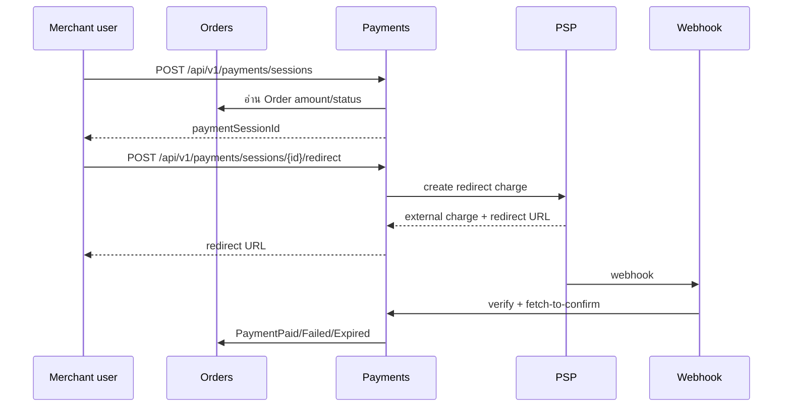

# Payment Orchestration Reference

> As-built 2026-08-07. เอกสารนี้อธิบาย `Payments` ตามโค้ดปัจจุบัน ไม่ใช่ canonical target design ใน spec เก่า.

## ขอบเขต

`Payments` เป็น redirect-only orchestration layer สำหรับ PSP. Platform ไม่เก็บข้อมูลบัตร ไม่ถือเงิน ไม่ทำ payout
และไม่ตัดสินยอดเอง.

Current flow:



ลูกค้าผ่าน capability route ได้ด้วย `GET /api/v1/orders/{token}/summary`, `POST /api/v1/orders/{token}/pay`
และ `POST /api/v1/orders/{token}/payment-status`.

## Payment session aggregate

Aggregate: `Payments.Domain.Session`.

| Field | กฎ |
|---|---|
| `MerchantId` | tenant boundary จาก actor/order |
| `OrderId` | commercial source of truth |
| `Amount` | อ่านจาก Order server-side; `Money` |
| `Method` | canonical `card`, `promptpay`, `installment` |
| `Psp` | PSP `Code` ที่เลือกจาก request/config |
| `Status` | `Created`, `Redirected`, `Paid`, `Failed`, `Expired` |
| `PspExternalChargeId` | external charge identifier, nullable ก่อน charge |
| `RedirectUrl` | hosted redirect URL, nullable ก่อน charge |
| `CreatedAt`, `UpdatedAt` | lifecycle timestamps |
| `RowVersion` | SQL Server optimistic concurrency token |

`OpenTtl` คือ 24 ชั่วโมง. Session อายุเกินถูก retire แบบ lazy ตอน create session; ไม่มี standalone expiry worker
สำหรับ session. Session ที่มี external charge ต้อง confirm กับ PSP ก่อน `MarkExpired`.

Status transition ที่ domain อนุญาต:

```text
Created -> Redirected -> Paid
Created -> Failed
Created -> Expired
Redirected -> Paid
Redirected -> Failed
Redirected -> Expired
Failed/Expired -> Paid เมื่อ PSP ยืนยัน late settlement
Paid -> Paid เฉพาะ external charge เดิม (idempotent)
```

## Create session

Command: `CreateSessionCommand(OrderId, MerchantId, Method, Psp)`. ไม่มี amount ใน request.

`CreateSessionHandler` ตรวจตามลำดับ:

1. normalize canonical method; malformed method ได้ `400`
2. อ่าน Order ภายใต้ merchant scope; ไม่พบได้ `404`
3. ตรวจ Order เปิด payment attempt ได้
4. `IDocumentSaleProbe` ตรวจเอกสารใน Order ยังขายได้
5. อ่าน merchant PSP connection
6. ตรวจ connection eligibility สำหรับ method
7. ตรวจ adapter รองรับ method
8. ตรวจ open session ต่อ Order

Open session behavior:

- session เดิม channel เดิม + PSP เดิม: คืน session เดิม
- session เดิมคนละ channel: `409`
- session หมดอายุ: confirm/release และ mint replacement ใน transaction ภายใต้ Order lock
- filtered unique index ป้องกัน open session มากกว่าหนึ่งต่อ Order

Endpoint:

```text
POST /api/v1/payments/sessions
```

Policy `merchant-user`, permission `payment.create`, user CSRF. Response ปัจจุบันคืน `paymentSessionId`.

## Start redirect

Endpoint:

```text
POST /api/v1/payments/sessions/{paymentSessionId}/redirect
```

Policy `merchant-user`, permission `payment.redirect`, user CSRF.

`StartRedirectHandler` ทำดังนี้:

1. อ่าน session แบบ merchant-scoped
2. ถ้ามี `RedirectUrl` แล้ว คืน URL เดิม; ไม่สร้าง charge ซ้ำ
3. ตรวจ connection eligibility ก่อน claim
4. เปลี่ยน `Created → Redirected` และ save ก่อนแตะ PSP โดยใช้ `RowVersion`
5. winner เท่านั้นสร้าง hosted charge
6. bind external charge id + redirect URL

ถ้า PSP ปฏิเสธแบบพิสูจน์ได้ว่าไม่มี charge ระบบ mark `Failed` เพื่อเปิด retry. Timeout/transport/5xx ที่อาจมี
charge แล้วไม่ mark failed; claim เดิมคงอยู่ และ retry ใช้ idempotency key เดิมจาก `Session.Id`.

## Webhook and confirmation

Endpoint:

```text
POST /api/v1/webhooks/{pspConnectionId:guid}
```

`HandlePspWebhookHandler`:

- resolve connection จาก route id ไม่ trust payload
- reveal secret จาก encrypted vault
- verify signature; invalid payload ถูก reject
- parse event และ resolve session จาก external charge
- fetch-to-confirm กับ PSP
- เทียบ amount/currency กับ Order/Session
- transition Session และ enqueue cross-module event ใน transaction เดียว

Webhook เป็น source of truth. Browser return หรือ customer status route ไม่รับ status จาก query string.
Duplicate event และ redelivery เป็น idempotent; ambiguous fetch ทำให้ PSP retry ได้.

Events ที่ current code ใช้:

- `Contracts.PaymentPaid`
- `Contracts.PaymentFailed`
- `Contracts.PaymentExpired`

`Orders.Application` consume event ด้วย `OrderId` เป็น join key. `Order.PaymentSessionId` ไม่ใช่ production event
join key.

## Customer capability routes

| Route | Behavior |
|---|---|
| `GET /api/v1/orders/{token}/summary` | anonymous summary; unknown `404`, expired `410` |
| `POST /api/v1/orders/{token}/pay` | create/resume session ตาม channel ใน Order แล้ว return PSP redirect URL |
| `POST /api/v1/orders/{token}/payment-status` | confirm payment กับ PSP เมื่อจำเป็น; คืน `paid`, `failed`, `pending`, `cancelled` |

Opaque summary token เป็น capability. Response ไม่คืน merchant id, internal payment session id, PSP secret หรือ
provider raw error. Rate limiting อยู่ customer payment routes.

Summary token TTL คือ 72 ชั่วโมง. `POST /api/v1/orders/{orderId}/summary/resend` rotate token และต่ออายุ TTL.

## PSP boundary

Ports อยู่ `src/Modules/Payments/Payments.Application/Ports`:

- `IPspAdapter`
- `IPspAdapterFactory`
- `PspCharge`
- webhook parse/verify contracts
- `IConnectionRepository`
- `IVaultSecretStore`

PSP credentials อยู่ encrypted vault และใช้เฉพาะ server-side call. ห้ามส่ง credential, raw webhook, external
charge id หรือ redirect URL เข้า log โดยไม่จำเป็น.

Connection eligibility และ adapter capability เป็นคนละ gate: connection อาจไม่เปิด method แม้ adapter จะรองรับ
หรือ adapter อาจยังไม่รองรับ method ที่ connection เปิดไว้.

## Persistence

`txn.PaymentSessions` และ `txn.PspConnections` อยู่ `MerchantRuntimeDbContext`.

`PaymentSessions` มี:

- filtered unique index กัน open session ต่อ Order
- `RowVersion` สำหรับ redirect claim
- merchant query filter
- indexes สำหรับ `OrderId` และ external charge lookup

`txn.OutboxMessages.Payload` เป็น `nvarchar(max)` ไม่ใช่ native JSON column. Native JSON allowlist ดู
[`entity-fields.md`](entity-fields.md).

Migration chain ปัจจุบัน:

1. `20260807042818_InitialSchema`
2. `20260807042828_SecurityObjects`
3. `20260807042833_SeedData`
4. `20260808161508_OneBasedPersistedEnumStorage`

ไม่มี SQL RLS; merchant isolation ใช้ app query filter และ guarded write.

## Current routes

| Method | Route | Policy |
|---|---|---|
| `POST` | `/api/v1/payments/sessions` | `merchant-user` + `payment.create` + CSRF |
| `POST` | `/api/v1/payments/sessions/{paymentSessionId}/redirect` | `merchant-user` + `payment.redirect` + CSRF |
| `GET` | `/api/v1/payments/sessions/{paymentSessionId}` | `merchant-user` |
| `POST` | `/api/v1/webhooks/{pspConnectionId:guid}` | PSP verification boundary |
| `GET` | `/api/v1/orders/{token}/summary` | anonymous capability |
| `POST` | `/api/v1/orders/{token}/pay` | anonymous capability + rate limit |
| `POST` | `/api/v1/orders/{token}/payment-status` | anonymous capability + rate limit |

## Non-goals

- ไม่รับ/เก็บ PAN หรือ card form
- ไม่ทำ payout, settlement ledger, wallet, fee หรือ billing
- ไม่เลือก amount/currency จาก client
- ไม่ถือ browser return เป็น payment truth
- ไม่ใช้ audience-first `/api/admin/v1`, `/api/producer/v1` หรือ `/api/customer/v1`
- ไม่สร้าง persisted Checkout หรือ PaymentAttempt aggregate แยกจาก `Session` ใน current code

## Source of truth

- `src/Modules/Payments/Payments.Domain/Session.cs`
- `src/Modules/Payments/Payments.Domain/SessionStatus.cs`
- `src/Modules/Payments/Payments.Application/CreateSession/CreateSessionHandler.cs`
- `src/Modules/Payments/Payments.Application/StartRedirect/StartRedirectHandler.cs`
- `src/Modules/Payments/Payments.Application/HandlePspWebhook/HandlePspWebhookHandler.cs`
- `src/Modules/Payments/Payments.Application/ConfirmPaymentStatus/ConfirmPaymentStatusHandler.cs`
- `src/Hosts/Api/Program.cs`
- `src/Persistence/Persistence.MerchantRuntime/Payments/`
