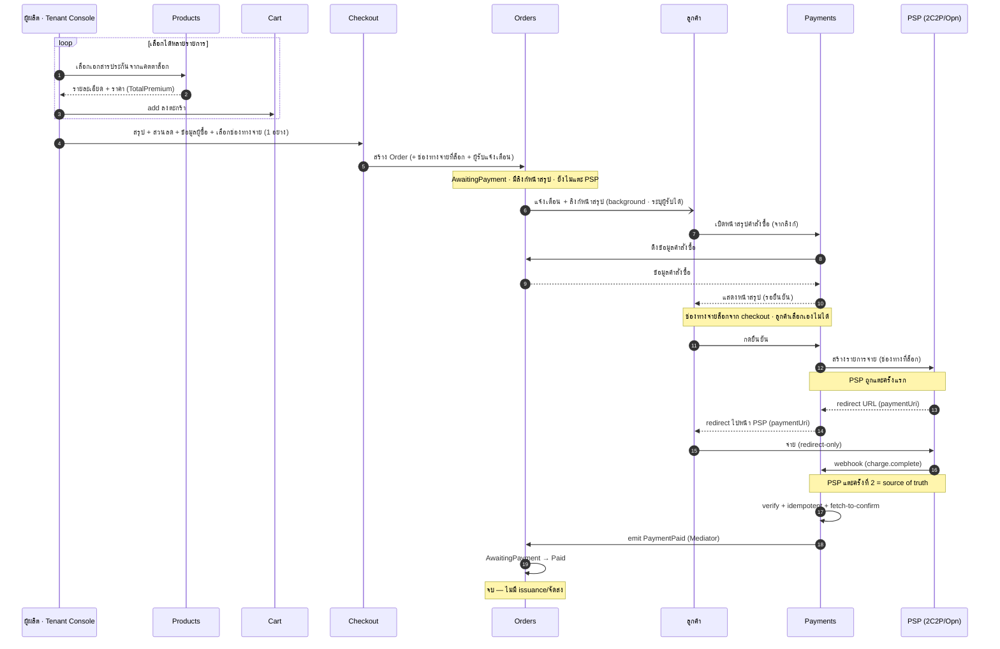
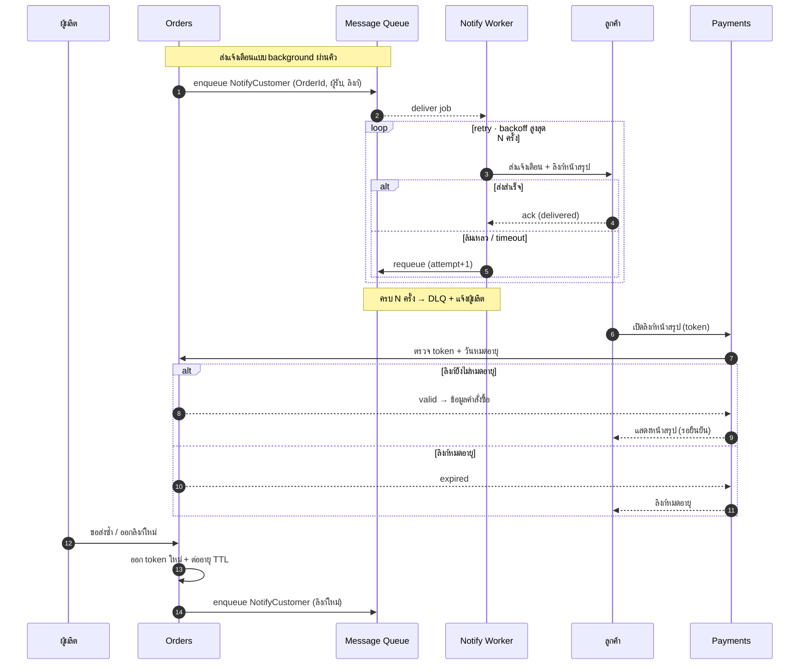
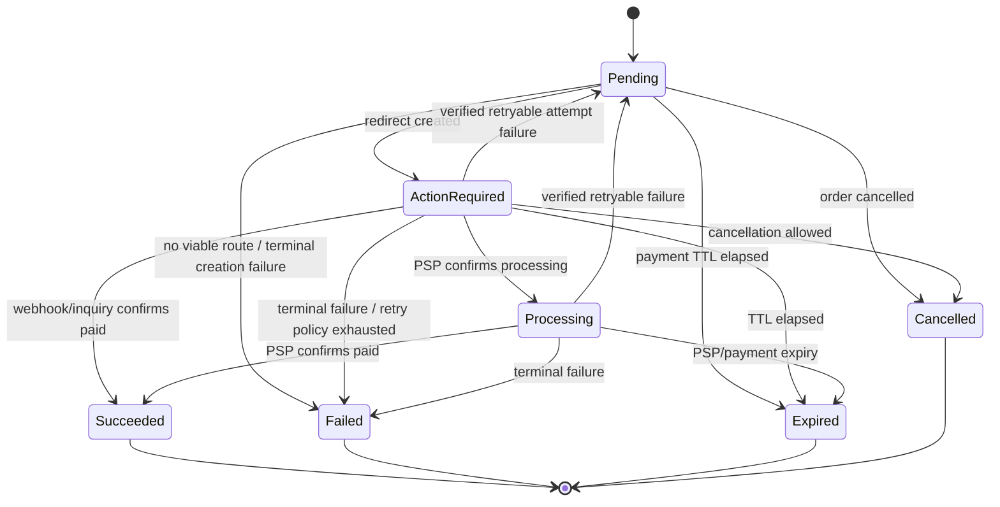
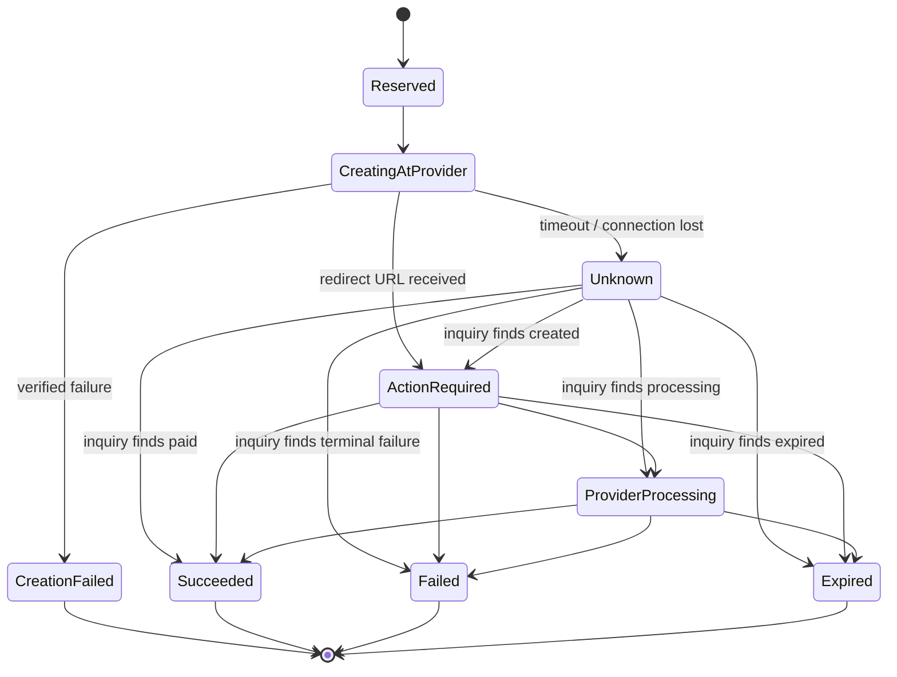
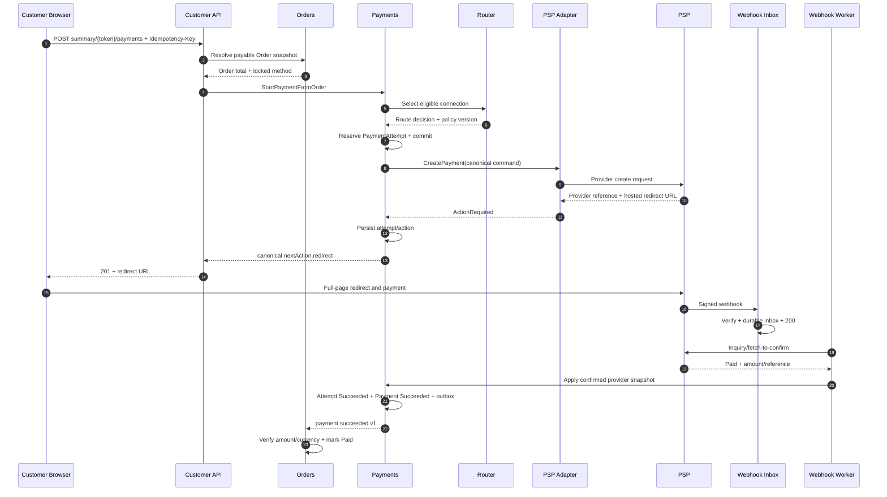
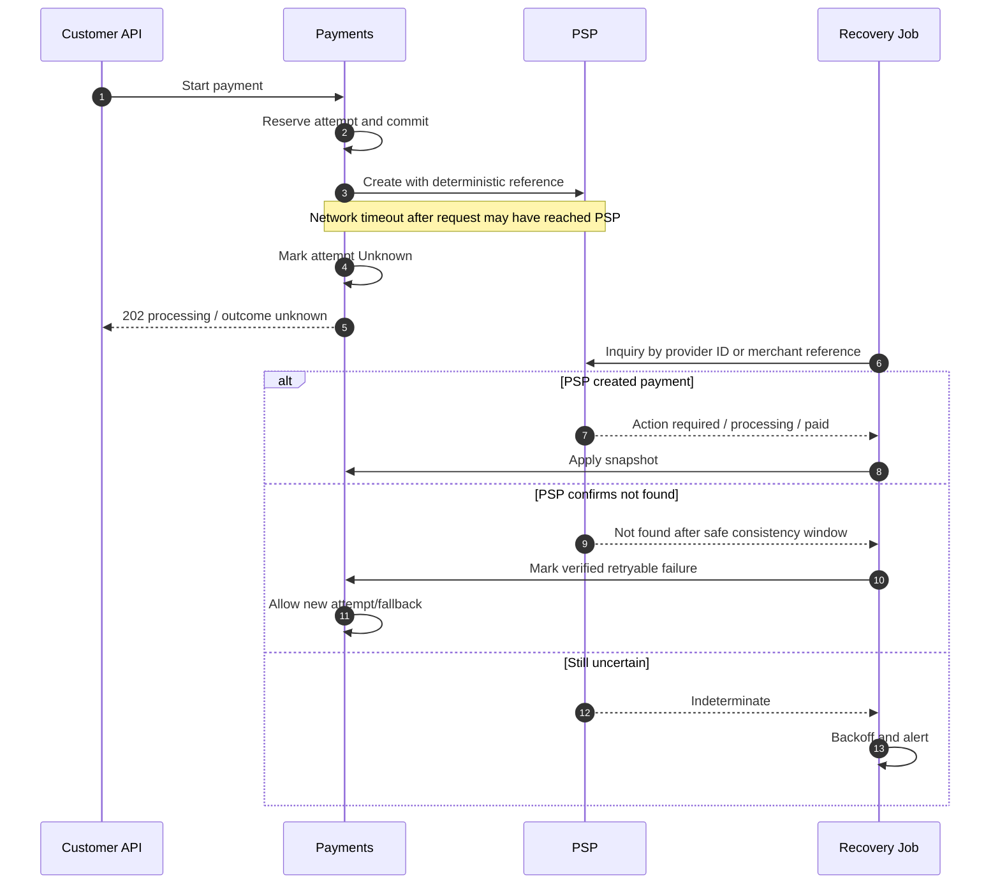
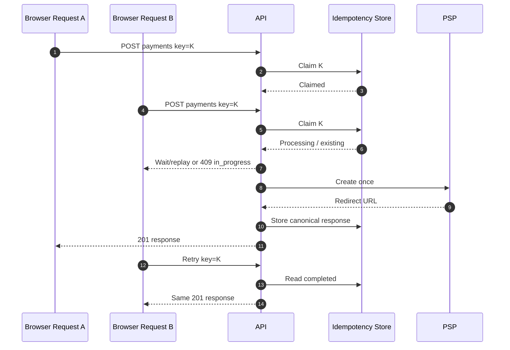

# สรุปโมดูลและบทบาท — Internal Payment Orchestration Platform (captive)

> **[as-built sweep 2026-07-25]** ภาค 1-7 + Naming ถูกไล่เทียบกับโค้ดจริงรอบนี้แล้ว — ชื่อ entity/table/schema,
> route, isolation floor และสถานะ adapter อัปเดตตรงกับ `src/` ณ วันที่นี้. **สองเรื่องที่เปลี่ยนจากเวอร์ชันก่อน
> อย่างมีนัยสำคัญ:** (1) **ไม่มี SQL Server RLS ในระบบแล้ว** — isolation floor ย้ายไป app layer ทั้งหมด
> (EF global query filter + sealed write guard, principal เดียว `pol_app`) ตั้งแต่ spec `rls-to-query-filter`;
> (2) actor/entity rename จาก `rf1-schema-reset` + `admin-actor-rename` มีผลแล้ว (`Tenant`→`Merchant`,
> `AdminAccount`→`Admins.Domain.Users.User`, `ProducerAccount`→`Merchants.Domain.Users.User`,
> `Money.MinorUnits`→`DECIMAL(19,4)`).
>
> **[as-built sweep 2026-07-26 — payment path only]** spec `captive-payment-alignment` ปรับ as-built ของ
> เส้นทางการจ่ายให้ตรง canon captive (ไม่เพิ่มฟีเจอร์). ย่อหน้าที่ถูกแก้ในรอบนี้: §3.1 create session
> (ยอดมาจากแถว order เท่านั้น + ลำดับตรวจ 8 ขั้น) · §3.1 start redirect (eligibility recheck ก่อน claim +
> `MarkFailed` เมื่อ charge ล้ม) · §3.1 return handler (backend URL เป็นต่อ connection แล้ว) · §3.1 webhook
> (เทียบยอดที่ PSP รายงานก่อน `MarkPaid`) · §3.2 method router (มี eligibility 2 ชั้นแล้ว) · ภาค 4 ตาราง
> `IPspAdapter` (signature + return type ใหม่) · §4.1 + §5.1 `paymentChannel` (มาจาก `Session.Method`).
> **สิ่งที่ยังเปิดอยู่และห้ามอ่านเป็นปิดแล้ว:** Omise webhook HMAC (§4.2), promptpay/installment ที่ adapter
> ยังทำไม่ได้ (§5), การเทียบยอดเมื่อ PSP ไม่ส่งยอดกลับ, และ session expiry sweeper (`MarkExpired` ยังไม่มี
> ผู้เรียก) — ทะเบียนเหตุผล + next step ต่อข้อ: [platform-modules.md](platform-modules.md) §ช่องว่าง.
>
> canon ที่ต้องยึดเมื่อขัดกับเอกสารนี้: [`ARCHITECTURE.md`](../../.ai/shared/ARCHITECTURE.md) ·
> [`CODING_STANDARDS.md`](../../.ai/shared/CODING_STANDARDS.md) ·
> [`db-connection-and-rls.md`](db-connection-and-rls.md) (isolation floor ปัจจุบัน, current-state reference)
>
> **ยังคงเป็นภาษาเชิงออกแบบ (ไม่ใช่ as-built):** คำว่า "Tenant Console" ในภาค 1-7 = **Merchant Console** ของจริง
> (แอปเดียวที่ 3 บริษัทใช้ร่วม) — prose ยังไม่ถูก rename ทั้งฉบับเพราะ `PROJECT_CONTEXT.md` เองก็ยังใช้คำเดิม;
> ชื่อ **entity/table/route** ในเอกสารนี้เป็นชื่อจริงแล้ว.

> โมเดล **captive / internal** · redirect-only · multi-tenant · ไม่ถือเงิน · ใช้ฟรีภายในเครือ
> Tenant: **vPrivilege · vCommerce · vSouvenir** · PSP ปลายทาง: 2C2P + Omise/Opn
> เวอร์ชันอัปเดต: สะท้อนการตัดสินใจล่าสุด (2 SaaS console, no payout, no fee, captive)
>
> **[intake 2026-07-05]** ไฟล์นี้รวมสองส่วน: ภาค 1-7 + Naming = canon เดิม (design แรก + as-built
> mechanics — PSP mechanics, provisioning payload, naming ยังใช้ต่อ) และ
> [ภาค 8 Canonical Payment API](#8-canonical-payment-api--target-design-normative) = **normative
> target design** ที่รับเข้า 2026-07-05 — จุดของเดิมที่ถูก supersede มี annotation กำกับรายจุด;
> module map + สถานะ as-built ต่อฟีเจอร์ดูที่ [platform-modules.md](platform-modules.md)

---

## ภาพรวม

**ทั้งระบบคือ scope เดียวกัน — SaaS อีคอมเมิร์ซประกันภัย** ที่มี 5 โมดูลอยู่ใน scope เดียว (**Products · Cart · Checkout · Orders · Payments**) คุยกันผ่าน **Mediator (martinothamar/Mediator)** แบบ modular ไม่อ้างถึงกันตรง · เอกสารนี้ลงรายละเอียด **โมดูล Payments** เป็นหลัก (โมดูลที่ build out มากสุด)

โมดูล Payments นี้คือ **แพลตฟอร์ม orchestration การชำระเงินภายในเครือ** ที่ให้บริษัทในเครือ (vPrivilege/vCommerce/vSouvenir) รับชำระเงินผ่าน PSP ที่ถือใบอนุญาตอยู่แล้ว — คุณ **"ใช้" PSP ไม่ใช่ "เป็น" PSP** และ **เงินจริงไม่วิ่งผ่านแพลตฟอร์ม**

แบ่งเป็น 2 ระนาบที่แยกขาดกัน:
- **Control plane** — การตั้งค่า/กำกับดูแล (console → backend) ไม่แตะเส้นทางเงิน
- **Data plane** — request การจ่าย + สถานะ (ไม่ใช่ตัวเงิน เงิน settle ตรงจาก PSP เข้าบริษัท)

หลักการที่บังคับทั้งระบบ: **multi-merchant isolation ที่ app layer** (EF global query filter อ่าน + sealed write guard เขียน — **ไม่มี SQL RLS แล้ว**, ดู [db-connection-and-rls.md](db-connection-and-rls.md)), **redirect-only (PCI SAQ A รายนิติบุคคล)**, **webhook = source of truth**, **maker-checker สำหรับ action อ่อนไหว**, **idempotency**, **credential vault security**, **แยก Merchant/Admin console เป็นคนละแอป (blast radius)**

ชั้นจากบนลงล่าง: ช่องทางบริษัทในเครือ → control plane (2 console) → platform core → PSP adapter → PSP (ใน PCI scope) โดยเงิน settle จาก PSP เข้าบัญชีบริษัทโดยตรง

---

## ขอบเขตงาน (in scope) — ทั้ง SaaS

**ทั้งระบบคือ scope เดียวกัน** — SaaS อีคอมเมิร์ซประกันภัยที่มี 5 โมดูลอยู่ใน scope เดียวกัน คุยกันผ่าน Mediator แบบ modular:

| โมดูลใน SaaS (in scope) | บทบาท | เทียบอีคอมเมิร์ซ |
|---|---|---|
| **Products** | เอกสารประกันที่ขายได้ (ใบสมัคร/กรมธรรม์/ต่ออายุ/สลักหลัง) ในแคตตาล็อกกลาง — **read-only over HTTP** ไม่มี quote | สินค้า / SKU |
| **Cart** | ตะกร้าสินค้า — รวมเอกสารประกันที่เลือกจากแคตตาล็อก (แก้ไขได้) | ตะกร้า / cart |
| **Checkout** | หน้าสรุปคำสั่งซื้อ + ส่วนลด + ข้อมูลผู้ซื้อ + **เลือกช่องทางจ่าย 1 ช่องทาง (ล็อก)** + ตั้งค่าผู้รับแจ้งเตือน → สร้าง Order | checkout |
| **Orders** | ข้อมูลคำสั่งซื้อ + **ลิงก์**ไปหน้าสรุป (ที่ Payments ให้บริการ) · **ส่งแจ้งเตือน + ลิงก์ให้ลูกค้าแบบ background** (ระบุผู้รับได้) · `AwaitingPayment` **ยังไม่แตะ PSP** · รับ `PaymentPaid` → Paid | คำสั่งซื้อ / order |
| **Payments** | **หน้าจอสรุปคำสั่งซื้อสำหรับลูกค้า** (ดึงข้อมูลจาก Orders) · ลูกค้ากดยืนยัน → สร้าง **รายการจ่ายกับ PSP** + redirect URL (`PspCharge.RedirectUrl`) → รับชำระ redirect-only, captive | ชำระเงิน / payment |

Flow ใน SaaS: Products → **Cart** → **Checkout** → Orders → **Payments** · จบที่ **"รับชำระเสร็จ → emit `PaymentPaid`"** — SaaS **ไม่มีขั้นจัดส่ง/ออกกรมธรรม์ (issuance)**

**ผู้เกี่ยวข้อง:** *ผู้ผลิต (Tenant Console)* = ผู้เลือกเอกสารประกันจากแคตตาล็อก → ตะกร้า → checkout · *ลูกค้า* = เปิดลิงก์หน้าสรุปคำสั่งซื้อ → กดยืนยัน → จ่าย (เท่านั้น)

> **ลำดับสำคัญ:** สร้าง Order **ไม่ได้สร้างรายการกับ PSP** — Order อยู่ `AwaitingPayment` + มีลิงก์ไปหน้าสรุป · รายการกับ PSP (`PspCharge.RedirectUrl`) ถูกสร้างใน **Payments เมื่อลูกค้าเปิดหน้าสรุป (ของ Payments) แล้วกดยืนยัน** → Orders ไม่ผูกกับ PSP โดยตรง เปลี่ยน/เพิ่ม PSP ได้โดยไม่แตะ Orders

> **การแจ้งเตือน (background):** Orders ส่งผ่าน **Message Queue → Notification Worker** · ล้มเหลว → **retry แบบ backoff** สูงสุด N ครั้ง → ครบแล้วเข้า **DLQ** + แจ้งผู้ผลิต · **ลิงก์หน้าสรุปมี TTL** เปิดหลังหมดอายุ = error · **ส่งซ้ำ / ออกลิงก์ใหม่** = Orders ออก token ใหม่ + ต่ออายุ แล้ว enqueue รอบใหม่
>
> **[as-built 2026-07-25]** ไม่มี message broker แยกและ **ไม่มี DLQ** — ของจริงคือ **transactional outbox
> ในตาราง `txn.OutboxMessages`** (`Attempts`/`Error`/`LeaseOwner`/`LeaseExpiresAt`) drain โดย
> `IHostedService` **ใน process ของ Api เอง** (host `Worker` ถูกลบทิ้งทั้งโปรเจกต์แล้ว —
> `multi-tier-deployment`). event คือ `Contracts.CustomerOrderNotification(MerchantId, OrderId, Recipient,
> SummaryToken, OccurredAt)`. **TTL จริง = `Order.SummaryTokenTtl` 72 ชั่วโมง (hardcoded)**;
> เปิดหลังหมดอายุ → **410 Gone**, token ไม่รู้จัก → 404. ส่งซ้ำ = `POST /api/v1/orders/{orderId}/summary/resend`
> ซึ่ง **rotate token ใหม่ + ต่ออายุ 72h** (ลิงก์เดิมตายทันที)

> **ช่องทางชำระเงิน:** Checkout เลือก **1 ช่องทางต่อ Order** (บัตร / PromptPay / ผ่อน อย่างใดอย่างหนึ่ง) แล้ว **ล็อก** — ลูกค้า **เลือก/เปลี่ยนเองไม่ได้** ที่หน้าสรุป · Payments สร้างรายการ PSP ตามช่องทางที่ล็อกไว้ (routing primary/fallback เป็นเรื่องภายในของช่องทางนั้น)

> เอกสารนี้ลงรายละเอียด **โมดูล Payments** เป็นหลัก (หัวข้อ 1–7) · Products/Cart/Checkout/Orders มีสเปกของตัวเองแยก แต่ทั้งหมดอยู่ใน **scope เดียวกันของ SaaS**

**โมดูล Payments ทำอะไร:**
- รับ payment intent จากช่องทางของบริษัทในเครือ → ออก **redirect ไปหน้า PSP** (สัญญากลางรูปทรงเดียวทุก PSP)
- รับผลจริงทาง **webhook (source of truth)** → verify ลายเซ็น + fetch-to-confirm → อัปเดตสถานะ → emit `PaymentPaid`
- **Multi-tenant provisioning** — Admin Console สร้าง tenant + เก็บ PSP credential/config ต่อบริษัท (vault)
- **2 SaaS console** (Tenant/Admin) คนละแอป + **RBAC** + **identity (Google SSO)**
- **PSP adapter** 2C2P + Omise/Opn — redirect-only ครบ 3 ช่องทาง (บัตร/PromptPay/ผ่อน)
- **Reconciliation = reporting**, retry/dunning, idempotency, audit log

**โมเดล Payments (captive):**
- **Captive** — เปิดเฉพาะ 3 นิติบุคคลในเครือ (allowlist) ไม่รับคนนอก
- **No payout** — เงิน settle จาก PSP เข้าบัญชี merchant ของแต่ละบริษัท **โดยตรง** → อยู่นอก funds flow
- **Free** — ไม่มี billing/ค่าบริการ
- **Regulatory** — captive + ไม่ถือเงิน → เป็น merchant/tech provider ไม่เข้าข่ายใบอนุญาตประเภทที่ 3 ของ ธปท. ใบอนุญาตอยู่ที่ PSP *(ควรคอนเฟิร์ม ธปท. หากนิติบุคคลไม่ได้อยู่ใต้การควบคุมเดียวกัน หรือวันใดเปิดให้คนนอกใช้)*
- **PCI** — SAQ A รายนิติบุคคล (redirect-only ไม่แตะข้อมูลบัตร)

**รอยต่อข้ามโมดูล (Payments ↔ Orders) ที่ต้องระวัง:**
- ชนิดเงินที่ seam `PaymentPaid` — `Amount` เป็น `Money` (SharedKernel) ใช้ร่วมทุกโมดูลแล้ว — ห้ามถอยกลับไป scalar/decimal ที่ seam
- **verify amount/currency** ตอน Orders รับ `PaymentPaid` ไม่ใช่แค่ id (กันจ่ายไม่ครบ/สกุลผิด) — ทำแล้วใน `Order.MarkPaid`
- **correlation:** Orders จับคู่ order ด้วย **`PaymentPaid.OrderId`** (field ชั้นหนึ่งของ contract; PR #44, spec `bugfix-order-paid-link`) — `Order.PaymentSessionId` เป็น legacy ไม่มี production writer ห้ามใช้เป็น join key
- **contract จริง:** `Contracts.PaymentPaid(PaymentSessionId, OrderId, MerchantId, Amount, PspCode, ExternalChargeId, EventId, OccurredAt)` เป็น `INotification` ส่งผ่าน **transactional outbox** (at-least-once) → `Orders.Application.OrderPaidConsumer` ซึ่ง idempotent · เป็น **integration event ข้ามโมดูลตัวเดียวที่ Payments emit**

---

## ลำดับเหตุการณ์ E2E (sequence)

ไดอะแกรมเรนเดอร์ด้วย mermaid.js (โหลดจาก CDN — ต้องต่อเน็ตครั้งแรก)

### เส้นทางหลัก (happy path)



### การแจ้งเตือน (Message Queue + retry) และวงจรลิงก์ (หมดอายุ/ส่งซ้ำ)



---

## นอกขอบเขต — ฟังก์ชันที่ "ห้าม implement"

> สิ่งเหล่านี้อยู่ **นอก scope ของ SaaS โดยตั้งใจ** — ถ้าเพิ่มเข้ามาจะเปลี่ยนสถานะทางกฎหมายและขยาย PCI scope ทันที **ห้าม implement และห้าม "ช่วยเพิ่มให้เอง"**

1. **ห้ามสร้าง settlement / payout engine** — ระบบต้องไม่รับ ถือ หรือจ่ายเงินต่อ ไม่มี money ledger / wallet / float / escrow / disbursement เงิน settle จาก PSP เข้าบัญชี merchant ของแต่ละบริษัทโดยตรง (เราอยู่นอก funds flow เสมอ)
2. **ห้ามทำ billing / เก็บค่าบริการ** — ใช้ฟรี ไม่มี subscription / invoice / usage metering เพื่อเรียกเก็บเงิน / fee deduction
3. **ห้ามทำ public หรือ self-serve onboarding สำหรับคนนอก** — onboarding เป็น allowlist เฉพาะ vPrivilege / vCommerce / vSouvenir ไม่ต้องต่อ KYB/AML provider ของ merchant ภายนอก ไม่ต้องมีหน้าสมัครแบบเปิด
4. **ห้ามแตะข้อมูลบัตร** — ห้าม collect / store / transmit / tokenize PAN ห้ามมี card input field / hosted-fields / iframe ที่รับข้อมูลบัตรบนโดเมนเรา (ตัด client-side tokenization เช่น Omise.js card ออกทั้งหมด)
5. **ห้ามสร้างฟังก์ชันของ PSP / acquirer เอง** — ไม่มี acquiring, card scheme connectivity, 3DS/ACS, payment processing เราเป็น merchant/orchestrator ที่ "ใช้" 2C2P/Omise ไม่ใช่ "เป็น" PSP
6. **ห้าม flow แบบ non-redirect** — ห้ามทำ display-QR-บนหน้าเรา, iframe, hosted-fields หรือ flow ใดที่ render UI การจ่ายบนโดเมนเรา ใช้ **full redirect ไปหน้า PSP เท่านั้น** (เพื่อคง SAQ A)
7. **Reconciliation = reporting เท่านั้น** — ห้ามสร้างลอจิกที่เคลื่อนเงิน/ปรับยอดจริง เป็นการกระทบยอดเพื่อแสดงผลเท่านั้น

> **หมายเหตุสำหรับ AI agent ที่พัฒนาระบบ:** ถ้าเจอ requirement, ticket หรือไอเดียที่นำไปสู่ข้อใดข้างต้น ให้ **หยุดและถามก่อน** อย่า implement เอง แม้จะดู "เป็นประโยชน์" — เพราะกระทบสถานะใบอนุญาตและ PCI scope ของทั้ง SaaS

---

## 1. ชั้นช่องทาง (Channels)

### เก็บเบี้ย / รับชำระ (premium / payment in)
- **บทบาท:** จุดที่ลูกค้าของแต่ละบริษัทในเครือกดจ่าย (ออนไลน์/แอป/ช่องทางของบริษัทนั้น)
- **อินพุต:** การกระทำของลูกค้า + ข้อมูลรายการ
- **เอาต์พุต:** payment intent ส่งเข้า Create session
- **หมายเหตุ:** ไม่มี disbursement/payout ผ่านแพลตฟอร์ม (ถูกตัดในโมเดล captive)

---

## 2. Control plane — แยกเป็น 2 SaaS apps

ทั้งสองแอปเป็นคนละ frontend/คนละ deploy แต่ **นั่งบน backend + data ชุดเดียวกัน**

### 2.1 Tenant Console (SaaS app #1)
- **บทบาท:** แอปเดียวที่ทั้ง 3 บริษัทใช้ร่วมกัน โดย scope ต่อรายผ่าน tenant context จากตอน login
- **หน้าที่หลัก:** ดู dashboard/รายงาน/reconciliation เฉพาะตน, ตั้งค่าระดับที่อนุญาต — **ไม่ได้สร้าง tenant หรือกรอก PSP credential เอง** (admin provision ให้)
- **คุณสมบัติ:** public-facing · เห็นเฉพาะข้อมูล tenant ตน
- **หมายเหตุ:** ไม่มี code path ไปฟังก์ชัน admin เลย

### 2.2 Admin Console (SaaS app #2)
- **บทบาท:** แอปของทีมกลาง เข้าถึงข้ามทุก tenant
- **หน้าที่หลัก:** **สร้าง/provision Tenant Console ให้แต่ละบริษัท**, กรอกและเก็บ PSP integration config + credential รายบริษัทลง vault, ตั้ง webhook/return URL mapping ต่อ tenant, จัดการ tenant/allowlist, ตั้ง routing, มอนิเตอร์, audit
- **คุณสมบัติ:** **internal-only** (VPN/IP allowlist, MFA เข้มกว่า, แยก identity provider) · แยก deploy/codebase เพื่อลด blast radius
- **หมายเหตุ:** เป็น control plane ตัวจริง — ฟังก์ชันอำนาจสูงทั้งหมดอยู่ที่นี่

### 2.3 Permission model (RBAC)
- **โครงสร้าง:** สิทธิ = Scope × Resource × Action
- **Role ใน Tenant Console:** Tenant Admin / Finance / Viewer (scope = tenant ตนเท่านั้น)
- **Role ใน Admin Console:** Platform Owner / Operator / Risk & Compliance / Support (scope = ทุก tenant)
- **maker-checker:** ใช้กับ action อ่อนไหว เช่น approve tenant ใหม่, เปลี่ยน routing rule, แก้ allowlist
- **บังคับใช้:** การแยกแอปเป็นแค่หน้าบ้าน — เส้นป้องกันจริงคือ **backend authorization แยก permission scope ให้ขาด** endpoint ของ admin (cross-tenant/approve/config) ต้องเรียกผ่าน session ของ Tenant Console ไม่ได้

### 2.4 Provisioning (admin-driven)
- **ลำดับ:** Admin สร้าง tenant → Admin กรอก PSP config + credential รายบริษัท (เก็บลง vault) → ตั้ง webhook/return URL mapping ต่อ tenant → provision Tenant Console + พื้นที่ข้อมูลแยก → tenant พร้อมใช้
- **บทบาท:** ทีมกลาง provision ทั้งหมดผ่าน Admin Console (ไม่ใช่ self-serve ของ tenant) เหมาะกับ captive เพราะ 3 บริษัทอยู่ในเครือ ทีมกลางถือ credential ได้
- **ขอบเขต:** เฉพาะ vPrivilege / vCommerce / vSouvenir (allowlist) · ไม่มี billing
- **ข้อมูลที่ provision (data model, as-built):** `Merchant` → `merch.Merchants` (Code/DisplayName/LegalEntityId/Status/Country/Currency/EnabledChannels + `Metadata` json) → `Payments.Domain.Psp.Connection` → `txn.PspConnections` ต่อ PSP (MerchantId, Psp, EnabledMethods csv, **`SecretRefName`**, `Metadata` json, IsEnabled) → `VaultSecretBlob` → `merch.VaultSecrets` คีย์ด้วย (MerchantId, `Name`) เก็บ ciphertext + `Hint` (last-4, ไม่ใช่ secret) · runtime: `Payments.Domain.Session` → `txn.PaymentSessions` อ้าง **MerchantId + OrderId + Psp** (ไม่ได้อ้าง ConnectionId)
- **`PspConnection` ไม่มีคอลัมน์ `WebhookPath`** — path/return URL ที่ admin ส่งมาเก็บลง `Metadata` json verbatim; ส่วน endpoint/return URL ที่ adapter ใช้จริงตอน runtime มาจาก config section `Psp` (appsettings/env, `PspOptions`) ซึ่งเป็น **global ต่อ deployment ไม่ใช่ต่อ connection** — ช่องว่างที่ยังไม่ปิด
- **1 connection = 1 vault entry ไม่ใช่ 1 secret field = 1 แถว** — plaintext ที่ reveal คืน **JSON envelope camelCase** ก้อนเดียวที่รวมทุก field ของ PSP นั้น (2C2P: `{merchantId, secretKey}` · Omise: `{secretKey, publicKey?, webhookSecret?}`) — shape เป็นเจ้าของโดย `IPspSecretEnvelopeFactory` (`Payments.Application`) และ adapter ทุกตัวต้อง agree
- **การอ่านตอน runtime:** handler อ่าน `Connection` → `IVaultSecretStore.RevealAsync(merchantId, connection.SecretRefName)` → adapter parse envelope → เรียก 2C2P/Omise → เขียน `Session`

#### Config payload (admin submit)

ตัวอย่าง payload เต็ม (100%) ที่ทีมกลางกรอกผ่าน Admin Console — vCommerce ใช้ทั้ง 2C2P + Omise โดยทั้ง 2 PSP เปิดครบ 3 ช่องทาง:

> **[as-built 2026-07-25]** endpoint จริงคือ **`POST /api/v1/merchants`** (Super-only + CSRF filter) และ
> **top-level key คือ `merchant` ไม่ใช่ `tenant`** (`ProvisionMerchantRequest`). ตัวที่เป็นคอลัมน์จริงมีแค่
> `code`/`displayName`/`legalEntityId`/`country`/`currency`/`enabledChannels` — คีย์อื่นใต้ `merchant`
> (`status`/`timezone`/`locale`/`branding`/`routing`/`session`/`createdByAdmin`/…) ถูกจับด้วย
> `[JsonExtensionData]` แล้วเก็บลง `Merchant.Metadata` **verbatim** (รวม `status` — ค่าจริงตอนสร้างบังคับเป็น
> `Active` เสมอ, payload เปลี่ยนไม่ได้). ในแต่ละ `pspConnections[]` เช่นกัน: `psp`/`enabledMethods`/`merchantId`/
> `secrets` เป็น field จริง ที่เหลือทั้งหมดลง `Connection.Metadata` verbatim. `AdminSubject` + correlation id
> **ไม่อยู่ใน body** — host อ่านจาก authenticated request. guard `RejectSecretsInConfig` ตอบ 400 ถ้าพบ
> `secretKey`/`publicKey`/`webhookSecret` โผล่ **นอก** ก้อน `secrets`.

```json
{
  "merchant": {
    "code": "vcommerce",
    "displayName": "vCommerce Co., Ltd.",
    "legalEntityId": "0105560000000",
    "status": "active",
    "country": "TH",
    "currency": "THB",
    "timezone": "Asia/Bangkok",
    "locale": "th-TH",
    "enabledChannels": ["card", "promptpay", "installment"],
    "branding": {
      "statementName": "VCOMMERCE",
      "supportEmail": "support@vcommerce.co.th",
      "logoUrl": "https://cdn.vgroup.internal/vcommerce/logo.png"
    },
    "routing": {
      "card":        { "primary": "2c2p",  "fallback": "omise" },
      "promptpay":   { "primary": "2c2p",  "fallback": null },
      "installment": { "primary": "omise", "fallback": "2c2p" }
    },
    "session": {
      "expiryMinutes": 30,
      "idempotencyTtlHours": 24
    },
    "createdByAdmin": "ops-007"
  },
  "pspConnections": [
    {
      "psp": "2c2p",
      "environment": "production",
      "merchantId": "764764000012345",
      "currencyCode": "764",
      "enabledMethods": ["card", "promptpay", "installment"],
      "card": { "secure3ds": true },
      "installment": { "terms": [3, 6, 10], "banks": ["KBANK", "BAY", "SCB", "BBL"] },
      "frontendReturnUrl": "https://pay.vgroup.internal/return/vcommerce/2c2p",
      "backendReturnUrl": "https://pay.vgroup.internal/webhook/vcommerce/2c2p",
      "webhookPath": "/webhook/vcommerce/2c2p",
      "locale": "th",
      "secrets": {
        "secretKey": "<2c2p merchant secret key · JWT signing · write-only>"
      }
    },
    {
      "psp": "omise",
      "environment": "production",
      "accountId": "acct_5xxxxxxxxxxxxxxx",
      "apiVersion": "2019-05-29",
      "enabledMethods": ["card", "promptpay", "installment"],
      "card": { "via": "links_api", "secure3ds": true },
      "promptpay": { "via": "payment_links_plus" },
      "alternativeMethods": { "via": "source_charge" },
      "enabledSources": ["installment_kbank", "installment_bay", "installment_scb"],
      "installment": { "terms": [3, 6, 10], "minAmountThb": 3000 },
      "returnUri": "https://pay.vgroup.internal/return/vcommerce/omise",
      "webhookPath": "/webhook/vcommerce/omise",
      "secrets": {
        "publicKey": "pkey_xxxxxxxxxxxxxxxx",
        "secretKey": "<omise skey · server-side API · write-only>",
        "webhookSecret": "<omise webhook signing secret · write-only>"
      }
    }
  ]
}
```

**Field reference (ที่เพิ่มจากเวอร์ชันย่อ):**
- `merchant.routing` — เพราะทั้ง 2 PSP ทำได้ครบ 3 ช่องทาง ต้องระบุ **primary/fallback ต่อช่องทาง** (เช่น installment → Omise ก่อน, ตกไป 2C2P) feed เข้า Method router
  > **[as-built 2026-07-25]** ยัง **ไม่มีโค้ดอ่านค่านี้** — เก็บลง `Merchant.Metadata` เฉย ๆ; PSP ที่ใช้จริงมาจาก
  > `Psp` ใน request body ของ `POST /api/v1/payments/sessions` (ผู้เรียกเลือกเอง) ไม่ใช่จาก routing config
  > **[intake 2026-07-05 — superseded เชิง target]** shape `{primary, fallback}` เป็นรุ่นเดิม —
  > target routing policy เป็น resource ของตัวเอง (มี `version`, `strategy: ordered_failover`,
  > routes + priority + conditions) ดู [ภาค 8.6](#8-canonical-payment-api--target-design-normative);
  > ห้ามเปิด spec routing จาก shape นี้โดยไม่เทียบภาค 8.6 ก่อน
- `merchant.branding` / `locale` / `timezone` — แสดงบนหน้า PSP + จัด session expiry ตามเวลาไทย
- `merchant.session` — คุม expiry ของ redirect session + TTL ของ idempotency
  > **[as-built 2026-07-25]** ยังไม่มีโค้ดอ่านทั้ง `branding` และ `session` — `Session` (payment) **ไม่มีคอลัมน์
  > `ExpiresAt`** เลย; TTL ที่มีจริงตัวเดียวคือ `Order.SummaryTokenTtl = 72h` (hardcoded ใน `Orders.Domain`)
- `psp.environment` — `production` / `sandbox` แยก key คนละชุด
- **2C2P:** `currencyCode` เป็นรหัสตัวเลข ISO (`764` = THB) · `installment.terms/banks` · `card.secure3ds` · แยก `frontendReturnUrl` (UX) กับ `backendReturnUrl` (truth)
- **Omise:** `apiVersion` (Omise-Version header) · `card.via = "links_api"` (บัตรผ่าน Links API → `paymentUri` ไม่ใช่ Omise.js) · `promptpay.via = "payment_links_plus"` (PromptPay ผ่าน Payment Links+ → `transaction_url` hosted, **ไม่ใช่** source+charge ที่เป็น offline-QR) · `alternativeMethods.via = "source_charge"` (ผ่อน/e-wallet → `authorizeUri`) · `enabledSources` คือ source types จริงของ Omise (เฉพาะ method ที่ redirect ผ่าน authorize_uri — ไม่รวม promptpay)
  > **[as-built 2026-07-25]** คีย์ `via` เหล่านี้ **ไม่มีโค้ดอ่าน** — เก็บลง `Connection.Metadata` verbatim.
  > ของจริง `OmiseAdapter` ใช้ `POST /charges` แล้วรับ **`authorize_uri`** สำหรับบัตร (ไม่ใช่ Links API/`paymentUri`),
  > ส่วน `payment_links_plus` และ `source_charge` ยังไม่ได้ implement (ดู §4.2)

**Map ลงตาราง (as-built):**
- `merchant.*` (รวม nested `branding`/`routing`/`session`) → `merch.Merchants` (6 คอลัมน์ตรง + ส่วนที่เหลือทั้งหมดใน `Metadata` json)
- แต่ละ `pspConnections[]` (ยกเว้น `secrets`) → `txn.PspConnections` (config ไม่ลับ; `card`/`installment`/`enabledSources`/return URL เก็บใน `Metadata` json — `nvarchar(max)` เพราะ payload Omise เต็มเกิน 4000 ตัวอักษรได้)
- ทุกคีย์ใน `secrets` → รวมเป็น **envelope JSON ก้อนเดียว** แล้ว encrypt ลง `merch.VaultSecrets` **1 แถวต่อ connection** (ไม่ใช่ 1 แถวต่อ secret field, ไม่มีคอลัมน์ `Kind`) — `Connection.SecretRefName` คือชื่อที่ใช้ค้นกลับ

- **กฎ secret:** ฟิลด์ใน `secrets` เป็น **write-only** — API อ่านกลับต้อง mask เสมอ (เช่น `"secretKey": "••••3a9f"`) ไม่ส่ง plaintext คืน
- **WebhookPath / returnUri:** ต้องเอาไปตั้งใน dashboard ของ PSP ฝั่งบริษัทด้วย เพื่อให้ callback/return แยก tenant/PSP ได้

#### Provisioning sequence

as-built: `POST /api/v1/merchants` → `ProvisionMerchantCommand` → `ProvisioningCoordinator`
(`src/Persistence/Persistence.Provisioning/ProvisioningCoordinator.cs`) — **the ONE จุดในระบบที่ 2 runtime
`DbContext` แชร์ transaction เดียวกัน**

1. Admin → Backend: submit config (JSON) · host อ่าน `sub` + `TraceIdentifier` + `AuthorizationVersion` ของ caller **เอง** ไม่รับจาก body
2. Backend: validate — `MerchantCode` allowlist (`vprivilege`/`vcommerce`/`vsouvenir`, normalize lowercase) + `RejectSecretsInConfig`
3. เปิด connection เดียว (`pol_app`) → `BeginTransaction` → `ControlPlaneDbContext` + `MerchantRuntimeDbContext` บน tx เดียวกัน
4. `VerifyCallerIsActiveSuperAsync` — `SELECT … WITH (UPDLOCK, HOLDLOCK)` ยืนยัน **in-transaction** ว่า caller ยังเป็น active Super ที่ `AuthorizationVersion` ที่ pin ไว้ (ล้ม → `AdminRevalidationDenial` telemetry + `WriteGuardException`)
5. idempotency ledger: raw INSERT `admin.ProvisioningOperations` (กันกดสร้างซ้ำ)
6. INSERT `merch.Merchants` + `txn.PspConnections` + `merch.VaultSecrets` (ciphertext) + `merch.ProvisioningAudits` — ทั้งหมดผ่าน `ProvisioningSuperWriteAuthorizer`
7. `SaveChanges(false)` ×2 → `Commit` → `AcceptAllChanges` ×2 → ตอบ `201 Created` (`Location: /api/v1/merchants/{code}`, secrets masked)
8. หลังจากนั้น: ผู้ใช้ของ merchant นั้น login เข้า Merchant Console ใช้งานได้ทันที

#### ข้อควรทำ (สำหรับ AI agent ที่ implement)

- ขั้น 4–6 อยู่ใน **transaction เดียว** อยู่แล้ว (กัน partial provision) — **ห้ามแตกออกเป็นหลาย commit**
- **validate ก่อนเขียน:** allowlist + schema + guard ว่า secret ไม่หลุดออกนอกก้อน `secrets`
- **idempotent** ผ่าน `ProvisioningOperations` ledger กันกดสร้างซ้ำ
- vault อยู่ **ตาราง `merch.VaultSecrets` ใน DB เดียวกัน** (envelope encryption: DEK ต่อ secret + KEK ต่อ merchant) ไม่ใช่ store แยก — สิ่งที่แยกคือ *key custody*; อ่านกลับ **mask เสมอ** (`IVaultSecretStore.MaskedAsync`)

### 2.5 Identity & RBAC (Google SSO)

**IdP:** ทั้งสอง console ใช้ Google SSO (Sign in with Google) → `iss` ร่วมกัน (`accounts.google.com`) จึง **แยก domain ด้วย `aud` (OAuth client คนละตัวต่อ console) + ตาราง identity ฝั่ง platform + `hd` guard** ไม่ใช่ด้วย `iss`

**Authn vs authz:** Google ทำแค่ authentication (ยืนยันเจ้าของอีเมล → ให้ `sub`/`email`/`hd`) ส่วน role/tenant ตัดสินที่ platform เสมอ

#### Admin Console
- **ด่านเข้า (default-deny):** ตรวจ `aud=admin-client` + **`hd=platform.com`** ทุก request — ไม่ผ่าน → 403
- **Role:** ผ่าน hd-gate ครั้งแรก → **role ต่ำสุดเป็น default** (read-only) elevate เป็น Operator/Risk/Owner ผ่าน record ที่ทีมกลางกำหนด
- **Bootstrap owner:** seed owner คนแรกผ่าน config/migration (ตารางว่างตอน deploy → elevate ตัวเองผ่าน UI ไม่ได้)
- **Roles:** Platform Owner · Operator · Risk & Compliance · Support (cross-tenant)
- **สมมติฐานที่ต้องจริงตลอด:** ทุกบัญชี @platform.com = คนที่ให้เข้า admin ได้ (โดเมนสงวนเฉพาะทีมกลาง) ถ้าวันใดโดเมนขยายใช้ทั่วไป ต้องกลับไปใช้ allowlist รายคน

#### Merchant Console (เดิมเรียก Tenant Console / producer)
- **Key:** `ExternalLogin(provider, sub)` — ใช้ `sub` ของ IdP (immutable) ไม่ใช่ email
- **Register flow:** login → ไม่พบ ExternalLogin = ผู้สมัครใหม่ → ออก **registration ticket** (พก verified identity, short-lived + single-use, ยังไม่ใช่ session) → `POST /api/v1/merchants/users/register` → สร้าง `merch.Users` row สถานะ `PendingApproval` (**`MerchantId` = NULL**) + `ExternalLogin` + person details → แจ้ง admin
- **Approval:** admin เรียก `POST /api/v1/admins/merchants/users/{subject}/approve` **เลือก merchant จาก `merch.Merchants` ที่มีอยู่** (ทางเดียวทุกเคส รวม gmail) → `User.Approve(merchantId)` ตั้ง `MerchantId` + Active · ค่านี้ resolve จากที่ admin เลือกเท่านั้น (ไม่เชื่อค่าจากฟอร์ม) · reject = `.../reject`
- **State machine:** `PendingApproval` → `Active` / `Rejected` · Rejected → resubmit (→`PendingApproval`) · `Active` → `Suspended` ได้ · Pending → 403 "รออนุมัติ"
- **Roles:** role ต่อ merchant อยู่ที่ `merch.RoleAssignments` + catalog กลาง `iam.*` (`/api/v1/merchants/users/roles`) — scope = merchant ตน, บังคับด้วย **EF query filter ไม่ใช่ RLS**
- **โดเมน:** บริษัท (@vprivilege/@vcommerce/@vsouvenir) ใช้ `hd` เป็น guard เสริมได้ · @gmail = personal account ไม่มี `hd`, offboarding ต้องลบแถวเอง → allowlist รายคนคือด่านเดียว

#### ตาราง identity (แยก schema) — as-built 2026-07-25
- `Admins.Domain.Users.User` → **`admin.Users`**: `Subject` (Google `sub`) · `Email` · `Status` · **`Tier`** (`Super`/`Scoped`) · `AuthorizationVersion` — scope ข้าม merchant ของ `Scoped` เป็น edge แยก **`admin.MerchantAccess`**; session/audit อยู่ `admin.Sessions` / `admin.AuthAudits` / `admin.UserAudits`
- `Merchants.Domain.Users.User` → **`merch.Users`**: `Subject` UQ · `Email` · `Status` (`PendingApproval`/`Active`/`Rejected`/`Suspended`) · **`MerchantId` nullable** (1 merchant/account, ตั้งตอน admin approve — ไม่มีตาราง assignment แยก) · person details (name/PersonType/IdNumber/ProducerCode/LicenseNumber/phone/photo) — คู่กับ **`merch.ExternalLogins`**; registration ticket เป็น stateless token (ไม่มีตาราง)
- แยก 2 schema (`admin` / `merch`) → อีเมลในตารางหนึ่งไม่ได้สิทธิอีกฝั่งโดยอัตโนมัติ (คนละ RBAC realm) · RBAC catalog เองรวมศูนย์ที่ `iam.*` (rf2)

#### Enforcement (ทุก request) — as-built
auth เป็น **server-side OIDC BFF (session cookie)** ไม่ใช่ id-token-as-bearer อีกแล้ว และรองรับ **หลาย provider**
(Google + Entra) ผ่าน path แยกต่อ provider:
`/api/v1/admins/auth/{provider}/login|callback` · `/api/v1/merchants/auth/{provider}/login|callback`

```
verify id_token ที่ callback (sig/iss/aud/exp/email_verified — Entra ไม่มี email_verified, ใช้ tid-issuer + oid)
  -> guard hd (ถ้า provider มี)
  -> lookup table ของ console นั้น (ไม่พบ/disabled/PendingApproval = 403)
  -> ออก session cookie (rotate ได้, revoke ได้ทันที, CSRF filter บนทุก write)
  -> ทุก request ถัดไป: IActorContext.CurrentMerchant  ->  EF global query filter (ไม่ใช่ RLS)
```

**ไม่มี `TenantId` scoping ที่ DB แล้ว** — การกรอง row ต่อ merchant เกิดที่ EF global query filter (deny-default:
ไม่มี actor ผูก = เห็น **ศูนย์แถว**) + sealed write guard `IWriteAuthorizer` ตอนเขียน. ดู
[db-connection-and-rls.md](db-connection-and-rls.md) §5-6

---

## 3. แพลตฟอร์มกลาง (Platform core) — captive · ไม่ถือเงิน

backend + data ที่ทั้งสอง console ใช้ร่วมกัน

### 3.1 Session layer

> **[intake 2026-07-05 — superseded เชิง target]** ชั้นนี้คือรุ่น payment session (fused intent+attempt) —
> คลาสจริงคือ **`Payments.Domain.Session`** ตาราง `txn.PaymentSessions` — target design แยกเป็น
> `Payment` + `PaymentAttempt` + customer capability API
> และ webhook เปลี่ยนเป็น durable inbox two-stage: ดู [ภาค 8](#8-canonical-payment-api--target-design-normative)
> (8.2 domain model, 8.4 API surfaces, 8.8 webhook)

as-built แยกเป็น **2 ขั้นไม่ใช่ 1** — สร้างแถวก่อน แล้วค่อย claim-then-charge:

#### Create session
- **`POST /api/v1/payments/sessions`** (`merchant-user` policy + permission `payment.create`) → `CreateSessionCommand(OrderId, MerchantId, Method, Psp)` → เขียน `txn.PaymentSessions` สถานะ `Created` · **ยังไม่แตะ PSP** · `Psp` มาจาก body (ผู้เรียกเลือก — ไม่มี router)
  > **[as-built 2026-07-26]** **ยอดไม่มาจาก body อีกต่อไป** — `Amount` ถูกถอดออกจากทั้ง wire contract และ
  > `CreateSessionCommand`; ยอด+สกุลเงินอ่านจากแถว `Order` ผ่าน port `IPayableOrderReader` เท่านั้น
  > (impl `Persistence.MerchantRuntime`, ใต้ merchant query filter จึงไม่มี existence leak ข้ามบริษัท).
  > **ลำดับตรวจ 8 ขั้นใน handler เป็น contract — ห้ามสลับ เพราะเป็นตัวกำหนด status code:**
  > (1) `PaymentMethods.Normalize(method)` → **400** ถ้าอยู่นอก vocabulary · (2) อ่าน order → **404**
  > ถ้าไม่พบ · (3) order ไม่ใช่ `AwaitingPayment` → **409** · (4) ไม่มี connection ของ (merchant, psp) →
  > **409** · (5) `connection.EnsureEligible(method)` → **409** ถ้า connection ปิดหรือไม่ได้เปิด method นั้น ·
  > (6) `IPspAdapter.SupportedMethods` ไม่มี method นั้น → **409** · (7) มี open session
  > (`Created`/`Redirected`) ของ order เดิม: ช่องทางเดียวกัน = **คืน id ใบเดิม (200, idempotent)**,
  > ช่องทางต่าง = **409** (ไม่มี void/cancel ที่ PSP) · (8) `Session.Create` ด้วย `order.Amount`.
  > การตรวจอยู่ที่ **Application handler** ไม่ใช่ endpoint — endpoint เป็นทางเข้าเดียว *วันนี้* แต่ invariant
  > เรื่องเงินต้องอยู่จุดที่ทุก caller ผ่าน.
  > **ขั้น 7 มี floor ระดับ DB ประกบด้วย** — filtered unique index `IX_PaymentSessions_OrderId_Open`
  > (`OrderId` เมื่อ `Status IN (0, 1)` คือ `Created`/`Redirected`) บน `txn.PaymentSessions`
  > (migration `20260726151538_OneOpenPaymentSessionPerOrder`) เพราะ guard ที่ handler อย่างเดียวแพ้ race
  > ของสองคำขอพร้อมกัน; การละเมิดจาก race ถูกแปลงเป็น **409** ไม่ใช่ 500 โดย translator เดิมของ
  > `MerchantRuntimeUnitOfWork` (SQL 2627/2601 → `ConflictException`). `Paid`/`Failed`/`Expired` อยู่**นอก**
  > ตัวกรองโดยเจตนา — order ที่ attempt ล้มจึงเปิดใบใหม่ได้ และ order ที่จ่ายแล้วไม่บล็อกตัวเอง

#### Start redirect
- **`POST /api/v1/payments/sessions/{paymentSessionId:guid}/redirect`** (+ permission `payment.redirect`) → `StartRedirectCommand` → **claim-then-charge**: `BeginRedirect()` + save ใต้ `RowVersion` **ก่อน** เรียก PSP เสมอ ผู้แพ้ concurrency คืน URL ของผู้ชนะ ไม่สร้าง charge ที่ 2 · แล้วค่อย reveal secret → `IPspAdapter.CreateRedirectChargeAsync` → `SetPspCharge()` ครั้งเดียว
- ผลลัพธ์เป็นสัญญากลางรูปทรงเดียวทุก PSP: `PspCharge(ExternalChargeId, RedirectUrl)`
  > **[as-built 2026-07-26]** ลำดับจริงมี 2 อย่างเพิ่มจากคำอธิบายข้างบน: (ก) **resolve connection +
  > `EnsureEligible(session.Method)` เกิดก่อน `BeginRedirect()`** — connection อาจถูกปิดหรือแก้
  > `EnabledMethods` ระหว่าง create กับ redirect และคำขอที่ถูกปฏิเสธต้องไม่เปลี่ยนสถานะ session เลย
  > (ก่อนหน้านี้ปฏิเสธ **หลัง** claim ทำให้ session ค้าง `Redirected` + `RedirectUrl == null` = 409 ถาวร);
  > (ข) charge ที่ PSP ล้ม → **`session.MarkFailed(reason)` + save แล้ว rethrow** ทำให้ order เปิด session
  > ใหม่ได้ (`Failed` อยู่นอก filter ของ unique index). `MarkFailed` มีผู้เรียกใน production แล้วที่นี่
  > (จุดเดียว); **`MarkExpired` ยังไม่มีผู้เรียกเลย** — sweeper เป็นสเปกแยกโดยเจตนา. หมายเหตุ: `reason`
  > ที่ส่งเข้า `MarkFailed` ถูก validate ว่าไม่ว่างแล้ว **ทิ้ง** ไม่มีคอลัมน์เก็บ (ops อ่านสาเหตุจาก log
  > ของ HTTP layer เท่านั้น)
  > **[as-built 2026-07-27]** `MarkFailed` ไม่ถูกเรียกทุกครั้งที่ charge ล้ม — เฉพาะตอน **พิสูจน์ได้ว่าไม่มี
  > charge เกิดขึ้นจริง** เท่านั้น (secret reveal ล้ม หรือ `PspRejectedException` — PSP ปฏิเสธคำขอตรง ๆ ก่อน
  > สร้าง charge): เพราะ `catch (...) when (!settlingClaim)` กัน (ก) exception อื่นทุกชนิด (timeout/5xx/
  > transport fault/parse error — **ambiguous**, PSP อาจถือ charge อยู่แล้ว) และ (ข) การ retry ที่ session
  > อยู่ `Redirected` แล้วไม่มี `RedirectUrl` (**settling claim**) ไม่ให้ `MarkFailed` เด็ดขาด — เหตุผล: session
  > ที่ fail แล้วให้ order เปิดใบใหม่ได้ (id ใหม่ = idempotency key ใหม่) ซึ่งถ้า charge เดิมมีอยู่จริงที่ PSP
  > จะกลายเป็น **double charge**. ทาง settle คือเรียก start-redirect ซ้ำด้วย session เดิม — ทั้ง 2 adapter
  > derive charge key จาก `Session.Id` เดียวกัน จึงได้ charge เดิมกลับมาผูกไว้ ไม่สร้างซ้ำ (spec
  > `captive-payment-alignment`, PR #140)

#### Return handler
- รับ browser redirect กลับ แสดง UX — **ไม่ตัดสินสถานะการจ่าย**
  > **[as-built 2026-07-26]** **ยังไม่มี endpoint นี้ในระบบ** — `PspOptions.TwoCTwoP.FrontendReturnUrl` /
  > `PspOptions.Omise.ReturnUri` ชี้ออกไปยังหน้าเว็บนอก API และยัง **global ต่อ deployment โดยเจตนา**
  > (Merchant Console เป็นแอปเดียวที่ 3 บริษัทใช้ร่วมกัน จึงถูกต้องตามโมเดล).
  > **แต่ backend/webhook URL ไม่ global แล้ว:** `PspOptions.TwoCTwoP.BackendReturnUrl` ถูก **ลบ** ทิ้ง
  > (พร้อม env `PSP_TWOCTWOP_BACKEND_RETURN_URL`) และ URL ที่ส่งให้ PSP ถูก derive ต่อ connection เป็น
  > `{Psp:PublicBaseUrl}/api/v1/webhooks/{pspConnectionId}` (`PspAdapterBase.WebhookUrlFor`) — ค่า global
  > เดิมถูกได้มากสุด 1 connection ต่อ deployment ที่เหลือ webhook ไม่ถึง handler. `Psp:PublicBaseUrl`
  > เป็น **required ใน non-Development** (fail fast ตอน boot ผ่าน `ProvisioningGuards`, ต้องเป็น
  > absolute `http`/`https`). Omise ตั้ง webhook endpoint จาก **dashboard** ไม่ใช่จาก request จึงเป็นงาน
  > ops ต่อ connection — ขั้นตอนอยู่ใน [`docs/runbooks/deploy-self-host.md`](../runbooks/deploy-self-host.md)

#### Webhook handler
- **`POST /api/v1/webhooks/{pspConnectionId:guid}`** (`AllowAnonymous` + rate limiting) — **แหล่งความจริง** ของสถานะ
- ลำดับจริง: resolve merchant จาก **connection id ที่เชื่อถือได้** (`IWebhookMerchantResolver`, escape-hatch port; ไม่รู้จัก → 404) → `IActorScope.Begin(merchantId)` → reveal secret → `VerifyWebhook` (ไม่ผ่าน → **401**) → **ใน transaction เดียว**: parse → `FetchChargeAsync` fetch-to-confirm → **เทียบยอด** → claim idempotency **2 คีย์** (`{psp}:{connectionId}:event:{eventId}` และ `{psp}:{connectionId}:charge:{chargeId}:{status}`) → `MarkPaid` → enqueue `PaymentPaid` ลง outbox → commit
- outcome 4 แบบ: `Rejected` (401) / `Processed` / `Duplicate` / `Ignored` (verified + first-seen แต่ fetch ยังไม่ยืนยันว่า Paid **หรือยอดที่ PSP รายงานไม่ตรง**)
  > **[as-built 2026-07-26]** เพิ่มด่านเทียบยอด **หลัง** resolve session และ **ก่อน** `MarkPaid`:
  > `FetchChargeAsync` คืน `PspChargeConfirmation(Status, Money? Amount)` แล้ว ถ้า `Amount` มีค่าและไม่ตรงกับ
  > `Session.Amount` (เทียบทั้งยอดและสกุลเงิน) → `Ignored` **ไม่เปลี่ยน state ไม่ enqueue** ตอบ 200
  > (PSP จึงไม่ retry ไม่รู้จบ). เหตุที่จุดนี้จำเป็น: หลังยอด session มาจากแถว order แล้ว การเทียบใน
  > `Order.MarkPaid` กลายเป็นการเทียบค่าเดียวกับตัวเอง — **นี่เป็นที่เดียวในระบบที่เทียบกับยอดที่ PSP เก็บจริง**.
  > `Amount == null` (PSP ไม่รายงานยอด) = ยืนยันด้วยสถานะอย่างเดียวตามพฤติกรรมเดิม **ยังเป็น gap ที่เปิดอยู่**
  > (ไม่ fail-closed บน contract ที่ยังไม่ verify กับ sandbox). สัญญา `PaymentPaid` **ไม่ถูกแตะ**; `Ignored`
  > เพราะยอดไม่ตรง แยกจาก `Ignored` เพราะยังไม่ Paid ไม่ได้จาก outcome (ต้องเพิ่มค่า enum/telemetry = สเปกแยก)
  > **[as-built 2026-07-28]** claim idempotency ถูกย้ายไปอยู่**หลัง** `FetchChargeAsync`+เทียบยอด แล้ว "ใช้ไป
  > พร้อมกับการ transition เดียวกัน" เท่านั้น (ก่อนหน้านี้ claim ก่อน fetch: webhook ที่ verify ผ่านแต่ fetch
  > ยังไม่ยืนยัน Paid หรือยอดไม่ตรง — burn คีย์ `charge:{id}:{status}` ไปแล้วโดยไม่ mark paid — พิสูจน์เป็นบั๊ก
  > จริงบน 2C2P sandbox 2026-07-28: redelivery ที่ถูกต้องจริงหลังจากนั้นถูกปฏิเสธเป็น `Duplicate` ตลอดไป)
  > keys ยังผูกกับ `pspConnectionId` เหมือนเดิม (กัน event id ที่ unique แค่ระดับ merchant ชนกันข้าม
  > merchant/connection). spec `captive-payment-alignment`, PR #140.

### 3.2 Engine

#### Method router
- ตัดสินช่องทาง → PSP ต่อ merchant ตาม config `enabledMethods` — ทั้ง 3 ช่องทางเปิดได้ทั้ง 2 PSP (ทุก cell redirect-only/SAQ A — หมวด 5)
  > **[as-built 2026-07-26]** **ยังไม่มีคลาส router** — PSP ที่ใช้ยังมาจาก `Psp` ใน request body ของ
  > `POST /api/v1/payments/sessions`, `IPspAdapterFactory.For(Code)` แค่ resolve adapter ตามค่านั้น และ
  > `IConnectionRepository.GetAsync(merchantId, psp)` ดึง connection ตรง ๆ; **ยังไม่มี fallback, ไม่มี
  > circuit, ไม่มี routing policy** (target ภาค 8.6 / gap ข้อ 13).
  > **แต่ eligibility มีแล้ว 2 ชั้นประกบกัน** (supersede คำว่า "`Supports` ไม่มี call site" ของสวีปก่อน):
  > (1) **`Connection.EnsureEligible(method)`** บน domain — guard จุดเดียวที่ throw
  > `InvalidOperationException` (409) เมื่อ `!IsEnabled` หรือ `!Supports(method)`; มี production call site
  > **2 จุด** คือ `CreateSessionHandler` และ `StartRedirectHandler` (recheck ก่อน claim) —
  > `Connection.Supports` จึงมีผู้เรียกจริงแล้วผ่าน guard ตัวนี้.
  > (2) **`IPspAdapter.SupportedMethods`** (`IReadOnlySet<string>`, abstract ต่อ adapter — วันนี้ทั้ง 2 ตัว
  > ประกาศ `{ card }`) = ความสามารถจริงของโค้ดเรา. สองชุดนี้**คนละเรื่องกันโดยเจตนา**:
  > `EnabledMethods` = ข้อตกลงเชิงพาณิชย์ที่บริษัทเปิดกับ PSP, `SupportedMethods` = สิ่งที่ adapter honour
  > ได้จริง — **intersection คือ eligibility จริง**. เช็คแค่ชุดแรกคือความมั่นใจปลอม (seed จริงเปิด
  > promptpay/installment บน 2C2P อยู่ ซึ่งเคยถูกส่งไปจ่ายด้วยบัตรเงียบ ๆ).
  > vocabulary เดียวทั้งระบบคือ `Payments.Domain.PaymentMethods` (`card`/`promptpay`/`installment`) ซึ่ง
  > `ProvisionMerchantHandler` ก็ normalize ผ่านตัวเดียวกันตอน provision (ค่าอย่าง `"Card"`/`"CC"` ถูก
  > ปฏิเสธ 400 ที่ต้นทาง แทนที่จะทำให้ทุกการจ่ายของ merchant นั้นถูกปฏิเสธภายหลังด้วย ordinal compare)

> **[intake 2026-07-05 — superseded เชิง target]** target ยกระดับ router เป็น **versioned routing
> policy** (`ordered_failover` + priority/conditions ต่อ route) + eligibility (enabled, capability,
> amount/currency, circuit, secret active) + decision snapshot ต่อ attempt + safe fallback rules —
> ดู [ภาค 8.6](#8-canonical-payment-api--target-design-normative)

#### Credential vault
- **สินทรัพย์อ่อนไหวที่สุดของระบบ** — เก็บ PSP keys รายบริษัท (แทนที่ card tokenization ที่ไม่มีแล้วเพราะ redirect-only) ต้อง encrypt + แยก key ต่อ merchant
- as-built: `IVaultSecretStore` (seam) → `merch.VaultSecrets` envelope encryption (DEK ต่อ secret, **KEK ต่อ merchant**) · `RevealAsync` ใช้ได้เฉพาะ server-side PSP call ห้าม log/คืน client · display/audit ใช้ `MaskedAsync` (`Hint` last-4) · ทุกครั้งที่ reveal เขียน `merch.VaultRevealAudits` เป็น hash-chain ผ่าน `VaultAuditAppender` (`sp_getapplock` ต่อ merchant) · rotation แยก seam `IVaultMaintenance`

#### Retry & dunning
- จัดการตัดเบี้ยไม่ผ่าน กันกรมธรรม์/รายการขาดอายุ
  > **[as-built 2026-07-25 — ยังไม่มีจริง]** ไม่มีโค้ด dunning/retry ของ *payment* เลย. สิ่งที่มีคือ retry ของ
  > **outbox message** (`OutboxMessage.Attempts`/`Error`/lease) ซึ่งเป็นคนละเรื่อง — และ **ไม่มีตาราง DLQ**

#### Reconciliation
- กระทบยอดเป็น **reporting** เท่านั้น (ไม่เคลื่อนเงิน เพราะอยู่นอก funds flow)
- as-built: `GET /api/v1/reports/reconciliation` → `GetReconciliationSummary` (`Orders.Application`) — สรุปจากฝั่ง Orders, ไม่มี discrepancy classification ตามภาค 8.17

#### Idempotency store
- กันประมวลผล webhook/รายการซ้ำ — as-built คือ `IIdempotencyStore.TryBeginAsync(keys[], context)` เขียน `txn.IdempotencyRecords`, claim **หลายคีย์พร้อมกัน** ในทรานแซกชันเดียวกับ business write (ดู webhook handler §3.1)

---

## 4. PSP adapter layer

normalize PSP ที่ทำ redirect คนละกลไกให้เป็นสัญญาเดียว — **`IPspAdapter`** (`Payments.Application/Ports`) มี 4 เมธอด:

| เมธอด / property | คืนอะไร |
|---|---|
| `CreateRedirectChargeAsync(Session, pspConnectionId, secret, ct)` | `PspCharge(ExternalChargeId, RedirectUrl)` — hosted URL เท่านั้น |
| `VerifyWebhook(rawPayload, signature, secret)` | `bool` — ไม่ผ่าน = ไม่แตะ state ใด ๆ |
| `FetchChargeAsync(externalChargeId, secret, ct)` | `PspChargeConfirmation(Status, Money? Amount)` — fetch-to-confirm |
| `ParseWebhook(rawPayload)` | `WebhookEvent(EventId, ExternalChargeId, Status)` |
| `SupportedMethods` | `IReadOnlySet<string>` — method ที่ adapter honour ได้จริง (วันนี้ทั้ง 2 ตัว = `{ card }`) |

> **[as-built 2026-07-26]** สามรายการในตารางนี้เปลี่ยนจากสวีป 2026-07-25:
> (1) `CreateRedirectChargeAsync` รับ **`Guid pspConnectionId`** เป็นพารามิเตอร์ที่สอง (ก่อน `secret`) เพื่อ
> ประกอบ backend-notification URL ต่อ connection — ส่ง id ไม่ใช่ `Connection` ทั้งก้อน adapter จึงไม่เห็น
> `SecretRefName`/`EnabledMethods`; (2) `FetchChargeAsync` คืน **`PspChargeConfirmation`** ไม่ใช่
> `PspChargeStatus` เปล่า — `Amount` เป็น `Money?` โดย **`null` = "PSP ไม่รายงานยอด" ไม่ใช่ศูนย์**
> (field หาย/ผิดชนิด → `null` ห้าม throw); (3) `SupportedMethods` เป็นสมาชิกใหม่ของสัญญา
> (**abstract** ต่อ adapter ไม่มี default บน base — adapter ใหม่ที่ honour บัตรไม่ได้จะ inherit การเคลม
> ว่าทำได้เงียบ ๆ ถ้ามี default). `PspChargeStatus { Pending, Paid, Failed }` ยังคงเป็นชนิดของ `Status`.

**ไม่มี `handleReturn()`** ในสัญญา — browser return ไม่ผ่าน adapter เลย. adapter เป็น singleton stateless
(state ทุกอย่างอยู่ใน argument) ใช้ named `HttpClient` ต่อ PSP (timeout 30s ต่อ call). **charge-create
ไม่ retry เด็ดขาด** (single-shot กัน timeout แล้ว double-charge) ส่วน fetch GET retry ได้.
sandbox/production เลือกด้วย `PspOptions.UseSandbox` (**default `true`** — ต้อง opt-in ถึงจะยิง production).

### 4.1 2C2P adapter (`TwoCTwoPAdapter`) — Payment Gateway v4.3

- **กลไก as-built:** ทุก request/response เป็น `{"payload": <HS256-JWT>}` เซ็นด้วย merchant secret key ·
  `POST {base}/payment/4.3/paymentToken` → `webPaymentUrl` (hosted, SAQ A) · ยืนยันด้วย
  `POST .../paymentInquiry` → `respCode` · host: `https://sandbox-pgw.2c2p.com` / `https://pgw.2c2p.com`
- **correlation key = `invoiceNo` ที่ derive จาก `Session.Id` (`ToString("N")`)** — ไม่ใช่ id ของ 2C2P เอง.
  ค่านี้คือสิ่งที่เก็บลง `PspExternalChargeId`, ที่ `ParseWebhook` คืน, และที่ `FetchChargeAsync` ใช้ query →
  webhook handler resolve session ได้เสมอ และ POST ซ้ำ (invoiceNo + `idempotencyID` เดิม) ไม่ double-charge
- **ลายเซ็น webhook อยู่ใน body JWT** (HS256) — argument `signature` (header `X-Signature`) **ไม่ถูกใช้**สำหรับ PSP นี้
- **ช่องทาง as-built: บัตรอย่างเดียว** — PromptPay/ผ่อนยังไม่ได้ implement
  > **[as-built 2026-07-26]** `paymentChannel` **ไม่ hardcode `["CC"]` อีกต่อไป** — มาจาก `Session.Method`
  > ผ่าน mapping ที่ระบุชัด (`card -> "CC"`; method อื่นที่หลุดมาถึง adapter = wiring bug ของเราเอง จึง
  > `NotSupportedException` ที่ระบุชื่อ method ไม่ใช่ substitute ช่องทางบัตรเงียบ ๆ). ด่านหลักที่กันไม่ให้
  > method ที่ honour ไม่ได้เดินมาถึงที่นี่คือ `SupportedMethods` ตอน create-session (409) — adapter เป็น
  > backstop ชั้นสอง. `backendReturnUrl` ที่ส่งไปกับ `paymentToken` มาจาก `WebhookUrlFor(pspConnectionId)`
  > (ต่อ connection) ส่วน `frontendReturnUrl` ยัง global ตามโมเดล

### 4.2 Omise/Opn adapter (`OmiseAdapter`) — card-only ณ ตอนนี้

- **บัตร (ที่ทำงานจริง):** `POST https://api.omise.co/charges` แบบ form โดย **ไม่ส่ง card/token/source** →
  Omise คืน charge สถานะ pending พร้อม **`authorize_uri`** (หน้า hosted ที่ลูกค้ากรอกบัตร + ทำ 3DS ที่ฝั่ง Opn)
  · auth = HTTP Basic (username = secret key) · deterministic `Idempotency-Key` ทำให้ POST ซ้ำได้ charge เดิม
  · `ExternalChargeId` = charge id (`chrg_...`) · ยืนยันด้วย `GET /charges/{id}` (retry ได้)
  > หมายเหตุจากโค้ด: field set ที่ Omise ต้องการจริงสำหรับ hosted-3DS charge **ยัง contract-unverified**
  > จนกว่าจะ smoke-test กับ sandbox (ของจริงอาจบังคับ token/source) — มี `ponytail:` marker กำกับไว้ในไฟล์
- **PromptPay (Payment Links+): DEFERRED — `throw new NotSupportedException`** เพราะ link ที่จ่ายแล้วสร้าง
  charge ที่ **id ต่างจาก link/transaction id** → correlation create → webhook(`data.id`=charge) → fetch →
  `GetByExternalChargeAsync` ยังทำให้ consistent ไม่ได้ถ้าไม่ยืนยัน mapping กับ API จริงก่อน. ปล่อยไปตอนนี้ =
  **เก็บเงินลูกค้าแล้วออเดอร์ไม่ถูก fulfil**
- **ผ่อน / e-wallet:** ยังไม่ได้ implement เลย
- **`VerifyWebhook` ของ Omise ยังเป็นแค่ well-formedness gate ไม่ใช่การพิสูจน์ authenticity** — HMAC
  verification ถูก defer ไว้ (`webhookSecret` ถูกเก็บใน envelope รอใช้). **ช่องโหว่ที่ยังเปิดอยู่จริง**:
  ใครก็ตามที่รู้ `pspConnectionId` ยิง payload รูปทรงถูกได้ — สิ่งที่กันการยืนยันจ่ายปลอมคือ
  fetch-to-confirm ที่ตามหลัง + webhook rate limiter
  > **[as-built 2026-07-26 — gap นี้ยังเปิด ห้ามอ่านเป็นปิดแล้ว]** ให้ชัดเจนว่า **Omise/Opn *มี* ลายเซ็น
  > webhook จริง** — header `Omise-Signature` (HMAC-SHA256 ด้วย webhook signing secret ที่**แยกจาก API
  > key**, รองรับหลายลายเซ็นช่วง rotation) และ envelope ในโค้ดก็เตรียมช่องไว้แล้ว
  > (`PspSecretEnvelope`/`OmiseSecret.WebhookSecret`). **เหตุผลที่ยัง deferred ไม่ใช่ "Opn ไม่มีลายเซ็น"**
  > (ข้อความนั้นผิด ห้ามเขียน) แต่เป็นเรื่อง **seam ไม่พาข้อมูลที่ต้องใช้**: endpoint อ่านเฉพาะ header
  > `X-Signature` และ `VerifyWebhook(rawPayload, signature, secret)` ไม่มีช่อง timestamp/หลายลายเซ็น —
  > การทำให้ fail-closed ด้วย scheme ที่ยัง **ไม่ได้ verify กับ sandbox จริง** = หยุดการยืนยันการจ่ายทั้งหมด
  > ของ Omise. **next step:** สเปกแยกที่ขยาย seam ให้พา header/timestamp ครบ + verify กับ sandbox ก่อน
  > เปิด fail-closed. spec `captive-payment-alignment` ระบุข้อนี้เป็น Non-Goal 1 โดยเจตนา และ
  > `OmiseAdapter.VerifyWebhook` **ไม่ถูกแตะแม้บรรทัดเดียว** ในงานนั้น
- **ห้ามถอยไปใช้ direct source+charge สำหรับ PromptPay** — flow นั้นคืน `scannable_code.image.download_uri`
  (QR ให้ merchant แสดงเอง = offline ไม่มี redirect) → ขัด non-goal #6 + SAQ A. ทางเดียวคือ hosted
  Payment Links+


---

## 5. PSP & payment methods (ใน PCI scope) + settlement

### 5.1 2C2P hosted page
- หน้าจ่ายที่ 2C2P โฮสต์ (`webPaymentUrl`) · target รับ บัตร / PromptPay / ผ่อน — **as-built honour ได้แค่บัตร**
  (`paymentChannel` derive จาก `Session.Method` ตั้งแต่ 2026-07-26 ไม่ใช่ค่าคงที่ `["CC"]`; method อื่นถูก
  ปฏิเสธที่ create-session ด้วย 409 ไม่ถูก substitute เป็นบัตร — ดู §4.1)

### 5.2 Opn hosted pages
- **บัตร (as-built):** `authorize_uri` จาก `POST /charges` → หน้า hosted ของ Opn — กรอกบัตร + 3DS ที่ Opn (ไม่ใช้ Omise.js, ไม่แตะหน้าเรา)
- **PromptPay:** Payment Links+ `transaction_url` → หน้า hosted ของ Opn (`linksplus.omise.co`) — QR render ฝั่ง Opn (ไม่ใช่บนหน้าเรา)
- **ผ่อน / e-wallet:** `authorizeUri` → หน้า Opn / redirect ธนาคาร
- ทุกหน้าจ่ายอยู่ฝั่ง Opn → ไม่แตะบัตรบนหน้าเรา · SAQ A

### Settlement (อยู่นอกแพลตฟอร์ม)
- แต่ละบริษัทผูก **merchant account ของตัวเอง** กับ 2C2P/Omise → เงิน settle จาก acquirer/PSP เข้าบัญชีบริษัทนั้น **โดยตรง** แพลตฟอร์มไม่แตะเงิน

### ช่องทาง × PSP (เปิดได้ทั้ง 2 PSP · redirect-only ทุก cell)

เป้าหมายคือทั้ง 3 ช่องทางเปิดได้ทั้ง 2 PSP ต่อ merchant ผ่าน config `enabledMethods` — ทุก cell เป็น **redirect แท้ → SAQ A**

> **[as-built 2026-07-25]** คอลัมน์ "สถานะจริง" คือของที่ implement แล้วในโค้ด — **4 ใน 6 cell ยังไม่มี**
> (ดู §4). ตารางนี้จึงเป็น target matrix ที่มีสถานะกำกับ ไม่ใช่รายการความสามารถปัจจุบัน

| ช่องทาง | PSP | กลไก (target) | redirect / PCI | สถานะจริง |
|---|---|---|---|---|
| บัตร | 2C2P | hosted page (`paymentToken` → `webPaymentUrl`) | redirect แท้ · SAQ A | **ทำแล้ว** |
| บัตร | Omise/Opn | `POST /charges` (ไม่ส่ง card) → `authorize_uri` (หน้า hosted + 3DS ฝั่ง Opn) | redirect แท้ · SAQ A | **ทำแล้ว** (field set ยัง contract-unverified) |
| PromptPay | 2C2P | hosted page (redirect) | redirect แท้ · SAQ A | ยังไม่มี |
| PromptPay | Omise/Opn | **Payment Links+** → `transaction_url` (หน้า hosted `linksplus.omise.co`, QR ฝั่ง Opn) | redirect แท้ · SAQ A | **DEFERRED** — throw (link→charge correlation ยังไม่ยืนยัน) |
| ผ่อนชำระ | 2C2P | hosted page (redirect) | redirect แท้ · SAQ A | ยังไม่มี |
| ผ่อนชำระ | Omise/Opn | source+charge (`returnUri`→`authorizeUri`) | redirect แท้ · SAQ A | ยังไม่มี |

> **Omise/Opn เป็น redirect-only แท้ทุกช่องทาง:** บัตรใช้ `POST /charges` แบบไม่ส่ง card data แล้วรับ
> **`authorize_uri`** (หน้า hosted + 3DS ฝั่ง Opn) · **PromptPay ใช้ Payment Links+** (`transaction_url` → หน้า hosted `linksplus.omise.co` ที่ render QR ฝั่ง Opn) · ผ่อน/e-wallet ใช้ source+charge ที่ได้ `authorizeUri` (redirect ไปหน้า bank/Opn) → **สอดคล้องกับ directive out-of-scope ทั้งหมด** (ไม่แตะบัตร · ไม่มี non-redirect/display-QR บนหน้าเรา · SAQ A ล้วน)
>
> **สำคัญ (PromptPay):** ห้ามใช้ Omise **direct source+charge** สำหรับ PromptPay — flow นั้นคืน `scannable_code.image.download_uri` (QR ให้ merchant แสดงเอง = offline, ไม่มี redirect/`authorizeUri`) → ขัด non-goal #6 (display-QR) + SAQ A. ต้องผ่าน **Payment Links+ hosted page** เท่านั้น. (verified: docs.omise.co/promptpay + payment-links-apis, 2026-06-21)

---

## 6. ประเด็นข้ามระบบ (Cross-cutting)

- **Multi-merchant isolation (app-layer floor, ไม่ใช่ RLS)** — SQL Server RLS/security policy/`SESSION_CONTEXT`/`EXECUTE AS` bypass proc **ถูกถอดออกหมดแล้ว** (spec `rls-to-query-filter`). floor ปัจจุบันมีสองชั้นที่ app layer:
  - **read** — EF global query filter `x.MerchantId == context.CurrentMerchant` ประกาศใน `OnModelCreating` ของแต่ละ `EntityTypeConfiguration`, **deny-default** (ไม่มี actor ผูก = เห็นศูนย์แถว ไม่ใช่เห็นหมด)
  - **write** — `GuardedRuntimeDbContext.GuardPendingChanges` (override `SaveChanges` แบบ **sealed**) เรียก `IWriteAuthorizer.CanWrite(entity, operation, targetMerchant)` แบบ default-deny + concurrency token + tenant-key immutable-after-insert + reject `MerchantId == Guid.Empty`
  - DB มี **principal เดียว `pol_app`** ไม่มีสิทธิ์แยกตาม capability อีกแล้ว — capability แยกที่ `IWriteAuthorizer` implementation (4 ตัว: merchant request / control-plane admin / provisioning Super / worker dispatch)
  - `IgnoreQueryFilters()`/`ExecuteUpdate`/`ExecuteDelete`/raw SQL อนุญาตเฉพาะไฟล์ใน **escape-hatch allowlist** ที่ arch test บังคับ (`Architecture.Tests.BypassPrimitiveTests`) — ฝั่ง Payments มี `WebhookMerchantResolver` (map connection id → merchant) กับ `ConnectionRepository.ListByTenantAsync` (admin cross-merchant read-back)
  - ทุก denial ยิง `ISecurityTelemetry.Emit(DenialEvent)` → Seq (ชดเชย DB-level attribution ที่หายไปตอนยุบเหลือ 1 principal)
  - รายละเอียดเต็ม: [db-connection-and-rls.md](db-connection-and-rls.md)
- **แยก Merchant/Admin เป็น 2 แอป** — ลด blast radius; ฝั่ง merchant ไม่มี code path ไป admin; แต่ต้องแยก backend authz scope ให้ขาดด้วย
- **PCI SAQ A รายนิติบุคคล** — redirect-only ไม่แตะข้อมูลบัตร
- **Webhook = source of truth** — เชื่อ webhook ที่ลงลายเซ็น + fetch-to-confirm ไม่เชื่อ browser redirect
- **Maker-checker** — สำหรับ action อ่อนไหว (approve merchant, เปลี่ยน routing, แก้ allowlist) · **as-built: ยังไม่มี** — provisioning ใช้ Super-tier + in-transaction revalidation แทน ไม่ใช่ maker-checker สองคน
- **Idempotency** — กันการประมวลผลซ้ำ (`txn.IdempotencyRecords`, multi-key claim)
- **Credential vault security** — envelope encryption + KEK แยกต่อ **merchant** (สินทรัพย์อ่อนไหวหลัก)
- **Audit log** — append-only เก็บ actor/scope/before-after/เหตุผล (`merch.VaultRevealAudits` hash-chain, `merch.ProvisioningAudits`, `admin.UserAudits`/`AuthAudits`) — write guard reject ทุก Update/Delete บน entity ที่ประกาศ append-only

---

## 7. ข้อสรุปกำกับดูแล (regulatory)

- **Captive + ไม่ถือเงิน → เอนไป merchant/tech provider** ไม่เข้าข่ายใบอนุญาตประเภทที่ 3 (รับชำระแทนผู้ขายรายอื่น) ใบอนุญาตอยู่ที่ PSP
- **Caveat:** หากนิติบุคคลไม่ได้อยู่ใต้การควบคุมเดียวกันจริง หรือวันใดเปิดให้คนนอกใช้ → ภาพเปลี่ยน ควรหารือ ธปท.
- **KYC/AML posture** ควรสะอาด (ภาคบริการชำระเงินถูกจับตาเข้ม) — allowlist เฉพาะในเครือช่วยลดความเสี่ยงตรงนี้

---

## 8. Canonical Payment API — target design (normative)

> **สถานะ:** normative target design — รับเข้า 2026-07-05 จาก external design session
> (โหมด "Design Deep เท่านั้น"); กำหนดโมเดลและ API ของ Payment Orchestration ตั้งแต่ Order
> พร้อมชำระจน Payment จบแบบ terminal โดยเน้นพฤติกรรมเมื่อเกิด duplicate/concurrent request,
> provider timeout, webhook redelivery, fallback และระบบล่มระหว่างขั้นตอน —
> **ไม่ใช่คำอธิบายโค้ดปัจจุบัน** และไม่ใช่ใบสั่ง implement ทันที (ทุก gap เปิด spec ผ่าน `/spec-new`;
> สถานะ as-built ต่อฟีเจอร์ + ทะเบียน ADR ค้างตัดสิน: [platform-modules.md](platform-modules.md))
>
> Money ทุกตัวอย่างในภาคนี้ใช้มาตรฐาน `DECIMAL(19,4)`; base path ใช้ `/api/v1/{area}` ตาม as-built ปัจจุบัน.
> canonical status 7 ค่า ยังไม่ตรง enum จริง (gap ข้อ 19, ADR 15)
>
> **[2026-07-25] cross-reference numbering below may need revalidation after platform-modules.md's gap
> registry is updated** — เลข "ข้อ N" / "ADR N" ทุกจุดในภาค 8 ชี้ไปที่ทะเบียนใน
> [platform-modules.md](platform-modules.md) ซึ่งกำลังถูก rewrite แยกต่างหาก. **อย่าเชื่อเลขเหล่านี้จนกว่าจะ
> ไล่เทียบกับทะเบียนใหม่** — เนื้อหา design ในภาค 8 ไม่ได้เปลี่ยน มีแต่เลขอ้างอิงที่อาจเลื่อน.
>
> อีกจุดที่ควรรู้เมื่ออ่านภาค 8: path ตัวอย่างในภาคนี้ (`/api/customer/v1/...`, `/api/producer/v1/...`,
> `/api/admin/v1/...`, `/api/integration/v1/...`, `/api/webhooks/v1/{endpointKey}`) เป็น **audience-first**
> ซึ่งขัดกับ scheme ที่ระบบใช้จริงแล้ว (`/api/v1/{area}`, version มาก่อน, audience บังคับต่อ endpoint ผ่าน
> policy ไม่ใช่ผ่าน path). ถ้าจะเปิด spec จากภาคนี้ ให้แปลง path เป็น area-based ก่อน

### 8.1 Design goals

1. **Provider independence** — เพิ่ม/เปลี่ยน PSP โดยไม่เปลี่ยน Order/Checkout contract
2. **Server authority** — amount, currency, method และ tenant มาจาก Order ไม่มาจาก browser
3. **One business payment, many provider attempts** — retry/fallback ไม่เขียนทับประวัติ
4. **Webhook/inquiry authority** — browser return ไม่ตัดสินผล
5. **At-least-once safety** — request/event ซ้ำไม่สร้าง charge ซ้ำหรือ emit success ซ้ำ
6. **Safe uncertainty** — timeout หลังเรียก PSP ต้องไม่รีบ fallback จนอาจเกิด double payment
7. **Operational recoverability** — ตรวจ inquiry, reprocess webhook, requeue event และอธิบายเหตุผลได้
8. **No funds movement** — ไม่มี balance, ledger, payout หรือ settlement mutation

### 8.2 Canonical domain model

#### 8.2.1 Order

Order เป็น commercial source of truth: `OrderId`, `TenantId`, `ProducerId`, immutable order lines,
`Total: Money`, locked `PaymentMethod`, `Status`, customer summary capability —
Payment อ่านข้อมูลจาก Order ผ่าน contract/query ที่ trusted เท่านั้น

#### 8.2.2 Payment

Payment คือเจตนาชำระหนึ่งรายการของ Order:

| Field | ความหมาย |
|---|---|
| `PaymentId` | canonical ID |
| `TenantId` | tenant owner |
| `OrderId` | business source |
| `Amount` | snapshot จาก Order (`Money` — DECIMAL(19,4)) |
| `Method` | snapshot จาก Checkout/Order |
| `Status` | canonical payment state |
| `ExpiresAt` | เวลาสิ้นสุดการเริ่ม/ทำรายการ |
| `ActiveAttemptId` | attempt ที่กำลังทำงาน หากมี |
| `SucceededAttemptId` | attempt ที่ยืนยันสำเร็จ |
| `Version` | optimistic concurrency |
| `CreatedAt`, `UpdatedAt` | UTC |

หนึ่ง Order มี Payment หลักหนึ่งรายการใน v1 เพื่อป้องกัน duplicate business intent — partial payment
ในอนาคตต้องเปิด ADR ใหม่เพราะเปลี่ยน invariants ของ Order

> **[intake 2026-07-05, แก้ as-built 2026-07-25]** `Status` 7 ค่าในภาคนี้ยังไม่ตรง enum จริง. enum จริงมีตัวเดียว
> คือ **`Payments.Domain.SessionStatus { Created, Redirected, Paid, Failed, Expired }`** (5 ค่า) บน
> `Payments.Domain.Session` — **ไม่มี enum ชื่อ `PaymentStatus` ในโค้ด** (ที่ค้นเจอชื่อคล้ายคือ
> `PolicyReportItem.PaymentStatus` ซึ่งเป็น *string label ภาษาไทย* ที่ derive จาก `OrderStatus` คนละเรื่องกัน) —
> rename/mapping เป็นส่วนของ migration Phase 1 + ADR (platform-modules.md ข้อ 19, ADR 15)

#### 8.2.3 PaymentAttempt

PaymentAttempt คือการติดต่อ PSP หนึ่งครั้ง:

| Field | ความหมาย |
|---|---|
| `PaymentAttemptId` | canonical attempt ID |
| `PaymentId` | parent payment |
| `AttemptNumber` | ลำดับ 1..N |
| `PspConnectionId` | connection ที่ router เลือก |
| `Provider` | admin/ops visibility |
| `RoutingPolicyVersion` | policy snapshot |
| `RoutingReasonCodes` | เหตุผลที่เลือก route |
| `MerchantReference` | deterministic idempotent reference |
| `ProviderPaymentId` | reference จาก PSP |
| `Status` | canonical attempt state |
| `RedirectUrl` | sensitive operational data มี TTL |
| `RedirectExpiresAt` | เวลาหมดอายุ action |
| `FailureCategory` | canonical failure class |
| `ProviderStatus` | raw provider status สำหรับ ops เท่านั้น |
| `CreatedAt`, `LastCheckedAt`, `CompletedAt` | UTC |

#### 8.2.4 WebhookDelivery

WebhookDelivery คือ durable inbox record: `WebhookDeliveryId`, `PspConnectionId`,
provider event ID + dedupe keys, signature verification outcome, encrypted/redacted payload
reference, `ReceivedAt`, processing state/attempt count/last error, linked PaymentAttempt เมื่อ resolve ได้

#### 8.2.5 Transaction read model

Transaction เป็น denormalized query model ไม่ใช่ aggregate: payment/order/producer/customer summary ·
attempt/provider/method/status · amount/currency · created/redirected/completed timestamps ·
latest webhook/inquiry result · failure reason ที่เปิดเผยได้ — **ห้ามมี debit/credit/balance/settlement fields**

### 8.3 State machines

#### 8.3.1 Payment state



`Succeeded` เป็น terminal และ precedence สูงสุด — webhook ล่าช้าที่บอก failed หลัง success
ให้เก็บเป็น conflicting provider event + alert **ห้าม downgrade**

#### 8.3.2 PaymentAttempt state



**Terminal precedence:** `Succeeded` > `Failed`/`Expired` > `ActionRequired`/`ProviderProcessing` > `Unknown` —
การ reconcile event out-of-order ใช้ precedence + provider event time + fetch-to-confirm
ไม่ใช้ลำดับ arrival อย่างเดียว

### 8.4 API surfaces

#### 8.4.1 Customer capability API

ลูกค้าไม่ login แต่มี opaque summary token ที่ผูก Order เดียว

**GET `/api/customer/v1/order-summaries/{token}`** — คืน commercial summary ที่จำเป็น:

```json
{
  "order": {
    "orderNumber": "ORD-20260705-000123",
    "status": "awaiting_payment",
    "items": [
      {
        "name": "ประกันภัยรถยนต์ชั้น 1",
        "quantity": 1,
        "unitPrice": { "amount": "18300.0000", "currency": "THB" },
        "lineTotal": { "amount": "18300.0000", "currency": "THB" }
      }
    ],
    "total": { "amount": "18300.0000", "currency": "THB" },
    "paymentMethod": "card",
    "expiresAt": "2026-07-08T05:30:00Z"
  },
  "payment": {
    "status": "not_started",
    "canStart": true
  }
}
```

Rules: token invalid → `404` · token expired → `410 capability.expired` · Order paid → `200` พร้อม
`payment.status=succeeded`, `canStart=false` · **ห้ามคืน** internal IDs, tenant ID, PSP หรือ provider reference

**POST `/api/customer/v1/order-summaries/{token}/payments`** — headers: `Idempotency-Key`,
`Accept-Language`; body รับเฉพาะ UX metadata ที่ allowlist (เช่น `{ "locale": "th-TH" }`) —
**ไม่รับ** amount, currency, method, provider, return URL หรือ tenant

Response `201 Created`:

```json
{
  "paymentId": "pay_pub_...",
  "status": "action_required",
  "expiresAt": "2026-07-05T06:00:00Z",
  "nextAction": {
    "type": "redirect",
    "url": "https://hosted-page.psp.example/...",
    "expiresAt": "2026-07-05T05:50:00Z"
  }
}
```

Security: `paymentId` เป็น public alias/token ไม่ใช่ internal ID · redirect URL ห้ามถูก log ·
CSP/referrer policy ต้องลดการรั่วของ capability token · URL ต้องมาจาก adapter response ที่
validate scheme/host ตาม provider config

**GET `/api/customer/v1/payments/{publicPaymentToken}`** — polling UX เท่านั้น สถานะจาก Payment aggregate:
`{ "status": "processing", "updatedAt": "...", "nextAction": null }`

**GET `/api/customer/v1/payment-returns/{attemptToken}`** — return handler: ไม่รับสถานะจาก query
string เป็น truth · แสดง "กำลังตรวจสอบ" แล้ว poll payment status · validate attempt token + expiry ·
ห้าม redirect ไป arbitrary client URL

#### 8.4.2 Producer API

Producer อ่านสถานะของ tenant ตนและทำ business action — ไม่เลือก PSP:
`GET /api/producer/v1/orders/{orderId}/payment` · `GET /api/producer/v1/transactions[/{transactionId}]` ·
`POST /api/producer/v1/orders/{orderId}/summary-link/resend`

ตัวอย่าง Payment response:

```json
{
  "paymentId": "pay_...",
  "orderId": "ord_...",
  "amount": { "amount": "18300.0000", "currency": "THB" },
  "method": "card",
  "status": "action_required",
  "createdAt": "2026-07-05T05:31:12Z",
  "updatedAt": "2026-07-05T05:31:14Z"
}
```

Producer response **ห้ามเปิด** provider raw error, credential, webhook payload หรือ redirect URL
หลังส่งให้ลูกค้าแล้ว

#### 8.4.3 Admin API

config, investigation, read-only operational views: `GET /api/admin/v1/payments[/{paymentId}]` ·
`GET .../payments/{paymentId}/attempts` · `GET /api/admin/v1/payment-attempts/{attemptId}[/webhooks]` ·
`GET /api/admin/v1/transactions` · `POST /api/admin/v1/payment-attempts/{attemptId}/inquire`

Manual inquiry: permission เฉพาะ + ต้องส่ง `reason` + idempotent/concurrency safe + audit
actor/reason/result — **ห้าม force status โดยไม่ผ่าน PSP inquiry**; exceptional expire/cancel
เป็น domain command ที่ตรวจ state ไม่ใช่ SQL update

#### 8.4.4 Integration API

v1 เป็น **Order-backed payment only** — ไม่ให้ระบบอื่นส่งยอดที่ไม่มี commercial source:
`GET /api/integration/v1/orders/{externalOrderReference}/payment-status` ·
`POST .../orders/{externalOrderReference}/summary-link/resend` · subscription ภายในสำหรับ `order.paid.v1`

**ไม่เปิด** `POST /payment-intents` ที่รับ amount อิสระ จนกว่ามี canonical `PaymentSource` contract,
authorization และ reconciliation ownership ชัดเจน (ADR 10)

### 8.5 Create payment orchestration

#### 8.5.1 Preconditions

ก่อนสร้าง Payment/Attempt ต้องตรวจ: capability token valid + ผูก Order เดียว · tenant `active` ·
Order `awaiting_payment` ไม่หมดอายุ/ยกเลิก/จ่ายแล้ว · payment method ถูกล็อกและอยู่ใน effective
policy · Order amount > 0 + currency รองรับ · ไม่มี Payment `Succeeded` · ไม่มี active attempt ที่ยังใช้ได้

#### 8.5.2 Command flow

```text
StartPaymentFromOrder
  1. ResolveOrderByCapability
  2. ValidatePayableOrder
  3. Claim Idempotency-Key
  4. Create or load Payment by unique OrderId
  5. If reusable active attempt exists -> return existing next action
  6. Evaluate routing policy
  7. Reserve PaymentAttempt + deterministic merchant reference
  8. Commit DB transaction
  9. Call PSP adapter
 10. Persist redirect/unknown/failure result using optimistic concurrency
 11. Return canonical response
```

ขั้น 8 ก่อน external call สำคัญ — ให้มี durable attempt record แม้ process ตายหลัง PSP รับ request

#### 8.5.3 Provider idempotency

เมื่อ PSP รองรับ idempotency key:

```text
providerKey = HMAC(platformSecret,
  tenantId + paymentId + attemptNumber + operation)
```

เมื่อ PSP ไม่รองรับ: ใช้ deterministic merchant reference · retry หลัง timeout ต้อง inquiry ด้วย
reference ก่อน create ซ้ำ · inquiry ยืนยันไม่ได้ → attempt เป็น `Unknown` และหยุด fallback ·
ops alert + scheduled inquiry จนถึง uncertainty deadline

#### 8.5.4 Active attempt uniqueness

DB constraint เชิงแนวคิด:

```sql
UNIQUE (PaymentId) WHERE Status IN
('Reserved', 'CreatingAtProvider', 'Unknown', 'ActionRequired', 'ProviderProcessing')
```

หาก SQL Server filtered index ใช้ enum representation ต้องออกแบบให้ query/filter เสถียร (ADR 6)

### 8.6 Routing design

#### 8.6.1 Policy model

Routing policy ต่อ tenant + method:

```json
{
  "paymentMethod": "card",
  "version": 7,
  "strategy": "ordered_failover",
  "routes": [
    {
      "pspConnectionId": "conn_2c2p_prod",
      "priority": 1,
      "conditions": {
        "currencies": ["THB"],
        "minAmount": "0.0100",
        "maxAmount": "500000.0000"
      }
    },
    {
      "pspConnectionId": "conn_omise_prod",
      "priority": 2,
      "conditions": {
        "currencies": ["THB"]
      }
    }
  ]
}
```

Target v1 ใช้ **deterministic ordered failover** ก่อน — หลีกเลี่ยง weighted/AI routing จนข้อมูลและ
operational maturity พร้อม

#### 8.6.2 Eligibility

Connection eligible เมื่อ: tenant + environment ตรง · connection enabled · method อยู่ใน enabled
methods · adapter ประกาศ capability จริง · amount/currency/term/bank constraints ผ่าน ·
circuit ไม่ open (หรือ policy อนุญาต probe) · secret version active

#### 8.6.3 Decision snapshot

ทุก attempt เก็บ: policy ID/version · eligible candidates · selected connection · rejection reason
ของ candidate อื่น · health/circuit snapshot · decision timestamp — เพื่ออธิบายได้ว่าทำไม
transaction ไป PSP นั้น

#### 8.6.4 Safe fallback rules

Fallback ทำได้เมื่อครบทุกข้อ: attempt ก่อนหน้าไม่เคยคืน redirect ให้ลูกค้า (หรือ redirect ถูก
invalidate แน่นอน) · provider ยืนยันว่าไม่ได้สร้าง/รับ payment หรือคืน terminal technical failure ·
failure category = `technical_retryable` · Payment ยังไม่ expired/cancelled/succeeded · retry budget เหลือ

Fallback **ห้าม** เมื่อ: create call timeout และยัง inquiry ไม่ได้ · ลูกค้าถูก redirect แล้ว ·
provider status เป็น processing/pending · webhook อาจกำลังเดินทาง · failure เป็น business decline
(เว้นแต่ policy อนุญาตให้ลูกค้าลองใหม่อย่างชัดเจน)

### 8.7 Adapter boundary

#### 8.7.1 Canonical create command

```csharp
public sealed record CreateProviderPaymentCommand(
    string MerchantReference,
    Money Amount,
    PaymentMethod Method,
    Uri ReturnUri,
    Uri WebhookUri,
    string Locale,
    DateTimeOffset ExpiresAt,
    IReadOnlyDictionary<string, string> MethodOptions,
    string ProviderIdempotencyKey);
```

`MethodOptions` ต้องสร้างจาก validated internal config — ไม่รับ pass-through JSON จาก client

#### 8.7.2 Canonical create result

```csharp
public abstract record CreateProviderPaymentResult
{
    public sealed record ActionRequired(
        string ProviderPaymentId,
        Uri RedirectUrl,
        DateTimeOffset? RedirectExpiresAt,
        string ProviderStatus) : CreateProviderPaymentResult;

    public sealed record Processing(
        string ProviderPaymentId,
        string ProviderStatus) : CreateProviderPaymentResult;

    public sealed record Rejected(
        ProviderFailure Failure) : CreateProviderPaymentResult;

    public sealed record Unknown(
        string? ProviderPaymentId,
        string DiagnosticCode) : CreateProviderPaymentResult;
}
```

#### 8.7.3 Provider snapshot

```csharp
public sealed record ProviderPaymentSnapshot(
    string ProviderPaymentId,
    ProviderPaymentState State,
    Money Amount,
    string MerchantReference,
    DateTimeOffset ObservedAt,
    string RawStatus,
    string? FailureCode);
```

Adapter ต้องคืน amount/reference เพื่อให้ orchestration verify — ไม่ใช่คืน status อย่างเดียว

#### 8.7.4 Failure taxonomy

| Category | ตัวอย่าง | Retry/fallback |
|---|---|---|
| `business_decline` | ลูกค้าปฏิเสธ/ธนาคารไม่อนุมัติ | ไม่ fallback อัตโนมัติหลัง redirect |
| `validation_terminal` | config/method ไม่ถูกต้อง | ไม่ retry; alert/config fix |
| `technical_retryable` | PSP 503 ก่อนรับรายการ | retry/fallback ตาม policy |
| `technical_terminal` | merchant account ถูกปิด | ไม่ retry; disable connection |
| `unknown` | timeout หลังส่ง request | inquiry เท่านั้น ห้าม fallback |
| `security_rejected` | signature/credential invalid | ไม่ retry แบบ blind; alert |

Raw provider code map เข้าหมวดนี้ใน adapter และเก็บ raw code สำหรับ admin ops

### 8.8 Webhook design

#### 8.8.1 Endpoint addressing

`POST /api/webhooks/v1/{endpointKey}` — `endpointKey` map ไป PspConnection ภายใน:
opaque, random, rotate ได้ · ไม่ใช้ tenant code/provider name เป็น trust source ·
ไม่ถือเป็น secret แต่ห้าม predictable

#### 8.8.2 Ingress validation

POST เท่านั้น · content type allowlist · body size limit · strict header count/length limit ·
rate limit ต่อ endpoint key/IP/provider pattern · read body ครั้งเดียว + hash ก่อน parse ·
verify signature ด้วย secret version active + grace version ระหว่าง rotation ·
clock skew/replay window ตาม provider capability

#### 8.8.3 Idempotency keys

ใช้หลาย key เพื่อกัน provider ที่ event ID ไม่เสถียร:

```text
provider-event:{connectionId}:{eventId}
provider-payment-state:{connectionId}:{providerPaymentId}:{canonicalState}:{providerUpdatedAt}
payload-hash:{connectionId}:{sha256(rawBody)}
```

Primary key เลือกตาม provider; key อื่นเป็น secondary guard

#### 8.8.4 Ingress response

invalid signature → `401` หรือ `400` ตาม provider expectation · valid duplicate → `200` ·
durable accepted → `200`/`202` · transient DB unavailable → `503` เพื่อให้ PSP redeliver ·
ห้ามตอบรายละเอียดภายในหรือบอกว่าพบ payment ใด

#### 8.8.5 Async processing

```text
Claim delivery
 -> fetch provider payment
 -> verify merchant reference
 -> verify amount/currency
 -> locate attempt by connection + provider ID/reference
 -> map canonical state
 -> transition attempt
 -> transition payment
 -> outbox PaymentSucceeded/Failed/etc.
 -> mark delivery processed
```

หาก attempt ไม่พบ: mark `Unmatched` · schedule retry ช่วงสั้น (เผื่อ create transaction commit
ช้ากว่า webhook) · เกิน threshold → ops alert · **ห้ามผูกกับ payment ด้วย amount/เวลาแบบ heuristic**

#### 8.8.6 Out-of-order events

ทุก event ต้อง fetch current provider state — ไม่ย้อน state ตาม payload เก่า:
webhook `processing` มาหลัง `succeeded` → no-op + record stale · webhook `failed` มาหลัง
`succeeded` → conflict alert ห้าม downgrade · duplicate success → no-op, outbox success ไม่ซ้ำ

### 8.9 Browser return design

`GET /api/customer/v1/payment-returns/{attemptToken}` เป็น UX channel:

1. validate opaque attempt token + TTL
2. ไม่อ่าน `status=success` เป็น truth
3. optional trigger inquiry แบบ rate-limited หาก webhook ยังไม่มา
4. render/redirect ไปหน้า status ของแพลตฟอร์มที่ allowlist ไว้
5. client poll canonical Payment status

**ห้ามเปิด open redirect ผ่าน query `returnUrl`**

### 8.10 Idempotency design

#### 8.10.1 Idempotency record

| Field | ความหมาย |
|---|---|
| `Scope` | tenant/principal/operation |
| `KeyHash` | hash ของ Idempotency-Key |
| `RequestHash` | canonical request hash |
| `State` | `processing`, `completed`, `failed_replayable` |
| `ResourceId` | Payment/Attempt ID |
| `ResponseStatus` | HTTP status เดิม |
| `ResponseBody` | encrypted/compressed canonical response หรือ reference |
| `ExpiresAt` | retention |

#### 8.10.2 Concurrent duplicate

request แรก claim record · request ที่สองพบ `processing` → `409 idempotency.in_progress`
หรือ wait ระยะสั้นแล้ว replay · **ห้ามให้ทั้งสอง request เรียก PSP**

#### 8.10.3 Business uniqueness นอกเหนือจาก key

แม้ client ใช้คนละ idempotency key ระบบต้องมี unique Order→Payment constraint
กันสร้าง Payment ซ้ำจาก bug/client หลายตัว

### 8.11 Concurrency and transaction boundaries

**Transaction A — reserve:** validate payment/order snapshot · create/load Payment · evaluate route
จาก versioned config · create PaymentAttempt `Reserved` · set `Payment.ActiveAttemptId` ·
write audit/outbox ที่เกี่ยวข้อง · commit

**External call:** mark attempt `CreatingAtProvider` · call PSP ด้วย deterministic
reference/idempotency key · แยก capture timeout/cancellation ออกจาก explicit failure

**Transaction B — result:** load attempt/payment with version · apply result if transition legal ·
save provider reference/redirect metadata · clear/retain active attempt ตาม state · write outbox · commit

หาก transaction B ล้มหลัง PSP สร้างรายการแล้ว attempt ยัง `CreatingAtProvider` —
recovery worker ต้อง inquiry ด้วย merchant reference

**Cancellation tokens:** HTTP client disconnect ไม่ควร cancel provider call หลัง request ถูกส่งแล้ว
แบบที่ทำให้ outcome ไม่รู้จักโดยไม่บันทึก state — แยก request-aborted token (ก่อน commit/reserve) ·
bounded provider timeout token (external call) · persistence/recovery token ของระบบเอง

### 8.12 Expiry and recovery jobs

**Payment expiry job:** scan Payment non-terminal ที่ `ExpiresAt <= now` · claim ด้วย
skip-locked/lease · inquiry active/unknown attempt ก่อน expire · PSP ยืนยัน paid → succeed ·
provider processing ในช่วง grace → extend operational check (ไม่ extend customer promise อัตโนมัติ) ·
terminal unpaid → expire

**Unknown outcome inquiry job:** backoff ตัวอย่าง `30s -> 2m -> 5m -> 15m -> 1h -> manual queue` —
ค่าจริงเป็น config ต่อ provider/operation ไม่ hardcode ใน domain

**Orphan attempt recovery:** `Reserved` นานเกิน threshold → resume create หรือ fail safe ตาม
external-call-started flag · `CreatingAtProvider` นานเกิน threshold → inquiry ·
`ActionRequired` เกิน redirect expiry → inquiry then expire/fail

### 8.13 Canonical error catalog

Order/payment:

| HTTP | Code | ความหมาย |
|---|---|---|
| 404 | `capability.not_found` | token ไม่รู้จัก/ไม่เปิดเผย existence |
| 410 | `capability.expired` | summary token หมดอายุ |
| 409 | `payment.order_not_payable` | order paid/cancelled/expired |
| 409 | `payment.already_succeeded` | payment สำเร็จแล้ว |
| 409 | `payment.attempt_in_progress` | มี active attempt |
| 409 | `payment.outcome_unknown` | ต้องรอ inquiry ห้ามสร้าง attempt ใหม่ |
| 422 | `payment.method_not_allowed` | method ไม่อยู่ใน effective policy |
| 422 | `payment.amount_invalid` | server data ผิด invariant |
| 503 | `routing.no_eligible_connection` | ไม่มี connection พร้อมใช้งาน |
| 503 | `psp.temporarily_unavailable` | retry อาจปลอดภัยตาม response |

Idempotency/concurrency: `409 idempotency.key_reused` · `409 idempotency.in_progress` ·
`412 concurrency.version_mismatch`

Webhook: `400 webhook.malformed` · `401 webhook.invalid_signature` · `404 webhook.endpoint_not_found` ·
`413 webhook.payload_too_large` · `429 webhook.rate_limited` · `503 webhook.ingress_unavailable`

Provider raw code **ไม่ควรถูกส่งออกเป็น public `code`**

### 8.14 Security model

**Capability token:** random ≥ 128 bits · DB เก็บ hash + token version · ผูก purpose/order/expiry ·
rotate แล้ว revoke token เก่า · ห้ามอยู่ใน analytics/log/referrer · page response ใช้
`Referrer-Policy: no-referrer` · capability token ไม่ใช้เป็น payment status token โดยตรง —
ออก public payment token แยก

**PSP secrets:** envelope encryption + tenant/connection isolation · secret versioning
(current + previous grace) · plaintext lifetime สั้นใน memory · reveal เฉพาะ privileged operation +
audit · adapter รับ secret ผ่าน credential provider ไม่ query vault table เองแบบกระจาย

**Provider redirect URL:** validate HTTPS · validate host/suffix ตาม connection/provider policy ·
ไม่ follow redirect server-side แบบ blind · mask query ใน log/APM · TTL/one-time semantics ตาม provider

**Customer/PII:** PSP request ส่งเฉพาะข้อมูลขั้นต่ำ · provider metadata ห้ามใส่เลขบัตรประชาชนเต็ม
หรือข้อมูลสุขภาพ · order summary ใช้ masking ตาม business policy · retention/classification แยก field

### 8.15 Audit model

Action ที่ต้อง audit: payment creation/reuse ด้วย idempotency · route decision + fallback ·
PSP connection/routing policy change · secret rotation/reveal · manual inquiry/reprocess/requeue ·
payment exceptional cancel/expire — webhook invalid signature spike ไม่ต้อง 1 audit row ต่อ request:
ใช้ security log/metric + aggregate evidence

ตัวอย่าง audit entry:

```json
{
  "action": "payment_attempt.manual_inquiry",
  "actorType": "admin",
  "actorId": "adm_...",
  "tenantId": "ten_...",
  "targetType": "payment_attempt",
  "targetId": "pat_...",
  "reason": "ตรวจสอบรายการค้างหลัง PSP timeout",
  "correlationId": "cor_...",
  "occurredAt": "2026-07-05T05:50:00Z",
  "result": "succeeded"
}
```

### 8.16 Observability

Required metrics:

```text
payment_start_total{tenant,method,result}
payment_state_transition_total{from,to}
payment_attempt_create_total{provider,method,result}
payment_attempt_unknown_total{provider}
psp_create_latency_seconds{provider,method}
psp_inquiry_latency_seconds{provider}
routing_decision_total{selected,reason}
routing_fallback_total{from,to,reason}
webhook_ingress_total{provider,result}
webhook_processing_lag_seconds{provider}
webhook_unmatched_total{provider}
outbox_lag_seconds
payment_awaiting_age_seconds
```

Tenant label ต้องประเมิน cardinality — captive 3 tenant ใช้ได้ แต่ขยายต้องใช้ tenant group/hashed label

Alerts: unknown outcome > threshold · webhook processing lag สูง · invalid signature rate ผิดปกติ ·
unmatched webhook > 0 ต่อเนื่อง · payment succeeded แต่ Order ไม่ Paid ภายใน SLO · circuit open
ทุก connection ของ method เดียวกัน · outbox/DLQ โต · success rate ตกแบบ provider-specific

Trace attributes — อนุญาต: payment/attempt ID, provider code, method, canonical status, connection ID
(internal); **ห้าม:** capability token, redirect URL, secret, email, phone, ID number,
provider authorization header

### 8.17 Reconciliation read model

Reconciliation เป็น reporting เท่านั้น: Order total/status + Payment status/succeeded attempt +
PSP provider reference/status + webhook confirmed time + discrepancy classification

Discrepancy types: `order_paid_payment_missing` · `payment_succeeded_order_not_paid` ·
`amount_mismatch` · `currency_mismatch` · `provider_paid_platform_processing` ·
`provider_reference_duplicate` · `webhook_missing_inquiry_confirmed`

การแก้ discrepancy ทำผ่าน replay/inquiry/domain command — ไม่ update report row และไม่สร้าง
journal entry ทางการเงิน

API: `GET /api/producer/v1/reconciliation` · `POST /api/producer/v1/reconciliation-exports` ·
`GET /api/admin/v1/reconciliation`

### 8.18 Data retention

กำหนดกับฝ่ายกฎหมาย/compliance (ADR 12) — อย่างน้อยแยก:

| Data | แนวทาง |
|---|---|
| Payment/Attempt canonical record | เก็บตามอายุเอกสาร/ธุรกรรมขององค์กร |
| Redirect URL | ลบหรือเข้ารหัสหลังหมดอายุและพ้นช่วง support |
| Raw webhook payload | retention สั้น, encrypt, redact; เก็บ hash/metadata นานกว่าได้ |
| Provider request/response | เก็บเฉพาะ redacted diagnostic subset |
| Idempotency response | เก็บตาม retry window/TTL |
| Audit | append-only + archive policy |
| Capability token hash | เก็บจนหมดอายุ + investigation grace |

Purge/archive job ต้อง tenant-aware, auditable และไม่ทำลาย foreign-key evidence ที่จำเป็น

### 8.19 Versioning and compatibility

**HTTP API:** major version ใน path `/v1` · เพิ่ม optional response field ได้ · ห้ามเปลี่ยน enum
meaning · unknown enum ต้อง client-tolerant (server คง stable canonical set) · deprecation มี
sunset policy + usage telemetry

**Events:** event type รวม version เช่น `payment.succeeded.v1` · consumer dedupe ด้วย event ID +
business key · breaking schema ใช้ event ใหม่ ไม่แก้ v1

**PSP adapter:** adapter capability/version แยกจาก canonical API version · provider API version pin
ใน connection config · rollout adapter version แบบ canary ต่อ connection ได้

### 8.20 Payment sequence — happy path



### 8.21 Payment sequence — create timeout / uncertain outcome



ระบบ**ห้าม** create กับ fallback PSP ทันทีหลัง timeout

### 8.22 Payment sequence — duplicate customer request



### 8.23 API contract examples

#### 8.23.1 Admin transaction query

```http
GET /api/admin/v1/transactions?tenantId=ten_123&status=processing&method=card&from=2026-07-01T00:00:00Z&limit=50
```

```json
{
  "items": [
    {
      "transactionId": "txn_...",
      "paymentId": "pay_...",
      "orderNumber": "ORD-20260705-000123",
      "tenantId": "ten_123",
      "attemptNumber": 1,
      "provider": "2c2p",
      "method": "card",
      "amount": { "amount": "18300.0000", "currency": "THB" },
      "status": "processing",
      "createdAt": "2026-07-05T05:31:12Z",
      "lastCheckedAt": "2026-07-05T05:40:00Z"
    }
  ],
  "nextCursor": "eyJ..."
}
```

> **[intake 2026-07-05 — ยังไม่ตัดสิน]** `nextCursor` (cursor pagination) ขัด SFS offset convention
> ที่ approve แล้ว — ADR 13 ในทะเบียน [platform-modules.md](platform-modules.md)

#### 8.23.2 PSP connection response

```json
{
  "pspConnectionId": "conn_...",
  "tenantId": "ten_...",
  "provider": "omise",
  "environment": "production",
  "status": "enabled",
  "enabledMethods": ["card", "promptpay", "installment"],
  "credential": {
    "version": 4,
    "lastRotatedAt": "2026-06-30T03:00:00Z",
    "display": "••••3a9f"
  },
  "capabilities": {
    "card": true,
    "promptpay": true,
    "installment": true
  },
  "version": 12
}
```

API อ่านกลับ**ห้ามคืน secret field** — แม้เป็น null placeholder ที่ทำให้ client เข้าใจว่าส่งกลับได้

### 8.24 Database constraints เชิงแนวคิด

- unique `Payment(OrderId)` สำหรับ v1
- unique `PaymentAttempt(PaymentId, AttemptNumber)`
- unique provider reference ต่อ connection เมื่อไม่ null
- unique merchant reference ต่อ connection
- filtered unique active attempt ต่อ Payment
- unique webhook primary dedupe key
- unique processed integration event key ต่อ consumer
- check `Amount > 0` (`DECIMAL(19,4)`)
- check currency format
- check status transitions ผ่าน domain code; DB constraint เสริมเฉพาะค่าที่เป็นไปได้
- all data-plane tables มี `MerchantId` + **EF global query filter + write-guard descriptor** (ไม่ใช่ RLS policy — RLS ถูกถอดออกจากระบบแล้ว, ดู §6)

ห้ามให้ foreign key ข้าม module บังคับจน module แยก schema/evolve ไม่ได้โดยไม่จำเป็น —
ใช้ contract ID + consumer validation ตาม architectural boundary

### 8.25 Test matrix

**Payment create:** valid order → one payment/attempt · duplicate same idempotency key → same
response · same key different payload → 409 · different keys same order concurrent → one Payment,
one active attempt · order paid/cancelled/expired → reject · method disabled ที่ tenant/producer/
connection → reject/no route · no eligible PSP → stable 503 code · PSP explicit failure → correct
failure category · PSP timeout → Unknown, no fallback · DB fails after PSP success → recovery
inquiry restores state

**Webhook:** valid signed event · duplicate event ID · duplicate state ต่าง event ID · invalid
signature · payload too large · unknown connection key · unknown provider reference · event ก่อน
attempt persistence visible · out-of-order failed after succeeded · amount/currency mismatch ·
worker crash before/after commit

**Merchant isolation:** merchant-user ของ vCommerce อ่าน IDs ของ vSouvenir ไม่ได้ · admin scoped assignment
enforced ทั้ง query และ command · **unbound actor fails closed** (ไม่มี actor ผูก = เห็นศูนย์แถว ไม่ใช่เห็นหมด —
query filter ไม่ใช่ RLS context) · webhook resolve merchant ผ่าน connection id เท่านั้น

**Routing:** deterministic primary selection · disabled connection skipped · unsupported method
skipped · circuit open behavior · policy version snapshot preserved · safe fallback เฉพาะก่อน
redirect/หลัง verified failure

**Operations:** manual inquiry permission/reason/audit · reprocess duplicate idempotent ·
DLQ requeue ไม่เกิด duplicate success event

### 8.26 Migration จาก PaymentSession ปัจจุบัน

**Phase 1 — Contract first:** canonical Payment status/error/event contracts · เลิกรับ provider
เป็น client input · derive amount/currency/method จาก Order · unique Order→Payment constraint

**Phase 2 — Split attempt:** สร้างตาราง/model PaymentAttempt · migrate PaymentSession rows
(business fields → Payment; PSP/redirect/provider reference → Attempt #1) · คง compatibility
read view สำหรับ query เก่า

**Phase 3 — Routing and recovery:** versioned routing policy · adapter capability matrix ·
deterministic merchant reference/provider idempotency · `Unknown` state + inquiry worker

**Phase 4 — Durable webhook inbox:** persist WebhookDelivery · ย้าย business processing ไป worker ·
reprocess/admin view/metrics

**Phase 5 — Operational completeness:** transaction read model · reconciliation discrepancy view ·
notification delivery history · maker-checker สำหรับ routing/connection changes · SLO dashboards/runbooks

ทุก phase ต้องมี dual-read/compatibility strategy ชัดเจน — **ห้าม migration แบบหยุดรับ webhook นาน**

### 8.27 Decisions that require explicit ADR

1. หนึ่ง Order มี Payment เดียวตลอดหรืออนุญาต recreate หลัง Expired
2. business decline อนุญาตสร้าง attempt ใหม่กับ PSP เดิม/ต่าง PSP อย่างไร
3. payment TTL, redirect TTL และ uncertainty deadline
4. provider ที่ไม่มี inquiry by merchant reference จะจัดการ timeout อย่างไร
5. webhook raw payload retention/encryption
6. active attempt filtered uniqueness implementation ใน SQL Server
7. manual operation ใดอนุญาตใน production
8. tenant/producer method entitlement precedence
9. customer status polling vs server push
10. direct M2M payment intent จะเปิดใน v2 หรือไม่
11. refund/void อยู่ใน scope อนาคตหรือถูกห้ามต่อเนื่อง
12. legal/compliance retention ต่อชนิดข้อมูล

(+ ข้อ 13-16 ระดับ repo: cursor vs SFS · route migration `/api/v1/{area}` (DONE — api-route-scheme) · status/event rename ·
Money DECIMAL(19,4) migration — ทะเบียนรวม: [platform-modules.md](platform-modules.md))

### 8.28 Definition of Done สำหรับ Payment API

Payment API พร้อม production design เมื่อมี: Payment/Attempt aggregate + state transition table
ที่อนุมัติแล้ว · request schema ที่ไม่มี client-controlled amount/method/provider · idempotency +
unique business constraint · provider create timeout recovery · routing/fallback safety rules ·
adapter capability + canonical failure mapping · durable webhook inbox + fetch-to-confirm ·
out-of-order/duplicate event behavior · stable ProblemDetails error catalog · capability
token/return URL security · audit/retention/PII classification · metrics/SLO/alerts/runbook ·
reconciliation query ที่ไม่เคลื่อนเงิน · migration strategy จาก PaymentSession เดิม · test matrix
ครอบคลุม concurrency และ partial failure

---

## Naming conventions (C# / EF Core / SQL Server)

> มาตรฐานการตั้งชื่อทั้งโปรเจกต์ อิง Microsoft Framework Design Guidelines — ใช้เป็นข้อมูลอ้างอิงของทีม หลักคือ **C# identifier ↔ entity ↔ table ↔ column สะกดตรงกัน (PascalCase)** เพื่อให้ EF Core map ตรงโดยไม่ต้อง alias

### C# (Framework Design Guidelines)

| สิ่ง | แบบ | ตัวอย่าง |
|---|---|---|
| Namespace / Class / Struct / Record / Enum | PascalCase | `PaymentSession` |
| Interface | `I` + PascalCase | `IPspAdapter` |
| Method (async ลงท้าย `Async`) | PascalCase | `CreateSessionAsync` |
| Property | PascalCase | `TenantId`, `IsActive` |
| Parameter / local variable | camelCase | `tenantId` |
| Private field | `_` + camelCase | `_vault` |
| Constant / static readonly | PascalCase | `DefaultCurrency` |
| Enum member | PascalCase | `SessionStatus.Redirected` |
| Generic type parameter | `T` + PascalCase | `TKey` |
| Boolean | `Is`/`Has`/`Can` นำหน้า | `IsActive`, `HasWebhookSecret` |
| Collection | พหูพจน์ | `PspConnections` |

- **Acronym:** 3 ตัวอักษรขึ้นไป PascalCase → `Psp` (ไม่ใช่ `PSP`), `Html`, `Url` · 2 ตัวอักษรพิมพ์ใหญ่ทั้งคู่ → `IO` ⇒ โปรเจกต์นี้ใช้ **`Psp`** ตลอด (`PspConnection`, `PspAdapter`, `pspConnectionId`)
- **ชื่อแบรนด์/ขึ้นต้นด้วยตัวเลข:** `2C2P` เป็น identifier ตรงๆ ไม่ได้ (ขึ้นต้นด้วยเลข) → ใช้ enum member `TwoCTwoP` หรือเก็บเป็น string · `Omise` ใช้ตรงได้
- **ห้าม:** Hungarian notation (`strName`), prefix `m_`, ตัวย่อกำกวม

### EF Core

| สิ่ง | แบบ | ตัวอย่าง |
|---|---|---|
| Entity | PascalCase เอกพจน์ | `Merchant`, `Session`, `Connection`, `VaultSecretBlob` |
| DbSet | PascalCase พหูพจน์ | `Merchants`, `PspConnections`, `PaymentSessions` |
| Navigation property | PascalCase | — (โมเดลนี้ใช้ FK-by-id ข้ามโมดูล ไม่ผูก navigation ข้าม module boundary) |
| Primary key | `Id` บน `Entity<TId>`/`AggregateRoot<TId>` | `Session.Id`, `Merchant.Id` |
| Foreign key | `{Target}Id` | `MerchantId` (บน `Connection`, `Session`, ทุก merchant-scoped entity) |
| DbContext | `{Cluster}DbContext` | `ControlPlaneDbContext`, `MerchantUserDbContext`, `MerchantRuntimeDbContext` (+ `PolDbContext` = migration owner) |
| Entity configuration | `{Entity}Configuration` | `SessionConfiguration : IEntityTypeConfiguration<Session>` |
| Migration | PascalCase สื่อความหมาย | `RlsTeardownAndOnePrincipal`, `RenameOrderLinesToOrderItems` |
| Schema | lowercase ตาม domain (บังคับ `ToTable(name, schema)` เสมอ) | `ToTable("PspConnections", SchemaNames.Txn)` |

**7 schema ที่มีจริง** (`BuildingBlocks.Infrastructure/Persistence/SchemaNames.cs` — ไม่มี `HasDefaultSchema`
fallback, entity ที่ลืมใส่ schema **fail arch test** ไม่ใช่ตกไป `dbo` เงียบ ๆ):

| Schema | เก็บอะไร |
|---|---|
| `shop` | Products, Carts, CartItems, CheckoutSessions, Orders (+ OrderItems/ItemPolicy) |
| `txn` | **PaymentSessions, PspConnections**, OutboxMessages, IdempotencyRecords |
| `admin` | Users (platform admin), MerchantAccess, Sessions, AuthAudits, UserAudits, RoleAssignments, ProvisioningOperations |
| `merch` | Merchants, Users (merchant user), ExternalLogins, Sessions, AuthAudits, Registration*, RoleAssignments, VaultSecrets, VaultRevealAudits, ProvisioningAudits |
| `iam` | catalog กลาง: Permissions, PermissionGroups, Roles, RolePermissions (rf2) |
| `cfg` | reference data: Positions, Offices, Levels, Divisions |
| `dbo` | ข้อยกเว้นเดียวที่ตั้งชื่อไว้: `DataProtectionKeys` (framework-owned) |

**3 runtime `DbContext` + 1 migration owner** (ดู [db-connection-and-rls.md](db-connection-and-rls.md) §4):

| DbContext | คุม schema | query filter |
|---|---|---|
| `ControlPlaneDbContext` | `admin`, `iam`, `cfg`, `dbo` | ไม่มี (control-plane ไม่มี merchant dimension) |
| `MerchantUserDbContext` | `merch` (identity/session) | เฉพาะ `Users` / `RoleAssignments` |
| `MerchantRuntimeDbContext` | `shop`, `txn`, `merch` (data) | ทุก entity ที่ implement `IMerchantFiltered` — **นี่คือ isolation floor ของเส้นทางเงิน** |
| `PolDbContext` | — | **migration owner เท่านั้น ไม่ registered ที่ runtime** (`dotnet ef migrations add` ชี้มาที่นี่) |

ทั้ง 3 runtime context เป็น `internal sealed` อยู่คนละ assembly (`Persistence.{ControlPlane,MerchantUsers,MerchantRuntime}`)
— host เห็นตรง ๆ ไม่ได้; adapter ของ port ต้องอยู่ assembly เดียวกับ context ที่มันแตะ

### SQL Server

| สิ่ง | แบบ | ตัวอย่าง |
|---|---|---|
| Table | PascalCase **พหูพจน์** (ตาม DbSet) | `Merchants`, `PspConnections`, `PaymentSessions`, `Orders` |
| Column | PascalCase | `MerchantId`, `SecretRefName` |
| datetime (เก็บ UTC) | ลงท้าย `At` — **ไม่ใส่** suffix `Utc` | `CreatedAt`, `UpdatedAt` |
| Boolean | `bit` ชื่อ `Is...` | `IsEnabled` |
| PK constraint | `PK_{Table}` | `PK_PaymentSessions` |
| FK constraint | `FK_{Child}_{Parent}` | `FK_PspConnections_Merchants` |
| Index | `IX_{Table}_{Columns}` | `IX_PaymentSessions_OrderId` |
| Unique | `UQ_{Table}_{Columns}` | `UQ_ExternalLogins_Provider_Subject` |
| Schema | ตาม domain (7 ค่าในตารางด้านบน) | `shop`, `txn`, `admin`, `merch`, `iam`, `cfg`, `dbo` |

> **ชื่อตารางเป็นพหูพจน์ ส่วน schema เป็นเอกพจน์ — ตั้งใจ ไม่ใช่ความไม่สม่ำเสมอ**: schema คือ SQL namespace
> (`admin`, `merch`) เอกพจน์ตาม SQL convention และ rf1 ล็อกไว้แล้ว **ห้าม "แก้" ให้ตรงชื่อโมดูล**

### JSON / REST API payload & JWT claims

ชั้น wire format ใช้ convention คนละชุดกับ C#/SQL — แยกให้ชัด:

| ชั้น | แบบ | ตัวอย่าง |
|---|---|---|
| JSON property (request/response) | **camelCase** | `pspConnections`, `merchantId`, `webhookPath`, `secretKey` |
| ตั้งครั้งเดียวใน .NET | `JsonNamingPolicy.CamelCase` | map `MerchantId` (C#) ↔ `merchantId` (JSON) อัตโนมัติ |
| JWT/OIDC claim (มาตรฐาน) | ตามสเปก (lowercase) | `iss`, `aud`, `sub`, `exp`, `hd`, `email_verified` |
| Custom claim | คงชื่อตาม IdP/สเปก | `tenant_id`, `role` (เป็นคนละ namespace กับ `TenantId` ที่เป็นคอลัมน์) |

- **ค่า (value) ของ provider/method** เก็บเป็น code string เสถียร: `"2c2p"` / `"omise"` · `"card"` / `"promptpay"` / `"installment"` (แยกจากชื่อ enum member ในโค้ด เช่น `TwoCTwoP`)
- **ค่าจาก PSP ภายนอก** คงรูปเดิมเสมอ: Omise source types `installment_kbank`/`installment_bay`/…, field เช่น `authorize_uri`, `return_uri`, event `charge.complete` — เป็นของ Omise ห้ามเปลี่ยน

### ถ้าทีมเลือก snake_case ใน DB

ถ้าอยากให้ table/column เป็น snake_case (เช่น `psp_connection`, `tenant_id`) ขณะที่ C# ยังเป็น PascalCase → ตั้ง **global convention ครั้งเดียว** (เช่น package `EFCore.NamingConventions` → `optionsBuilder.UseSnakeCaseNamingConvention()`) อย่าตั้งชื่อสลับมือทีละตาราง **เลือกแบบเดียวแล้วใช้ทั้งโปรเจกต์** ไม่ปนกัน (ER diagram ก่อนหน้าใช้ snake_case เชิงแนวคิด ตอน implement ให้ยึด convention ที่เลือกที่นี่)

### ชื่อ canonical เฉพาะโปรเจกต์

> **[as-built 2026-07-25]** ชื่อคลาสสั้นเพราะ namespace แบกความหมาย (naming law L1-L8 ใน
> [`ARCHITECTURE.md`](../../.ai/shared/ARCHITECTURE.md)) — จึงมี `Session` หลายตัวคนละ namespace
> (`Payments.Domain.Session`, `Checkouts.Domain.Session`, `Admins.Domain.Users.Session`,
> `Merchants.Domain.Users.Session`) และเป็นคนละ entity คนละตาราง **ห้ามยุบรวม**. เวลาอ้างในเอกสาร
> ให้เขียนแบบ fully-qualified เสมอ

- **Entities (ฝั่ง payment flow):** `Merchants.Domain.Merchant` → `merch.Merchants` · `Payments.Domain.Session` → `txn.PaymentSessions` · `Payments.Domain.Psp.Connection` → `txn.PspConnections` · `BuildingBlocks.Infrastructure.Vault.VaultSecretBlob` → `merch.VaultSecrets` (+ `VaultRevealAudit`) · `OutboxMessage` → `txn.OutboxMessages` · `IdempotencyRecord` → `txn.IdempotencyRecords`
- **Entities (identity):** `Admins.Domain.Users.User` → `admin.Users` (+ `MerchantAccess`) · `Merchants.Domain.Users.User` → `merch.Users` (+ `ExternalLogin`) — **ไม่มี** `AdminAccount`/`ProducerAccount`/`ProducerTenantAssignment` แล้ว (merchant ผูกที่คอลัมน์ `User.MerchantId` ตรง ๆ)
- **Enums:** `Payments.Domain.Psp.Code { TwoCTwoP, Omise }` (+ `Codes.ToCode()/FromCode()` ↔ `"2c2p"`/`"omise"`) · **`Payments.Domain.SessionStatus { Created, Redirected, Paid, Failed, Expired }`** · `PspChargeStatus { Pending, Paid, Failed }` · `WebhookOutcome { Rejected, Processed, Duplicate, Ignored }` · `Merchants.Domain.Users.UserStatus { PendingApproval, Active, Rejected, Suspended }` · `Admins.Domain.Users.Tier { Scoped, Super }`
- **payment method ไม่ใช่ enum** — เก็บเป็น **string verbatim** (`"card"`/`"promptpay"`/`"installment"`) ทั้งบน `Session.Method` และใน `Connection.EnabledMethods` (csv). ไม่มี `PaymentMethod` enum ในโค้ด
- **Interfaces:** `IPspAdapter` · `IPspAdapterFactory` · `IPspSecretEnvelopeFactory` · `ISessionRepository` · `Ports.Psp.IConnectionRepository` · **`IVaultSecretStore`** (ไม่ใช่ `ICredentialVault`) · `IVaultMaintenance` · `IIdempotencyStore` · `IOutbox` · `IWriteAuthorizer` · `IActorContext`/`IActorScope` · `ISecurityTelemetry`
- **Services:** `PspAdapterFactory` · `TwoCTwoPAdapter` · `OmiseAdapter` · `PspSecretEnvelopeFactory` · `ProvisioningCoordinator` · `WebhookMerchantResolver` · `OrderSummaryReader` · `VaultAuditAppender` · `OutboxDispatcher`

> **ชื่อที่เคยอยู่ในลิสต์นี้แต่ไม่มีอยู่จริงในโค้ด — อย่าอ้างต่อ:** `Tenant` · `PspConnection` (ชื่อคลาสจริงคือ
> `Connection`; `PspConnections` เป็นชื่อ *ตาราง*) · `VaultSecret` (คลาสจริง `VaultSecretBlob`) ·
> `PaymentSession` (ชื่อคลาสจริง `Payments.Domain.Session`; `PaymentSessions` เป็นชื่อตาราง) ·
> `AdminAccount` · `ProducerAccount` · `ProducerTenantAssignment` · `PspProvider` · `PaymentMethod` ·
> **`PaymentStatus`** · `ProducerAccountStatus` · `ICredentialVault` · `IWebhookVerifier`
> (webhook verification เป็นเมธอดบน `IPspAdapter` ไม่ใช่ interface แยก) · `PspRouter` ·
> `ProvisioningService` · `ReconciliationReporter`

> **[intake 2026-07-05, แก้ 2026-07-25]** target เพิ่ม entities:
> `Payment` · `PaymentAttempt` · `WebhookDelivery` + read model `Transaction` และ enums เป้าหมาย:
> `paymentStatus` 7 ค่า (`pending`/`action_required`/`processing`/`succeeded`/`failed`/`expired`/`cancelled`),
> attempt states (`Reserved`/`CreatingAtProvider`/`ActionRequired`/`ProviderProcessing`/`Unknown`/
> `Succeeded`/`Failed`/`Expired`/`CreationFailed`), `FailureCategory` 6 หมวด — ดูภาค 8.2/8.3/8.7;
> การ rename ต้องผ่าน ADR (ทะเบียนใน [platform-modules.md](platform-modules.md) ข้อ 15)

### In-process mediator — martinothamar/Mediator

โปรเจกต์ใช้ **`martinothamar/Mediator`** (source-generated) สำหรับสื่อสารใน-process ระหว่างโมดูล — wiring เป็น **compile-time** (ไม่ reflection / ไม่ assembly-scan) จึงเร็วและ AOT-friendly

| ประเด็น | martinothamar/Mediator |
|---|---|
| แพ็กเกจ | `Mediator.SourceGenerator` (ใส่ใน project ปลายสุด เช่น Host/ASP.NET · `PrivateAssets=all`) + `Mediator.Abstractions` (ที่นิยาม message/handler) |
| Message | `IRequest<,>` · `ICommand<,>` · `IQuery<,>` · `INotification` (event ข้ามโมดูลใช้ `INotification`) |
| Handler | `IRequestHandler<,>` · `INotificationHandler<>` · pipeline `IPipelineBehavior<TMessage,TResponse>` (เช่น `IdempotencyBehavior`) |
| Entry point | `IMediator` / `ISender` / `IPublisher` — `Send` / `Publish` |
| Return type | `Handle` คืน **`ValueTask<T>`** (ใช้ทั้ง request และ pipeline behavior) |
| DI | source generator สร้าง `AddMediator(...)` ให้ — handler ลงทะเบียนอัตโนมัติ; **pipeline behaviors เพิ่มเอง** (`MediatorOptions.PipelineBehaviors` หรือ `AddSingleton(typeof(IPipelineBehavior<,>), …)`) |
| Lifetime | แนะนำ `ServiceLifetime.Singleton` (perf) · `CachingMode.Lazy` ถ้า cold-start/AOT |

- **ข้อดีที่ได้:** error ตอน **build** (diagnostic ถ้าไม่มี handler ของ request) แทน error ตอน runtime + รองรับ NativeAOT
- **สรุปการใช้:** message ใช้ `IRequest`/`INotification` (หรือ `ICommand`/`IQuery` เมื่ออยากแยก command/query ให้ชัด) · handler คู่กับ `IRequestHandler`/`INotificationHandler` · cross-cutting ทำเป็น `IPipelineBehavior` (เช่น `IdempotencyBehavior`)

---

## ตารางสรุปโมดูล (quick reference)

| โมดูล | ระนาบ | บทบาทย่อ |
|---|---|---|
| Products | domain | เอกสารประกันที่ขายได้ในแคตตาล็อกกลาง — read-only over HTTP, ไม่มี quote (→ Order) |
| Cart | domain | ตะกร้าสินค้า — รวมเอกสารประกันที่เลือกจากแคตตาล็อก (แก้ไขได้) |
| Checkout | domain | หน้าสรุป + ส่วนลด + ข้อมูลผู้ซื้อ + ตั้งค่าผู้รับแจ้งเตือน → สร้าง Order |
| Orders | domain | ข้อมูลคำสั่งซื้อ + ลิงก์หน้าสรุป (Payments) · แจ้งเตือนลูกค้า background · รับ `PaymentPaid`→Paid |
| เก็บเบี้ย/รับชำระ | data | จุดที่ลูกค้าบริษัทในเครือจ่าย |
| Merchant Console (SaaS) | control | แอปเดียว 3 merchant ใช้ร่วม scope ต่อราย |
| Admin Console (SaaS) | control | แอปทีมกลาง internal-only ข้ามทุก merchant |
| Permission model | control | RBAC scope×resource×action (catalog กลาง `iam.*`) · **maker-checker ยังไม่มี** |
| Provisioning (admin-driven) | control | `POST /api/v1/merchants` Super-only, cross-context tx เดียว |
| Identity & RBAC | control | OIDC BFF session cookie · หลาย provider (Google + Entra) · register→approve |
| Create session | data | `POST /api/v1/payments/sessions` — สร้างแถว ยังไม่แตะ PSP |
| Start redirect | data | `POST /api/v1/payments/sessions/{id}/redirect` — claim-then-charge, คืน hosted URL |
| Return handler | data | รับ browser กลับ (UX, ไม่ตัดสิน) — **ยังไม่มี endpoint** |
| Webhook handler | data | `POST /api/v1/webhooks/{pspConnectionId}` — แหล่งความจริง อัปเดตสถานะ |
| Method router | data | ช่องทาง → PSP ต่อ merchant — **ยังไม่มี router** (PSP มาจาก request body); eligibility 2 ชั้นมีแล้ว (`Connection.EnsureEligible` + `SupportedMethods`) |
| Credential vault | data | `merch.VaultSecrets` envelope encryption + KEK ต่อ merchant |
| Retry & dunning | data | กันรายการขาดอายุ — **ยังไม่มี** (มีแค่ outbox retry ซึ่งคนละเรื่อง) |
| Reconciliation | data | `GET /api/v1/reports/reconciliation` — reporting (ไม่เคลื่อนเงิน) |
| Idempotency store | data | `txn.IdempotencyRecords` multi-key claim |
| 2C2P adapter | data | PGW v4.3 JWT · `paymentToken` → `webPaymentUrl` · **บัตรอย่างเดียว** |
| Omise/Opn adapter | data | `POST /charges` → `authorize_uri` · **บัตรอย่างเดียว** (PromptPay deferred) |
| 2C2P hosted page | data (PCI) | หน้าจ่าย — `paymentChannel` derive จาก `Session.Method`; honour ได้แค่บัตร |
| Opn hosted pages | data (PCI) | `authorize_uri` (บัตร + 3DS) · SAQ A |
| Settlement | นอกระบบ | PSP → บัญชีบริษัทโดยตรง |

> คอลัมน์ "บทบาทย่อ" ข้างบนถูกไล่เทียบกับโค้ดจริง 2026-07-25 (แถว Method router / 2C2P hosted page
> อัปเดต 2026-07-26) — จุดที่เขียนว่า **ยังไม่มี** คือช่องว่างจริง
> ไม่ใช่การละไว้. target design ของชั้นเหล่านี้ถูกกำหนดใหม่ใน
> [ภาค 8](#8-canonical-payment-api--target-design-normative)
