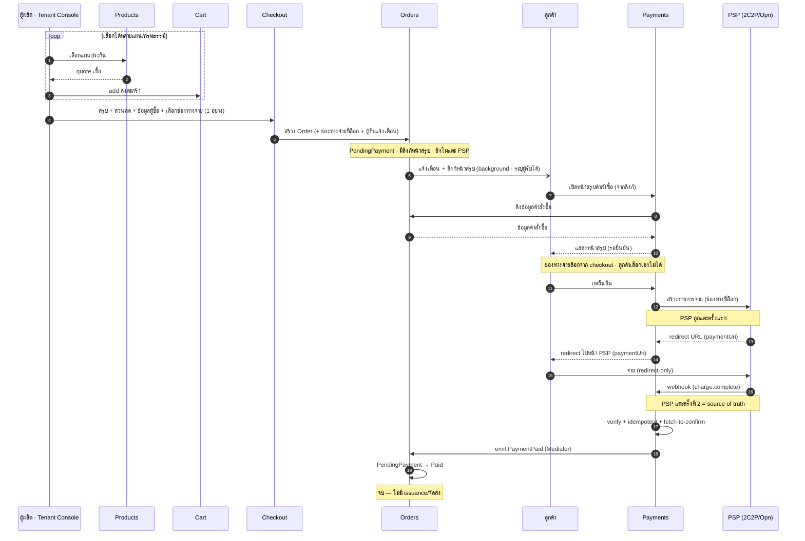
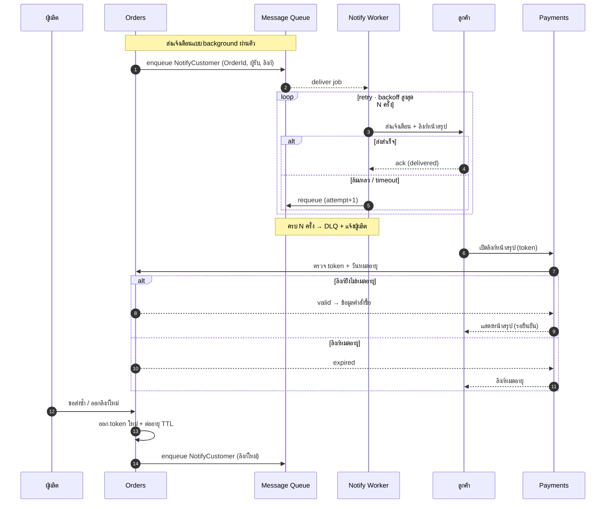

# สรุปโมดูลและบทบาท — Internal Payment Orchestration Platform (captive)

> โมเดล **captive / internal** · redirect-only · multi-tenant · ไม่ถือเงิน · ใช้ฟรีภายในเครือ
> Tenant: **vCentral · vCommerce · vSouvenir** · PSP ปลายทาง: 2C2P + Omise/Opn
> เวอร์ชันอัปเดต: สะท้อนการตัดสินใจล่าสุด (2 SaaS console, no payout, no fee, captive)

---

## ภาพรวม

**ทั้งระบบคือ scope เดียวกัน — SaaS อีคอมเมิร์ซประกันภัย** ที่มี 5 โมดูลอยู่ใน scope เดียว (**Products · Cart · Checkout · Orders · Payments**) คุยกันผ่าน **Mediator (martinothamar/Mediator)** แบบ modular ไม่อ้างถึงกันตรง · เอกสารนี้ลงรายละเอียด **โมดูล Payments** เป็นหลัก (โมดูลที่ build out มากสุด)

โมดูล Payments นี้คือ **แพลตฟอร์ม orchestration การชำระเงินภายในเครือ** ที่ให้บริษัทในเครือ (vCentral/vCommerce/vSouvenir) รับชำระเงินผ่าน PSP ที่ถือใบอนุญาตอยู่แล้ว — คุณ **"ใช้" PSP ไม่ใช่ "เป็น" PSP** และ **เงินจริงไม่วิ่งผ่านแพลตฟอร์ม**

แบ่งเป็น 2 ระนาบที่แยกขาดกัน:
- **Control plane** — การตั้งค่า/กำกับดูแล (console → backend) ไม่แตะเส้นทางเงิน
- **Data plane** — request การจ่าย + สถานะ (ไม่ใช่ตัวเงิน เงิน settle ตรงจาก PSP เข้าบริษัท)

หลักการที่บังคับทั้งระบบ: **multi-tenant isolation (RLS)**, **redirect-only (PCI SAQ A รายนิติบุคคล)**, **webhook = source of truth**, **maker-checker สำหรับ action อ่อนไหว**, **idempotency**, **credential vault security**, **แยก Tenant/Admin console เป็นคนละแอป (blast radius)**

ชั้นจากบนลงล่าง: ช่องทางบริษัทในเครือ → control plane (2 console) → platform core → PSP adapter → PSP (ใน PCI scope) โดยเงิน settle จาก PSP เข้าบัญชีบริษัทโดยตรง

---

## ขอบเขตงาน (in scope) — ทั้ง SaaS

**ทั้งระบบคือ scope เดียวกัน** — SaaS อีคอมเมิร์ซประกันภัยที่มี 5 โมดูลอยู่ใน scope เดียวกัน คุยกันผ่าน Mediator แบบ modular:

| โมดูลใน SaaS (in scope) | บทบาท | เทียบอีคอมเมิร์ซ |
|---|---|---|
| **Products** | แผนประกัน / กรมธรรม์ (แคตตาล็อก + quote เบี้ย) | สินค้า / SKU |
| **Cart** | ตะกร้าสินค้า — รวมแผนที่เลือก + quote (แก้ไขได้) | ตะกร้า / cart |
| **Checkout** | หน้าสรุปคำสั่งซื้อ + ส่วนลด + ข้อมูลผู้ซื้อ + **เลือกช่องทางจ่าย 1 ช่องทาง (ล็อก)** + ตั้งค่าผู้รับแจ้งเตือน → สร้าง Order | checkout |
| **Orders** | ข้อมูลคำสั่งซื้อ + **ลิงก์**ไปหน้าสรุป (ที่ Payments ให้บริการ) · **ส่งแจ้งเตือน + ลิงก์ให้ลูกค้าแบบ background** (ระบุผู้รับได้) · `PendingPayment` **ยังไม่แตะ PSP** · รับ `PaymentPaid` → Paid | คำสั่งซื้อ / order |
| **Payments** | **หน้าจอสรุปคำสั่งซื้อสำหรับลูกค้า** (ดึงข้อมูลจาก Orders) · ลูกค้ากดยืนยัน → สร้าง **รายการจ่ายกับ PSP** + redirect URL (`paymentUri`) → รับชำระ redirect-only, captive | ชำระเงิน / payment |

Flow ใน SaaS: Products → **Cart** → **Checkout** → Orders → **Payments** · จบที่ **"รับชำระเสร็จ → emit `PaymentPaid`"** — SaaS **ไม่มีขั้นจัดส่ง/ออกกรมธรรม์ (issuance)**

**ผู้เกี่ยวข้อง:** *ผู้ผลิต (Tenant Console)* = ผู้เลือกแผน/กรมธรรม์ → ตะกร้า → checkout · *ลูกค้า* = เปิดลิงก์หน้าสรุปคำสั่งซื้อ → กดยืนยัน → จ่าย (เท่านั้น)

> **ลำดับสำคัญ:** สร้าง Order **ไม่ได้สร้างรายการกับ PSP** — Order อยู่ `PendingPayment` + มีลิงก์ไปหน้าสรุป · รายการกับ PSP (`paymentUri`) ถูกสร้างใน **Payments เมื่อลูกค้าเปิดหน้าสรุป (ของ Payments) แล้วกดยืนยัน** → Orders ไม่ผูกกับ PSP โดยตรง เปลี่ยน/เพิ่ม PSP ได้โดยไม่แตะ Orders

> **การแจ้งเตือน (background):** Orders ส่งผ่าน **Message Queue → Notification Worker** · ล้มเหลว → **retry แบบ backoff** สูงสุด N ครั้ง → ครบแล้วเข้า **DLQ** + แจ้งผู้ผลิต · **ลิงก์หน้าสรุปมี TTL** เปิดหลังหมดอายุ = error · **ส่งซ้ำ / ออกลิงก์ใหม่** = Orders ออก token ใหม่ + ต่ออายุ แล้ว enqueue รอบใหม่

> **ช่องทางชำระเงิน:** Checkout เลือก **1 ช่องทางต่อ Order** (บัตร / PromptPay / ผ่อน อย่างใดอย่างหนึ่ง) แล้ว **ล็อก** — ลูกค้า **เลือก/เปลี่ยนเองไม่ได้** ที่หน้าสรุป · Payments สร้างรายการ PSP ตามช่องทางที่ล็อกไว้ (routing primary/fallback เป็นเรื่องภายในของช่องทางนั้น)

> เอกสารนี้ลงรายละเอียด **โมดูล Payments** เป็นหลัก (หัวข้อ 1–7) · Products/Cart/Checkout/Orders มีสเปกของตัวเองแยก แต่ทั้งหมดอยู่ใน **scope เดียวกันของ SaaS**

**โมดูล Payments ทำอะไร:**
- รับ payment intent จากช่องทางของบริษัทในเครือ → ออก **redirect ไปหน้า PSP** (สัญญากลางรูปทรงเดียวทุก PSP)
- รับผลจริงทาง **webhook (source of truth)** → verify ลายเซ็น + fetch-to-confirm → อัปเดตสถานะ → emit `PaymentPaid`
- **Multi-tenant provisioning** — Admin Console สร้าง tenant + เก็บ PSP credential/config ต่อบริษัท (vault)
- **2 SaaS console** (Tenant/Admin) คนละแอป + **RBAC** + **identity (Google SSO)**
- **PSP adapter** 2C2P + Omise/Opn — redirect-only ครบ 3 ช่องทาง (บัตร/PromptPay/ผ่อน)
- **Reconciliation = reporting**, retry/dunning, idempotency, audit log

**โมเดล Payments (captive):**
- **Captive** — เปิดเฉพาะ 3 นิติบุคคลในเครือ (allowlist) ไม่รับคนนอก
- **No payout** — เงิน settle จาก PSP เข้าบัญชี merchant ของแต่ละบริษัท **โดยตรง** → อยู่นอก funds flow
- **Free** — ไม่มี billing/ค่าบริการ
- **Regulatory** — captive + ไม่ถือเงิน → เป็น merchant/tech provider ไม่เข้าข่ายใบอนุญาตประเภทที่ 3 ของ ธปท. ใบอนุญาตอยู่ที่ PSP *(ควรคอนเฟิร์ม ธปท. หากนิติบุคคลไม่ได้อยู่ใต้การควบคุมเดียวกัน หรือวันใดเปิดให้คนนอกใช้)*
- **PCI** — SAQ A รายนิติบุคคล (redirect-only ไม่แตะข้อมูลบัตร)

**รอยต่อข้ามโมดูล (Payments ↔ Orders) ที่ต้องระวัง:**
- ชนิดเงินที่ seam `PaymentPaid` — Contracts ปัจจุบัน `Amount` เป็น `long` สตางค์ แต่ Orders ใช้ `decimal` บาท → ควรย้าย `Money` ไป Contracts/SharedKernel ให้ทุกโมดูลใช้ร่วม
- **verify amount/currency** ตอน Orders รับ `PaymentPaid` ไม่ใช่แค่ `PaymentId` (กันจ่ายไม่ครบ/สกุลผิด)
- **correlation:** Orders ถือ `PaymentId` ตั้งแต่ตอนเรียก Payments → จับคู่ `PaymentPaid` ได้ทันที (ไม่มี attach-race) · จะใส่ `OrderId` ใน `PaymentPaid` เพิ่มก็ได้เพื่อความชัด

---

## ลำดับเหตุการณ์ E2E (sequence)

ไดอะแกรมเรนเดอร์ด้วย mermaid.js (โหลดจาก CDN — ต้องต่อเน็ตครั้งแรก)

### เส้นทางหลัก (happy path)



### การแจ้งเตือน (Message Queue + retry) และวงจรลิงก์ (หมดอายุ/ส่งซ้ำ)



---

## นอกขอบเขต — ฟังก์ชันที่ "ห้าม implement"

> สิ่งเหล่านี้อยู่ **นอก scope ของ SaaS โดยตั้งใจ** — ถ้าเพิ่มเข้ามาจะเปลี่ยนสถานะทางกฎหมายและขยาย PCI scope ทันที **ห้าม implement และห้าม "ช่วยเพิ่มให้เอง"**

1. **ห้ามสร้าง settlement / payout engine** — ระบบต้องไม่รับ ถือ หรือจ่ายเงินต่อ ไม่มี money ledger / wallet / float / escrow / disbursement เงิน settle จาก PSP เข้าบัญชี merchant ของแต่ละบริษัทโดยตรง (เราอยู่นอก funds flow เสมอ)
2. **ห้ามทำ billing / เก็บค่าบริการ** — ใช้ฟรี ไม่มี subscription / invoice / usage metering เพื่อเรียกเก็บเงิน / fee deduction
3. **ห้ามทำ public หรือ self-serve onboarding สำหรับคนนอก** — onboarding เป็น allowlist เฉพาะ vCentral / vCommerce / vSouvenir ไม่ต้องต่อ KYB/AML provider ของ merchant ภายนอก ไม่ต้องมีหน้าสมัครแบบเปิด
4. **ห้ามแตะข้อมูลบัตร** — ห้าม collect / store / transmit / tokenize PAN ห้ามมี card input field / hosted-fields / iframe ที่รับข้อมูลบัตรบนโดเมนเรา (ตัด client-side tokenization เช่น Omise.js card ออกทั้งหมด)
5. **ห้ามสร้างฟังก์ชันของ PSP / acquirer เอง** — ไม่มี acquiring, card scheme connectivity, 3DS/ACS, payment processing เราเป็น merchant/orchestrator ที่ "ใช้" 2C2P/Omise ไม่ใช่ "เป็น" PSP
6. **ห้าม flow แบบ non-redirect** — ห้ามทำ display-QR-บนหน้าเรา, iframe, hosted-fields หรือ flow ใดที่ render UI การจ่ายบนโดเมนเรา ใช้ **full redirect ไปหน้า PSP เท่านั้น** (เพื่อคง SAQ A)
7. **Reconciliation = reporting เท่านั้น** — ห้ามสร้างลอจิกที่เคลื่อนเงิน/ปรับยอดจริง เป็นการกระทบยอดเพื่อแสดงผลเท่านั้น

> **หมายเหตุสำหรับ AI agent ที่พัฒนาระบบ:** ถ้าเจอ requirement, ticket หรือไอเดียที่นำไปสู่ข้อใดข้างต้น ให้ **หยุดและถามก่อน** อย่า implement เอง แม้จะดู "เป็นประโยชน์" — เพราะกระทบสถานะใบอนุญาตและ PCI scope ของทั้ง SaaS

---

## 1. ชั้นช่องทาง (Channels)

### เก็บเบี้ย / รับชำระ (premium / payment in)
- **บทบาท:** จุดที่ลูกค้าของแต่ละบริษัทในเครือกดจ่าย (ออนไลน์/แอป/ช่องทางของบริษัทนั้น)
- **อินพุต:** การกระทำของลูกค้า + ข้อมูลรายการ
- **เอาต์พุต:** payment intent ส่งเข้า Create session
- **หมายเหตุ:** ไม่มี disbursement/payout ผ่านแพลตฟอร์ม (ถูกตัดในโมเดล captive)

---

## 2. Control plane — แยกเป็น 2 SaaS apps

ทั้งสองแอปเป็นคนละ frontend/คนละ deploy แต่ **นั่งบน backend + data ชุดเดียวกัน**

### 2.1 Tenant Console (SaaS app #1)
- **บทบาท:** แอปเดียวที่ทั้ง 3 บริษัทใช้ร่วมกัน โดย scope ต่อรายผ่าน tenant context จากตอน login
- **หน้าที่หลัก:** ดู dashboard/รายงาน/reconciliation เฉพาะตน, ตั้งค่าระดับที่อนุญาต — **ไม่ได้สร้าง tenant หรือกรอก PSP credential เอง** (admin provision ให้)
- **คุณสมบัติ:** public-facing · เห็นเฉพาะข้อมูล tenant ตน
- **หมายเหตุ:** ไม่มี code path ไปฟังก์ชัน admin เลย

### 2.2 Admin Console (SaaS app #2)
- **บทบาท:** แอปของทีมกลาง เข้าถึงข้ามทุก tenant
- **หน้าที่หลัก:** **สร้าง/provision Tenant Console ให้แต่ละบริษัท**, กรอกและเก็บ PSP integration config + credential รายบริษัทลง vault, ตั้ง webhook/return URL mapping ต่อ tenant, จัดการ tenant/allowlist, ตั้ง routing, มอนิเตอร์, audit
- **คุณสมบัติ:** **internal-only** (VPN/IP allowlist, MFA เข้มกว่า, แยก identity provider) · แยก deploy/codebase เพื่อลด blast radius
- **หมายเหตุ:** เป็น control plane ตัวจริง — ฟังก์ชันอำนาจสูงทั้งหมดอยู่ที่นี่

### 2.3 Permission model (RBAC)
- **โครงสร้าง:** สิทธิ = Scope × Resource × Action
- **Role ใน Tenant Console:** Tenant Admin / Finance / Viewer (scope = tenant ตนเท่านั้น)
- **Role ใน Admin Console:** Platform Owner / Operator / Risk & Compliance / Support (scope = ทุก tenant)
- **maker-checker:** ใช้กับ action อ่อนไหว เช่น approve tenant ใหม่, เปลี่ยน routing rule, แก้ allowlist
- **บังคับใช้:** การแยกแอปเป็นแค่หน้าบ้าน — เส้นป้องกันจริงคือ **backend authorization แยก permission scope ให้ขาด** endpoint ของ admin (cross-tenant/approve/config) ต้องเรียกผ่าน session ของ Tenant Console ไม่ได้

### 2.4 Provisioning (admin-driven)
- **ลำดับ:** Admin สร้าง tenant → Admin กรอก PSP config + credential รายบริษัท (เก็บลง vault) → ตั้ง webhook/return URL mapping ต่อ tenant → provision Tenant Console + พื้นที่ข้อมูลแยก → tenant พร้อมใช้
- **บทบาท:** ทีมกลาง provision ทั้งหมดผ่าน Admin Console (ไม่ใช่ self-serve ของ tenant) เหมาะกับ captive เพราะ 3 บริษัทอยู่ในเครือ ทีมกลางถือ credential ได้
- **ขอบเขต:** เฉพาะ vCentral / vCommerce / vSouvenir (allowlist) · ไม่มี billing
- **ข้อมูลที่ provision (data model):** `Tenant` (Name/Status/EnabledChannels/Currency) → `PspConnection` ต่อ PSP (Psp, MerchantId, EnabledMethods, WebhookPath) → `VaultSecret` ต่อ connection (SecretKey/PublicKey/WebhookSecret — เก็บเป็น ciphertext เข้ารหัส) · runtime: `PaymentSession` อ้าง TenantId + ConnectionId
- **การอ่านตอน runtime:** adapter อ่าน `PspConnection` แล้ว decrypt `VaultSecret` ที่เกี่ยว ไปเรียก 2C2P/Omise แล้วเขียน `PaymentSession`

#### Config payload (admin submit)

ตัวอย่าง payload เต็ม (100%) ที่ทีมกลางกรอกผ่าน Admin Console — vCommerce ใช้ทั้ง 2C2P + Omise โดยทั้ง 2 PSP เปิดครบ 3 ช่องทาง:

```json
{
  "tenant": {
    "code": "vcommerce",
    "displayName": "vCommerce Co., Ltd.",
    "legalEntityId": "0105560000000",
    "status": "active",
    "country": "TH",
    "currency": "THB",
    "timezone": "Asia/Bangkok",
    "locale": "th-TH",
    "enabledChannels": ["card", "promptpay", "installment"],
    "branding": {
      "statementName": "VCOMMERCE",
      "supportEmail": "support@vcommerce.co.th",
      "logoUrl": "https://cdn.vgroup.internal/vcommerce/logo.png"
    },
    "routing": {
      "card":        { "primary": "2c2p",  "fallback": "omise" },
      "promptpay":   { "primary": "2c2p",  "fallback": null },
      "installment": { "primary": "omise", "fallback": "2c2p" }
    },
    "session": {
      "expiryMinutes": 30,
      "idempotencyTtlHours": 24
    },
    "createdByAdmin": "ops-007"
  },
  "pspConnections": [
    {
      "psp": "2c2p",
      "environment": "production",
      "merchantId": "764764000012345",
      "currencyCode": "764",
      "enabledMethods": ["card", "promptpay", "installment"],
      "card": { "secure3ds": true },
      "installment": { "terms": [3, 6, 10], "banks": ["KBANK", "BAY", "SCB", "BBL"] },
      "frontendReturnUrl": "https://pay.vgroup.internal/return/vcommerce/2c2p",
      "backendReturnUrl": "https://pay.vgroup.internal/webhook/vcommerce/2c2p",
      "webhookPath": "/webhook/vcommerce/2c2p",
      "locale": "th",
      "secrets": {
        "secretKey": "<2c2p merchant secret key · JWT signing · write-only>"
      }
    },
    {
      "psp": "omise",
      "environment": "production",
      "accountId": "acct_5xxxxxxxxxxxxxxx",
      "apiVersion": "2019-05-29",
      "enabledMethods": ["card", "promptpay", "installment"],
      "card": { "via": "links_api", "secure3ds": true },
      "alternativeMethods": { "via": "source_charge" },
      "enabledSources": ["promptpay", "installment_kbank", "installment_bay", "installment_scb"],
      "installment": { "terms": [3, 6, 10], "minAmountThb": 3000 },
      "returnUri": "https://pay.vgroup.internal/return/vcommerce/omise",
      "webhookPath": "/webhook/vcommerce/omise",
      "secrets": {
        "publicKey": "pkey_xxxxxxxxxxxxxxxx",
        "secretKey": "<omise skey · server-side API · write-only>",
        "webhookSecret": "<omise webhook signing secret · write-only>"
      }
    }
  ]
}
```

**Field reference (ที่เพิ่มจากเวอร์ชันย่อ):**
- `tenant.routing` — เพราะทั้ง 2 PSP ทำได้ครบ 3 ช่องทาง ต้องระบุ **primary/fallback ต่อช่องทาง** (เช่น installment → Omise ก่อน, ตกไป 2C2P) feed เข้า Method router
- `tenant.branding` / `locale` / `timezone` — แสดงบนหน้า PSP + จัด session expiry ตามเวลาไทย
- `tenant.session` — คุม expiry ของ redirect session + TTL ของ idempotency
- `psp.environment` — `production` / `sandbox` แยก key คนละชุด
- **2C2P:** `currencyCode` เป็นรหัสตัวเลข ISO (`764` = THB) · `installment.terms/banks` · `card.secure3ds` · แยก `frontendReturnUrl` (UX) กับ `backendReturnUrl` (truth)
- **Omise:** `apiVersion` (Omise-Version header) · `card.via = "links_api"` (บัตรผ่าน Links API → `paymentUri` ไม่ใช่ Omise.js) · `alternativeMethods.via = "source_charge"` (PromptPay/ผ่อน → `authorizeUri`) · `enabledSources` คือ source types จริงของ Omise

**Map ลงตาราง:**
- `tenant.*` (รวม nested `branding`/`routing`/`session`) → `Tenant` (คอลัมน์ตรง + ส่วนยืดหยุ่นเก็บใน `Metadata` json)
- แต่ละ `pspConnections[]` (ยกเว้น `secrets`) → `PspConnection` (config ไม่ลับ; `card`/`installment`/`enabledSources` เก็บใน json ของแถวนั้น)
- ทุกคีย์ใน `secrets` → `VaultSecret` (เข้ารหัส, `Kind` = ชื่อ field, 1 แถวต่อ secret)

- **กฎ secret:** ฟิลด์ใน `secrets` เป็น **write-only** — API อ่านกลับต้อง mask เสมอ (เช่น `"secretKey": "••••3a9f"`) ไม่ส่ง plaintext คืน
- **WebhookPath / returnUri:** ต้องเอาไปตั้งใน dashboard ของ PSP ฝั่งบริษัทด้วย เพื่อให้ callback/return แยก tenant/PSP ได้

#### Provisioning sequence

1. Admin → Backend: submit config (JSON)
2. Backend: validate (allowlist = vCentral/vCommerce/vSouvenir เท่านั้น + schema)
3. Backend → DB: INSERT `Tenant`
4. Backend → DB: INSERT `PspConnection` (config ไม่ลับ)
5. Backend → Vault: encrypt → `VaultSecret` (เก็บคนละที่กับ DB)
6. Backend → DB: provision space · status = active
7. Backend → Admin: done (secrets masked)
8. หลังจากนั้น: ผู้ใช้ของ tenant login เข้า Tenant Console ใช้งานได้ทันที

#### ข้อควรทำ (สำหรับ AI agent ที่ implement)

- ขั้น 3–6 (`Tenant` / `PspConnection` / `VaultSecret` / active) ต้องอยู่ใน **transaction เดียว** กัน partial provision
- **validate ก่อนเขียน:** allowlist + schema
- **idempotent** ด้วย tenant key กันกดสร้างซ้ำ
- secret เข้า vault แยกจาก config และ **อ่านกลับ mask เสมอ**

### 2.5 Identity & RBAC (Google SSO)

**IdP:** ทั้งสอง console ใช้ Google SSO (Sign in with Google) → `iss` ร่วมกัน (`accounts.google.com`) จึง **แยก domain ด้วย `aud` (OAuth client คนละตัวต่อ console) + ตาราง identity ฝั่ง platform + `hd` guard** ไม่ใช่ด้วย `iss`

**Authn vs authz:** Google ทำแค่ authentication (ยืนยันเจ้าของอีเมล → ให้ `sub`/`email`/`hd`) ส่วน role/tenant ตัดสินที่ platform เสมอ

#### Admin Console
- **ด่านเข้า (default-deny):** ตรวจ `aud=admin-client` + **`hd=platform.com`** ทุก request — ไม่ผ่าน → 403
- **Role:** ผ่าน hd-gate ครั้งแรก → **role ต่ำสุดเป็น default** (read-only) elevate เป็น Operator/Risk/Owner ผ่าน record ที่ทีมกลางกำหนด
- **Bootstrap owner:** seed owner คนแรกผ่าน config/migration (ตารางว่างตอน deploy → elevate ตัวเองผ่าน UI ไม่ได้)
- **Roles:** Platform Owner · Operator · Risk & Compliance · Support (cross-tenant)
- **สมมติฐานที่ต้องจริงตลอด:** ทุกบัญชี @platform.com = คนที่ให้เข้า admin ได้ (โดเมนสงวนเฉพาะทีมกลาง) ถ้าวันใดโดเมนขยายใช้ทั่วไป ต้องกลับไปใช้ allowlist รายคน

#### Tenant Console (producer)
- **Key:** `ExternalLogin(provider, sub)` — ใช้ Google `sub` (immutable) ไม่ใช่ email
- **Register flow:** login Google → ไม่พบ ExternalLogin = ผู้สมัครใหม่ → ออก **registration ticket** (พก verified identity, short-lived + single-use, ยังไม่ใช่ session) → กรอกฟอร์ม → สร้าง `TenantUser(PendingApproval)` + ExternalLogin + Profile → แจ้ง admin
- **Approval:** admin **เลือก tenant จาก `Tenant` ที่มีอยู่** (ทางเดียวทุกเคส รวม gmail) + กำหนด role → Active · `TenantId` resolve จากที่ admin เลือกเท่านั้น (ไม่เชื่อค่าจากฟอร์ม) + validate ว่า tenant exists/active
- **State machine:** New → PendingApproval → Active / Rejected · Rejected → correction ticket → resubmit (→Pending) · Pending → 403 "รออนุมัติ"
- **Roles:** Tenant Admin · Finance · Viewer (scope = tenant ตน, RLS ด้วย `TenantId`)
- **โดเมน:** บริษัท (@vcentral/@vcommerce/@vsouvenir) ใช้ `hd` เป็น guard เสริมได้ · @gmail = personal account ไม่มี `hd`, offboarding ต้องลบแถวเอง → allowlist รายคนคือด่านเดียว

#### ตาราง identity (แยก schema)
- `AdminUser` (schema admin): `Email`/`Sub` PK · `Role` · `Status`
- `TenantUser` (schema producer): `Sub` PK · `TenantId` FK · `Role` · `Status` — คู่กับ `ExternalLogin` · `Profile` · `RegistrationTicket`
- แยก 2 schema → อีเมลในตารางหนึ่งไม่ได้สิทธิอีกฝั่งโดยอัตโนมัติ (คนละ RBAC realm)

#### Enforcement (ทุก request)
verify Google id_token (sig/`iss`/`aud`/exp/email_verified) → guard `hd` (ถ้ามี) → lookup table ของ console นั้น (ไม่พบ/disabled = 403) → scope ด้วยคอลัมน์ `TenantId` (RLS, ฝั่ง tenant) · token ข้าม domain ตกที่ `aud` ไม่ตรง

---

## 3. แพลตฟอร์มกลาง (Platform core) — captive · ไม่ถือเงิน

backend + data ที่ทั้งสอง console ใช้ร่วมกัน

### 3.1 Session layer

#### Create session
- ออก redirect URL ให้เบราว์เซอร์ (สัญญากลาง รูปทรงเดียวทุก PSP)

#### Return handler
- รับ browser redirect กลับ แสดง UX — **ไม่ตัดสินสถานะการจ่าย**

#### Webhook handler
- **แหล่งความจริง** ของสถานะ: verify ลายเซ็น + idempotent + fetch-to-confirm → อัปเดตสถานะ + แจ้งบริษัท

### 3.2 Engine

#### Method router
- ตัดสินช่องทาง → PSP ต่อ tenant ตาม config `enabledMethods` — ทั้ง 3 ช่องทางเปิดได้ทั้ง 2 PSP (ทุก cell redirect-only/SAQ A — หมวด 5)

#### Credential vault
- **สินทรัพย์อ่อนไหวที่สุดของระบบ** — เก็บ PSP keys รายบริษัท (แทนที่ card tokenization ที่ไม่มีแล้วเพราะ redirect-only) ต้อง encrypt + แยก key ต่อ tenant

#### Retry & dunning
- จัดการตัดเบี้ยไม่ผ่าน กันกรมธรรม์/รายการขาดอายุ

#### Reconciliation
- กระทบยอดเป็น **reporting** เท่านั้น (ไม่เคลื่อนเงิน เพราะอยู่นอก funds flow)

#### Idempotency store
- กันประมวลผล webhook/รายการซ้ำ ด้วย event id → map เป็น payment_id ภายใน

---

## 4. PSP adapter layer

normalize PSP ที่ทำ redirect คนละกลไกให้เป็นสัญญาเดียว: `createPaymentSession() → {redirect_url}`, `handleReturn()`, `handleWebhook() → normalized status`

### 4.1 2C2P adapter
- กลไก: Payment Token Request → `webPaymentUrl`; ผลจริงทาง `backendReturnUrl`; ยืนยันซ้ำด้วย Payment Inquiry API
- ช่องทาง: บัตร · PromptPay · ผ่อนชำระ (redirect แท้ทั้งหมด → SAQ A)

### 4.2 Omise/Opn adapter (redirect-only ทุกช่องทาง)
- **บัตร:** Links API → สร้าง link (one-time) → `paymentUri` (หน้า hosted ของ Opn ลูกค้ากรอกบัตรที่นั่น — ไม่ใช้ Omise.js ไม่แตะหน้าเรา)
- **วิธีจ่ายทางเลือก (PromptPay/ผ่อน/e-wallet):** source + charge (มี `returnUri`, สถานะ pending) → `authorizeUri`
- ผลจริงทุกช่องทางทาง webhook `charge.complete`; ยืนยันด้วย `GET /charges/{id}`
- ทุกช่องทาง redirect แท้ → SAQ A

---

## 5. PSP & payment methods (ใน PCI scope) + settlement

### 5.1 2C2P hosted page
- หน้าจ่ายที่ 2C2P โฮสต์ · รับ บัตร / PromptPay / ผ่อน

### 5.2 Opn hosted pages
- **บัตร:** Links API `paymentUri` → หน้า hosted ของ Opn (`link.omise.co`) — กรอกบัตรที่ Opn
- **PromptPay / ผ่อน / e-wallet:** `authorizeUri` → หน้า Opn (แสดง QR / redirect ธนาคาร)
- ทุกหน้าจ่ายอยู่ฝั่ง Opn → ไม่แตะบัตรบนหน้าเรา · SAQ A

### Settlement (อยู่นอกแพลตฟอร์ม)
- แต่ละบริษัทผูก **merchant account ของตัวเอง** กับ 2C2P/Omise → เงิน settle จาก acquirer/PSP เข้าบัญชีบริษัทนั้น **โดยตรง** แพลตฟอร์มไม่แตะเงิน

### ช่องทาง × PSP (เปิดได้ทั้ง 2 PSP · redirect-only ทุก cell)

ทั้ง 3 ช่องทางเปิดได้ทั้ง 2 PSP ต่อ tenant ผ่าน config `enabledMethods` — ทุก cell เป็น **redirect แท้ → SAQ A** (ฝั่ง Opn ใช้ Links API สำหรับบัตร + source/charge สำหรับวิธีอื่น)

| ช่องทาง | PSP | กลไก | redirect / PCI |
|---|---|---|---|
| บัตร | 2C2P | hosted page (Redirect API) | redirect แท้ · SAQ A |
| บัตร | Omise/Opn | **Links API** → `paymentUri` (หน้า hosted ของ Opn) | redirect แท้ · SAQ A |
| PromptPay | 2C2P | hosted page (redirect) | redirect แท้ · SAQ A |
| PromptPay | Omise/Opn | source+charge (`returnUri`→`authorizeUri`) | redirect แท้ · SAQ A |
| ผ่อนชำระ | 2C2P | hosted page (redirect) | redirect แท้ · SAQ A |
| ผ่อนชำระ | Omise/Opn | source+charge (`returnUri`→`authorizeUri`) | redirect แท้ · SAQ A |

> **Omise/Opn เป็น redirect-only แท้ทุกช่องทาง:** บัตรใช้ **Links API** (`paymentUri` → หน้า hosted `link.omise.co` ลูกค้ากรอกบัตรที่ Opn — *ไม่ใช้ Omise.js, ไม่แตะเลขบัตรบนหน้าเรา*) · วิธีจ่ายทางเลือก (PromptPay/ผ่อน/e-wallet) ใช้ source+charge ที่ได้ `authorizeUri` (redirect ไปหน้า Opn ไม่ใช่ display-QR บนหน้าเรา) → **สอดคล้องกับ directive out-of-scope ทั้งหมด** (ไม่แตะบัตร · ไม่มี non-redirect/display-QR · SAQ A ล้วน)

---

## 6. ประเด็นข้ามระบบ (Cross-cutting)

- **Multi-tenant isolation** — ทุก query กรองคอลัมน์ `TenantId` ด้วย row-level security ที่ data layer (ไม่พึ่ง UI/app code) เพราะ backend ร่วมกัน
- **แยก Tenant/Admin เป็น 2 แอป** — ลด blast radius; ฝั่ง tenant ไม่มี code path ไป admin; แต่ต้องแยก backend authz scope ให้ขาดด้วย
- **PCI SAQ A รายนิติบุคคล** — redirect-only ไม่แตะข้อมูลบัตร
- **Webhook = source of truth** — เชื่อ webhook ที่ลงลายเซ็น + fetch-to-confirm ไม่เชื่อ browser redirect
- **Maker-checker** — สำหรับ action อ่อนไหว (approve tenant, เปลี่ยน routing, แก้ allowlist)
- **Idempotency** — กันการประมวลผลซ้ำ
- **Credential vault security** — encrypt + isolate PSP keys ต่อ tenant (สินทรัพย์อ่อนไหวหลัก)
- **Audit log** — append-only เก็บ actor/scope/before-after/เหตุผล

---

## 7. ข้อสรุปกำกับดูแล (regulatory)

- **Captive + ไม่ถือเงิน → เอนไป merchant/tech provider** ไม่เข้าข่ายใบอนุญาตประเภทที่ 3 (รับชำระแทนผู้ขายรายอื่น) ใบอนุญาตอยู่ที่ PSP
- **Caveat:** หากนิติบุคคลไม่ได้อยู่ใต้การควบคุมเดียวกันจริง หรือวันใดเปิดให้คนนอกใช้ → ภาพเปลี่ยน ควรหารือ ธปท.
- **KYC/AML posture** ควรสะอาด (ภาคบริการชำระเงินถูกจับตาเข้ม) — allowlist เฉพาะในเครือช่วยลดความเสี่ยงตรงนี้

---

## Naming conventions (C# / EF Core / SQL Server)

> มาตรฐานการตั้งชื่อทั้งโปรเจกต์ อิง Microsoft Framework Design Guidelines — ใช้เป็นข้อมูลอ้างอิงของทีม หลักคือ **C# identifier ↔ entity ↔ table ↔ column สะกดตรงกัน (PascalCase)** เพื่อให้ EF Core map ตรงโดยไม่ต้อง alias

### C# (Framework Design Guidelines)

| สิ่ง | แบบ | ตัวอย่าง |
|---|---|---|
| Namespace / Class / Struct / Record / Enum | PascalCase | `PaymentSession` |
| Interface | `I` + PascalCase | `IPspAdapter` |
| Method (async ลงท้าย `Async`) | PascalCase | `CreateSessionAsync` |
| Property | PascalCase | `TenantId`, `IsActive` |
| Parameter / local variable | camelCase | `tenantId` |
| Private field | `_` + camelCase | `_vault` |
| Constant / static readonly | PascalCase | `DefaultCurrency` |
| Enum member | PascalCase | `PaymentStatus.Pending` |
| Generic type parameter | `T` + PascalCase | `TKey` |
| Boolean | `Is`/`Has`/`Can` นำหน้า | `IsActive`, `HasWebhookSecret` |
| Collection | พหูพจน์ | `PspConnections` |

- **Acronym:** 3 ตัวอักษรขึ้นไป PascalCase → `Psp` (ไม่ใช่ `PSP`), `Html`, `Url` · 2 ตัวอักษรพิมพ์ใหญ่ทั้งคู่ → `IO` ⇒ โปรเจกต์นี้ใช้ **`Psp`** ตลอด (`PspConnection`, `PspAdapter`, `pspConnectionId`)
- **ชื่อแบรนด์/ขึ้นต้นด้วยตัวเลข:** `2C2P` เป็น identifier ตรงๆ ไม่ได้ (ขึ้นต้นด้วยเลข) → ใช้ enum member `TwoCTwoP` หรือเก็บเป็น string · `Omise` ใช้ตรงได้
- **ห้าม:** Hungarian notation (`strName`), prefix `m_`, ตัวย่อกำกวม

### EF Core

| สิ่ง | แบบ | ตัวอย่าง |
|---|---|---|
| Entity | PascalCase เอกพจน์ | `Tenant`, `PspConnection`, `VaultSecret` |
| DbSet | PascalCase พหูพจน์ | `Tenants`, `PspConnections` |
| Navigation property | PascalCase | `Tenant.PspConnections`, `PspConnection.Tenant` |
| Primary key | `{Entity}Id` | `TenantId`, `ConnectionId` |
| Foreign key | `{Navigation}Id` | `TenantId` (บน `PspConnection`) |
| DbContext | `{Name}DbContext` | `AdminDbContext`, `ProducerDbContext` |
| Entity configuration | `{Entity}Configuration` | `TenantConfiguration : IEntityTypeConfiguration<Tenant>` |
| Migration | PascalCase สื่อความหมาย | `AddPspConnection`, `AddTenantUserStatus` |
| Schema | lowercase ตาม domain | `admin`, `producer` → `ToTable("PspConnection", "producer")` |

### SQL Server

| สิ่ง | แบบ | ตัวอย่าง |
|---|---|---|
| Table | PascalCase เอกพจน์ (ตรงกับ entity) | `Tenant`, `PspConnection` |
| Column | PascalCase | `TenantId`, `MerchantId` |
| datetime (เก็บ UTC) | ลงท้าย `Utc` | `CreatedAtUtc`, `RotatedAtUtc` |
| Boolean | `bit` ชื่อ `Is...` | `IsActive` |
| PK constraint | `PK_{Table}` | `PK_Tenant` |
| FK constraint | `FK_{Child}_{Parent}` | `FK_PspConnection_Tenant` |
| Index | `IX_{Table}_{Columns}` | `IX_PaymentSession_TenantId` |
| Unique | `UQ_{Table}_{Columns}` | `UQ_ExternalLogin_Provider_Sub` |
| Schema | ตาม domain | `admin`, `producer` |

### JSON / REST API payload & JWT claims

ชั้น wire format ใช้ convention คนละชุดกับ C#/SQL — แยกให้ชัด:

| ชั้น | แบบ | ตัวอย่าง |
|---|---|---|
| JSON property (request/response) | **camelCase** | `pspConnections`, `merchantId`, `webhookPath`, `secretKey` |
| ตั้งครั้งเดียวใน .NET | `JsonNamingPolicy.CamelCase` | map `MerchantId` (C#) ↔ `merchantId` (JSON) อัตโนมัติ |
| JWT/OIDC claim (มาตรฐาน) | ตามสเปก (lowercase) | `iss`, `aud`, `sub`, `exp`, `hd`, `email_verified` |
| Custom claim | คงชื่อตาม IdP/สเปก | `tenant_id`, `role` (เป็นคนละ namespace กับ `TenantId` ที่เป็นคอลัมน์) |

- **ค่า (value) ของ provider/method** เก็บเป็น code string เสถียร: `"2c2p"` / `"omise"` · `"card"` / `"promptpay"` / `"installment"` (แยกจากชื่อ enum member ในโค้ด เช่น `TwoCTwoP`)
- **ค่าจาก PSP ภายนอก** คงรูปเดิมเสมอ: Omise source types `installment_kbank`/`installment_bay`/…, field เช่น `authorize_uri`, `return_uri`, event `charge.complete` — เป็นของ Omise ห้ามเปลี่ยน

### ถ้าทีมเลือก snake_case ใน DB

ถ้าอยากให้ table/column เป็น snake_case (เช่น `psp_connection`, `tenant_id`) ขณะที่ C# ยังเป็น PascalCase → ตั้ง **global convention ครั้งเดียว** (เช่น package `EFCore.NamingConventions` → `optionsBuilder.UseSnakeCaseNamingConvention()`) อย่าตั้งชื่อสลับมือทีละตาราง **เลือกแบบเดียวแล้วใช้ทั้งโปรเจกต์** ไม่ปนกัน (ER diagram ก่อนหน้าใช้ snake_case เชิงแนวคิด ตอน implement ให้ยึด convention ที่เลือกที่นี่)

### ชื่อ canonical เฉพาะโปรเจกต์

- **Entities:** `Tenant` · `PspConnection` · `VaultSecret` · `PaymentSession` · `TenantUser` · `AdminUser` · `ExternalLogin` · `RegistrationTicket` · `Profile`
- **Enums:** `PspProvider { TwoCTwoP, Omise }` · `PaymentMethod { Card, PromptPay, Installment }` · `PaymentStatus { Pending, Paid, Failed, Expired }` · `TenantUserStatus { PendingApproval, Active, Rejected, Disabled }`
- **Interfaces:** `IPspAdapter` · `ICredentialVault` · `IWebhookVerifier`
- **Services:** `PspRouter` · `ProvisioningService` · `ReconciliationReporter`

### In-process mediator — martinothamar/Mediator

โปรเจกต์ใช้ **`martinothamar/Mediator`** (source-generated) สำหรับสื่อสารใน-process ระหว่างโมดูล — wiring เป็น **compile-time** (ไม่ reflection / ไม่ assembly-scan) จึงเร็วและ AOT-friendly

| ประเด็น | martinothamar/Mediator |
|---|---|
| แพ็กเกจ | `Mediator.SourceGenerator` (ใส่ใน project ปลายสุด เช่น Host/ASP.NET · `PrivateAssets=all`) + `Mediator.Abstractions` (ที่นิยาม message/handler) |
| Message | `IRequest<,>` · `ICommand<,>` · `IQuery<,>` · `INotification` (event ข้ามโมดูลใช้ `INotification`) |
| Handler | `IRequestHandler<,>` · `INotificationHandler<>` · pipeline `IPipelineBehavior<TMessage,TResponse>` (เช่น `IdempotencyBehavior`) |
| Entry point | `IMediator` / `ISender` / `IPublisher` — `Send` / `Publish` |
| Return type | `Handle` คืน **`ValueTask<T>`** (ใช้ทั้ง request และ pipeline behavior) |
| DI | source generator สร้าง `AddMediator(...)` ให้ — handler ลงทะเบียนอัตโนมัติ; **pipeline behaviors เพิ่มเอง** (`MediatorOptions.PipelineBehaviors` หรือ `AddSingleton(typeof(IPipelineBehavior<,>), …)`) |
| Lifetime | แนะนำ `ServiceLifetime.Singleton` (perf) · `CachingMode.Lazy` ถ้า cold-start/AOT |

- **ข้อดีที่ได้:** error ตอน **build** (diagnostic ถ้าไม่มี handler ของ request) แทน error ตอน runtime + รองรับ NativeAOT
- **สรุปการใช้:** message ใช้ `IRequest`/`INotification` (หรือ `ICommand`/`IQuery` เมื่ออยากแยก command/query ให้ชัด) · handler คู่กับ `IRequestHandler`/`INotificationHandler` · cross-cutting ทำเป็น `IPipelineBehavior` (เช่น `IdempotencyBehavior`)

---

## ตารางสรุปโมดูล (quick reference)

| โมดูล | ระนาบ | บทบาทย่อ |
|---|---|---|
| Products | domain | แผนประกัน/กรมธรรม์ + quote เบี้ย (→ Order) |
| Cart | domain | ตะกร้าสินค้า — รวมแผน + quote (แก้ไขได้) |
| Checkout | domain | หน้าสรุป + ส่วนลด + ข้อมูลผู้ซื้อ + ตั้งค่าผู้รับแจ้งเตือน → สร้าง Order |
| Orders | domain | ข้อมูลคำสั่งซื้อ + ลิงก์หน้าสรุป (Payments) · แจ้งเตือนลูกค้า background · รับ `PaymentPaid`→Paid |
| เก็บเบี้ย/รับชำระ | data | จุดที่ลูกค้าบริษัทในเครือจ่าย |
| Tenant Console (SaaS) | control | แอปเดียว 3 tenant ใช้ร่วม scope ต่อราย |
| Admin Console (SaaS) | control | แอปทีมกลาง internal-only ข้ามทุก tenant |
| Permission model | control | RBAC scope×resource×action + maker-checker |
| Provisioning (admin-driven) | control | admin สร้าง tenant + กรอก PSP config/credential |
| Identity & RBAC | control | Google SSO · hd-gate default-deny · register→approve |
| Create session | data | ออก redirect URL |
| Return handler | data | รับ browser กลับ (UX, ไม่ตัดสิน) |
| Webhook handler | data | แหล่งความจริง อัปเดตสถานะ |
| Method router | data | ช่องทาง → PSP ต่อ tenant (เปิดได้ทั้ง 2 PSP) |
| Credential vault | data | PSP keys รายบริษัท (อ่อนไหวสุด) |
| Retry & dunning | data | กันรายการขาดอายุ |
| Reconciliation | data | reporting (ไม่เคลื่อนเงิน) |
| Idempotency store | data | กันประมวลผลซ้ำ |
| 2C2P adapter | data | Redirect API · บัตร/PromptPay/ผ่อน |
| Omise/Opn adapter | data | Links API (บัตร) + source/charge (อื่นๆ) · redirect ทุกช่องทาง |
| 2C2P hosted page | data (PCI) | หน้าจ่าย บัตร/PromptPay/ผ่อน |
| Opn hosted pages | data (PCI) | Links `paymentUri` (บัตร) + `authorizeUri` (อื่นๆ) · SAQ A |
| Settlement | นอกระบบ | PSP → บัญชีบริษัทโดยตรง |
