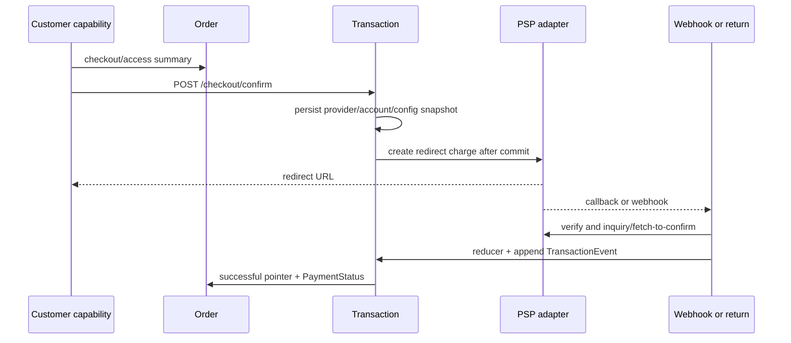

# Payment Orchestration Reference

เอกสารนี้อธิบาย payment path ที่ source ปัจจุบันรองรับ: canonical `Transaction`/`TransactionEvent` จาก Checkout capability และ compatibility `PaymentSession` path เดิม. ทั้งสอง path เป็น redirect-only; platform ไม่รับหรือเก็บ PAN, ไม่ถือเงิน และไม่ทำ settlement/payout.

## Canonical transaction flow

`CheckoutTransactionService` lock/lease กัน two tabs เรียก provider ซ้ำ. Transaction row และ provider request reference ถูก commit ก่อน PSP call; retry ใช้ row/reference เดิม. Browser return เป็น status-only binding และไม่เป็นหลักฐาน success.

## Transaction aggregate

`Payments.Domain.Transaction` เก็บข้อมูลที่ต้อง pin ต่อ attempt:

| Field | ความหมาย |
|---|---|
| `MerchantId`, `OrderId` | tenant และ commercial parent |
| `TransactionNo`, `AttemptNo` | human/reference identity ของ attempt |
| `Amount` | trusted Order amount/currency; client ไม่กำหนด |
| `PaymentMethod` | `card`, `promptpay`, `installment` |
| `Provider`, `ProviderAccountId`, `Environment` | selected PSP/account/environment |
| `CredentialVersionId`, `ConfigurationVersion` | config/credential snapshot ที่ใช้กับ attempt |
| `ProviderRequestReference` | idempotent provider request key ที่สร้างก่อน call |
| `ProviderReference`, `RedirectUrl`, `ReturnBinding` | provider result/binding ที่เติมภายหลัง |
| `OrderSnapshot`, `SafeProviderMetadata` | bounded snapshot; ไม่เก็บ raw secret/payload |
| `Status`, `NeedsReview`, inquiry fields | reducer/recovery state และ safe review flag |

สถานะคือ `Created`, `PendingConfirmation`, `Succeeded`, `Failed`, `Cancelled`, `Expired`. `TryClaimProviderCall` ใช้ short lease (`ProviderStatus=provider_calling`, `NextInquiryAt`) ป้องกัน concurrent create.

`TransactionEvent` เป็น append-only evidence: `Source`, `EventReference`, optional status/provider status/evidence code/safe details และ `OccurredAt`/`ReceivedAt`. Raw webhook payload, signature และ credential ไม่ถูกเก็บใน event.

`Payments.Domain.Transaction` คือ business payment attempt แยกจาก database transaction. ใน canonical flow external PSP I/O เสร็จและผ่านการ verify ก่อน แล้ว `TransactionResultReducer` จึง co-commit `Transaction`, `Order.PaymentStatus`, `Order.SuccessfulTransactionId`, `TransactionEvent` และ outbox ใน database transaction เดียว.

## Checkout capability endpoints

| Method | Path | พฤติกรรม |
|---|---|---|
| `POST` | `/api/v1/checkout/access` | hash/expiry/revocation ของ PaymentLink แล้วออก capability cookie |
| `GET` | `/api/v1/checkout/summary` | summary redacted จาก capability; no-store |
| `GET` | `/api/v1/checkout/payment-methods` | อ่าน capability จาก Merchant/User context โดยไม่เรียก PSP |
| `POST` | `/api/v1/checkout/confirm` | ตรวจ capability/cookie/CSRF/order version, persist Transaction แล้วเริ่ม redirect |
| `GET` | `/api/v1/checkout/status` | อ่าน Transaction status จาก DB; ไม่ทำ PSP network call |
| `POST` | `/api/v1/checkout/verify` | inquiry Transaction เดิมด้วย pinned provider context |
| `GET/POST` | `/api/v1/payment-returns/{providerCode}` | ตรวจ protected return binding และออก status-only cookie |
| `POST` | `/api/v1/webhooks/payment-providers/{providerAccountId}` | provider callback สำหรับ canonical transaction |
| `GET` | `/api/v1/transactions...` | Admin scoped list/detail/events/verify/review-note |

`checkout/confirm` ใช้ `Idempotency-Key` และ per-tab/browser binding. `checkout/status` และ return path ไม่เปลี่ยนสถานะจาก query string. Admin transaction verify ใช้ `If-Match`, `Idempotency-Key`, pinned context และ append-only review event.

## Webhook and reducer

Provider callback ต้อง:

1. resolve provider account/merchant จาก trusted route/context
2. parse external reference แล้วตรวจ Transaction binding
3. reveal credential version ที่ pinned และ verify signature
4. inquiry/fetch-to-confirm กับ adapter เมื่อ protocol ต้องการ
5. ตรวจ amount/currency/reference และลดผลลัพธ์ผ่าน `TransactionResultReducer`
6. หลัง external I/O ถูก verify แล้ว append `TransactionEvent`, update Transaction/Order และ `Order.SuccessfulTransactionId` พร้อม outbox ใน transaction เดียว

Duplicate/out-of-order callback เป็น idempotent. Late success หลัง cancel/expiry ใช้ explicit reconciliation/review semantics; ห้ามสร้าง Transaction ใหม่จาก callback. `Order.SuccessfulTransactionId` ชี้ first verified success.

## PSP adapters และ trusted boundary

Ports อยู่ `src/Application/Modules/Payments.Application/Ports/`: `IPspAdapter`, `IPspAdapterFactory`, connection repository, payable order reader, secret envelope และ authorization lock. Implementations อยู่:

- `src/Infrastructure/Modules/Payments.Infrastructure/Psp/TwoCTwoPAdapter.cs`
- `src/Infrastructure/Modules/Payments.Infrastructure/Psp/OmiseAdapter.cs`
- `src/Infrastructure/Modules/Payments.Infrastructure/Psp/PspAdapterFactory.cs`

Adapter capability, merchant connection eligibility, payment method policy, credential/environment pin และ provider contract evidence เป็นคนละ gate. ใน local implementation ที่ไม่มี PSP sandbox credential/contract บาง capability ถูก disabled หรือใช้ capture adapter; ไม่ประกาศ live-ready.

## Compatibility PaymentSession path

`PaymentSession` เดิมยังรองรับ route สำหรับ clients ที่อยู่ระหว่าง migration:

- `POST /api/v1/payments/sessions`
- `GET /api/v1/payments/sessions`
- `POST /api/v1/payments/sessions/{paymentSessionId}/redirect`
- `GET /api/v1/payments/sessions/{paymentSessionId}`
- `POST /api/v1/orders/{token}/pay`
- `POST /api/v1/orders/{token}/payment-status`

Session amount มาจาก Order server-side, open-session uniqueness และ redirect claim ใช้ row/concurrency guard. Route เหล่านี้ไม่ใช่ข้ออ้างให้เพิ่ม PaymentAttempt aggregate ใหม่; canonical new checkout ใช้ Transaction.

### PaymentSession compatibility contract

`Payments.Domain.Session` เก็บ `MerchantId`, `OrderId`, `Amount`, `Method`, `Psp`, pinned `PspConnectionId`, `SecretVersionId`, `PspEnvironment`, `RoutingSnapshotVersion`, status, external charge/redirect, timestamps, `Version` และ SQL `RowVersion`. New session pin routing snapshot ตอนสร้าง; version `0` มีได้เฉพาะ legacy rows.

สถานะ compatibility คือ `Created`, `Redirected`, `Paid`, `Failed`, `Expired`. `OpenTtl` คือ 24 ชั่วโมง; Session ที่เลย TTL และมี external charge ต้อง fetch-confirm กับ PSP ก่อนปลด open-session slot และเริ่ม replacement. Filtered unique index `IX_PaymentSessions_OrderId_Open` กัน open session ซ้ำ และ `(Psp, PspExternalChargeId)` กัน external charge ผูกหลาย session.

การหมดอายุแบบ offline ตาม `OpenTtl` ทำได้เฉพาะ `Created` ที่ไม่มี external charge reference และ state ไม่เปลี่ยนระหว่าง prepare/apply; session ที่มี charge ต้อง fetch-confirm ก่อนตัดสิน. `Redirected` ที่ไม่มี external charge reference ถือเป็น ambiguous `Pending` และต้องเข้า reconciliation โดยห้ามเปิด replacement session จาก TTL เพียงอย่างเดียว.

`CreateSessionHandler` normalize method, อ่าน Order scoped, ตรวจ payment state/document sale, connection eligibility, adapter capability และ existing open session. channel/PSP เดิมคืน session เดิม; channel ใหม่ชน open session ได้ `409`; amount ไม่อยู่ใน request. `StartRedirectHandler` คืน redirect เดิมถ้ามี, claim `Created -> Redirected` และ save `RowVersion` ก่อน PSP call; only winner เรียก PSP. Transport timeout ที่อาจสร้าง charge แล้วคง claim/reference เดิมและไม่ mark failed โดยเดา.

Legacy customer status, order release, webhook, pending webhook rematch และ stale-session replacement ใช้ `PaymentConfirmationService`.

เมื่อมี external charge จะ resolve credential จาก vault และทำ PSP prepare/fetch นอก database transaction; session ที่ไม่มี charge สร้าง offline evidence โดยไม่แตะ vault. จากนั้น apply เปิดหรือเข้าร่วม short database transaction, lock/reload `Session` และ revalidate reference/state. ทุก path co-commit claim, Session transition และ outbox ตามที่เกี่ยวข้อง; webhook/rematch ยัง co-commit inbound webhook completion ใน transaction เดียวกัน.

Legacy webhook `/api/v1/webhooks/{pspConnectionId:guid}` resolve connection จาก route, reveal pinned secret, verify signature, resolve external charge และ fetch-to-confirm ก่อนเข้า apply. Apply จะ lock/reload `Session`, revalidate reference/state และตรวจ amount/currency ก่อน claim หรือ transition. การเปลี่ยน `Order` status เกิดภายหลังผ่าน outbox consumer แบบ eventual จึงไม่ atomic ข้าม message boundary เดียวกับ Session. Browser return และ customer status ไม่รับสถานะจาก query string. `InboundWebhookEvent` เก็บ linkage/fingerprint/verification outcome เพื่อ audit โดยไม่เก็บ raw body/signature.

## Persistence และ security

| Data | Table/schema | Owner |
|---|---|---|
| Transaction | `txn.Transactions` | `CommerceDbContext` |
| Transaction evidence | `txn.TransactionEvents` | `CommerceDbContext` |
| Payment session compatibility | `txn.PaymentSessions` | `CommerceDbContext` |
| PSP/routing | `txn.PspConnections`, `txn.RoutingRulesets`, `txn.RoutingRules` | `ControlPlaneDbContext` |
| inbound evidence | `txn.InboundWebhookEvents` | `CommerceDbContext` |
| Order pointer | `shop.Orders.SuccessfulTransactionId` | `CommerceDbContext` |

No SQL RLS. `CommerceDbContext` query filters and guarded writes enforce merchant boundary; named admin ports carry accessible scope. PSP/routing configuration and vault rows are owned by `ControlPlaneDbContext`; payment attempt rows are owned by `CommerceDbContext`. PSP secret envelope uses vault/key version; response/logs expose mask/hint only.

## Non-goals และ readiness

- ไม่รับ PAN/card form, hosted fields, iframe หรือ non-redirect payment
- ไม่ทำ settlement, wallet, fee, billing, payout หรือ policy issuance
- ไม่ trust browser return as payment truth
- local test/capture evidence ไม่ใช่ provider live conformance
- ไม่มี live PSP credential/authorization ใน handoff environment จึงไม่ประกาศ production/cutover ready

## Source of truth

- `src/Domain/Modules/Payments.Domain/Transaction.cs`
- `src/Domain/Modules/Payments.Domain/TransactionEvent.cs`
- `src/Application/Modules/Platform.Application/Transactions/CheckoutTransactionService.cs`
- `src/Application/Modules/Platform.Application/Transactions/TransactionResultReducer.cs`
- `src/Application/Modules/Payments.Application/Transactions/TransactionWebhook.cs`
- `src/Application/Modules/Payments.Application/Confirmation/PaymentConfirmationService.cs`
- `src/Application/Modules/Payments.Application/CreateSession/CreateSessionHandler.cs`
- `src/Application/Modules/Payments.Application/ConfirmPaymentStatus/ConfirmPaymentStatusHandler.cs`
- `src/Application/Modules/Payments.Application/ReleaseOpenSession/ReleaseOpenSessionHandler.cs`
- `src/Application/Modules/Payments.Application/HandlePspWebhook/HandlePspWebhookHandler.cs`
- `src/Application/Modules/Payments.Application/HandlePspWebhook/InboundWebhookRematcher.cs`
- `src/Application/Modules/Payments.Application/Ports/IPspAdapter.cs`
- `src/Infrastructure/Modules/Payments.Infrastructure/Psp/`
- `src/Infrastructure/Persistence/Persistence.MerchantRuntime/MerchantRuntimeUnitOfWork.cs`
- `src/Infrastructure/Persistence/Persistence.MerchantRuntime/Payments/SessionRepository.cs`
- `src/Infrastructure/Persistence/Persistence.MerchantRuntime/Payments/`
- `src/Api/Api/Program.cs`
