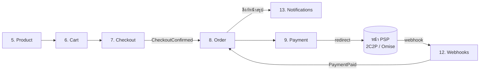

# บริบทและบทบาทของโมดูล — Payment Orchestration Platform

> **[vocabulary ยังเป็น pre-rf1 บางหัวข้อ — เนื้อหาสถานะจริง refresh แล้ว 2026-07-25]** เอกสารนี้เขียนก่อน spec
> `rf1-schema-reset` (multi-schema + actor rename ทั้งระบบ) จึงยัง**เรียกชื่อ actor/schema แบบเก่า**
> อยู่ในหัวข้อที่ยังไม่ถูก refresh. สายการ rename เต็มของ actor สองตัว:
> `AdminAccount` → (ชั่วคราว `PlatformUser`) → **`Admins.Domain.Users.User`** → ตาราง `admin.Users` ·
> `ProducerAccount` → **`Merchants.Domain.Users.User`** (เรียกในโค้ด/เอกสารว่า *merchant-user*) → ตาราง
> `merch.Users`; `Tenant` → **`Merchant`**. ของจริงปัจจุบันดู
> [`ARCHITECTURE.md`](../../.ai/shared/ARCHITECTURE.md) · [`CODING_STANDARDS.md`](../../.ai/shared/CODING_STANDARDS.md) ·
> [`rf1-schema-reset/design.md`](../../.ai/specs/rf1-schema-reset/design.md) (schema/rename map เต็ม).
>
> **สิ่งที่ refresh ไปแล้ว (2026-07-25)** — จุดเหล่านี้เชื่อถือได้ว่าตรงกับโค้ดบน `develop`:
> isolation floor (RLS → EF query filter + write guard, `rls-to-query-filter`) ·
> host topology (Worker ถูกลบ → in-process background dispatch, `multi-tier-deployment`) ·
> order items + policy-reference record (`insurance-pivot` + `policy-reference-record`) ·
> จำนวน/รายชื่อโมดูล (12 โมดูล รวม §15 ที่เพิ่มใหม่) · Money (`DECIMAL(19,4)` ตั้งแต่ rf1) ·
> **§3 (Admin) + §4 (Producer/merchant-user): ชื่อคลาส/ตาราง/route/permission key**
>
> **refresh เพิ่ม 2026-07-26 (เส้นทางการจ่าย, spec `captive-payment-alignment`)** — §9 (Payment),
> §11 (PSP), §12 (Webhooks) และ **ทะเบียนช่องว่าง**: ปิดข้อ 10, ปิดข้อ 1 เฉพาะชั้น connection,
> เพิ่มข้อ 23-24 (เปิดโดยรู้ตัว) และ **ข้อ 25 เพิ่ม 2026-07-27** (Codex review #4782168269 P1).
> **ข้อที่ยังเปิดและห้ามอ่านเป็นปิดแล้ว:** 1 (ชั้น merchant/producer), 8 (promptpay/installment),
> 9 (Omise HMAC), 12 (expiry sweeper), 23 (PSP ไม่ส่งยอดกลับ), 24 (เปลี่ยนช่องทางกลางคัน),
> 25 (claim สะสางไม่จบเมื่อเหตุขัดข้องถาวร) — แต่ละข้อมีเหตุผล + next step กำกับในทะเบียน

> เอกสารนี้คือ module map ระดับแพลตฟอร์ม: **บริบท (ทำไมต้องมี) + บทบาท (ทำอะไร/ไม่ทำอะไร)
> + ฟีเจอร์ละเอียด (โมเดลเป้าหมายรายข้อ เทียบ as-built) + โมเดลเป้าหมายเชิง API (normative target)**
> ของทุกโมดูล เขียนตาม **โมเดลเป้าหมาย** พร้อมระบุ **สถานะจริงในโค้ด** ต่อโมดูลและต่อฟีเจอร์
> (สถานะจริง ณ 2026-07-04 บน `develop`; target design เชิง API รับเข้า 2026-07-05 จาก external design session).
>
> ส่วน [เป้าหมายเชิง API ระดับแพลตฟอร์ม](#เป้าหมายเชิง-api-ระดับแพลตฟอร์ม-normative-target) และหัวข้อ
> "โมเดลเป้าหมายเชิง API" ในแต่ละโมดูลเป็น **normative target** — ไม่ใช่รายการ endpoint ที่ต้อง implement ทันที
> และไม่ใช่คำยืนยันว่าโค้ดปัจจุบันมีครบ; การแก้ gap ใดๆ ต้องเปิด spec ของตัวเอง (`/spec-new`)
>
> เอกสารลึกรายเรื่อง: [payment-orchestration-modules.md](payment-orchestration-modules.md)
> (Payments/PSP/flow + ภาค 8 Canonical Payment API target design),
> [entity-fields.md](entity-fields.md) (ทุก entity/field/enum), [src-structure.md](src-structure.md) (โครงโค้ด),
> [admin-module.md](admin-module.md) + [merchant-user-module.md](merchant-user-module.md) (auth),
> [search-filter-sort.md](search-filter-sort.md) (query convention)

---

## สารบัญ

- [วิธีอ่านเอกสารนี้](#วิธีอ่านเอกสารนี้)
- [ภาพรวมแพลตฟอร์ม](#ภาพรวมแพลตฟอร์ม)
- [เป้าหมายเชิง API ระดับแพลตฟอร์ม (normative target)](#เป้าหมายเชิง-api-ระดับแพลตฟอร์ม-normative-target)
- [1. Payment Orchestration Platform](#1-payment-orchestration-platform)
- [2. Tenant](#2-tenant)
- [3. Admin](#3-admin) — [3.1 บัญชี admin](#31-บัญชี-admin--oidc-bff-google--entra) · [3.2 โมดูล Admin RBAC](#32-โมดูล-admin-rbac)
- [4. Producer](#4-producer) — [4.1 บัญชี merchant-user](#41-บัญชี-merchant-user--oidc-bff-google--entra) · [4.2 RBAC ฝั่ง merchant-user](#42-rbac-ฝั่ง-merchant-user)
- [5. Product](#5-product)
- [6. Cart](#6-cart)
- [7. Checkout](#7-checkout)
- [8. Order](#8-order)
- [9. Payment](#9-payment--external-redirect--hosted-payment-page)
- [10. Transaction / PaymentAttempt](#10-transaction--paymentattempt)
- [11. Payment Service Providers](#11-payment-service-providers)
- [12. Webhooks](#12-webhooks)
- [13. Notifications](#13-notifications)
- [14. Audit](#14-audit)
- [15. Divisions / Levels / Offices / Positions (reference master data)](#15-divisions--levels--offices--positions-reference-master-data)
- [ตารางสรุป](#ตารางสรุป)
- [ช่องว่างเทียบเป้าหมาย (as-built gaps)](#ช่องว่างเทียบเป้าหมาย-as-built-gaps)
- [ทะเบียนตัดสินใจค้าง (ADR pending) และลำดับเปิด spec](#ทะเบียนตัดสินใจค้าง-adr-pending-และลำดับเปิด-spec)

---

## วิธีอ่านเอกสารนี้

ทุกโมดูลมี 5 ส่วนคงที่:

| ส่วน | ความหมาย |
|---|---|
| **บริบท** | โมดูลนี้คืออะไร อยู่ตรงไหนของ flow แก้ปัญหาอะไร |
| **บทบาท** | หน้าที่ที่ own + ขอบเขตที่จงใจ *ไม่ทำ* |
| **ฟีเจอร์ละเอียด** | รายการฟีเจอร์รายข้อของโมเดลเป้าหมาย + ข้อเสนอใหม่ พร้อมสถานะจริงต่อข้อ |
| **ความสัมพันธ์** | โยงกับโมดูลอื่นอย่างไร (id-reference, integration event) |
| **สถานะ** | เทียบโค้ดจริงบน `develop` (สรุประดับโมดูล) |

ค่าสถานะ (ใช้ทั้งระดับโมดูลและรายฟีเจอร์):

| สถานะ | ความหมาย |
|---|---|
| **มีแล้ว** | โค้ด + test อยู่บน `develop` ครบตามบทบาทหลัก |
| **บางส่วน** | มีแกนแล้ว แต่ยังขาด field/พฤติกรรมเทียบโมเดลเป้าหมาย (ระบุ gap ไว้ในหัวข้อ) |
| **ยังไม่มี** | เป้าหมาย (จาก target design ในเอกสารนี้ + [payment-orchestration-modules.md](payment-orchestration-modules.md) ภาค 8) ที่ยังไม่เริ่ม implement — ถ้ามี `(ข้อ N)` ดูรายละเอียดใน [ช่องว่าง](#ช่องว่างเทียบเป้าหมาย-as-built-gaps) |
| **เสนอ** | ข้อเสนอใหม่จากการวิเคราะห์ 2026-07-04 — ยังไม่อยู่ในเป้าหมาย/สเปกใด ต้องตัดสินใจเชิง product ก่อนเปิด spec |

การแก้ gap ใดๆ ต้องผ่าน spec workflow ของตัวเอง (`/spec-new`) — เอกสารนี้บันทึกเพื่อการรับรู้ ไม่ใช่ใบสั่งงาน
และฟีเจอร์ทุกข้อต้องเคารพ [non-goals](../../.ai/shared/PROJECT_CONTEXT.md) (ห้าม settlement/payout, billing,
public onboarding, แตะข้อมูลบัตร, ฟังก์ชัน PSP เอง, non-redirect, reconciliation ที่เคลื่อนเงิน)

---

## ภาพรวมแพลตฟอร์ม

**ผู้ใช้งาน 3 กลุ่ม, console 2 แอป:**

| Actor | เข้าระบบผ่าน | ทำอะไร |
|---|---|---|
| **Admin** — พนักงานภายในองค์กร | Admin Console (internal-only) | provision tenant, ตั้งค่า PSP, อนุมัติ producer, จัดการ role, monitor/audit |
| **Producer** (merchant-user) — ตัวแทน/นายหน้าประกันภัย | Merchant-user Console (3 บริษัทใช้ร่วม) | เลือกสินค้า → ตะกร้า → checkout → สร้างคำสั่งซื้อ ในนามบริษัทในเครือของตน |
| **ลูกค้า** | ลิงก์หน้าสรุปคำสั่งซื้อ (ไม่มีบัญชี) | เปิดลิงก์ → กดยืนยัน → จ่ายผ่าน redirect ไปหน้า PSP เท่านั้น |

**2 ระนาบที่แยกขาดกัน:** control plane (config/กำกับดูแล — ตาราง admin/session/RBAC/provisioning ไม่มี merchant dimension จึงไม่มี query filter) กับ data plane (รายการขาย/จ่าย + สถานะ — ทุกตารางผูก `MerchantId` ใต้ **EF Core global query filter (deny-default)** + **sealed write guard**) — เงินจริงไม่วิ่งผ่านแพลตฟอร์มในทุกกรณี

> **[`rls-to-query-filter`, 2026-07-19]** SQL Server RLS / `SESSION_CONTEXT('TenantId')` / principal แยกตาม
> capability (`pol_admin`/`pol_worker`) **ถูกถอดทิ้งทั้งหมดแล้ว** — เหลือ DB principal ใบเดียว `pol_app`
> และ isolation floor ย้ายไปอยู่ที่ app layer ทั้งหมด (query filter อ่าน + `IWriteAuthorizer` เขียน).
> รายละเอียดเต็ม: [db-connection-and-rls.md](db-connection-and-rls.md)

**เส้นทางหลัก (happy path):**



Audit (14) บันทึกการกระทำสำคัญตลอดแนว; Tenant (2) / Admin (3) / Producer (4) / PSP (11) เป็นชั้น config + ตัวตนที่รองรับ flow นี้

**ลำดับความสำคัญของ config ช่องทางชำระเงิน** — ตัวเลข "อันดับ" ในเอกสารนี้คือลำดับความสำคัญ/ลำดับการตั้งค่า (config รากฐานต้องพร้อมก่อน) ไม่ใช่ logic ตัดกรองอัตโนมัติ:

| อันดับ | ระดับ | ตั้งอะไร | ที่เก็บ | สถานะ |
|---|---|---|---|---|
| 1 | **PSP** (§11) | การเชื่อมต่อ PSP + ช่องทางที่เปิดต่อ connection | `PspConnection.EnabledMethods` | มีแล้ว (เก็บ verbatim, ยังไม่ enforce) |
| 2 | **Tenant** (§2) | ช่องทางที่บริษัทในเครือเปิดใช้ | `Tenant.EnabledChannels` | มีแล้ว (เก็บ verbatim, ยังไม่ enforce) |
| 3 | **Producer** (§4) | ช่องทางที่ผู้ใช้งานใช้ได้ | - | ยังไม่มี (ปัจจุบัน RBAC คุมแค่ *สิทธิ์ทำรายการจ่าย* ไม่ใช่รายช่องทาง) |

ช่องทางทั้งระบบมี 3 ค่า (code string เสถียร): `"card"` / `"promptpay"` / `"installment"` — redirect-only ทุกช่องทาง (นี่คือ catalog ของค่า; adapter จริงยังรองรับไม่ครบทุกช่อง — ดู §11)

---

## เป้าหมายเชิง API ระดับแพลตฟอร์ม (normative target)

> รับเข้า 2026-07-05 จาก external design session (โหมด "Design Deep เท่านั้น") — เป็นข้อกำหนดเชิงสถาปัตยกรรม
> ของ **โมเดลเป้าหมาย** ไม่ใช่คำอธิบายโค้ดปัจจุบัน; ช่องว่างเทียบ as-built ดู
> [ช่องว่าง](#ช่องว่างเทียบเป้าหมาย-as-built-gaps) ข้อ 16-22 และจุดที่ยังต้องตัดสินดู
> [ทะเบียนตัดสินใจค้าง](#ทะเบียนตัดสินใจค้าง-adr-pending-และลำดับเปิด-spec)
> ส่วน deep design เต็มของ Payment/Attempt/Webhook/Routing อยู่ที่
> [payment-orchestration-modules.md ภาค 8](payment-orchestration-modules.md)

### หลักสถาปัตยกรรมของ API

1. **แยก business intent ออกจาก provider attempt** — canonical model แยกอย่างน้อยสองระดับ:
   `Payment` (เจตนาชำระหนึ่งรายการ ผูก Order/ยอด/สกุล/ช่องทางที่ล็อกจาก Checkout) และ
   `PaymentAttempt` (การติดต่อ PSP หนึ่งครั้ง: connection, provider reference, redirect URL, ผลของ attempt)
   — Payment หนึ่งรายการมีหลาย attempt ได้จาก retry/fallback แต่ `Succeeded` ได้ครั้งเดียว และมี
   active attempt พร้อมกันไม่เกินหนึ่ง; คำว่า **Transaction** ใน API ฝั่งผู้ใช้เป็น read model ของ
   PaymentAttempt + webhook history ไม่ใช่ money ledger
2. **Server-authoritative fields** — ฟิลด์ต่อไปนี้ห้ามรับเป็นค่าที่เชื่อถือจาก browser/producer client
   ตอนเริ่มชำระ: `tenantId`, `orderId` ที่ไม่ผ่าน capability/authorization, `amount`, `currency`,
   `paymentMethod`, `psp`/`pspConnectionId`, merchant/PSP credential, payment status —
   Payment สร้างจาก Order snapshot ฝั่ง server เท่านั้น; PSP ถูกเลือกโดย routing policy ภายใน
3. **Canonical API ไม่เปิดศัพท์ของ PSP** — ภายนอกใช้คำ canonical: `paymentMethod`
   (`card`/`promptpay`/`installment`), `paymentStatus` (7 ค่า — ดู [mapping](#canonical-status-mapping)),
   `nextAction.type` = `redirect`; `provider` แสดงได้เฉพาะ API ฝั่ง admin/operations —
   ฟิลด์เฉพาะ PSP เช่น `paymentUri`, `authorize_uri`, `charge.complete` อยู่หลัง adapter boundary เท่านั้น
4. **At-least-once เป็นค่าเริ่มต้น** — HTTP retry, webhook redelivery, outbox delivery, worker retry
   เกิดซ้ำได้ทั้งหมด; ทุก command ที่สร้าง/เปลี่ยน state ต้อง idempotent ตาม business key หรือ
   `Idempotency-Key`; consumer ต้องบันทึก processed key ใน transaction เดียวกับ state transition;
   ห้ามอ้างว่า external call เป็น exactly-once — ต้องใช้ provider idempotency key, deterministic
   reference และ inquiry/fetch-to-confirm
5. **Consistency boundary** — ใน aggregate เดียวใช้ transaction เดียว; ข้ามโมดูลใช้ integration event
   ผ่าน transactional outbox; ห้าม distributed transaction กับ PSP; การเรียก PSP ใช้ saga/state machine
   และต้องรองรับสถานะ "ไม่ทราบผลแน่ชัด"
6. **Multi-tenant isolation** — data plane ทุก record มี `MerchantId`; merchant context มาจาก trusted
   authentication/session หรือ connection resolution เท่านั้น; **EF global query filter (deny-default) +
   sealed write guard เป็น isolation floor** (app layer ทั้งคู่ — ไม่มี DB-level floor เหลืออยู่แล้ว)
   ซึ่งคนละแกนกับ application authorization (RBAC) แทนกันไม่ได้; admin cross-merchant query ผ่าน
   escape-hatch port ที่ allowlist ไว้ + audit เหตุผล

### API surfaces และ trust boundary

Base path `/api/v1/{area}` เป็น **convention ที่ตัดสินแล้ว + migrate as-built ครบ (2026-07-05, spec `api-route-scheme`)** — version-first global (`v1` เดียวทั้ง API), segment ที่สอง = **domain area** (plural noun) ไม่ใช่ audience; audience บังคับ per-endpoint ผ่าน `RequireAuthorization`. หมายเหตุ: ตัวอย่าง "API surface" ต่อโมดูลด้านล่างบางบรรทัดยังเขียนด้วย notation เก่าแบบ surface-first (audience นำหน้า version — เช่น `/api/admin/v1/...`, target design เดิมที่กว้างกว่า as-built) — อ่านเป็น area scheme: audience ย้ายไปบังคับต่อ endpoint, resource domain = area (เช่น `/api/admin/v1/tenants` → `/api/v1/admins/tenants`, `/api/producer/v1/products` → `/api/v1/products`)

| Surface | Base path | ผู้เรียก | Auth | ขอบเขต |
|---|---|---|---|---|
| Admin API | `/api/admin/v1` | Admin Console | OIDC BFF session + CSRF | control plane, cross-tenant ตาม tier/permission |
| Producer API | `/api/producer/v1` | Tenant Console | Producer BFF session | data ของ tenant และสิทธิ์ของ producer |
| Customer capability API | `/api/customer/v1` | Browser ลูกค้า | opaque capability token | อ่าน summary และเริ่ม redirect เฉพาะ Order เดียว |
| Integration API | `/api/integration/v1` | ระบบภายในบริษัท | OAuth2 client credentials หรือ signed API key | machine-to-machine ภายใต้ tenant เดียว |
| PSP Webhook API | `/api/webhooks/v1` | PSP | provider signature + connection key | write-only ingress จาก PSP |
| Operations API | `/api/operations/v1` | background dispatch / ops tooling | workload identity / privileged admin | replay, DLQ, health, diagnostics |

ห้ามใช้ authentication scheme เดียวกันข้าม surface โดยไม่ตั้งใจ — admin session ห้ามกลายเป็น
producer session และ customer capability token ห้ามเรียก endpoint ทั่วไป

> **[intake 2026-07-05 — ช่องว่างเทียบ as-built]** route ปัจจุบันทั้งระบบยังไม่มี `/api` prefix และไม่มี
> version (เช่น `/admin/tenants`, `/payment-sessions`, `/webhooks/{pspConnectionId}`) — ถือเป็น legacy
> จนกว่าจะ migrate (ดู [ช่องว่าง](#ช่องว่างเทียบเป้าหมาย-as-built-gaps) ข้อ 18); แผนย้าย/compat
> (dual-route ช่วงเปลี่ยนผ่าน, ผลกระทบ FE proxy `/admin/*` + `/producer/*`) ต้องผ่าน ADR

### Canonical API conventions

**Resource identifiers** — ใช้ opaque ID ที่ไม่สื่อ tenant หรือ provider; ID บน URL ต้องถูก authorize
ซ้ำเสมอ (ห้ามเชื่อว่าคาดเดาไม่ได้แล้วปลอดภัย); provider reference เป็นข้อมูลภายใน ไม่ใช้เป็น
primary identifier ฝั่ง public API

**Money** — มาตรฐานแพลตฟอร์ม (ตัดสิน 2026-07-05): `Money { Amount: DECIMAL(19,4), Currency: ISO4217 }`
ทุกชั้น — domain, persistence (SQL Server `DECIMAL(19,4)`), และ wire

```json
{
  "amount": {
    "amount": "18300.0000",
    "currency": "THB"
  }
}
```

- **ห้าม float/double เด็ดขาด** ในทุกชั้น (domain, DB, serialization)
- currency เป็น ISO 4217 uppercase; aggregate เดียวห้ามมีหลาย currency
- บน wire แนะนำส่ง amount เป็น JSON **string** (กัน IEEE754 double ฝั่ง client เช่น JavaScript) —
  carrier สุดท้าย (string vs number) ตัดสินใน ADR ([ทะเบียน](#ทะเบียนตัดสินใจค้าง-adr-pending-และลำดับเปิด-spec) ข้อ 16)
- as-built **ตรงกับมาตรฐานนี้แล้ว** (rf1): `SharedKernel/Money.cs` เก็บ `decimal Amount` + `string Currency`,
  persistence เป็น `decimal(19,4)` + `char(3)` สองคอลัมน์ — `MinorUnits` ไม่เหลืออยู่ในโค้ดเลย

**Time** — เก็บ UTC และส่ง RFC 3339 เช่น `2026-07-05T05:30:00Z`; ชื่อ field ลงท้าย `At`
ทั้งบน JSON และใน persistence (`CreatedAt` / `UpdatedAt` / `OccurredAt` — **ไม่ใส่** suffix `Utc`
ตาม convention ของทีม); timezone ใช้เฉพาะ presentation/policy calculation

**Idempotency** — command ประเภท create/confirm/resend/approve ต้องรองรับ `Idempotency-Key`:
scope = tenant + principal/client + operation + key; เก็บ request hash และ canonical response;
key เดิม + payload เดิม → replay response เดิม; key เดิม + payload ต่าง → `409 idempotency.key_reused`;
retention ต้องมากกว่าช่วงเวลาที่ client retry ได้

**Optimistic concurrency** — control-plane update และ aggregate ที่แก้ผ่าน UI ใช้ `ETag`/`If-Match`
หรือ version field; version ไม่ตรง → `412 concurrency.version_mismatch`; ห้าม silent last-write-wins
กับ routing, PSP connection, tenant policy หรือ role

**Error contract** — RFC 9457 Problem Details พร้อม **stable error code**:

```json
{
  "type": "https://errors.example.internal/payment/order-not-payable",
  "title": "Order is not payable",
  "status": 409,
  "code": "payment.order_not_payable",
  "traceId": "00-...",
  "details": { "orderStatus": "paid" }
}
```

- `code` เสถียรกว่า `title`; validation ใช้ `422`; resource ที่ไม่มีสิทธิ์เห็นตอบ `404` แทน `403`
  เมื่อต้องกัน enumeration; transient PSP failure ใช้ `503` + `Retry-After` เฉพาะกรณี retry ปลอดภัย
- as-built ใช้ RFC 7807 ProblemDetails ผ่าน `ProblemDetailsExceptionHandler` อยู่แล้ว —
  ส่วนที่ยังไม่มีคือ `code` catalog เสถียร (ข้อ 18)

**Query contract** — list endpoint ใช้ cursor pagination เป็นค่าเริ่มต้น; sort ต้องมี deterministic
tie-breaker ด้วย ID; filter ใช้ whitelist ห้ามส่ง expression ไป execute ตรง; export เป็น async job
เมื่อข้อมูลมาก

> **[intake 2026-07-05 — ยังไม่ตัดสิน]** cursor pagination ขัดกับ SFS convention ที่ approve แล้ว
> ([search-filter-sort.md](search-filter-sort.md) — offset `Page`/`Limit` + `PagedResult<T>`;
> team กำลัง implement) — **SFS ยังเป็นมาตรฐานบังคับของ list endpoint ปัจจุบัน** จนกว่ามี ADR;
> SFS doc เองเปิดช่อง keyset สำหรับ deep pages — เส้นทางตัดสินดู
> [ทะเบียน](#ทะเบียนตัดสินใจค้าง-adr-pending-และลำดับเปิด-spec) ข้อ 13

**Correlation** — ทุก request/event/attempt ต้องมี `traceId`, `correlationId`, `causationId`
(สำหรับ event), `idempotencyKey` เมื่อเกี่ยวข้อง, `actorType`/`actorId` ใน audit

### Cross-module event contracts

Event ข้ามโมดูลใช้ envelope เดียว (target — as-built ปัจจุบันเป็น POCO ใน `src/Contracts` ยังไม่มี envelope/version):

```json
{
  "eventId": "evt_...",
  "eventType": "payment.succeeded.v1",
  "occurredAt": "2026-07-05T05:30:00Z",
  "tenantId": "ten_...",
  "correlationId": "cor_...",
  "causationId": "cmd_...",
  "producer": "payments",
  "data": {}
}
```

| Event (target) | Producer | Consumer หลัก | Guarantee | เทียบ as-built |
|---|---|---|---|---|
| `checkout.confirmed.v1` | Checkout | Orders | at-least-once, dedupe ด้วย CheckoutId | `CheckoutConfirmed` มีแล้ว |
| `order.created.v1` | Orders | Notifications | at-least-once | `CustomerOrderNotification` มีแล้ว (คนละชื่อ/รูป) |
| `payment.succeeded.v1` | Payments | Orders, reporting | at-least-once, immutable success identity | `PaymentPaid` มีแล้ว |
| `order.paid.v1` | Orders | Notifications/reporting | at-least-once | ยังไม่มี |
| `merchant_user.registration_submitted.v1` | Merchants | Admin notice/Notifications | at-least-once | `MerchantUserRegistrationSubmitted` มีแล้ว (rf1 rename มาจาก `TenantUserRegistrationSubmitted` — ชื่อ wire ถูก rename จริง ไม่ได้ freeze) |
| `notification.dead_lettered.v1` | Notifications | Admin/producer ops | at-least-once | ยังไม่มี |

Event schema version ห้ามเปลี่ยนความหมายย้อนหลัง; เพิ่ม field ได้เฉพาะ optional ที่ consumer เก่าปลอดภัย;
breaking schema ใช้ event ใหม่ ไม่แก้ v1 — การ rename event เดิมเป็นรูป `.v1` ต้องผ่าน ADR
(ชื่อ wire ปัจจุบันถูก freeze ตาม CODING_STANDARDS — [ทะเบียน](#ทะเบียนตัดสินใจค้าง-adr-pending-และลำดับเปิด-spec) ข้อ 15)

### State ownership matrix

| State | Owner | ผู้มีสิทธิ์เปลี่ยน | แหล่งข้อมูล |
|---|---|---|---|
| Product lifecycle | Product | authorized producer/admin | domain command |
| Cart state | Cart | producer/session policy | producer command/job |
| Checkout state | Checkout | producer/job | confirm/expiry |
| Order state | Order | Order domain | checkout/payment events |
| Payment state | Payment | Payment domain | attempt outcome |
| PaymentAttempt state | Transaction/Attempt | Payment orchestration | adapter/inquiry/webhook |
| PSP connection state | PSP Config | admin + approval | control-plane command |
| Webhook delivery state | Webhook Inbox | webhook worker | ingress/processor |
| Notification delivery state | Notifications | notification worker/provider callback | delivery result |
| Audit state | Audit | append-only writer | domain/control actions |

โมดูลอื่นห้าม update ตารางของ owner โดยตรง แม้อยู่ฐานข้อมูลเดียวกัน

### Canonical status mapping

Adapter ต้อง map provider status เข้าค่า canonical โดยไม่ให้ provider term รั่วไป domain:

| Canonical | ความหมาย |
|---|---|
| `pending` | ยังไม่เริ่มหรือพร้อมสร้าง attempt |
| `action_required` | มี redirect action ให้ลูกค้าดำเนินการ |
| `processing` | PSP รับรายการแล้วแต่ยังไม่ terminal |
| `succeeded` | PSP inquiry ยืนยันสำเร็จและยอดตรง |
| `failed` | terminal failure ที่ attempt เดิมใช้ต่อไม่ได้ |
| `expired` | หมดอายุโดย policy หรือ PSP |
| `cancelled` | ยกเลิกโดยระบบ/ผู้มีสิทธิ์ก่อนสำเร็จ |

Unknown provider status ห้าม map เป็น `failed` แบบเดา — map เป็น `processing` หรือ `unknown`
ภายใน attempt แล้ว alert เพื่อเพิ่ม adapter mapping

> **[intake 2026-07-05 — ช่องว่างเทียบ as-built]** enum ปัจจุบัน: canonical เดิม
> `PaymentStatus { Pending, Paid, Failed, Expired }` (4 ค่า), `PaymentSession` states จริง
> `Created/Redirected/Paid/Failed/Expired` (5 ค่า) — ไม่มี `action_required`/`processing`/`cancelled`
> และ `Paid` ต้อง rename เป็น `succeeded`; การ map/rename เป็นส่วนหนึ่งของ migration Phase 1 + ADR
> (ดู [ช่องว่าง](#ช่องว่างเทียบเป้าหมาย-as-built-gaps) ข้อ 19)

### Security design checklist (target)

- Admin/Producer ใช้คนละ OIDC client, cookie และ authorization scheme (as-built: มีแล้ว)
- Customer capability token เก็บ hash, single-purpose, rotate/revoke ได้
- API client secret และ PSP secret แสดง plaintext ครั้งเดียว
- return URL ใช้ server-owned allowlist ห้ามรับ arbitrary URL จาก client
- webhook endpoint key ไม่ใช่ secret แต่ต้อง opaque และ rotate ได้
- request body size limit เฉพาะ surface; rate limit แยก auth, customer payment create, webhook, admin export
- PII field มี classification และ retention owner
- log scrubbing ครอบคลุม URL query, headers, redirect URL และ provider payload
- production error ไม่คืน provider raw error/stack trace
- privileged ops (reprocess/requeue/inquire) ต้อง permission + reason + audit

### Observability และ SLO ที่ต้องออกแบบพร้อม API (target)

Metrics หลัก: payment creation success rate · PSP create latency แยก provider/method/connection ·
conversion `action_required` → `succeeded` · unknown outcome count · webhook ingress/processed latency ·
invalid signature/unknown reference rate · outbox lag, inbox lag, DLQ depth · routing fallback count +
circuit-open duration · notification delivery success/retry/DLQ · order awaiting payment age distribution

Trace ต้องเชื่อม: `Checkout -> Order -> Payment -> PaymentAttempt -> PSP call -> WebhookDelivery ->
PaymentSucceeded -> OrderPaid -> Notification` — ห้ามใส่ secret, capability token, email, phone,
redirect URL ลง span attribute

---

## 1. Payment Orchestration Platform

**บริบท** — ตัวกลางจัดการและกระจายธุรกรรมการชำระเงินของบริษัทในเครือ (vPrivilege / vCommerce / vSouvenir) แบบ **captive/internal**: ให้ทุกบริษัทรับชำระออนไลน์ผ่าน PSP ที่ถือใบอนุญาตอยู่แล้ว โดยแพลตฟอร์ม **"ใช้" PSP ไม่ใช่ "เป็น" PSP** — เงิน settle จาก PSP เข้าบัญชี merchant ของแต่ละบริษัทโดยตรง จึงอยู่นอก funds flow (ไม่เข้าข่ายใบอนุญาตประเภทที่ 3) และคง PCI **SAQ A** ด้วยโมเดล redirect-only

**บทบาท**
- orchestrate ทั้งสาย: catalog → cart → checkout → order → payment → webhook → แจ้งเตือน — จบที่รับชำระสำเร็จ (ไม่มีขั้นออกกรมธรรม์/จัดส่ง)
- normalize PSP หลายเจ้าให้เป็นสัญญาเดียว (adapter ต่อ PSP, §11)
- บังคับ cross-cutting ทั้งระบบ: multi-tenant isolation (app-layer floor — query filter + write guard), webhook = source of truth, idempotency, transactional outbox, credential vault, audit append-only
- *ไม่ทำ* (non-goals ตาม [PROJECT_CONTEXT](../../.ai/shared/PROJECT_CONTEXT.md)): settlement/payout/ledger เงินจริง · billing/เก็บค่าบริการ · public onboarding · แตะข้อมูลบัตร · ฟังก์ชันของ PSP เอง · flow แบบ non-redirect · reconciliation ที่เคลื่อนเงิน

**ฟีเจอร์ละเอียด (cross-cutting ของทั้งแพลตฟอร์ม)**

| ฟีเจอร์ | รายละเอียด | สถานะ |
|---|---|---|
| Modular monolith + Mediator | 12 โมดูลใน `src/Modules/` (`Admins`, `Carts`, `Checkouts`, `Divisions`, `Iam`, `Levels`, `Merchants`, `Offices`, `Orders`, `Payments`, `Positions`, `Products`) คุยผ่าน `ICommand`/`IQuery`/`INotification` เท่านั้น — ห้ามอ้างถึงกันตรง (มี Architecture.Tests คุม) | มีแล้ว |
| Transactional outbox + background dispatch | integration event เขียนใน unit of work เดียวกับ state change → dispatcher (`IHostedService` ใน process ของ Api) พร้อม retry/backoff → DLQ | มีแล้ว |
| Idempotency store | claim แบบ multi-key (`IdempotencyRecord`) กันประมวลผลซ้ำทั้งขา webhook และ consumer ภายใน | มีแล้ว |
| Multi-tenant isolation floor (app layer) | **EF Core global query filter** (`HasQueryFilter`, deny-default — ไม่มี actor ผูก = เห็นศูนย์แถว) เป็น read floor + **sealed write guard** (`GuardedRuntimeDbContext` → `IWriteAuthorizer.CanWrite`) เป็น write floor; DB principal ใบเดียว `pol_app` **ไม่มี SQL RLS**; cross-merchant อ่าน/เขียนได้เฉพาะ escape-hatch port ที่ allowlist ไว้ (บังคับด้วย `Architecture.Tests.BypassPrimitiveTests`) + `ISecurityTelemetry` audit | มีแล้ว (`rls-to-query-filter`) |
| Money type ที่ seam | `Money { Amount: DECIMAL(19,4), Currency }` ทุกชั้น — domain, persistence (SQL Server `decimal(19,4)` + `char(3)`), และ wire; **ห้าม float/double**; `MinorUnits` ถูกถอดทิ้งหมดแล้ว (rf1) | มีแล้ว |
| Credential vault | envelope encryption ต่อ tenant, secret write-only + อ่านกลับ mask, ทุกการ reveal ลง audit แบบ hash-chain | มีแล้ว |
| Audit append-only | grant เฉพาะ `SELECT`+`INSERT` ระดับ DB + เขียนใน transaction เดียวกับ action | มีแล้ว |
| Error contract 2 surface | JSON = ProblemDetails · OAuth callback = 302 redirect + `?reason=` ทุก outcome | มีแล้ว |
| Rate limiting เฉพาะจุดเสี่ยง | 3 policy: admin auth · producer auth · webhook | มีแล้ว |
| Maker-checker | action อ่อนไหว (approve tenant, เปลี่ยน routing, แก้ allowlist) ต้องมีผู้อนุมัติคนที่สอง — target formalize เป็น `ChangeRequest` aggregate (maker/checker คนละ principal, TTL, request hash — ดู §3.2); ปัจจุบันทุก action เป็น single-actor + permission gate | ยังไม่มี (ข้อ 14) |
| Health check endpoint | `GET /health/live` (process-only) + `GET /health/ready` (ตรวจ db + vault) — impl ใน `BuildingBlocks.Web/HealthChecks.cs` (`AddReadinessHealthChecks()` + `MapPolHealthChecks()`) wire ที่ `Api` (host เดียว) | มีแล้ว |
| Observability/ops | target: metrics taxonomy + alert (DLQ โต, webhook `Rejected` ผิดปกติ, outbox ค้าง) + Operations API (`GET /api/operations/v1/outbox`, `POST .../outbox/{messageId}/requeue`, `GET .../dlq` — ทุก requeue ต้อง audit) | ยังไม่มี (ข้อ 15) |
| Canonical API conventions ขาเข้า | inbound `Idempotency-Key` + idempotency record, `ETag`/`If-Match`, RFC 9457 `code` catalog, correlation/causation ids — ดู [เป้าหมายเชิง API](#เป้าหมายเชิง-api-ระดับแพลตฟอร์ม-normative-target) | ยังไม่มี (ข้อ 18) |
| API surface + version | base path `/api/v1/{area}` (version-first global, area = domain; ตัดสิน + migrate as-built ครบ 2026-07-05 ผ่าน `api-route-scheme`) | **มีแล้ว** (spec api-route-scheme) |

**โมเดลเป้าหมายเชิง API** (Platform Core)

- **Owns**: SharedKernel (`Money`, IDs, clocks, error model) · mediator contracts + pipeline behaviors +
  integration event envelope · transactional outbox/inbox + idempotency primitives · merchant execution
  context (`IActorContext`/`IActorScope`) + query-filter/write-guard binding · common API middleware (correlation, ProblemDetails, rate limit,
  auth boundary) · health/readiness contract + operational metrics taxonomy
- **ไม่ own**: business state ของ Product/Order/Payment, provider-specific payload, authorization policy ของแต่ละ domain
- **Invariants**: domain module ห้าม reference infrastructure ของโมดูลอื่นตรง · integration event ต้อง
  immutable + versioned · outbox record เขียนใน transaction เดียวกับ state change · background dispatch
  ทำงาน at-least-once · log ห้ามมี secret/capability token/PAN/PII ที่ไม่จำเป็น
- **API/operations**: `GET /health/live` · `GET /health/ready` (สองตัวนี้**มีแล้ว** —
  `BuildingBlocks.Web/HealthChecks.cs`) · `GET /api/operations/v1/outbox` ·
  `POST /api/operations/v1/outbox/{messageId}/requeue` · `GET /api/operations/v1/dlq` —
  แยก authorization จาก business API, ทุก requeue ต้อง audit
- **Design decisions**: ใช้ modular monolith ต่อไปจนมีเหตุผลด้าน scale/ownership ชัดเจน — ห้ามแตก
  microservice เพียงเพราะมี module boundary; schema/event compatibility มาก่อนการแยก deploy

**ความสัมพันธ์** — โมดูลทั้งหมดอยู่ใน backend เดียว (modular monolith, Clean Architecture + CQRS) คุยกันผ่าน Mediator เท่านั้น ไม่อ้างถึงกันตรง; ข้ามโมดูลใช้ integration event ผ่าน transactional outbox + background dispatcher ที่รันใน process ของ Api: `CheckoutConfirmed`, `PaymentPaid`, `CustomerOrderNotification`, `MerchantUserRegistrationSubmitted`

**สถานะ: มีแล้ว** — 12 โมดูลใน `src/Modules/` + `BuildingBlocks`/`Contracts`/`SharedKernel`, **host เดียว `Api`**
(standalone Worker host ถูกลบทั้งโปรเจกต์แล้วใน `multi-tier-deployment` 2026-07-22 — outbox dispatcher ตัวเดิม
รันเป็น `IHostedService` ใน process เดียวกับ Api, ดู `src/Hosts/Api/BackgroundDispatch/`; discriminator ที่เลือก
`WorkerActorContext`/`WorkerWriteAuthorizer` คือ `HttpContext` เป็น `null` หรือไม่ — ชื่อคลาสยังคง prefix `Worker`
ไว้เฉย ๆ); เงิน = `Money { Amount: DECIMAL(19,4), Currency }` ใน SharedKernel

---

## 2. Tenant

**บริบท** — ข้อมูลตั้งค่าของบริษัทในเครือเพื่อเชื่อมต่อกับแพลตฟอร์ม: ตัวตนบริษัท, ช่องทางชำระเงินที่เปิดใช้ระดับบริษัท, และเป็นแกนของ multi-tenant isolation ทั้งระบบ (**ลำดับความสำคัญ config อันดับ 2** — ตั้งได้เมื่อ PSP connection พร้อมแล้ว)

**บทบาท**
- เก็บ `Tenant`: `Code` (allowlist เฉพาะ 3 บริษัทในเครือ, lowercase), `DisplayName`, `LegalEntityId`, `Status`, `Country`, `Currency`, `EnabledChannels`, `Metadata`
- เป็นเจ้าของ `TenantId` (as-built = `MerchantId`) ที่ **EF global query filter** ใช้กรองทุกตาราง data plane และที่ **sealed write guard** ใช้ตรวจตอนเขียน — backend ร่วมกันแต่ข้อมูลไม่รั่วข้าม tenant
- จุดยึด provisioning: Admin สร้าง tenant + `PspConnection` + secret ลง vault **ใน transaction เดียว** (ADR-0001 — ยัง valid ตราบที่ vault เป็น DB-backed) พร้อม `ProvisioningAudit`
- *ไม่เก็บ* PSP credential เอง — อยู่ใน vault ผ่าน `PspConnection.SecretRefName` (§11)

**ฟีเจอร์ละเอียด**

| ฟีเจอร์ | รายละเอียด | สถานะ |
|---|---|---|
| Tenant entity ครบ field | `Code` (allowlist, lowercase) · `DisplayName` · `LegalEntityId` · `Status` · `Country` · `Currency` · `EnabledChannels` · `Metadata` | มีแล้ว |
| Provisioning แบบ atomic | `POST /api/v1/admins/tenants` (Super-only): tenant + `PspConnection` + secret ลง vault ใน transaction เดียว + `ProvisioningAudit` + idempotent ด้วย tenant key | มีแล้ว |
| อ่าน tenant รายตัว | `GET /api/v1/admins/tenants/{code}` | มีแล้ว |
| List tenant ฝั่ง admin | target: `GET /api/admin/v1/tenants` สำหรับหน้า console (เลือก/จัดการ) | ยังไม่มี |
| แก้ config หลัง provision | target: `PATCH /api/admin/v1/tenants/{tenantId}` + `If-Match` (optimistic concurrency) — update `DisplayName`/`EnabledChannels`/`Metadata` | ยังไม่มี |
| Tenant lifecycle | target: states `draft`/`active`/`suspended`/`deactivated` + `POST .../activate|suspend|reactivate`; suspend ต้อง revoke/disable M2M credentials + block create flows ทันที — `Status` มี field แล้วแต่ไม่มีเส้นทางใด | ยังไม่มี |
| Channel enablement enforce | `EnabledChannels` ถูกใช้ตัดสิทธิ์จริงตอนสร้าง payment; target = effective method rule `AllowedMethods = Tenant.EnabledMethods ∩ Producer.MethodEntitlements ∩ AvailableRoutingCapabilities` (§4.2) | ยังไม่มี (ข้อ 1) |
| Branding/routing/session policy | payload เป้าหมายใน [payment-orchestration-modules.md](payment-orchestration-modules.md) (branding, routing primary/fallback ต่อช่องทาง, session expiry/idempotency TTL) — เก็บได้ใน `Metadata` verbatim แต่ยังไม่มี schema/ผู้ใช้จริง; target routing เป็น versioned policy (ข้อ 13) | ยังไม่มี (routing = ข้อ 13) |
| Versioned tenant policy | target: policy snapshot มี version + `GetEffectiveTenantPolicy`; policy update ไม่มีผลย้อนหลังต่อ Order/Payment ที่สร้างแล้ว | ยังไม่มี |
| API client ต่อ tenant | target: `GET/POST /api/admin/v1/tenants/{tenantId}/api-clients`, `POST .../api-clients/{clientId}/rotate-secret`, `DELETE .../api-clients/{clientId}` — secret แสดง plaintext ครั้งเดียวตอนสร้าง/rotate; คู่กับ Integration API (`/api/integration/v1` — Order-backed payment เท่านั้น, ห้ามเปิด `POST /payment-intents` รับ amount อิสระ) (permission `apikey.manage` จองชื่อแล้ว) | ยังไม่มี (ข้อ 6) |

**โมเดลเป้าหมายเชิง API**

- **Owns**: legal/display identity · lifecycle (`draft`/`active`/`suspended`/`deactivated`) ·
  default currency/locale/timezone + branding reference · enabled payment methods ระดับ tenant ·
  session/idempotency policy ที่ config ได้ · API clients + credential metadata (M2M) ·
  versioned tenant policy snapshot — **ไม่ own**: PSP secret/merchant config, producer profile,
  Order/Payment data, routing decision ของ attempt ที่เกิดแล้ว
- **Invariants**: tenant code unique + immutable + อยู่ใน captive allowlist · tenant ที่ไม่ `active`
  ห้ามสร้าง Cart/Checkout/Order/Payment ใหม่ · currency ของ Order ต้องอยู่ใน currency policy ·
  policy update ไม่มีผลย้อนหลัง · API client secret แสดง plaintext ครั้งเดียว
- **API surface**: `GET/POST /api/admin/v1/tenants` · `GET /api/admin/v1/tenants/{tenantId}` ·
  `PATCH /api/admin/v1/tenants/{tenantId}` + `If-Match` · `POST .../activate|suspend|reactivate` ·
  `GET/POST .../api-clients` · `POST .../api-clients/{clientId}/rotate-secret` · `DELETE .../api-clients/{clientId}`
- **Commands/Queries**: `ProvisionTenant` (idempotent ด้วย tenant code) · `UpdateTenantProfile` ·
  `ChangeTenantStatus` · `CreateTenantApiClient` · `RotateTenantApiClientSecret` ·
  `GetTenant`/`ListTenants`/`GetEffectiveTenantPolicy`
- **Events**: `TenantProvisionedV1` · `TenantPolicyChangedV1` · `TenantSuspendedV1` · `TenantApiClientRotatedV1`
- **Security**: sensitive update ใช้ maker-checker (ข้อ 14)

**ความสัมพันธ์** — ทุก entity ฝั่ง data plane (Product/Cart/CheckoutSession/Order/PaymentSession/PspConnection) อ้าง `TenantId` (as-built = `MerchantId`); ขอบเขตการเข้าถึงมาจาก `admin.MerchantAccess` ฝั่ง admin (§3) และคอลัมน์ `merch.Users.MerchantId` ฝั่ง merchant-user (§4 — ไม่มีตาราง assignment แยกแล้ว)

**สถานะ: บางส่วน**
- มีแล้ว: entity + provisioning (`POST /api/v1/admins/tenants` Super-only, `GET /api/v1/admins/tenants/{code}`)
- gap: `EnabledChannels` เก็บ verbatim ยังไม่ถูกใช้ enforce ที่ใด (จงใจ defer ใน tenant spec REQ-3.4); **"ไคลเอนต์ API" ยังไม่มี entity** — auth ฝั่ง Merchant-user Console ปัจจุบันคือ OIDC BFF session cookie (`__Host-mch_session`, §4.1) ไม่ใช่ Bearer แล้ว; M2M credential ยังไม่มีเส้นทางใด (permission `apikey.manage` จองชื่อไว้ในแคตตาล็อกแต่ยังไม่ implement); ยังไม่มีเส้นทางแก้ไข/จัดการ tenant หลัง provision

---

## 3. Admin

**บริบท** — พนักงานภายในองค์กร ผู้ใช้งาน **Admin Console** (internal-only, คนละแอปกับ Merchant-user Console เพื่อลด blast radius): กำกับดูแลแพลตฟอร์ม — provision merchant, ตั้งค่า PSP, อนุมัติ/ปฏิเสธ merchant-user, จัดการสิทธิ์, ตรวจ audit

### 3.1 บัญชี admin — OIDC BFF (Google + Entra)

**บทบาท**
- `Admins.Domain.Users.User` (ตาราง `admin.Users`; เดิมชื่อ `AdminAccount`): `Subject` (OIDC `sub`, ผูกตอน login ครั้งแรกของบัญชีที่ถูกเชิญ — null จนกว่าจะ bind), `Email` (invite key), `Tier` (`Super`/`Scoped`), `Status` (`Active`/`Suspended`), `AuthorizationVersion` + FK 4 ตัวไป `cfg.*` (§15)
- login = **server-side OIDC BFF** (Authorization Code + PKCE, confidential client): opaque session cookie `__Host-adm_session` (DB เก็บเฉพาะ hash), rotation + reuse-detection + instant revoke, CSRF double-submit — ไม่รับ Google id-token เป็น Bearer ฝั่ง admin
- bootstrap Super คนแรกผ่าน allowlist self-provision; เชิญ Scoped ด้วย email
- `Scoped` เข้าถึงเฉพาะ merchant ที่อยู่ใน accessible set `admin.MerchantAccess` (M:N, unassign = hard delete); cross-merchant read ทุกอย่างบังคับผ่าน seam เดียว `IAdminQuery` (`Super` = unrestricted)
- endpoints: `GET /api/v1/admins/auth/{provider}/login` (provider-scoped, `google`/`microsoft` — multi-provider-oidc), `POST /api/v1/admins/auth/logout[-all]`, `GET /api/v1/admins/me`, จัดการบัญชี `POST /api/v1/admins`, `POST /api/v1/admins/{id}/suspend`, assign merchant `POST/DELETE /api/v1/admins/{id}/merchants[/{merchantId}]`

**ฟีเจอร์ละเอียด**

| ฟีเจอร์ | รายละเอียด | สถานะ |
|---|---|---|
| OIDC BFF login (Google + Microsoft) | Authorization Code + PKCE, confidential client, provider-scoped — `GET /api/v1/admins/auth/{google\|microsoft}/login` | มีแล้ว |
| Opaque session cookie | `__Host-adm_session`; DB เก็บเฉพาะ SHA-256 hash ของ token | มีแล้ว |
| Session hygiene | rotation + reuse-detection + instant revoke; `POST /api/v1/admins/auth/logout` และ `logout-all` | มีแล้ว |
| CSRF | double-submit cookie | มีแล้ว |
| Auth rate limiting | policy เฉพาะเส้นทาง auth ฝั่ง admin | มีแล้ว |
| Bootstrap Super คนแรก | allowlist self-provision (config `AdminAllowlist:Subjects`) | มีแล้ว |
| เชิญ/พักบัญชี | `POST /api/v1/admins` (invite ด้วย email), `POST /api/v1/admins/{id}/suspend` | มีแล้ว |
| Reactivate บัญชีที่ถูกพัก | `POST /api/v1/admins/{id}/reactivate` (Super-only) — คืนสถานะ Active + revoke session ทั้งหมดของ target (fresh-login), idempotent; audit ทุกครั้ง (spec `admin-account-management`) | มีแล้ว |
| List/ดูบัญชี admin | `GET /api/v1/admins` (SFS, gate `user.view`) + `GET /api/v1/admins/{id}` (detail) + จัดการ session (`GET /api/v1/admins/{id}/sessions`, `DELETE .../sessions/{sessionId}` — Super-only, revoke ทั้ง rotation family) (spec `admin-account-management`) | มีแล้ว |
| Merchant assignment | `POST/DELETE /api/v1/admins/{id}/merchants[/{merchantId}]` → `admin.MerchantAccess` — `Scoped` เห็นเฉพาะ merchant ที่ assign | มีแล้ว |
| Cross-merchant read seam | `IAdminQuery` seam เดียว (`src/Hosts/Api/Admins/HostWiring.cs`) — กรองด้วย accessible set ของ `IAdminScope` **ก่อน** โหลด projection; `Super` unrestricted, นอก scope = `null` → 404 ไม่ leak existence | มีแล้ว |
| ตัวตนปัจจุบัน | `GET /api/v1/admins/me` | มีแล้ว |

**โมเดลเป้าหมายเชิง API**

- **Owns**: platform user (`admin.Users`) + status · OIDC BFF session (CSRF, rotation, reuse detection, revoke) ·
  merchant access สำหรับ scoped admin · bootstrap/recovery ที่ตรวจสอบได้ — **ไม่ own**:
  permission catalog/role composition (§3.2), tenant business data, merchant-user approval record (§4)
- **Invariants**: admin endpoint รับเฉพาะ admin session scheme · session token เก็บเฉพาะ hash ·
  suspended admin ใช้ session เดิมไม่ได้ · scoped admin ห้ามอ่าน merchant ที่ไม่ได้ assign แม้มี
  permission · cross-merchant action ต้องมี reason
- **API surface**: `GET /api/admin/v1/auth/login|callback` · `POST /api/admin/v1/auth/logout[-all]` ·
  `GET /api/admin/v1/me` · `GET/POST /api/admin/v1/admins` · `POST .../admins/{adminId}/suspend|reactivate` ·
  `PUT .../admins/{adminId}/merchant-access` · `GET .../admins/{adminId}/sessions` + `DELETE .../sessions/{sessionId}`
- **Events**: `AdminInvitedV1` · `AdminSuspendedV1` · `AdminMerchantAccessChangedV1` · `AdminSessionsRevokedV1`
- **Error semantics**: OAuth callback ใช้ redirect result code แบบ allowlist (ห้ามสะท้อนข้อความภายใน);
  API JSON ใช้ ProblemDetails — ตรงกับ as-built 2 surface อยู่แล้ว

**ความสัมพันธ์** — ตารางทั้งหมดเป็น control plane (`ControlPlaneDbContext` — ไม่มี merchant dimension จึงไม่มี query filter); การกระทำลง `admin.UserAudits`/`admin.AuthAudits` (§14); เป็นผู้อนุมัติ merchant-user (§4)

**สถานะ: มีแล้ว** — รายละเอียด flow เต็ม: [admin-module.md](admin-module.md)

### 3.2 โมดูล Admin RBAC

> **สถานะ rf2 (2026-07-13, spec `rf2-iam-rbac`):** permission/role catalog ฝั่ง admin (เดิม `admin.*` 16 keys / 6 groups, entities `AdminRole*`/`AdminPermission*`) ถูกยุบเข้า **catalog กลางเดียว module `Iam` schema `iam`** ร่วมกับฝั่ง merchant-user — vocabulary รวม **24 keys / 10 groups** (rf2 ตั้งต้น 20/8 + `merchants.policies`/`policies` อีก 4 keys / 2 groups จาก `policy-reference-record`), seed 4 roles (platform: `platform_admin`/`platform_auditor`; merchant: `merchant_manager`/`merchant_staff`). Admin console เห็นเฉพาะ Platform-scope keys (15 keys / 6 groups: `txn`/`merchant`/`user`/`system`/`merchants.users`/`merchants.policies`). recovery anchor เปลี่ยน `super_admin` → `platform_admin` (ปิด/ลบไม่ได้). `RequirePermission` + boot parity guard เหลือกลไกเดียว side-aware (`Api.Iam`). ตัวเลข/ชื่อ entity ในส่วนด้านล่าง (16/6, `AdminRole*`, `super_admin`) เป็นสถานะก่อน rf2 — ดู `.ai/specs/rf2-iam-rbac/`.

**บทบาท**
- permission catalog เป็น reference data ใน DB (16 keys / 6 กลุ่ม: txn, merchant, finance, user, system, producer) — feature ใหม่ seed key ของตัวเองผ่าน migration
- `AdminRole` → `AdminRolePermission` → `AdminRoleAssignment`; สิทธิ์รวม = **union ของ role ที่ Active**
- แกน role/permission **orthogonal กับ `Tier`**: Tier คุม *ขอบเขต merchant*, role คุม *ความสามารถ* — ไม่มี Super bypass permission
- `RequirePermission(...)` fail-closed (403 เมื่อ scope ไม่ถูก bind, ไม่มีทาง 500) + boot parity guard (startup fail ถ้า gate ใช้ key ที่ไม่อยู่ในแคตตาล็อก); `super_admin` เป็น recovery anchor ลบ/ปิดไม่ได้
- endpoints: `GET /api/v1/admins/permissions`, `GET/POST/PUT/DELETE /api/v1/admins/roles[/{code}]`, `PUT /api/v1/admins/{id}/roles`

**ฟีเจอร์ละเอียด**

| ฟีเจอร์ | รายละเอียด | สถานะ |
|---|---|---|
| Permission catalog ใน DB | 16 keys / 6 กลุ่ม seed ผ่าน migration; feature ใหม่เพิ่ม key ของตัวเอง | มีแล้ว |
| Role CRUD + assignment | `GET/POST/PUT/DELETE /api/v1/admins/roles[/{code}]`, `PUT /api/v1/admins/{id}/roles`; code slug `^[a-z0-9_]+$` | มีแล้ว |
| สิทธิ์รวม = union ของ role Active | resolve สดต่อ request | มีแล้ว |
| Orthogonal Tier × role | Tier คุมขอบเขต merchant, role คุมความสามารถ — ไม่มี Super bypass | มีแล้ว |
| Fail-closed + boot parity guard | `RequirePermission(...)` = 403 เสมอเมื่อ bind ไม่ถูก; startup fail ถ้า gate ใช้ key นอกแคตตาล็อก | มีแล้ว |
| Recovery anchor | `super_admin` ลบ/ปิดไม่ได้; bootstrap auto-assign + migration back-fill | มีแล้ว |
| Audit การเปลี่ยน role | ทุกการเปลี่ยนบัญชี/role ลง `admin.UserAudits` มี actor เสมอ | มีแล้ว |
| Effective-permission view | `GET /api/v1/admins/{id}/effective-permissions` (gate `user.view`) — union ของ role Active, sorted ascending; ใช้ได้กับ target ที่ suspended (spec `admin-account-management`) | มีแล้ว |
| Change request แบบ maker-checker | target: `POST/GET /api/admin/v1/change-requests`, `POST .../change-requests/{requestId}/approve\|reject` — maker กับ checker คนละ principal, checker ต้องมี permission ของ action เดียวกันหรือ permission approval เฉพาะ, approval มี TTL + ผูก request hash (payload เปลี่ยนต้องขอใหม่) | ยังไม่มี (ข้อ 14) |

**โมเดลเป้าหมายเชิง API**

- **Owns**: permission catalog · admin roles + role assignments · effective permission evaluation ·
  sensitive action approval request (maker-checker) — **ไม่ own**: authentication session,
  business command ของโมดูลปลายทาง
- **Invariants**: tier ไม่ bypass permission · permission ที่ endpoint ใช้ต้องมีใน catalog ตอน
  startup · recovery role ปิด/ลบไม่ได้ · maker/checker ต้องเป็นคนละ principal · approval มี TTL +
  ผูก request hash
- **API surface**: `GET /api/admin/v1/permissions` · `GET/POST/PUT/DELETE /api/admin/v1/roles[/{roleCode}]` ·
  `PUT /api/admin/v1/admins/{adminId}/roles` · `GET .../admins/{adminId}/effective-permissions` ·
  `POST/GET /api/admin/v1/change-requests` + `POST .../{requestId}/approve|reject`
- **Events**: `AdminRoleChangedV1` · `AdminPermissionsChangedV1` · `SensitiveChangeApprovedV1` · `SensitiveChangeRejectedV1`

**สถานะ: มีแล้ว** — ยกเว้น maker-checker (ข้อ 14). NOTE (spec `admin-account-management`): reads ของ admin
directory (`GET /api/v1/admins`, `/{id}`, `/{id}/effective-permissions`) gate ด้วย permission `user.view` เดี่ยว
(single-key filter ไม่ใช่ OR) — role ที่ให้ `user.roles` ควร grant `user.view` ด้วย เพื่อให้ operator เห็นรายชื่อ
ก่อน assign role ได้; lifecycle/session ops (reactivate, sessions list/revoke) gate ด้วย `AdminTier.Super` mirror suspend

---

## 4. Producer

**บริบท** — **ตัวแทนประกันภัย / นายหน้าประกันภัย** ผู้ใช้งาน **Merchant-user Console**: ผู้ทำรายการขายและรับชำระในนามบริษัทในเครือที่ตนสังกัด (**ลำดับความสำคัญ config อันดับ 3**)
หมายเหตุนิยาม: "Producer" ในเอกสารนี้เป็น**ชื่อบทบาททางธุรกิจ** — ในโค้ด/DB actor ตัวนี้ชื่อ **merchant-user**
(`Merchants.Domain.Users.User` → ตาราง `merch.Users`; rf1 ยุบโมดูล `Producer` + `Tenant` เข้าเป็นโมดูล `Merchants`
เดียว จึง **ไม่มีโมดูล/คลาส `Producer*` เหลืออยู่**). เอกสารรุ่นก่อนหน้าเรียก actor นี้ว่า "พนักงานบริษัทในเครือ" —
ปรับเป็นตัวแทน/นายหน้าตามโมเดลธุรกิจจริง ซึ่งโค้ดรองรับอยู่แล้ว (`ProducerCode`, `LicenseNumber`, `PersonType` บนบัญชี)

### 4.1 บัญชี merchant-user — OIDC BFF (Google + Entra)

**บทบาท**
- `Merchants.Domain.Users.User` (ตาราง `merch.Users`; เดิมชื่อ `ProducerAccount`): `Subject` (unique), `Email`, `Status` (`PendingApproval` → `Active` / `Rejected`; `Suspended`), `MerchantId` (nullable — **bind ตอน admin approve**, ไม่มีตาราง assignment แยก), ข้อมูลบุคคล/ใบอนุญาต (`FirstName`, `LastName`, `DisplayName` server-compute, `PersonType`, `IdNumber`, `ProducerCode`, `LicenseNumber`, `Phone`) + รูปถ่าย (`PhotoObjectKey`/`PhotoContentType` — bytes อยู่นอก DB ผ่าน `IPhotoStore`)
- สมัครแบบ **ticket-gated**: ticket เป็น stateless signed token (Data Protection purpose `MerchantUser.RegistrationTicket.v1` — ไม่มีตาราง ticket) → `POST /api/v1/merchants/users/register` (multipart + รูป) → admin อนุมัติ/ปฏิเสธ (`POST /api/v1/admins/merchants/users/{subject}/approve|reject`, gate ด้วย permission `merchants.users.approve`/`merchants.users.reject` ฝั่ง Admin) — merchant + role ถูกกำหนดฝั่ง server ตอนอนุมัติ ไม่มาจาก token
- login = OIDC BFF มิเรอร์ฝั่ง Admin แต่แยกขาดกัน (OAuth client + scheme `MerchantUser{Google|Microsoft}` คนละตัว, config `MerchantAuth:Providers:*`): cookie `__Host-mch_session` + CSRF `mch_csrf`, rotation/reuse-detection/revoke; callback แตก 4 ทางตามสถานะบัญชี (Active → session, ยังไม่มีบัญชี → ticket ไปหน้า register ฯลฯ)
- นโยบาย auth `merchant-user` เป็น **session-cookie อย่างเดียว** — rf1 ถอด Google id-token Bearer + policy `tenant` ทิ้งทั้งระบบ ไม่มี `Authorization` header เหลือแล้ว
- endpoints: `GET /api/v1/merchants/auth/{provider}/login`, `POST /api/v1/merchants/users/register`, `GET /api/v1/merchants/users/me`, `POST /api/v1/merchants/auth/logout[-all]`

**ฟีเจอร์ละเอียด**

| ฟีเจอร์ | รายละเอียด | สถานะ |
|---|---|---|
| สมัครแบบ ticket-gated | ticket = stateless signed token (Data Protection), short-lived (`TicketTtlMinutes` default 10) — ไม่มีตาราง ticket; identity มาจาก ticket ไม่ใช่ form | มีแล้ว |
| ฟอร์มสมัคร + รูปถ่าย | `POST /api/v1/merchants/users/register` (multipart): ข้อมูลบุคคล/ใบอนุญาต (`PersonType`, `IdNumber`, `ProducerCode`, `LicenseNumber`, `Phone`) + รูป (content-type + magic bytes + size validate) | มีแล้ว |
| กันสมัครซ้ำ/replay | unique index `merch.Users.Subject` + `(Provider, Subject)` บน `merch.ExternalLogins` — submit ซ้ำชน index แล้ว unit of work แปลงเป็น **409** ไม่ใช่ 500 (แทน guard `HasPendingAsync` เดิมที่ถูกถอดทิ้ง) | มีแล้ว |
| อนุมัติ/ปฏิเสธ + เหตุผล | `POST /api/v1/admins/merchants/users/{subject}/approve\|reject` gate ด้วย `merchants.users.approve`/`merchants.users.reject` + accessible-merchant floor (`IAdminQuery`) ที่ host; merchant + role กำหนดฝั่ง server; approve idempotent เมื่อ merchant เดิม, merchant ต่าง → 409; เหตุผล persist ลง `merch.RegistrationAudits`; reject revoke session ที่ live อยู่ด้วย | มีแล้ว |
| Resubmit หลังถูกปฏิเสธ | correction ticket → แก้ข้อมูล → `User.Resubmit()` (throw ถ้าไม่ใช่ `Rejected`) → กลับเข้า `PendingApproval` | มีแล้ว |
| OIDC BFF login แยกขาดจาก admin | scheme `MerchantUser{Google\|Microsoft}` + OAuth client คนละตัว; cookie `__Host-mch_session` + `mch_csrf`; rotation/reuse-detection/instant revoke; logout/logout-all; auth rate limiting (policy `merchant-user-auth`) | มีแล้ว |
| Callback แตกตามสถานะบัญชี | 4 ทาง: Active → session · ไม่มีบัญชี → Registration ticket ไปหน้า register · Rejected → Correction ticket · Pending/Suspended → 302 redirect + `?reason=` (ทุก outcome เป็น redirect เดียวกันหมด) | มีแล้ว |
| Session-cookie อย่างเดียว | นโยบาย `merchant-user` = `MerchantUserSession` cookie เท่านั้น — Bearer/`tenant` policy ถูกถอดทิ้งใน rf1 | มีแล้ว |
| ตัวตนปัจจุบัน | `GET /api/v1/merchants/users/me` | มีแล้ว |
| พัก/เพิกถอนบัญชี merchant-user | target: `POST /api/admin/v1/merchants/users/{merchantUserId}/suspend|reactivate|deactivate` — state machine เพิ่ม `Deactivated` เป็น terminal (กลับมาใช้ใหม่ = explicit re-onboarding); `Suspended` มีใน enum + callback รองรับแล้ว แต่ไม่มีเส้นทางสั่ง | ยังไม่มี |
| List/ค้นหา merchant-user ฝั่ง admin | target: `GET /api/admin/v1/merchants/users[/{merchantUserId}]` (คิว `PendingApproval` + จัดการรายบัญชี) — ปัจจุบันมีแค่ notice ในระบบ (`merch.RegistrationNotices`) + approve/reject ราย subject | ยังไม่มี |
| แก้ไข profile หลัง Active | target: `PATCH /api/producer/v1/me/profile` — field ที่กระทบ compliance ต้องผ่าน approval workflow เมื่อแก้หลัง Active | ยังไม่มี |

**โมเดลเป้าหมายเชิง API**

- **State machine (target)**: `New -> PendingApproval -> Active`, `PendingApproval -> Rejected -> PendingApproval`,
  `Active <-> Suspended`, `Active/Suspended -> Deactivated` (terminal — การกลับมาใช้ใหม่เป็น explicit
  re-onboarding decision)
- **Invariants**: `User.MerchantId` มาจาก admin approval เท่านั้น · Active merchant-user ผูก merchant
  เดียว (bind แล้วเปลี่ยนไม่ได้ — `User.Approve` throw) · producer code/license uniqueness ต้องนิยาม scope ชัด
  (ต่อ merchant หรือทั้งองค์กร) · suspended/deactivated merchant-user สร้าง write command ใหม่ไม่ได้
- **API surface**: `GET /api/producer/v1/auth/login|callback` · `POST /api/producer/v1/registrations`
  (+ `/{registrationId}/resubmit`) · `GET /api/producer/v1/me` + `PATCH /api/producer/v1/me/profile` ·
  `POST /api/producer/v1/auth/logout[-all]` · ฝั่ง admin: `GET /api/admin/v1/merchants/users[/{id}]` ·
  `POST .../merchants/users/{subject}/approve|reject` · `POST .../merchants/users/{id}/suspend|reactivate|deactivate`
- **Events**: `MerchantUserRegistrationSubmittedV1` · `MerchantUserApprovedV1` · `MerchantUserRejectedV1` ·
  `MerchantUserSuspendedV1` · `MerchantUserProfileChangedV1`

**ความสัมพันธ์** — merchant ผูกที่คอลัมน์ `merch.Users.MerchantId` ตรง ๆ (1 บัญชี/1 merchant — **ไม่มีตาราง assignment แยกแล้ว**); สมัครแล้ว emit `MerchantUserRegistrationSubmitted` (`src/Contracts/`) ผ่าน outbox แจ้งฝั่ง Admin; auth/registration ลง `merch.AuthAudits`/`merch.RegistrationAudits` (§14)

**สถานะ: มีแล้ว** — รายละเอียด flow เต็ม: [merchant-user-module.md](merchant-user-module.md)

### 4.2 RBAC ฝั่ง merchant-user

> **สถานะ rf2 (2026-07-13, spec `rf2-iam-rbac`):** catalog ฝั่ง merchant-user (เดิม producer, `merch.*` 7 keys / 3 groups, จงใจ duplicate โครงจาก Admin) ถูกยุบเข้า **catalog กลางเดียว `iam`** ร่วมกับฝั่ง admin — merchant console เห็นเฉพาะ Merchant-scope keys (rf2 ตั้งต้น 7 keys / 3 groups → ปัจจุบัน **9 keys / 4 groups** หลัง `policy-reference-record` เพิ่ม `policies`), seed 2 roles ฝั่ง merchant `merchant_manager` (ทุก merchant key) / `merchant_staff`; anchor `merchant_manager` ปิด/ลบไม่ได้. custom role ของ merchant ผูก `Roles.MerchantId` ไม่รั่วข้าม merchant แล้ว (ปิด wart เดิม). merchant-user gate ใช้ `RequirePermission` กลไกเดียวร่วมกับ admin (แทน `RequireProducerPermission`/`RequireMerchantUserPermission` แยกฝั่ง). ดู `.ai/specs/rf2-iam-rbac/`.

**บทบาท**
- แคตตาล็อกกลางเดียว `iam` ร่วมกับฝั่ง Admin (rf2) — merchant console เห็นเฉพาะ **Merchant-scope keys 9 keys / 4 กลุ่ม**: `catalog` (`product.create`, `product.update`) · `payment` (`payment.create`, `payment.redirect`) · `roles` (`roles.view`, `roles.manage`, `users.roles`) · `policies` (`policies.read`, `policies.write` — จาก `policy-reference-record`)
- `RequirePermission(...)` fail-closed + boot parity guard **กลไกเดียวกับฝั่ง Admin** (`Api.Iam`, side-aware); write endpoint gate แบบไม่มีเงื่อนไข — flag `EnforcePermissionsOnWrites` เดิมถูกถอดทิ้งพร้อม Bearer ใน rf1
- endpoints: `GET /api/v1/merchants/users/permissions`, `GET/POST/PUT/DELETE /api/v1/merchants/users/roles[/{code}]`, `PUT /api/v1/merchants/users/{merchantUserId}/roles`

**ฟีเจอร์ละเอียด**

| ฟีเจอร์ | รายละเอียด | สถานะ |
|---|---|---|
| แคตตาล็อกกลาง `iam` | Merchant-scope 9 keys / 4 กลุ่ม (`catalog`/`payment`/`roles`/`policies`) จาก catalog เดียวที่ share กับ admin — แคตตาล็อกแยกฝั่ง producer เดิม (7 keys / 3 กลุ่ม) ถูกยุบเข้าใน rf2 | มีแล้ว |
| Role CRUD + assignment | `GET/POST/PUT/DELETE /api/v1/merchants/users/roles[/{code}]`, `PUT /api/v1/merchants/users/{merchantUserId}/roles`; custom role ผูก `iam.Roles.MerchantId` ไม่รั่วข้าม merchant; role status lowercase บน wire | มีแล้ว |
| Fail-closed + boot parity guard | `RequirePermission(...)` กลไกเดียวร่วมกับ Admin — startup fail ถ้า gate ใช้ key นอกแคตตาล็อก **หรือ** key ผิด side | มีแล้ว |
| Anchor role | `merchant_manager` (ทุก merchant key) ปิด/ลบไม่ได้; `merchant_staff` เป็น seed role ที่สอง | มีแล้ว |
| ช่องทางจ่ายต่อ merchant-user | config อันดับ 3 — target: `PUT /api/producer/v1/merchants/users/{merchantUserId}/payment-method-entitlements` + สูตร `AllowedMethods = Tenant.EnabledMethods ∩ Producer.MethodEntitlements ∩ AvailableRoutingCapabilities` (ไม่มี entitlement = "ไม่จำกัดเพิ่ม" ไม่ใช่ "ห้ามหมด"; entitlement จำกัดเพิ่มจากชั้นบนเท่านั้น เปิดสิ่งที่ชั้นบนปิดไม่ได้); ปัจจุบัน RBAC คุมแค่สิทธิ์ *ทำรายการจ่าย* | ยังไม่มี |
| Effective-permission view ฝั่ง merchant-user | target: `GET /api/producer/v1/merchants/users/{merchantUserId}/effective-permissions` | ยังไม่มี |

**โมเดลเป้าหมายเชิง API**

- **Owns**: Merchant-scope ส่วนของ catalog `iam` · merchant-scoped roles + assignment · method entitlement
  ต่อ merchant-user (optional) — **Invariants**: custom role/assignment ทุก record มี `MerchantId` · role ของ
  merchant vCommerce ใช้กับ merchant-user ของ vSouvenir ไม่ได้ · evaluation fail-closed · enforce เสมอใน production
- **API surface**: `GET /api/producer/v1/permissions` · `GET/POST/PUT/DELETE /api/producer/v1/roles[/{roleCode}]` ·
  `PUT /api/producer/v1/merchants/users/{merchantUserId}/roles` · `PUT .../payment-method-entitlements` ·
  `GET .../effective-permissions`

**สถานะ: มีแล้ว** — ส่วน "ช่องทางชำระเงินที่เปิดใช้ต่อ producer" (อันดับ 3 ของ config ช่องทาง) **ยังไม่มี**: RBAC ปัจจุบันคุมสิทธิ์ *ทำรายการจ่าย* (`payment.create`/`payment.redirect`) ไม่ใช่รายช่องทาง

---

## 5. Product

**บริบท** — สิ่งที่ขายบนแพลตฟอร์ม = **เอกสารประกัน** (กรมธรรม์/ใบคำขอ/สลักหลัง/ใบต่ออายุ) ที่รอเก็บเงิน;
catalog แยกต่อ merchant. `Product` เป็น mirror ของ result set §5.2 ใน
[`vcentralpay-sp-quick-reference.pdf`](./vcentralpay-sp-quick-reference.pdf) ตรง ๆ (spec `products-sp-53-alignment`)

**บทบาท**
- `Product`: `DocumentNo` (unique ต่อ merchant), `ProductGroup` (`CMI`/`VMI`/`FIRE`/`MISC`), `DocumentType`
  (`POLICY`/`APPLICATION`/`RENEWAL`/`ENDORSEMENT`), `SaleCode`, เลขเอกสาร 4 ชุด, ช่วงคุ้มครอง
  (`StartDate`/`EndDate`), `LicensePlateNumber`, `ShowName` และ **`PaymentStatus` (`UNPAID`/`PAID`) + `PaidDate`**
  ซึ่งเป็นแกนขายได้/ขายไม่ได้ (ไม่มี `IsActive` แล้ว)
- ค่าเงินเป็น `decimal(19,2)` เปล่า **ไม่ใช่ `Money`**: `TotalPremium` (บังคับ) + breakdown
  `NetPremium`/`Stamp`/`TaxVat`/`CommissionAmount`/`CommissionPercent` — `Create` throw ถ้า `TotalPremium <= 0`,
  ค่าติดลบ, ทศนิยมเกิน 2 ตำแหน่ง, `StartDate > EndDate` หรือ `CMI` + `APPLICATION`; currency (`THB`) ถูก mint
  ที่ boundary เดียวคือ cart add-item
- เป็น source ของเบี้ย**และ field เอกสาร**เสมอ — ทั้ง Cart (เบี้ย) และ Checkout (field เอกสาร, ดู §7) ดึงจาก
  catalog ตอนทำรายการ, ไม่รับค่าเหล่านี้จาก client
- endpoints: `GET /products` **ตัวเดียว** — แคตตาล็อกเป็น read-only ผ่าน HTTP (เอกสารมาจากระบบกรมธรรม์ต้นทาง
  ไม่ได้เกิดจาก merchant กรอกฟอร์ม); write seam คือ `CreateProductCommand` ที่ไม่ถูก map เป็น route
  (**ไม่มี SFS** — รับแค่ `page`/`limit` + typed `productFilters` ที่บังคับมี `saleCode`, order คงที่ด้วย
  `DocumentNo`, search window 6 เดือน / `RENEWAL` 2 เดือน)

**ฟีเจอร์ละเอียด**

| ฟีเจอร์ | รายละเอียด | สถานะ |
|---|---|---|
| สร้างเอกสาร | ไม่มี HTTP endpoint — `POST /products` ถูกถอดออก (แคตตาล็อก read-only, เอกสารมาจากระบบต้นทาง); เข้าถึงได้ผ่าน `CreateProductCommand` ภายในเท่านั้น | ถอดออกแล้ว |
| เบี้ยเป็น source of truth | Cart ดึงเบี้ยจาก catalog ตอน add แล้ว mint `Money.Of(TotalPremium, "THB")` — ไม่รับเบี้ยจาก client | มีแล้ว |
| field เอกสารบน `Product` | `DocumentNo`/`ProductGroup`/`DocumentType`/`PolicyNumber`/`StartDate`/`EndDate` — snapshot เข้า `OrderItem` ตอน checkout-start (server-side, ไม่รับจาก client — ดู §7/§8) | มีแล้ว (checkout-chain-document-fields) |
| List ตาม §2 input contract | `GET /products` — `page`/`limit` (cap 25) + typed `productFilters` (`saleCode` บังคับ, `paymentStatus` default `UNPAID`, smart search รวมทะเบียนรถเฉพาะแถว Motor, search window 6 เดือน / `RENEWAL` 2 เดือน); **ไม่มี** `filters`/`sort`/`search` (`ProductSfs` ถูกลบ) | มีแล้ว (products-sp-53-alignment) |
| Query รายตัวภายใน | `GetProductById` ผ่าน Mediator — ผู้ใช้คือ Cart/Checkout ตอน add item / เริ่ม checkout (ไม่มี public endpoint) | มีแล้ว |
| mark เอกสารเป็น PAID | `Product.MarkPaid` ผ่าน `DocumentPaidOnOrderPaidConsumer` ตอน order จ่ายสำเร็จ — เป็นทางเดียวที่ทำให้เอกสารขายซ้ำไม่ได้ | มีแล้ว |
| แก้ไข/ถอนเอกสารจากการขาย | ไม่มี endpoint และ **ไม่มี `Deactivate()`** อีกแล้ว (ถูกลบใน products-sp-53-alignment) — แกน "ขายไม่ได้" เหลือทางเดียวคือขายจบแล้วเป็น `PAID`; permission `product.update` ยังจองไว้ | ยังไม่มี (ข้อ 11) |
| อ่านรายตัว public | target: `GET /api/producer/v1/products/{productId}` สำหรับหน้า detail ฝั่ง console | ยังไม่มี |
| Product versioning + quote | target formalize แล้ว: `Product` (identity/สถานะ) + `ProductVersion` (immutable version ของชื่อ/coverage/premium/currency/effective period — publish แล้วแก้ย้อนหลังไม่ได้ ต้องออก version ใหม่; version ที่ inactive/expired เพิ่มลง cart ใหม่ไม่ได้) + `ProductQuote` (optional เมื่อราคาต้องคำนวณจากข้อมูลผู้เอาประกัน — มี expiry + input hash) — target เดิมวางแผนครอบ field เฉพาะประกันภัย (แผนความคุ้มครอง, ทุนเอาประกัน ฯลฯ) ผ่าน `ProductVersion`; insurance-pivot เคยใส่ field ชุด baseline (`SumInsured`/`CoverageDurationDays`/`Insurer`) ตรงบน `Product` แต่ **ถูกลบไปแล้ว** ใน products-sp-53-alignment (`Product` = mirror §5.2 เท่านั้น, immutable หลังสร้างยกเว้น `MarkPaid`) — `ProductVersion`/`ProductQuote` เองยังไม่มี | ยังไม่มี (ProductVersion/ProductQuote) |

**โมเดลเป้าหมายเชิง API**

- **Owns**: Product identity + lifecycle · sellable `ProductVersion` · premium/price rule หรือ quoted
  premium result · product metadata ที่จำเป็นต่อการขาย — **ไม่ own**: Cart quantity, Order snapshot,
  discount approval, payment status
- **Invariants**: client ห้ามส่งราคาเป็น source of truth · published ProductVersion แก้ย้อนหลังไม่ได้ ·
  inactive/expired version เพิ่มลง cart ใหม่ไม่ได้ · quote มี expiry + input hash · product currency
  สอดคล้อง tenant policy
- **API surface**: `GET /api/producer/v1/products[/{productId}]` · `POST /api/producer/v1/products` ·
  `POST .../products/{productId}/versions` · `POST .../products/{productId}/activate|deactivate` ·
  `POST /api/producer/v1/product-quotes`
- **Events**: `ProductCreatedV1` · `ProductVersionPublishedV1` · `ProductDeactivatedV1` · `ProductQuoteCreatedV1`

**ความสัมพันธ์** — `CartItem` อ้าง `ProductId`; ราคาถูก snapshot เข้า cart ตอนหยิบ

**สถานะ: มีแล้ว** — ไม่ใช่ generic catalog item อีกต่อไป: `Product` เป็น **เอกสารประกัน** ที่ mirror §5.2
ของ SP quick reference ตรง ๆ (products-sp-53-alignment) — field แผนประกันชุด insurance-pivot
(`SumInsured`/`CoverageDurationDays`/`Insurer`) และ `Name`/`Price`/`IsActive`/`CreatedAt` **ถูกลบทั้งหมด**;
target ยกระดับเป็น Product/ProductVersion/ProductQuote ยังไม่เริ่ม; ยังไม่มีเส้นทางแก้ไขเอกสาร
(ตัว SP adapter จริง motordb/centerdb เป็นเฟสถัดไป)

---

## 6. Cart

**บริบท** — ตะกร้ารวมรายการสินค้าที่ producer เลือกให้ลูกค้า ก่อนเข้าสู่ checkout

**บทบาท**
- `Cart` + `CartItem`: add แล้ว merge รายการสินค้าเดิมที่ราคาเท่ากัน, แก้จำนวน/ลบ/ล้างได้ระหว่าง `Open`
- `Subtotal` คำนวณฝั่ง domain, บังคับสกุลเงินเดียวทั้งตะกร้า
- `MarkCheckedOut` freeze ตะกร้า (`Open` → `CheckedOut`)
- endpoints: `POST /carts`, `POST /carts/{id}/items`, `GET /carts/{id}`, `PUT/DELETE /carts/{id}/items/{productId}`, `POST /carts/{id}/clear`

**ฟีเจอร์ละเอียด**

| ฟีเจอร์ | รายละเอียด | สถานะ |
|---|---|---|
| สร้าง/อ่านตะกร้า | `POST /carts`, `GET /carts/{id}` | มีแล้ว |
| เพิ่มรายการ + merge | `POST /carts/{id}/items` — รายการสินค้าเดิมที่ราคาเท่ากันถูกรวมจำนวน | มีแล้ว |
| แก้จำนวน / ลบ / ล้าง | `PUT/DELETE /carts/{id}/items/{productId}`, `POST /carts/{id}/clear` — ทำได้เฉพาะสถานะ `Open` | มีแล้ว |
| Subtotal ฝั่ง domain | คำนวณใน domain + บังคับสกุลเงินเดียวทั้งตะกร้า | มีแล้ว |
| Freeze ตอน checkout | `MarkCheckedOut` (`Open` → `CheckedOut`) — แก้ไขต่อไม่ได้ | มีแล้ว |
| เก็บกวาดตะกร้าค้าง | target: state machine `Open -> CheckedOut / Expired / Abandoned` + cart expiry (`POST /api/producer/v1/carts/{cartId}/abandon` + job) | ยังไม่มี |
| นโยบายราคาเปลี่ยนระหว่างทาง | target ตัดสินแล้ว: server ต้อง revalidate product/quote ตอน checkout (invariant ของ Checkout) — ตอนนี้ยึด snapshot ตอน add เสมอ | ยังไม่มี |
| If-Match บน write endpoint | target: cart write ทุกเส้นใช้ `If-Match` (กันหลาย tab เขียนทับกัน) | ยังไม่มี (ข้อ 18) |

**โมเดลเป้าหมายเชิง API**

- **Owns**: Cart + CartItem ที่แก้ไขได้ · snapshot อ้างอิง ProductVersion/Quote ขณะเพิ่ม · subtotal
  ชั่วคราว · cart expiry + concurrency version — **ไม่ own**: final customer data, locked payment
  method, final Order amount, PSP interaction
- **State machine (target)**: `Open -> CheckedOut / Expired / Abandoned`
- **Invariants**: แก้ได้เฉพาะ `Open` · ทุก item currency เดียวกัน · duplication ใช้ deterministic
  merge rule · server revalidate product/quote ตอน checkout · checkout แล้วกลับมา Open ไม่ได้
- **API surface**: `POST /api/producer/v1/carts` · `GET .../carts/{cartId}` · `POST .../carts/{cartId}/items` ·
  `PUT/DELETE .../carts/{cartId}/items/{itemId}` · `POST .../carts/{cartId}/clear` ·
  `POST .../carts/{cartId}/abandon` — write ทุกเส้นใช้ `If-Match`
- **Events**: cart ไม่จำเป็นต้อง emit ทุกการแก้ไข — event ที่มี business meaning คือ
  `CartCheckedOutV1` หรือให้ Checkout เป็นผู้ emit

**ความสัมพันธ์** — ราคา unit ดึงจาก Products ตอน add (กัน client กำหนดราคาเอง); `CheckoutSession` อ้าง `CartId` และล็อกยอดจาก `Subtotal`

**สถานะ: มีแล้ว**

---

## 7. Checkout

**บริบท** — ขั้นกำหนดข้อมูลประกอบรายการ **ก่อนยืนยันคำสั่งซื้อ** โมเดลเป้าหมายครอบคลุม: ผู้ทำรายการ (Producer), ข้อมูลลูกค้า, รายการสินค้า, ช่องทางการชำระเงิน (ล็อก 1 ช่องต่อคำสั่งซื้อ), การแจ้งเตือนลูกค้า (อีเมล/SMS), การแจ้งเตือนผู้รับที่กำหนดเอง (อีเมล/SMS), และหมายเหตุ

**บทบาท**
- `CheckoutSession`: ล็อกยอดจาก `Cart.Subtotal` ฝั่ง server เสมอ (client ส่งยอดเองไม่ได้), สถานะ `Started` → `Confirmed` / `Abandoned`
- `Confirm()` emit `CheckoutConfirmed` ผ่าน outbox ใน unit of work เดียวกัน → Orders เปิดคำสั่งซื้อ (Checkout ไม่สร้าง Order เอง และไม่แตะ PSP)
- endpoints: `POST /checkout`, `POST /checkout/{id}/confirm`

**ฟีเจอร์ละเอียด**

| ฟีเจอร์ | รายละเอียด | สถานะ |
|---|---|---|
| Session + ล็อกยอด server-side | ยอดมาจาก `Cart.Subtotal` เสมอ — client ส่งยอดเองไม่ได้ (`POST /checkout`) | มีแล้ว |
| Confirm → event | `POST /checkout/{id}/confirm` → `CheckoutConfirmed` ผ่าน outbox ใน unit of work เดียว → Orders เปิดใบ | มีแล้ว |
| ผู้รับแจ้งเตือน 1 ค่า | `NotificationRecipient` ต่อ session | มีแล้ว |
| ผูกผู้ทำรายการ | ระบุ producer บนรายการ — target: producer มาจาก authenticated principal เสมอ (อยู่ใน `CheckoutConfirmedV1` payload) | ยังไม่มี (ข้อ 3) |
| ข้อมูลลูกค้า | ชื่อ/ช่องทางติดต่อผู้ซื้อ — target: customer contact snapshot ผ่าน schema/consent policy | ยังไม่มี (ข้อ 3) |
| ผู้รับแจ้งเตือนหลายรายการ แยกประเภท | ลูกค้า + ผู้รับที่กำหนดเอง, ระบุชนิดต่อรายการ (อีเมล/SMS) + consent flags | ยังไม่มี (ข้อ 3) |
| ล็อกช่องทางจ่ายตั้งแต่ checkout | target: `paymentMethod` เลือกและล็อกที่ Checkout — ต้องอยู่ใน effective allowed methods; ลูกค้าเปลี่ยนเองไม่ได้ (ปัจจุบันช่องทางถูกเลือกตอนสร้าง payment session §9 แทน) | ยังไม่มี (ข้อ 3) |
| หมายเหตุ | note ประกอบรายการ | ยังไม่มี (ข้อ 3) |
| ส่วนลด | target ระบุ "note/discount decision reference" บน CheckoutSession — scope ส่วนลด (ชนิด/ผู้อนุมัติ) ยังต้องตัดสิน | ยังไม่มี (เป้าหมายเดิม) |
| Abandon | target: state machine `Started -> Confirmed / Abandoned / Expired` + `POST .../checkouts/{checkoutId}/abandon` — `Abandon()` มีใน domain แต่ไม่มีผู้เรียก | ยังไม่มี (ข้อ 12) |
| Confirm idempotent + freeze snapshot | target: confirm ทำได้ครั้งเดียวและ idempotent; ต้อง freeze commercial snapshot ที่ Orders ใช้ได้โดยไม่ query Product/Cart อีก | ยังไม่มี |

**โมเดลเป้าหมายเชิง API**

- **Owns**: CheckoutSession · customer contact snapshot · selected + locked payment method ·
  notification recipients + consent flags · note/discount decision reference · validation result
  ก่อน confirm — **ไม่ own**: Order number/lifecycle, PSP selection, payment attempt,
  notification delivery result
- **State machine (target)**: `Started -> Confirmed / Abandoned / Expired`
- **Invariants**: amount จาก server-side cart revalidation · producer จาก authenticated principal ·
  customer data ผ่าน schema/consent policy · payment method อยู่ใน effective allowed methods ·
  confirm ครั้งเดียว + idempotent · confirm ต้อง freeze commercial snapshot
- **API surface**: `POST /api/producer/v1/checkouts` · `GET/PATCH .../checkouts/{checkoutId}` ·
  `POST .../checkouts/{checkoutId}/confirm|abandon` — create request รับเฉพาะ `cartId`,
  customer/recipient data, `paymentMethod`, note, discount reference (ไม่รับ amount/currency/tenantId)
- **Emits**: `CheckoutConfirmedV1` ต้องมีครบ: checkoutId, tenantId, producerId, customer snapshot,
  immutable order lines snapshot, total Money, locked payment method, notification recipients,
  source/correlation metadata

**ความสัมพันธ์** — อ้าง `CartId`; ปลายทางเดียวที่ทำให้เกิด Order (§8)

**สถานะ: บางส่วน** — แกน session + ยอด + `NotificationRecipient` (ผู้รับแจ้งเตือน 1 ค่า) มีแล้ว; ยังไม่มีเทียบเป้าหมาย: ผู้ทำรายการ (ผูก producer), ข้อมูลลูกค้า, ผู้รับแจ้งเตือนหลายรายการ/แยกประเภท (ลูกค้า vs กำหนดเอง), การล็อกช่องทางจ่ายตั้งแต่ checkout (ปัจจุบันช่องทางถูกเลือกตอนสร้าง payment session §9), หมายเหตุ

---

## 8. Order

**บริบท** — รายการคำสั่งซื้อ: สถานะกลางที่ทั้งระบบและลูกค้าอ้างอิง ตั้งแต่รอชำระจนชำระสำเร็จ

**บทบาท**
- `Order`: ยอดรวมทั้งใบ (`Money`) + `Items` (immutable snapshot ต่อแผนที่ซื้อ — ผลรวมต้องเท่ากับยอดใบเป๊ะ), สถานะ `AwaitingPayment` → `Paid` / `Cancelled`; `MarkPaid` **ตรวจ amount + currency ซ้ำ** (ไม่เชื่อแค่ id) และ idempotent
- `ItemPolicy` 1:1 ต่อ `Item` — บันทึก **เลขอ้างอิงกรมธรรม์จากบริษัทประกันภายนอก** ที่ operator กรอกหลังการขาย (แพลตฟอร์มไม่ออกเลขเอง) พร้อม `ItemPolicyAudit` ต่อการเขียน; เขียน/อ่านได้ทั้งระนาบ merchant และระนาบ admin ข้าม merchant (policy-reference-record)
- ออก `SummaryToken` (TTL 72 ชั่วโมง) เป็น capability link ให้ลูกค้าเปิดหน้าสรุปแบบไม่มีบัญชี (`404` ไม่รู้จัก / `410` หมดอายุ) + resend ได้ (rotate token + ส่งแจ้งเตือนใหม่)
- reconciliation = **read-only report** สรุปยอดเหนือ Orders (ไม่เคลื่อนเงิน)
- endpoints: `GET /orders/{token}/summary` (anonymous), `POST /orders/{orderId}/summary/resend`, `GET /reports/reconciliation` — ไม่มี `POST /orders`; Order เกิดจาก consumer เท่านั้น

**ฟีเจอร์ละเอียด**

| ฟีเจอร์ | รายละเอียด | สถานะ |
|---|---|---|
| Order เกิดจาก consumer เท่านั้น | `CheckoutConfirmedConsumer` idempotent ด้วย unique `CheckoutSessionId` — ไม่มี `POST /orders` | มีแล้ว |
| `MarkPaid` ตรวจซ้ำ + idempotent | verify amount + currency (ไม่เชื่อแค่ id); เรียกซ้ำปลอดภัย | มีแล้ว |
| จับคู่ด้วย `PaymentPaid.OrderId` | consumer resolve order ด้วย `OrderId` บน contract; mismatch/cancelled ล้มดังเข้า DLQ (PR #44) | มีแล้ว |
| Summary link แบบ capability | `SummaryToken` TTL 72 ชม.; `GET /orders/{token}/summary` anonymous; `404` ไม่รู้จัก / `410` หมดอายุ | มีแล้ว |
| Resend ลิงก์ | `POST /orders/{orderId}/summary/resend` — rotate token + enqueue แจ้งเตือนใหม่ | มีแล้ว |
| Reconciliation report | `GET /reports/reconciliation` — read-only สรุปยอดเหนือ Orders | มีแล้ว |
| Order items (รายการต่อใบ) | `Order.Items` = `IReadOnlyCollection<Item>` immutable snapshot ต่อแผนที่ซื้อ (1 ผู้เอาประกัน/1 item, `Quantity` ต้อง = 1) — `Order.Create(..., IReadOnlyList<OrderItemInput> items, ...)` บังคับ ≥ 1 item, currency ตรงกับใบ, และผลรวม item total **ต้องเท่ากับ** `Amount` เป๊ะ; item snapshot ทั้ง commercial (`ProductId`/`UnitPrice`) และ field เอกสาร (`DocumentNo`/`ProductGroup`/`DocumentType`/`PolicyNumber`/`StartDate`/`EndDate` — เดิมเป็น `SumInsured`/`CoverageDurationDays`/`Insurer` ก่อน checkout-chain-document-fields) + ผู้เอาประกัน (`InsuredFirstName`/`InsuredLastName`/`InsuredIdNumber`/`InsuredDateOfBirth`) ณ เวลาซื้อ; `Item` เป็น **INSERT-only** (ไม่มี mutator) | มีแล้ว (insurance-pivot) |
| Policy-reference record ต่อ item | `ItemPolicy` — aggregate ใหม่ **1:1 กับ `Item`, mutable**, กรอกโดย operator **หลังการขาย** (แพลตฟอร์มไม่เคยออกเลขกรมธรรม์เอง): `InsuranceCategory` (`Voluntary`/`Compulsory`), `ReferenceNumberType` (`PolicyNumber`/`NotificationNumber`) + `ReferenceNumber`, `EndorsementNumber` (สลักหลัง), `RenewalReminderNumber` (ใบเตือนต่ออายุ), `InsuredObjectReference`, `NetPremium`/`GrossPremium`, `PremiumRemittanceStatus` (`NotApplicable`/`Deducted`) + `DeductedAt`. ทุก field เริ่มต้นเป็น null = "ยังไม่กรอก" (ไม่มี enum ค่า "unset"); invariant ทั้งหมดบังคับใน `ItemPolicy.Apply` (type↔value จับคู่สองทาง · endorsement/renewal ต้องมี base reference ก่อน · net/gross both-or-neither + currency THB + net ≤ gross · `Deducted` ⇔ `DeductedAt` และห้ามเป็นอนาคตตามวันที่ไทย) — reject ทุกกรณีเป็น `ArgumentException` (→ 400). แยกเป็น aggregate ของตัวเองแทนที่จะเป็น field บน `Item` เพราะ `Item` เป็น INSERT-only snapshot ส่วนนี้ mutable คนละ actor คนละ permission และมี audit trail ของตัวเอง | มีแล้ว (policy-reference-record, PR #130 2026-07-25) |
| Audit ของ policy record | `ItemPolicyAudit` — 1 แถวต่อการเขียน: `ActorId` + `ActorKind` (`Admin`/`Merchant`), `Operation`, `ChangeSummary`, `CorrelationId`, `OccurredAt` | มีแล้ว (policy-reference-record) |
| เขียน policy record (2 ระนาบ) | merchant plane: `PUT /api/v1/orders/{orderId}/items/{itemId}/policy` (policy `merchant-user` + permission `policies.write`) · admin cross-merchant: `PUT /api/v1/admins/orders/{orderId}/items/{itemId}/policy` (policy `admin` + `merchants.policies.write`) — ฝั่ง admin ใช้ **escape-hatch writer** ที่คุมด้วย `IAdminScope.Accessible` (Super เขียนได้ทุก merchant, Scoped จำกัดใน accessible set) ไม่ใช่ Super-only allowlist; ทั้งสองเส้น "ไม่พบ item" กับ "item อยู่นอก scope" ตอบ **404 เหมือนกัน** (ไม่ leak การมีอยู่). เขียนได้แม้ order เป็น `Cancelled` (ไม่ผูกกับ state machine ของ Order) | มีแล้ว (policy-reference-record) |
| Policy report (2 ระนาบ) | merchant plane: `GET /api/v1/reports/policies` (`policies.read`) auto-scope ด้วย query filter · admin: `GET /api/v1/admins/reports/policies` (`merchants.policies.read`) ผ่าน escape-hatch reader ที่คุมด้วย accessible set + optional `?merchantId=` narrow ต่อ (นอก scope = หน้าว่าง ไม่ leak); ทั้งคู่รองรับ SFS (page/limit/filters/sort). `PolicyReportItem` คืน `InsuredIdNumberMasked` (ไม่ใช่ค่าเต็ม) + `PaymentStatus` ที่ derive มา | มีแล้ว (policy-reference-record) |
| Customer/producer/payment-method snapshot บนใบ | target: นอกจาก items แล้ว ใบสั่งซื้อควร snapshot ผู้ซื้อ/ผู้ทำรายการ/ช่องทางที่ล็อกไว้ด้วย — ปัจจุบัน `Order` มีแค่ `NotificationRecipient`; ที่เหลือรอ Checkout target (ข้อ 3) เป็นต้นน้ำ | ยังไม่มี (ข้อ 3) |
| Cancel/หมดอายุใบสั่งซื้อ | target: state machine `AwaitingPayment -> Paid / Cancelled / Expired` + `POST /api/producer/v1/orders/{orderId}/cancel` + `OrderExpiredV1` — enum ปัจจุบันไม่มี `Expired` และ `Cancel()` ไม่มีผู้เรียก | ยังไม่มี (ข้อ 12) |
| Retry & dunning | ติดตามรายการจ่ายไม่ผ่าน/ใกล้หมดอายุ — แจ้งเตือนซ้ำตามรอบ (target เดิมใน canon) | ยังไม่มี (เป้าหมายเดิม) |
| List/detail order ฝั่ง merchant | `GET /api/v1/orders` (`GetOrdersQuery`, list ทั้งหมดของ merchant ตน, mask `InsuredIdNumber`) + `GET /api/v1/orders/{orderId}` (`GetOrderDetailCommand`, full value + เขียน `RevealAudit` ต่อบรรทัด) — คืน list/view ตรง ไม่ใช่ `PagedResult<T>` | มีแล้ว |
| Search/pagination บน order list + admin cross-merchant surface | target: แปลง `GET /api/v1/orders` เป็น SFS (`PagedResult<T>`, page/limit/filter/sort/search) + เพิ่ม `GET /api/admin/v1/orders[/{orderId}]` ฝั่ง admin (ผ่าน `IAdminQuery` seam, §3.1) — ปัจจุบันไม่มี route ฝั่ง admin เลย | ยังไม่มี |
| Timeline ต่อใบ | target: `GET /api/producer/v1/orders/{orderId}/timeline` (โยง unified audit ที่ defer, §14) | ยังไม่มี |
| Summary token hardening | target: เก็บเฉพาะ hash ของ token, rotate แล้ว token เก่าต้องใช้ไม่ได้ — as-built มี rotate (`ReissueSummary` แทนที่ค่าเดิม) แต่เก็บ token ตรงในคอลัมน์ ไม่ใช่ hash | บางส่วน |

**โมเดลเป้าหมายเชิง API**

- **Owns**: Order aggregate + order number · immutable OrderItem snapshots ·
  customer/producer/payment-method snapshot · total Money · order lifecycle · customer summary
  capability token lifecycle · payment status projection จาก trusted Payment event — **ไม่ own**:
  provider reference, redirect URL, PSP routing, notification delivery attempt
- **State machine (target)**: `AwaitingPayment -> Paid / Cancelled / Expired` — `Paid` เป็น terminal
  ใน scope ปัจจุบัน (refund ในอนาคต = เปิด scope/ADR ใหม่ ห้ามเพิ่มสถานะเงียบๆ)
- **Invariants**: Order สร้างจาก `CheckoutConfirmedV1` เท่านั้น (unique `CheckoutId` กันซ้ำ) ·
  total/lines/payment method แก้ไม่ได้หลังสร้าง · `MarkPaid` ตรวจ OrderId, tenantId, amount,
  currency และ payment success identity · capability token เก็บ hash + มี TTL + rotate แล้วเก่าใช้ไม่ได้
- **API surface**: `GET /api/producer/v1/orders[/{orderId}]` · `POST .../orders/{orderId}/cancel` ·
  `POST .../orders/{orderId}/summary-link/resend` · `GET /api/customer/v1/order-summaries/{token}` ·
  `GET /api/admin/v1/orders[/{orderId}]` · `GET .../orders/{orderId}/timeline`
- **Events**: `OrderCreatedV1` · `OrderCancelledV1` · `OrderExpiredV1` · `OrderPaidV1` ·
  `OrderSummaryLinkRotatedV1` — รับ `PaymentSucceededV1` จาก Payments แบบ idempotent

**ความสัมพันธ์** — สร้างโดย `CheckoutConfirmedConsumer` (idempotent ด้วย unique `CheckoutSessionId`); enqueue `CustomerOrderNotification` (§13); รับ `PaymentPaid` จาก Payments เพื่อ flip เป็น `Paid`

**สถานะ: มีแล้ว** — เส้นทาง `PaymentPaid` → `Order.Paid` ปิดแล้ว (PR #44: consumer resolve ด้วย `PaymentPaid.OrderId` — ดู [ช่องว่าง](#ช่องว่างเทียบเป้าหมาย-as-built-gaps) ข้อ 2); **order items มีแล้ว** (insurance-pivot — `Order.Items`, snapshot ครบทั้ง commercial + เงื่อนไขประกัน + ผู้เอาประกัน) และ **policy-reference record มีแล้ว** (`ItemPolicy` + audit + report 2 ระนาบ, PR #130); ที่ยังขาดเทียบเป้าหมายคือ customer/producer/payment-method snapshot บนใบ (ต้นน้ำอยู่ที่ Checkout — ข้อ 3) และ cancel/expire lifecycle (ข้อ 12)

---

## 9. Payment — External Redirect / Hosted Payment Page

**บริบท** — การชำระเงินแบบ **external redirect เท่านั้น**: ลูกค้าถูกพาไปหน้า hosted payment page ของ PSP — ไม่มี card field / iframe / QR บนโดเมนเรา จึงคง PCI SAQ A และไม่แตะข้อมูลบัตรในทุกกรณี

**บทบาท**
- `PaymentSession` ต่อความพยายามจ่าย 1 ครั้ง: `Method` (ช่องทางที่เลือก), `Psp`, ยอด, สถานะ `Created` → `Redirected` → `Paid` / `Failed` / `Expired`, `PspExternalChargeId`, `RedirectUrl`
- **แตะ PSP ครั้งแรกตอน redirect**: claim สิทธิ์ redirect ด้วย SQL `rowversion` ก่อนเรียก PSP (claims-then-charges — กัน double-charge จากการกดซ้ำ/แข่งกัน) แล้วจึงขอ `RedirectUrl` จาก adapter
- browser return จาก PSP = UX เท่านั้น — สถานะจริงรอ webhook (§12)
- endpoints: `POST /payment-sessions`, `POST /payment-sessions/{id}/redirect` (tenant Bearer หรือ producer + `payment.create`/`payment.redirect`)

> **[intake 2026-07-05 — target ใหม่]** target design แยก `PaymentSession` (fused ปัจจุบัน) เป็นสอง
> ระดับ: **`Payment`** = เจตนาชำระหนึ่งรายการต่อ Order (amount/currency/method snapshot จาก Order,
> lifecycle + expiry, active attempt coordination, final success identity) และ **`PaymentAttempt`** =
> การติดต่อ PSP หนึ่งครั้ง (ดู §10) — deep design เต็ม + migration 5 phases:
> [payment-orchestration-modules.md ภาค 8](payment-orchestration-modules.md); ช่องว่าง = ข้อ 16

**ฟีเจอร์ละเอียด**

| ฟีเจอร์ | รายละเอียด | สถานะ |
|---|---|---|
| PaymentSession ต่อ attempt | `Method`, `Psp`, ยอด (`Money`), วงจร `Created → Redirected → Paid/Failed/Expired`, `PspExternalChargeId`, `RedirectUrl` | มีแล้ว |
| Claims-then-charges | claim สิทธิ์ redirect ด้วย SQL `rowversion` ก่อนเรียก PSP — กัน double-charge จากกดซ้ำ/แข่งกัน | มีแล้ว |
| Redirect ไป hosted page | `POST /payment-sessions/{id}/redirect` ขอ `RedirectUrl` จาก adapter ตามช่องทาง/PSP ของ session | มีแล้ว |
| Return = UX เท่านั้น | browser return จาก PSP ไม่ตัดสินสถานะ — สถานะจริงรอ webhook | มีแล้ว |
| Validate order ตอนสร้าง session | Order ต้องมีจริงใต้ merchant ที่ผูกอยู่ (**404** ถ้าไม่พบ — ไม่เปิดเผยว่าอยู่บริษัทอื่น) และต้องเป็น `AwaitingPayment` (**409**) — บังคับที่ handler ผ่าน port `IPayableOrderReader`. **ยังไม่ครบ target ภาค 8.5:** ยังไม่เช็ค merchant `active` และไม่มีแนวคิด Payment `Succeeded`/active attempt (ต้องรอ Payment/Attempt split) | **มีแล้ว** (2026-07-26) |
| ล็อกยอด/สกุล/method จาก Order ฝั่ง server | ยอด+สกุลเงินอ่านจากแถว `Order` เท่านั้น — `Amount` ถูกถอดออกจาก wire contract และ `CreateSessionCommand` (breaking change ที่ตั้งใจ, pre-prod). **ยังไม่ครบ target:** `method`/`psp` ยังมาจาก client (ล็อก method ตั้งแต่ checkout + router เป็นงานของข้อ 3/13) | **มีแล้ว** (ยอด/สกุล, 2026-07-26) |
| Enforce channel enablement | eligibility 2 ชั้นที่ create-session **และ** recheck ก่อน claim ตอน redirect: `Connection.EnsureEligible` (`IsEnabled` + `Supports(method)`, 409) + `IPspAdapter.SupportedMethods` (adapter honour ได้จริง, 409); vocabulary เดียว `PaymentMethods` บังคับตั้งแต่ provisioning. **ยังไม่ครบ target `Tenant ∩ Producer ∩ Routing`:** `Merchant.EnabledChannels` ยังไม่มีผู้บังคับ และระดับ producer ยังไม่มีแนวคิดในโค้ด | **มีแล้ว** (ชั้น connection + adapter, 2026-07-26); ส่วนที่เหลือ = ข้อ 1 |
| Method routing primary/fallback | target: versioned routing policy (`ordered_failover`) + eligibility + decision snapshot + safe fallback rules — ปัจจุบัน client เลือก `psp` เอง | ยังไม่มี (ข้อ 13) |
| Session/Payment expiry | target: payment TTL + expiry job (inquiry active/unknown attempt ก่อน expire, PSP ยืนยัน paid → succeed) — `MarkExpired` มีใน domain แต่**ไม่มีผู้เรียกเลย** (แม้ใน test) | ยังไม่มี (ข้อ 12) |
| นโยบาย attempt ซ้อน | หนึ่ง order มี session ที่ chargeable ได้ครั้งละใบเดียว — บังคับที่ handler (ช่องทางเดิม = คืนใบเดิม 200 idempotent, ช่องทางต่าง = 409) **และที่ DB** ด้วย filtered unique index `IX_PaymentSessions_OrderId_Open` (`OrderId` เมื่อ `Status IN (0,1)`); race → 409 ไม่ใช่ 500. **ยังไม่ครบ target:** ไม่มี attempt number/reuse policy ต่อ Payment (ต้องรอ split) | **มีแล้ว** (2026-07-26); ส่วนที่เหลือ = ข้อ 16 |
| กันจ่ายผิดยอด (fetch-to-confirm เทียบยอด) | `FetchChargeAsync` คืน `PspChargeConfirmation(Status, Money? Amount)` — ยอดที่ PSP รายงานถูกเทียบกับ `Session.Amount` **ก่อน** `MarkPaid`, ไม่ตรง → `Ignored` (ไม่เปลี่ยน state ไม่ enqueue). **`Amount == null` (PSP ไม่ส่งยอดกลับ) = ยืนยันด้วยสถานะอย่างเดียว — ยังเป็น gap ที่เปิดอยู่** | **มีแล้ว** (เมื่อ PSP ส่งยอด, 2026-07-26); เคส null = ข้อ 23 |
| Customer capability payment API | target: `POST /api/customer/v1/order-summaries/{token}/payments` (Idempotency-Key; ตอบ `nextAction.redirect`) + `GET /api/customer/v1/payments/{publicPaymentToken}` (polling) + return handler `GET /api/customer/v1/payment-returns/{attemptToken}` (ไม่เชื่อ query string, ห้าม open redirect) | ยังไม่มี (ข้อ 20) |
| Idempotency-Key ขาเข้า + record | target: claim → `processing`/`completed`/`failed_replayable`; key เดิม+payload เดิม = replay, payload ต่าง = `409 idempotency.key_reused`; concurrent duplicate ห้ามเรียก PSP สองครั้ง + unique `Payment(OrderId)` กันซ้ำระดับ business | ยังไม่มี (ข้อ 18) |
| 2-transaction boundary | target ยกระดับ claims-then-charges เป็น: TX A reserve attempt + commit → เรียก PSP → TX B persist ผลด้วย optimistic concurrency; timeout หลังเรียก PSP → attempt `Unknown` ห้าม fallback จน inquiry ตัดสิน | ยังไม่มี (ข้อ 16) |

**โมเดลเป้าหมายเชิง API**

- **Owns**: Payment aggregate หนึ่งรายการต่อ Order (unique `Payment(OrderId)` ใน v1) ·
  amount/currency/method snapshot จาก Order · payment lifecycle + expiry · active attempt
  coordination · final success identity · canonical next action — **ไม่ own**: commercial Order
  lines, PSP credential/config, raw webhook payload, notification delivery
- **State machine (target)**: `Pending -> ActionRequired -> Processing -> Succeeded` ·
  `Pending -> Failed` · `Pending/ActionRequired/Processing -> Expired` ·
  `Pending/ActionRequired -> Cancelled` · `ActionRequired -> Pending` (attempt จบแบบ retryable) —
  `Succeeded` terminal + precedence สูงสุด: webhook failed ที่มาหลัง success = conflicting event +
  alert ห้าม downgrade
- **Invariants**: สร้างจาก payable Order ฝั่ง server เท่านั้น · amount/currency/method เท่ากับ Order
  snapshot · client ไม่เลือก PSP · active attempt ไม่เกินหนึ่ง · success ครั้งแรกเป็น final (ซ้ำ = no-op) ·
  outcome uncertain ห้ามสร้าง fallback attempt จน inquiry/timeout policy ตัดสิน · Payment expiry
  ไม่เปลี่ยน Order เป็น Paid
- **API surface**: customer — `POST /api/customer/v1/order-summaries/{token}/payments` ·
  `GET /api/customer/v1/payments/{publicPaymentToken}` · `GET /api/customer/v1/payment-returns/{attemptToken}`;
  producer/admin — `GET /api/producer/v1/orders/{orderId}/payment` · `GET /api/admin/v1/payments[/{paymentId}]` ·
  `POST /api/admin/v1/payments/{paymentId}/expire` (exceptional ops: permission + audit,
  ผ่าน domain command ที่ตรวจ state ไม่ใช่ SQL update)
- **Events**: `PaymentCreatedV1` · `PaymentActionRequiredV1` · `PaymentProcessingV1` ·
  `PaymentSucceededV1` · `PaymentFailedV1` · `PaymentExpiredV1`

**ความสัมพันธ์** — อ้าง `OrderId`; ใช้ `PspConnection` + vault + `IPspAdapter` (§11); ถูก `MarkPaid` โดย webhook handler แล้ว emit `PaymentPaid` ให้ Orders

**สถานะ: มีแล้ว** — แกน session/claim/redirect ครบ; **ปิดเพิ่ม 2026-07-26** (spec `captive-payment-alignment`):
validate order + ล็อกยอดฝั่ง server ตอนสร้าง session (ข้อ 10 ปิด), channel/adapter eligibility ที่ชั้น
connection (ข้อ 1 ปิดบางส่วน), หนึ่ง open session ต่อ order ที่ชั้น DB, liveness ของ session ที่ charge ล้ม
(`MarkFailed` มีผู้เรียกแล้ว), backend webhook URL ต่อ connection, เทียบยอดที่ PSP รายงานก่อน `MarkPaid`.
**จุดที่ยังไม่ปิด:** `Merchant.EnabledChannels`/ระดับ producer (ข้อ 1 ที่เหลือ), routing policy (ข้อ 13),
auto-expire (ข้อ 12), เทียบยอดเมื่อ PSP ไม่ส่งยอดกลับ (ข้อ 23), เปลี่ยน method/PSP หลัง redirect เริ่มแล้ว (ข้อ 24),
claim ที่สะสางไม่จบเมื่อเหตุขัดข้องเป็นแบบถาวร (ข้อ 25)

---

## 10. Transaction / PaymentAttempt

**บริบท** — "รายการชำระเงิน": target แยกเป็นสองสิ่ง — **`PaymentAttempt`** คือ write model
หลักฐานการพยายามติดต่อ PSP แต่ละครั้ง (ระบุ connection, provider reference, redirect, ผล) ส่วน
**`Transaction`** คือ query/read model ที่รวม attempt + provider status + webhook result
ให้ฝ่ายปฏิบัติการตรวจย้อนหลัง/กระทบยอด — ไม่ใช่ money ledger

**บทบาท (target)**
- **Owns**: attempt number ต่อ Payment · selected PSP connection + immutable routing decision
  snapshot · provider merchant reference + provider payment reference · create/inquiry request
  metadata (redacted) · redirect URL/token ที่มีอายุ · canonical attempt status + failure
  classification · timing/latency/retryability — **ไม่ own**: Order state, Payment final decision
  โดยลำพัง, money ledger/settlement balance
- **State machine (target)**: `Reserved -> CreatingAtProvider -> ActionRequired -> ProviderProcessing
  -> Succeeded/Failed/Expired` · `Reserved/CreatingAtProvider -> CreationFailed` ·
  `CreatingAtProvider -> Unknown` (timeout) · `Unknown -> ActionRequired/ProviderProcessing/Succeeded/Failed/Expired`
  (หลัง inquiry) — terminal precedence: `Succeeded` > `Failed`/`Expired` > `ActionRequired`/`ProviderProcessing` > `Unknown`;
  reconcile out-of-order ใช้ precedence + provider event time + fetch-to-confirm ไม่ใช้ลำดับ arrival
- **Invariants**: unique `(PaymentId, AttemptNumber)` · filtered unique active attempt ต่อ Payment ·
  merchant reference deterministic + unique ต่อ connection · routing snapshot แก้ไม่ได้หลัง reserve ·
  redirect URL ห้าม log · failure จำแนกตาม taxonomy · fallback เฉพาะ `technical_retryable`
  ที่ยืนยันแล้วและยังไม่ redirect ลูกค้า

**ฟีเจอร์ละเอียด**

| ฟีเจอร์ | รายละเอียด | สถานะ |
|---|---|---|
| PaymentAttempt write model | entity แยกจาก Payment + state machine ข้างบน (มี `Unknown` + inquiry recovery) — deep design: [payment-orchestration-modules.md ภาค 8](payment-orchestration-modules.md) | ยังไม่มี (ข้อ 16) |
| Routing decision snapshot ต่อ attempt | policy ID/version, eligible candidates, selected connection, rejection reasons, health snapshot, timestamp — อธิบายได้ว่าทำไม transaction ไป PSP นั้น | ยังไม่มี (ข้อ 13) |
| Failure taxonomy | `business_decline` / `validation_terminal` / `technical_retryable` / `technical_terminal` / `unknown` / `security_rejected` — กำหนด retry/fallback ต่อหมวด; raw provider code เก็บสำหรับ admin ops | ยังไม่มี (ข้อ 19) |
| Transaction read model/query API | target: `GET /api/producer/v1/transactions[/{transactionId}]` + `GET /api/admin/v1/transactions[/{transactionId}]` + `GET .../transactions/{transactionId}/webhooks` — query เท่านั้น ห้ามตารางเงินใหม่ (ledger = non-goal); producer ไม่เห็น raw provider payload | ยังไม่มี (ข้อ 5) |
| Manual inquiry ops | target: `POST /api/operations/v1/payment-attempts/{attemptId}/inquire` — permission เฉพาะ + `reason` + idempotent + audit; ห้าม force status โดยไม่ผ่าน PSP inquiry | ยังไม่มี |
| Export กระทบยอดฝั่งบริษัท | target: reconciliation read model + `POST /api/producer/v1/reconciliation-exports` (read-only, ไม่เคลื่อนเงิน) — ดู discrepancy types ในภาค 8.17 | ยังไม่มี |

**ความสัมพันธ์** — เป็นอนุพันธ์ของ Payments (§9) + Webhooks (§12); attempt ถูกสร้าง/เปลี่ยนสถานะโดย Payment orchestration เท่านั้น

**สถานะ: ยังไม่มี**

> **มุมมองเดิม (≤2026-07-04) — superseded 2026-07-05**: เอกสารรุ่นก่อนสรุปว่า "ไม่ต้องมี entity แยก —
> `PaymentSession` คือ record ต่อ attempt อยู่แล้ว, `IdempotencyRecord` เก็บร่องรอย event, reconciliation
> เป็น report เหนือ Orders" — ข้อสรุปนี้ถูกแทนที่ด้วย target design ที่แยก `Payment`/`PaymentAttempt`
> (รองรับ retry/fallback/`Unknown` recovery ที่รุ่น fused ทำไม่ได้) และให้ Transaction เป็น read API
> เหนือ attempt; **ข้อห้ามเดิมยังคงอยู่ทุกประการ: ห้ามสร้าง money ledger** (non-goal, §1) —
> Transaction เป็น denormalized query model เท่านั้น ห้ามมี debit/credit/balance/settlement fields

---

## 11. Payment Service Providers

**บริบท** — ข้อมูลตั้งค่าเพื่อเชื่อมต่อ PSP ภายนอก: **2C2P + Omise/Opn** และช่องทางที่เปิดใช้ต่อการเชื่อมต่อ (**ลำดับความสำคัญ config อันดับ 1** — เป็นรากฐานที่ต้องพร้อมก่อน config ระดับ Tenant/Producer)

**บทบาท**
- `PspCode` enum: `TwoCTwoP`, `Omise` (code string เสถียร `"2c2p"` / `"omise"`)
- `PspConnection` ต่อ (tenant, PSP): `EnabledMethods` (ช่องทางที่เปิดต่อ connection), `SecretRefName` (ชี้ secret ใน vault — **credential ไม่อยู่ใน DB**, envelope encryption + reveal ถูก audit), `IsEnabled`, `Metadata` (display-only)
- adapter ต่อ PSP normalize เป็นสัญญาเดียว `IPspAdapter`: `CreateRedirectChargeAsync` / `VerifyWebhook` / `ParseWebhook` / `FetchChargeAsync` + `SupportedMethods` — ค่าจาก PSP ภายนอกคงรูปเดิมเสมอ (เช่น Omise `authorize_uri`, event `charge.complete`)
- เป้าหมาย: ทั้ง 3 ช่องทาง (`card`/`promptpay`/`installment`) เปิดได้บนทั้ง 2 PSP แบบ redirect-only —
  **as-built รองรับจริงเฉพาะ `card`** (ทั้ง 2 adapter ประกาศ `SupportedMethods = { card }`):
  `OmiseAdapter` throw `NotSupportedException` สำหรับ `promptpay`/`installment`. ตั้งแต่ 2026-07-26
  `TwoCTwoPAdapter` **derive `paymentChannel` จาก `Session.Method`** แล้ว (ไม่ใช่ค่าคงที่ `["CC"]`) และ
  method ที่ honour ไม่ได้ถูกปฏิเสธ **409 ที่ create-session** ไม่ถูก substitute เป็นบัตรเงียบ ๆ —
  แต่ **การ implement 2 ช่องทางที่เหลือยังเป็นช่องว่างอยู่**
  (ดู [ช่องว่าง](#ช่องว่างเทียบเป้าหมาย-as-built-gaps) ข้อ 8)

**ฟีเจอร์ละเอียด**

| ฟีเจอร์ | รายละเอียด | สถานะ |
|---|---|---|
| `PspConnection` ต่อ (tenant, PSP) | `EnabledMethods`, `SecretRefName`, `IsEnabled`, `Metadata` — สร้างพร้อม provisioning | มีแล้ว |
| Credential ใน vault | envelope encryption, write-only + อ่านกลับ mask, reveal ลง audit hash-chain | มีแล้ว |
| สัญญากลาง `IPspAdapter` | `CreateRedirectChargeAsync(Session, pspConnectionId, secret, ct)` / `VerifyWebhook` / `ParseWebhook` / `FetchChargeAsync` → `PspChargeConfirmation(Status, Money? Amount)` / `SupportedMethods` — ค่าจาก PSP คงรูปเดิม | มีแล้ว |
| 2C2P: card | hosted page (Redirect API) — `paymentChannel` derive จาก `Session.Method` (`card -> "CC"`); `backendReturnUrl` = `{Psp:PublicBaseUrl}/api/v1/webhooks/{pspConnectionId}` ต่อ connection | มีแล้ว |
| Omise: card | Links API → `paymentUri` (หน้า hosted ของ Opn) | มีแล้ว |
| PromptPay ทั้ง 2 PSP | 2C2P hosted page · Omise ต้องผ่าน **Payment Links+** (`transaction_url`, QR render ฝั่ง Opn) เท่านั้น — direct source+charge เป็น offline QR ขัด redirect-only/SAQ A | ยังไม่มี (ข้อ 8) |
| Installment ทั้ง 2 PSP | 2C2P hosted page (terms/banks ตาม config) · Omise source+charge → `authorize_uri` (source types ตาม `enabledSources`) | ยังไม่มี (ข้อ 8) |
| Enforce `EnabledMethods` | ใช้ตัดสิทธิ์ตอนสร้าง payment **และ** recheck ก่อน claim ตอน redirect ผ่าน `Connection.EnsureEligible` (`Supports()` มีผู้เรียกจริง 2 จุดแล้ว); intersect กับ adapter capability matrix (`SupportedMethods`) ตาม target แล้วด้วย — ค่าที่ provision ถูก normalize ผ่าน `PaymentMethods` vocabulary เดียวกัน | **มีแล้ว** (2026-07-26) |
| แยก environment sandbox/production | target invariant: connection unique ตาม tenant + provider + environment + merchant account; production/sandbox credential ห้ามใช้ข้ามกัน — entity จริงยังไม่มี field `environment` | ยังไม่มี |
| จัดการ connection หลัง provision | target: `PATCH /api/admin/v1/psp-connections/{connectionId}` + `If-Match`, `POST .../enable\|disable`, `POST .../rotate-secret` (secret versioning: current + previous grace; disabled connection ห้ามถูก route ใหม่) | ยังไม่มี |
| ทดสอบการเชื่อมต่อ | target: `POST /api/admin/v1/psp-connections/{connectionId}/test` | ยังไม่มี |
| Routing policy versioned | target: policy ต่อ tenant+method — `strategy: ordered_failover`, routes มี priority + conditions (currencies, min/max amount), มี version + effective time; `PUT /api/admin/v1/tenants/{tenantId}/routing-policies/{paymentMethod}` + `POST .../simulate`; deterministic ordered failover ก่อน (เลี่ยง weighted/AI จน operational maturity พร้อม) | ยังไม่มี (ข้อ 13) |
| Adapter contract เป้าหมาย | target `IPspAdapter` ใหม่ (คนละ signature กับ as-built): `CreatePaymentAsync`/`GetPaymentAsync`/`VerifyWebhookAsync`/`ParseWebhookAsync` + `PspCapabilities` + canonical records (`CreateProviderPaymentCommand/Result`, `ProviderPaymentSnapshot` — คืน amount/reference ให้ orchestration verify ไม่ใช่ status อย่างเดียว) | ยังไม่มี (ข้อ 16) |
| Connection health / circuit state | target: health + circuit ต่อ connection เป็น input ของ eligibility (circuit open = ข้าม เว้น policy อนุญาต probe) | ยังไม่มี (ข้อ 13) |

**โมเดลเป้าหมายเชิง API**

- **Owns**: PspConnection lifecycle ต่อ tenant/environment · enabled methods + capability metadata ·
  secret references + rotation metadata · routing policy ต่อ tenant/method · connection health/circuit
  state + effective eligibility · adapter registry — **ไม่ own**: Payment/Order state, plaintext secret
  ใน application table, customer-facing choice of PSP
- **Routing inputs**: tenant, environment, method, currency, amount range, connection enabled state,
  adapter capability, producer entitlement, configured primary/fallback, health/circuit — output ต้อง
  deterministic พร้อม reason codes + policy version
- **API surface**: `GET/POST /api/admin/v1/tenants/{tenantId}/psp-connections` ·
  `GET/PATCH /api/admin/v1/psp-connections/{connectionId}` (+ `If-Match`) ·
  `POST .../enable|disable|rotate-secret|test` · `GET /api/admin/v1/tenants/{tenantId}/routing-policies` ·
  `PUT .../routing-policies/{paymentMethod}` · `POST .../routing-policies/{paymentMethod}/simulate`
- **Invariants**: attempt เก็บ routing policy version ที่ใช้ · secret reveal ต้อง least privilege + audit ·
  API อ่านกลับห้ามคืน secret field แม้เป็น null placeholder

**ความสัมพันธ์** — ถูกสร้างพร้อม provisioning tenant (§2); Payments ใช้ตอน redirect; Webhooks route ด้วย `pspConnectionId`

**สถานะ: มีแล้ว (2 PSP)** — `EnabledMethods` ยังเก็บ verbatim ไม่ถูก enforce ตอนสร้าง payment session (ดู [ช่องว่าง](#ช่องว่างเทียบเป้าหมาย-as-built-gaps) ข้อ 1)

---

## 12. Webhooks

**บริบท** — เหตุการณ์ที่ PSP ส่งกลับมายืนยันสถานะการชำระเงิน — **source of truth ของสถานะจ่าย** (ไม่เชื่อ browser redirect); PSP ส่งซ้ำได้เมื่อส่งไม่สำเร็จ ระบบต้องรับซ้ำอย่างปลอดภัย

**บทบาท**
- endpoint เดียว: `POST /webhooks/{pspConnectionId}` (anonymous + rate-limited) — route ด้วย connection id ที่ trust ได้ ไม่ parse tenant/PSP จาก URL ก่อน verify
- pipeline ใน **transaction เดียว**: verify signature (secret จาก vault; ไม่ผ่าน → 401 ไม่มี transition) → **fetch-to-confirm** สถานะจริงกับ PSP (ไม่เชื่อ body ของ webhook) → **เทียบยอดที่ PSP รายงานกับ `Session.Amount`** (ไม่ตรง → `Ignored`) → claim **multi-key idempotency** (`{psp}:{connId}:event:{id}` และ `{psp}:{connId}:charge:{id}:{status}`) → transition `PaymentSession` → enqueue `PaymentPaid` ผ่าน outbox → commit. claim อยู่ **ท้ายสุด atomic คู่ transition** (แก้ 2026-07-28 หลังพิสูจน์สดบน 2C2P sandbox ว่าลำดับเดิม claim-ก่อน-fetch เผา key ทิ้งตอน `Ignored` ทำให้ notification จริงหลังจ่ายเงินกลาย `Duplicate` ถาวร — captive-payment-alignment REQ-8.5)
- ระดับ verify signature ต่อ PSP (as-built): **2C2P ตรวจจริง** (verify JWT HS256 ที่ฝังใน body);
  **Omise ยังเป็น well-formedness check เท่านั้น** (HMAC deferred โดยเจตนา — comment ใน adapter ระบุ;
  **Omise/Opn มีลายเซ็น `Omise-Signature` จริง** เหตุผลที่ deferred คือ seam ไม่พา header/timestamp +
  ยังไม่ verify กับ sandbox — ไม่ใช่ว่า PSP นี้ไม่มีลายเซ็น)
  โดย **fetch-to-confirm เป็น authority ของสถานะเสมอ** (event ปลอมที่ฟอร์มถูกไม่ทำให้ Paid ได้
  เพราะสถานะจริงถูก fetch จาก PSP **และยอดต้องตรงกับ session**) + webhook rate limiter จำกัดการ probe
  (ดู [ช่องว่าง](#ช่องว่างเทียบเป้าหมาย-as-built-gaps) ข้อ 9)
- ผลลัพธ์จำแนก `Processed` / `Duplicate` / `Ignored` / `Rejected`
- "ส่งซ้ำได้": ขาเข้า — PSP redeliver กี่ครั้งก็ปลอดภัยด้วย idempotency store; ขาออก — event ภายในกระจายผ่าน outbox + background dispatcher (in-process ใน Api) พร้อม retry/backoff จนถึง DLQ

**ฟีเจอร์ละเอียด**

| ฟีเจอร์ | รายละเอียด | สถานะ |
|---|---|---|
| Endpoint เดียว route ด้วย connection id | `POST /webhooks/{pspConnectionId}` anonymous + rate-limited — ไม่ parse tenant/PSP จาก URL ก่อน verify; target เปลี่ยน addressing เป็น `POST /api/webhooks/v1/{endpointKey}` (opaque, random, rotate ได้ — ไม่ใช้ id ตรง) | มีแล้ว (addressing เปลี่ยนใน target — ข้อ 17) |
| Pipeline ใน transaction เดียว | verify → fetch-to-confirm → **เทียบยอด** → multi-key idempotency claim (ท้ายสุด, atomic คู่ transition) → transition `PaymentSession` → outbox → commit — target แยกเป็น two-stage: ingress (durable insert + ตอบเร็ว) / async processor (fetch-to-confirm + transition) | มีแล้ว (target ยกระดับ — ข้อ 17) |
| เทียบยอดที่ PSP เก็บจริงก่อน mark paid | `FetchChargeAsync` คืน `PspChargeConfirmation(Status, Money? Amount)`; `Amount` มีค่าและไม่ตรง `Session.Amount` (ยอดหรือสกุลเงิน) → `Ignored` ไม่ transition ไม่ enqueue. เป็น**ที่เดียว**ที่เทียบกับยอดของ PSP จริง (ฝั่ง Orders เทียบยอด session กับตัวเอง). `Amount == null` → status-only ตามเดิม | **มีแล้ว** (2026-07-26); เคส null = ข้อ 23 |
| จำแนกผลลัพธ์ | `Processed` / `Duplicate` / `Ignored` / `Rejected` — target ขยาย: `accepted`/`duplicate`/`rejected`/`processed`/`ignored`/`failed_retryable`/`dead_lettered` | มีแล้ว |
| 2C2P signature verify | ตรวจ JWT HS256 ที่ฝังใน body จริง | มีแล้ว |
| Omise HMAC verify | ปัจจุบัน well-formedness check เท่านั้น (deferred โดยเจตนา — **ไม่ใช่เพราะ Opn ไม่มีลายเซ็น**: มี `Omise-Signature` HMAC-SHA256 จริง, secret แยกจาก API key) — ป้องกันจริงด้วย fetch-to-confirm + rate limiter; target ingress validation เข้มกว่า: content-type allowlist, body size limit, header limit, verify ด้วย secret version active + grace ระหว่าง rotation, clock skew/replay window | ยังไม่มี (ข้อ 9) |
| Redeliver ปลอดภัยทั้งสองขา | ขาเข้า: idempotency store · ขาออก: outbox + retry/backoff → DLQ | มีแล้ว |
| Durable webhook inbox | target: `WebhookDelivery` entity (provider event ID, dedupe keys, signature outcome, encrypted/redacted payload ref, processing state/attempts/last error, linked attempt) + reprocess (`POST /api/operations/v1/webhook-deliveries/{deliveryId}/reprocess`) — ปัจจุบันร่องรอยเดียวคือ `IdempotencyRecord` | ยังไม่มี (ข้อ 17) |
| Event log ตรวจย้อนหลัง | target: `GET /api/admin/v1/webhook-deliveries[/{deliveryId}]` เหนือ inbox | ยังไม่มี (ข้อ 17) |
| Out-of-order / conflict rules | ทุก event ต้อง fetch current provider state (ไม่ย้อน state ตาม payload เก่า): `processing` หลัง `succeeded` = no-op + record stale; `failed` หลัง `succeeded` = conflict alert ห้าม downgrade; duplicate success = no-op ไม่ emit ซ้ำ — fetch-to-confirm ปัจจุบันกันไว้ได้ส่วนหนึ่งแต่ไม่มี conflict recording/alert | บางส่วน |
| Unmatched webhook handling | target: หา attempt ไม่พบ → mark `Unmatched` + retry ช่วงสั้น (เผื่อ create commit ช้ากว่า webhook) → เกิน threshold = ops alert; ห้ามผูกด้วย amount/เวลาแบบ heuristic | ยังไม่มี (ข้อ 17) |
| Alert เมื่อ `Rejected` ผิดปกติ | target metrics: invalid signature rate, unmatched > 0 ต่อเนื่อง, processing lag (โยง observability ข้อ 15) | ยังไม่มี (ข้อ 15) |

**โมเดลเป้าหมายเชิง API**

- **Owns**: WebhookDelivery envelope · signature verification result · provider event ID/reference ·
  deduplication keys · processing status/attempts/last error · redacted payload retention —
  **ไม่ own**: final Payment/Order state, provider credential, business notification
- **Two-stage pipeline (target)**: ingress transaction (resolve connection จาก opaque endpoint key →
  จำกัด method/content-type/size/rate → verify signature → extract dedupe keys → durable insert →
  duplicate ตอบ success เดิม → `200`/`202` หลัง commit) แล้ว processor transaction (claim record →
  fetch-to-confirm → locate attempt ด้วย connection + provider reference → validate
  amount/currency/merchant reference → transition attempt/payment → outbox → mark processed)
- **Idempotency keys (target)**: หลาย key กัน provider ที่ event ID ไม่เสถียร —
  `provider-event:{connectionId}:{eventId}` · `provider-payment-state:{connectionId}:{providerPaymentId}:{state}:{providerUpdatedAt}` ·
  `payload-hash:{connectionId}:{sha256(rawBody)}` (as-built multi-key มีแนวเดียวกันแล้ว)
- **Ingress response (target)**: invalid signature → `401`/`400` ตาม provider expectation · valid
  duplicate → `200` · durable accepted → `200`/`202` · transient DB unavailable → `503` ให้ PSP
  redeliver · ห้ามตอบรายละเอียดภายใน
- **Invariants**: browser return ไม่สร้าง success event · invalid signature ไม่เปลี่ยน state ·
  duplicate ไม่ emit ซ้ำ · unknown reference เก็บเพื่อ investigation ไม่ bind แบบเดา ·
  worker crash หลัง commit ต้อง replay ได้

**ความสัมพันธ์** — `PspConnection` (routing + secret), Payments (transition), Orders (ผ่าน `PaymentPaid`); tenant ถูก resolve ผ่าน seam เฉพาะก่อนเข้า scope งาน

**สถานะ: มีแล้ว** (รุ่น one-transaction) — target ยกระดับเป็น durable inbox + async processor (ข้อ 17)

---

## 13. Notifications

**บริบท** — แจ้งเตือนเหตุการณ์สำคัญถึงผู้เกี่ยวข้อง (เคสหลัก: ส่งลิงก์หน้าสรุปคำสั่งซื้อให้ลูกค้า) และดูประวัติการส่งแจ้งเตือนย้อนหลัง

**บทบาท (เป้าหมาย)** — ส่งอีเมล/SMS ถึงลูกค้า + ผู้รับที่กำหนดเอง, เก็บประวัติ/สถานะการส่งต่อรายการ, resend ได้

**บทบาท (ที่มีจริง)**
- ส่งแบบ background เสมอ: Orders enqueue `CustomerOrderNotification` ใน unit of work เดียวกับการสร้าง order → background dispatcher (in-process ใน Api) → port `INotificationSender` (ล้มเหลว → outbox retry/backoff → DLQ)
- ห้ามมี PII ใน log; resend ผูกกับ rotate `SummaryToken` (§8)

**ฟีเจอร์ละเอียด**

| ฟีเจอร์ | รายละเอียด | สถานะ |
|---|---|---|
| ส่ง background ผ่าน outbox | enqueue ใน unit of work เดียวกับสร้าง order → background dispatcher (in-process ใน Api) → retry/backoff → DLQ | มีแล้ว |
| Port `INotificationSender` | สัญญากลางฝั่งส่ง — impl จริงมีตัวเดียว: `LoggingNotificationSender` (log อย่างเดียว ไม่ส่งจริง) | บางส่วน (ข้อ 4) |
| Email provider จริง | เชื่อม provider ส่งอีเมลลิงก์หน้าสรุป (defer โดย spec โดยเจตนา) | ยังไม่มี (ข้อ 4) |
| SMS provider จริง | ช่องทาง SMS ตามโมเดลเป้าหมาย | ยังไม่มี (ข้อ 4) |
| ผู้รับหลายรายการ/แยกประเภท | ลูกค้า + ผู้รับกำหนดเอง, ชนิดต่อรายการ (อีเมล/SMS) — ต้องมาพร้อม Checkout target (ข้อ 3) | ยังไม่มี (ข้อ 4) |
| ประวัติการส่ง + สถานะรายรายการ | target: delivery attempts ต่อ channel/provider + retry schedule + suppression/invalid recipient + `GET /api/producer/v1/orders/{orderId}/notifications` + `GET /api/admin/v1/notification-deliveries` + retry ops (`POST /api/operations/v1/notification-deliveries/{deliveryId}/retry` — retry เฉพาะ failure ที่ retryable) — ปัจจุบันร่องรอยเดียวคือ outbox/DLQ | ยังไม่มี (ข้อ 4) |
| แจ้งผู้ผลิตเมื่อส่งไม่สำเร็จจนเข้า DLQ | target: emit `NotificationDeadLetteredV1` → admin/producer ops | ยังไม่มี |
| Resend | ผูกกับ rotate `SummaryToken` (§8) → enqueue รอบใหม่ — target invariant: resend ต้องใช้ token ปัจจุบันเท่านั้น | มีแล้ว |
| No PII in log | กฎบังคับทั้ง pipeline แจ้งเตือน — target: mask email/phone + recipient data minimize/encrypt | มีแล้ว |
| แจ้ง admin ในระบบเมื่อมีผู้สมัครใหม่ | `MerchantUserRegistrationSubmitted` → `RegistrationNotice` (`merch.RegistrationNotices`, idempotent บน `MerchantUserId`; in-app ฝั่ง Admin — คนละเรื่องกับอีเมล/SMS ลูกค้า) | มีแล้ว |
| Template ข้อความ | target: template/version/locale ต่อ tenant + `GET/POST/PUT /api/admin/v1/notification-templates[/{templateId}]` | ยังไม่มี |
| Provider callback idempotent | target: delivery report จาก email/SMS provider ต้อง idempotent | ยังไม่มี (ข้อ 4) |

**ความสัมพันธ์** — Orders เป็นผู้ enqueue; ฝั่งสมัคร merchant-user มี `MerchantUserRegistrationSubmitted` → `RegistrationNotice` (แจ้งเตือนในระบบถึง admin — คนละเรื่องกับอีเมล/SMS ลูกค้า)

**สถานะ: บางส่วน** — implementation จริงมีตัวเดียวคือ `LoggingNotificationSender` (log อย่างเดียว ยังไม่ส่งจริง — email/SMS provider ถูก defer โดย spec โดยเจตนา); ผู้รับ 1 ค่าต่อ order; **ยังไม่มี**: provider จริง, ผู้รับหลายรายการ/กำหนดเอง, ตารางประวัติการส่ง (ปัจจุบันร่องรอยเดียวคือ outbox/DLQ)

---

## 14. Audit

**บริบท** — บันทึกการกระทำสำคัญทั้งหมดในระบบ เพื่อการตรวจสอบย้อนหลัง — **อ่านอย่างเดียว แก้ไขหรือลบไม่ได้**

**บทบาท**
- append-only บังคับที่ระดับ DB: grant เฉพาะ `SELECT` + `INSERT` (ไม่มี `UPDATE`/`DELETE`) และเขียนใน **transaction เดียวกับ action ที่บันทึก**
- ครอบคลุมปัจจุบัน (แยกตารางต่อโดเมน):
  - `admin.AuthAudits` — วงจร auth ฝั่ง admin (login สำเร็จ/logout/rotation/ตรวจจับ reuse/ปฏิเสธ)
  - `admin.UserAudits` — การเปลี่ยนแปลงบัญชี admin + role (มี actor เสมอ)
  - `merch.AuthAudits` / `merch.RegistrationAudits` — auth ฝั่ง merchant-user + วงจรสมัคร (register/resubmit/approve/reject/suspend พร้อมเหตุผล)
  - `merch.ProvisioningAudits` — การ provision merchant (admin subject + correlation id, ไม่มี secret)
  - `VaultRevealAudit` — ทุกการเปิดอ่าน secret จาก vault: **hash-chain tamper-evident** (ตรวจความต่อเนื่องได้)
- การกระทำ cross-tenant ของ admin ต้องแนบ reason + correlation id ลง audit เสมอ

**ฟีเจอร์ละเอียด**

| ฟีเจอร์ | รายละเอียด | สถานะ |
|---|---|---|
| Append-only ระดับ DB | grant เฉพาะ `SELECT`+`INSERT`; เขียนใน transaction เดียวกับ action | มีแล้ว |
| ตาราง audit ต่อโดเมน | `admin.AuthAudits` · `admin.UserAudits` · `merch.AuthAudits` · `merch.RegistrationAudits` · `merch.ProvisioningAudits` · `merch.VaultRevealAudits` · `shop.OrderItemPolicyAudits` | มีแล้ว |
| Hash-chain vault reveal | tamper-evident — ตรวจความต่อเนื่องของ chain ได้ | มีแล้ว |
| Cross-tenant ต้องมีเหตุผล | reason + correlation id บังคับกับทุกการกระทำ cross-tenant ของ admin | มีแล้ว |
| Unified audit ของ domain data | ประวัติแก้ไข order/payment รายตัว (timeline ต่อ entity — โยง `GET .../orders/{orderId}/timeline` §8) — defer เป็น spec อนาคต | ยังไม่มี |
| มุมมองค้นหา/export สำหรับผู้ตรวจ | target: `GET /api/admin/v1/audit-events[/{auditId}]` + `POST /api/admin/v1/audit-exports` + `GET .../audit-exports/{exportId}` (export = read-only + audit การ export ด้วย) | ยังไม่มี |
| Retention/archival policy | target: retention matrix ต่อชนิดข้อมูล ([payment-orchestration-modules.md ภาค 8.18](payment-orchestration-modules.md)) — append-only ห้ามลบ, archive = ย้ายที่เก็บ, purge job ต้อง tenant-aware + auditable; ต้องผ่านฝ่ายกฎหมาย/compliance | ยังไม่มี |
| Tamper-evidence chain ครอบเหตุการณ์อ่อนไหว | target: hash-chain ครอบ secret reveal, routing change, role change, maker-checker, replay/requeue + `GET /api/operations/v1/audit-chain/verify` — ปัจจุบันมีเฉพาะ `VaultRevealAudit` | บางส่วน |
| Audit action ที่ target บังคับ | payment creation/reuse ด้วย idempotency · route decision + fallback · connection/policy change · secret rotation/reveal · manual inquiry/reprocess/requeue · exceptional cancel/expire — invalid signature spike ใช้ security log/metric aggregate ไม่ใช่ 1 row ต่อ request | ยังไม่มี |

**ความสัมพันธ์** — ทุกโมดูล control plane เขียนเข้า audit ของโดเมนตัวเอง; รายละเอียด field ครบทุกตาราง: [entity-fields.md](entity-fields.md)

**สถานะ: มีแล้ว (แบบกระจายรายโดเมน)** — unified audit trail สำหรับ domain data (เช่น ประวัติแก้ไข order/payment รายตัว) ยังไม่มี — ถูก defer ไว้เป็น spec อนาคต

---

## 15. Divisions / Levels / Offices / Positions (reference master data)

**บริบท** — 4 รายการอ้างอิงของโครงสร้างองค์กร ที่ profile ของบัญชี admin ชี้ FK เข้ามา (ฝ่าย/ระดับ/สำนักงาน/ตำแหน่ง)
— เป็น control-plane reference data ล้วน ไม่ใช่ข้อมูลการขาย

**ประวัติ** — เดิมเป็น field บนโมดูล Admin → แยกออกเป็นโมดูล `MasterData` เดียว (2026-07-13, PR #109) → **แตกเป็น
4 โมดูลอิสระแล้วลบ `MasterData` ทิ้ง** (`masterdata-split`, PR #117 MERGED 2026-07-19). DDL ไม่เปลี่ยนตลอดทาง —
route/permission/ตารางเดิมทั้งหมด

**บทบาท** (เหมือนกันทั้ง 4 โมดูล — แต่ **ไม่แชร์ base type ใดๆ**: แค่รูปทรงพ้องกัน)
- aggregate เดียวต่อโมดูล (`Division`/`Level`/`Office`/`Position`): `Code` (slug `^[a-z0-9_]+$`, unique),
  `Name`, `IsActive` — ไม่มี merchant dimension
- ตารางอยู่ schema **`cfg`** (control plane, `ControlPlaneDbContext` — ไม่มี query filter)
- seam ข้ามโมดูลมีทางเดียว: `IProfileLookup` แบบ enum-keyed (Admins ใช้ตรวจ FK ตอนตั้ง profile) — ห้ามอ้าง
  domain type ของกันและกันตรง

**ฟีเจอร์ละเอียด**

| ฟีเจอร์ | รายละเอียด | สถานะ |
|---|---|---|
| CRUD 5 verbs ต่อรายการ | `GET /api/v1/{positions\|offices\|levels\|divisions}` (paged + `q` search) · `GET .../{id}` · `POST` · `PUT .../{id}` · `DELETE .../{id}` | มีแล้ว |
| Top-level API area (ไม่อยู่ใต้ `/admins`) | ย้ายออกจากกลุ่ม `/admins` แล้ว (2026-07-20) — ทุก verb re-attach `CsrfFilter` เอง, CORS admin plane มาจาก `CorsExtensions.IsAdminPlane` | มีแล้ว |
| Gate เดียวทั้ง 4 รายการ | ทุก verb ต้อง policy `admin` + permission `user.manage` | มีแล้ว |
| DELETE = soft-deactivate | ตั้ง `IsActive=false` เท่านั้น — **ไม่เคย hard-delete** (FK จาก `admin.Users` เป็น `Restrict`) | มีแล้ว |
| Scalar group แยกต่อโมดูล | tag เป็น `Positions`/`Offices`/`Levels`/`Divisions` (ไม่มี prefix `Admin`) — ให้เห็นการแตกโมดูลจาก API surface ด้วย | มีแล้ว |
| Host registration แบบ delegate | `MapMasterCrud<TStore, TItem>` รับ delegate ต่อ verb (แทน generic constraint บน base type ที่ไม่มีอยู่แล้วหลัง split) | มีแล้ว |

**ความสัมพันธ์** — `Admins.Domain.Users.User` (`admin.Users`) ถือ FK nullable 4 ตัวเข้ามา (§3.1); ไม่มีโมดูล data plane ใดอ้างถึง

**สถานะ: มีแล้ว** — ทั้ง 4 โมดูล

---

## ตารางสรุป

| # | โมดูล | บทบาทหนึ่งบรรทัด | สถานะ | อ้างอิงลึก |
|---|---|---|---|---|
| 1 | Platform | orchestrate การรับชำระแบบ captive/redirect-only โดยไม่ถือเงิน | มีแล้ว (โครง) | [payment-orchestration-modules.md](payment-orchestration-modules.md) |
| 2 | Tenant | config บริษัทในเครือ + แกน `TenantId`/`MerchantId` ของ query filter + write guard (config อันดับ 2) | บางส่วน | [entity-fields.md](entity-fields.md) |
| 3.1 | Admin | บัญชีพนักงานภายใน + OIDC BFF session | มีแล้ว | [admin-module.md](admin-module.md) |
| 3.2 | Admin RBAC | role → permission (fail-closed) orthogonal กับ Tier | มีแล้ว | [entity-fields.md](entity-fields.md) |
| 4.1 | Producer (merchant-user) | บัญชีตัวแทน/นายหน้า + สมัคร ticket-gated + OIDC BFF | มีแล้ว | [merchant-user-module.md](merchant-user-module.md) |
| 4.2 | Merchant-user RBAC | role → permission ฝั่ง merchant-user (rf2: catalog กลาง `iam` ร่วมกับ admin) | มีแล้ว | [merchant-user-module.md](merchant-user-module.md) |
| 5 | Product | catalog สินค้า/กรมธรรม์ต่อ tenant, source ของราคา | มีแล้ว | [entity-fields.md](entity-fields.md) |
| 6 | Cart | ตะกร้า + subtotal สกุลเดียว | มีแล้ว | [entity-fields.md](entity-fields.md) |
| 7 | Checkout | กำหนดข้อมูล + ล็อกยอด ก่อนยืนยันคำสั่งซื้อ | บางส่วน | [entity-fields.md](entity-fields.md) |
| 8 | Order | คำสั่งซื้อ + items snapshot + policy-reference record + summary link + report | มีแล้ว | [entity-fields.md](entity-fields.md) |
| 9 | Payment | PaymentSession + redirect ไป hosted page ของ PSP — target แยก Payment/PaymentAttempt | มีแล้ว (target ยกระดับ) | [payment-orchestration-modules.md](payment-orchestration-modules.md) ภาค 8 |
| 10 | Transaction / PaymentAttempt | target: PaymentAttempt write model + Transaction read API | ยังไม่มี | [payment-orchestration-modules.md](payment-orchestration-modules.md) ภาค 8 |
| 11 | PSP | connection 2C2P/Omise + secret ใน vault (config อันดับ 1) | มีแล้ว | [payment-orchestration-modules.md](payment-orchestration-modules.md) |
| 12 | Webhooks | source of truth ของสถานะจ่าย, idempotent + fetch-to-confirm | มีแล้ว | [payment-orchestration-modules.md](payment-orchestration-modules.md) |
| 13 | Notifications | แจ้งเตือน background ผ่าน outbox + in-process dispatcher | บางส่วน (stub) | [entity-fields.md](entity-fields.md) |
| 14 | Audit | append-only ทุกการกระทำสำคัญ แก้/ลบไม่ได้ | มีแล้ว (กระจาย) | [entity-fields.md](entity-fields.md) |
| 15 | Divisions / Levels / Offices / Positions | reference data โปรไฟล์พนักงาน — เดิมรวมเป็นโมดูล MasterData เดียว (แยกจาก Admin 2026-07-13) แล้วแตกเป็น 4 โมดูลอิสระ ลบ MasterData ทิ้ง (masterdata-split, 2026-07-19); schema `cfg` เดิม, route/permission เดิม | มีแล้ว | [§15](#15-divisions--levels--offices--positions-reference-master-data) |

---

## ช่องว่างเทียบเป้าหมาย (as-built gaps)

> รวมจุดที่โมเดลเป้าหมายกับโค้ดจริงยังไม่ตรงกัน — บันทึกเพื่อการรับรู้; การแก้แต่ละข้อต้องเปิด spec ของตัวเอง

1. **Channel enablement — enforce แล้วที่ชั้น connection, ยังเหลือชั้น merchant + producer** (แก้
   2026-07-26, spec `captive-payment-alignment` REQ-3/REQ-6): **ที่ปิดแล้ว** — `Connection.EnabledMethods`
   ถูก enforce จริงผ่าน `Connection.EnsureEligible(method)` (`IsEnabled` + `Supports`, 409) ที่
   `CreateSessionHandler` **และ** recheck ก่อน claim ที่ `StartRedirectHandler`, intersect กับ
   `IPspAdapter.SupportedMethods` (adapter capability), และ `ProvisionMerchantHandler` normalize ค่าที่
   admin ส่งมาผ่าน vocabulary เดียวกัน (`PaymentMethods`) จึงไม่มี `"Card"`/`"CC"` เข้าไปนอนใน DB ให้
   ordinal compare ปฏิเสธภายหลัง. **ที่ยังเปิด:** `Merchant.EnabledChannels` ยัง**ไม่มีผู้บังคับเลย**
   (เขียนตอน provision + อ่านกลับเพื่อแสดงเท่านั้น — ยืนยันด้วย grep call site) และ entitlement ระดับ
   producer (อันดับ 3 ของ effective method rule `Merchant ∩ Producer ∩ Routing`) ยังไม่มีแนวคิดในโค้ด.
   **next step:** ตัดสิน ADR ข้อ 8 (precedence ระหว่าง merchant/producer entitlement) ก่อน แล้วจึงเปิดสเปก
   เติมสองชั้นที่เหลือ — ชั้น connection ที่ปิดแล้วเป็น floor ที่แคบที่สุดและกันเงินผิดช่องได้จริงอยู่แล้ว
2. **Order ↔ PaymentSession link housekeeping ค้าง** — resolve ผ่าน `PaymentPaid.OrderId` แล้ว (spec `bugfix-order-paid-link`; mismatch/cancelled ล้มดังเข้า DLQ); เหลือ housekeeping: ลบ `AttachPaymentSession` + column `PaymentSessionId` ที่เป็น legacy ไม่มี writer
3. **Checkout ขาด field ตามเป้าหมาย** — ผู้ทำรายการ (producer), ข้อมูลลูกค้า, ผู้รับแจ้งเตือนหลายรายการ (ลูกค้า + กำหนดเอง, อีเมล/SMS), การล็อกช่องทางจ่ายตั้งแต่ checkout, หมายเหตุ
4. **Notifications ยังเป็น stub** — ไม่มี email/SMS provider จริง (defer โดย spec), ไม่มีตารางประวัติการส่ง, ผู้รับ 1 ค่าต่อ order
5. **Transaction view ยังไม่มี** — ถ้าต้องการหน้า "รายการชำระเงิน" ให้ทำเป็น read model เหนือ `PaymentSession` (ห้ามสร้าง money ledger — non-goal)
6. **API client ระดับ tenant ยังไม่มี entity** — สิทธิ์ `apikey.manage` จองชื่อไว้ในแคตตาล็อกแล้วแต่ยังไม่ implement
7. **`src/Modules/Identity` เป็นโฟลเดอร์ค้าง** จากโมดูลที่ถูกลบ (ถูกแทนด้วย Producer) — ควรเก็บกวาดใน housekeeping ถัดไป
8. **PSP adapter รองรับจริงเฉพาะ `card` — ยังเปิดอยู่** (ทบทวน 2026-07-26): ทั้ง 2 adapter ประกาศ
   `SupportedMethods = { card }`; `OmiseAdapter.CreateRedirectChargeAsync` ยัง throw
   `NotSupportedException` สำหรับ `promptpay`/`installment`. **ที่เปลี่ยนแล้ว (ไม่ใช่การปิด gap นี้):**
   `TwoCTwoPAdapter` derive `paymentChannel` จาก `Session.Method` แทนค่าคงที่ `["CC"]` และ method ที่
   adapter honour ไม่ได้ถูกปฏิเสธ **409 ที่ create-session** — อาการ "เลือก PromptPay แล้วถูกส่งไปจ่ายด้วย
   บัตรเงียบ ๆ" หมดไป แต่**ความสามารถยังไม่มี** เป้าหมาย 3 ช่องทาง × 2 PSP จึงยังไม่ถึง.
   **ทำไมยังไม่ทำ:** ต้อง sandbox-verify ก่อน — Omise PromptPay ต้องผ่าน **Payment Links+ hosted page**
   เท่านั้น (direct source+charge คืน `scannable_code.image.download_uri` = QR offline ที่เราต้องแสดงเอง
   ขัด redirect-only/SAQ A) และ link→charge correlation (`data.id` เป็น charge id ที่ต่างจาก link id)
   ยังไม่ยืนยันกับ API จริง — ปล่อยผ่านโดยไม่ยืนยัน = เก็บเงินลูกค้าแล้ว order ไม่ถูก fulfil.
   **next step:** สเปกแยกต่อช่องทาง เริ่มจาก verify mapping กับ sandbox แล้วจึงขยาย `SupportedMethods`
9. **Omise webhook ยังไม่ verify HMAC — ยังเปิดอยู่** (ทบทวน 2026-07-26): `OmiseAdapter.VerifyWebhook`
   เป็น well-formedness check (deferred โดยเจตนา, comment ใน adapter ระบุ); การป้องกันจริงคือ
   fetch-to-confirm (ไม่เชื่อ body, **บวกการเทียบยอดตั้งแต่ 2026-07-26**) + webhook rate limiter —
   ฝั่ง 2C2P verify JWT HS256 จริงแล้ว.
   **เหตุผลที่ถูกต้อง (ห้ามเขียนว่า Opn ไม่มีลายเซ็น — ข้อมูลนั้นผิด):** Omise/Opn **มี** ลายเซ็น webhook
   จริง — header `Omise-Signature` (HMAC-SHA256 ด้วย webhook signing secret ที่**แยกจาก API key**,
   รองรับหลายลายเซ็นช่วง rotation) และ envelope ในโค้ดเตรียมช่องไว้แล้ว (`OmiseSecret.WebhookSecret`).
   สิ่งที่ขวางคือ **seam ไม่พาข้อมูลที่ต้องใช้**: endpoint อ่านเฉพาะ header `X-Signature` และ
   `VerifyWebhook(rawPayload, signature, secret)` ไม่มีช่อง timestamp/หลายลายเซ็น — ทำ fail-closed ด้วย
   scheme ที่ยังไม่ verify กับ sandbox = หยุดการยืนยันการจ่ายทั้งหมดของ Omise.
   **next step:** สเปกแยกที่ (ก) ขยาย seam ให้พา header ทั้งชุด + timestamp, (ข) verify กับ sandbox จริง,
   (ค) รองรับ secret version active + grace ระหว่าง rotation แล้วจึงเปิด fail-closed
10. ~~**`POST /payment-sessions` ไม่ validate order และไม่ล็อกยอดฝั่ง server**~~ — **ปิดแล้ว 2026-07-26**
    (spec `captive-payment-alignment` REQ-1/REQ-2): `Amount` ถูกถอดออกจาก wire contract และ
    `CreateSessionCommand`; ยอด+สกุลเงินอ่านจากแถว `Order` ผ่าน port `IPayableOrderReader` (ใต้ merchant
    query filter → order ของบริษัทอื่นอ่านไม่เจอ = **404** ไม่ leak existence), order ที่ไม่ใช่
    `AwaitingPayment` → **409**, และหนึ่ง order มี open session ได้ครั้งละใบผ่าน filtered unique index
    `IX_PaymentSessions_OrderId_Open` (race → 409). การเทียบใน `Order.MarkPaid` จึงไม่ใช่แนวกันเดียวอีก
    ต่อไป — และเพราะยอด session มาจาก order แล้ว การเทียบนั้นกลายเป็น tautology จึงมีการเทียบกับ**ยอดที่
    PSP เก็บจริง**ที่ webhook เพิ่มเข้ามา (ดู §12). **ที่ยังเหลือของ target ภาค 8.5** (ติดตามที่ข้อ 3/13
    ไม่ใช่ข้อนี้): `method`/`psp` ยังมาจาก client (ต้องล็อกตั้งแต่ checkout + router), และยังไม่เช็ค
    merchant `active`
11. **`product.update` จองสิทธิ์ไว้แต่ไม่มี endpoint** — permission อยู่ใน Producer RBAC catalog แล้ว
    แต่ไม่มีเส้นทางแก้ไขเอกสารเลย — `IsActive`/`Deactivate()` ถูกลบใน products-sp-53-alignment, state ที่เปลี่ยนได้
    หลังสร้างเหลือทางเดียวคือ `MarkPaid` (ผ่าน outbox consumer ไม่ใช่ endpoint) — pattern เดียวกับ `apikey.manage` (ข้อ 6)
12. **สถานะปลายทางมีใน domain แต่ไม่มี trigger ใน production — ยังเปิดอยู่** (ทบทวน 2026-07-26):
    `Session.MarkExpired`, `CheckoutSession.Abandon`, `Order.Cancel` ไม่มีผู้เรียกนอก test
    (`MarkExpired` วันนี้ไม่มีผู้เรียกเลยแม้ใน test): ไม่มี job auto-expire payment session (target payload
    มี `session.expiryMinutes`), ไม่มีนโยบาย abandon checkout ค้าง, ไม่มีเส้นทาง cancel/หมดอายุ order —
    รายการที่ไม่ถูกจ่ายจะค้าง `AwaitingPayment` ตลอดไป.
    **หมายเหตุ 2026-07-26:** `Session.MarkFailed` **มีผู้เรียกใน production แล้ว** (`StartRedirectHandler`
    เมื่อ charge ที่ PSP ล้ม) จึงไม่อยู่ในรายการนี้อีก แต่ `MarkExpired` ถูก **defer โดยรู้ตัว**
    (Non-Goal 4 ของ spec `captive-payment-alignment`) เพราะ session ที่ลูกค้าทิ้งหน้า PSP **ไม่ใช่
    deadlock**: create-session คืน session ใบเดิมให้ (idempotent) และ `StartRedirect` คืน hosted URL เดิม
    โดยไม่สร้าง charge ที่สอง จึงยังจ่ายต่อได้. sweeper จึงเป็นงาน hygiene/reporting ไม่ใช่ liveness fix.
    **next step:** สเปก lifecycle/expiry jobs (ลำดับข้อ 6 ด้านล่าง) — ต้องมาพร้อมนโยบาย inquiry ก่อน expire
    (PSP ยืนยัน paid ทีหลัง → ต้อง succeed ไม่ใช่ expire) และต้องไม่ชนกับ filtered unique index
    (`Expired` อยู่นอกตัวกรองอยู่แล้ว)
13. **Method routing (primary/fallback ต่อช่องทาง) ยังไม่มี** — target มี Method router + `tenant.routing`
    payload (เช่น installment → Omise ก่อน ตกไป 2C2P) แต่ปัจจุบัน client เป็นผู้เลือก `psp` เองตอนสร้าง session;
    ยังไม่มีที่เก็บ/ผู้ใช้ routing config
14. **Maker-checker ยังไม่มี** — canon กำหนดสำหรับ action อ่อนไหว (approve tenant, เปลี่ยน routing,
    แก้ allowlist) แต่ทุก action ปัจจุบันเป็น single-actor + permission gate (เช่น approve producer ใช้คนเดียว)
15. **Observability/Operations API ยังไม่มี** — health check endpoint มีแล้ว (`/health/live` +
    `/health/ready` ตรวจ producer-db + vault ใน `BuildingBlocks.Web/HealthChecks.cs`
    (`AddReadinessHealthChecks()`/`MapPolHealthChecks()`) wire ที่ `Api` — host เดียว); gap ที่เหลือจริงคือ
    observability: metrics taxonomy + alerts (DLQ โต, webhook `Rejected` ผิดปกติ, outbox ค้าง) +
    Operations API (outbox/DLQ inspect + requeue) — ดู
    [เป้าหมายเชิง API](#เป้าหมายเชิง-api-ระดับแพลตฟอร์ม-normative-target)
16. **Payment/PaymentAttempt split ยังไม่มี** — `PaymentSession` ปัจจุบันหลอมรวม payment intent กับ
    PSP attempt ไว้ในตัวเดียว (1 session = 1 attempt, ไม่มี retry/fallback model); target แยกเป็น
    `Payment` (เจตนาต่อ Order, unique `Payment(OrderId)`) + `PaymentAttempt` (ติดต่อ PSP ต่อครั้ง,
    มี state `Unknown` + inquiry recovery, filtered unique active attempt) + `Transaction` read model —
    supersede ข้อสรุปเดิมของ §10 ("ไม่ต้องมี entity แยก"); adapter contract เปลี่ยน signature ด้วย;
    migration จาก PaymentSession มี 5 phases (dual-read, ห้ามหยุดรับ webhook นาน) —
    deep design: [payment-orchestration-modules.md ภาค 8](payment-orchestration-modules.md)
17. **Webhook durable inbox ยังไม่มี** — pipeline ปัจจุบันเป็น one-transaction (ยังถูกต้องของรุ่น
    ปัจจุบัน: fetch-to-confirm เป็น authority); target = `WebhookDelivery` inbox (persist ก่อน ตอบเร็ว)
    + async processor + reprocess/admin views + unmatched handling + addressing ด้วย opaque
    `endpointKey` (`POST /api/webhooks/v1/{endpointKey}`) แทน `pspConnectionId` ตรงบน URL
18. **Canonical API conventions ขาเข้า + route version ยังไม่มี** — target: inbound `Idempotency-Key`
    + idempotency record (claim/replay/`409 key_reused`), `ETag`/`If-Match` (`412 version_mismatch`),
    RFC 9457 `code` catalog เสถียร, correlation/causation ids; base path `/api/v1/{area}`
    (version-first global, area = domain, audience per-endpoint) **migrate as-built ครบ 2026-07-05**
    ผ่าน spec `api-route-scheme` (big-bang — route flat เดิมถูกลบ ไม่ alias; idempotency/ETag/RFC9457 ยังเปิดอยู่);
    cursor pagination ยังขัด SFS (offset) — ยังไม่ตัดสิน (ADR ข้อ 13)
19. **Canonical status 7 ค่า + failure taxonomy ยังไม่มี** — target statuses:
    `pending`/`action_required`/`processing`/`succeeded`/`failed`/`expired`/`cancelled` — ปัจจุบัน
    canonical เดิม 4 ค่า (`Pending/Paid/Failed/Expired`) + `PaymentSession` states 5 ค่า
    (`Created/Redirected/...`); ไม่มี `action_required`/`processing`/`cancelled` และ `Paid` ต้อง
    rename เป็น `succeeded` (ADR ข้อ 15); failure taxonomy 6 หมวด
    (`business_decline`/`validation_terminal`/`technical_retryable`/`technical_terminal`/`unknown`/`security_rejected`)
    ยังไม่มีในโค้ด
20. **Customer capability payment API ยังไม่มี** — target ให้ลูกค้าเริ่มจ่ายเองผ่าน
    `POST /api/customer/v1/order-summaries/{token}/payments` (ไม่รับ amount/method/provider ใดๆ —
    รับได้เฉพาะ UX metadata เช่น locale) + public payment token สำหรับ polling + return handler
    `GET /api/customer/v1/payment-returns/{attemptToken}` (ไม่เชื่อ query string, ห้าม open redirect);
    ปัจจุบัน `POST /payment-sessions` เป็นฝั่ง producer/tenant client และส่งทุก field เอง (โยงข้อ 10)
21. ~~**OrderItem + snapshot บน Order ยังไม่มี**~~ — **ปิดแล้วเป็นส่วนใหญ่**: immutable item snapshot
    บนใบ **มีแล้ว** (insurance-pivot — `Order.Items`, `Order.Create` บังคับ ≥ 1 item + ผลรวมเท่ากับยอดใบ,
    `Item` INSERT-only) และ policy-reference record ต่อ item ก็ตามมาแล้ว (`ItemPolicy`, PR #130 2026-07-25 —
    ดู §8); **ส่วนที่ยังเหลือจริง** คือ customer/producer/payment-method snapshot บนใบ ซึ่งต้นน้ำอยู่ที่
    Checkout — ติดตามที่ **ข้อ 3** ข้อเดียว ไม่ใช่ข้อนี้
22. ~~**Money ต้อง migrate เป็น DECIMAL(19,4)**~~ — **ปิดแล้ว (rf1)**: `SharedKernel/Money.cs` เก็บ
    `decimal Amount` + `string Currency`, persistence เป็น `decimal(19,4)` + `char(3)`;
    `MinorUnits` ไม่เหลืออยู่ในโค้ดเลย. ที่ยังค้างคือ **ADR ข้อ 16 เฉพาะ wire carrier** (JSON string vs
    number) กับ rounding rules — ไม่ใช่ migration ของ storage อีกต่อไป
23. **เทียบยอดได้เฉพาะเมื่อ PSP ส่งยอดกลับมา** (เปิดโดยรู้ตัว 2026-07-26, spec
    `captive-payment-alignment` REQ-8.3): `FetchChargeAsync` คืน `PspChargeConfirmation(Status,
    Money? Amount)` และ webhook handler เทียบยอดก่อน `MarkPaid` — แต่เมื่อ response ของ PSP **ไม่มี**
    ยอด (field หาย/ผิดชนิด/ตัวเลขเกินช่วง `decimal`) ค่าเป็น `null` แล้วระบบ **ยืนยันด้วยสถานะอย่างเดียว
    ตามพฤติกรรมเดิม**. `null` หมายถึง "PSP ไม่รายงานยอด" **ไม่ใช่ศูนย์** และตั้งใจ**ไม่** fail-closed:
    contract ของ field เหล่านี้ (`paymentInquiry` ของ 2C2P, `GET /charges/{id}` ของ Omise) ยังไม่ได้
    verify กับ sandbox จริง — fail-closed บนสิ่งที่ยังไม่ยืนยัน = หยุดการยืนยันการจ่ายที่ถูกต้องทั้งหมด.
    ผลที่ยอมรับไว้: การจ่ายผิดยอดที่ PSP ไม่รายงานยอดจะยังผ่าน. **next step:** smoke-test response จริงของ
    ทั้งสอง PSP กับ sandbox → ถ้ายืนยันได้ว่า field มาเสมอ ให้เปลี่ยนเป็น fail-closed (ยอดหาย = ปฏิเสธ)
    เป็นสเปกแยก. ผลพ่วงที่บันทึกไว้ด้วย: `Ignored` เพราะยอดไม่ตรง **แยกจาก** `Ignored` เพราะ fetch ยังไม่
    Paid ไม่ได้จาก outcome — เคสยอดไม่ตรงเป็นเคสที่ต้องมีคนดู จึงควรเพิ่ม `DenialCategory`/alert แยก
24. **เปลี่ยน method/PSP หลัง redirect เริ่มแล้วไม่ได้** (เปิดโดยรู้ตัว 2026-07-26, Non-Goal 4 ของ spec
    `captive-payment-alignment`): เมื่อ order มี open session (`Created`/`Redirected`) อยู่ การขอสร้าง
    session ด้วย `(Method, Psp)` **ต่างจากใบเดิม** ถูกปฏิเสธด้วย **409** — เพราะยังไม่มี void/cancel ที่ PSP
    การปล่อยให้เปิดใบที่สองคือการเปิดช่อง double-charge (ใบเดิมยังจ่ายได้อยู่ที่หน้า hosted ของ PSP).
    ทางออกที่ลูกค้ามีวันนี้: จ่ายช่องทางเดิมต่อ (URL เดิมยังใช้ได้) หรือรอให้ attempt ล้มเอง
    (`Failed` → เปิดใบใหม่ได้). **ทำไมไม่ทำในสเปกนั้น:** การยกเลิก charge ที่ PSP = การแตะ funds flow ซึ่ง
    ต้องพิจารณาสถานะ captive/ใบอนุญาตก่อน. **next step:** ADR ว่าจะรองรับ void/cancel หรือไม่ (โยง ADR
    ข้อ 11 refund/void) ก่อนออกแบบ "เปลี่ยนช่องทางกลางคัน"

25. **claim ที่สะสางไม่จบยังค้างได้ ถ้าเหตุขัดข้องเป็นแบบถาวร** (เปิดโดยรู้ตัว 2026-07-27, Codex review
    #4782168269 P1 ของ spec `captive-payment-alignment`): `StartRedirectHandler` แยก **definitive**
    (พิสูจน์ได้ว่าไม่มี charge ที่ PSP → `MarkFailed` ได้) จาก **ambiguous** (charge อาจเกิดแล้ว → คง claim
    ไว้ ห้าม `MarkFailed` เพราะ session ใบใหม่จะได้ idempotency key ใหม่ = จ่ายซ้ำ). session ที่ค้าง
    `Redirected` + `RedirectUrl == null` สะสางได้ด้วยการเรียก redirect ซ้ำ (PSP คืน charge เดิมด้วย key เดิม
    แล้วผูกกลับเข้า session — REQ-7.6) **แต่** บน settle path ระบบจะไม่ `MarkFailed` เลยแม้เจอ
    `PspRejectedException`. ผลคือถ้าเหตุขัดข้องเป็นแบบ **ถาวร** (secret ของ connection ใช้ไม่ได้, key
    environment mismatch, PSP ปฏิเสธ invoiceNo เดิมตายตัว) claim นั้นจะสะสางไม่จบและ order เปิดใบใหม่ไม่ได้
    เพราะ `IX_PaymentSessions_OrderId_Open` กันไว้. **ทำไมเลือกทางนี้:** ทางเลือกอีกทางคือ `MarkFailed` บน
    settle path ซึ่งเปิดช่อง **double-charge** จริง — ยอมให้ order ค้างชั่วคราว (ops แก้ config แล้วเรียกซ้ำได้)
    ดีกว่าเก็บเงินลูกค้าสองรอบ. **สิ่งที่ยังไม่มี:** inquiry ฝั่งเราที่ถาม PSP ว่า charge ของ session นี้มีจริงไหม
    (2C2P ทำได้เพราะ `invoiceNo` derive จาก `Session.Id`; **Omise ทำไม่ได้** เพราะรู้ charge id จาก response
    ของ create เท่านั้น). **next step:** spec แยกที่เพิ่ม inquiry ต่อ PSP + สถานะ "ต้องสะสางด้วยมือ" ที่ ops
    เห็นได้ (โยงข้อ 12 auto-expire — sweeper ต้องใช้ inquiry เดียวกัน)

---

## ทะเบียนตัดสินใจค้าง (ADR pending) และลำดับเปิด spec

> รับเข้า 2026-07-05 — การตัดสินใจที่ target design ระบุว่าต้องเปิด ADR ก่อน implement
> (ADR จริงสร้างทีละใบเมื่อตัดสิน ตาม template ใน `.ai/shared/OUTPUT_FORMATS.md` → `docs/adr/000N-*.md`;
> ตารางนี้เป็นทะเบียนรอ ไม่ใช่ ADR)

### ADR ค้างตัดสิน

| # | เรื่อง | โมดูลกระทบ | spec ที่ควร trigger |
|---|---|---|---|
| 1 | หนึ่ง Order มี Payment เดียวตลอด หรืออนุญาต recreate หลัง `Expired` | Payment, Order | Payment/Attempt split |
| 2 | business decline อนุญาตสร้าง attempt ใหม่กับ PSP เดิม/ต่าง PSP อย่างไร | Payment, Routing | Routing policy |
| 3 | payment TTL, redirect TTL และ uncertainty deadline | Payment, Attempt | Payment/Attempt split |
| 4 | provider ที่ไม่มี inquiry by merchant reference จัดการ timeout อย่างไร | PSP adapter | Routing/recovery |
| 5 | webhook raw payload retention/encryption | Webhooks, Audit | Webhook inbox |
| 6 | active attempt filtered uniqueness implementation ใน SQL Server (enum ใน filtered index) | Attempt | Payment/Attempt split |
| 7 | manual operation ใดอนุญาตใน production | Operations | Ops tooling |
| 8 | tenant/producer method entitlement precedence | Tenant, Producer RBAC | Channel enforcement |
| 9 | customer status polling vs server push | Customer API | Customer capability API |
| 10 | direct M2M payment intent เปิดใน v2 หรือไม่ (ต้องมี canonical `PaymentSource` ก่อน) | Integration API | API client |
| 11 | refund/void อยู่ใน scope อนาคตหรือถูกห้ามต่อเนื่อง | Payment, Order | - (product decision) |
| 12 | legal/compliance retention ต่อชนิดข้อมูล | ทุกโมดูล | Retention policy |
| 13 | cursor pagination vs SFS offset (`Page`/`Limit`) — SFS approve แล้ว team กำลัง implement; SFS doc เปิดช่อง keyset สำหรับ deep pages; ตัดสินก่อน endpoint แรกที่ใช้ `nextCursor` | ทุก list endpoint | Transaction read API |
| 15 | canonical status rename (`Paid` → `succeeded`, เพิ่ม `action_required`/`processing`/`cancelled`) + event naming `.v1` — ชื่อ wire ปัจจุบันคือ `MerchantUserRegistrationSubmitted` / `PaymentPaid` (`TenantUserRegistrationSubmitted` + route `tenant-users` ถูก **rename ไปแล้ว** ใน rf1 ก่อนมี consumer ภายนอก — ไม่ใช่ชื่อ freeze); การ rename รอบต่อไปต้องมี compat strategy ตาม CODING_STANDARDS | Payment, Contracts | Payment/Attempt split |
| 16 | Money wire carrier (JSON string vs number) + rounding rules — storage เป็น `DECIMAL(19,4)` ไปแล้วตั้งแต่ rf1 (ไม่ต้อง migrate คอลัมน์อีก) | SharedKernel, ทุกโมดูลที่ถือเงิน | ADR เดี่ยว |

### ลำดับเปิด spec แนะนำ (design priorities × gaps × migration phases)

1. ~~**Payment-create hardening**~~ — **ทำไปแล้วเป็นส่วนใหญ่ 2026-07-26** (spec
   `captive-payment-alignment`): validate order, server-derive amount/currency, enforce
   connection+adapter eligibility, หนึ่ง open session ต่อ order (filtered unique index) — ข้อ 10 ปิด,
   ข้อ 1 ปิดชั้น connection. **ที่เหลือของหัวข้อนี้:** server-derive `method`/`psp` (ต้องล็อกตั้งแต่
   checkout — ข้อ 3 — และต้องมี router — ข้อ 13), enforce `Merchant.EnabledChannels`/producer entitlement
   (ข้อ 1 ที่เหลือ, รอ ADR ข้อ 8), unique `Payment(OrderId)` ระดับ business (มาพร้อม Payment/Attempt split)
2. **Payment/PaymentAttempt split + canonical status** — ข้อ 16 + 19 — migration Phase 2
   (ต้องผ่าน ADR 15 ก่อน)
3. **Routing policy + provider idempotency + Unknown/inquiry recovery** — ข้อ 13 — Phase 3
4. **Webhook durable inbox + endpointKey + Omise HMAC** — ข้อ 17 + 9 — Phase 4
5. **Checkout snapshot (customer/producer/payment-method)** — ข้อ 3 — order items เองปิดไปแล้วกับ
   insurance-pivot + policy-reference-record (ข้อ 21 ปิด), เหลือต้นน้ำฝั่ง Checkout
6. **Lifecycle/expiry jobs** (payment/checkout/cart/order terminal states) — ข้อ 12
7. ตามด้วย: tenant API client + Integration API (ข้อ 6) · notification delivery history (ข้อ 4) ·
   maker-checker (ข้อ 14) · observability + Operations API (ข้อ 15 — health endpoints มีแล้ว) ·
   ADR 16 เฉพาะ Money wire carrier + rounding (storage migrate จบไปแล้วกับ rf1)

ทุก phase ของ migration ต้องมี dual-read/compatibility strategy — ห้าม migration แบบหยุดรับ webhook นาน

### Definition of Done ของ spec ต่อโมดูล

สเปกโมดูลถือว่าพร้อม implement เมื่อครบ: owner/non-owner ชัด · aggregate/state machine/invariants ·
command/query/endpoint พร้อม authorization · request/response schema + server-authoritative fields ·
idempotency + concurrency semantics · stable error codes · event contracts + dedupe key ·
transactional boundary + partial-failure behavior · audit/PII/retention · metrics + alert + recovery path ·
compatibility/versioning · test matrix (happy, duplicate, concurrent, retry, timeout, stale version,
unauthorized, cross-tenant, provider mismatch) — DoD ฝั่ง Payment API เต็ม:
[payment-orchestration-modules.md ภาค 8.28](payment-orchestration-modules.md)
