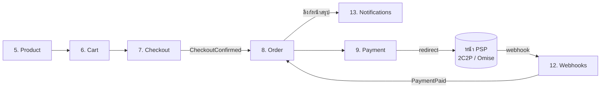

# บริบทและบทบาทของโมดูล — Payment Orchestration Platform

> เอกสารนี้คือ module map ระดับแพลตฟอร์ม: **บริบท (ทำไมต้องมี) + บทบาท (ทำอะไร/ไม่ทำอะไร)
> + ฟีเจอร์ละเอียด (โมเดลเป้าหมายรายข้อ เทียบ as-built)** ของทุกโมดูล
> เขียนตาม **โมเดลเป้าหมาย** พร้อมระบุ **สถานะจริงในโค้ด** ต่อโมดูลและต่อฟีเจอร์
> (ณ 2026-07-04, branch `develop`).
>
> เอกสารลึกรายเรื่อง: [payment-orchestration-modules.md](payment-orchestration-modules.md) (Payments/PSP/flow),
> [entity-fields.md](entity-fields.md) (ทุก entity/field/enum), [src-structure.md](src-structure.md) (โครงโค้ด),
> [admin-google-sso.md](admin-google-sso.md) + [producer-google-sso.md](producer-google-sso.md) (auth),
> [search-filter-sort.md](search-filter-sort.md) (query convention)

---

## สารบัญ

- [วิธีอ่านเอกสารนี้](#วิธีอ่านเอกสารนี้)
- [ภาพรวมแพลตฟอร์ม](#ภาพรวมแพลตฟอร์ม)
- [1. Payment Orchestration Platform](#1-payment-orchestration-platform)
- [2. Tenant](#2-tenant)
- [3. Admin](#3-admin) — [3.1 โมดูล Admin](#31-โมดูล-admin--บัญชีผู้ใช้--google-oidc-bff) · [3.2 โมดูล Admin RBAC](#32-โมดูล-admin-rbac)
- [4. Producer](#4-producer) — [4.1 โมดูล Producer](#41-โมดูล-producer--บัญชีผู้ใช้--google-oidc-bff) · [4.2 โมดูล Producer RBAC](#42-โมดูล-producer-rbac)
- [5. Product](#5-product)
- [6. Cart](#6-cart)
- [7. Checkout](#7-checkout)
- [8. Order](#8-order)
- [9. Payment](#9-payment--external-redirect--hosted-payment-page)
- [10. Transaction](#10-transaction)
- [11. Payment Service Providers](#11-payment-service-providers)
- [12. Webhooks](#12-webhooks)
- [13. Notifications](#13-notifications)
- [14. Audit](#14-audit)
- [ตารางสรุป](#ตารางสรุป)
- [ช่องว่างเทียบเป้าหมาย (as-built gaps)](#ช่องว่างเทียบเป้าหมาย-as-built-gaps)

---

## วิธีอ่านเอกสารนี้

ทุกโมดูลมี 5 ส่วนคงที่:

| ส่วน | ความหมาย |
|---|---|
| **บริบท** | โมดูลนี้คืออะไร อยู่ตรงไหนของ flow แก้ปัญหาอะไร |
| **บทบาท** | หน้าที่ที่ own + ขอบเขตที่จงใจ *ไม่ทำ* |
| **ฟีเจอร์ละเอียด** | รายการฟีเจอร์รายข้อของโมเดลเป้าหมาย + ข้อเสนอใหม่ พร้อมสถานะจริงต่อข้อ |
| **ความสัมพันธ์** | โยงกับโมดูลอื่นอย่างไร (id-reference, integration event) |
| **สถานะ** | เทียบโค้ดจริงบน `develop` (สรุประดับโมดูล) |

ค่าสถานะ (ใช้ทั้งระดับโมดูลและรายฟีเจอร์):

| สถานะ | ความหมาย |
|---|---|
| **มีแล้ว** | โค้ด + test อยู่บน `develop` ครบตามบทบาทหลัก |
| **บางส่วน** | มีแกนแล้ว แต่ยังขาด field/พฤติกรรมเทียบโมเดลเป้าหมาย (ระบุ gap ไว้ในหัวข้อ) |
| **ยังไม่มี** | เป้าหมาย (จาก canon/target docs) ที่ยังไม่เริ่ม implement — ถ้ามี `(ข้อ N)` ดูรายละเอียดใน [ช่องว่าง](#ช่องว่างเทียบเป้าหมาย-as-built-gaps) |
| **เสนอ** | ข้อเสนอใหม่จากการวิเคราะห์ 2026-07-04 — ยังไม่อยู่ในเป้าหมาย/สเปกใด ต้องตัดสินใจเชิง product ก่อนเปิด spec |

การแก้ gap ใดๆ ต้องผ่าน spec workflow ของตัวเอง (`/spec-new`) — เอกสารนี้บันทึกเพื่อการรับรู้ ไม่ใช่ใบสั่งงาน
และฟีเจอร์ทุกข้อต้องเคารพ [non-goals](../../.ai/shared/PROJECT_CONTEXT.md) (ห้าม settlement/payout, billing,
public onboarding, แตะข้อมูลบัตร, ฟังก์ชัน PSP เอง, non-redirect, reconciliation ที่เคลื่อนเงิน)

---

## ภาพรวมแพลตฟอร์ม

**ผู้ใช้งาน 3 กลุ่ม, console 2 แอป:**

| Actor | เข้าระบบผ่าน | ทำอะไร |
|---|---|---|
| **Admin** — พนักงานภายในองค์กร | Admin Console (internal-only) | provision tenant, ตั้งค่า PSP, อนุมัติ producer, จัดการ role, monitor/audit |
| **Producer** — ตัวแทน/นายหน้าประกันภัย | Tenant Console (3 บริษัทใช้ร่วม) | เลือกสินค้า → ตะกร้า → checkout → สร้างคำสั่งซื้อ ในนามบริษัทในเครือของตน |
| **ลูกค้า** | ลิงก์หน้าสรุปคำสั่งซื้อ (ไม่มีบัญชี) | เปิดลิงก์ → กดยืนยัน → จ่ายผ่าน redirect ไปหน้า PSP เท่านั้น |

**2 ระนาบที่แยกขาดกัน:** control plane (config/กำกับดูแล — ตาราง admin/session/RBAC/provisioning ไม่อยู่ใต้ RLS, สิทธิ์ `pol_admin`) กับ data plane (รายการขาย/จ่าย + สถานะ — ทุกตารางผูก `TenantId` ใต้ SQL Server RLS floor ผ่าน `SESSION_CONTEXT('TenantId')`) — เงินจริงไม่วิ่งผ่านแพลตฟอร์มในทุกกรณี

**เส้นทางหลัก (happy path):**

Audit (14) บันทึกการกระทำสำคัญตลอดแนว; Tenant (2) / Admin (3) / Producer (4) / PSP (11) เป็นชั้น config + ตัวตนที่รองรับ flow นี้

**ลำดับความสำคัญของ config ช่องทางชำระเงิน** — ตัวเลข "อันดับ" ในเอกสารนี้คือลำดับความสำคัญ/ลำดับการตั้งค่า (config รากฐานต้องพร้อมก่อน) ไม่ใช่ logic ตัดกรองอัตโนมัติ:

| อันดับ | ระดับ | ตั้งอะไร | ที่เก็บ | สถานะ |
|---|---|---|---|---|
| 1 | **PSP** (§11) | การเชื่อมต่อ PSP + ช่องทางที่เปิดต่อ connection | `PspConnection.EnabledMethods` | มีแล้ว (เก็บ verbatim, ยังไม่ enforce) |
| 2 | **Tenant** (§2) | ช่องทางที่บริษัทในเครือเปิดใช้ | `Tenant.EnabledChannels` | มีแล้ว (เก็บ verbatim, ยังไม่ enforce) |
| 3 | **Producer** (§4) | ช่องทางที่ผู้ใช้งานใช้ได้ | - | ยังไม่มี (ปัจจุบัน RBAC คุมแค่ *สิทธิ์ทำรายการจ่าย* ไม่ใช่รายช่องทาง) |

ช่องทางทั้งระบบมี 3 ค่า (code string เสถียร): `"card"` / `"promptpay"` / `"installment"` — redirect-only ทุกช่องทาง (นี่คือ catalog ของค่า; adapter จริงยังรองรับไม่ครบทุกช่อง — ดู §11)

---

## 1. Payment Orchestration Platform

**บริบท** — ตัวกลางจัดการและกระจายธุรกรรมการชำระเงินของบริษัทในเครือ (vCentral / vCommerce / vSouvenir) แบบ **captive/internal**: ให้ทุกบริษัทรับชำระออนไลน์ผ่าน PSP ที่ถือใบอนุญาตอยู่แล้ว โดยแพลตฟอร์ม **"ใช้" PSP ไม่ใช่ "เป็น" PSP** — เงิน settle จาก PSP เข้าบัญชี merchant ของแต่ละบริษัทโดยตรง จึงอยู่นอก funds flow (ไม่เข้าข่ายใบอนุญาตประเภทที่ 3) และคง PCI **SAQ A** ด้วยโมเดล redirect-only

**บทบาท**
- orchestrate ทั้งสาย: catalog → cart → checkout → order → payment → webhook → แจ้งเตือน — จบที่รับชำระสำเร็จ (ไม่มีขั้นออกกรมธรรม์/จัดส่ง)
- normalize PSP หลายเจ้าให้เป็นสัญญาเดียว (adapter ต่อ PSP, §11)
- บังคับ cross-cutting ทั้งระบบ: multi-tenant isolation (RLS floor), webhook = source of truth, idempotency, transactional outbox, credential vault, audit append-only
- *ไม่ทำ* (non-goals ตาม [PROJECT_CONTEXT](../../.ai/shared/PROJECT_CONTEXT.md)): settlement/payout/ledger เงินจริง · billing/เก็บค่าบริการ · public onboarding · แตะข้อมูลบัตร · ฟังก์ชันของ PSP เอง · flow แบบ non-redirect · reconciliation ที่เคลื่อนเงิน

**ฟีเจอร์ละเอียด (cross-cutting ของทั้งแพลตฟอร์ม)**

| ฟีเจอร์ | รายละเอียด | สถานะ |
|---|---|---|
| Modular monolith + Mediator | 8 โมดูลใน `src/Modules/` คุยผ่าน `ICommand`/`IQuery`/`INotification` เท่านั้น — ห้ามอ้างถึงกันตรง (มี Architecture.Tests คุม) | มีแล้ว |
| Transactional outbox + Worker | integration event เขียนใน unit of work เดียวกับ state change → Worker dispatch พร้อม retry/backoff → DLQ | มีแล้ว |
| Idempotency store | claim แบบ multi-key (`IdempotencyRecord`) กันประมวลผลซ้ำทั้งขา webhook และ consumer ภายใน | มีแล้ว |
| Multi-tenant RLS floor | SQL Server RLS + `SESSION_CONTEXT('TenantId')` ทุกตาราง data plane; scoped-admin cross-tenant read บังคับผ่าน seam เดียว `IAdminQuery` | มีแล้ว |
| Money type ที่ seam | `Money { MinorUnits, Currency }` ใน SharedKernel — ห้าม decimal/float ที่ cross-module seam | มีแล้ว |
| Credential vault | envelope encryption ต่อ tenant, secret write-only + อ่านกลับ mask, ทุกการ reveal ลง audit แบบ hash-chain | มีแล้ว |
| Audit append-only | grant เฉพาะ `SELECT`+`INSERT` ระดับ DB + เขียนใน transaction เดียวกับ action | มีแล้ว |
| Error contract 2 surface | JSON = ProblemDetails · OAuth callback = 302 redirect + `?reason=` ทุก outcome | มีแล้ว |
| Rate limiting เฉพาะจุดเสี่ยง | 3 policy: admin auth · producer auth · webhook | มีแล้ว |
| Maker-checker | action อ่อนไหว (approve tenant, เปลี่ยน routing, แก้ allowlist) ต้องมีผู้อนุมัติคนที่สอง — เป้าหมายเดิมใน canon; ปัจจุบันทุก action เป็น single-actor + permission gate | ยังไม่มี (ข้อ 14) |
| Health check endpoint | liveness/readiness สำหรับ orchestrator/monitoring ตอน deploy จริง — ไม่พบ `AddHealthChecks`/`MapHealthChecks` ใน Hosts | ยังไม่มี (ข้อ 15) |
| Observability/ops | metrics + alert (DLQ โต, webhook `Rejected` ผิดปกติ, outbox ค้าง) + เครื่องมือ inspect/requeue DLQ | เสนอ |

**ความสัมพันธ์** — โมดูลทั้งหมดอยู่ใน backend เดียว (modular monolith, Clean Architecture + CQRS) คุยกันผ่าน Mediator เท่านั้น ไม่อ้างถึงกันตรง; ข้ามโมดูลใช้ integration event ผ่าน transactional outbox + Worker: `CheckoutConfirmed`, `PaymentPaid`, `CustomerOrderNotification`, `TenantUserRegistrationSubmitted`

**สถานะ: มีแล้ว** — 8 โมดูลใน `src/Modules/` + `BuildingBlocks`/`Contracts`/`SharedKernel`, hosts `Api` + `Worker`; เงิน = `Money { MinorUnits, Currency }` ใน SharedKernel

---

## 2. Tenant

**บริบท** — ข้อมูลตั้งค่าของบริษัทในเครือเพื่อเชื่อมต่อกับแพลตฟอร์ม: ตัวตนบริษัท, ช่องทางชำระเงินที่เปิดใช้ระดับบริษัท, และเป็นแกนของ multi-tenant isolation ทั้งระบบ (**ลำดับความสำคัญ config อันดับ 2** — ตั้งได้เมื่อ PSP connection พร้อมแล้ว)

**บทบาท**
- เก็บ `Tenant`: `Code` (allowlist เฉพาะ 3 บริษัทในเครือ, lowercase), `DisplayName`, `LegalEntityId`, `Status`, `Country`, `Currency`, `EnabledChannels`, `Metadata`
- เป็นเจ้าของ `TenantId` ที่ RLS ใช้กรองทุกตาราง data plane — backend ร่วมกันแต่ข้อมูลไม่รั่วข้าม tenant
- จุดยึด provisioning: Admin สร้าง tenant + `PspConnection` + secret ลง vault **ใน transaction เดียว** (ADR-0001 — ยัง valid ตราบที่ vault เป็น DB-backed) พร้อม `ProvisioningAudit`
- *ไม่เก็บ* PSP credential เอง — อยู่ใน vault ผ่าน `PspConnection.SecretRefName` (§11)

**ฟีเจอร์ละเอียด**

| ฟีเจอร์ | รายละเอียด | สถานะ |
|---|---|---|
| Tenant entity ครบ field | `Code` (allowlist, lowercase) · `DisplayName` · `LegalEntityId` · `Status` · `Country` · `Currency` · `EnabledChannels` · `Metadata` | มีแล้ว |
| Provisioning แบบ atomic | `POST /admin/tenants` (Super-only): tenant + `PspConnection` + secret ลง vault ใน transaction เดียว + `ProvisioningAudit` + idempotent ด้วย tenant key | มีแล้ว |
| อ่าน tenant รายตัว | `GET /admin/tenants/{code}` | มีแล้ว |
| List tenant ฝั่ง admin | รายการ tenant ทั้งหมดสำหรับหน้า console (เลือก/จัดการ) — ยังไม่มี endpoint | เสนอ |
| แก้ config หลัง provision | update `DisplayName`/`EnabledChannels`/`Metadata` — เป็นหน้าที่ admin ตาม canon ("จัดการ tenant") แต่ยังไม่มี endpoint ใด | ยังไม่มี |
| Tenant lifecycle | `Status` มี field แล้ว แต่ไม่มีเส้นทาง suspend/deactivate/reactivate | ยังไม่มี |
| Channel enablement enforce | `EnabledChannels` ถูกใช้ตัดสิทธิ์จริงตอนสร้าง payment session | ยังไม่มี (ข้อ 1) |
| Branding/routing/session policy | payload เป้าหมายใน [payment-orchestration-modules.md](payment-orchestration-modules.md) (branding, routing primary/fallback ต่อช่องทาง, session expiry/idempotency TTL) — เก็บได้ใน `Metadata` verbatim แต่ยังไม่มี schema/ผู้ใช้จริง | ยังไม่มี (routing = ข้อ 13) |
| API client ต่อ tenant | machine-to-machine credential สำหรับระบบของบริษัทในเครือเรียก API ตรง (permission `apikey.manage` จองชื่อแล้ว) | ยังไม่มี (ข้อ 6) |

**ความสัมพันธ์** — ทุก entity ฝั่ง data plane (Product/Cart/CheckoutSession/Order/PaymentSession/PspConnection) อ้าง `TenantId`; `AdminTenantAssignment` (§3) และ `ProducerTenantAssignment` (§4) ชี้เข้าเพื่อกำหนดขอบเขตการเข้าถึง

**สถานะ: บางส่วน**
- มีแล้ว: entity + provisioning (`POST /admin/tenants` Super-only, `GET /admin/tenants/{code}`)
- gap: `EnabledChannels` เก็บ verbatim ยังไม่ถูกใช้ enforce ที่ใด (จงใจ defer ใน tenant spec REQ-3.4); **"ไคลเอนต์ API" ยังไม่มี entity** — auth ฝั่ง Tenant Console ปัจจุบันคือ Google id-token Bearer ผูก audience ของ SPA (permission `apikey.manage` จองชื่อไว้ในแคตตาล็อกแต่ยังไม่ implement); ยังไม่มีเส้นทางแก้ไข/จัดการ tenant หลัง provision

---

## 3. Admin

**บริบท** — พนักงานภายในองค์กร ผู้ใช้งาน **Admin Console** (internal-only, คนละแอปกับ Tenant Console เพื่อลด blast radius): กำกับดูแลแพลตฟอร์ม — provision tenant, ตั้งค่า PSP, อนุมัติ/ปฏิเสธ producer, จัดการสิทธิ์, ตรวจ audit

### 3.1 โมดูล Admin — บัญชีผู้ใช้ + Google OIDC BFF

**บทบาท**
- `AdminAccount`: `Subject` (Google `sub`, ผูกตอน login ครั้งแรกของบัญชีที่ถูกเชิญ), `Email` (invite key), `Tier` (`Super`/`Scoped`), `Status` (`Active`/`Suspended`)
- login = **server-side OIDC BFF** (Authorization Code + PKCE, confidential client): opaque session cookie `__Host-adm_session` (DB เก็บเฉพาะ hash), rotation + reuse-detection + instant revoke, CSRF double-submit — ไม่รับ Google id-token เป็น Bearer ฝั่ง admin
- bootstrap Super คนแรกผ่าน allowlist self-provision; เชิญ Scoped ด้วย email
- `Scoped` เข้าถึงเฉพาะ tenant ตาม `AdminTenantAssignment`; cross-tenant read ทุกอย่างบังคับผ่าน seam เดียว `IAdminQuery` (`Super` = unrestricted)
- endpoints: `GET /admin/auth/login`, `POST /admin/auth/logout[-all]`, `GET /admin/me`, จัดการบัญชี `POST /admin/admins`, `POST /admin/admins/{id}/suspend`, assign tenant `POST/DELETE /admin/admins/{id}/tenants[/{tenantId}]`

**ฟีเจอร์ละเอียด**

| ฟีเจอร์ | รายละเอียด | สถานะ |
|---|---|---|
| Google OIDC BFF login | Authorization Code + PKCE, confidential client — `GET /admin/auth/login` | มีแล้ว |
| Opaque session cookie | `__Host-adm_session`; DB เก็บเฉพาะ SHA-256 hash ของ token | มีแล้ว |
| Session hygiene | rotation + reuse-detection + instant revoke; `POST /admin/auth/logout` และ `logout-all` | มีแล้ว |
| CSRF | double-submit cookie | มีแล้ว |
| Auth rate limiting | policy เฉพาะเส้นทาง auth ฝั่ง admin | มีแล้ว |
| Bootstrap Super คนแรก | allowlist self-provision (config `AdminAllowlist:Subjects`) | มีแล้ว |
| เชิญ/พักบัญชี | `POST /admin/admins` (invite ด้วย email), `POST /admin/admins/{id}/suspend` | มีแล้ว |
| Reactivate บัญชีที่ถูกพัก | เส้นทางคืนสถานะ `Suspended` → `Active` — ยังไม่มี endpoint | เสนอ |
| List/ดูบัญชี admin | รายการบัญชี + tier + tenant assignment + session ที่เปิดอยู่ สำหรับหน้า console | เสนอ |
| Tenant assignment | `POST/DELETE /admin/admins/{id}/tenants[/{tenantId}]` — `Scoped` เห็นเฉพาะ tenant ที่ assign | มีแล้ว |
| Cross-tenant read seam | `IAdminQuery` seam เดียว (ฝัง `WHERE TenantId IN accessible`; `Super` unrestricted) | มีแล้ว |
| ตัวตนปัจจุบัน | `GET /admin/me` | มีแล้ว |

**ความสัมพันธ์** — ตารางทั้งหมดเป็น control plane (ไม่อยู่ใต้ RLS); การกระทำลง `AdminAccountAudit`/`AdminAuthAudit` (§14); เป็นผู้อนุมัติ producer (§4)

**สถานะ: มีแล้ว** — รายละเอียด flow เต็ม: [admin-google-sso.md](admin-google-sso.md), [admin-fe-integration.md](admin-fe-integration.md)

### 3.2 โมดูล Admin RBAC

**บทบาท**
- permission catalog เป็น reference data ใน DB (16 keys / 6 กลุ่ม: txn, merchant, finance, user, system, producer) — feature ใหม่ seed key ของตัวเองผ่าน migration
- `AdminRole` → `AdminRolePermission` → `AdminRoleAssignment`; สิทธิ์รวม = **union ของ role ที่ Active**
- แกน role/permission **orthogonal กับ `AdminTier`**: Tier คุม *ขอบเขต tenant*, role คุม *ความสามารถ* — ไม่มี Super bypass permission
- `RequirePermission(...)` fail-closed (403 เมื่อ scope ไม่ถูก bind, ไม่มีทาง 500) + boot parity guard (startup fail ถ้า gate ใช้ key ที่ไม่อยู่ในแคตตาล็อก); `super_admin` เป็น recovery anchor ลบ/ปิดไม่ได้
- endpoints: `GET /admin/permissions`, `GET/POST/PUT/DELETE /admin/roles[/{code}]`, `PUT /admin/admins/{id}/roles`

**ฟีเจอร์ละเอียด**

| ฟีเจอร์ | รายละเอียด | สถานะ |
|---|---|---|
| Permission catalog ใน DB | 16 keys / 6 กลุ่ม seed ผ่าน migration; feature ใหม่เพิ่ม key ของตัวเอง | มีแล้ว |
| Role CRUD + assignment | `GET/POST/PUT/DELETE /admin/roles[/{code}]`, `PUT /admin/admins/{id}/roles`; code slug `^[a-z0-9_]+$` | มีแล้ว |
| สิทธิ์รวม = union ของ role Active | resolve สดต่อ request | มีแล้ว |
| Orthogonal Tier × role | Tier คุมขอบเขต tenant, role คุมความสามารถ — ไม่มี Super bypass | มีแล้ว |
| Fail-closed + boot parity guard | `RequirePermission(...)` = 403 เสมอเมื่อ bind ไม่ถูก; startup fail ถ้า gate ใช้ key นอกแคตตาล็อก | มีแล้ว |
| Recovery anchor | `super_admin` ลบ/ปิดไม่ได้; bootstrap auto-assign + migration back-fill | มีแล้ว |
| Audit การเปลี่ยน role | ทุกการเปลี่ยนบัญชี/role ลง `AdminAccountAudit` มี actor เสมอ | มีแล้ว |
| Effective-permission view | มุมมองดูสิทธิ์รวมของ admin รายคน (ช่วย debug/ตรวจสิทธิ์) | เสนอ |

**สถานะ: มีแล้ว**

---

## 4. Producer

**บริบท** — **ตัวแทนประกันภัย / นายหน้าประกันภัย** ผู้ใช้งาน **Tenant Console**: ผู้ทำรายการขายและรับชำระในนามบริษัทในเครือที่ตนสังกัด (**ลำดับความสำคัญ config อันดับ 3**)
หมายเหตุนิยาม: เอกสารรุ่นก่อนหน้าเรียก actor นี้ว่า "พนักงานบริษัทในเครือ" — เอกสารนี้ปรับเป็นตัวแทน/นายหน้าตามโมเดลธุรกิจจริง ซึ่งโค้ดรองรับอยู่แล้ว (`ProducerCode`, `LicenseNumber`, `PersonType` บนบัญชี)

### 4.1 โมดูล Producer — บัญชีผู้ใช้ + Google OIDC BFF

**บทบาท**
- `ProducerAccount`: `Subject` (unique), `Email`, `Status` (`PendingApproval` → `Active` / `Rejected`; `Suspended`), ข้อมูลบุคคล/ใบอนุญาต (`FirstName`, `LastName`, `PersonType`, `IdNumber`, `ProducerCode`, `LicenseNumber`, `Phone`) + รูปถ่าย
- สมัครแบบ **ticket-gated**: ticket เป็น stateless signed token (Data Protection — ไม่มีตาราง ticket) → `POST /producer/register` (multipart + รูป) → admin อนุมัติ/ปฏิเสธ (`POST /admin/tenant-users/{subject}/approve|reject`, gate ด้วย permission `producer.approve`/`producer.reject` ฝั่ง Admin) — tenant + role ถูกกำหนดฝั่ง server ตอนอนุมัติ ไม่มาจาก token
- login = OIDC BFF มิเรอร์ฝั่ง Admin แต่แยกขาดกัน (OAuth client + scheme `ProducerGoogle` คนละตัว): cookie `__Host-prd_session` + CSRF `prd_csrf`, rotation/reuse-detection/revoke; callback แตก 4 ทางตามสถานะบัญชี (Active → session, ยังไม่มีบัญชี → ticket ไปหน้า register ฯลฯ)
- นโยบาย auth `producer` เป็น dual-scheme: ProducerSession cookie **หรือ** tenant Bearer
- endpoints: `GET /producer/auth/login`, `POST /producer/register`, `GET /producer/me`, `POST /producer/auth/logout[-all]`

**ฟีเจอร์ละเอียด**

| ฟีเจอร์ | รายละเอียด | สถานะ |
|---|---|---|
| สมัครแบบ ticket-gated | ticket = stateless signed token (Data Protection), short-lived + single-use — ไม่มีตาราง ticket | มีแล้ว |
| ฟอร์มสมัคร + รูปถ่าย | `POST /producer/register` (multipart): ข้อมูลบุคคล/ใบอนุญาต (`PersonType`, `IdNumber`, `ProducerCode`, `LicenseNumber`, `Phone`) + รูป | มีแล้ว |
| กันสมัครซ้ำ | guard `HasPendingAsync` (Subject OR Email) block การสมัครที่มีคำขอค้าง | มีแล้ว |
| อนุมัติ/ปฏิเสธ + เหตุผล | `POST /admin/tenant-users/{subject}/approve\|reject` gate ด้วย `producer.approve`/`producer.reject`; tenant + role กำหนดฝั่ง server; เหตุผล persist ลง `RegistrationAudit` | มีแล้ว |
| Resubmit หลังถูกปฏิเสธ | correction ticket → แก้ข้อมูล → กลับเข้า `PendingApproval` | มีแล้ว |
| OIDC BFF login แยกขาดจาก admin | scheme `ProducerGoogle` + OAuth client คนละตัว; cookie `__Host-prd_session` + `prd_csrf`; rotation/reuse-detection/instant revoke; logout/logout-all; auth rate limiting | มีแล้ว |
| Callback แตกตามสถานะบัญชี | 4 ทาง: Active → session · ไม่มีบัญชี → ticket ไปหน้า register · Pending/Rejected/Suspended → 302 redirect + `?reason=` (ทุก outcome เป็น redirect เดียวกันหมด) | มีแล้ว |
| Dual-scheme policy | นโยบาย `producer` = ProducerSession cookie หรือ tenant Bearer | มีแล้ว |
| ตัวตนปัจจุบัน | `GET /producer/me` | มีแล้ว |
| พัก/เพิกถอนบัญชี producer | `Suspended` มีใน enum + callback รองรับแล้ว แต่ไม่มีเส้นทางสั่งพัก/คืนสถานะ (offboarding ตัวแทนที่พ้นสภาพ) | ยังไม่มี |
| List/ค้นหา producer ฝั่ง admin | คิว `PendingApproval` + จัดการรายบัญชีบนหน้า console — ปัจจุบันมีแค่ notice ในระบบ + approve/reject ราย subject | เสนอ |
| แก้ไข profile หลัง Active | เปลี่ยนข้อมูลติดต่อ/รูป โดยไม่ต้องสมัครใหม่ | เสนอ |

**ความสัมพันธ์** — `ProducerTenantAssignment` ผูกบัญชีกับ tenant (1 บัญชี/1 tenant); สมัครแล้ว emit `TenantUserRegistrationSubmitted` แจ้งฝั่ง Admin; auth/registration ลง `ProducerAuthAudit`/`RegistrationAudit` (§14)

**สถานะ: มีแล้ว** — รายละเอียด flow เต็ม: [producer-google-sso.md](producer-google-sso.md)

### 4.2 โมดูล Producer RBAC

**บทบาท**
- แคตตาล็อกแยกของฝั่ง producer (จงใจ duplicate โครงจาก Admin RBAC — คนละวงจรชีวิต ห้าม refactor รวม): 7 keys / 3 กลุ่ม — `product.create`, `product.update`, `payment.create`, `payment.redirect`, `producer.roles.view`, `producer.roles.manage`, `producer.user.roles`
- `RequireProducerPermission(...)` fail-closed + boot parity guard เช่นเดียวกับฝั่ง Admin; การ enforce ฝั่ง write เปิดผ่าน flag `Producer:EnforcePermissionsOnWrites`
- endpoints: `GET /producer/permissions`, `GET/POST/PUT/DELETE /producer/roles[/{code}]`, `PUT /producer/tenant-users/{tenantUserId}/roles`

**ฟีเจอร์ละเอียด**

| ฟีเจอร์ | รายละเอียด | สถานะ |
|---|---|---|
| แคตตาล็อกแยกฝั่ง producer | 7 keys / 3 กลุ่ม — จงใจ duplicate โครงจาก Admin (คนละวงจรชีวิต ห้าม refactor รวม) | มีแล้ว |
| Role CRUD + assignment | `GET/POST/PUT/DELETE /producer/roles[/{code}]`, `PUT /producer/tenant-users/{tenantUserId}/roles`; role status lowercase บน wire | มีแล้ว |
| Fail-closed + boot parity guard | `RequireProducerPermission(...)` มิเรอร์ฝั่ง Admin | มีแล้ว |
| Enforce flag ฝั่ง write | `Producer:EnforcePermissionsOnWrites` เปิด/ปิดการ enforce บน write endpoint | มีแล้ว |
| ช่องทางจ่ายต่อ producer | config อันดับ 3 — จำกัดรายช่องทาง (`card`/`promptpay`/`installment`) ต่อผู้ใช้; ปัจจุบัน RBAC คุมแค่สิทธิ์ *ทำรายการจ่าย* | ยังไม่มี |

**สถานะ: มีแล้ว** — ส่วน "ช่องทางชำระเงินที่เปิดใช้ต่อ producer" (อันดับ 3 ของ config ช่องทาง) **ยังไม่มี**: RBAC ปัจจุบันคุมสิทธิ์ *ทำรายการจ่าย* (`payment.create`/`payment.redirect`) ไม่ใช่รายช่องทาง

---

## 5. Product

**บริบท** — สินค้าที่ขายบนแพลตฟอร์ม = แผน/กรมธรรม์ประกันภัยที่ producer เลือกให้ลูกค้า; catalog แยกต่อ tenant

**บทบาท**
- `Product`: `Name`, ราคาเป็น `Money` (minor units + currency — สองคอลัมน์ scalar), `IsActive`
- เป็น source ของราคาเสมอ — Cart ดึงราคาจาก catalog ตอน add item, ไม่รับราคาจาก client
- endpoints: `POST /products` (tenant Bearer หรือ producer + `product.create`), `GET /products` (แบ่งหน้า/กรอง/เรียงตาม [search-filter-sort.md](search-filter-sort.md))

**ฟีเจอร์ละเอียด**

| ฟีเจอร์ | รายละเอียด | สถานะ |
|---|---|---|
| สร้างสินค้า | `POST /products` (tenant Bearer หรือ producer + `product.create`) | มีแล้ว |
| ราคาเป็น `Money` + source of truth | Cart ดึงราคาจาก catalog ตอน add — ไม่รับราคาจาก client; `Price` เป็น unmapped computed (project scalar สองคอลัมน์) | มีแล้ว |
| List + ค้นหา/กรอง/เรียง | `GET /products` ตาม SFS convention (JSON-DSL) — implement แล้ว (`ProductSfs`) | มีแล้ว |
| Query รายตัวภายใน | `GetProductById` ผ่าน Mediator — ผู้ใช้คือ Cart ตอน add item (ไม่มี public endpoint) | มีแล้ว |
| แก้ไข/ปิดสินค้า | `IsActive` มี field และ permission `product.update` จองในแคตตาล็อกแล้ว — แต่ไม่มี endpoint update/deactivate | ยังไม่มี (ข้อ 11) |
| อ่านรายตัว public | `GET /products/{id}` สำหรับหน้า detail ฝั่ง console | เสนอ |
| Field เฉพาะประกันภัย | แผนความคุ้มครอง, ทุนเอาประกัน, ระยะเวลาคุ้มครอง, เงื่อนไข/เอกสารแนบ, quote เบี้ย — target เดิมระบุ "แคตตาล็อก + quote เบี้ย" | ยังไม่มี (เป้าหมายเดิม ยังไม่นิยาม scope) |

**ความสัมพันธ์** — `CartItem` อ้าง `ProductId`; ราคาถูก snapshot เข้า cart ตอนหยิบ

**สถานะ: มีแล้ว** — ปัจจุบันเป็น generic catalog item; field เฉพาะประกันภัย (แผนความคุ้มครอง, ทุนเอาประกัน ฯลฯ) ยังไม่มีนิยามใน scope; ยังไม่มีเส้นทางแก้ไข/ปิดสินค้า

---

## 6. Cart

**บริบท** — ตะกร้ารวมรายการสินค้าที่ producer เลือกให้ลูกค้า ก่อนเข้าสู่ checkout

**บทบาท**
- `Cart` + `CartItem`: add แล้ว merge รายการสินค้าเดิมที่ราคาเท่ากัน, แก้จำนวน/ลบ/ล้างได้ระหว่าง `Open`
- `Subtotal` คำนวณฝั่ง domain, บังคับสกุลเงินเดียวทั้งตะกร้า
- `MarkCheckedOut` freeze ตะกร้า (`Open` → `CheckedOut`)
- endpoints: `POST /carts`, `POST /carts/{id}/items`, `GET /carts/{id}`, `PUT/DELETE /carts/{id}/items/{productId}`, `POST /carts/{id}/clear`

**ฟีเจอร์ละเอียด**

| ฟีเจอร์ | รายละเอียด | สถานะ |
|---|---|---|
| สร้าง/อ่านตะกร้า | `POST /carts`, `GET /carts/{id}` | มีแล้ว |
| เพิ่มรายการ + merge | `POST /carts/{id}/items` — รายการสินค้าเดิมที่ราคาเท่ากันถูกรวมจำนวน | มีแล้ว |
| แก้จำนวน / ลบ / ล้าง | `PUT/DELETE /carts/{id}/items/{productId}`, `POST /carts/{id}/clear` — ทำได้เฉพาะสถานะ `Open` | มีแล้ว |
| Subtotal ฝั่ง domain | คำนวณใน domain + บังคับสกุลเงินเดียวทั้งตะกร้า | มีแล้ว |
| Freeze ตอน checkout | `MarkCheckedOut` (`Open` → `CheckedOut`) — แก้ไขต่อไม่ได้ | มีแล้ว |
| เก็บกวาดตะกร้าค้าง | TTL/นโยบาย expire ตะกร้า `Open` ที่ถูกทิ้ง (housekeeping ข้อมูล) | เสนอ |
| นโยบายราคาเปลี่ยนระหว่างทาง | re-validate ราคา snapshot เทียบ catalog ตอน checkout (ตอนนี้ยึด snapshot ตอน add เสมอ) | เสนอ (ต้องตัดสินใจเชิงนโยบายก่อน) |

**ความสัมพันธ์** — ราคา unit ดึงจาก Products ตอน add (กัน client กำหนดราคาเอง); `CheckoutSession` อ้าง `CartId` และล็อกยอดจาก `Subtotal`

**สถานะ: มีแล้ว**

---

## 7. Checkout

**บริบท** — ขั้นกำหนดข้อมูลประกอบรายการ **ก่อนยืนยันคำสั่งซื้อ** โมเดลเป้าหมายครอบคลุม: ผู้ทำรายการ (Producer), ข้อมูลลูกค้า, รายการสินค้า, ช่องทางการชำระเงิน (ล็อก 1 ช่องต่อคำสั่งซื้อ), การแจ้งเตือนลูกค้า (อีเมล/SMS), การแจ้งเตือนผู้รับที่กำหนดเอง (อีเมล/SMS), และหมายเหตุ

**บทบาท**
- `CheckoutSession`: ล็อกยอดจาก `Cart.Subtotal` ฝั่ง server เสมอ (client ส่งยอดเองไม่ได้), สถานะ `Started` → `Confirmed` / `Abandoned`
- `Confirm()` emit `CheckoutConfirmed` ผ่าน outbox ใน unit of work เดียวกัน → Orders เปิดคำสั่งซื้อ (Checkout ไม่สร้าง Order เอง และไม่แตะ PSP)
- endpoints: `POST /checkout`, `POST /checkout/{id}/confirm`

**ฟีเจอร์ละเอียด**

| ฟีเจอร์ | รายละเอียด | สถานะ |
|---|---|---|
| Session + ล็อกยอด server-side | ยอดมาจาก `Cart.Subtotal` เสมอ — client ส่งยอดเองไม่ได้ (`POST /checkout`) | มีแล้ว |
| Confirm → event | `POST /checkout/{id}/confirm` → `CheckoutConfirmed` ผ่าน outbox ใน unit of work เดียว → Orders เปิดใบ | มีแล้ว |
| ผู้รับแจ้งเตือน 1 ค่า | `NotificationRecipient` ต่อ session | มีแล้ว |
| ผูกผู้ทำรายการ | ระบุ producer บนรายการ (ใครเป็นผู้ขาย — จำเป็นต่อรายงาน/ความรับผิดชอบ) | ยังไม่มี (ข้อ 3) |
| ข้อมูลลูกค้า | ชื่อ/ช่องทางติดต่อผู้ซื้อ ประกอบใบสั่งซื้อ | ยังไม่มี (ข้อ 3) |
| ผู้รับแจ้งเตือนหลายรายการ แยกประเภท | ลูกค้า + ผู้รับที่กำหนดเอง, ระบุชนิดต่อรายการ (อีเมล/SMS) | ยังไม่มี (ข้อ 3) |
| ล็อกช่องทางจ่ายตั้งแต่ checkout | เลือก 1 ช่องทางต่อคำสั่งซื้อแล้วล็อก — ลูกค้าเปลี่ยนเองไม่ได้ที่หน้าสรุป (ปัจจุบันช่องทางถูกเลือกตอนสร้าง payment session §9 แทน) | ยังไม่มี (ข้อ 3) |
| หมายเหตุ | note ประกอบรายการ | ยังไม่มี (ข้อ 3) |
| ส่วนลด | target sequence เดิมมี "สรุป + ส่วนลด" — ยังไม่นิยาม scope (ชนิดส่วนลด/ผู้อนุมัติ) | ยังไม่มี (เป้าหมายเดิม) |
| Abandon | `Abandon()` มีใน domain แต่ไม่มีผู้เรียก — ไม่มี endpoint/นโยบาย timeout | ยังไม่มี (ข้อ 12) |

**ความสัมพันธ์** — อ้าง `CartId`; ปลายทางเดียวที่ทำให้เกิด Order (§8)

**สถานะ: บางส่วน** — แกน session + ยอด + `NotificationRecipient` (ผู้รับแจ้งเตือน 1 ค่า) มีแล้ว; ยังไม่มีเทียบเป้าหมาย: ผู้ทำรายการ (ผูก producer), ข้อมูลลูกค้า, ผู้รับแจ้งเตือนหลายรายการ/แยกประเภท (ลูกค้า vs กำหนดเอง), การล็อกช่องทางจ่ายตั้งแต่ checkout (ปัจจุบันช่องทางถูกเลือกตอนสร้าง payment session §9), หมายเหตุ

---

## 8. Order

**บริบท** — รายการคำสั่งซื้อ: สถานะกลางที่ทั้งระบบและลูกค้าอ้างอิง ตั้งแต่รอชำระจนชำระสำเร็จ

**บทบาท**
- `Order`: ยอดเดียวทั้งใบ (`Money`), สถานะ `AwaitingPayment` → `Paid` / `Cancelled`; `MarkPaid` **ตรวจ amount + currency ซ้ำ** (ไม่เชื่อแค่ id) และ idempotent
- ออก `SummaryToken` (TTL 72 ชั่วโมง) เป็น capability link ให้ลูกค้าเปิดหน้าสรุปแบบไม่มีบัญชี (`404` ไม่รู้จัก / `410` หมดอายุ) + resend ได้ (rotate token + ส่งแจ้งเตือนใหม่)
- reconciliation = **read-only report** สรุปยอดเหนือ Orders (ไม่เคลื่อนเงิน)
- endpoints: `GET /orders/{token}/summary` (anonymous), `POST /orders/{orderId}/summary/resend`, `GET /reports/reconciliation` — ไม่มี `POST /orders`; Order เกิดจาก consumer เท่านั้น

**ฟีเจอร์ละเอียด**

| ฟีเจอร์ | รายละเอียด | สถานะ |
|---|---|---|
| Order เกิดจาก consumer เท่านั้น | `CheckoutConfirmedConsumer` idempotent ด้วย unique `CheckoutSessionId` — ไม่มี `POST /orders` | มีแล้ว |
| `MarkPaid` ตรวจซ้ำ + idempotent | verify amount + currency (ไม่เชื่อแค่ id); เรียกซ้ำปลอดภัย | มีแล้ว |
| จับคู่ด้วย `PaymentPaid.OrderId` | consumer resolve order ด้วย `OrderId` บน contract; mismatch/cancelled ล้มดังเข้า DLQ (PR #44) | มีแล้ว |
| Summary link แบบ capability | `SummaryToken` TTL 72 ชม.; `GET /orders/{token}/summary` anonymous; `404` ไม่รู้จัก / `410` หมดอายุ | มีแล้ว |
| Resend ลิงก์ | `POST /orders/{orderId}/summary/resend` — rotate token + enqueue แจ้งเตือนใหม่ | มีแล้ว |
| Reconciliation report | `GET /reports/reconciliation` — read-only สรุปยอดเหนือ Orders | มีแล้ว |
| Order lines | รายการสินค้าต่อใบ (ปัจจุบันเก็บยอดเดียวทั้งใบ — หน้าสรุปแสดงรายละเอียดสินค้าไม่ได้) | ยังไม่มี |
| Cancel/หมดอายุใบสั่งซื้อ | `Cancel()` มีใน domain แต่ไม่มีผู้เรียก — ไม่มี endpoint/นโยบายหมดอายุ order ที่ไม่ถูกจ่าย | ยังไม่มี (ข้อ 12) |
| Retry & dunning | ติดตามรายการจ่ายไม่ผ่าน/ใกล้หมดอายุ — แจ้งเตือนซ้ำตามรอบ (target เดิมใน canon) | ยังไม่มี (เป้าหมายเดิม) |
| List/ค้นหา order | producer เห็นของ tenant ตน (SFS convention), admin อ่านผ่าน `IAdminQuery` — จำเป็นต่อหน้า console ทั้งสองฝั่ง | เสนอ |
| Timeline ต่อใบ | ประวัติสถานะ/เหตุการณ์ของใบ (โยง unified audit ที่ defer, §14) | เสนอ |

**ความสัมพันธ์** — สร้างโดย `CheckoutConfirmedConsumer` (idempotent ด้วย unique `CheckoutSessionId`); enqueue `CustomerOrderNotification` (§13); รับ `PaymentPaid` จาก Payments เพื่อ flip เป็น `Paid`

**สถานะ: มีแล้ว** — เส้นทาง `PaymentPaid` → `Order.Paid` ปิดแล้ว (PR #44: consumer resolve ด้วย `PaymentPaid.OrderId` — ดู [ช่องว่าง](#ช่องว่างเทียบเป้าหมาย-as-built-gaps) ข้อ 2); ยังไม่มี order lines (รายการสินค้าต่อใบ)

---

## 9. Payment — External Redirect / Hosted Payment Page

**บริบท** — การชำระเงินแบบ **external redirect เท่านั้น**: ลูกค้าถูกพาไปหน้า hosted payment page ของ PSP — ไม่มี card field / iframe / QR บนโดเมนเรา จึงคง PCI SAQ A และไม่แตะข้อมูลบัตรในทุกกรณี

**บทบาท**
- `PaymentSession` ต่อความพยายามจ่าย 1 ครั้ง: `Method` (ช่องทางที่เลือก), `Psp`, ยอด, สถานะ `Created` → `Redirected` → `Paid` / `Failed` / `Expired`, `PspExternalChargeId`, `RedirectUrl`
- **แตะ PSP ครั้งแรกตอน redirect**: claim สิทธิ์ redirect ด้วย SQL `rowversion` ก่อนเรียก PSP (claims-then-charges — กัน double-charge จากการกดซ้ำ/แข่งกัน) แล้วจึงขอ `RedirectUrl` จาก adapter
- browser return จาก PSP = UX เท่านั้น — สถานะจริงรอ webhook (§12)
- endpoints: `POST /payment-sessions`, `POST /payment-sessions/{id}/redirect` (tenant Bearer หรือ producer + `payment.create`/`payment.redirect`)

**ฟีเจอร์ละเอียด**

| ฟีเจอร์ | รายละเอียด | สถานะ |
|---|---|---|
| PaymentSession ต่อ attempt | `Method`, `Psp`, ยอด (`Money`), วงจร `Created → Redirected → Paid/Failed/Expired`, `PspExternalChargeId`, `RedirectUrl` | มีแล้ว |
| Claims-then-charges | claim สิทธิ์ redirect ด้วย SQL `rowversion` ก่อนเรียก PSP — กัน double-charge จากกดซ้ำ/แข่งกัน | มีแล้ว |
| Redirect ไป hosted page | `POST /payment-sessions/{id}/redirect` ขอ `RedirectUrl` จาก adapter ตามช่องทาง/PSP ของ session | มีแล้ว |
| Return = UX เท่านั้น | browser return จาก PSP ไม่ตัดสินสถานะ — สถานะจริงรอ webhook | มีแล้ว |
| Validate order ตอนสร้าง session | ตรวจว่า order มีจริง + สถานะ `AwaitingPayment` + tenant ตรง — ปัจจุบัน handler ไม่แตะ Orders เลย (สร้าง session ให้ order ที่ไม่มีจริง/จ่ายแล้วได้) | ยังไม่มี (ข้อ 10) |
| ล็อกยอด/สกุลจาก Order ฝั่ง server | ปัจจุบัน client ส่ง `amount`/`currency`/`method`/`psp` เองทั้งหมด; แนวกันปลายทางเดียวคือ `Order.MarkPaid` verify ตอนรับ `PaymentPaid` | ยังไม่มี (ข้อ 10) |
| Enforce channel enablement | ตัดสิทธิ์ `Method` จาก `Tenant.EnabledChannels` + `PspConnection.EnabledMethods` (`Supports()` มีอยู่แต่ไม่มีผู้เรียก) | ยังไม่มี (ข้อ 1) |
| Method routing primary/fallback | Method router เลือก PSP ต่อช่องทางต่อ tenant ตาม config — ปัจจุบัน client เลือก `psp` เอง | ยังไม่มี (ข้อ 13) |
| Session expiry | `MarkExpired` มีใน domain แต่ไม่มีผู้เรียก — ไม่มี job/นโยบาย auto-expire (target payload มี `session.expiryMinutes`) | ยังไม่มี (ข้อ 12) |
| นโยบาย attempt ซ้อน | จำกัด/จัดการหลาย session สถานะ `Created` ต่อ order เดียว (ตอนนี้สร้างกี่ session ก็ได้) | เสนอ |

**ความสัมพันธ์** — อ้าง `OrderId`; ใช้ `PspConnection` + vault + `IPspAdapter` (§11); ถูก `MarkPaid` โดย webhook handler แล้ว emit `PaymentPaid` ให้ Orders

**สถานะ: มีแล้ว** — แกน session/claim/redirect ครบ; จุดที่ยังไม่ปิด: การ validate order + ล็อกยอดฝั่ง server ตอนสร้าง session (ข้อ 10), channel enforcement (ข้อ 1), auto-expire (ข้อ 12)

---

## 10. Transaction

**บริบท** — "รายการชำระเงิน": บันทึกผลของความพยายามจ่ายรายครั้ง เพื่อดูย้อนหลัง/ตรวจสอบ/กระทบยอด

**บทบาท (เป้าหมาย)** — มุมมอง read-only เหนือประวัติการจ่ายทุก attempt + ผลจาก webhook ต่อรายการ

**ฟีเจอร์ละเอียด**

| ฟีเจอร์ | รายละเอียด | สถานะ |
|---|---|---|
| Read model "รายการชำระเงิน" | list/filter ทุก attempt เหนือ `PaymentSession` (ต่อ order/สถานะ/PSP/ช่องทาง/ช่วงเวลา) + ผล webhook ต่อรายการ — **ต้องเป็น query เท่านั้น ห้ามตารางเงินใหม่** (ledger = non-goal) | ยังไม่มี (ข้อ 5) |
| Export กระทบยอดฝั่งบริษัท | export read-only (เช่น CSV) ให้ทีมการเงินบริษัทในเครือใช้เทียบกับ statement ของ PSP — ไม่เคลื่อนเงิน | เสนอ |

**ความสัมพันธ์** — เป็นอนุพันธ์ของ Payments (§9) + Webhooks (§12)

**สถานะ: ยังไม่มี entity แยก — และโดยสถาปัตยกรรมอาจไม่ต้องมี**: `PaymentSession` คือ record ต่อ attempt อยู่แล้ว (ถือ `PspExternalChargeId` + วงจรสถานะเต็ม), `IdempotencyRecord` เก็บร่องรอย event ที่รับ, และ reconciliation เป็น report เหนือ Orders — ส่วน **ledger เงินจริงเป็น non-goal** (ห้าม implement, §1) ถ้าอนาคตต้องการหน้า "รายการชำระเงิน" ให้ทำเป็น read model/query เหนือ `PaymentSession` ไม่ใช่ตารางเงินใหม่

---

## 11. Payment Service Providers

**บริบท** — ข้อมูลตั้งค่าเพื่อเชื่อมต่อ PSP ภายนอก: **2C2P + Omise/Opn** และช่องทางที่เปิดใช้ต่อการเชื่อมต่อ (**ลำดับความสำคัญ config อันดับ 1** — เป็นรากฐานที่ต้องพร้อมก่อน config ระดับ Tenant/Producer)

**บทบาท**
- `PspCode` enum: `TwoCTwoP`, `Omise` (code string เสถียร `"2c2p"` / `"omise"`)
- `PspConnection` ต่อ (tenant, PSP): `EnabledMethods` (ช่องทางที่เปิดต่อ connection), `SecretRefName` (ชี้ secret ใน vault — **credential ไม่อยู่ใน DB**, envelope encryption + reveal ถูก audit), `IsEnabled`, `Metadata` (display-only)
- adapter ต่อ PSP normalize เป็นสัญญาเดียว `IPspAdapter`: `CreateRedirectChargeAsync` / `VerifyWebhook` / `ParseWebhook` / `FetchChargeAsync` — ค่าจาก PSP ภายนอกคงรูปเดิมเสมอ (เช่น Omise `authorize_uri`, event `charge.complete`)
- เป้าหมาย: ทั้ง 3 ช่องทาง (`card`/`promptpay`/`installment`) เปิดได้บนทั้ง 2 PSP แบบ redirect-only —
  **as-built รองรับจริงเฉพาะ `card`**: `OmiseAdapter` throw `NotSupportedException` สำหรับ
  `promptpay`/`installment` และ `TwoCTwoPAdapter` ส่ง `paymentChannel = ["CC"]` คงที่โดยไม่อิง
  `PaymentSession.Method` (ดู [ช่องว่าง](#ช่องว่างเทียบเป้าหมาย-as-built-gaps) ข้อ 8)

**ฟีเจอร์ละเอียด**

| ฟีเจอร์ | รายละเอียด | สถานะ |
|---|---|---|
| `PspConnection` ต่อ (tenant, PSP) | `EnabledMethods`, `SecretRefName`, `IsEnabled`, `Metadata` — สร้างพร้อม provisioning | มีแล้ว |
| Credential ใน vault | envelope encryption, write-only + อ่านกลับ mask, reveal ลง audit hash-chain | มีแล้ว |
| สัญญากลาง `IPspAdapter` | `CreateRedirectChargeAsync` / `VerifyWebhook` / `ParseWebhook` / `FetchChargeAsync` — ค่าจาก PSP คงรูปเดิม | มีแล้ว |
| 2C2P: card | hosted page (Redirect API) — ปัจจุบันส่ง `paymentChannel = ["CC"]` คงที่ | มีแล้ว |
| Omise: card | Links API → `paymentUri` (หน้า hosted ของ Opn) | มีแล้ว |
| PromptPay ทั้ง 2 PSP | 2C2P hosted page · Omise ต้องผ่าน **Payment Links+** (`transaction_url`, QR render ฝั่ง Opn) เท่านั้น — direct source+charge เป็น offline QR ขัด redirect-only/SAQ A | ยังไม่มี (ข้อ 8) |
| Installment ทั้ง 2 PSP | 2C2P hosted page (terms/banks ตาม config) · Omise source+charge → `authorize_uri` (source types ตาม `enabledSources`) | ยังไม่มี (ข้อ 8) |
| Enforce `EnabledMethods` | ใช้ตัดสิทธิ์ตอนสร้าง payment session (`Supports()` ไม่มีผู้เรียก) | ยังไม่มี (ข้อ 1) |
| แยก environment sandbox/production | payload เป้าหมายมี `environment` แยก key คนละชุด — entity จริงยังไม่มี field นี้ | ยังไม่มี |
| จัดการ connection หลัง provision | เปิด/ปิด (`IsEnabled` มี field แต่ไม่มี endpoint), เปลี่ยน `EnabledMethods`, rotate secret (key id+version ตามเป้าหมาย vault) | ยังไม่มี |
| ทดสอบการเชื่อมต่อ | test call ต่อ PSP (sandbox) ก่อนเปิดใช้ connection จริง | เสนอ |

**ความสัมพันธ์** — ถูกสร้างพร้อม provisioning tenant (§2); Payments ใช้ตอน redirect; Webhooks route ด้วย `pspConnectionId`

**สถานะ: มีแล้ว (2 PSP)** — `EnabledMethods` ยังเก็บ verbatim ไม่ถูก enforce ตอนสร้าง payment session (ดู [ช่องว่าง](#ช่องว่างเทียบเป้าหมาย-as-built-gaps) ข้อ 1)

---

## 12. Webhooks

**บริบท** — เหตุการณ์ที่ PSP ส่งกลับมายืนยันสถานะการชำระเงิน — **source of truth ของสถานะจ่าย** (ไม่เชื่อ browser redirect); PSP ส่งซ้ำได้เมื่อส่งไม่สำเร็จ ระบบต้องรับซ้ำอย่างปลอดภัย

**บทบาท**
- endpoint เดียว: `POST /webhooks/{pspConnectionId}` (anonymous + rate-limited) — route ด้วย connection id ที่ trust ได้ ไม่ parse tenant/PSP จาก URL ก่อน verify
- pipeline ใน **transaction เดียว**: verify signature (secret จาก vault; ไม่ผ่าน → 401 ไม่มี transition) → claim **multi-key idempotency** (`{psp}:{connId}:event:{id}` และ `{psp}:{connId}:charge:{id}:{status}`) → **fetch-to-confirm** สถานะจริงกับ PSP (ไม่เชื่อ body ของ webhook) → transition `PaymentSession` → enqueue `PaymentPaid` ผ่าน outbox → commit
- ระดับ verify signature ต่อ PSP (as-built): **2C2P ตรวจจริง** (verify JWT HS256 ที่ฝังใน body);
  **Omise ยังเป็น well-formedness check เท่านั้น** (HMAC deferred โดยเจตนา — comment ใน adapter ระบุ)
  โดย **fetch-to-confirm เป็น authority ของสถานะเสมอ** (event ปลอมที่ฟอร์มถูกไม่ทำให้ Paid ได้
  เพราะสถานะจริงถูก fetch จาก PSP) + webhook rate limiter จำกัดการ probe
  (ดู [ช่องว่าง](#ช่องว่างเทียบเป้าหมาย-as-built-gaps) ข้อ 9)
- ผลลัพธ์จำแนก `Processed` / `Duplicate` / `Ignored` / `Rejected`
- "ส่งซ้ำได้": ขาเข้า — PSP redeliver กี่ครั้งก็ปลอดภัยด้วย idempotency store; ขาออก — event ภายในกระจายผ่าน outbox + Worker พร้อม retry/backoff จนถึง DLQ

**ฟีเจอร์ละเอียด**

| ฟีเจอร์ | รายละเอียด | สถานะ |
|---|---|---|
| Endpoint เดียว route ด้วย connection id | `POST /webhooks/{pspConnectionId}` anonymous + rate-limited — ไม่ parse tenant/PSP จาก URL ก่อน verify | มีแล้ว |
| Pipeline ใน transaction เดียว | verify → multi-key idempotency claim → fetch-to-confirm → transition `PaymentSession` → outbox → commit | มีแล้ว |
| จำแนกผลลัพธ์ | `Processed` / `Duplicate` / `Ignored` / `Rejected` | มีแล้ว |
| 2C2P signature verify | ตรวจ JWT HS256 ที่ฝังใน body จริง | มีแล้ว |
| Omise HMAC verify | ปัจจุบัน well-formedness check เท่านั้น (deferred โดยเจตนา) — ป้องกันจริงด้วย fetch-to-confirm + rate limiter | ยังไม่มี (ข้อ 9) |
| Redeliver ปลอดภัยทั้งสองขา | ขาเข้า: idempotency store · ขาออก: outbox + retry/backoff → DLQ | มีแล้ว |
| Event log ตรวจย้อนหลัง | มุมมองค้นหา/ตรวจ webhook ที่รับ (ปัจจุบันร่องรอยเดียวคือ `IdempotencyRecord`) | เสนอ |
| Alert เมื่อ `Rejected` ผิดปกติ | โยง observability §1 — จับ signature โจมตี/config ผิด | เสนอ |

**ความสัมพันธ์** — `PspConnection` (routing + secret), Payments (transition), Orders (ผ่าน `PaymentPaid`); tenant ถูก resolve ผ่าน seam เฉพาะก่อนเข้า scope งาน

**สถานะ: มีแล้ว**

---

## 13. Notifications

**บริบท** — แจ้งเตือนเหตุการณ์สำคัญถึงผู้เกี่ยวข้อง (เคสหลัก: ส่งลิงก์หน้าสรุปคำสั่งซื้อให้ลูกค้า) และดูประวัติการส่งแจ้งเตือนย้อนหลัง

**บทบาท (เป้าหมาย)** — ส่งอีเมล/SMS ถึงลูกค้า + ผู้รับที่กำหนดเอง, เก็บประวัติ/สถานะการส่งต่อรายการ, resend ได้

**บทบาท (ที่มีจริง)**
- ส่งแบบ background เสมอ: Orders enqueue `CustomerOrderNotification` ใน unit of work เดียวกับการสร้าง order → Worker → port `INotificationSender` (ล้มเหลว → outbox retry/backoff → DLQ)
- ห้ามมี PII ใน log; resend ผูกกับ rotate `SummaryToken` (§8)

**ฟีเจอร์ละเอียด**

| ฟีเจอร์ | รายละเอียด | สถานะ |
|---|---|---|
| ส่ง background ผ่าน outbox | enqueue ใน unit of work เดียวกับสร้าง order → Worker → retry/backoff → DLQ | มีแล้ว |
| Port `INotificationSender` | สัญญากลางฝั่งส่ง — impl จริงมีตัวเดียว: `LoggingNotificationSender` (log อย่างเดียว ไม่ส่งจริง) | บางส่วน (ข้อ 4) |
| Email provider จริง | เชื่อม provider ส่งอีเมลลิงก์หน้าสรุป (defer โดย spec โดยเจตนา) | ยังไม่มี (ข้อ 4) |
| SMS provider จริง | ช่องทาง SMS ตามโมเดลเป้าหมาย | ยังไม่มี (ข้อ 4) |
| ผู้รับหลายรายการ/แยกประเภท | ลูกค้า + ผู้รับกำหนดเอง, ชนิดต่อรายการ (อีเมล/SMS) — ต้องมาพร้อม Checkout target (ข้อ 3) | ยังไม่มี (ข้อ 4) |
| ประวัติการส่ง + สถานะรายรายการ | ตารางบันทึกผลส่ง (delivered/failed/attempts) ให้ดูย้อนหลังต่อ order — ปัจจุบันร่องรอยเดียวคือ outbox/DLQ | ยังไม่มี (ข้อ 4) |
| แจ้งผู้ผลิตเมื่อส่งไม่สำเร็จจนเข้า DLQ | ตาม target sequence (แจ้ง producer ว่าลูกค้าไม่ได้รับลิงก์) | ยังไม่มี |
| Resend | ผูกกับ rotate `SummaryToken` (§8) → enqueue รอบใหม่ | มีแล้ว |
| No PII in log | กฎบังคับทั้ง pipeline แจ้งเตือน | มีแล้ว |
| แจ้ง admin ในระบบเมื่อมีผู้สมัครใหม่ | `TenantUserRegistrationSubmitted` → `ProducerRegistrationNotice` (in-app ฝั่ง Admin — คนละเรื่องกับอีเมล/SMS ลูกค้า) | มีแล้ว |
| Template ข้อความ | จัดการเนื้อหา/ภาษาแจ้งเตือนต่อ tenant (branding) | เสนอ |

**ความสัมพันธ์** — Orders เป็นผู้ enqueue; ฝั่งสมัคร producer มี `TenantUserRegistrationSubmitted` → `ProducerRegistrationNotice` (แจ้งเตือนในระบบถึง admin — คนละเรื่องกับอีเมล/SMS ลูกค้า)

**สถานะ: บางส่วน** — implementation จริงมีตัวเดียวคือ `LoggingNotificationSender` (log อย่างเดียว ยังไม่ส่งจริง — email/SMS provider ถูก defer โดย spec โดยเจตนา); ผู้รับ 1 ค่าต่อ order; **ยังไม่มี**: provider จริง, ผู้รับหลายรายการ/กำหนดเอง, ตารางประวัติการส่ง (ปัจจุบันร่องรอยเดียวคือ outbox/DLQ)

---

## 14. Audit

**บริบท** — บันทึกการกระทำสำคัญทั้งหมดในระบบ เพื่อการตรวจสอบย้อนหลัง — **อ่านอย่างเดียว แก้ไขหรือลบไม่ได้**

**บทบาท**
- append-only บังคับที่ระดับ DB: grant เฉพาะ `SELECT` + `INSERT` (ไม่มี `UPDATE`/`DELETE`) และเขียนใน **transaction เดียวกับ action ที่บันทึก**
- ครอบคลุมปัจจุบัน (แยกตารางต่อโดเมน):
  - `AdminAuthAudit` — วงจร auth ฝั่ง admin (login สำเร็จ/logout/rotation/ตรวจจับ reuse/ปฏิเสธ)
  - `AdminAccountAudit` — การเปลี่ยนแปลงบัญชี admin + role (มี actor เสมอ)
  - `ProducerAuthAudit` / `RegistrationAudit` — auth ฝั่ง producer + วงจรสมัคร (register/resubmit/approve/reject พร้อมเหตุผล)
  - `ProvisioningAudit` — การ provision tenant (admin subject + correlation id, ไม่มี secret)
  - `VaultRevealAudit` — ทุกการเปิดอ่าน secret จาก vault: **hash-chain tamper-evident** (ตรวจความต่อเนื่องได้)
- การกระทำ cross-tenant ของ admin ต้องแนบ reason + correlation id ลง audit เสมอ

**ฟีเจอร์ละเอียด**

| ฟีเจอร์ | รายละเอียด | สถานะ |
|---|---|---|
| Append-only ระดับ DB | grant เฉพาะ `SELECT`+`INSERT`; เขียนใน transaction เดียวกับ action | มีแล้ว |
| ตาราง audit ต่อโดเมน | `AdminAuthAudit` · `AdminAccountAudit` · `ProducerAuthAudit` · `RegistrationAudit` · `ProvisioningAudit` · `VaultRevealAudit` | มีแล้ว |
| Hash-chain vault reveal | tamper-evident — ตรวจความต่อเนื่องของ chain ได้ | มีแล้ว |
| Cross-tenant ต้องมีเหตุผล | reason + correlation id บังคับกับทุกการกระทำ cross-tenant ของ admin | มีแล้ว |
| Unified audit ของ domain data | ประวัติแก้ไข order/payment รายตัว (timeline ต่อ entity) — defer เป็น spec อนาคต | ยังไม่มี |
| มุมมองค้นหา/export สำหรับผู้ตรวจ | query ข้ามตาราง audit + export read-only ให้ compliance ใช้ | เสนอ |
| Retention/archival policy | นิยามอายุเก็บ + วิธี archive (append-only ห้ามลบ — ต้องเป็นการย้ายที่เก็บ ไม่ใช่ purge) | เสนอ |

**ความสัมพันธ์** — ทุกโมดูล control plane เขียนเข้า audit ของโดเมนตัวเอง; รายละเอียด field ครบทุกตาราง: [entity-fields.md](entity-fields.md)

**สถานะ: มีแล้ว (แบบกระจายรายโดเมน)** — unified audit trail สำหรับ domain data (เช่น ประวัติแก้ไข order/payment รายตัว) ยังไม่มี — ถูก defer ไว้เป็น spec อนาคต

---

## ตารางสรุป

| # | โมดูล | บทบาทหนึ่งบรรทัด | สถานะ | อ้างอิงลึก |
|---|---|---|---|---|
| 1 | Platform | orchestrate การรับชำระแบบ captive/redirect-only โดยไม่ถือเงิน | มีแล้ว (โครง) | [payment-orchestration-modules.md](payment-orchestration-modules.md) |
| 2 | Tenant | config บริษัทในเครือ + แกน `TenantId` ของ RLS (config อันดับ 2) | บางส่วน | [entity-fields.md](entity-fields.md) |
| 3.1 | Admin | บัญชีพนักงานภายใน + OIDC BFF session | มีแล้ว | [admin-google-sso.md](admin-google-sso.md) |
| 3.2 | Admin RBAC | role → permission (fail-closed) orthogonal กับ Tier | มีแล้ว | [entity-fields.md](entity-fields.md) |
| 4.1 | Producer | บัญชีตัวแทน/นายหน้า + สมัคร ticket-gated + OIDC BFF | มีแล้ว | [producer-google-sso.md](producer-google-sso.md) |
| 4.2 | Producer RBAC | role → permission ฝั่ง producer (แคตตาล็อกแยก) | มีแล้ว | [producer-google-sso.md](producer-google-sso.md) |
| 5 | Product | catalog สินค้า/กรมธรรม์ต่อ tenant, source ของราคา | มีแล้ว | [entity-fields.md](entity-fields.md) |
| 6 | Cart | ตะกร้า + subtotal สกุลเดียว | มีแล้ว | [entity-fields.md](entity-fields.md) |
| 7 | Checkout | กำหนดข้อมูล + ล็อกยอด ก่อนยืนยันคำสั่งซื้อ | บางส่วน | [entity-fields.md](entity-fields.md) |
| 8 | Order | คำสั่งซื้อ + summary link + reconciliation report | มีแล้ว (มี gap link) | [entity-fields.md](entity-fields.md) |
| 9 | Payment | PaymentSession + redirect ไป hosted page ของ PSP | มีแล้ว | [payment-orchestration-modules.md](payment-orchestration-modules.md) |
| 10 | Transaction | มุมมองรายการจ่ายต่อ attempt | ยังไม่มี (PaymentSession ทำหน้าที่แทน) | - |
| 11 | PSP | connection 2C2P/Omise + secret ใน vault (config อันดับ 1) | มีแล้ว | [payment-orchestration-modules.md](payment-orchestration-modules.md) |
| 12 | Webhooks | source of truth ของสถานะจ่าย, idempotent + fetch-to-confirm | มีแล้ว | [payment-orchestration-modules.md](payment-orchestration-modules.md) |
| 13 | Notifications | แจ้งเตือน background ผ่าน outbox + Worker | บางส่วน (stub) | [entity-fields.md](entity-fields.md) |
| 14 | Audit | append-only ทุกการกระทำสำคัญ แก้/ลบไม่ได้ | มีแล้ว (กระจาย) | [entity-fields.md](entity-fields.md) |

---

## ช่องว่างเทียบเป้าหมาย (as-built gaps)

> รวมจุดที่โมเดลเป้าหมายกับโค้ดจริงยังไม่ตรงกัน — บันทึกเพื่อการรับรู้; การแก้แต่ละข้อต้องเปิด spec ของตัวเอง
> (ข้อ 10-15 เพิ่มจากการวิเคราะห์โค้ดจริง 2026-07-04 — ตรวจกับ `develop` ณ วันนั้น)

1. **Channel enablement ยังไม่ enforce** — `Tenant.EnabledChannels` และ `PspConnection.EnabledMethods` ถูกเก็บ verbatim (จงใจ defer ตอน provisioning spec) แต่ตอนสร้าง payment session ไม่มีการ validate `Method` กับค่าใดเลย (`PspConnection.Supports()` ไม่มีผู้เรียก) — เปิดช่องสร้าง session ด้วยช่องทางที่ไม่ได้เปิดใช้; ระดับ producer (อันดับ 3) ยังไม่มีแนวคิดในโค้ด
2. **[แก้แล้ว 2026-07-04, PR #44]** Order ↔ PaymentSession ไม่ถูก link (bug ระดับ flow) — เดิม `OrderPaidConsumer` ค้นหา order ด้วย `Order.PaymentSessionId` ที่ไม่เคยถูก populate → จ่ายสำเร็จแต่ Order ค้าง `AwaitingPayment` เงียบๆ; แก้โดย resolve ด้วย `PaymentPaid.OrderId` (spec `bugfix-order-paid-link`; mismatch/cancelled ตอนนี้ล้มดังเข้า DLQ). คงเหลือ housekeeping: ลบ `AttachPaymentSession` + column `PaymentSessionId` ที่เป็น legacy ไม่มี writer
3. **Checkout ขาด field ตามเป้าหมาย** — ผู้ทำรายการ (producer), ข้อมูลลูกค้า, ผู้รับแจ้งเตือนหลายรายการ (ลูกค้า + กำหนดเอง, อีเมล/SMS), การล็อกช่องทางจ่ายตั้งแต่ checkout, หมายเหตุ
4. **Notifications ยังเป็น stub** — ไม่มี email/SMS provider จริง (defer โดย spec), ไม่มีตารางประวัติการส่ง, ผู้รับ 1 ค่าต่อ order
5. **Transaction view ยังไม่มี** — ถ้าต้องการหน้า "รายการชำระเงิน" ให้ทำเป็น read model เหนือ `PaymentSession` (ห้ามสร้าง money ledger — non-goal)
6. **API client ระดับ tenant ยังไม่มี entity** — สิทธิ์ `apikey.manage` จองชื่อไว้ในแคตตาล็อกแล้วแต่ยังไม่ implement
7. **`src/Modules/Identity` เป็นโฟลเดอร์ค้าง** จากโมดูลที่ถูกลบ (ถูกแทนด้วย Producer) — ควรเก็บกวาดใน housekeeping ถัดไป
8. **PSP adapter รองรับจริงเฉพาะ `card`** — `OmiseAdapter.CreateRedirectChargeAsync` throw
   `NotSupportedException` สำหรับ `promptpay`/`installment`; `TwoCTwoPAdapter` ส่ง
   `paymentChannel = ["CC"]` คงที่ไม่อิง `PaymentSession.Method` (เลือก method อื่นจะได้ flow บัตรแทน) —
   เป้าหมาย 3 ช่องทาง × 2 PSP ยังไม่ถึง
9. **Omise webhook ยังไม่ verify HMAC** — `OmiseAdapter.VerifyWebhook` เป็น well-formedness check
   (deferred โดยเจตนา, comment ใน adapter ระบุ); การป้องกันจริงคือ fetch-to-confirm (ไม่เชื่อ body)
   + webhook rate limiter — ฝั่ง 2C2P verify JWT HS256 จริงแล้ว
10. **`POST /payment-sessions` ไม่ validate order และไม่ล็อกยอดฝั่ง server** —
    `CreatePaymentSessionHandler` ไม่แตะ Orders เลย: client ส่ง `orderId`/`amount`/`currency`/`method`/`psp`
    เองทั้งหมด → สร้าง session ให้ order ที่ไม่มีจริง/จ่ายแล้ว/ยอดผิดได้; แนวกันปลายทางเดียวคือ
    `Order.MarkPaid` verify amount+currency ตอนรับ `PaymentPaid` (จ่ายยอดผิดจะล้มดังเข้า DLQ แทนที่จะกันตั้งแต่ต้นทาง)
11. **`product.update` จองสิทธิ์ไว้แต่ไม่มี endpoint** — permission อยู่ใน Producer RBAC catalog แล้ว
    แต่ไม่มีเส้นทางแก้ไข/ปิดสินค้า (`IsActive` ไม่มี writer หลังสร้าง) — pattern เดียวกับ `apikey.manage` (ข้อ 6)
12. **สถานะปลายทางมีใน domain แต่ไม่มี trigger ใน production** — `PaymentSession.MarkExpired`,
    `CheckoutSession.Abandon`, `Order.Cancel` ไม่มีผู้เรียกนอก test (ตรวจ 2026-07-04):
    ไม่มี job auto-expire payment session (target payload มี `session.expiryMinutes`), ไม่มีนโยบาย abandon
    checkout ค้าง, ไม่มีเส้นทาง cancel/หมดอายุ order — รายการที่ไม่ถูกจ่ายจะค้าง `AwaitingPayment` ตลอดไป
13. **Method routing (primary/fallback ต่อช่องทาง) ยังไม่มี** — target มี Method router + `tenant.routing`
    payload (เช่น installment → Omise ก่อน ตกไป 2C2P) แต่ปัจจุบัน client เป็นผู้เลือก `psp` เองตอนสร้าง session;
    ยังไม่มีที่เก็บ/ผู้ใช้ routing config
14. **Maker-checker ยังไม่มี** — canon กำหนดสำหรับ action อ่อนไหว (approve tenant, เปลี่ยน routing,
    แก้ allowlist) แต่ทุก action ปัจจุบันเป็น single-actor + permission gate (เช่น approve producer ใช้คนเดียว)
15. **ไม่มี health check endpoint** — ไม่พบ `AddHealthChecks`/`MapHealthChecks` ใน Hosts ทั้งสอง —
    จำเป็นต่อ liveness/readiness ตอน deploy จริง (โยง observability ที่ยังเป็นข้อเสนอ §1)
