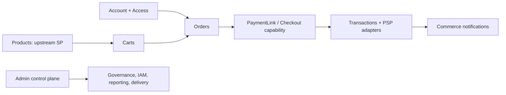

# pol-core Platform Modules

เอกสารนี้สรุป implementation ที่ tracked ปัจจุบันของ `pol-core` หลัง `platform-restructure-v1`. ส่วนที่เป็น target หรือประวัติ migration ระบุแยกจาก as-built และไม่ถือว่าเป็นหลักฐาน production readiness.

## ภาพรวมระบบ

`Api` เป็น modular monolith host เดียวที่ expose `/api/v1`. เส้นทางธุรกิจปัจจุบันมี canonical Order flow และยังเก็บ Cart compatibility route ไว้ตาม inventory:

Products ไม่เก็บ catalogue ในฐานข้อมูล. `POST /api/v1/orders` ใช้ `CreateOrderCommand` และ trusted pricing; `POST /api/v1/orders/from-cart` เป็น legacy compatibility route ที่ตรวจ Cart และ source อีกครั้ง. Payment amount มาจาก trusted Order snapshot; provider call เกิดหลัง Transaction ถูก persist.

## Module inventory

| Module | ขอบเขต current | Source anchors |
|---|---|---|
| `Accounts` | business identity ของ Employee, Agent, System, login linkage และ registration case | `src/Domain/Modules/Accounts.Domain/`, `src/Application/Modules/Accounts.Application/` |
| `Access` | MerchantAccess, PlatformAccess, roles/branches/method grants และ DataScope | `src/Domain/Modules/Access.Domain/`, `src/Infrastructure/Modules/Access.Infrastructure/` |
| `Admins` | workforce admin account, OIDC BFF session, tier และ admin operations | `src/Domain/Modules/Admins.Domain/`, `src/Api/Api/Admins/` |
| `Iam` | permission/group/role catalog กลางและ API client catalog | `src/Domain/Modules/Iam.Domain/`, `src/Application/Modules/Iam.Application/` |
| `Merchants` | merchant, branch, sale, originator, merchant-user, provisioning และ vault seam | `src/Domain/Modules/Merchants.Domain/`, `src/Application/Modules/Merchants.Application/` |
| `Products` | live insurance-document search/lookup และ trusted source pricing adapter | `src/Application/Modules/Products.Application/`, `src/Infrastructure/Modules/Products.Infrastructure/` |
| `Carts` | open cart, server-resolved lines และ optimistic concurrency | `src/Domain/Modules/Carts.Domain/` |
| `Orders` | canonical draft/issue, owner binding, trusted snapshot, lifecycle, summary read และ payment-link orchestration | `src/Domain/Modules/Orders.Domain/`, `src/Application/Modules/Orders.Application/` |
| `Checkouts` | keyed PaymentLink, replay protection, anonymous capability และ confirm/status command | `src/Domain/Modules/Checkouts.Domain/`, `src/Application/Modules/Checkouts.Application/` |
| `Payments` | provider selection, redirect/webhook compatibility, Transaction reducer และ provider evidence | `src/Domain/Modules/Payments.Domain/`, `src/Application/Modules/Payments.Application/` |
| `Notifications` | outbox-to-inbox materialization, template/recipient snapshots, email/SMS/business webhook delivery | `src/Domain/Modules/Notifications.Domain/`, `src/Infrastructure/Persistence/Persistence.MerchantRuntime/Notifications/` |
| `Governance` | maker-checker, append-only audit chain และ governance outbox | `src/Domain/Modules/Governance.Domain/`, `src/Api/Api/Governance/` |
| `Reporting` | admin dashboard/operations projection และ exports จาก owner data | `src/Application/Modules/Reporting.Application/`, `src/Api/Api/Reporting/` |
| `Migration` | readiness/readiness report, deterministic mapping, writer lease และ recovery tooling | `src/Application/Modules/Migration.Application/` |
| `Platform` | checkout transaction service, transaction repository และ platform-level transaction ports | `src/Application/Modules/Platform.Application/` |

`Access`/`Accounts`/`Checkouts`/`Migration`/`Platform` เป็น current modules แม้บางตัวไม่มี project ครบทั้งสาม layer. ไม่มี current `Producer`, `Tenant` หรือ separate `MasterData` module.

## Identity และ authorization

Business authorization ใช้ `Account` + `Access` เป็น canonical model:

| Account type | บทบาท | Scope ที่ใช้ |
|---|---|---|
| `Employee` | platform workforce; อาจมี `PlatformAccess` และ platform/shared roles | Platform |
| `Agent` | ตัวแทนของ Merchant ที่ผูก `SaleId` เดียว | `Self` หรือ scope ที่ policy อนุญาต |
| `System` | client credentials ที่ผูก Merchant และ scope code | Merchant/system scope |

`MerchantAccess.DataScope` มี `Merchant`, `Self`, `Branch`, `AssignedBranches`; `AccessEvaluator` ตรวจ account active, merchant context, owner Sale/Branch, role/permission และ authorization version. `E/A/S` ที่ใช้ใน canonical identity path หมายถึง Employee/Agent/System; legacy `Admin`/`MerchantUser` sessions ยังเป็น console authentication adapters และไม่ใช่ business account replacement.

## Commerce contracts

### Products และ Carts

`GET /api/v1/products` เรียก `ISpDocumentGateway` ด้วย `SaleCode` และ branch config ที่ server bind. Cart add ทำ live lookup, ใช้ `TotalPremium` เป็น price และเก็บ typed metadata. `Cart` อยู่ `shop.Carts`/`shop.CartItems`; `Cart.Version` ป้องกัน write race.

### Orders

`POST /api/v1/orders` รับ `CreateOrderRequest` ที่ระบุ business type, currency, item references, client snapshot และ optional `issueNow`. Client ไม่ได้กำหนดราคา, total หรือ owner ของ Agent. Handler resolve owner, ตรวจ Account authorization snapshot และเรียก `IOrderSourcePolicy`/`ITrustedOrderPricingSource` ก่อนสร้าง aggregate.

`issueNow=false` สร้าง `Draft` โดยไม่มี PaymentLink. ค่า default `true` freeze เป็น `Open` และสร้าง PaymentLink แรกใน transaction เดียว. PATCH/issue/rotate/revoke มี `If-Match`, idempotency และ authorization lease ตาม operation. `/orders/from-cart` ยังคงเป็น route แยกเพื่อ compatibility และไม่ใช่ canonical create contract.

### Payments และ Transactions

`Payments.Domain.Transaction` เป็น aggregate ที่เก็บ amount/currency, method, provider/account, environment, credential/config version, request/provider references และ safe order snapshot. สถานะคือ `Created`, `PendingConfirmation`, `Succeeded`, `Failed`, `Cancelled`, `Expired`.

`TransactionEvent` เป็น append-only provider evidence ที่เก็บ source/reference/status/safe details/timestamps; ไม่เก็บ raw payload หรือ secret. Transaction ถูก persist ก่อนเรียก PSP และ provider create call มี short claim lease กันสอง tab สร้าง charge ซ้ำ. `Order.SuccessfulTransactionId` เป็น canonical successful pointer; `Order.PaymentStatus` แยกจาก legacy `Order.Status` สำหรับ flow ใหม่.

### Notifications

Commerce outbox ส่ง `NotificationEvent` ไป `NotificationInboxMessage`; materializer dedupe ด้วย `SourceEventId` แล้วสร้าง `Notification`, `Delivery` และ immutable template/recipient/endpoint snapshots ใน transaction เดียว. Delivery dispatcher claim ด้วย `LeaseOwner`/`LeaseExpiresAt`; worker ที่ lease หมดอายุ reclaim ได้ตาม owner/attempt predicate เดียว และ owner เก่าหลัง re-lease เขียนผลไม่ได้. Attempt history append-only.

Email ใช้ sender port; SMS ไม่มี provider จริงใน environment นี้จึงคืน `BLOCKED_NOT_CONFIGURED`. Business webhook ใช้ HTTPS/443, SSRF-safe DNS resolution, resolved-IP pinning, HMAC และไม่ตาม redirect. Retry/manual queue และ review note ไม่เปลี่ยน `Order.PaymentStatus`.

## HTTP route map

| Area | Current routes |
|---|---|
| Products | `/api/v1/products`, admin document projection `/api/v1/products/documents` |
| Carts | `/api/v1/carts`, `/api/v1/carts/{cartId}/items...` |
| Canonical Orders | `POST /api/v1/orders`, `PATCH /api/v1/orders/{orderId}`, `POST /api/v1/orders/{orderId}/issue`, `/rotate`, `/revoke` |
| Legacy Orders | `POST /api/v1/orders/from-cart` |
| Orders reads | `/api/v1/orders`, `/api/v1/orders/{orderId}`, `/api/v1/orders/{orderId}/items`, `/history`, `/cancel`, `/summary/resend` |
| Customer capability | `/api/v1/checkout/access`, `/api/v1/checkout/summary`, `/api/v1/checkout/confirm`, `/api/v1/checkout/status` |
| Payment compatibility | `/api/v1/payments/sessions...`, `/api/v1/orders/{token}/pay`, `/api/v1/orders/{token}/payment-status` |
| Transactions | `/api/v1/transactions`, `/api/v1/transactions/{transactionId}`, `/events`, `/verify`, `/review-notes` |
| PSP webhook | `POST /api/v1/webhooks/{pspConnectionId:guid}` |
| Identity/access | `/api/v1/accounts...`, `/api/v1/agent-registration...`, `/api/v1/agent-registrations...` |
| Admin/control | `/api/v1/admins...`, `/api/v1/merchants...`, `/originators...`, `/approvals...`, `/audits...`, `/api-clients...`, `/reports...`, delivery routes |

Audience policy, CSRF, `If-Match` และ `Idempotency-Key` เป็น endpoint metadata; route path ไม่ใช้ legacy audience-first `/api/admin/v1` หรือ `/api/producer/v1`.

## Persistence topology

| Schema | Current tables by owner |
|---|---|
| `acct` | Accounts, LoginAccounts, Employees, Agents, SystemClients, keys, BFF/registration sessions และ registration cases |
| `access` | MerchantAccess, AccessRoles, BranchAccess, PlatformAccess, PlatformAccessRoles, SystemClientScopes, MerchantAccessMethods |
| `admin` | admin identity/session, governance/audit, provisioning, control webhook/notification delivery และ API operation records |
| `iam` | permission catalog, roles, grants, API clients และ one-time secret tickets |
| `merch` | merchant/branch/sale/originator, merchant-user identity/session, vault และ user outbox |
| `shop` | carts, cart items, orders, order items, reveal audits |
| `checkout` | PaymentLinks และ PaymentLinkReplays |
| `txn` | payment sessions, provider/routing, transactions/events, notification runtime, inbound webhooks, idempotency และ outbox |
| `cfg` | payment capability catalog and migration conflicts |
| `oauth` | OpenIddict applications, authorizations, scopes, tokens และ assertion replay |
| `dbo` | Data Protection keys และ EF history |

`txn` เป็น schema ร่วม ไม่ใช่ context เดียว: PSP connections/routing/payment capability/approval configuration อยู่ `ControlPlaneDbContext`; payment attempts, Transactions/events, inbound webhooks, idempotency, outbox และ notification runtime อยู่ `CommerceDbContext`. `PolDbContextModelSnapshot.cs` เป็น physical mapping source. Field-level tablesอยู่ใน [`entity-fields.md`](entity-fields.md).

## Migration และ readiness

Migration chain ปัจจุบันมี 47 migrations และจบที่ `20260911163519_ReviewFixPaymentLinkNotificationIntent`. `20260910021908_Task2IdentityAccess` ถึง `20260910140000_Task9MigrationReadiness` เพิ่ม Account/Access, owner registration, Transactions, Notifications, API operations และ migration rehearsal; review-fix migrations เพิ่ม versioned metadata และ notification intent.

Local build/test, pending-model, schema drift, migration parity และ route comparator ผ่านตาม handoff. ยังขาด sanitized backup, master identity mapping, live Entra/PSP/Email/SMS evidence และ production authorization; จึงเป็น local implementation/cutover machinery เท่านั้น ไม่ใช่ production-ready.

## Retired หรือ historical surfaces

ไม่มี current production implementation สำหรับ SQL RLS/security policy, bypass principal, local product catalogue, policy issuance, `Producer`/`Tenant` module หรือ standalone Worker runtime. `PaymentSessions` และ `/orders/from-cart` ยังคงเป็น compatibility/payment adapter surfaces ตาม inventory; canonical transaction path อยู่ `Transaction`/`TransactionEvent`.

## Source of truth

- `src/Api/Api/Program.cs`
- `src/Api/Api/ControlPlane/CanonicalCommerceEndpoints.cs`
- `src/Api/Api/IdentityAccess/CanonicalAccessEndpoints.cs`
- `src/Application/Modules/Orders.Application/OrderWorkflow.cs`
- `src/Application/Modules/Platform.Application/Transactions/`
- `src/Domain/Modules/Payments.Domain/Transaction.cs`
- `src/Domain/Modules/Payments.Domain/TransactionEvent.cs`
- `src/Infrastructure/Persistence/Persistence.ControlPlane/`
- `src/Infrastructure/Persistence/Persistence.MerchantRuntime/`
- `src/Infrastructure/BuildingBlocks.Infrastructure/Persistence/Migrations/PolDbContextModelSnapshot.cs`
