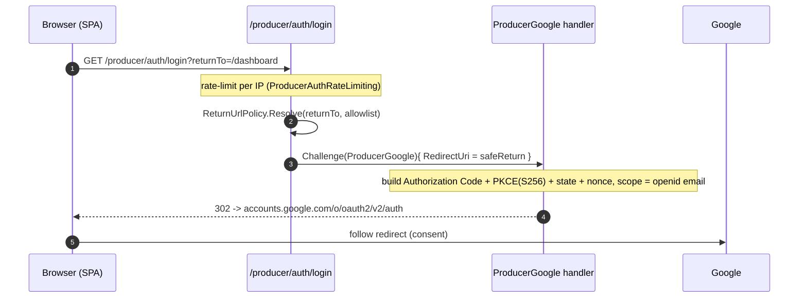
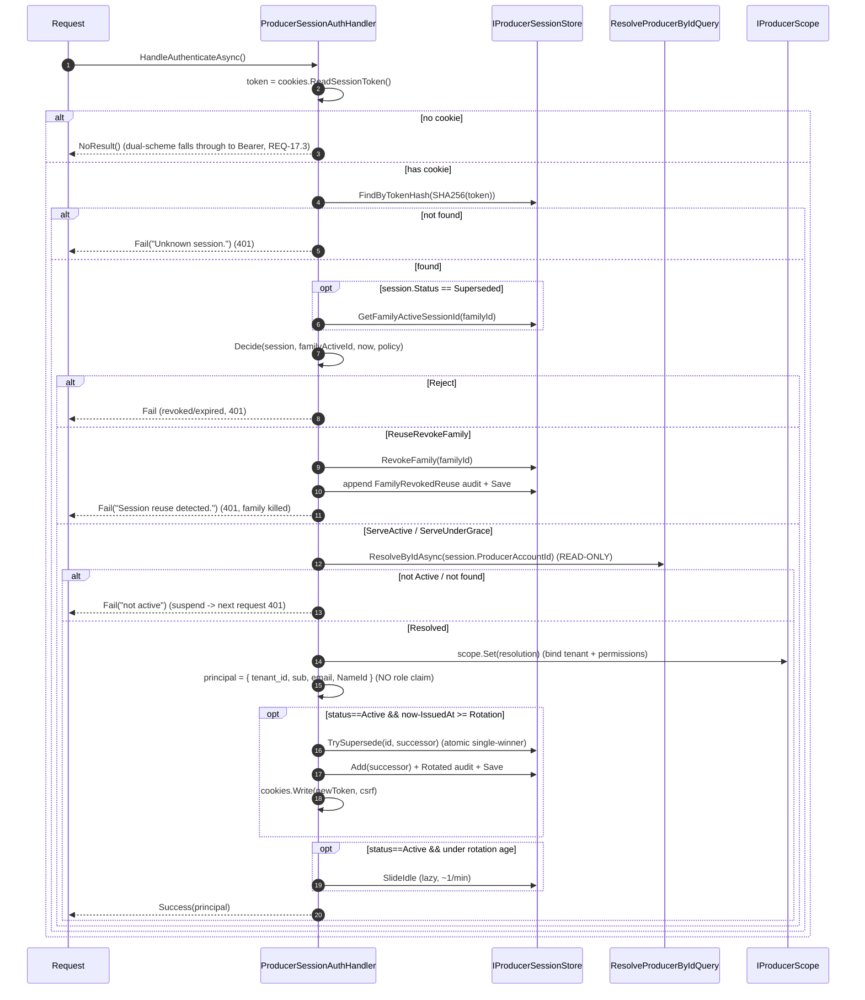
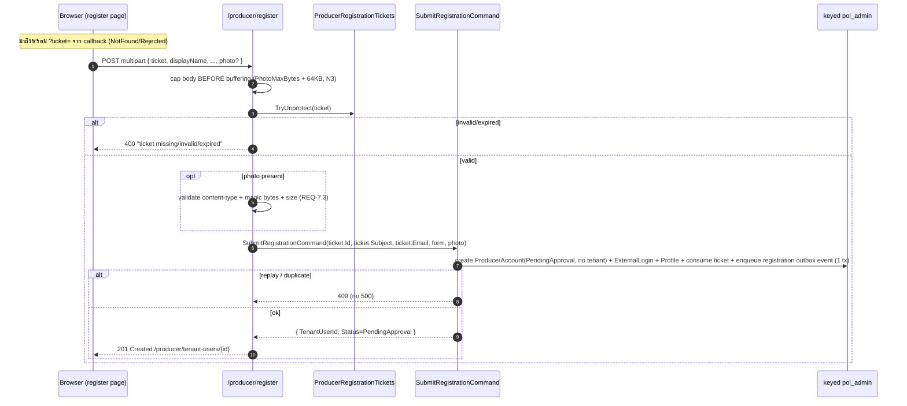
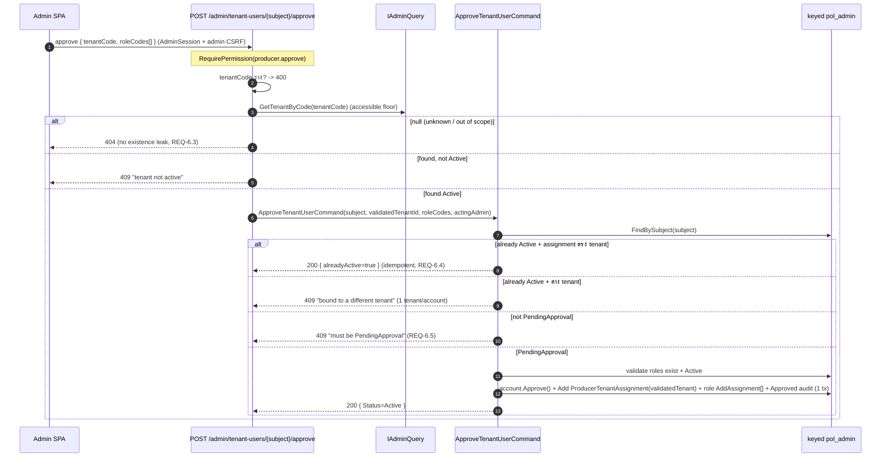
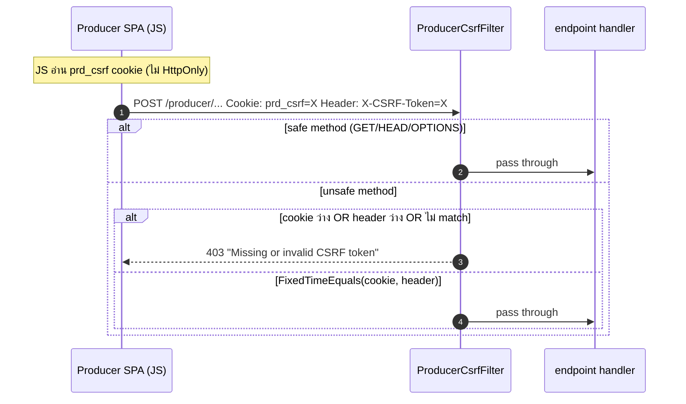
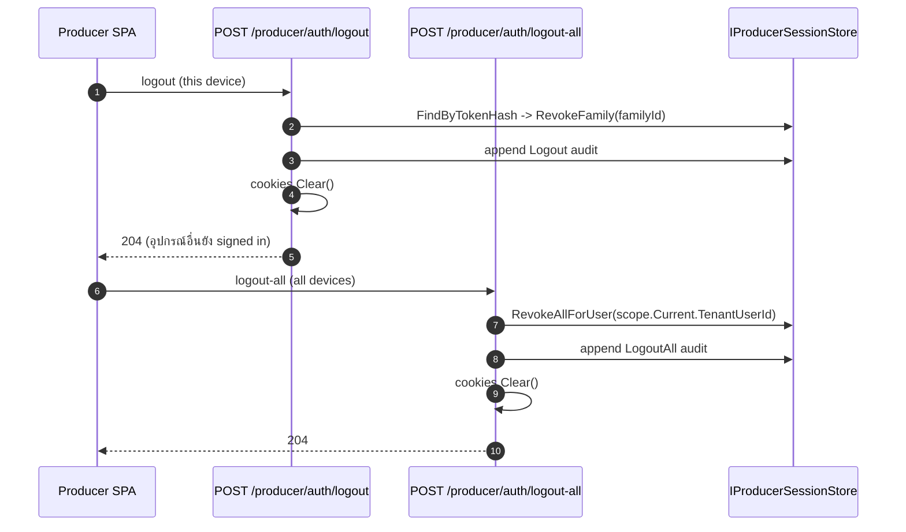

# Producer Google SSO (BFF) — คู่มือโมดูล + Sequence Diagrams

คู่มือฉบับสมบูรณ์ของโมดูล `producer-google-sso` (rebuild ของ Identity module เดิม). โมดูลนี้ให้
ผู้ขาย (producer / `ProducerAccount`) ล็อกอินด้วย Google ผ่าน server-side BFF session แล้วทำงานบน tenant
context เดิมร่วมกับ tenant-Bearer API พร้อม role -> permission RBAC.

โครงทั้งหมดเป็น DUPLICATE ของ Admin OIDC/RBAC stack ที่ ship แล้ว (PR #19/#23) โดยตั้งใจ — ทุกไฟล์มี
`// ponytail: DUPLICATE of Api.Admin...`. คู่มือนี้บอก "ทำงานยังไง" + "ต่างจาก Admin ตรงไหน".

> อัพเดท 2026-06-29 (account → Admin parity): producer actor คือ `ProducerAccount` (เดิม `TenantUser`)
> เก็บแบบ **control-plane** เหมือน `AdminAccount` — ตาราง `producer.ProducerAccounts` ไม่มี RLS predicate,
> `pol_app` ไม่มี grant, `pol_admin` only. tenant ที่ producer สังกัดเป็น edge แยก
> `producer.ProducerTenantAssignment` (UNIQUE บน `ProducerAccountId` = 1 tenant/account) — ไม่ใช่ column บน
> account อีกต่อไป. FK column `TenantUserId` → `ProducerAccountId` ทุกตารางลูก. (Contracts event +
> response DTO ยังคง field `TenantUserId` ไว้โดยตั้งใจ — เป็น id ของ account.)

- Feature spec: `.ai/specs/producer-google-sso/{requirements,design,tasks}.md`
- เทียบ Admin: `docs/reference/admin-google-sso.md`
- ตาราง DB: `docs/reference/entity-fields.md` (section "Producer module")

---

## สารบัญ

1. [ภาพรวมสถาปัตยกรรม](#1-ภาพรวมสถาปัตยกรรม)
2. [แผนที่ component](#2-แผนที่-component)
3. [Config](#3-config)
4. [Sequence: login redirect (challenge)](#4-sequence-login-redirect-challenge)
5. [Sequence: callback 4-way state machine](#5-sequence-callback-4-way-state-machine)
6. [Sequence: per-request session auth (decision table + rotation + reuse)](#6-sequence-per-request-session-auth)
7. [Sequence: registration (ticket -> submit)](#7-sequence-registration-ticket---submit)
8. [Sequence: admin approve / reject (cross-plane)](#8-sequence-admin-approve--reject-cross-plane)
9. [Sequence: CSRF double-submit](#9-sequence-csrf-double-submit)
10. [Sequence: logout / logout-all](#10-sequence-logout--logout-all)
11. [Endpoints](#11-endpoints)
12. [Cookies + CSRF](#12-cookies--csrf)
13. [RBAC + permission enforcement](#13-rbac--permission-enforcement)
14. [Dual-scheme policy + fail-closed](#14-dual-scheme-policy--fail-closed)
15. [DI seams + worker safety](#15-di-seams--worker-safety)
16. [ตาราง DB](#16-ตาราง-db)
17. [ความต่างจาก Admin (สรุป)](#17-ความต่างจาก-admin)
18. [Setup / Dev](#18-setup--dev)

---

## 1. ภาพรวมสถาปัตยกรรม

```
                  Browser (Producer SPA)
                         |
        GET /producer/auth/login  (top-level navigation)
                         v
   +----------------------------------------------------+
   |  API host (Hosts/Api)                              |
   |                                                    |
   |  [ProducerGoogle OIDC scheme] --code+PKCE--> Google|
   |        |  OnTicketReceived                         |
   |        v                                           |
   |  ProducerLoginService.HandleCallbackAsync          |
   |        |  ResolveLoginQuery (mediator)             |
   |        v  4-way branch                             |
   |  Active -> ProducerSession + cookies + redirect    |
   |  NotFound/Rejected -> ticket -> redirect /register |
   |  Pending -> 403   Suspended -> error redirect      |
   |                                                    |
   |  [ProducerSession cookie scheme] (every request)   |
   |        re-resolve READ-ONLY -> IProducerScope       |
   |        rotation / reuse / idle-slide               |
   |                                                    |
   |  dual-scheme "producer" policy (Session OR Bearer) |
   |  RequireProducerPermission (fail-closed F10)       |
   +----------------------------------------------------+
                         |
            keyed pol_admin ProducerDbContext (control-plane account/identity)
                         |
                  schema: producer.*
```

หลักการสำคัญ 5 ข้อ:

1. BFF — token ของ Google ไม่เคยถึง browser. browser ถือแค่ opaque session cookie; ฝั่ง server เก็บ
   เฉพาะ SHA-256 hash ของ token.
2. ไม่ self-provision — callback ของ subject ที่ไม่รู้จัก ออกได้แค่ registration ticket ไม่สร้าง
   account/session (REQ-9.6).
3. Producer ผูกกับ `tenant_id` (เข้า `HttpTenantContext` path เดิม) ไม่ใช่ `admin_tier`.
4. อยู่ร่วมกับ tenant-Bearer ผ่าน dual-scheme policy + fail-closed permission gate.
5. Status/role re-resolve ทุก request -> suspend/reject/เปลี่ยน role มีผลภายใน 1 request.

---

## 2. แผนที่ component

| Layer | ไฟล์ | หน้าที่ |
|---|---|---|
| OIDC client | `ProducerOidcAuthentication.cs` | scheme `ProducerGoogle`, framework Auth Code+PKCE, hook 4 events |
| OIDC options | `ProducerOidcOptions.cs` | `Producer:Oidc` + `Producer:Session` binding |
| Callback brancher | `ProducerLoginService.cs` | 4-way state branch, ออก session/ticket/deny |
| Login resolver | `ResolveLogin.cs` (Application) | subject -> lifecycle outcome (keyed pol_admin) |
| Session auth | `ProducerSessionAuthenticationHandler.cs` | per-request decision table + principal + rotation |
| Session resolver | `ResolveProducerById.cs` (Application) | re-resolve READ-ONLY ทุก request |
| Decision policy | `ProducerSessionDecision.cs` (Domain) | pure decision table |
| Session aggregate | `ProducerSession.cs` (Domain) | rotation family, supersede, grace |
| Session store | `ProducerSessionStore.cs` (Infra) | atomic set-based supersede/revoke/slide/prune |
| Cookies | `ProducerSessionCookies.cs` | `__Host-prd_session` / `prd_csrf` read/write/clear |
| CSRF | `ProducerCsrfFilter.cs` | double-submit guard บน unsafe methods |
| Permission gate | `ProducerPermissionAuthorization.cs` | `RequireProducerPermission` + boot parity guard |
| Scope | `ProducerScope.cs` (Application) | per-request `IProducerScope` |
| Prune | `ProducerSessionPruneService.cs` | background sweep ลบ session หมดอายุ |
| Rate limit | `ProducerAuthRateLimiting.cs` | rate-limit login/register per IP |
| Host wiring | `ProducerHostWiring.cs` | bind seams บน keyed pol_admin |
| Approve/Reject | `ApproveRejectTenantUser.cs` (Application) | admin cross-plane commands |
| Roles | `ProducerRoleCommands.cs` / `ProducerRoleQueries.cs` / `SetProducerUserRoles.cs` | role CRUD + assign |

---

## 3. Config

`Producer:Oidc` (`ProducerOidcOptions`):

| key | default | หมายเหตุ |
|---|---|---|
| `Authority` | `https://accounts.google.com` | |
| `ClientId` | `""` | blank = ปิด producer login (ข้าม scheme, REQ-14.2) |
| `ClientSecret` | `""` | secret จริง, inject ผ่าน `Producer__Oidc__ClientSecret` เท่านั้น (ห้าม commit/log) |
| `CallbackPath` | `/producer/auth/callback` | OIDC middleware จัดการเอง (ไม่มี mapped endpoint) |
| `ErrorPath` | `/login-error` | redirect เมื่อ deny/fail พร้อม `?reason=` |
| `HostedDomain` | `""` | guard `hd` claim; blank = บัญชี Google ที่ verified ใดก็ได้ |
| `RegisterUrl` | `http://localhost:5200/register` | redirect ของ applicant พร้อม `?ticket=` |

`Producer:Session` (`ProducerSessionOptions`):

| key | default | |
|---|---|---|
| `IdleMinutes` | 30 | idle window |
| `AbsoluteHours` | 8 | hard cap (rotation ไม่ยืด) |
| `RotationMinutes` | 15 | rotation age |
| `GraceSeconds` | 60 | predecessor grace |
| `SameSite` | `Lax` | `None` สำหรับ cross-site deploy (บังคับ Secure) |
| `DefaultReturnPath` | `/` | |
| `ReturnUrlAllowlist` | `[]` | กัน open-redirect (same-origin path เท่านั้น, REQ-8.3) |

`Producer:EnforcePermissionsOnWrites` — flag เปิด/ปิด gate บน 3 write endpoint. ship `false`
(ยังไม่มี producer FE, ไม่ให้ tenant-Bearer write พัง); code default = `true` เมื่อ key หาย (REQ-17.4).

Boot guard: ถ้า `ClientId` ไม่ blank -> `RequireProducerClientId` + `RequireProducerClientSecret`
บังคับครบคู่ (half-config ไม่ผ่าน boot).

---

## 4. Sequence: login redirect (challenge)

`GET /producer/auth/login?returnTo=...` — anonymous, rate-limited. validate returnTo กับ allowlist แล้ว
challenge scheme `ProducerGoogle`; framework สร้าง redirect ไป Google.



---

## 5. Sequence: callback 4-way state machine

Google เด้งกลับ `/producer/auth/callback`. OIDC middleware verify เอง (code exchange + JWKS sig +
iss/aud/nonce/lifetime). `OnTokenValidated` เช็ค `email_verified` + `hd`. `OnTicketReceived` เรียก
`ProducerLoginService.HandleCallbackAsync` แล้ว `HandleResponse()` short-circuit framework sign-in.

identity (sub/email/hd) มาจาก id_token ที่ verify แล้วเท่านั้น (REQ-9.3) — request override ไม่ได้.

```mermaid
sequenceDiagram
    autonumber
    participant G as Google
    participant OIDC as ProducerGoogle handler
    participant LS as ProducerLoginService
    participant RL as ResolveLoginQuery (mediator)
    participant DB as keyed pol_admin

    G-->>OIDC: 302 callback?code=...&state=...
    OIDC->>G: exchange code -> id_token (PKCE verifier)
    OIDC->>OIDC: validate sig(JWKS)/iss/aud/nonce/exp
    OIDC->>OIDC: OnTokenValidated: email_verified==true? hd==HostedDomain?
    alt fail
        OIDC->>LS: DenyAsync(reason) [OnRemoteFailure / OnAccessDenied]
        LS-->>G: 302 -> ErrorPath?reason=...
    else ok
        OIDC->>LS: OnTicketReceived: HandleCallbackAsync(sub,email,hd,returnTo)
        LS->>RL: ResolveLoginQuery(subject)
        RL->>DB: FindBySubject(subject)  (control-plane account; tenant via assignment if Active)
        RL-->>LS: Outcome { NotFound | Pending | Rejected | Suspended | Active }

        alt Active
            LS->>DB: Add(ProducerSession) + LoginSuccess audit  (1 tx)
            LS->>LS: cookies.Write(session, csrf)
            LS-->>G: 302 -> SafeReturn(returnTo)
        else NotFound
            LS->>DB: Issue Registration ticket (row + wire token)
            LS-->>G: 302 -> RegisterUrl?ticket=...
        else Rejected
            LS->>DB: Issue Correction ticket
            LS-->>G: 302 -> RegisterUrl?ticket=...
        else PendingApproval
            LS-->>G: 403 "awaiting approval" (no session)
        else Suspended
            LS->>DB: AuthDenied audit (fresh scope)
            LS-->>G: 302 -> ErrorPath?reason=suspended
        end
    end
    Note over OIDC: context.HandleResponse() — framework sign-in skipped
```

หลักประกัน atomicity: session row + login-success audit commit ใน **tx เดียว** (keyed pol_admin).
ทุก deny เขียน audit บน **fresh scope** (`IServiceScopeFactory.CreateScope`) -> half-built session บน
request context ไม่ถูก commit (REQ-9.5). ไม่ log secret/token/code/raw session id/ticket (REQ-14.3).

`ResolveLoginHandler` mapping (tenant มาจาก `ProducerTenantAssignment`, ไม่ใช่ column บน account):

| ProducerAccount.Status | Outcome | ผล |
|---|---|---|
| (subject ไม่พบ) | `NotFound` | registration ticket |
| `PendingApproval` | `PendingApproval` | 403 awaiting approval |
| `Rejected` | `Rejected` | correction ticket |
| `Active` + มี assignment | `Active` | เปิด session + resolve effective permissions (scoped to assignment.TenantId) |
| `Active` + ไม่มี assignment | `Suspended` | deny (invariant violation) |
| `Suspended` / อื่น | `Suspended` | deny |

---

## 6. Sequence: per-request session auth

ทุก request ที่ใช้ `producer` policy เข้า `ProducerSessionAuthenticationHandler` ตอน authentication.
อ่าน cookie -> หา session ด้วย hash -> decision table -> re-resolve READ-ONLY -> สร้าง principal +
bind scope -> rotation/idle-slide.



Decision table (`ProducerSessionDecisionPolicy.Decide`):

| Status | เงื่อนไข | Decision |
|---|---|---|
| `Revoked` | — | `Reject` |
| `Active` | live (idle & absolute ยังไม่หมด) | `ServeActive` |
| `Active` | หมดอายุ | `Reject` |
| `Superseded` | เป็น immediate predecessor + ใน grace | `ServeUnderGrace` |
| `Superseded` | ไม่ใช่ predecessor หรือเลย grace | `ReuseRevokeFamily` |

Rotation family (`ProducerSession`): `Start` เปิด family ใหม่ (FamilyId ใหม่); `Rotate` ออก successor ใน
family เดิม + mark predecessor `Superseded` + link `SupersededBySessionId`. successor inherit absolute
expiry เดิม (rotation ไม่ยืด hard cap). reuse ของ token ที่ถูก supersede แล้วเลย grace = สัญญาณ theft
-> revoke ทั้ง family.

---

## 7. Sequence: registration (ticket -> submit)

`POST /producer/register` — anonymous, ticket-gated, rate-limited, multipart. signed ticket คือ
capability barrier (ไม่มี session CSRF บน pre-session route, REQ-13.4). identity มาจาก ticket ไม่ใช่
form (REQ-4.2).



ticket เป็น single-use: row `producer.RegistrationTickets` คือ replay authority; wire token signed ด้วย
DataProtection (purpose แยกจาก admin). TTL ของ wire token = TTL ของ row (`Producer:Registration:TicketTtlMinutes`).

---

## 8. Sequence: admin approve / reject (cross-plane)

Admin (ไม่ใช่ producer) อนุมัติ/ปฏิเสธ. Admin permission (`producer.approve`/`producer.reject`) +
accessible-tenant floor (`IAdminQuery`) ตรวจที่ **host** ก่อน dispatch (critique B3) — command ที่ส่งเข้า
Producer module รับ tenant id ที่ validate แล้ว ไม่มี Admin import.



Reject (`POST /admin/tenant-users/{subject}/reject`, `producer.reject`): set `Rejected` +
`RevokeAllForUserAsync` (kill live sessions, REQ-12.3) + audit ใน tx เดียว. non-Pending -> 409;
unknown -> 404.

---

## 9. Sequence: CSRF double-submit

`ProducerCsrfFilter` ผูกครั้งเดียวกับ group `/producer` (`AddEndpointFilter<ProducerCsrfFilter>`). unsafe
method (POST/PUT/PATCH/DELETE) ต้องมี header `X-CSRF-Token` = cookie `prd_csrf`. compare แบบ constant-time.
safe method (GET/HEAD/OPTIONS/TRACE) ยกเว้น. pre-session route (login/callback/register) อยู่นอก group.



defense-in-depth: session cookie เป็น `SameSite=Lax` อยู่แล้ว — CSRF filter เป็นชั้นเสริม (REQ-13.3).

---

## 10. Sequence: logout / logout-all



`logout` revoke เฉพาะ family ของ cookie ปัจจุบัน (device นี้); `logout-all` revoke ทุก session ของ user.

---

## 11. Endpoints

| Method | Path | Auth | Permission | หมายเหตุ |
|---|---|---|---|---|
| GET | `/producer/auth/login` | anonymous | — | rate-limited; validate returnTo |
| GET | `/producer/auth/callback` | (OIDC middleware) | — | ไม่มี mapped endpoint; 4-way branch |
| POST | `/producer/register` | anonymous + ticket | — | multipart; rate-limited; 201/400/409/413/429 |
| POST | `/producer/auth/logout` | producer | — | revoke family (device นี้) |
| POST | `/producer/auth/logout-all` | producer | — | revoke ทุก session |
| GET | `/producer/me` | producer | — | identity + roles + permissions (not bound -> 403) |
| GET | `/producer/permissions` | producer | — | permission/group catalog |
| GET | `/producer/roles` | producer | — | list roles |
| GET | `/producer/roles/{code}` | producer | — | read role (unknown -> 404) |
| POST | `/producer/roles` | producer | `producer.roles.manage` | dup code -> 409 |
| PUT | `/producer/roles/{code}` | producer | `producer.roles.manage` | code immutable; deactivate tenant_owner -> 409 |
| DELETE | `/producer/roles/{code}` | producer | `producer.roles.manage` | tenant_owner/bound users -> 409 |
| PUT | `/producer/tenant-users/{id}/roles` | producer | `producer.user.roles` | set roles ใน tenant ตัวเอง; ออก tenant -> 404 |
| POST | `/admin/tenant-users/{subject}/approve` | admin | `producer.approve` | cross-plane; idempotent |
| POST | `/admin/tenant-users/{subject}/reject` | admin | `producer.reject` | revoke sessions |

Write endpoints (gated หลัง `Producer:EnforcePermissionsOnWrites`):

| Method | Path | Permission (เมื่อ ON) |
|---|---|---|
| POST | create product | `product.create` |
| POST | create payment session | `payment.create` |
| POST | payment redirect (claim+charge) | `payment.redirect` |

ON -> `producer` policy + `RequireProducerPermission` (tenant-Bearer ผ่าน auth แต่ไม่ bind scope -> 403).
OFF -> tenant-Bearer behavior เดิม (transitional จนกว่า producer FE พร้อม).

---

## 12. Cookies + CSRF

| cookie | flags | บทบาท |
|---|---|---|
| `__Host-prd_session` (https) / `prd_session` (dev-http) | HttpOnly, Secure, Path=/, SameSite, IsEssential | opaque session token (server เก็บแค่ hash) |
| `prd_csrf` | **NOT** HttpOnly, Secure, Path=/, SameSite | CSRF double-submit (JS อ่านได้) |

- https -> prefix `__Host-` (บังคับ Secure + Path=/ + ไม่มี Domain)
- dev-http (Development + plain http, localhost) -> drop Secure + drop prefix (`prd_session`) เพราะ
  `__Host-` ต้อง Secure ที่ browser reject บน http
- นอก Development -> ไม่เคย drop Secure แม้ http
- `SameSite=None` downgrade เป็น `Lax` บน dev-http (None ต้อง Secure)

`ProducerTokens`: `NewOpaqueToken()` -> random >= 43 chars; `Hash()` -> SHA-256 32 bytes (ค่าที่เก็บ DB).
(ชื่อ class เดิม `ProducerSessionTokens` ย่อเป็น `ProducerTokens` เพราะชน CI secret-scan heuristic 20-char.)

---

## 13. RBAC + permission enforcement

permission axis orthogonal กับ tier (ไม่มี super-bypass). catalog เก็บใน `producer.AdminPermissions` +
`producer.AdminRolePermissions`, seed ผ่าน migration แบบ idempotent.

```
RequireProducerPermission(key):
   scope = IProducerScope (bound โดย session handler)
   allow  iff  scope.IsBound && scope.Current.Permissions.Contains(key)
   else   -> 403
```

permission keys ที่ใช้ในโค้ด (`ProducerPermissions`): `product.create`, `payment.create`,
`payment.redirect`, `producer.roles.manage` (RolesManage), `producer.user.roles` (UserRoles).
ฝั่ง admin catalog เพิ่ม `producer.approve` / `producer.reject`.

Boot parity guard (`ProducerPermissionParity.Assert`): ทุก key ที่ `RequireProducerPermission` อ้าง ต้องมี
ใน `ProducerPermissions.AllKeys` (code-canonical ที่ migration seed DB จากมัน) — ไม่ตรง -> throw ตอน
startup (fail-closed). เรียกก่อน `app.Run()` หลัง map endpoint ครบ.

effective permissions resolve ใหม่ทุก request (`ResolveProducerByIdQuery`) -> เปลี่ยน role ใน DB มีผลทันที.

---

## 14. Dual-scheme policy + fail-closed

```
AddPolicy("producer", p => p
    .AddAuthenticationSchemes(ProducerSession, JwtBearer)
    .RequireAuthenticatedUser());   // NO RequireClaim (S3)
```

- รับ EITHER ProducerSession OR tenant Bearer, ขอแค่ authenticated
- ไม่มี `RequireClaim` -> restore gate บน write endpoint ไม่ทำ tenant-Bearer พัง
- tenant-Bearer ผ่าน policy แต่ไม่ผ่าน ProducerSession handler -> ไม่ bind scope ->
  `RequireProducerPermission` 403 (fail-closed F10)
- producer principal **ไม่มี role claim** (S3) จงใจ — กัน tenant-Bearer pipeline เข้าใจผิดว่า producer
  เป็น tenant user
- no-cookie -> `NoResult()` (ไม่ใช่ Fail) เพื่อ fall-through ไป Bearer (REQ-17.3)

principal ที่ออกจาก session handler: `tenant_id` (S4 — `HttpTenantContext` path; มาจาก assignment), `sub`,
`email`, `NameIdentifier` = ProducerAccount id (`ProducerResolution.TenantUserId` — field ยังชื่อเดิม).
ไม่เรียก `ITenantScope.Begin` (double-bind throw).

---

## 15. DI seams + worker safety

ปัญหา: worker reference `Producer.Application` (validate Producer Mediator handlers ทั้งหมดผ่าน
`ValidateOnBuild`) แต่ **ไม่** reference `Admin.Application`. ถ้า Producer handler ใช้ Admin keyed-`"admin"`
UoW -> worker startup พังตอน validate.

แก้: neutral `IProducerUnitOfWork` (implement โดย `ProducerRegistrationUnitOfWork`), ลงทะเบียน 2 ที่:

| host | `IProducerUnitOfWork` -> context |
|---|---|
| API (`ProducerHostWiring.AddProducerIdentity`) | keyed `"admin"` (pol_admin, RLS-bypass) |
| Worker (`ProducerModuleRegistration`) | default context (pol_app) |

seam อื่นบน keyed pol_admin ใน API: `IProducerAccountRepository`, `IProducerTenantAssignmentRepository`,
`IExternalLoginRepository`, `IRegistrationTicketRepository`, `ITenantUserProfileRepository`,
`IRegistrationAuditWriter`, `IProducerOutboxWriter`, `IProducerRoleRepository`, `IProducerSessionStore`,
`IProducerAuthAuditWriter`.

ทำไม pol_admin: ตาราง account/assignment + identity ทั้งหมดเป็น control-plane (ไม่มี RLS predicate,
`pol_app` ไม่มี grant — เหมือน Admin); login lookup + per-request resolve อ่าน account/assignment cross-tenant
ได้ภายใต้ pol_admin เท่านั้น (REQ-19.2); session/auth-audit ก็ control-plane เช่นกัน.

scope: session handler bind concrete `ProducerScope`; endpoint อ่าน `IProducerScope` (scoped instance
เดียวกัน). cookies service เป็น singleton (stateless).

---

## 16. ตาราง DB

schema = `producer` ทั้งหมด. รายละเอียดฟิลด์: `docs/reference/entity-fields.md`.

| ตาราง | plane | หมายเหตุ |
|---|---|---|
| `producer.ProducerAccounts` | control (`[DUP->AdminAccounts]`) | producer account; **ไม่มี RLS, ไม่มี TenantId column** |
| `producer.ProducerTenantAssignments` | control (`[DUP->AdminTenantAssignments]`) | tenant edge; UNIQUE บน `ProducerAccountId` = 1 tenant/account |
| `producer.ExternalLogins` | control | Google subject -> ProducerAccount (FK `ProducerAccountId`) |
| `producer.RegistrationTickets` | control | single-use replay authority |
| `producer.TenantUserProfiles` | control | display name, photo ref (FK `ProducerAccountId`) |
| `producer.RegistrationAudits` | control, append-only | submit/approve/reject trail |
| `producer.ProducerRegistrationNotices` | control (pol_admin + pol_worker) | outbox notice (คง column `TenantUserId` — id จาก event) |
| `producer.ProducerSessions` | control | `[DUP->AdminSession]` rotation family (FK `ProducerAccountId`) |
| `producer.ProducerAuthAudits` | control, append-only | `[DUP->AdminAuthAudit]` login/rotate/reuse/logout (`ProducerAccountId` nullable) |
| Producer RBAC catalog/role tables | control | `[DUP->Admin RBAC]` perms/groups/roles/assignments (`ProducerRoleAssignments.ProducerAccountId`) |

migration chain (idempotent, reproduce จากศูนย์ได้): `InitialProducerSchema` ->
`AddProducerIdentityTables` -> `AddProducerRoleRbacTables` -> `AddProducerSessionTables` ->
`AddProducerOutboxAdminGrant` -> `AddProducerApprovePermissionToAdminCatalog` ->
`AddRegistrationAuditReason` -> `AddProducerAccountAdminParity`. RLS/grant/raw control-plane
table ทั้งหมดอยู่ใน `migrationBuilder.Sql` (ไม่ใช่ EF model). `AddProducerAccountAdminParity` ย้าย
`TenantUsers` (RLS-keyed) → `ProducerAccounts` (control-plane) ด้วย sp_rename in-place (เก็บ data) +
backfill assignment จาก TenantId เดิม + drop RLS predicate; predicate DROP/ADD ใช้ `IF (NOT) EXISTS` guard
(ALTER SECURITY POLICY ไม่ rollback กับ migration tx -> retry/race ต้องเป็น no-op).

---

## 17. ความต่างจาก Admin

| มิติ | Admin | Producer |
|---|---|---|
| account storage | `AdminAccounts` control-plane + `AdminTenantAssignments` (many) | `ProducerAccounts` control-plane + `ProducerTenantAssignments` (UNIQUE = 1 tenant) — **parity ตั้งแต่ 2026-06-29** |
| callback | self-provision (deny-dance bootstrap super คนแรก) | 4-way (Active/NotFound/Rejected/Pending), ไม่ self-provision |
| not-found/rejected | — | mint registration/correction ticket -> /register |
| principal claim | `admin_tier` | `tenant_id` (เข้า HttpTenantContext เดิม) |
| role claim | มี | ไม่มี (S3 — กัน tenant-Bearer สับสน) |
| authz policy | session-only | dual-scheme (Session OR Bearer), no RequireClaim |
| no-cookie | — | `NoResult()` -> fall-through Bearer |
| cookie names | `__Host-adm_session`/`adm_csrf` | `__Host-prd_session`/`prd_csrf` |
| OIDC scheme | `Google` | `ProducerGoogle` (แยก DP correlation/nonce purpose, REQ-14.4) |
| worker DI | keyed `admin` UoW | neutral `IProducerUnitOfWork` (worker ไม่ ref Admin.Application) |
| approve/reject | n/a | cross-plane จาก admin endpoint |

แก่น: กลไก auth/session/RBAC = copy. ต่างเพราะ producer มี lifecycle หลายสถานะ + ผูก tenant + อยู่ร่วม
tenant-Bearer. Admin = ผู้คุมระบบ session ฝ่ายเดียว; Producer = ผู้ขายที่ผ่าน approval + ทำงานบน tenant
context เดิม.

---

## 18. Setup / Dev

1. สร้าง Google OIDC client ตัวที่ 2 (confidential) — redirect URI = `<origin>/producer/auth/callback`.
2. ตั้ง config:
   ```
   Producer__Oidc__ClientId=<producer-client-id>
   Producer__Oidc__ClientSecret=<secret>          # env/secret manager เท่านั้น, ห้าม commit
   Producer__Oidc__RegisterUrl=http://localhost:5200/register
   Producer__Session__ReturnUrlAllowlist__0=/dashboard
   Producer__EnforcePermissionsOnWrites=false      # จน producer FE พร้อม
   ```
   blank `ClientId` = ปิด producer login (API ตัวอื่นยัง up).
3. รัน migration -> เปิด API. login: เปิด `GET /producer/auth/login` ใน browser.
4. dev over http (localhost) -> cookie เป็น `prd_session` (drop Secure/prefix). FE proxy `/producer/*`
   + `UseForwardedHeaders` (เหมือน admin FE :5200).
5. flow ตรวจ: login (subject ใหม่) -> 302 /register?ticket -> POST /producer/register -> Pending ->
   admin approve -> login อีกครั้ง -> session cookie + GET /producer/me คืน roles/permissions.

source of truth: spec `.ai/specs/producer-google-sso/` + โค้ดใน `src/Hosts/Api/Producer*.cs` +
`src/Modules/Producer/`. คู่มือนี้สรุปจากโค้ด ณ branch `feature/producer-google-sso`.
