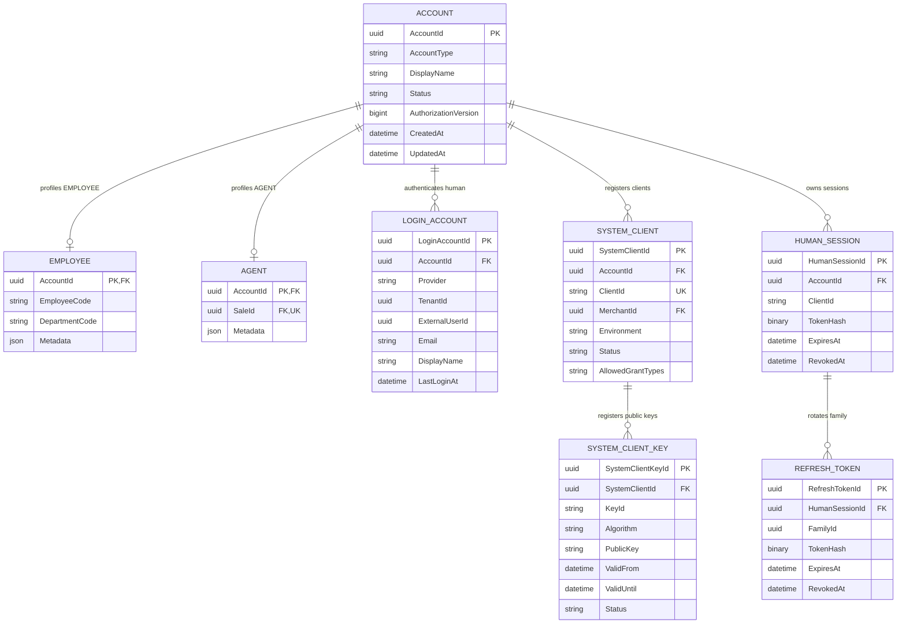
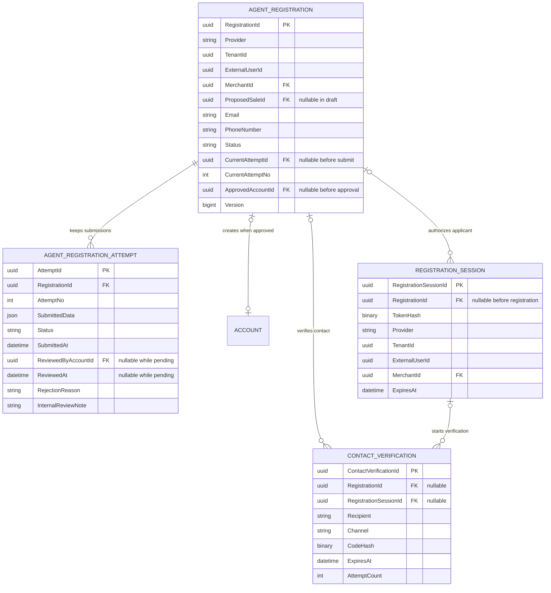
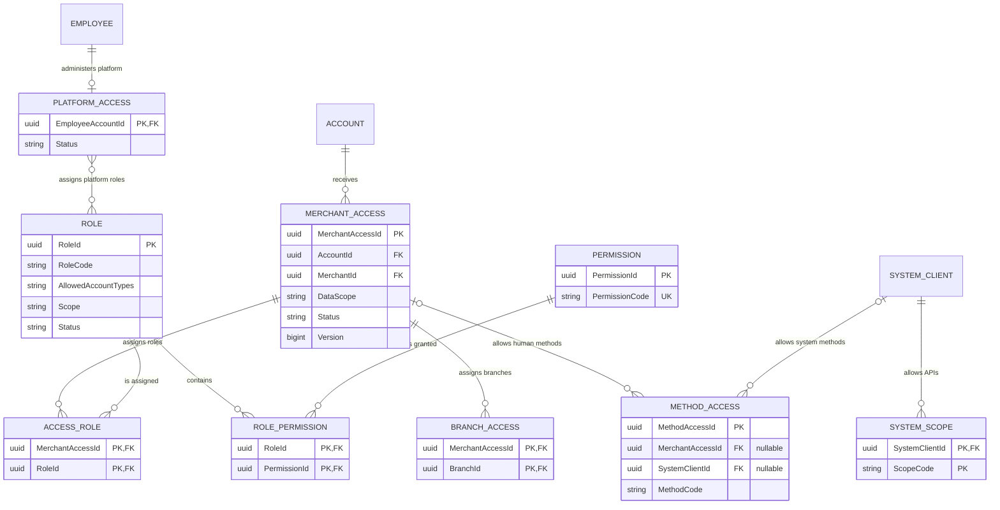
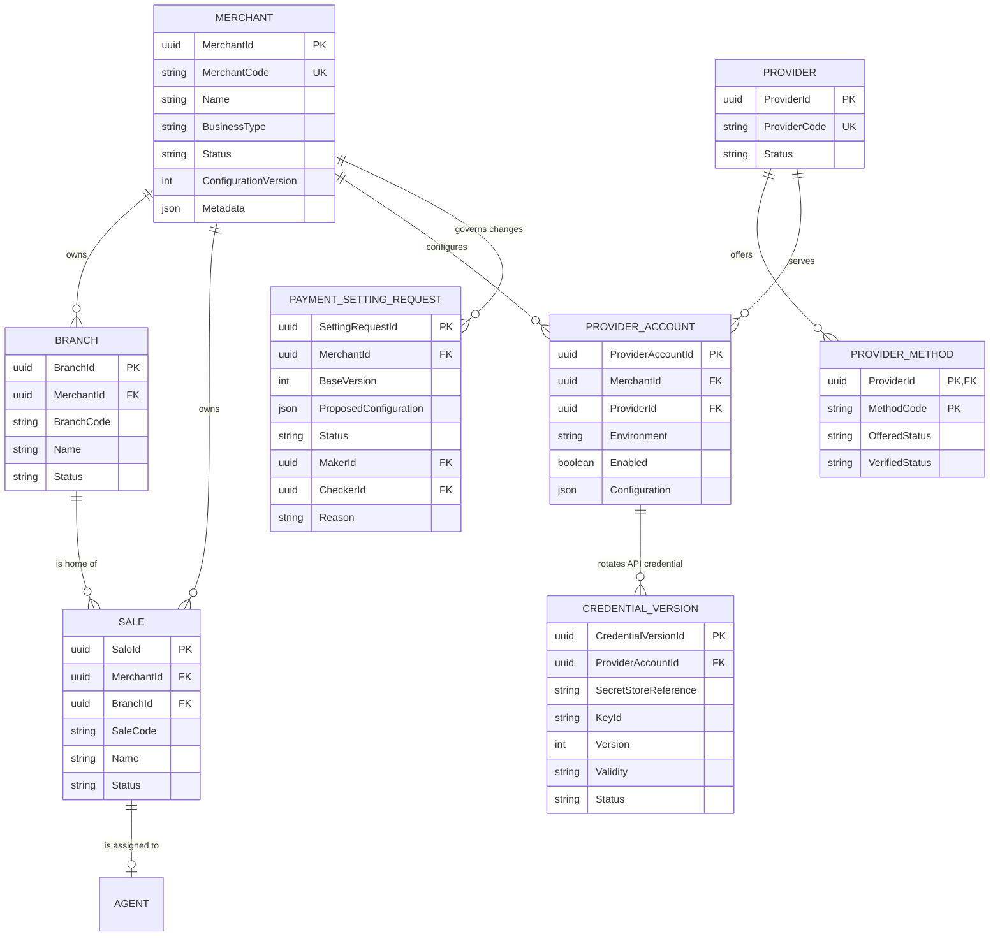
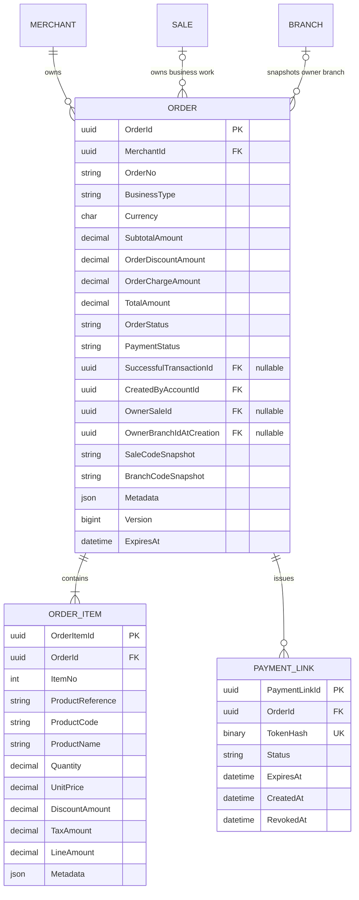
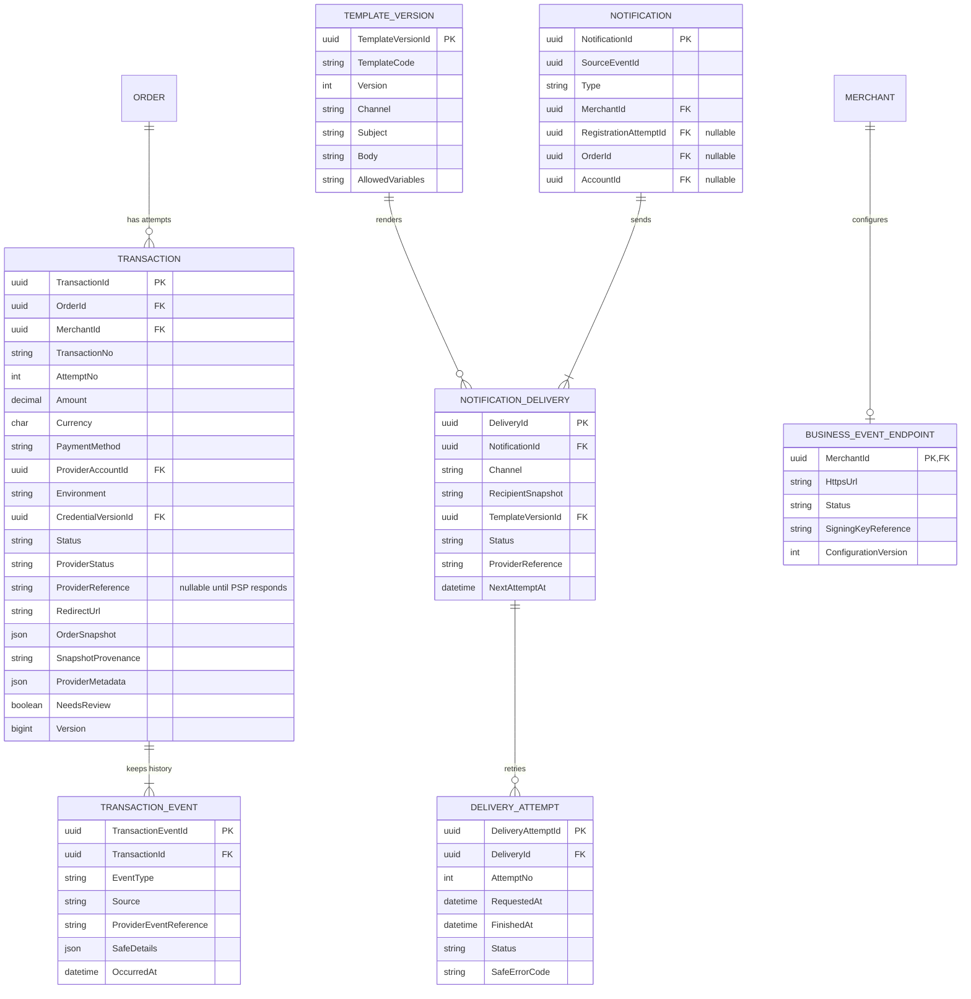

# POL Platform — Latest Blueprint ERD v3

> Source: `pol-platform-latest/01-business-overview.md` และ `04-data-model-and-migration.md`
> Scope: Conceptual Model ของ 7 modules แบ่ง 6 ภาพ ไม่ใช่ Physical DDL
> Generated: 2026-09-09

> ขอบเขตรุ่นแรก: ภาพนี้เป็นแผนที่แนวคิดทั้ง scope ไม่บังคับสร้างทุกตารางหรือฟีเจอร์พร้อมกัน ใช้ [แบบเรียบง่าย §8](../../docs/proposals/payment-platform-redesign-2026-09-08/latest-blueprint.md#8-โครงสร้างที่ทีมเล็กดูแลได้) เลือกส่วนที่ทำจริง และไม่เก็บ state ซ้ำกับ OAuth component ที่เลือก

| § | Diagram | เจ้าของหลัก |
|---|---|---|
| 1 | Account และ Token State | Account |
| 2 | Registration และประวัติ | Account |
| 3 | Access และสิทธิ์ส่วนกลาง | Access |
| 4 | Merchant และ Provider Configuration | Merchant |
| 5 | Order และ Checkout | Order + Checkout |
| 6 | Transaction และ Notification | Transaction + Notification |

---

## 1. Account และ Token State

Account เป็น kill switch กลาง Human ใช้ LoginAccount/Session ส่วน SYSTEM ใช้ Client ที่ปิดแยกได้

| Constraint | กติกา |
|---|---|
| Profile | EMPLOYEE มี Employee และ AGENT มี Agent หนึ่งแถวต่อ Account ส่วน SYSTEM ใช้ Client bindings ตามจำนวนที่เลือกใน spec ไม่สร้าง Human profile |
| Human identity | `(Provider, TenantId, ExternalUserId)` unique Email ไม่ใช่ identity key |
| Display name | Accounts.DisplayName เป็นชื่อใช้งาน LoginAccounts.DisplayName/Email เป็นค่า provider-observed ไม่ใช่ current profile อีกชุด |
| Human token | เก็บ opaque token hash, family, rotation/reuse และ revoke state ไม่เก็บ raw token |
| Kill switch | Account.Status ปิดทั้งบัญชี SystemClient.Status ปิดเฉพาะ Client ทั้งคู่ต้อง active |
| Environment | Dev/UAT/Prod ไม่ใช้ credential หรือ issuer boundary ปะปนโดยไม่ตรวจ |
| SYSTEM key | เมื่อเลือก `private_key_jwt` Platform เก็บ public key เท่านั้น ClientKey จึงยังเป็น optional ก่อนมติใน spec |

---

## 2. Registration และประวัติ

ผู้สมัครและ session ก่อนมี Account แยกจากประวัติการยื่นที่ต้องเก็บไว้

| Constraint | กติกา |
|---|---|
| Registration identity | Unique ต่อ stable identity หรือ identity+Merchant ยังเป็น decision ห้ามล็อก DDL ก่อนสรุป |
| Registration session | ผูก verified identity+Merchant และอ้าง Registration ได้เมื่อมีแล้ว ไม่ใช่ Business Account |
| Contact verification | อ้าง Registration หรือ RegistrationSession อย่างใดอย่างหนึ่งและใช้เฉพาะเมื่อเลือก OTP |
| Attempt | `(RegistrationId, AttemptNo)` unique มี current pending attempt ได้หนึ่งรอบและ decision เติมได้ครั้งเดียว |
| Approval | Account/Login/Agent/MerchantAccess/decision/Outbox commit พร้อมกัน Reject ไม่สร้าง Account |

---

## 3. Access และสิทธิ์ส่วนกลาง

DataScope อยู่ MerchantAccess ส่วน PlatformAccess แยกสำหรับ Employee

| Constraint | กติกา |
|---|---|
| MerchantAccess | DataScope อยู่ที่ entity นี้ จำนวน access context ต่อ Account+Merchant ยังต้องตัดสิน |
| Access children | AccessRoles และ BranchAccess อ้าง MerchantAccess เดียว สาขาต้องอยู่ Merchant เดียวกัน |
| PlatformAccess | ใช้เฉพาะ Employee และอ้าง Role catalog แบบ many-to-many ไม่เก็บ role list ซ้ำเป็น string |
| SYSTEM | SystemScopes/MethodAccess จำกัด Client/Access ไม่ทำให้ SYSTEM เห็นทุกข้อมูลโดยปริยาย |
| MethodAccess | ผูก MerchantAccess หรือ SystemClient อย่างใดอย่างหนึ่ง ไม่ผูกทั้งสองพร้อมกัน |

---

## 4. Merchant และ Provider Configuration

Merchant เป็นเจ้าของ Sale/Branch และค่าที่ Transaction นำไปตรึงเมื่อเริ่มจ่าย

| Constraint | กติกา |
|---|---|
| Master codes | `(MerchantId, BranchCode)` และ `(MerchantId, SaleCode)` unique |
| Agent sale | Agents.SaleId unique Sale มี Home Branch หนึ่งแห่งและอยู่ Merchant เดียวกัน |
| Provider readiness | Offered, adapter Verified และ Merchant Enabled ต้องผ่านครบก่อนแสดงช่องทาง |
| Credential | Secret อยู่ protected store ส่วน configuration เก็บ reference/version เท่านั้น |
| Maker-checker | MakerId ต่าง CheckerId และค่าที่อนุมัติใหม่ไม่เปลี่ยน Transaction เก่า |
| Key lifecycle | API credential กับ Webhook signature key อาจต่างกัน ต้องกำหนดตาม provider contract |

---

## 5. Order และ Checkout

Order เก็บสิ่งที่ขายและสถานะเงิน Checkout เก็บลิงก์และ capability โดยไม่มี Payment/CheckoutSession entity

| Constraint | กติกา |
|---|---|
| Order items | `(OrderId, ItemNo)` unique ทุก item อยู่ currency เดียวกับ Order |
| Amount | `Subtotal = SUM(LineAmount)` และ `Total = Subtotal - OrderDiscount + OrderCharge` |
| Owner | CreatedBy ต้องมีสิทธิ์ OwnerSale/Branch nullable ได้เมื่อ Business Handler อนุญาต ไม่สร้าง Sale ปลอม |
| Immutable issue | OPEN/CANCELLED ไม่แก้ยอด/items BusinessType/ownership ที่ตรึงแล้ว |
| Payment state | OrderStatus แยกจาก PaymentStatus และไม่มี Payment entity |
| PaymentLink | ประวัติหลายลิงก์ได้ หนึ่ง active link เป็นข้อเสนอรุ่นแรก ไม่สร้าง Order/Transaction ตอน reissue |
| Token replay | Raw token อ่านจาก hash ไม่ได้ replay ผลเดิมได้เฉพาะ encrypted idempotent result ที่มี TTL |
| Multiple tabs | Cookie/confirm ผูก OrderId+Version และ recheck revoked/expired link ทุกครั้ง |

---

## 6. Transaction และ Notification

Transaction คือหนึ่งการเริ่มจ่าย Notification ส่งผลโดยไม่เปลี่ยน Order หรือ Registration ย้อนกลับ

| Constraint | กติกา |
|---|---|
| Attempt | `(OrderId, AttemptNo)` unique และ Order มี potentially-chargeable Transaction พร้อมกันไม่เกินหนึ่ง |
| Provider reference | Scope uniqueness ด้วย ProviderAccount+Environment+Reference ตาม contract จริง |
| Result path | Webhook, browser verification และ worker ใช้ verifier เดียว Browser Return ไม่ใช่ผลสำเร็จ |
| Success | Transaction SUCCEEDED, Order PAID, SuccessfulTransactionId และ Outbox commit สอดคล้องกัน |
| Duplicate money | ห้าม unique SUCCEEDED ต่อ Order จนเก็บเงินจริงซ้ำไม่ได้ ให้ NeedsReview และไม่ส่งธุรกิจซ้ำ |
| Snapshot | ไม่มี TransactionItems OrderSnapshot immutable และบอก provenance หากประกอบตอน migration |
| Notification | SourceEventId กันงานซ้ำ Registration decision มี EMAIL+SMS deliveries แยกกัน |
| Delivery | Retry แยก channel/recipient และเก็บ attempt append-only โดยไม่ย้อนผล source |
| Business webhook | หนึ่ง endpoint ต่อ Merchant ยังเป็นข้อเสนอ ต้องตรวจ SSRF และลงลายมือชื่อ |

Platform Core เป็นเจ้าของ Audit, Inbox, Outbox และ IdempotencyRecords เชิงกลไก แต่ไม่เป็นเจ้าของ business state ข้างต้น

**Mapping →** [Latest blueprint](../../docs/proposals/payment-platform-redesign-2026-09-08/latest-blueprint.md)

## Notes

Registration uniqueness, จำนวน MerchantAccess context, `private_key_jwt`, Employee SELF/BRANCH, OTP, active-link cardinality และ business endpoint cardinality ยังต้องตัดสินใน spec

**Render**: GitHub / Obsidian / VS Code Mermaid
