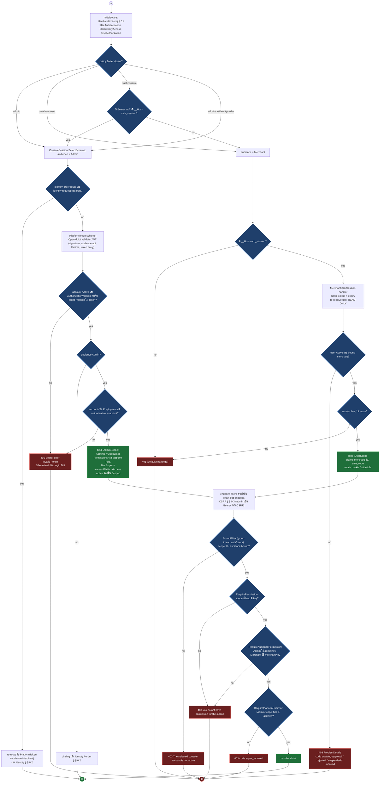
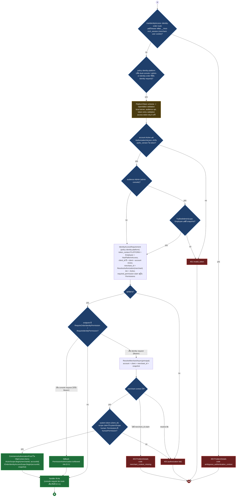
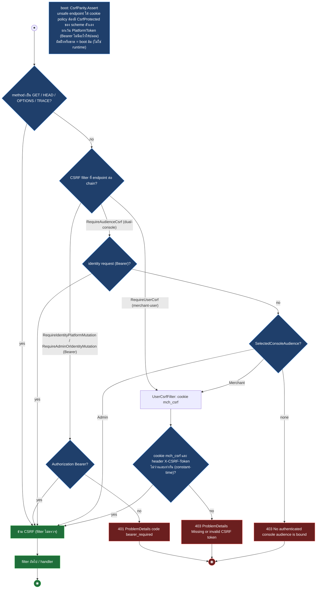
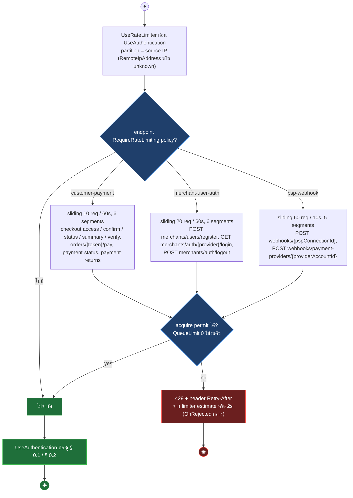
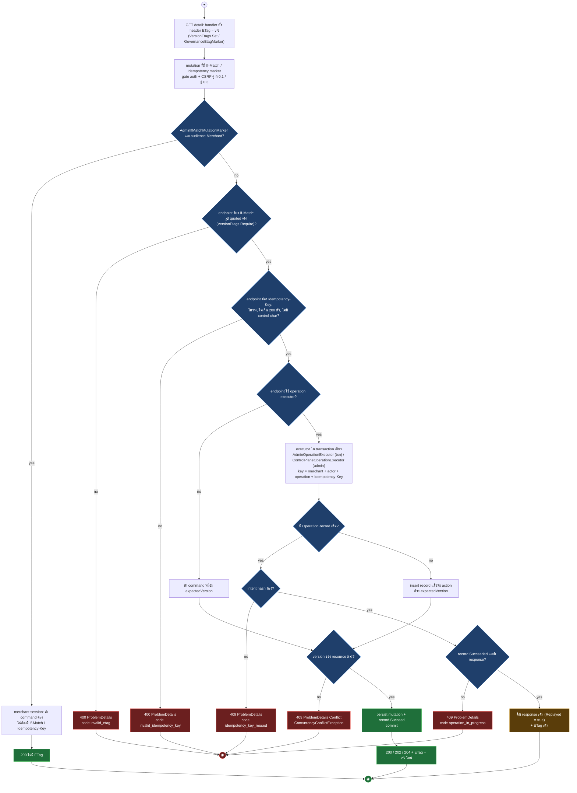
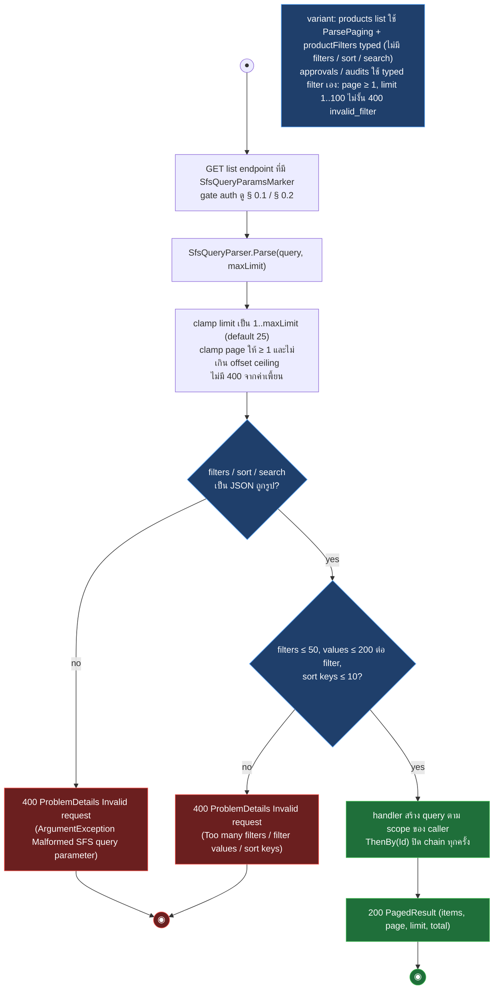
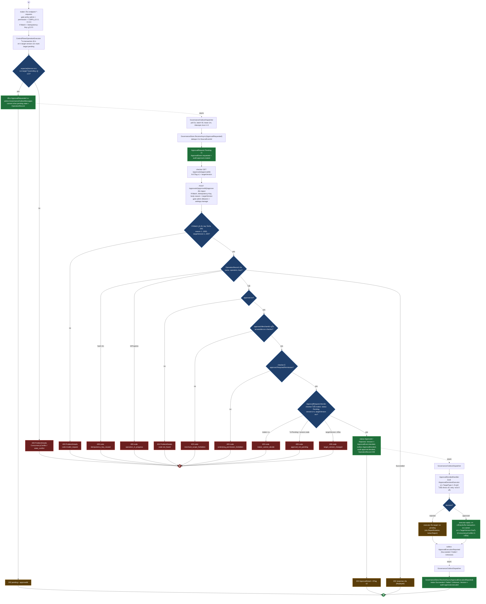
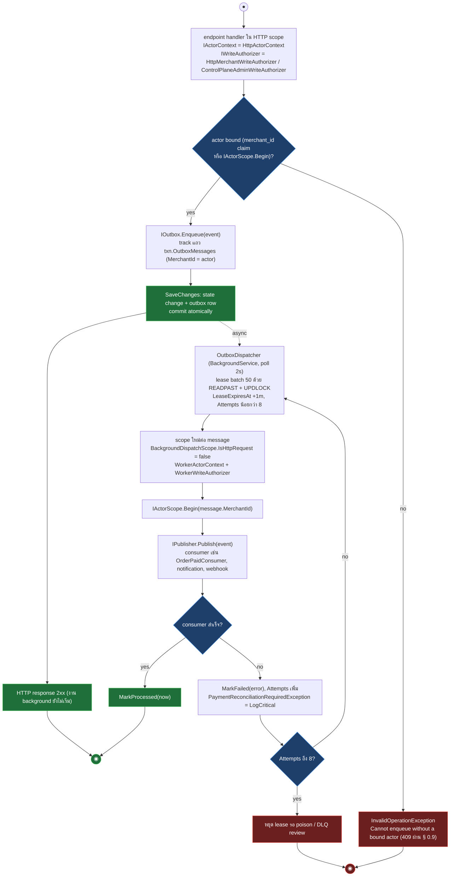
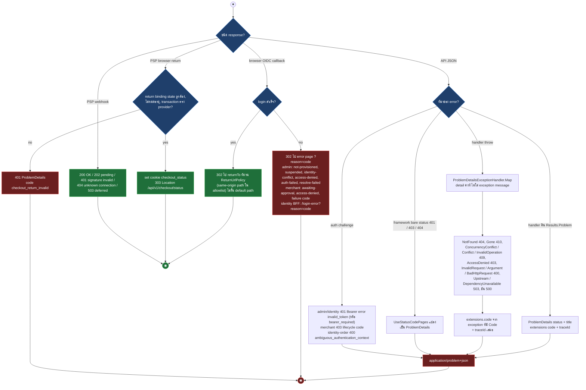

# pol-core API — Cross-cutting behaviour (Activity Diagrams)

> Source: `docs/reference/api-endpoints.md` บรรทัด L24 (policy / permission vocabulary) และ source host ที่อ้างต่อ § (`src/Api/Api/Iam/*`, `IdentityAccess/*`, `Admins/*`, `Merchants/*`, `Webhooks/RateLimiting.cs`, `ConcurrencyEtags.cs`, `SfsQueryParser.cs`, `Governance/GovernanceEndpoints.cs`, `BackgroundDispatch/*`, `BuildingBlocks.Web/ProblemDetailsExceptionHandler.cs`)
> Scope: 9 § พฤติกรรมร่วมที่ทุก theme อ้างแทนการวาดซ้ำ (authn/authz, CSRF, rate limit, ETag/idempotency, SFS, maker-checker, outbox, error contract) ไม่มี endpoint ที่เป็น subject ของไฟล์นี้โดยตรง
> Generated: 2026-09-14

| § | Diagram | Endpoints |
| --- | --- | --- |
| 0.1 | Console session authentication + authorization | ทุก endpoint policy `admin` / `merchant-user` / `dual-console` ที่ต่อ RequirePermission, RequireAudiencePermission, RequirePlatformUserTier, BoundFilter |
| 0.2 | Identity platform (Bearer) authentication + identity-order permission | policy `identity-platform` / `admin-or-identity-order` และแถวที่มี `(identity: order.read / order.write / checkout.write)` |
| 0.3 | CSRF double-submit | merchant-user unsafe method ที่มี CSRF filter (RequireUserCsrf, RequireAudienceCsrf, RequireAdminOrIdentityMutation, RequireIdentityPlatformMutation) — admin เป็น Bearer ไม่มี CSRF |
| 0.4 | Rate limiting | แถวที่ระบุ `rate limit` (policy customer-payment, merchant-user-auth, psp-webhook) — admin-auth ถูก retire พร้อม route /admins/auth/** |
| 0.5 | ETag / If-Match / Idempotency-Key | mutation ที่มี IfMatchMutationMarker, AdminIfMatchMutationMarker, IdempotencyMutationMarker, GovernanceDecisionMarker และ GET detail ที่คืน ETag |
| 0.6 | SFS query parsing | GET list ที่อ่าน page / limit / filters / sort / search ผ่าน SfsQueryParser |
| 0.7 | Maker-checker approval | endpoint `*-requests`, `*-change-requests`, `activation-requests`, `secret-rotation-requests` และ `/approvals/{approvalId}/approve` / `reject` |
| 0.8 | Background dispatch / outbox | handler ที่ enqueue outbox หรือทิ้งงานให้ worker (PaymentPaid, notification delivery, webhook delivery, PSP inquiry) |
| 0.9 | Error contract | ทุก endpoint (ProblemDetails JSON) และ browser callback / return (302 reason, 303 checkout status) |

---

## 0.1 Console session authentication + authorization

ทุก request ใต้ policy `admin` / `merchant-user` / `dual-console` / `admin-or-identity-order` ผ่าน `ConsoleSession` policy scheme ที่ forward ไป real scheme ตาม policy + audience: Admin ใช้ `PlatformToken` (employee Bearer JWT) และ Merchant ใช้ `MerchantUserSession` (cookie) แล้ว re-resolve บัญชีสดต่อ request ก่อนถึง permission gate แบบ fail-closed (source: `src/Api/Api/Iam/ConsoleSessionAuthentication.cs:38-67`, `IdentityAccess/PlatformTokenAuthentication.cs:41-109`, `Merchants/UserSessionAuthenticationHandler.cs:70-175`, `Iam/PermissionAuthorization.cs:86-139`, `Admins/HostWiring.cs:101-116`, `Merchants/UserPermissionAuthorization.cs:16-24`, `Program.cs:660-663`)

| Gate | ใช้กับ | ผลเมื่อไม่ผ่าน | source |
| --- | --- | --- | --- |
| policy `admin` | `PlatformToken` (employee Bearer JWT) เท่านั้น ไม่มี cookie fallback | 401 `invalid_token` (account ไม่ Active หรือ version ไม่ตรง), 401 OpenIddict (JWT เสีย) | `Iam/ConsoleSessionAuthentication.cs:44-67`, `IdentityAccess/PlatformTokenAuthentication.cs:52-72` |
| policy `merchant-user` | MerchantUserSession cookie เท่านั้น (ไม่มี Bearer fallback) | 401 default หรือ 403 lifecycle code | `Merchants/UserSessionAuthenticationHandler.cs:157-175,249-252` |
| policy `dual-console` | Bearer ไม่มี mch cookie = Admin (PlatformToken), มิฉะนั้น Merchant (cookie) | ตาม audience ที่เลือก | `Iam/ConsoleSessionAuthentication.cs:50-52,72-74` |
| `RequirePermission(key)` | IAdminScope ก่อน แล้ว IUserScope, ไม่มี scope = 403 | 403 ProblemDetails | `Iam/PermissionAuthorization.cs:86-106` |
| `RequireAudiencePermission(adminKey, merchantKey)` | เฉพาะ dual-console, key คนละฝั่งต่อ audience | 403 ProblemDetails | `Iam/PermissionAuthorization.cs:113-139` |
| `RequirePlatformUserTier(Tier.Super)` | `IAdminScope.Current.Tier` resolve สดจาก auth handler (ไม่ใช่ claim), Super = access.PlatformAccess active | 403 `super_required` | `Admins/HostWiring.cs:101-116` |
| `BoundFilter` | group `/merchants/users` (dual-console + merchant-user) | 403 | `Merchants/UserPermissionAuthorization.cs:16-24` |

---

## 0.2 Identity platform (Bearer) authentication + identity-order permission

policy `identity-platform` รับเฉพาะ platform JWT (Bearer, OpenIddict) ผ่าน `PlatformToken` scheme — employee, agent และ SYSTEM client ใช้เส้นนี้ทั้งหมด ไม่มี BFF cookie แล้ว (BFF session ถูก retire) route ที่มี identity-order marker สลับจาก console ไปเส้นนี้เมื่อ request เป็น identity request (Bearer) โดย access token ผูก AuthorizationVersion ของบัญชี (source: `src/Api/Api/IdentityAccess/IdentityAccessWiring.cs:96-125`, `IdentityAccess/PlatformTokenAuthentication.cs:41-109`, `IdentityAccess/IdentityAccessAuthorization.cs:8-96`, `Iam/IdentityPermissionAuthorization.cs:16-96`, `Iam/OrderIdentityAccessScope.cs:17-27`, `src/Infrastructure/Persistence/Persistence.ControlPlane/OpenIddictRegistration.cs:28-75`)

| Gate | human (employee / agent Bearer) | SYSTEM client (Bearer) | source |
| --- | --- | --- | --- |
| `RequireOrderIdentityPermission(payment.view, order.read)` | Permissions ต้องมี `payment.view` | scope claim ต้องมี `order.read` | `Iam/IdentityPermissionAuthorization.cs:24-40,56-96` |
| `RequireOrderIdentityPermission(payment.create, order.write)` | `payment.create` | `order.write` | เดียวกัน |
| `RequireOrderIdentityPermission(payment.create, checkout.write)` | `payment.create` | `checkout.write` | เดียวกัน |
| `RequireIdentityPermission(payment.create)` (POST /orders canonical) | `payment.create` | `order.write` คงที่ | `Iam/IdentityPermissionAuthorization.cs:43-49` |
| console request (ไม่มี Bearer) บน route เดียวกัน | ใช้ `PermissionAuthorization.IsAllowed` ตาม § 0.1 | ไม่มี | `Iam/IdentityPermissionAuthorization.cs:29-39` |

---

## 0.3 CSRF double-submit

unsafe method (POST / PUT / PATCH / DELETE) บน cookie session (merchant-user) ต้องส่ง `X-CSRF-Token` เท่ากับ cookie `mch_csrf` (double-submit) — admin console เป็น Bearer JWT ล้วน cross-site แนบ Bearer ไม่ได้ จึงไม่มี CSRF filter ฝั่ง admin; identity-platform mutation ตรวจแค่ว่ามี Bearer และ boot guard บังคับให้ทุก unsafe endpoint ใต้ cookie policy มี filter ฝั่งถูกต้อง (source: `src/Api/Api/Merchants/UserCsrfFilter.cs:11-40`, `Iam/CsrfParity.cs:11-125`, `IdentityAccess/BffCsrfFilter.cs:5-27`, `Program.cs:3007`)

| Filter | ตรวจ | ผลเมื่อไม่ผ่าน | ใช้กับ policy | source |
| --- | --- | --- | --- | --- |
| `RequireUserCsrf()` | cookie `mch_csrf` เท่ากับ header `X-CSRF-Token` (constant-time) | 403 Missing or invalid CSRF token | `merchant-user` | `Merchants/UserCsrfFilter.cs:23-33`, `Iam/CsrfParity.cs:22-24` |
| `RequireAudienceCsrf()` | identity request (Bearer) ผ่าน; audience Admin ผ่าน; audience Merchant รัน double-submit `mch_csrf` | 403 (Merchant ไม่ผ่าน หรือไม่มี audience) | `dual-console` | `Iam/CsrfParity.cs:26-33,44-66` |
| `RequireAdminOrIdentityMutation()` | ทั้งสอง audience เป็น Bearer จึงผ่าน (บันทึก marker IdentityPlatform) | ผ่าน | `admin-or-identity-order` | `Iam/CsrfParity.cs:35-42` |
| `RequireIdentityPlatformMutation()` | ต้องมี Authorization Bearer | 401 `bearer_required` | `identity-platform` | `IdentityAccess/BffCsrfFilter.cs:8-26` |
| boot guard `CsrfParity.Assert` | ทุก unsafe endpoint ใต้ cookie policy ต้องมี filter ฝั่งตัวเอง ยกเว้น PlatformToken (Bearer) | boot fail | ทุก policy | `Iam/CsrfParity.cs:82-90,94-125` |

---

## 0.4 Rate limiting

UseRateLimiter รันก่อน UseAuthentication, ทุก policy เป็น sliding window ต่อ source IP ไม่รอคิว และตอบ 429 พร้อม Retry-After จาก OnRejected กลางที่ตั้งครั้งเดียว (source: `src/Api/Api/Webhooks/RateLimiting.cs:22-58`, `Customers/PaymentRateLimiting.cs:19-38`, `Merchants/UserAuthRateLimiting.cs:13-32`, `Program.cs:711,802-1089,1305,1903-1938,2612,2746,2794`)

| Policy | PermitLimit / Window | partition | endpoint | source |
| --- | --- | --- | --- | --- |
| `customer-payment` | 10 / 60s (6 segments) | source IP | checkout access, confirm, status, summary, verify, `orders/{token}/pay`, `payment-status`, `payment-returns` GET+POST | `Customers/PaymentRateLimiting.cs:23-37`, `Program.cs:802-1089,1903-1938` |
| `merchant-user-auth` | 20 / 60s (6 segments) | source IP | `POST merchants/users/register`, `GET merchants/auth/{provider}/login`, `POST merchants/auth/logout` | `Merchants/UserAuthRateLimiting.cs:17-31`, `Program.cs:2612,2746,2794` |
| `psp-webhook` | 60 / 10s (5 segments) | source IP (ไม่ใช่ pspConnectionId) | `POST webhooks/{pspConnectionId}`, `POST webhooks/payment-providers/{providerAccountId}` | `Webhooks/RateLimiting.cs:31-44`, `Program.cs:1062,1305` |

---

## 0.5 ETag / If-Match / Idempotency-Key

GET detail คืน ETag รูป `"vN"` แล้ว mutation ส่ง `If-Match` กลับพร้อม `Idempotency-Key`, executor เก็บ record ต่อ (merchant, actor, operation, key) ใน transaction เดียวกับ mutation เพื่อ replay หรือปฏิเสธ key ที่ reuse, version ไม่ตรง = 409 (source: `src/Api/Api/ConcurrencyEtags.cs:14-42`, `Program.cs:1526-1560,3835-3841,3967-3982`, `src/Infrastructure/Persistence/Persistence.MerchantRuntime/Idempotency/AdminOperationExecutor.cs:24-60`, `Persistence.ControlPlane/Governance/ControlPlaneOperationExecutor.cs:43-82`, `src/Api/BuildingBlocks.Web/ProblemDetailsExceptionHandler.cs:71-100`)

| Marker | ความหมาย | header ที่บังคับ | source |
| --- | --- | --- | --- |
| `EtagResponseMarker(status)` | response นั้นมี ETag | ไม่มี | `ConcurrencyEtags.cs:7,46-47` |
| `IfMatchMutationMarker(status)` | mutation ต้องส่ง If-Match, คืน ETag ใหม่ | `If-Match` | `ConcurrencyEtags.cs:8,49-54` |
| `IdempotencyMutationMarker` | mutation ต้องส่ง Idempotency-Key | `Idempotency-Key` | `ConcurrencyEtags.cs:9,56-57` |
| `AdminIfMatchMutationMarker` / `AdminIdempotencyMutationMarker` | บังคับเฉพาะ audience Admin, merchant session ข้าม | If-Match / Idempotency-Key (Admin เท่านั้น) | `ConcurrencyEtags.cs:10-12,62-71`, `Program.cs:1531-1552` |
| `GovernanceDecisionMarker(202)` | approve / reject ต้องส่งทั้งสอง header | `If-Match` + `Idempotency-Key` | `Governance/GovernanceEndpoints.cs:37-43,126-144` |

---

## 0.6 SFS query parsing

GET list ที่มี `SfsQueryParamsMarker` อ่าน page / limit / filters / sort / search จาก query string, clamp paging โดยไม่ตอบ 400, ส่วน JSON ผิดรูปหรือเกิน cap เป็น ArgumentException ที่ handler กลาง map เป็น 400 (source: `src/Api/Api/SfsQueryParser.cs:16-85`, `SfsOpenApi.cs:11-25`, `Governance/GovernanceEndpoints.cs:184-206,286`, `src/Api/BuildingBlocks.Web/ProblemDetailsExceptionHandler.cs:85-88`)

---

## 0.7 Maker-checker approval

maker ยื่นคำขอผ่าน endpoint `*-requests` ที่ stage target เป็น pending และเขียน ApprovalRequested ลง governance outbox ใน transaction เดียว, checker คนละคนตัดสินผ่าน `/approvals/{approvalId}/approve` หรือ `reject` ด้วย If-Match + Idempotency-Key แล้ว executor ของ target owner apply ผลแบบ async และรายงานกลับเป็น Succeeded / Failed / Unknown (source: `src/Api/Api/Governance/GovernanceEndpoints.cs:123-182`, `src/Application/Modules/Governance.Application/GovernanceHandlers.cs:26-75`, `src/Domain/Modules/Governance.Domain/ApprovalRequest.cs:74-113`, `src/Infrastructure/Persistence/Persistence.ControlPlane/Governance/GovernanceStore.cs:72-196`, `GovernanceOutboxDispatcher.cs:44-140`, `Iam/ApiClientStore.cs:135-170`, `Iam/ApiClientApprovalExecutor.cs:25-80`)

| สถานะ ApprovalRequest | เปลี่ยนโดย | ผลต่อ target | source |
| --- | --- | --- | --- |
| Pending (v1) | ReceiveAsync(ApprovalRequested) | target ถูก mark pending โดย owner ตอนยื่นคำขอ | `GovernanceStore.cs:148-173` |
| Approved / Rejected (v2) | DecideAsync ผ่าน approve / reject | ยังไม่ apply, รอ executor | `GovernanceStore.cs:72-146`, `ApprovalRequest.cs:74-98` |
| Succeeded / Failed / Unknown (v3) | ReceiveAsync(ApprovalExecutionReported) | approved = apply แล้ว, rejected = คืน pending, unknown = ต้อง reconcile | `GovernanceStore.cs:175-196`, `ApprovalRequest.cs:100-113` |

---

## 0.8 Background dispatch / outbox

handler ใน HTTP scope เขียน state และแถว outbox ใน transaction เดียวแล้วตอบทันที, dispatcher ใน background scope (ไม่มี HttpContext จึงได้ WorkerActorContext + WorkerWriteAuthorizer) lease แถวแบบ at-least-once แล้ว publish ให้ consumer ต่อ merchant, ล้มเหลวเกิน 8 ครั้งหยุด lease รอ review (source: `src/Application/BuildingBlocks.Application/IOutbox.cs:11-14`, `src/Infrastructure/Persistence/Persistence.MerchantRuntime/Outbox/EfOutbox.cs:25-44`, `Outbox/OutboxDispatcher.cs:21-164`, `src/Api/Api/BackgroundDispatch/BackgroundDispatchScope.cs:14-18`, `WorkerActorContext.cs:15-24`, `WorkerWriteAuthorizer.cs:39-56`, `Program.cs:246-271,341-346`)

| Worker (BackgroundService) | ตาราง / แหล่งงาน | จังหวะ | งานที่ทำ | source |
| --- | --- | --- | --- | --- |
| `OutboxDispatcher` | `txn.OutboxMessages` | poll 2s, batch 50, lease 1m, max 8 | publish PaymentPaid / PaymentFailed / PaymentExpired ฯลฯ ให้ consumer ต่อ merchant | `Persistence.MerchantRuntime/Outbox/OutboxDispatcher.cs` |
| `MerchantUserOutboxDispatcher` | `merch` outbox (registration events) | เดียวกัน | RegistrationConsumer เขียน notice | `Persistence.MerchantUsers/Outbox/MerchantUserOutboxDispatcher.cs` |
| `GovernanceOutboxDispatcher` | `admin.GovernanceOutboxMessages` | poll 2s, batch 50, lease 1m, max 8 | ApprovalRequested / Decided / ExecutionReported ดู § 0.7 | `Persistence.ControlPlane/Governance/GovernanceOutboxDispatcher.cs` |
| `NotificationDeliveryDispatcher` | `txn.Deliveries` (lease ต่อแถว 1m) | poll | email / sms / business webhook ตาม template snapshot | `Persistence.MerchantRuntime/Notifications/NotificationDeliveryDispatcher.cs` |
| `WebhookDeliveryDispatcher` | `admin.WebhookDeliveries` (claim READPAST, lease 30s) | poll 2s | ส่ง outbound webhook + retry ตาม NextAttemptAt | `Persistence.ControlPlane/Notifications/WebhookDeliveryDispatcher.cs` |
| `TransactionInquiryWorker` | Transactions ที่ due (50 ต่อรอบ) | poll 5s | PSP inquiry ผ่าน CheckoutTransactionService.ResumeDueAsync โดยไม่พึ่ง browser | `Persistence.MerchantRuntime/Payments/TransactionInquiryWorker.cs` |

---

## 0.9 Error contract

API ตอบ error เป็น RFC7807 ProblemDetails เสมอ (handler คืน Results.Problem เอง หรือ exception ถูก map ที่ handler กลางด้วย detail คงที่ + code + traceId), ส่วน browser callback ของ OIDC ตอบด้วย 302 ไป returnTo ที่ผ่าน allowlist หรือ error page `?reason=` และ PSP browser return ตอบ 303 ไป checkout status (source: `src/Api/BuildingBlocks.Web/ProblemDetailsExceptionHandler.cs:30-100`, `Program.cs:701-705,903-979`, `ReturnUrlPolicy.cs:6-15`, `Admins/LoginService.cs:160-229`, `Admins/OidcAuthentication.cs:188-227`, `Merchants/UserLoginService.cs:202-231`, `IdentityAccess/IdentityAccessWiring.cs:155-202`)

| Exception | status | title | code ใน extensions | source |
| --- | --- | --- | --- | --- |
| `NotFoundException` | 404 | Resource not found | จาก exception (ถ้ามี) | `ProblemDetailsExceptionHandler.cs:73-74` |
| `GoneException` | 410 | Gone | ไม่มี | `:75-76` |
| `ConcurrencyConflictException` | 409 | Conflict | จาก exception | `:77-78` |
| `ConflictException` | 409 | Conflict | จาก exception (ถ้ามี) | `:79-80` |
| `AccessDeniedException` | 403 | Forbidden | จาก exception (default `permission_denied`) | `:81-82` |
| `InvalidRequestException` (ArgumentException) | 400 | Invalid request | จาก exception | `:87-88`, `InvalidRequestException.cs:4` |
| `ArgumentException` / `BadHttpRequestException` | 400 | Invalid request | ไม่มี | `:85-88` |
| `InvalidOperationException` | 409 | The operation is not allowed in the resource's current state | ไม่มี | `:89-90` |
| `UpstreamUnavailableException` / `DependencyUnavailableException` | 503 | Upstream dependency unavailable | ไม่มี | `:91-97` |
| `MerchantBindingException` / อื่น ๆ | 500 | An unexpected error occurred | ไม่มี | `:83-84,98-99` |

---

## Deviations

ไม่มี deviation ค้างสำหรับ § 0.1–0.3 หลัง retire admin cookie/BFF stack — แถวเดิมของ group `/api/v1/admins/*` ที่ติด `RequireCsrf()` ถูกลบ เพราะทั้ง route group และ admin CSRF filter (`Admins/CsrfFilter.cs`) ถูกถอดออก admin console ใช้ Bearer JWT ล้วน

## Notes

| เรื่อง | ข้อเท็จจริงจาก source | source |
| --- | --- | --- |
| ลำดับ middleware | UseRateLimiter, UseAuthentication, UseIdentityAccess, UseAuthorization แล้วจึง endpoint filters ตามลำดับที่ endpoint ต่อ chain (cart mutation ต่อ RequirePermission ก่อน RequireAudienceCsrf) จึงห้ามสรุปว่า CSRF มาก่อน permission เสมอ | `Program.cs:660-663` |
| Bearer กับ console | SelectScheme routes audience Admin และ admin-or-identity-order ไป PlatformToken, merchant audience ไป MerchantUserSession; identity-order route ที่เป็น identity request สลับไป PlatformToken (audience Merchant) | `Iam/ConsoleSessionAuthentication.cs:44-67` |
| 429 กลาง | `RejectionStatusCode = 429` และ `OnRejected` (Retry-After จาก limiter หรือ 2s) ตั้งครั้งเดียวบน RateLimiterOptions ร่วม มีผลทุก policy | `Webhooks/RateLimiting.cs:29,46-56` |
| browser return ไม่ใช่ 302 + reason | `/api/v1/payment-returns/{providerCode}` ตอบ 303 + cookie `checkout_status` + Location `/api/v1/checkout/status` หรือ 401 `checkout_return_invalid`, รูป 302 + reason มีเฉพาะ OIDC callback | `Program.cs:903-979`, `Merchants/UserLoginService.cs:209,231`, `IdentityAccess/IdentityAccessWiring.cs:193-202` |
| 412 ของ POST /orders | เห็นเฉพาะใน `ProducesProblem` metadata ไม่พบใน handler path ที่อ่าน จึงอยู่นอก frame | `Program.cs:2116` |
| ชื่อ cookie บน dev HTTP | merchant-user ใช้ `__Host-mch_session`/`mch_csrf` เมื่อ HTTPS, dev HTTP ใช้ `mch_session` แทน, พฤติกรรม CSRF เหมือนกัน (admin console ไม่มี cookie แล้ว) | `Merchants/UserSessionCookies.cs:15-30` |
| ขอบเขตไฟล์นี้ | ค่า permission key / marker รายตัวของ endpoint ให้ดูตาราง flow ประกอบของ theme นั้น, ไฟล์นี้ให้เฉพาะกลไกกลาง | - |

**Render**: GitHub / Obsidian / VS Code Mermaid
