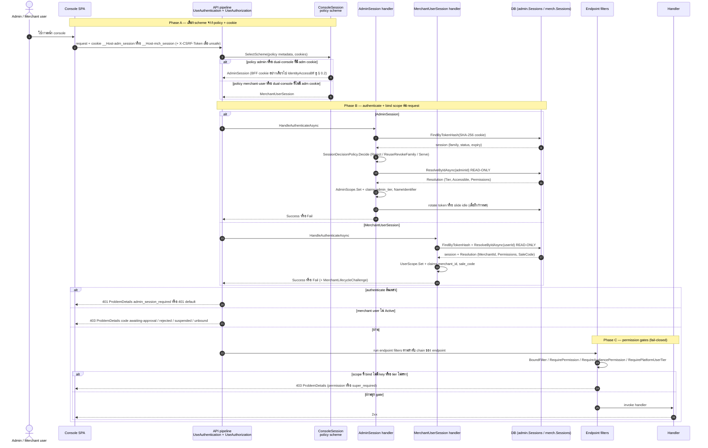
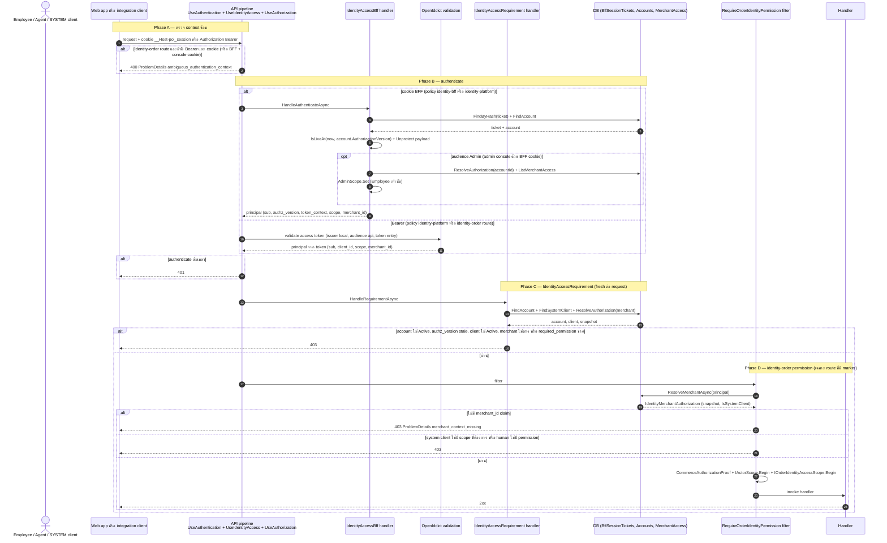
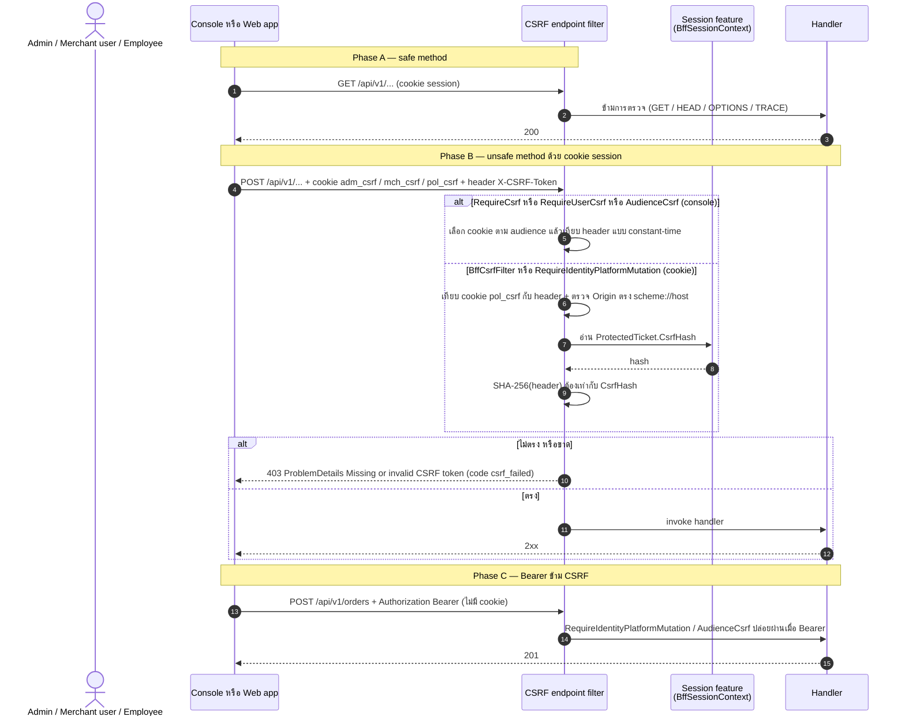
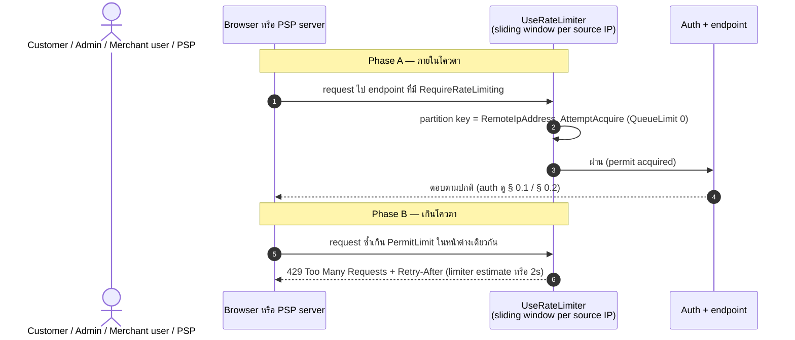
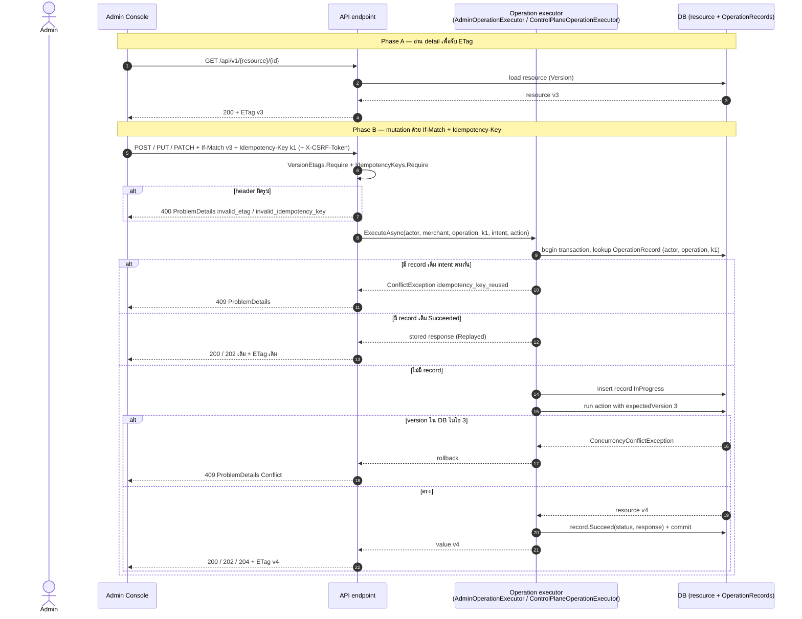
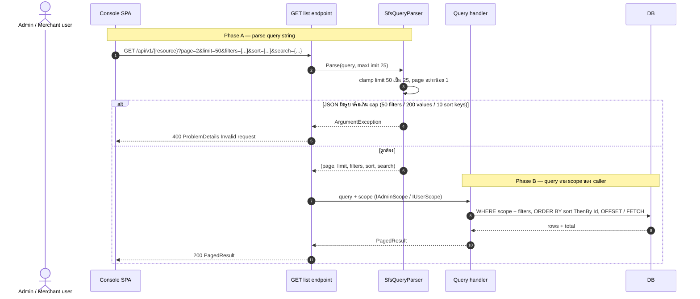
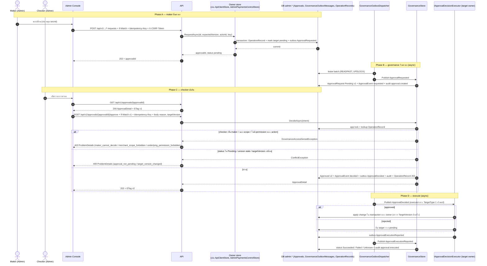
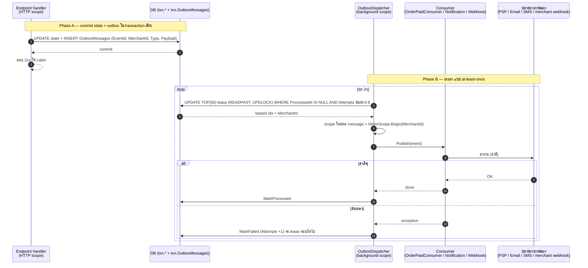
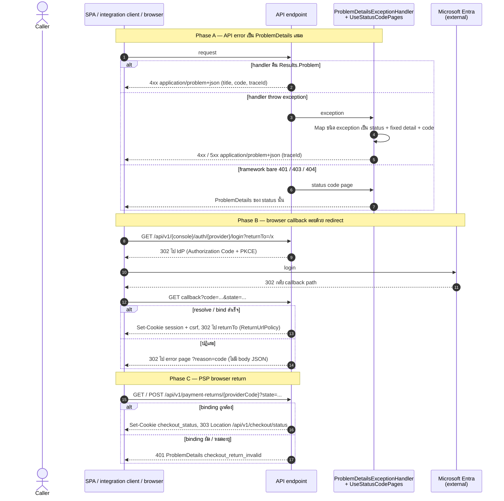

# pol-core API — Cross-cutting behaviour (Sequence Diagrams)

> Source: `docs/reference/api-endpoints.md` บรรทัด L24 (policy / permission vocabulary) และ source host ที่อ้างต่อ § (`src/Api/Api/Iam/*`, `IdentityAccess/*`, `Admins/*`, `Merchants/*`, `Webhooks/RateLimiting.cs`, `ConcurrencyEtags.cs`, `SfsQueryParser.cs`, `Governance/GovernanceEndpoints.cs`, `BackgroundDispatch/*`, `BuildingBlocks.Web/ProblemDetailsExceptionHandler.cs`)
> Scope: 9 § เดียวกับ `00-cross-cutting.activities.md` (หมายเลข § ตรงกัน) แสดงลำดับข้าม actor / middleware / handler / DB / worker
> Generated: 2026-09-14

| § | Diagram | Endpoints |
| --- | --- | --- |
| 0.1 | Console session authentication + authorization | ทุก endpoint policy `admin` / `merchant-user` / `dual-console` ที่ต่อ RequirePermission, RequireAudiencePermission, RequirePlatformUserTier, BoundFilter |
| 0.2 | Identity BFF / Bearer authentication + identity-order permission | policy `identity-bff` / `identity-platform` / `admin-or-identity-order` และแถวที่มี `(identity: order.read / order.write / checkout.write)` |
| 0.3 | CSRF double-submit | ทุก unsafe method ที่มี CSRF filter (RequireCsrf, RequireUserCsrf, RequireAudienceCsrf, RequireAdminOrIdentityCsrf, BffCsrfFilter, RequireIdentityPlatformMutation) |
| 0.4 | Rate limiting | แถวที่ระบุ `rate limit` (policy customer-payment, admin-auth, merchant-user-auth, psp-webhook) |
| 0.5 | ETag / If-Match / Idempotency-Key | mutation ที่มี IfMatchMutationMarker, AdminIfMatchMutationMarker, IdempotencyMutationMarker, GovernanceDecisionMarker และ GET detail ที่คืน ETag |
| 0.6 | SFS query parsing | GET list ที่อ่าน page / limit / filters / sort / search ผ่าน SfsQueryParser |
| 0.7 | Maker-checker approval | endpoint `*-requests`, `*-change-requests`, `activation-requests`, `secret-rotation-requests` และ `/approvals/{approvalId}/approve` / `reject` |
| 0.8 | Background dispatch / outbox | handler ที่ enqueue outbox หรือทิ้งงานให้ worker (PaymentPaid, notification delivery, webhook delivery, PSP inquiry) |
| 0.9 | Error contract | ทุก endpoint (ProblemDetails JSON) และ browser callback / return (302 reason, 303 checkout status) |

---

## 0.1 Console session authentication + authorization

ConsoleSession policy scheme เลือก handler จาก policy + cookie, handler re-resolve บัญชีสดต่อ request แล้ว endpoint filters ตัดสิน permission แบบ fail-closed (source: `src/Api/Api/Iam/ConsoleSessionAuthentication.cs:33-68`, `Admins/SessionAuthenticationHandler.cs:62-168`, `Merchants/UserSessionAuthenticationHandler.cs:70-205`, `Iam/PermissionAuthorization.cs:83-139`, `Admins/HostWiring.cs:98-117`)

---

## 0.2 Identity BFF / Bearer authentication + identity-order permission

request ที่มี BFF cookie หรือ Bearer ผ่าน UseIdentityAccess (กัน context ซ้อน), authenticate ด้วย IdentityAccessBff หรือ OpenIddict, ตรวจ IdentityAccessRequirement สดต่อ request แล้ว filter identity-order ตัดสิน human permission หรือ system scope (source: `src/Api/Api/IdentityAccess/IdentityAccessWiring.cs:70-113`, `BffSessionAuthentication.cs:195-271`, `IdentityAccessAuthorization.cs:10-92`, `Iam/IdentityPermissionAuthorization.cs:24-97`, `Iam/IdentityRequestAuthorization.cs:15-50`)

---

## 0.3 CSRF double-submit

safe method ข้าม, unsafe method ด้วย cookie ต้องส่ง `X-CSRF-Token` เท่ากับ CSRF cookie ของ scheme (BFF เพิ่ม Origin + hash ใน ticket), Bearer ข้ามเฉพาะ identity route (source: `src/Api/Api/Admins/CsrfFilter.cs:20-44`, `Merchants/UserCsrfFilter.cs:21-33`, `Iam/CsrfParity.cs:43-68`, `IdentityAccess/BffCsrfFilter.cs:23-82`)

---

## 0.4 Rate limiting

UseRateLimiter ตัดสินก่อน authentication ด้วย sliding window ต่อ source IP, เกินโควตาตอบ 429 + Retry-After ทันทีโดยไม่ถือ connection (source: `src/Api/Api/Webhooks/RateLimiting.cs:26-57`, `Customers/PaymentRateLimiting.cs:23-37`, `Admins/AuthRateLimiting.cs:25-38`, `Merchants/UserAuthRateLimiting.cs:17-31`, `Program.cs:711`)

---

## 0.5 ETag / If-Match / Idempotency-Key

อ่าน detail รับ ETag แล้ว mutate ด้วย If-Match + Idempotency-Key, executor เก็บ OperationRecord ใน transaction เดียวกับ mutation เพื่อ replay หรือปฏิเสธ key ที่ reuse, version stale ตอบ 409 (source: `src/Api/Api/ConcurrencyEtags.cs:18-42`, `Program.cs:1526-1560`, `Persistence.MerchantRuntime/Idempotency/AdminOperationExecutor.cs:24-60`, `Persistence.ControlPlane/Governance/ControlPlaneOperationExecutor.cs:43-82`)

---

## 0.6 SFS query parsing

GET list parse page / limit / filters / sort / search ที่ host แล้ว handler query ตาม scope ของ caller, paging ถูก clamp ส่วน JSON ผิดหรือเกิน cap เป็น 400 (source: `src/Api/Api/SfsQueryParser.cs:30-85`, `src/Api/BuildingBlocks.Web/ProblemDetailsExceptionHandler.cs:85-88`)

---

## 0.7 Maker-checker approval

maker ยื่นคำขอ (202 pending) ผ่าน owner store ที่เขียน ApprovalRequested ลง governance outbox, dispatcher ส่งให้ GovernanceStore สร้าง ApprovalRequest, checker คนละคนตัดสินด้วย If-Match + Idempotency-Key แล้ว executor ของ owner apply ผลและรายงานกลับ (source: `src/Api/Api/Governance/GovernanceEndpoints.cs:123-182`, `Persistence.ControlPlane/Governance/GovernanceStore.cs:72-196`, `GovernanceOutboxDispatcher.cs:81-139`, `Iam/ApiClientStore.cs:135-170`, `Iam/ApiClientApprovalExecutor.cs:25-80`, `src/Application/Modules/Governance.Application/GovernanceHandlers.cs:44-75`)

---

## 0.8 Background dispatch / outbox

handler commit state + outbox row ใน transaction เดียวแล้วตอบ, OutboxDispatcher ใน background scope lease แถวแบบ at-least-once แล้ว publish ให้ consumer ต่อ merchant (source: `Persistence.MerchantRuntime/Outbox/EfOutbox.cs:25-44`, `Outbox/OutboxDispatcher.cs:66-164`, `src/Api/Api/BackgroundDispatch/BackgroundDispatchScope.cs:16-17`, `Program.cs:268-271,343-346`)

---

## 0.9 Error contract

API error ทุกชนิดออกเป็น ProblemDetails (explicit หรือผ่าน exception handler กลาง), OIDC callback ตอบ 302 ไป returnTo หรือ error page `?reason=`, PSP browser return ตอบ 303 ไป checkout status (source: `src/Api/BuildingBlocks.Web/ProblemDetailsExceptionHandler.cs:30-100`, `Program.cs:701-705,903-979,2425-2444`, `Admins/LoginService.cs:206-229`, `Admins/OidcAuthentication.cs:188-227`, `IdentityAccess/IdentityAccessWiring.cs:155-202`)

---

## Notes

- Deviations ของ cross-cutting อยู่ที่ `00-cross-cutting.activities.md` (group `/admins` ติด `RequireCsrf()` ทั้ง group) ไฟล์นี้ไม่ทำซ้ำ
- ลำดับ participant สะท้อน middleware จริง: UseRateLimiter, UseAuthentication, UseIdentityAccess, UseAuthorization แล้ว endpoint filters ตามลำดับที่ endpoint ต่อ chain (`Program.cs:711-714`)
- § 0.7 / § 0.8 มี phase async: ลูกศรจาก dispatcher เกิดหลัง HTTP response แล้ว ไม่มี caller รอ, ผลสุดท้ายอ่านได้จาก `GET /api/v1/approvals/{approvalId}` หรือ delivery / transaction status endpoint ของ theme นั้น
- ` ` ใน participant alias ใช้ตัดบรรทัดชื่อเท่านั้น ไม่ใช่ path จริง

**Render**: GitHub / Obsidian / VS Code Mermaid
