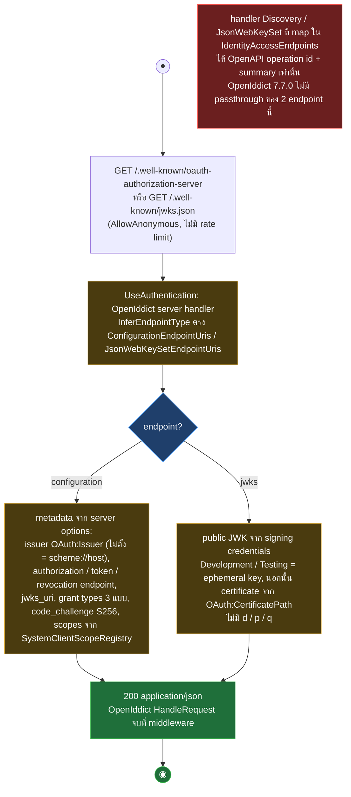
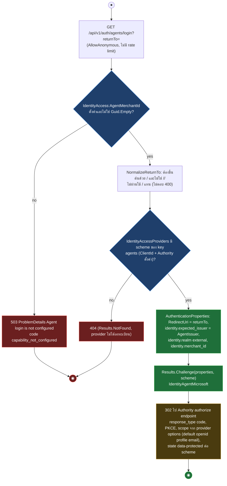
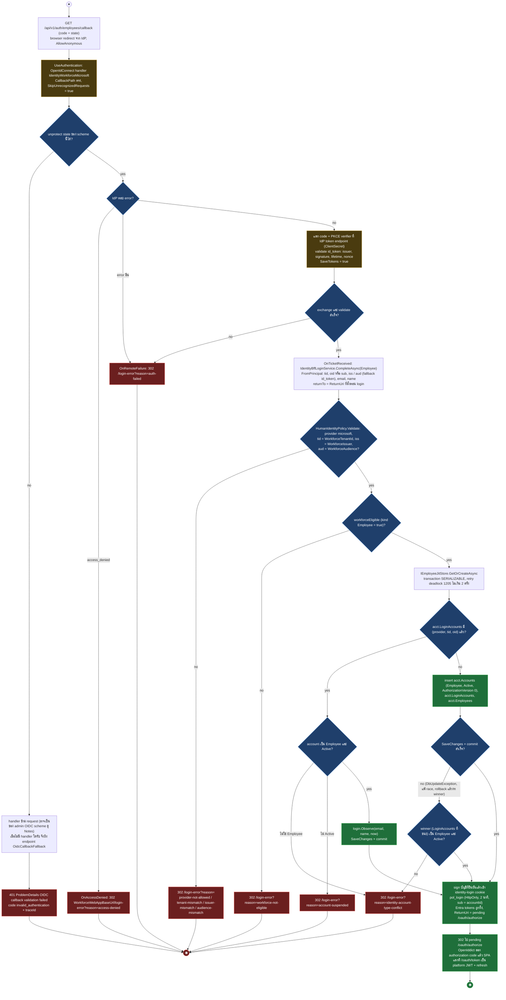
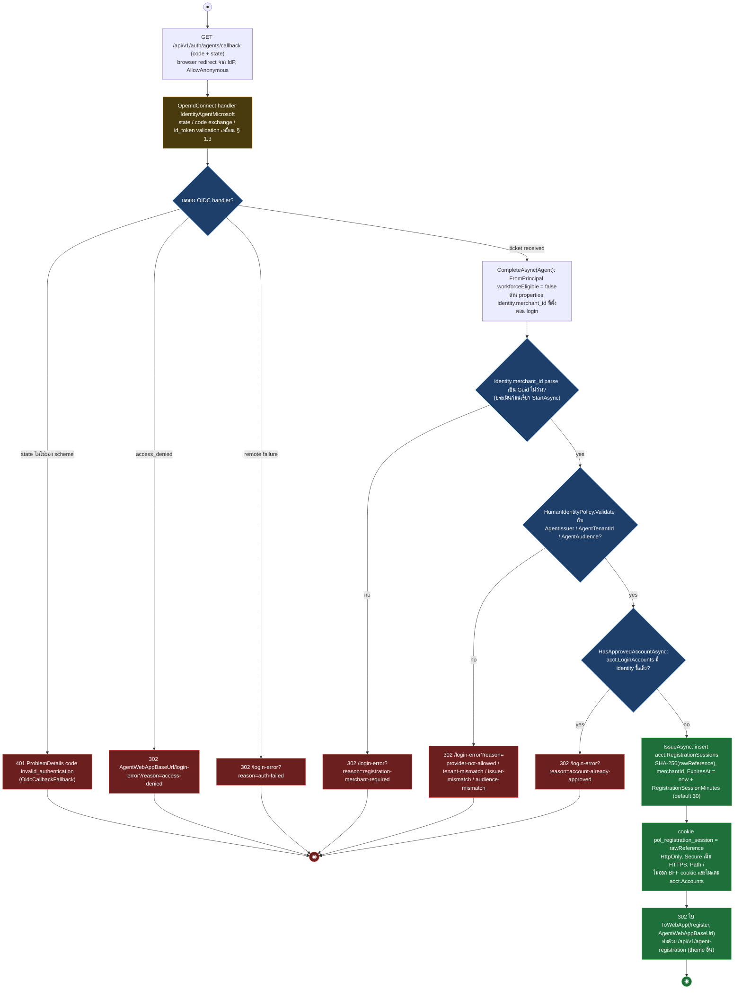
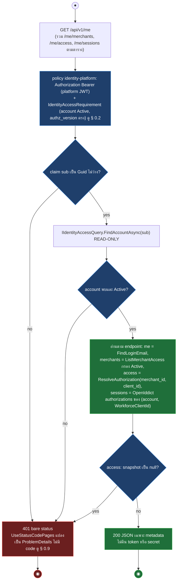
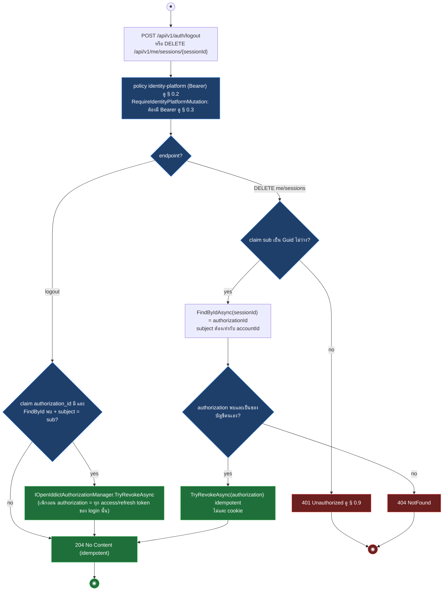
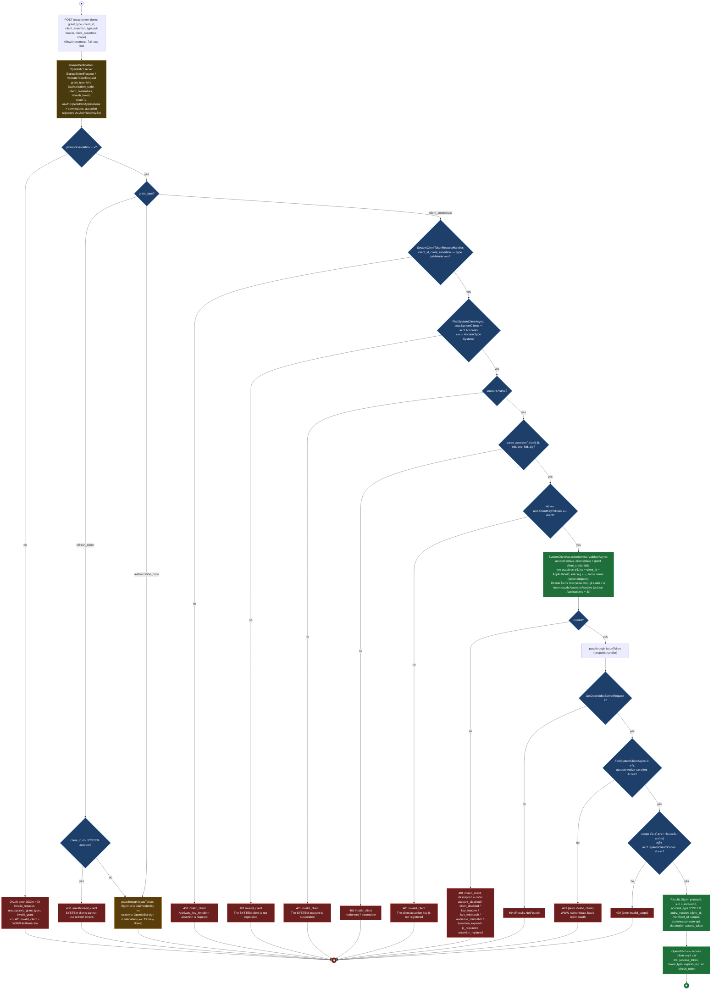
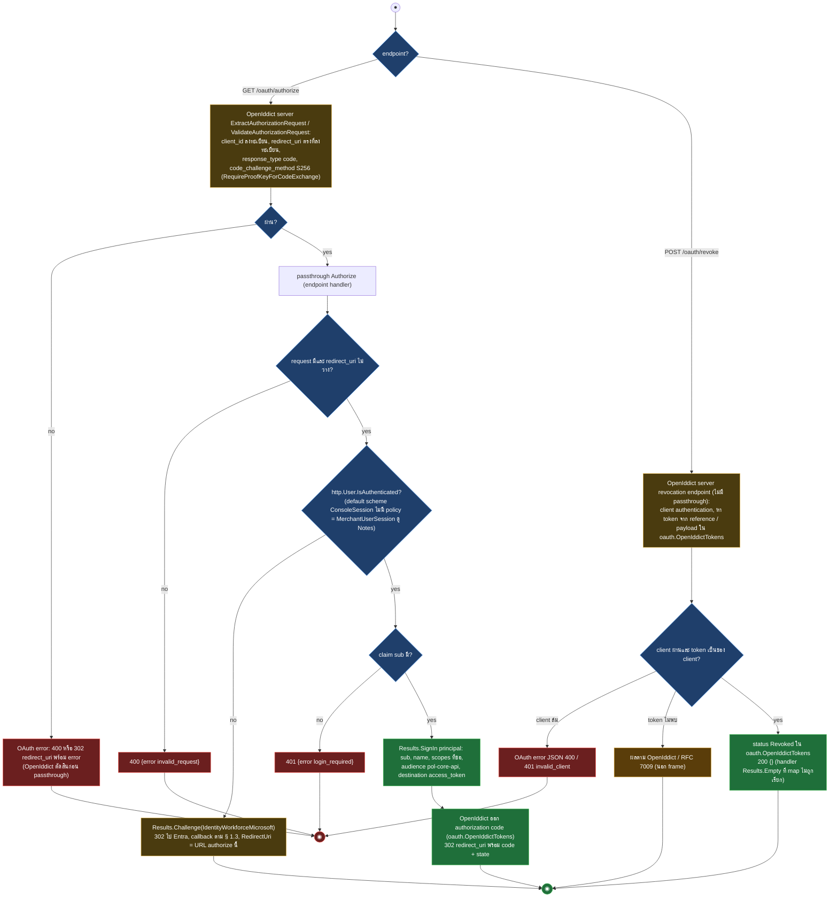

# pol-core API — Identity platform login และ OAuth (Activity Diagrams)

> Source: `docs/reference/api-endpoints.md` section "Identity และ OAuth" และ source ที่อ้างต่อ § (`src/Api/Api/IdentityAccess/IdentityAccessEndpoints.cs`, `IdentityAccessWiring.cs`, `PlatformTokenAuthentication.cs`, `BffCsrfFilter.cs`, `src/Application/Modules/Accounts.Application/IdentityAccessContracts.cs`, `src/Infrastructure/Persistence/Persistence.ControlPlane/OpenIddictRegistration.cs`, `IdentityAccess/IdentityAccessStore.cs`)
> Scope: 14 endpoints ของ theme T01 — OAuth metadata 2, OIDC login start 1 (agents; employee เริ่มที่ /oauth/authorize), OIDC callback 2, identity-platform read 4 (/me, /me/merchants, /me/access, /me/sessions), session revoke 2 (logout, DELETE /me/sessions/{sessionId}), OAuth token / authorize / revoke 3
> Generated: 2026-09-14

| § | Diagram | Endpoints |
| --- | --- | --- |
| 1.1 | OAuth discovery และ JWKS (OpenIddict ตอบเอง) | `GET /.well-known/oauth-authorization-server`, `GET /.well-known/jwks.json` |
| 1.2 | เริ่ม OIDC login (agents) | `GET /api/v1/auth/agents/login` |
| 1.3 | OIDC callback พนักงาน: JIT account + platform authorization code | `GET /api/v1/auth/employees/callback` |
| 1.4 | OIDC callback ตัวแทน: registration session | `GET /api/v1/auth/agents/callback` |
| 1.5 | อ่านบริบท session / account (identity-platform) | `GET /api/v1/me`, `GET /api/v1/me/merchants`, `GET /api/v1/me/access`, `GET /api/v1/me/sessions` |
| 1.7 | เพิกถอน session: logout และลบ login session ที่เลือก | `POST /api/v1/auth/logout`, `DELETE /api/v1/me/sessions/{sessionId}` |
| 1.8 | OAuth token: client_credentials ด้วย private_key_jwt | `POST /oauth/token` |
| 1.9 | OAuth authorize และ revoke | `GET /oauth/authorize`, `POST /oauth/revoke` |

---

## 1.1 OAuth discovery และ JWKS (OpenIddict ตอบเอง)

OpenIddict server ที่ผูกกับ UseAuthentication จับ path ของ configuration / JWKS endpoint แล้วเขียน response เองก่อนถึง endpoint routing, handler ที่ map ไว้ใน IdentityAccessEndpoints ให้ OpenAPI metadata เท่านั้น (source: `src/Infrastructure/Persistence/Persistence.ControlPlane/OpenIddictRegistration.cs:28-67`, `src/Api/Api/IdentityAccess/IdentityAccessEndpoints.cs:83-93,242-278`, `src/Api/Api/Program.cs:243,712`)

| Method | fullPath | ต่างจาก § กลางตรงไหน |
| --- | --- | --- |
| GET | `/.well-known/oauth-authorization-server` | diagram หลัก: OpenIddict สร้าง configuration document (issuer, endpoints, grant types, PKCE, scopes) |
| GET | `/.well-known/jwks.json` | เส้น jwks: คืน `{keys}` เฉพาะ public part ของ signing credentials, ไม่มี metadata อื่น |

---

## 1.2 เริ่ม OIDC login (agents)

endpoint public ของ agents ตรวจ AgentMerchantId ใน config ก่อน แล้ว normalize returnTo แล้ว challenge OpenIdConnect scheme ของ provider เพื่อส่ง browser ไป Microsoft Entra — employee ไม่มี login-start endpoint แล้ว เริ่มที่ `/oauth/authorize` (ดู § 1.9) ซึ่ง challenge workforce provider เอง (source: `src/Api/Api/IdentityAccess/IdentityAccessEndpoints.cs:45-46,564-604,695-698`, `IdentityAccessWiring.cs:115-153`, `IdentityAccessOptions.cs:13,45-54`)

| Method | fullPath | ต่างจาก § กลางตรงไหน |
| --- | --- | --- |
| GET | `/api/v1/auth/agents/login` | ตรวจ AgentMerchantId ก่อน (503 `capability_not_configured`), realm `external` + item `identity.merchant_id`, expected_issuer = `IdentityAccess:AgentIssuer`, scheme `IdentityAgentMicrosoft` |

> employee login-start `GET /api/v1/auth/employees/login` ถูก retire — employee เริ่ม OIDC ที่ `/oauth/authorize` (§ 1.9) ซึ่งเมื่อยังไม่มี login cookie จะ challenge workforce provider แล้ววนกลับผ่าน callback § 1.3

---

## 1.3 OIDC callback พนักงาน: JIT account + platform authorization code

OpenIdConnect handler ตรวจ state / code / id_token แล้ว OnTicketReceived สร้างหรือค้น Employee account แบบ JIT, sign บัญชีที่ยืนยันแล้วเข้า short-lived login cookie (`identity-login`) แล้ว redirect กลับไปที่ pending `/oauth/authorize` ซึ่ง OpenIddict จะออก authorization code ให้ SPA แลกเป็น platform JWT ที่ `/oauth/token` (ไม่มี BFF session แล้ว), ทุก policy failure เป็น 302 ไป login-error พร้อม reason (source: `src/Api/Api/IdentityAccess/IdentityAccessWiring.cs:18-20,167-194,221-260`, `IdentityAccessEndpoints.cs:98-103,348-376`, `src/Application/Modules/Accounts.Application/IdentityAccessContracts.cs:25-80`, `src/Infrastructure/Persistence/Persistence.ControlPlane/IdentityAccess/IdentityAccessStore.cs:72-152`)

---

## 1.4 OIDC callback ตัวแทน: registration session

หัวเดียวกับ § 1.3 แต่หลัง OnTicketReceived ไม่สร้าง account ไม่ออก BFF ticket, ตรวจว่า identity ยังไม่มีบัญชีแล้วออก registration session cookie อายุสั้นแล้วส่งไปหน้า register ของ agent SPA (source: `src/Api/Api/IdentityAccess/IdentityAccessWiring.cs:58-67,157-202,219-228,258-272,312-315`, `IdentityAccessEndpoints.cs:111-114,303-310`, `src/Application/Modules/Accounts.Application/IdentityAccessContracts.cs:95-119`, `src/Infrastructure/Persistence/Persistence.ControlPlane/IdentityAccess/IdentityAccessStore.cs:152-169`)

---

## 1.5 อ่านบริบท session / account (identity-platform)

GET ทั้ง 4 ใช้ policy identity-platform (Bearer platform JWT) แล้ว handler อ่าน account สดอีกครั้ง, บัญชีไม่ Active ตอบ 401 แบบ bare, ไม่มีการเขียน DB — `/auth/session` ถูก retire พร้อม BFF session (source: `src/Api/Api/IdentityAccess/IdentityAccessEndpoints.cs:59-64,107-112,403-426`, `IdentityAccessWiring.cs:96-99`, `src/Infrastructure/Persistence/Persistence.ControlPlane/IdentityAccess/IdentityAccessStore.cs:217,249-346`)

| Method | fullPath | ต่างจาก § กลางตรงไหน |
| --- | --- | --- |
| GET | `/api/v1/me` | diagram หลัก: FindAccount + FindLoginEmail, คืน accountId, accountType, displayName, email, status, authorizationVersion, merchantContext (claim `merchant_id`) |
| GET | `/api/v1/me/merchants` | FindAccount แล้ว `ListMerchantAccessAsync` กรอง `AccessStatus.Active`, คืน array `{merchantId, dataScope}` |
| GET | `/api/v1/me/access` | FindAccount แล้ว `ResolveAuthorizationAsync(account, merchant_id claim, client_id claim)`, snapshot null = 401, คืน AuthorizationSnapshot ทั้งก้อน (permissions, roles, branches, HasPlatformAccess) |
| GET | `/api/v1/me/sessions` | `ListMySessions`: OpenIddict authorizations ของ (accountId, `WorkforceClientId`), คืน `EmployeeSessionView` (sessionId = authorizationId, issuedAt, status, isLive) เรียง IssuedAt ล่าสุดก่อน; ไม่พบ client = array ว่าง |

---

## 1.7 เพิกถอน session: logout และลบ login session ที่เลือก

logout เพิกถอน OpenIddict authorization ปัจจุบัน (ทุก token ของ login นั้น) แล้วตอบ 204 แบบ idempotent (ไม่มี cookie ให้ลบแล้ว), DELETE me/sessions เพิกถอน authorization แถวที่เลือกของบัญชีตนเอง (source: `src/Api/Api/IdentityAccess/IdentityAccessEndpoints.cs:48-50,113-119,428-444,609-620`)

| Method | fullPath | ต่างจาก § กลางตรงไหน |
| --- | --- | --- |
| POST | `/api/v1/auth/logout` | lane logout: อ่าน `authorization_id` จาก JWT, ตรวจ subject = sub, `TryRevokeAsync`, ไม่มี 401/404 จาก handler (ไม่มี id ก็ยัง 204), ไม่มี cookie |
| DELETE | `/api/v1/me/sessions/{sessionId}` | lane DELETE: sessionId = authorizationId, 401 เมื่อ claim sub ไม่มี, 404 เมื่อ authorization ไม่ใช่ของบัญชี, `TryRevokeAsync` แถวเดียว, มี `IdempotencyMutationMarker` แต่ handler ไม่เรียก `IdempotencyKeys.Require` (ดู Notes) |

---

## 1.8 OAuth token: client_credentials ด้วย private_key_jwt

OpenIddict ตรวจ protocol และ signature ของ client assertion ก่อน, SystemClientTokenRequestHandler ตรวจ Account / SystemClient / key policy / jti replay ใน DB, แล้ว passthrough ให้ IssueToken ตรวจ scope และ sign in principal ให้ OpenIddict ออก access token อายุ 5 นาที (source: `src/Api/Api/IdentityAccess/IdentityAccessEndpoints.cs:32-37,171-240`, `src/Infrastructure/Persistence/Persistence.ControlPlane/OpenIddictRegistration.cs:28-67,91-196`, `IdentityAccess/IdentityAccessStore.cs:171-205,247-268`, `src/Application/Modules/Accounts.Application/IdentityAccessContracts.cs:148-205`, `SystemClientScopeRegistry.cs:6-14`, `tests/IntegrationTests/Hosts.Tests/IdentityAccessOAuthTests.cs:131-152,205-221,544-547`)

---

## 1.9 OAuth authorize และ revoke

authorize ให้ OpenIddict ตรวจ client / redirect_uri / PKCE ก่อน passthrough ให้ handler challenge workforce login หรือ sign in เพื่อออก authorization code, ส่วน revoke ไม่มี passthrough OpenIddict จัดการทั้งหมดและ handler ที่ map ไม่ถูกเรียก (source: `src/Api/Api/IdentityAccess/IdentityAccessEndpoints.cs:95-105,280-301`, `src/Infrastructure/Persistence/Persistence.ControlPlane/OpenIddictRegistration.cs:28-45`, `src/Api/Api/Program.cs:351`, `Iam/ConsoleSessionAuthentication.cs:33-68`)

| Method | fullPath | ต่างจาก § กลางตรงไหน |
| --- | --- | --- |
| GET | `/oauth/authorize` | lane authorize: passthrough ถึง handler, 400 `invalid_request`, 302 challenge หรือ 401 `login_required`, success = 302 redirect_uri พร้อม code |
| POST | `/oauth/revoke` | lane revoke: OpenIddict ตอบเองทั้งหมด, handler `() => Results.Empty` ให้ OpenAPI metadata เท่านั้น, success = 200 body ว่าง |

---

## Deviations

| fullPath | เอกสารบอก | source บอก | อ้างอิง |
| --- | --- | --- | --- |
| ไม่พบ deviation ระหว่างเอกสารกับ source | - | - | - |

## Notes

| เรื่อง | ข้อเท็จจริงจาก source | source |
| --- | --- | --- |
| OpenIddict ตอบ metadata / JWKS / revoke เอง | server options ตั้ง Configuration / JsonWebKeySet / Revocation endpoint URIs และเปิด passthrough เฉพาะ authorization + token, OpenIddict 7.7.0 ไม่มี `Enable*Passthrough` สำหรับ 3 endpoint นี้ จึงตอบจบใน UseAuthentication ก่อนถึง endpoint routing, handler ที่ map ให้ OpenAPI operation id (test A1 ตรวจ operation id เหล่านี้) | `OpenIddictRegistration.cs:30-42`, `Program.cs:712`, `tests/IntegrationTests/Hosts.Tests/Task8IdentityAccessA1Tests.cs:32-35` |
| DELETE /api/v1/me/sessions/{sessionId} กับ Idempotency-Key | endpoint ติด `IdempotencyMutationMarker` (OpenAPI บอก header required) แต่ handler ไม่เรียก `IdempotencyKeys.Require` จึงไม่บังคับ header ตอน runtime, การ revoke idempotent ด้วย `IOpenIddictAuthorizationManager.TryRevokeAsync` (ปลอดภัยเมื่อเรียกซ้ำ) | `IdentityAccessEndpoints.cs:113-119,428-444` |
| http.User บน GET /oauth/authorize | `Authorize` handler เรียก `AuthenticateAsync(identity-login)` เอง: ถ้ายังไม่มี login cookie จะ `Challenge` provider (วนไป Entra แล้วกลับผ่าน callback § 1.3) ถ้ามีจะ `SignOut(identity-login)` แล้ว `SignIn` OpenIddict scheme ออก authorization code | `IdentityAccessEndpoints.cs:348-376`, `IdentityAccessWiring.cs:18-20` |
| grant authorization_code / refresh_token บน POST /oauth/token | `IssueToken` sign in ด้วย ClaimsIdentity ว่าง (ไม่มี sub) สำหรับ grant ที่ไม่ใช่ client_credentials, ผลลัพธ์ HTTP ขึ้นกับ OpenIddict sign-in validation ไม่มี test ครอบ จึงอยู่นอก frame, SYSTEM client ถูก reject `unauthorized_client` ก่อนถึงจุดนี้ | `IdentityAccessEndpoints.cs:223-225`, `OpenIddictRegistration.cs:102-113` |
| status code ของ OAuth error | handler เอง: `invalid_client` 401 + `WWW-Authenticate Basic`, `invalid_scope` 400 (ยืนยันด้วย test), ส่วน `context.Reject` ใน SystemClientTokenRequestHandler ให้ OpenIddict map status (test ยืนยัน 401 สำหรับ invalid_client), error อื่นเป็น 400 ตาม OpenIddict default | `IdentityAccessEndpoints.cs:228-240`, `IdentityAccessOAuthTests.cs:146-151,544-547` |
| callback path ที่ใช้ร่วมกับ OIDC scheme อื่น | `SkipUnrecognizedRequests = true` เพราะ workforce กับ agent OIDC scheme อาจถูก challenge บนคำขอเดียวกัน, state ที่ scheme นี้ unprotect ไม่ได้จะปล่อยให้ handler ถัดไปหรือ fallback 401 รับ | `IdentityAccessWiring.cs:132-153` |
| reason บน login-error | code ของ `IdentityAccessException` ถูกแปลง `_` เป็น `-` ก่อนใส่ `?reason=`, OIDC handler failure ใช้ `auth-failed` / `access-denied` คงที่, ไม่มีรายละเอียด exception หลุดไป browser | `IdentityAccessWiring.cs:165-186,193-202` |
| registration_identity_not_agent | `StartAsync` โยน code นี้เมื่อ `WorkforceEligible = true` แต่ callback agent ส่ง `workforceEligible: false` เสมอ จึงไม่มีเส้นทางถึงใน flow นี้ | `IdentityAccessWiring.cs:224`, `IdentityAccessContracts.cs:108-109` |
| provider ไม่ได้ตั้งค่า | `AddHumanProvider` ข้ามการลงทะเบียน scheme เมื่อ ClientId หรือ Authority ว่าง, login ตอบ 404 และ callback ไปถึง fallback 401 เท่านั้น | `IdentityAccessWiring.cs:125-131`, `IdentityAccessEndpoints.cs:498-499` |
| อายุ token และ session | platform access token อายุ 5 นาที (OpenIddict), employee login cookie `identity-login` อายุ 2 นาที (พาบัญชีจาก callback ไป /oauth/authorize เท่านั้น), registration session อายุ `RegistrationSessionMinutes` (default 30) | `IdentityAccessOptions.cs:14`, `IdentityAccessWiring.cs:249-254`, `OpenIddictRegistration.cs:28-75` |
| rate limit | ไม่มี endpoint ใน theme นี้ต่อ `RequireRateLimiting` (ต่างจาก merchant-user-auth ใน § 0.4) | `IdentityAccessEndpoints.cs:32-129` |

**Render**: GitHub / Obsidian / VS Code Mermaid
