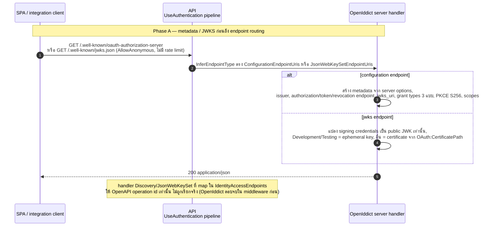
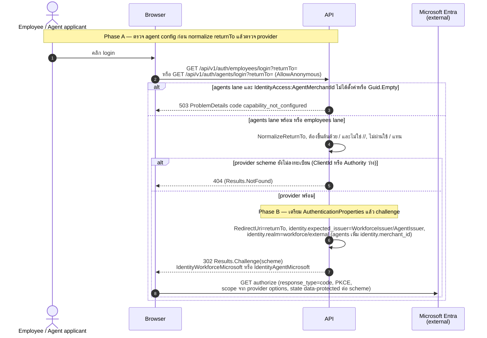
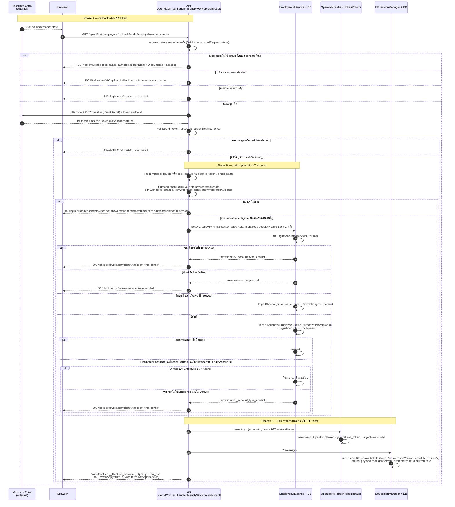
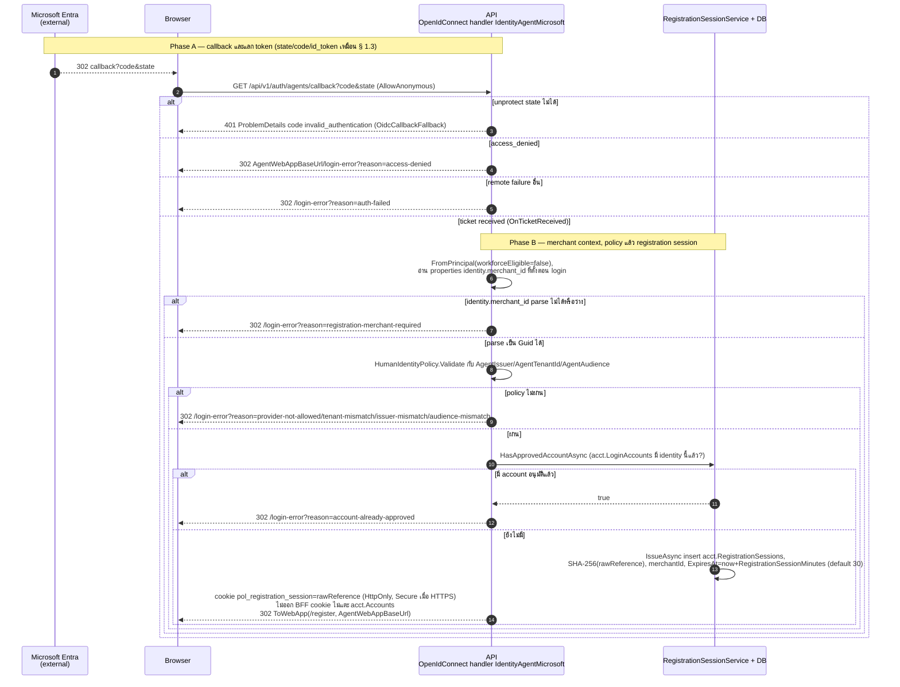
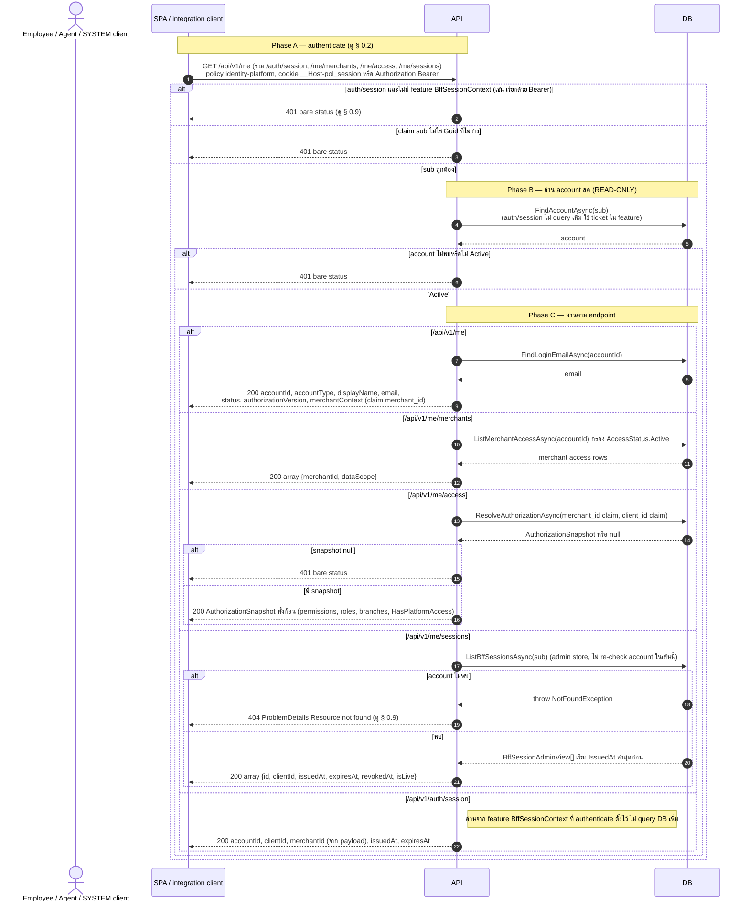
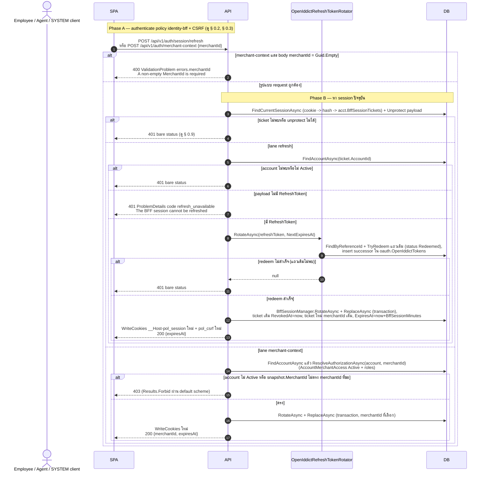
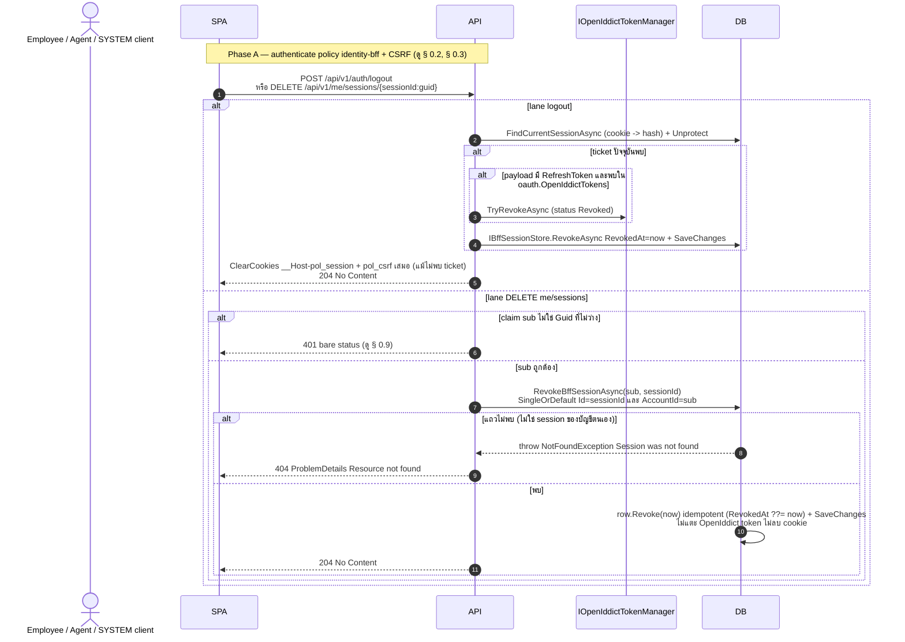
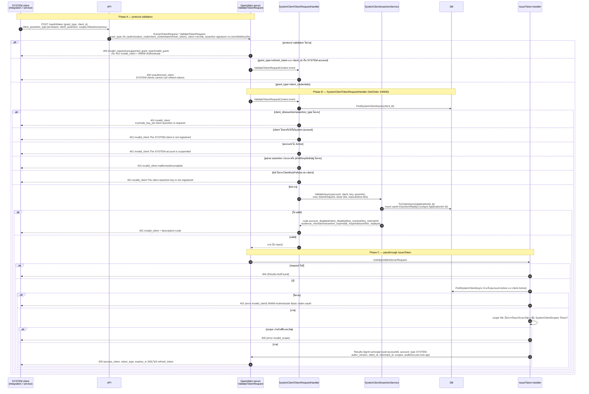
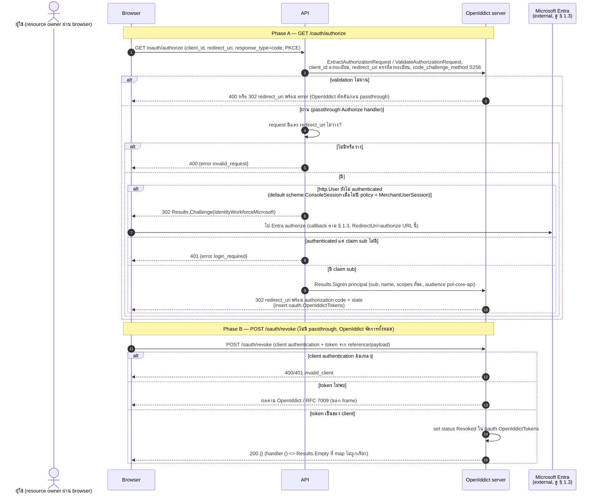

# pol-core API — Identity BFF และ OAuth (Sequence Diagrams)

> Source: `docs/reference/api-endpoints.md` section "Identity และ OAuth" บรรทัด L32-L33, L52-L64, L78-L80 และ source ที่อ้างต่อ § (`src/Api/Api/IdentityAccess/IdentityAccessEndpoints.cs`, `IdentityAccessWiring.cs`, `BffSessionAuthentication.cs`, `BffCsrfFilter.cs`, `OpenIddictRefreshTokenRotator.cs`, `src/Application/Modules/Accounts.Application/IdentityAccessContracts.cs`, `src/Infrastructure/Persistence/Persistence.ControlPlane/OpenIddictRegistration.cs`, `IdentityAccess/IdentityAccessStore.cs`)
> Scope: 9 § เดียวกับ `01-identity-bff-oauth.activities.md` (หมายเลข § ตรงกัน) แสดงลำดับข้าม actor / browser / API / handler / DB / OpenIddict / IdP
> Generated: 2026-09-14

| § | Diagram | Endpoints |
| --- | --- | --- |
| 1.1 | OAuth discovery และ JWKS (OpenIddict ตอบเอง) | `GET /.well-known/oauth-authorization-server`, `GET /.well-known/jwks.json` |
| 1.2 | เริ่ม OIDC login (employees / agents) | `GET /api/v1/auth/employees/login`, `GET /api/v1/auth/agents/login` |
| 1.3 | OIDC callback พนักงาน: JIT account + BFF session | `GET /api/v1/auth/employees/callback` |
| 1.4 | OIDC callback ตัวแทน: registration session | `GET /api/v1/auth/agents/callback` |
| 1.5 | อ่านบริบท session / account (identity-platform) | `GET /api/v1/auth/session`, `GET /api/v1/me`, `GET /api/v1/me/merchants`, `GET /api/v1/me/access`, `GET /api/v1/me/sessions` |
| 1.6 | หมุน BFF ticket: refresh และเลือก merchant context | `POST /api/v1/auth/session/refresh`, `POST /api/v1/auth/merchant-context` |
| 1.7 | เพิกถอน BFF session: logout และลบ session ที่เลือก | `POST /api/v1/auth/logout`, `DELETE /api/v1/me/sessions/{sessionId:guid}` |
| 1.8 | OAuth token: client_credentials ด้วย private_key_jwt | `POST /oauth/token` |
| 1.9 | OAuth authorize และ revoke | `GET /oauth/authorize`, `POST /oauth/revoke` |

---

## 1.1 OAuth discovery และ JWKS (OpenIddict ตอบเอง)

OpenIddict server จับ path metadata/JWKS ใน UseAuthentication ก่อนถึง endpoint routing เสมอ handler ที่ map ไว้ให้ OpenAPI metadata เท่านั้น (source: `src/Infrastructure/Persistence/Persistence.ControlPlane/OpenIddictRegistration.cs:28-67`, `src/Api/Api/IdentityAccess/IdentityAccessEndpoints.cs:83-93,242-278`)

| Method | fullPath | ต่างจาก § กลางตรงไหน |
| --- | --- | --- |
| GET | `/.well-known/oauth-authorization-server` | diagram หลัก: OpenIddict สร้าง configuration document (issuer, endpoints, grant types, PKCE, scopes) |
| GET | `/.well-known/jwks.json` | เส้น jwks: คืน `{keys}` เฉพาะ public part ของ signing credentials, ไม่มี metadata อื่น |

---

## 1.2 เริ่ม OIDC login (employees / agents)

endpoint public (agents) ตรวจ AgentMerchantId ตั้งค่าก่อน แล้ว normalize returnTo แล้ว challenge OpenIdConnect scheme ของ provider ให้ browser ไป Microsoft Entra (source: `src/Api/Api/IdentityAccess/IdentityAccessEndpoints.cs:44-47,449-505,717-720`, `IdentityAccessWiring.cs:115-153`)

| Method | fullPath | ต่างจาก § กลางตรงไหน |
| --- | --- | --- |
| GET | `/api/v1/auth/employees/login` | diagram หลัก: ข้ามการตรวจ AgentMerchantId, realm `workforce`, expected_issuer = `IdentityAccess:WorkforceIssuer`, scheme `IdentityWorkforceMicrosoft` |
| GET | `/api/v1/auth/agents/login` | ตรวจ AgentMerchantId ก่อน (503 `capability_not_configured`), realm `external` + item `identity.merchant_id`, expected_issuer = `IdentityAccess:AgentIssuer`, scheme `IdentityAgentMicrosoft` |

---

## 1.3 OIDC callback พนักงาน: JIT account + BFF session

OpenIdConnect handler ตรวจ state/code/id_token แล้ว OnTicketReceived สร้างหรือค้น Employee account แบบ JIT, ออก OpenIddict refresh token reference, สร้าง BFF ticket แล้วส่ง browser กลับ SPA (source: `src/Api/Api/IdentityAccess/IdentityAccessWiring.cs:48-57,132-202,219-256,289-310`, `src/Application/Modules/Accounts.Application/IdentityAccessContracts.cs:25-82`, `Persistence.ControlPlane/IdentityAccess/IdentityAccessStore.cs:69-146`, `OpenIddictRefreshTokenRotator.cs:11-24`)

---

## 1.4 OIDC callback ตัวแทน: registration session

หัวเดียวกับ § 1.3 แต่หลัง OnTicketReceived ไม่สร้าง account ไม่ออก BFF ticket ตรวจว่า identity ยังไม่มีบัญชีแล้วออก registration session cookie อายุสั้น (source: `src/Api/Api/IdentityAccess/IdentityAccessWiring.cs:58-67,157-202,219-228,258-272,312-315`, `src/Application/Modules/Accounts.Application/IdentityAccessContracts.cs:95-119`, `Persistence.ControlPlane/IdentityAccess/IdentityAccessStore.cs:152-169`)

---

## 1.5 อ่านบริบท session / account (identity-platform)

GET ทั้ง 5 ใช้ policy identity-platform (BFF cookie หรือ Bearer) แล้ว handler อ่าน account สดอีกครั้ง ไม่มีการเขียน DB (source: `src/Api/Api/IdentityAccess/IdentityAccessEndpoints.cs:49-50,68-73,116-121,312-319,507-525,629-690,708-715`, `Persistence.ControlPlane/IdentityAccess/IdentityAccessStore.cs:238-245,270-349,439-449`)

| Method | fullPath | ต่างจาก § กลางตรงไหน |
| --- | --- | --- |
| GET | `/api/v1/auth/session` | อ่าน cookie ผ่าน `ReadSessionToken` + feature `BffSessionContext` เท่านั้น, Bearer ไม่มี cookie = 401 แม้ policy รับ Bearer, ไม่ query DB เพิ่ม |
| GET | `/api/v1/me` | diagram หลัก: `FindAccountAsync` + `FindLoginEmailAsync` |
| GET | `/api/v1/me/merchants` | `FindAccountAsync` แล้ว `ListMerchantAccessAsync` กรอง `AccessStatus.Active` |
| GET | `/api/v1/me/access` | `FindAccountAsync` แล้ว `ResolveAuthorizationAsync`, snapshot null = 401 |
| GET | `/api/v1/me/sessions` | ไม่ re-check account ใน handler ก่อน, `ListBffSessionsAsync` เอง throw `NotFoundException` 404 เมื่อ account ไม่พบ |

---

## 1.6 หมุน BFF ticket: refresh และเลือก merchant context

ทั้งสอง endpoint ค้น ticket ปัจจุบันจาก cookie แล้วออก ticket ใหม่แทน (revoke เดิม + insert ใหม่ในธุรกรรมเดียว) พร้อม cookie คู่ใหม่, refresh หมุน OpenIddict refresh token ด้วย ส่วน merchant-context ตรวจ MerchantAccess ก่อน (source: `src/Api/Api/IdentityAccess/IdentityAccessEndpoints.cs:51-58,527-604,692-706`, `BffSessionAuthentication.cs:43-44,74-112,135-156`, `OpenIddictRefreshTokenRotator.cs:29-55`)

| Method | fullPath | ต่างจาก § กลางตรงไหน |
| --- | --- | --- |
| POST | `/api/v1/auth/session/refresh` | lane refresh: ตรวจ account Active (401), ต้องมี RefreshToken ใน payload (401 `refresh_unavailable`), หมุน OpenIddict token ก่อน rotate ticket, merchantId คงเดิม |
| POST | `/api/v1/auth/merchant-context` | lane merchant-context: validate body ก่อนค้น session (400), ไม่แตะ OpenIddict token, `ResolveAuthorizationAsync` ต้องคืน MerchantId ตรง (403), ticket ใหม่ผูก merchantId ที่เลือก |

---

## 1.7 เพิกถอน BFF session: logout และลบ session ที่เลือก

logout เพิกถอน ticket ปัจจุบัน + OpenIddict refresh token แล้วลบ cookie เสมอ (idempotent), DELETE me/sessions เพิกถอน ticket แถวที่เลือกของบัญชีตนเองโดยไม่แตะ cookie (source: `src/Api/Api/IdentityAccess/IdentityAccessEndpoints.cs:59-62,122-129,321-329,606-627,692-706`, `Persistence.ControlPlane/IdentityAccess/IdentityAccessStore.cs:213-218,451-458`)

| Method | fullPath | ต่างจาก § กลางตรงไหน |
| --- | --- | --- |
| POST | `/api/v1/auth/logout` | lane logout: ไม่มี 401/404 จาก handler (ticket หายก็ยัง 204), revoke OpenIddict refresh token ก่อน revoke ticket, ลบ cookie คู่เสมอ |
| DELETE | `/api/v1/me/sessions/{sessionId:guid}` | lane DELETE: 401 เมื่อ claim sub ไม่มี, 404 เมื่อ session ไม่ใช่ของบัญชี, revoke แถวเดียว, ไม่ลบ cookie แม้เลือก session ปัจจุบัน |

---

## 1.8 OAuth token: client_credentials ด้วย private_key_jwt

OpenIddict ตรวจ protocol และ signature ของ client assertion ก่อน `SystemClientTokenRequestHandler` ตรวจ Account/SystemClient/key policy/jti replay ใน DB แล้ว passthrough ให้ `IssueToken` ตรวจ scope และ sign in principal (source: `src/Api/Api/IdentityAccess/IdentityAccessEndpoints.cs:32-37,171-240`, `Persistence.ControlPlane/OpenIddictRegistration.cs:28-67,91-196`, `Persistence.ControlPlane/IdentityAccess/IdentityAccessStore.cs:171-205,247-268`, `src/Application/Modules/Accounts.Application/IdentityAccessContracts.cs:148-205`)

---

## 1.9 OAuth authorize และ revoke

authorize ให้ OpenIddict ตรวจ client/redirect_uri/PKCE ก่อน passthrough ให้ handler challenge workforce login หรือ sign in เพื่อออก authorization code ส่วน revoke ไม่มี passthrough OpenIddict จัดการทั้งหมด (source: `src/Api/Api/IdentityAccess/IdentityAccessEndpoints.cs:95-105,280-301`, `Persistence.ControlPlane/OpenIddictRegistration.cs:28-45`, `src/Api/Api/Iam/ConsoleSessionAuthentication.cs:33-68`)

| Method | fullPath | ต่างจาก § กลางตรงไหน |
| --- | --- | --- |
| GET | `/oauth/authorize` | lane authorize: passthrough ถึง handler, 400 `invalid_request`, 302 challenge หรือ 401 `login_required`, success = 302 redirect_uri พร้อม code |
| POST | `/oauth/revoke` | lane revoke: OpenIddict ตอบเองทั้งหมด, handler `() => Results.Empty` ให้ OpenAPI metadata เท่านั้น, success = 200 body ว่าง |

---

## Notes

Deviations และรายละเอียด edge-case ทั้งหมด (เช่น reason ของ login-error, provider ไม่ได้ตั้งค่า, อายุ cookie/session, `IdempotencyMutationMarker` ที่ handler ไม่บังคับจริงบน DELETE me/sessions) อยู่ที่ `01-identity-bff-oauth.activities.md` (หัวข้อ Deviations และ Notes) — ไฟล์นี้แสดงเฉพาะลำดับข้าม actor / browser / API / handler / DB / OpenIddict / IdP ตาม § เดียวกัน

- § 1.3 / § 1.4: gate `workforceEligible` ของ activity diagram เป็นจริงเสมอในเลนนี้ (kind กำหนดตายตัวจาก endpoint) จึงไม่วาดเป็น alt แยกในลำดับนี้ ดูรายละเอียดเต็มที่ activities.md
- § 1.1, § 1.8 lane `authorization_code`/`refresh_token` อื่นนอกเลนที่ตาราง endpoint ของ theme นี้ครอบ, § 1.9 revoke lane token ไม่พบ อยู่นอก frame (ไม่มี test ครอบ) ตามที่บันทึกไว้ใน Notes ของ activities.md
- authenticate/authorization ของ policy `identity-bff` และ `identity-platform` (ticket ผ่าน, IdentityAccessRequirement, Bearer validation) อ้างที่ § 0.2 ในไฟล์ `00-cross-cutting.sequences.md`, CSRF double-submit อ้างที่ § 0.3, error contract ทั่วไป (ProblemDetails, OIDC 302 reason) อ้างที่ § 0.9

**Render**: GitHub / Obsidian / VS Code Mermaid
