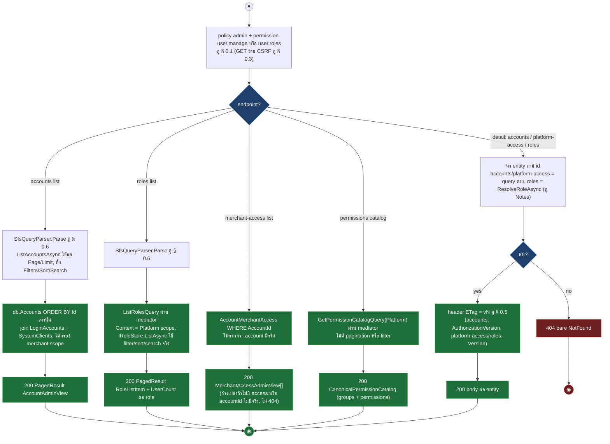
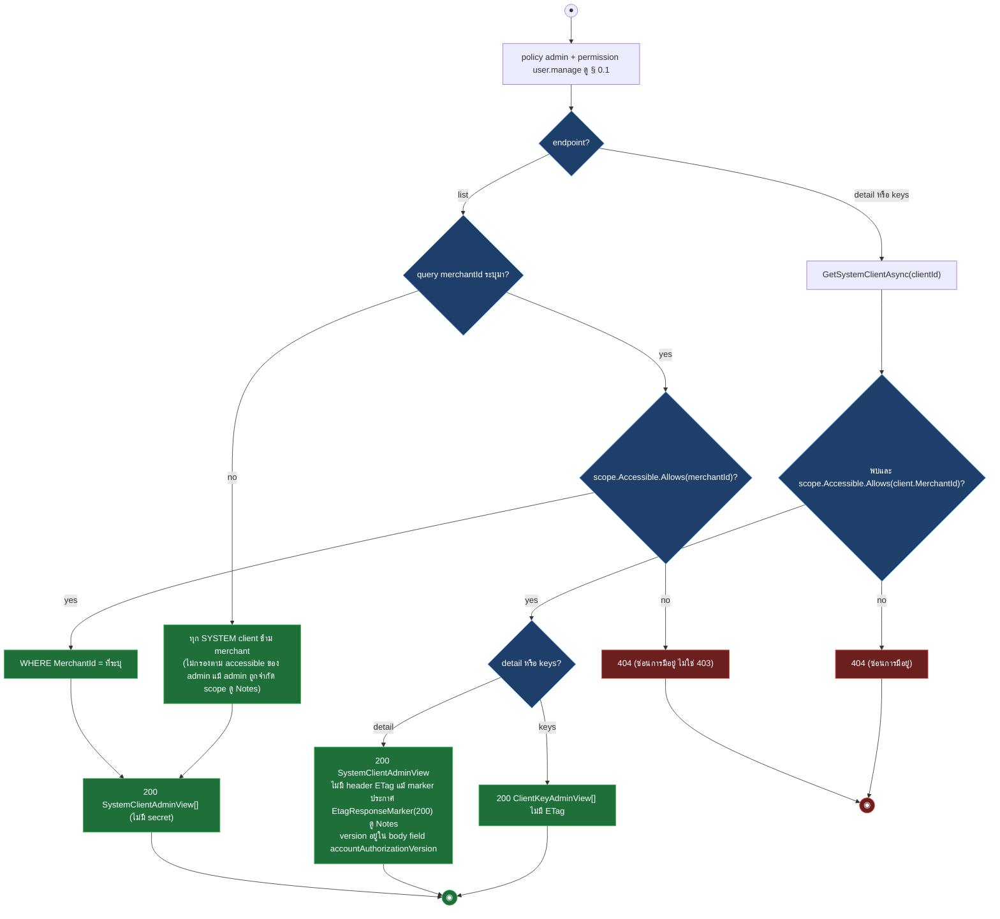
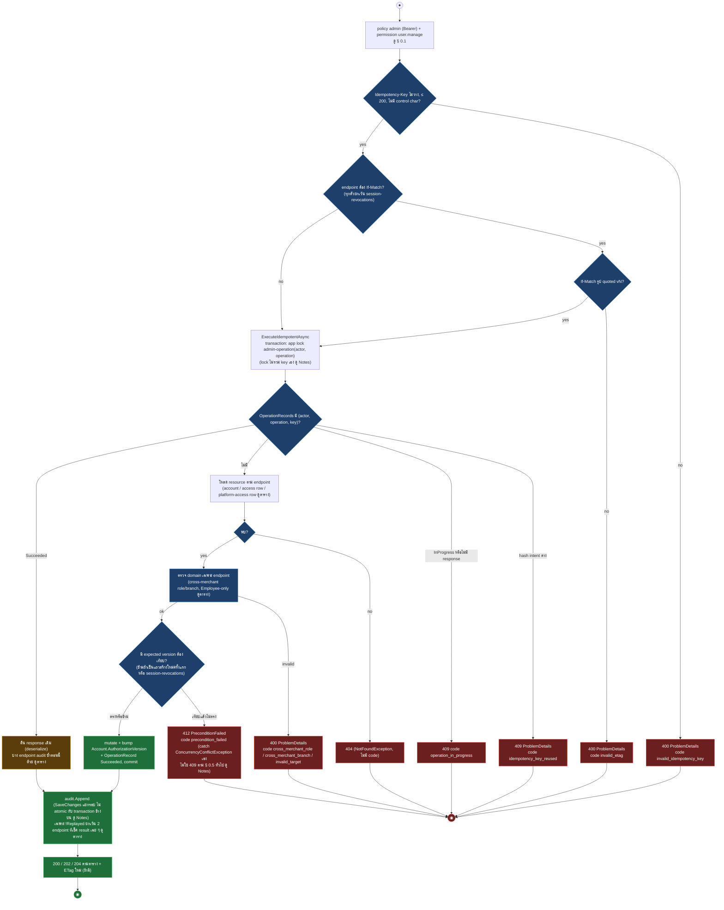
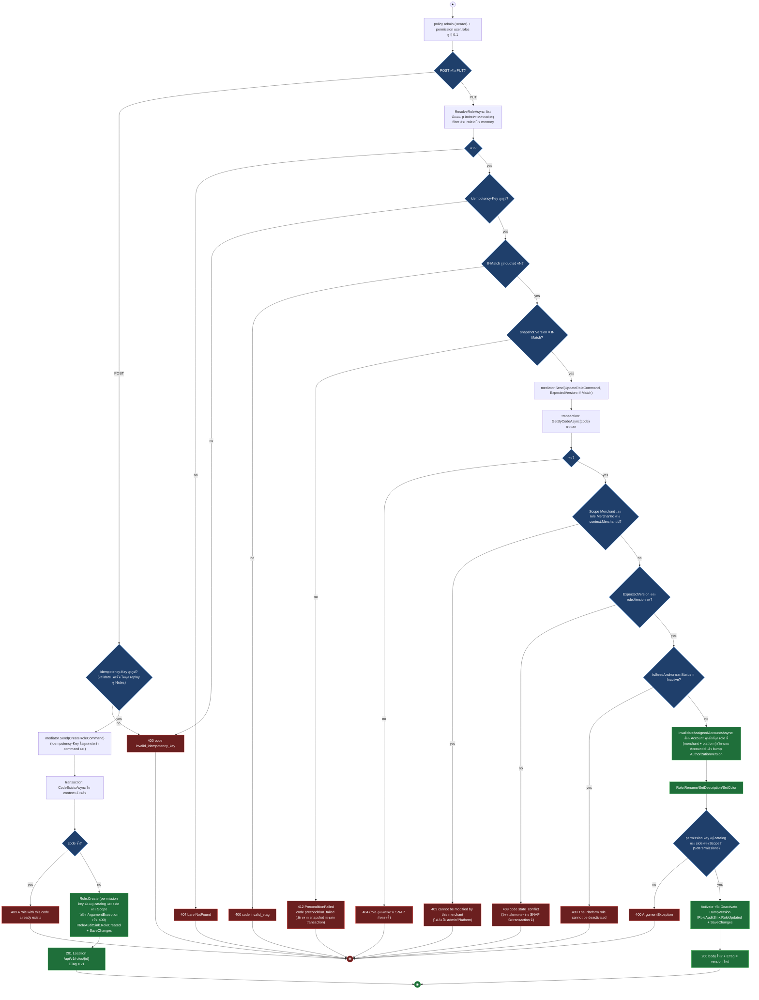
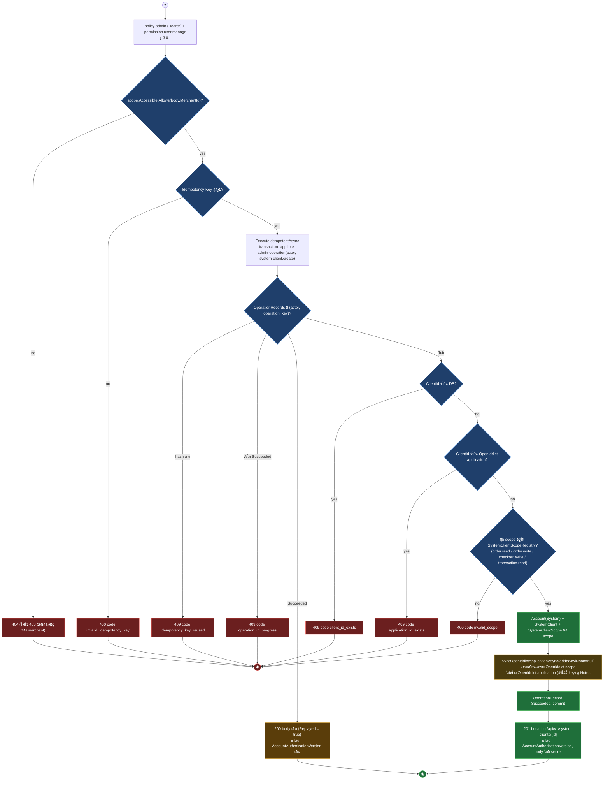
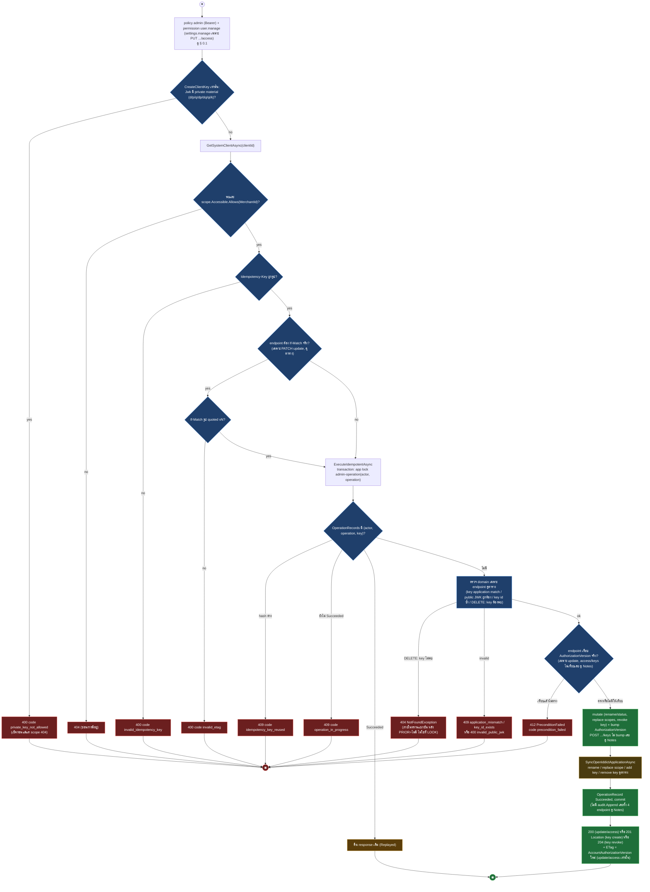

# pol-core API — Canonical access, roles และ SYSTEM clients (Activity Diagrams)

> Source: `docs/reference/api-endpoints.md` section "Identity และ OAuth" บรรทัด L32-L40,L63-L75 และ source ที่อ้างต่อ § (`src/Api/Api/IdentityAccess/CanonicalAccessEndpoints.cs`, `src/Api/Api/IdentityAccess/IdentityAccessEndpoints.cs:131-169,331-447`, `src/Api/Api/ConcurrencyEtags.cs`, `src/Infrastructure/Persistence/Persistence.ControlPlane/IdentityAccess/IdentityAccessStore.cs`, `Persistence.ControlPlane/Admins/AdminOperationStore.cs`, `src/Application/Modules/Iam.Application/Roles/CreateRole.cs`, `UpdateRole.cs`, `RoleQueries.cs`, `src/Infrastructure/Persistence/Persistence.ControlPlane/Iam/RoleAuthorizationInvalidator.cs`, `src/Application/Modules/Accounts.Application/SystemClientScopeRegistry.cs`, `src/Api/BuildingBlocks.Web/ProblemDetailsExceptionHandler.cs`)
> Scope: 22 endpoints — อ่าน/แก้ business account, merchant-access, platform-access และ session revoke (9), permission catalog + Platform role (5), SYSTEM client + public key + scope (8) ทุกตัวอยู่ใต้ policy `admin`
> Generated: 2026-09-14

| § | Diagram | Endpoints |
| --- | --- | --- |
| 2.1 | อ่านรายการ/รายละเอียดระดับ Platform | `GET /api/v1/accounts`, `GET /api/v1/accounts/{accountId:guid}`, `GET /api/v1/accounts/{accountId:guid}/merchant-access`, `GET /api/v1/accounts/{accountId:guid}/platform-access`, `GET /api/v1/permissions`, `GET /api/v1/roles`, `GET /api/v1/roles/{roleId:guid}` |
| 2.2 | อ่านรายการ/รายละเอียด SYSTEM client ภายใน merchant scope | `GET /api/v1/system-clients`, `GET /api/v1/system-clients/{clientId:guid}`, `GET /api/v1/system-clients/{clientId:guid}/keys` |
| 2.3 | แก้ไข/เพิกถอนสิทธิ์ระดับ account (idempotent executor จริง) | `PATCH /api/v1/accounts/{accountId:guid}`, `PUT /api/v1/accounts/{accountId:guid}/merchant-access/{merchantId:guid}`, `DELETE /api/v1/accounts/{accountId:guid}/merchant-access/{merchantId:guid}`, `PUT /api/v1/accounts/{accountId:guid}/platform-access`, `POST /api/v1/accounts/{accountId:guid}/session-revocations` |
| 2.4 | สร้าง/แก้ไข Platform role (ไม่มี idempotent replay จริง) | `POST /api/v1/roles`, `PUT /api/v1/roles/{roleId:guid}` |
| 2.5 | สร้าง SYSTEM client + ลงทะเบียน scope | `POST /api/v1/system-clients` |
| 2.6 | แก้ไข/แทนที่สิทธิ์ SYSTEM client และจัดการ public key | `PATCH /api/v1/system-clients/{clientId:guid}`, `PUT /api/v1/system-clients/{clientId:guid}/access`, `POST /api/v1/system-clients/{clientId:guid}/keys`, `DELETE /api/v1/system-clients/{clientId:guid}/keys/{keyId:guid}` |

---

## 2.1 อ่านรายการ/รายละเอียดระดับ Platform

ทั้ง 7 ตัวเป็น gate แล้วอ่านตรงจาก DB หรือผ่าน mediator query โดยไม่มี merchant-scope filter เพราะ Account/Role อยู่ระดับ Platform (source: `src/Api/Api/IdentityAccess/CanonicalAccessEndpoints.cs:28-93,162-226`, `Persistence.ControlPlane/IdentityAccess/IdentityAccessStore.cs:344-393`, `src/Application/Modules/Iam.Application/Roles/RoleQueries.cs`)

| Method | fullPath | ต่างจาก § กลางตรงไหน |
| --- | --- | --- |
| GET | `/api/v1/accounts` | permission `user.manage`, SFS parse แล้วใช้แค่ Page/Limit (Filters/Sort/Search ถูก parse ทิ้งเงียบ ไม่ error), ORDER BY Id คงที่, ไม่กรอง merchant scope (`IdentityAccessStore.cs:368-383`) |
| GET | `/api/v1/accounts/{accountId:guid}` | permission `user.manage`, 404 ไม่มี code, ETag = AuthorizationVersion, body ปิด token/secret (`IdentityAccessStore.cs:385-393`) |
| GET | `/api/v1/accounts/{accountId:guid}/merchant-access` | permission `user.manage`, ไม่มี ETag, ไม่ 404 แม้ accountId ไม่มีจริง (คืน `[]` เปล่า) (`IdentityAccessStore.cs:344-366`) |
| GET | `/api/v1/accounts/{accountId:guid}/platform-access` | permission `user.manage`, 404 ไม่มี code, ETag = Version, แถวเดียวต่อ EmployeeAccountId (`IdentityAccessStore.cs:846-851`) |
| GET | `/api/v1/permissions` | permission `user.roles`, ไม่มี pagination/filter/ETag (`CanonicalAccessEndpoints.cs:162-168`) |
| GET | `/api/v1/roles` | permission `user.roles`, SFS เต็มรูปแบบ (filter/sort/search ใช้จริงผ่าน `IRoleStore.ListAsync`) ต่างจาก accounts list |
| GET | `/api/v1/roles/{roleId:guid}` | permission `user.roles`, `ResolveRoleAsync` โหลด role ทั้งหมด (`Limit=int.MaxValue`) แล้ว filter ด้วย roleId ใน memory แทนการ query ตรง, 404 ไม่มี code, ETag = Version (`CanonicalAccessEndpoints.cs:198-207,331-338`) |

---

## 2.2 อ่านรายการ/รายละเอียด SYSTEM client ภายใน merchant scope

ต่างจาก § 2.1 ตรงที่ scope check ใช้ `scope.Accessible.Allows(MerchantId)` และตอบ 404 (ไม่ใช่ 403) เพื่อซ่อนการมีอยู่ (source: `src/Api/Api/IdentityAccess/IdentityAccessEndpoints.cs:134-158,331-361,409-416`, `Persistence.ControlPlane/IdentityAccess/IdentityAccessStore.cs:460-475,551-554`)

| Method | fullPath | ต่างจาก § กลางตรงไหน |
| --- | --- | --- |
| GET | `/api/v1/system-clients` | query `merchantId` เป็น optional, ถ้าไม่ส่งคืนทุก client ข้าม merchant, ถ้าส่งมาต้องผ่าน `Allows` ไม่งั้น 404 (`IdentityAccessEndpoints.cs:331-337`) |
| GET | `/api/v1/system-clients/{clientId:guid}` | 404 ทั้งกรณีไม่พบและกรณีอยู่นอก scope (ไม่แยกข้อความ), ไม่มี ETag header (ดู Notes) (`IdentityAccessEndpoints.cs:354-361`) |
| GET | `/api/v1/system-clients/{clientId:guid}/keys` | ต้องหา client ก่อนเสมอ (404 ถ้าไม่พบ/นอก scope) แล้วค่อยอ่าน `ClientKeyPolicy[]`, ไม่มี ETag (`IdentityAccessEndpoints.cs:409-416`) |

---

## 2.3 แก้ไข/เพิกถอนสิทธิ์ระดับ account (idempotent executor จริง)

ทั้ง 5 ตัวผ่าน `IdentityAccessStore.ExecuteIdempotentAsync` จริง (lock + replay ใน transaction เดียว) ต่างจาก § 2.4 ที่ role create/update ไม่มี replay จริง (source: `CanonicalAccessEndpoints.cs:120-160,242-329`, `Persistence.ControlPlane/IdentityAccess/IdentityAccessStore.cs:395-437,769-844,854-924`, `Persistence.ControlPlane/Admins/AdminOperationStore.cs`)

| Method | fullPath | ต่างจาก § กลางตรงไหน |
| --- | --- | --- |
| PATCH | `/api/v1/accounts/{accountId:guid}` | โหลด account ตรง (404 ถ้าไม่พบ), ไม่มี domain validation พิเศษ, version เทียบเสมอ, bump AuthorizationVersion เฉพาะเมื่อ Status เปลี่ยนจริง (`Rename` ไม่ bump, `Suspend`/`Reactivate` มี guard no-op — เปลี่ยนแค่ displayName คง ETag เดิม), response 200 + ETag = AuthorizationVersion, audit เฉพาะ `!Replayed` (ถูกต้อง) (`IdentityAccessStore.cs:395-406`, `AccountModels.cs:68-88`) |
| PUT | `/api/v1/accounts/{accountId:guid}/merchant-access/{merchantId:guid}` | โหลด account (404), ตรวจ role ต้องอยู่ merchant เดียวกัน (400 `cross_merchant_role`) และ branch ต้องเป็นของ merchant นั้น (raw SQL, 400 `cross_merchant_branch`), ถ้า access ยังไม่มี = สร้างใหม่โดยไม่เทียบ version (If-Match ค่าไหนก็ผ่าน), ถ้ามีแล้ว = เทียบ Version (412) แล้ว `ReplaceScope`/`Activate` มี guard no-op (access.Version bump เฉพาะเมื่อ DataScope/Status เปลี่ยนจริง แม้ Account.AuthorizationVersion จะ bump เสมอไม่มีเงื่อนไข), response 200 + ETag = access.Version (อาจเท่าเดิมถ้าไม่มีอะไรเปลี่ยนจริง), audit เฉพาะ `!Replayed` (ถูกต้อง) (`IdentityAccessStore.cs:769-820`, `Access.Domain/AccessModels.cs:48-72`) |
| DELETE | `/api/v1/accounts/{accountId:guid}/merchant-access/{merchantId:guid}` | โหลด access row ตรง (ไม่ใช่ account), 404 ถ้าไม่พบ, เทียบ Version เสมอ (412), response 204 ไม่มี ETag, **audit เขียนซ้ำทุกครั้งที่ result=true รวมตอน replay** (endpoint เช็ค `if (result)` ไม่ใช่ `!Replayed`), ใช้ `.ContinueWith(x => x.Result.Value)` ที่มีความเสี่ยงกลืน exception ดู Notes (`IdentityAccessStore.cs:822-844`, `CanonicalAccessEndpoints.cs:269-292`) |
| PUT | `/api/v1/accounts/{accountId:guid}/platform-access` | โหลด account (404), ตรวจ AccountType ต้องเป็น Employee (400 `invalid_target`), ตรวจ role ต้องเป็น Platform scope ไม่ใช่ Merchant (400 `cross_merchant_role`), ถ้ายังไม่มี PlatformAccess = สร้างใหม่ไม่เทียบ version และละเลย body.Status ทั้งหมด (`PlatformAccess.Create` ไม่รับ status parameter เลย, default เป็น Active เสมอ), ถ้ามีแล้ว = เทียบ Version (412) แล้วใช้ body.Status ผ่าน `Revoke`/`Activate` (มี guard no-op เช่นกัน), response 200 + ETag = Version, audit เฉพาะ `!Replayed` (ถูกต้อง) (`IdentityAccessStore.cs:854-889`, `Access.Domain/AccessModels.cs:150-177`) |
| POST | `/api/v1/accounts/{accountId:guid}/session-revocations` | ไม่มี If-Match เลย (ข้าม NEEDV), โหลด account ตรง 404 ถ้าไม่พบ, ไม่มี domain validation หรือ version เทียบ, mutate = bump AuthorizationVersion (token เดิม stale) + revoke ทุก live session, response 202 ไม่มี ETag, **audit เขียนซ้ำทุกครั้งรวมตอน replay** เหมือน DELETE merchant-access, ใช้ `.ContinueWith` แบบเดียวกัน (`IdentityAccessStore.cs:418-437`, `CanonicalAccessEndpoints.cs:147-160`) |

---

## 2.4 สร้าง/แก้ไข Platform role (ไม่มี idempotent replay จริง)

`Idempotency-Key` ถูก validate รูปแบบเท่านั้นแล้วทิ้ง (ไม่มี `ExecuteIdempotentAsync` แบบ § 2.3) เพราะไปใช้ handler ร่วมกับฝั่ง merchant-role ผ่าน `IMediator` แทน store โดยตรง (source: `CanonicalAccessEndpoints.cs:187-226`, `src/Application/Modules/Iam.Application/Roles/CreateRole.cs`, `UpdateRole.cs`, `Persistence.ControlPlane/Iam/RoleAuthorizationInvalidator.cs`)

| Method | fullPath | หมายเหตุเพิ่มจาก flow |
| --- | --- | --- |
| POST | `/api/v1/roles` | Idempotency-Key ไม่ผูก replay จริง — retry ด้วย key เดิมหลัง timeout: code เดิม = 409, code ใหม่ = สร้าง role ซ้ำสองใบ |
| PUT | `/api/v1/roles/{roleId:guid}` | Idempotency-Key ไม่ผูก replay จริงเช่นกัน, มี double version-check (snapshot 412 แล้ว fresh 409 `state_conflict`) เป็น backstop กันเชื้อ race |

---

## 2.5 สร้าง SYSTEM client + ลงทะเบียน scope

สร้าง `Account(System)` + `SystemClient` ผ่าน `ExecuteIdempotentAsync` จริง แล้วลงทะเบียนเฉพาะ OpenIddict scope (ยังไม่สร้าง OpenIddict application จนกว่าจะมี key แรกใน § 2.6) (source: `IdentityAccessEndpoints.cs:137-141,339-352`, `Persistence.ControlPlane/IdentityAccess/IdentityAccessStore.cs:476-501,610-664`, `src/Application/Modules/Accounts.Application/SystemClientScopeRegistry.cs`)

---

## 2.6 แก้ไข/แทนที่สิทธิ์ SYSTEM client และจัดการ public key

4 endpoint หา client + ตรวจ scope ก่อนเสมอ (404 นอก transaction) ต่างจาก § 2.3 ที่ 404 อยู่ในทรานแซกชัน (source: `IdentityAccessEndpoints.cs:146-168,363-447`, `Persistence.ControlPlane/IdentityAccess/IdentityAccessStore.cs:503-609`)

| Method | fullPath | ต่างจาก § กลางตรงไหน |
| --- | --- | --- |
| PATCH | `/api/v1/system-clients/{clientId:guid}` | ต้อง If-Match จริง (`VersionEtags.Require`), เทียบ AccountAuthorizationVersion จริง (412 ถ้าไม่ตรง), ไม่มี domain validation อื่น, sync = rename OpenIddict application display name, response 200 (`IdentityAccessStore.cs:503-526`) |
| PUT | `/api/v1/system-clients/{clientId:guid}/access` | permission `settings.manage` (ไม่ใช่ `user.manage` เหมือนอีก 3 endpoint ใน § นี้, `IdentityAccessEndpoints.cs:151-152`), **ประกาศ `IfMatchMutationMarker("200")` และ description บอกต้องส่ง If-Match แต่ handler ไม่เรียก `VersionEtags.Require` และ store ไม่เทียบ version เลย — header ถูกละเว้นแม้ส่งมาผิดรูปหรือขาดไป mutation เขียนทับเสมอ** ดู Notes, ตรวจเฉพาะ scope อยู่ใน allowlist (400 `invalid_scope`), sync = replace OpenIddict scope ทั้งชุด, response 200 (`IdentityAccessEndpoints.cs:386-407`, `IdentityAccessStore.cs:528-544`) |
| POST | `/api/v1/system-clients/{clientId:guid}/keys` | ไม่มี If-Match เลย (ไม่มี version ให้เทียบ), ตรวจ private material ก่อน scope check, ตรวจ ApplicationId ตรงกับ client.ClientId (409 `application_mismatch`), ตรวจ public JWK ถูกต้อง (400 `invalid_public_jwk`, ตรวจซ้ำสองชั้นทั้ง endpoint และ store), ตรวจ Kid ไม่ซ้ำ (409 `key_id_exists`), sync = เพิ่ม key เข้า OpenIddict JWK set (**สร้าง OpenIddict application ครั้งแรกถ้ายังไม่มี** ดู Notes), **ไม่ bump AuthorizationVersion เลย** (ต่างจาก PATCH update / PUT access / DELETE key ที่ bump เสมอ ดู Notes), response 201 Location `.../keys/{keyId}` (`IdentityAccessStore.cs:556-582`) |
| DELETE | `/api/v1/system-clients/{clientId:guid}/keys/{keyId:guid}` | ไม่มี If-Match, domain validation มีแค่ key ต้องพบ (404 เกิดภายในทรานแซกชัน หลัง PRIOR=ไม่มี ไม่ใช่ที่ LOOK), sync = ลบ key ออกจาก JWK set (**ถ้าเป็น active key ตัวสุดท้ายจะลบ OpenIddict application ทิ้งทั้งตัว** ดู Notes), response 204 (`IdentityAccessStore.cs:584-608`) |

---

## Deviations

| fullPath | เอกสารบอก | source บอก | อ้างอิง |
| --- | --- | --- | --- |
| ไม่พบ deviation ระหว่างเอกสารกับ source | - | policy `admin`, permission (`user.manage` / `user.roles` / `settings.manage` เฉพาะ `PUT .../access`) และ CSRF filter ทั้ง 22 แถวตรงกับ chain ใน endpoint mapping | `CanonicalAccessEndpoints.cs:24-93`, `IdentityAccessEndpoints.cs:131-168` |

## Notes

| เรื่อง | ข้อเท็จจริงจาก source | source |
| --- | --- | --- |
| accounts/roles list อ่านต่างกัน | `ListAccountsAsync` ใช้แค่ Page/Limit (ORDER BY Id คงที่, Filters/Sort/Search ที่ SFS parse มาไม่ถูกใช้เลย) เพราะ Account เป็น entity ระดับ Platform ไม่มี merchant-access ผูกตรง; `ListRolesQuery` ใช้ SFS เต็มรูปแบบ | `IdentityAccessStore.cs:368-393`, `CanonicalAccessEndpoints.cs:170-185` |
| GET /system-clients ไม่กรอง scope เมื่อไม่ส่ง merchantId | `ListSystemClients` เช็ค `Allows()` เฉพาะเมื่อ query `merchantId` ถูกส่งมา ถ้าไม่ส่งคืนทุก client ข้าม merchant แม้ admin ถูกจำกัด scope | `IdentityAccessEndpoints.cs:331-337` |
| GET /system-clients/{id} ไม่มี ETag header | `GetSystemClient` ไม่เรียก `VersionEtags.Set` เลย ทั้งที่ mapping ประกาศ `EtagResponseMarker("200")` — client ต้องอ่าน field `accountAuthorizationVersion` ใน body เพื่อสร้าง If-Match เอง | `IdentityAccessEndpoints.cs:142-145,354-361` |
| ConcurrencyConflictException → 412 ไม่ใช่ 409 ในธีมนี้ | `CanonicalAccessEndpoints.cs` และ system-client update/access catch `ConcurrencyConflictException` เองแล้วตอบ 412 `precondition_failed` ต่างจาก default ของ `ProblemDetailsExceptionHandler` (409 Conflict) ที่ § 0.5/§ 0.9 อ้างถึง | `CanonicalAccessEndpoints.cs:132-136,255-258,281-284,317-320`, `IdentityAccessEndpoints.cs:377-381,400-404`, `ProblemDetailsExceptionHandler.cs:71-80` |
| PUT /system-clients/{id}/access ไม่เทียบ version จริง | ประกาศ `IfMatchMutationMarker` และ description บอกต้องส่ง If-Match แต่ `ReplaceSystemClientAccess` ไม่เรียก `VersionEtags.Require` และ `ReplaceSystemClientAccessAsync` ไม่เทียบ `AuthorizationVersion` เลย เขียนทับได้เสมอไม่ว่า If-Match จะถูกหรือขาด | `IdentityAccessEndpoints.cs:151-155,386-407`, `IdentityAccessStore.cs:528-544` |
| POST /system-clients/{id}/keys ไม่ bump AuthorizationVersion | `CreateClientKeyAsync` เพิ่ม `ClientKeyPolicy` และ sync key เข้า OpenIddict JWK set แต่ไม่เรียก `BumpAuthorizationVersion` เลย ต่างจาก `UpdateSystemClientAsync`/`ReplaceSystemClientAccessAsync`/`DeleteClientKeyAsync` ที่ bump เสมอ — เพิ่ม public key ใหม่ให้ client จึงไม่ invalidate token หรือ session เดิมของ client นั้นเลย | `IdentityAccessStore.cs:556-577` เทียบกับ `503-544,584-596` |
| `.ContinueWith(x => x.Result.Value)` เสี่ยงกลืน exception เป็น 500 | `RevokeSessionsIdempotentAsync`/`RevokeMerchantAccessIdempotentAsync` เข้าถึง `Task.Result` ใน continuation ถ้า action จริงโยน `NotFoundException`/`ConcurrencyConflictException`, `.Result` จะห่อเป็น `AggregateException` ซึ่ง `catch (ConcurrencyConflictException)` ที่ endpoint และ `Map()` ใน `ProblemDetailsExceptionHandler` (ไม่มี case AggregateException) จับไม่ตรง อาจกลายเป็น 500 แทน 404/412 ที่ตั้งใจไว้ — ไม่มี integration test ครอบกรณี stale-version หรือ not-found ของสอง endpoint นี้ (มีแต่ happy-path 202/204) จึงยังไม่ยืนยันด้วยการรันจริง ควรเพิ่ม regression test ก่อนสรุปเป็น bug ยืนยัน | `IdentityAccessStore.cs:431-437,836-844`, `ProblemDetailsExceptionHandler.cs:71-100`, `Task8IdentityAccessA2SqlTests.cs:107-114,218-222` |
| audit เขียนซ้ำตอน replay สำหรับ 2 endpoint | `RevokeAccountSessions`/`RevokeMerchantAccess` เช็ค `if (result)` (เป็น true เสมอเมื่อสำเร็จไม่ว่าจะ replay หรือไม่) จึง append audit ซ้ำทุกครั้งที่ retry ต่างจาก `PatchAccount`/`ReplaceMerchantAccess`/`ReplacePlatformAccess` ที่เช็ค `!result.Replayed` ถูกต้อง | `CanonicalAccessEndpoints.cs:153-157,285-289` เทียบกับ `137-142,259-264,321-326` |
| audit ไม่ atomic กับ transaction ของ mutation | `ExecuteIdempotentAsync` commit transaction ของตัวเอง (mutation + OperationRecord) เสร็จก่อน แล้ว endpoint ค่อยเรียก `audit.Append` + `unitOfWork.SaveChangesAsync` เป็นรอบที่สองแยกต่างหาก ถ้า process ตายระหว่างสองรอบนี้ mutation สำเร็จแต่ไม่มี audit | `IdentityAccessStore.cs:891-924`, `CanonicalAccessEndpoints.cs:141,263` |
| CreateRole/UpdateRole ไม่มี idempotent replay จริง | ทั้งสอง endpoint เรียก `_ = IdempotencyKeys.Require(http)` เพื่อ validate รูปแบบเท่านั้น ไม่มี OperationRecord หรือ replay store ใด ๆ retry ด้วย Idempotency-Key เดิมหลัง network timeout จะสร้าง role ใหม่ซ้ำหรือ apply update ซ้ำพร้อม audit ใหม่ ต่างจาก account/merchant-access/system-client ที่มี `ExecuteIdempotentAsync` จริง | `CanonicalAccessEndpoints.cs:190,216-217` |
| UpdateRole invalidate ทุก account ที่ผูก role | ก่อนแก้ Role, `InvalidateAssignedAccountsAsync` ล็อก Account ทุกตัวที่ผูก role นี้ (ผ่าน AccessRole และ PlatformAccessRole) ด้วย UPDLOCK/HOLDLOCK เรียงตาม AccountId แล้ว bump AuthorizationVersion ทันที ทำให้ session/permission ของบัญชีเหล่านั้น invalid ก่อนการแก้ role จะ commit ด้วยซ้ำ | `RoleAuthorizationInvalidator.cs:19-57`, `UpdateRole.cs:57-59` |
| GetRole/UpdateRole สแกน role ทั้งหมดในหน่วยความจำ | `ResolveRoleAsync` ดึง role ทั้งหมด (`Limit=int.MaxValue`) ผ่าน `IRoleStore.ListAsync` แล้ว filter ด้วย roleId เอง แทนที่จะ query ตรงด้วย `GetByCodeAsync`/`GetListItemByCodeAsync` ที่มีอยู่แล้วใน `IRoleStore` | `CanonicalAccessEndpoints.cs:331-338` |
| OpenIddict application ผูกกับ key ไม่ใช่กับการสร้าง client | `SyncOpenIddictApplicationAsync` คืนทันทีโดยไม่สร้าง application เมื่อยังไม่มี application และไม่มี key ใหม่ถูกเพิ่ม (`addedJwkJson is null`) — `POST /system-clients` จึงลงทะเบียนแค่ OpenIddict scope, client ใหม่ยัง issue token ไม่ได้จนกว่าจะ `POST .../keys` ครั้งแรก และถ้าลบ key active ตัวสุดท้าย application จะถูกลบทิ้งทั้งตัว | `IdentityAccessStore.cs:656-664` |
| SYSTEM client mutation ไม่มี audit เลย | `CreateSystemClient`/`UpdateSystemClient`/`ReplaceSystemClientAccess`/`CreateClientKey`/`DeleteClientKey` ไม่มี `IAuditWriter` ในลายเซ็นเลย ต่างจาก accounts/merchant-access/platform-access ที่เขียน `admin.UserAudits` ทุกครั้ง และต่างจาก role ที่เขียนผ่าน `IRoleAuditSink` คนละ sink | `IdentityAccessEndpoints.cs:339-447` |

**Render**: GitHub / Obsidian / VS Code Mermaid
