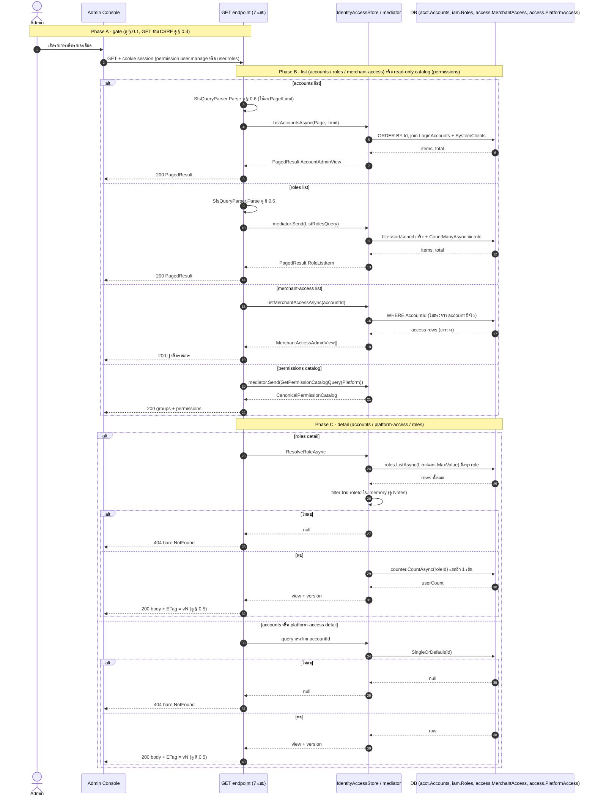
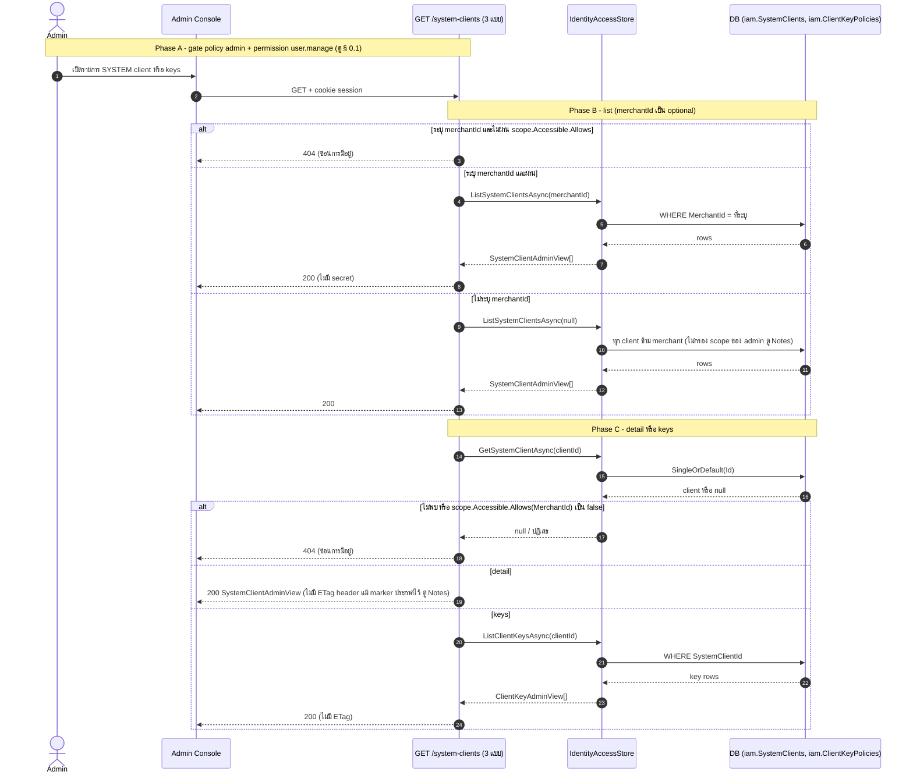
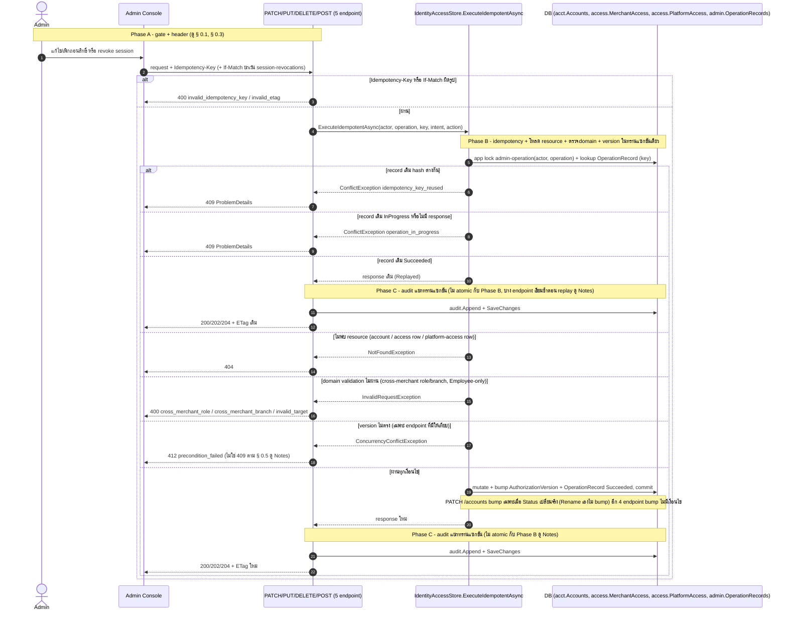
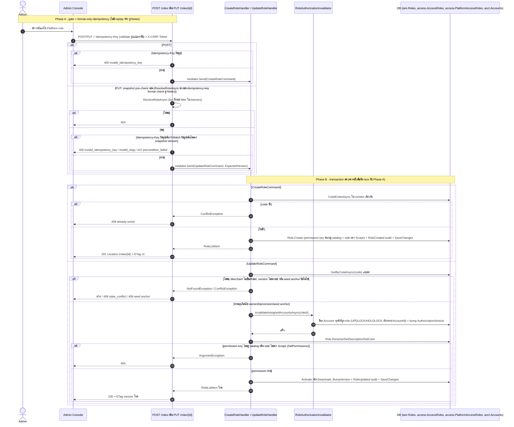
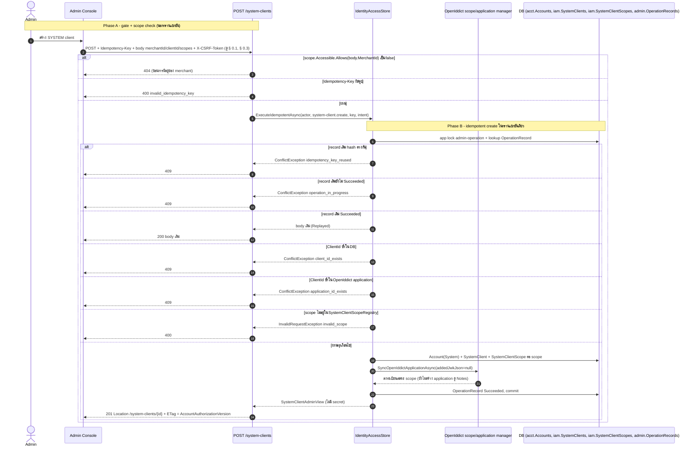
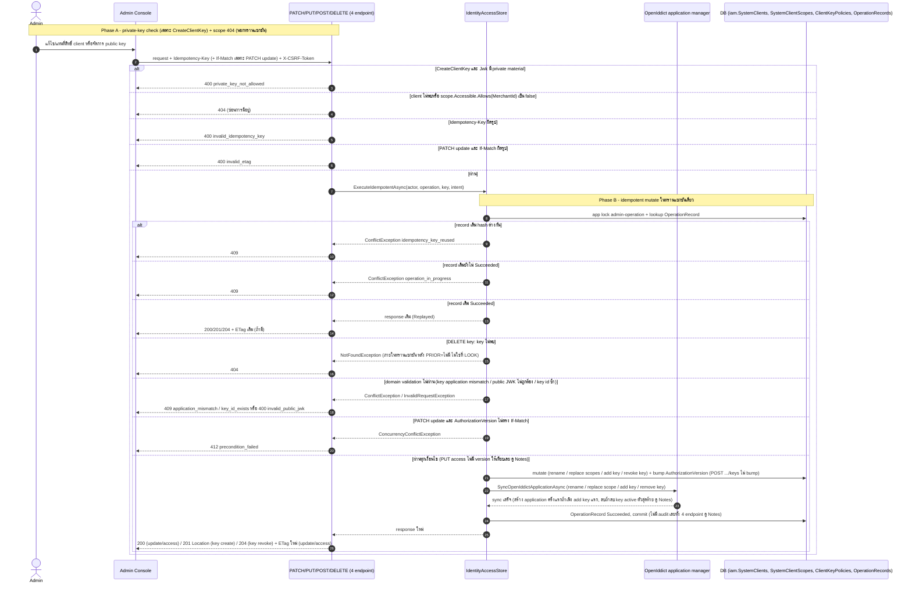

# pol-core API — Canonical access, roles และ SYSTEM clients (Sequence Diagrams)

> Source: `docs/reference/api-endpoints.md` section "Identity และ OAuth" บรรทัด L32-L40,L63-L75 พร้อม source ที่อ้างต่อ § (`src/Api/Api/IdentityAccess/CanonicalAccessEndpoints.cs`, `src/Api/Api/IdentityAccess/IdentityAccessEndpoints.cs:131-169,331-447`, `Persistence.ControlPlane/IdentityAccess/IdentityAccessStore.cs`, `Persistence.ControlPlane/Admins/AdminOperationStore.cs`, `src/Application/Modules/Iam.Application/Roles/CreateRole.cs`, `UpdateRole.cs`, `Persistence.ControlPlane/Iam/RoleAuthorizationInvalidator.cs`)
> Scope: 6 § เดียวกับ `02-canonical-access-system-clients.activities.md` (หมายเลข § ตรงกัน) แสดงลำดับข้าม actor (Admin) / API / store หรือ mediator handler / OpenIddict / DB
> Generated: 2026-09-14

| § | Diagram | Endpoints |
| --- | --- | --- |
| 2.1 | อ่านรายการ/รายละเอียดระดับ Platform | `GET /api/v1/accounts`, `GET /api/v1/accounts/{accountId:guid}`, `GET /api/v1/accounts/{accountId:guid}/merchant-access`, `GET /api/v1/accounts/{accountId:guid}/platform-access`, `GET /api/v1/permissions`, `GET /api/v1/roles`, `GET /api/v1/roles/{roleId:guid}` |
| 2.2 | อ่านรายการ/รายละเอียด SYSTEM client ภายใน merchant scope | `GET /api/v1/system-clients`, `GET /api/v1/system-clients/{clientId:guid}`, `GET /api/v1/system-clients/{clientId:guid}/keys` |
| 2.3 | แก้ไข/เพิกถอนสิทธิ์ระดับ account (idempotent executor จริง) | `PATCH /api/v1/accounts/{accountId:guid}`, `PUT /api/v1/accounts/{accountId:guid}/merchant-access/{merchantId:guid}`, `DELETE /api/v1/accounts/{accountId:guid}/merchant-access/{merchantId:guid}`, `PUT /api/v1/accounts/{accountId:guid}/platform-access`, `POST /api/v1/accounts/{accountId:guid}/session-revocations` |
| 2.4 | สร้าง/แก้ไข Platform role (ไม่มี idempotent replay จริง) | `POST /api/v1/roles`, `PUT /api/v1/roles/{roleId:guid}` |
| 2.5 | สร้าง SYSTEM client + ลงทะเบียน scope | `POST /api/v1/system-clients` |
| 2.6 | แก้ไข/แทนที่สิทธิ์ SYSTEM client และจัดการ public key | `PATCH /api/v1/system-clients/{clientId:guid}`, `PUT /api/v1/system-clients/{clientId:guid}/access`, `POST /api/v1/system-clients/{clientId:guid}/keys`, `DELETE /api/v1/system-clients/{clientId:guid}/keys/{keyId:guid}` |

---

## 2.1 อ่านรายการ/รายละเอียดระดับ Platform

ลำดับเดียวกันสำหรับทั้ง 7 endpoint: gate แล้ว list หรือ read-only catalog (Phase B) หรือ detail ผ่าน lookup ตรง/ResolveRoleAsync (Phase C) (source: `CanonicalAccessEndpoints.cs:28-93,162-226`, `IdentityAccessStore.cs:344-393`)

---

## 2.2 อ่านรายการ/รายละเอียด SYSTEM client ภายใน merchant scope

scope check ใช้ `scope.Accessible.Allows` ตอบ 404 เพื่อซ่อนการมีอยู่ (source: `IdentityAccessEndpoints.cs:134-158,331-361,409-416`)

---

## 2.3 แก้ไข/เพิกถอนสิทธิ์ระดับ account (idempotent executor จริง)

`ExecuteIdempotentAsync` ทำ lock, replay, โหลด resource, ตรวจ domain และเทียบ version ทั้งหมดในทรานแซกชันเดียว แล้ว audit เป็นรอบแยกหลังจากนั้น (source: `CanonicalAccessEndpoints.cs:120-160,242-329`, `IdentityAccessStore.cs:395-437,769-844,854-924`)

---

## 2.4 สร้าง/แก้ไข Platform role (ไม่มี idempotent replay จริง)

`Idempotency-Key` validate รูปแบบแล้วทิ้ง เพราะ POST/PUT ไปเรียก `IMediator` (ใช้ร่วมกับฝั่ง merchant-role) แทน `ExecuteIdempotentAsync` (source: `CanonicalAccessEndpoints.cs:187-226`, `CreateRole.cs`, `UpdateRole.cs`, `RoleAuthorizationInvalidator.cs`)

---

## 2.5 สร้าง SYSTEM client + ลงทะเบียน scope

`ExecuteIdempotentAsync` จริง (ต่างจาก § 2.4) แล้ว sync OpenIddict เฉพาะ scope เพราะยังไม่มี key (source: `IdentityAccessEndpoints.cs:137-141,339-352`, `IdentityAccessStore.cs:476-501,610-664`, `SystemClientScopeRegistry.cs`)

---

## 2.6 แก้ไข/แทนที่สิทธิ์ SYSTEM client และจัดการ public key

scope 404 เกิดนอกทรานแซกชัน (ต่างจาก § 2.3), If-Match ใช้จริงเฉพาะ PATCH update (source: `IdentityAccessEndpoints.cs:146-168,363-447`, `IdentityAccessStore.cs:503-609`)

---

## Notes

- Deviations ของ theme นี้อยู่ที่ `02-canonical-access-system-clients.activities.md` ไฟล์นี้ไม่ทำซ้ำ
- theme นี้ไม่มี endpoint ไหนใช้ maker-checker หรือ background outbox (§ 0.7 / § 0.8) เลย ทุกการเขียนเป็น synchronous ภายในทรานแซกชันเดียวของ request นั้น (`session-revocations` ลงท้ายคล้าย maker-checker แต่เป็น direct write ตรวจแล้วใน `IdentityAccessEndpoints.cs`/`IdentityAccessStore.cs`)
- § 2.3: ความเสี่ยง `.ContinueWith(x => x.Result.Value)` ที่อาจทำให้ 404/412 ที่ตั้งใจไว้ของ DELETE merchant-access และ POST session-revocations กลายเป็น 500 ยังไม่ยืนยันด้วย test จริง (ดูรายละเอียดเต็มใน Notes ของ activities.md)
- § 2.5/§ 2.6: OpenIddict application ผูกกับ public key ไม่ใช่กับการสร้าง client — ลำดับ POST create -> POST keys คือเส้นทางเดียวที่ทำให้ client ใหม่ issue token ได้จริง
- ` ` ไม่ได้ใช้ในไฟล์นี้เพราะชื่อ participant และข้อความบนลูกศรสั้นพอในบรรทัดเดียว

**Render**: GitHub / Obsidian / VS Code Mermaid
