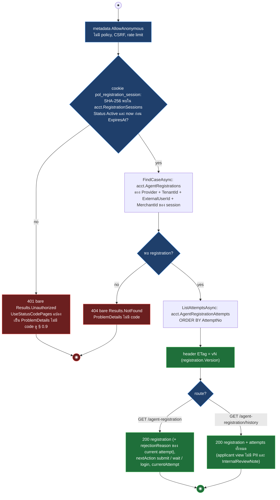
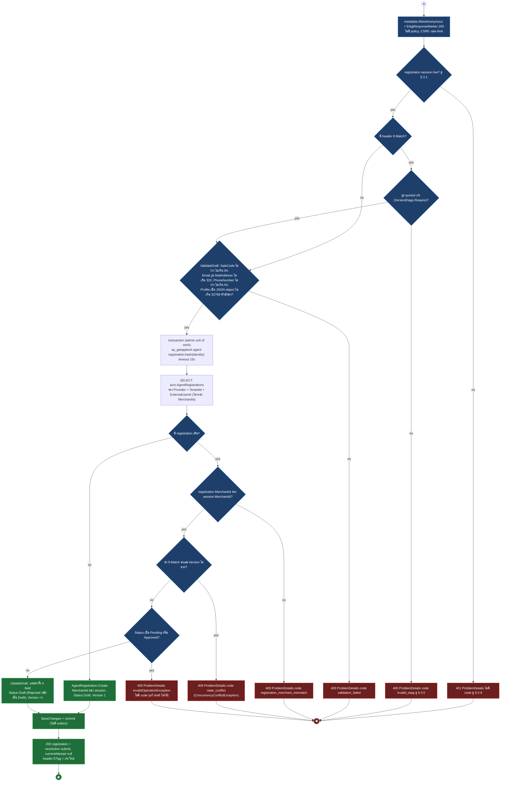
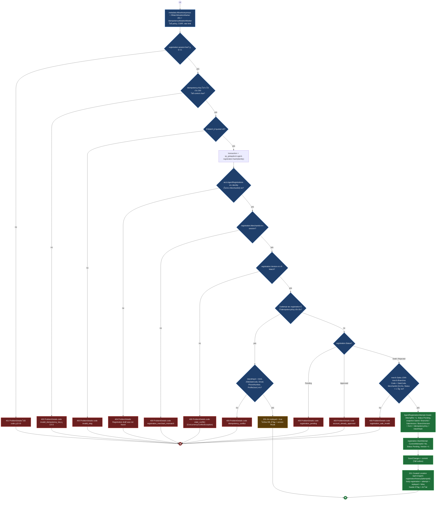
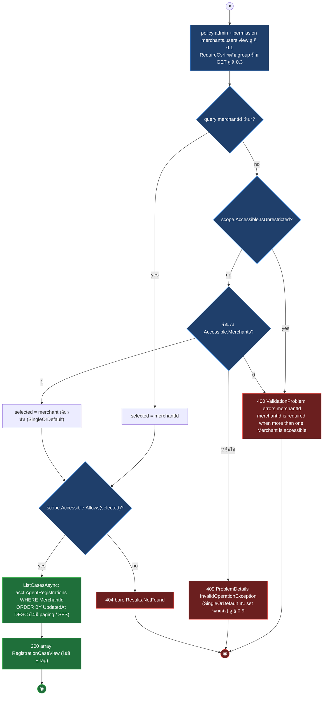
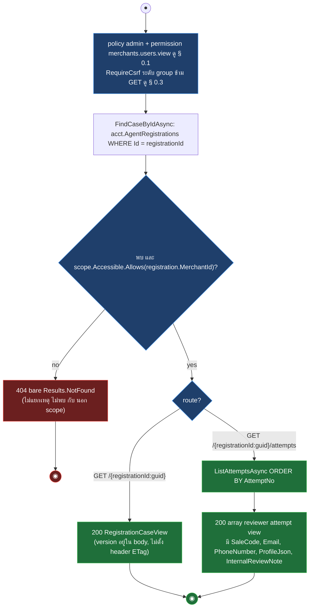
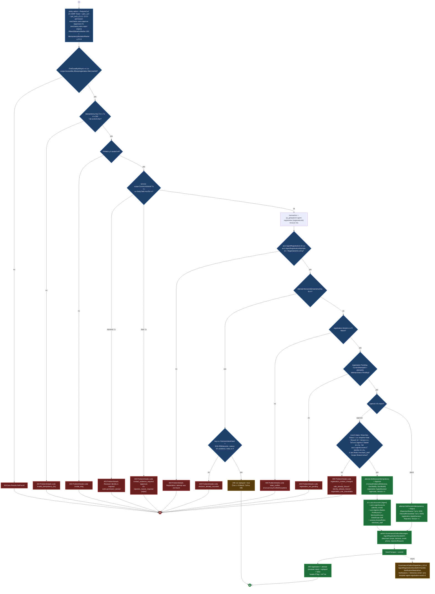

# pol-core API — Agent registration (ผู้สมัครและผู้ตรวจ) (Activity Diagrams)

> Source: `docs/reference/api-endpoints.md` section "Identity และ OAuth" บรรทัด L43–L51 และ source ที่อ้างต่อ § (`src/Api/Api/Accounts/AgentRegistrationEndpoints.cs`, `src/Application/Modules/Accounts.Application/Registration.cs`, `src/Infrastructure/Persistence/Persistence.ControlPlane/IdentityAccess/AgentRegistrationStore.cs`, `src/Domain/Modules/Accounts.Domain/RegistrationModels.cs`)
> Scope: 9 endpoints — ฝั่งผู้สมัคร 4 ตัวใต้ `/api/v1/agent-registration` (cookie `pol_registration_session`, AllowAnonymous) และฝั่งผู้ตรวจ 5 ตัวใต้ `/api/v1/agent-registrations` (policy `admin` + RequireCsrf ระดับ group)
> Generated: 2026-09-14

| § | Diagram | Endpoints |
| --- | --- | --- |
| 3.1 | ผู้สมัครอ่าน case และประวัติ attempts | `GET /api/v1/agent-registration`, `GET /api/v1/agent-registration/history` |
| 3.2 | ผู้สมัครบันทึก draft (upsert, If-Match optional) | `PUT /api/v1/agent-registration` |
| 3.3 | ผู้สมัครส่ง draft เป็น attempt (idempotent, 201) | `POST /api/v1/agent-registration/submissions` |
| 3.4 | ผู้ตรวจดูรายการ case ใน merchant scope | `GET /api/v1/agent-registrations` |
| 3.5 | ผู้ตรวจอ่าน case และ attempts ของ case | `GET /api/v1/agent-registrations/{registrationId:guid}`, `GET /api/v1/agent-registrations/{registrationId:guid}/attempts` |
| 3.6 | ผู้ตรวจตัดสิน attempt (approve / reject) | `POST /api/v1/agent-registrations/{registrationId:guid}/attempts/{attemptId:guid}/approve`, `POST /api/v1/agent-registrations/{registrationId:guid}/attempts/{attemptId:guid}/reject` |

---

## 3.1 ผู้สมัครอ่าน case และประวัติ attempts

endpoint ฝั่งผู้สมัครไม่มี policy แต่ handler resolve registration session จาก cookie เอง แล้วอ่าน case ที่ผูก identity + merchant ของ session และตั้ง ETag จาก registration.Version (source: `src/Api/Api/Accounts/AgentRegistrationEndpoints.cs:22-23,30-31,56-69,99-116,179-197`, `src/Application/Modules/Accounts.Application/Registration.cs:82-96`, `AgentRegistrationStore.cs:26-38,205-208`)

| Method | fullPath | ต่างจาก § กลางตรงไหน |
| --- | --- | --- |
| GET | `/api/v1/agent-registration` | subject: payload `registration` (rejectionReason จาก attempt ปัจจุบัน) + `nextAction` (Draft / Rejected = submit, Pending = wait, Approved = login) + `currentAttempt` (null เมื่อยังไม่เคย submit) |
| GET | `/api/v1/agent-registration/history` | payload `registration` (ไม่มี rejectionReason) + `attempts[]` ทุก attempt เรียงตาม AttemptNo ในรูป applicant view, ไม่มี nextAction, gate / 401 / 404 / ETag เหมือน subject |

---

## 3.2 ผู้สมัครบันทึก draft (upsert, If-Match optional)

PUT สร้างหรือแก้ draft ใน transaction ที่ล็อกต่อ identity ด้วย sp_getapplock, If-Match ส่งหรือไม่ก็ได้ (parse เฉพาะเมื่อมี header) และแก้ไม่ได้เมื่อ case Pending / Approved (source: `AgentRegistrationEndpoints.cs:24-26,71-81,183-184`, `Registration.cs:98-103,158-174`, `AgentRegistrationStore.cs:40-69,256-266`, `RegistrationModels.cs:59-76`, `Persistence.ControlPlane/Governance/GovernanceSqlLockManager.cs:11-24`)

---

## 3.3 ผู้สมัครส่ง draft เป็น attempt (idempotent, 201)

POST บังคับทั้ง Idempotency-Key และ If-Match (ตรวจ key ก่อน), สร้าง attempt ที่ snapshot sale / branch version ปัจจุบันจาก merch.* แล้วเปลี่ยน case เป็น Pending ใน transaction เดียว โดย key ซ้ำที่ intent เดิมตอบ 201 เดิมแบบ replay (source: `AgentRegistrationEndpoints.cs:27-29,83-97`, `Registration.cs:105-111`, `AgentRegistrationStore.cs:71-114,215-235,276-279`, `RegistrationModels.cs:78-91,178-187`, `src/Api/Api/ConcurrencyEtags.cs:18-41`)

---

## 3.4 ผู้ตรวจดูรายการ case ใน merchant scope

GET list ไม่ใช้ SFS: เลือก merchant จาก query `merchantId` หรือจาก Accessible ของ admin (auto-select เฉพาะเมื่อมี merchant เดียว) แล้วอ่านทุก case ของ merchant นั้นเรียงตาม UpdatedAt (source: `AgentRegistrationEndpoints.cs:33-39,118-131`, `AgentRegistrationStore.cs:210-213`, `src/Application/Modules/Admins.Application/Users/AccessibleMerchants.cs:8-18`)

---

## 3.5 ผู้ตรวจอ่าน case และ attempts ของ case

GET detail ตรวจ scope ด้วย MerchantId ของ case ที่พบ (ไม่พบหรือนอก scope ตอบ 404 เหมือนกัน) และไม่ตั้ง header ETag แม้ approve / reject จะต้องใช้ version (source: `AgentRegistrationEndpoints.cs:40-45,133-150`, `Registration.cs:145-156`, `AgentRegistrationStore.cs:37-38,205-208`)

| Method | fullPath | ต่างจาก § กลางตรงไหน |
| --- | --- | --- |
| GET | `/api/v1/agent-registrations/{registrationId:guid}` | subject: คืน `RegistrationCaseView` ตัวเดียว (`version` ใน body ใช้สร้าง If-Match ของ § 3.6) |
| GET | `/api/v1/agent-registrations/{registrationId:guid}/attempts` | อ่าน attempts เพิ่มหลัง scope check, คืน array reviewer view ที่มี PII และ InternalReviewNote, gate / 404 เหมือน subject |

---

## 3.6 ผู้ตรวจตัดสิน attempt (approve / reject)

approve และ reject เป็น mutate ตรง (ไม่ใช่ maker-checker): endpoint ตรวจ scope ก่อน parse header, store ล็อกต่อ registration, replay จาก DecisionIdempotencyKey ก่อนตรวจ version, approve เพิ่มการตรวจ sale / identity / role แล้วสร้าง account ชุดเต็ม และทั้งคู่เขียน GovernanceOutbox ให้ notification (source: `AgentRegistrationEndpoints.cs:46-53,152-177`, `Registration.cs:113-137,176-180`, `AgentRegistrationStore.cs:116-203,245-254,268-283`, `RegistrationModels.cs:93-102,189-237`, `src/Application/Contracts/AgentRegistrationDecidedV1.cs:23-37`)

| Method | fullPath | ต่างจาก § กลางตรงไหน |
| --- | --- | --- |
| POST | `/api/v1/agent-registrations/{registrationId:guid}/attempts/{attemptId:guid}/approve` | permission `merchants.users.approve`, body `contactEvidenceReference` (ว่าง = 400 `contact_evidence_required`, เกิน 256 = 400 ArgumentException ไม่มี code), เดิน branch approve: 4 การตรวจ 409 เพิ่ม + สร้าง Account / LoginAccount / Agent / MerchantAccess / AccessRole |
| POST | `/api/v1/agent-registrations/{registrationId:guid}/attempts/{attemptId:guid}/reject` | permission `merchants.users.reject`, body `rejectionReason` (ว่าง = 400 `rejection_reason_required`, เกิน 1000 = 400) + `internalReviewNote` optional (เกิน 4000 = 400), เดิน branch reject: ไม่มีการตรวจ sale / identity / role, เขียนเฉพาะ attempt + registration + outbox |

---

## Deviations

| fullPath | เอกสารบอก | source บอก | อ้างอิง |
| --- | --- | --- | --- |
| ไม่พบ deviation ระหว่างเอกสารกับ source | - | - | - |

## Notes

| เรื่อง | ข้อเท็จจริงจาก source | source |
| --- | --- | --- |
| ที่มาของ registration session | cookie `pol_registration_session` ออกโดย agent OIDC callback (theme อื่น) HttpOnly, Path `/`, Secure เมื่อ HTTPS, อายุ `IdentityAccess:RegistrationSessionMinutes`, ออกไม่ได้ถ้า identity เป็น workforce หรือมี approved account แล้ว (`account_already_approved`) — อยู่นอก frame ของ theme นี้ | `src/Api/Api/IdentityAccess/IdentityAccessWiring.cs:258-271`, `Accounts.Application/IdentityAccessContracts.cs:97-118` |
| session live | หา session ด้วย SHA-256 ของค่า cookie, ต้อง Status Active และ now ก่อน ExpiresAt, ไม่มี slide / rotate | `Registration.cs:82-89`, `Accounts.Domain/AccountModels.cs:486` |
| CSRF ฝั่งผู้สมัคร | PUT / POST ใต้ `/agent-registration` เป็น AllowAnonymous ไม่มี policy จึงไม่มี CSRF filter และ CsrfParity ไม่ตรวจ (ตรวจเฉพาะ endpoint ใต้ policy ที่รู้จัก) | `AgentRegistrationEndpoints.cs:22-31`, § 0.3 |
| CSRF ฝั่งผู้ตรวจ | `RequireCsrf()` ติดระดับ group `/agent-registrations` จึงมีทุก child รวม GET แต่ filter ข้าม safe method, unsafe (approve / reject) ต้องส่ง `X-CSRF-Token` | `AgentRegistrationEndpoints.cs:33-34`, § 0.3 |
| Location ของ 201 | header ชี้ `/api/v1/agent-registration/history/{attemptId}` ซึ่งไม่มี route map ไว้ (มีเฉพาะ `GET /agent-registration/history`) | `AgentRegistrationEndpoints.cs:30-31,91` |
| ETag ฝั่งผู้ตรวจ | `GET /agent-registrations/{id}` และ `/attempts` ไม่ตั้ง header ETag, client ต้องสร้าง If-Match `"vN"` จาก `version` ใน body ของ RegistrationCaseView | `AgentRegistrationEndpoints.cs:133-150`, `ConcurrencyEtags.cs:16-26` |
| merchantId ใน § 3.4 | ข้อความ validation บอก "more than one Merchant is accessible" แต่ path ที่ Accessible มี 2 merchant ขึ้นไปโดยไม่ส่ง merchantId ได้ 409 จาก `SingleOrDefault` (InvalidOperationException) ไม่ใช่ 400, 400 เกิดเมื่อ unrestricted (Super) หรือ Accessible ว่าง | `AgentRegistrationEndpoints.cs:121-126` |
| การหา case ต่างกันระหว่างอ่านกับเขียน | GET ฝั่งผู้สมัครกรอง identity + MerchantId ของ session (คนละ merchant = 404) ส่วน PUT / POST ค้น identity อย่างเดียวแล้วตอบ 409 `registration_merchant_mismatch` เมื่อ merchant ไม่ตรง | `AgentRegistrationStore.cs:31-35,48-60,79-84` |
| ลำดับ replay กับ version | approve / reject ตรวจ DecisionIdempotencyKey ก่อน EnsureVersion จึง replay 200 ได้แม้ If-Match เก่า, submit ตรวจ EnsureVersion ก่อน replay จึงต้องส่ง version ปัจจุบันเสมอ | `AgentRegistrationStore.cs:85-95,129-135,187-193` |
| applock | `sp_getapplock` Exclusive, owner Transaction, timeout 15s, ผลลบ = InvalidOperationException (409 ผ่าน § 0.9), provider ที่ไม่ใช่ SQL Server (SQLite ใน test) ข้าม lock | `GovernanceSqlLockManager.cs:11-24` |
| ขนาด field ใน domain | evidence เกิน 256, reason เกิน 1000, note เกิน 4000 โยน ArgumentException = 400 Invalid request ไม่มี code (service ตรวจเฉพาะค่าว่าง) | `RegistrationModels.cs:202-237`, § 0.9 |
| state machine ของ case | Draft / Rejected แก้ draft และ submit ได้ (Rejected กลับเป็น Draft เมื่อแก้), Pending รอตัดสิน, Approved จบ, AttemptNo ต้องต่อเนื่อง, nextAction ของ applicant = submit / wait / login | `RegistrationModels.cs:65-102`, `AgentRegistrationEndpoints.cs:186-197` |
| ไม่มี paging | ทุก list ของ theme นี้คืน array เต็ม ไม่ผ่าน SfsQueryParser (§ 0.6 ไม่เกี่ยว) | `AgentRegistrationStore.cs:205-213` |
| ปลายทางของ outbox | GovernanceOutboxDispatcher publish `AgentRegistrationDecidedV1` ให้ `AgentRegistrationDecidedV1Handler` เรียก NotificationMaterializer เขียน Notifications + NotificationInboxMessages (dedupe ด้วย SourceEventId) + Deliveries เฉพาะ channel email / sms (template `agent-registration-result.v1`) แล้ว NotificationDeliveryDispatcher ส่งต่อ (§ 0.8); channel `business_webhook` ใช้กับ event นี้ไม่ได้ เพราะ `AgentRegistrationDecidedV1` ไม่อยู่ใน webhook `SupportedEvents` whitelist ที่ create/update endpoint บังคับ (merchant ตั้ง WebhookEndpoint ให้ event นี้ไม่ได้ตั้งแต่ต้น) และไม่มี template รองรับ combination นี้เลย | `GovernanceOutboxDispatcher.cs:22-30,111-138`, `AgentRegistrationDecidedV1.cs:23-37`, `Persistence.MerchantRuntime/Notifications/NotificationMaterializer.cs:15-79`, `Persistence.ControlPlane/Notifications/DeliveryStore.cs:16-26,102-103,131-134,169-173,438-443`, `Notifications.Application/NotificationTemplates.cs:14-50` |

**Render**: GitHub / Obsidian / VS Code Mermaid
