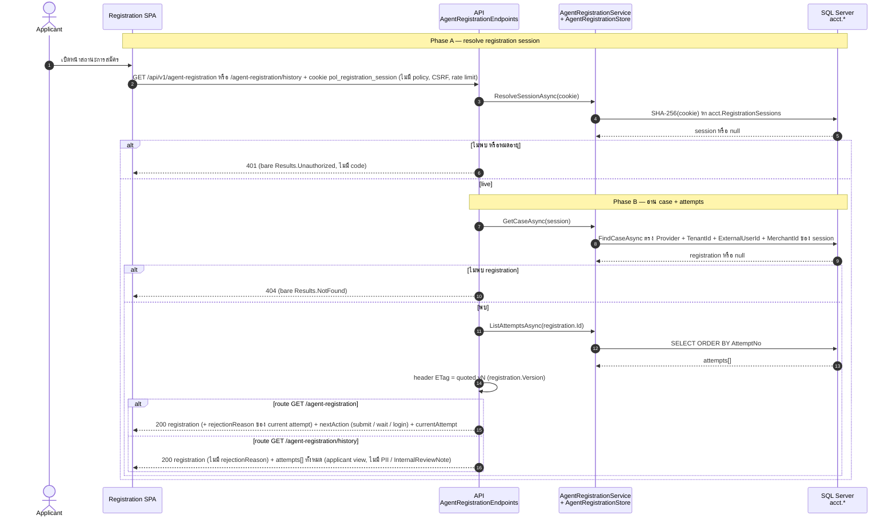
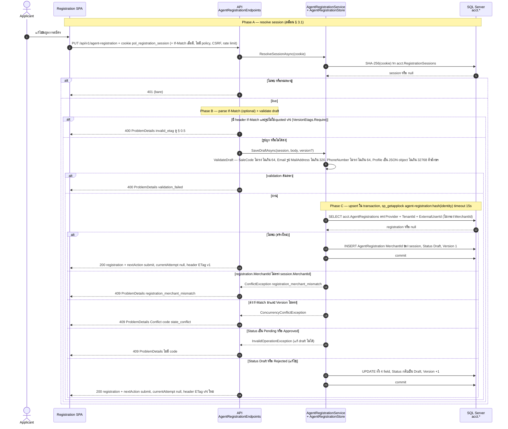
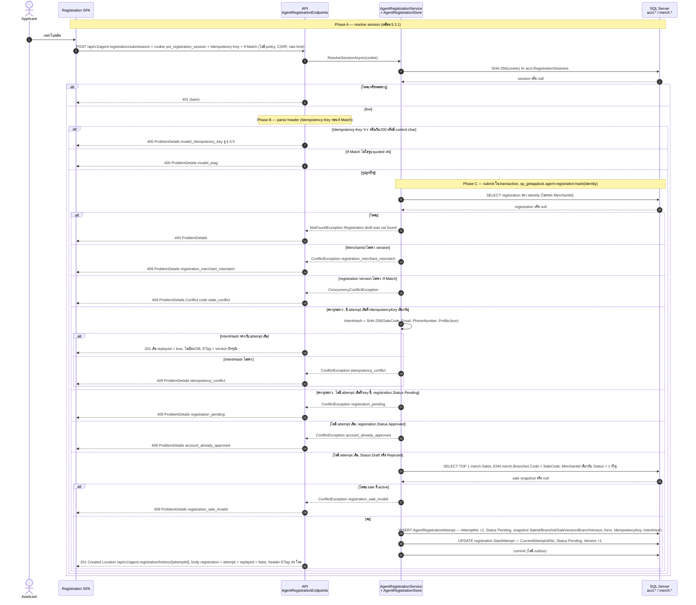
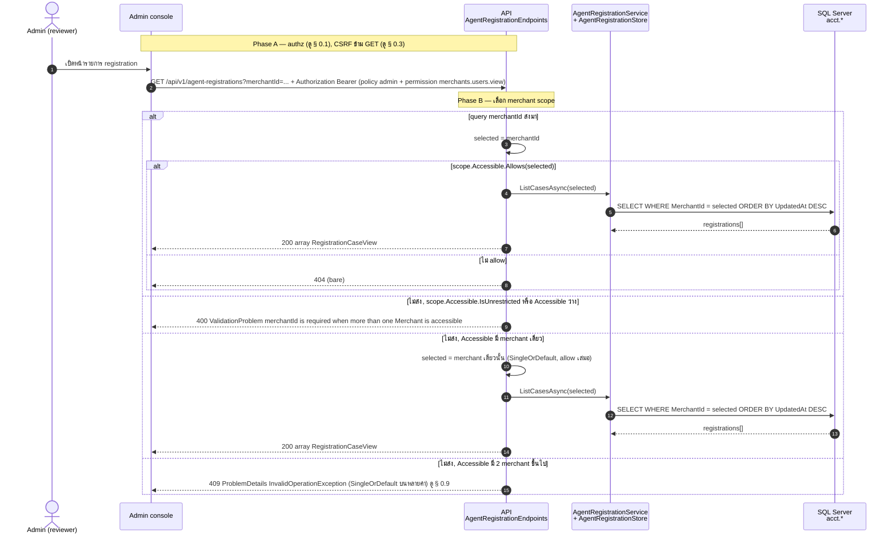
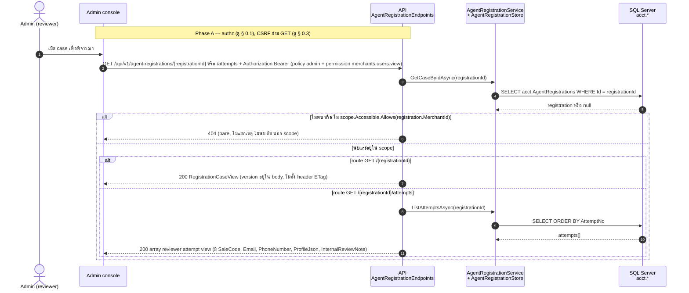
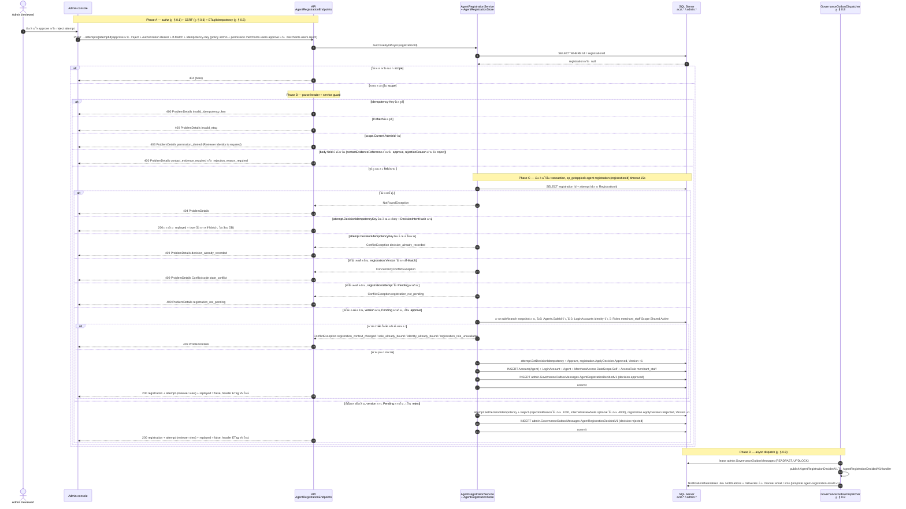

# pol-core API — Agent registration (ผู้สมัครและผู้ตรวจ) (Sequence Diagrams)

> Source: `docs/reference/api-endpoints.md` section "Identity และ OAuth" บรรทัด L43–L51 และ source ที่อ้างต่อ § (`src/Api/Api/Accounts/AgentRegistrationEndpoints.cs`, `src/Application/Modules/Accounts.Application/Registration.cs`, `src/Infrastructure/Persistence/Persistence.ControlPlane/IdentityAccess/AgentRegistrationStore.cs`, `src/Domain/Modules/Accounts.Domain/RegistrationModels.cs`, `src/Api/Api/ConcurrencyEtags.cs`, `Persistence.ControlPlane/Governance/GovernanceSqlLockManager.cs`, `Persistence.ControlPlane/Governance/GovernanceOutboxDispatcher.cs`, `src/Application/Contracts/AgentRegistrationDecidedV1.cs`)
> Scope: 9 endpoints เดียวกับ `03-agent-registration.activities.md` (หมายเลข § ตรงกัน) แสดงลำดับข้าม actor / handler / DB / async dispatcher
> Generated: 2026-09-14

| § | Diagram | Endpoints |
| --- | --- | --- |
| 3.1 | ผู้สมัครอ่าน case และประวัติ attempts | `GET /api/v1/agent-registration`, `GET /api/v1/agent-registration/history` |
| 3.2 | ผู้สมัครบันทึก draft (upsert, If-Match optional) | `PUT /api/v1/agent-registration` |
| 3.3 | ผู้สมัครส่ง draft เป็น attempt (idempotent, 201) | `POST /api/v1/agent-registration/submissions` |
| 3.4 | ผู้ตรวจดูรายการ case ใน merchant scope | `GET /api/v1/agent-registrations` |
| 3.5 | ผู้ตรวจอ่าน case และ attempts ของ case | `GET /api/v1/agent-registrations/{registrationId:guid}`, `GET /api/v1/agent-registrations/{registrationId:guid}/attempts` |
| 3.6 | ผู้ตรวจตัดสิน attempt (approve / reject) | `POST /api/v1/agent-registrations/{registrationId:guid}/attempts/{attemptId:guid}/approve`, `POST /api/v1/agent-registrations/{registrationId:guid}/attempts/{attemptId:guid}/reject` |

---

## 3.1 ผู้สมัครอ่าน case และประวัติ attempts

session resolve เป็น self-step ของ API (ไม่ผ่าน policy ของแพลตฟอร์ม) แล้ว shape ผลต่างกันตาม route ปลายทาง (source: `AgentRegistrationEndpoints.cs:22-23,30-31,56-69,99-116,179-197`, `Registration.cs:82-96`, `AgentRegistrationStore.cs:26-38,205-208`)

| Method | fullPath | ต่างจาก § กลางตรงไหน |
| --- | --- | --- |
| GET | `/api/v1/agent-registration` | subject: payload `registration` (rejectionReason จาก attempt ปัจจุบัน) + `nextAction` (Draft / Rejected = submit, Pending = wait, Approved = login) + `currentAttempt` (null เมื่อยังไม่เคย submit) |
| GET | `/api/v1/agent-registration/history` | payload `registration` (ไม่มี rejectionReason) + `attempts[]` ทุก attempt เรียงตาม AttemptNo ในรูป applicant view, ไม่มี nextAction, gate / 401 / 404 / ETag เหมือน subject |

---

## 3.2 ผู้สมัครบันทึก draft (upsert, If-Match optional)

parse If-Match เฉพาะเมื่อมี header แล้ว validate field ก่อนเข้า transaction ที่ล็อกต่อ identity ด้วย sp_getapplock (source: `AgentRegistrationEndpoints.cs:24-26,71-81,183-184`, `Registration.cs:98-103,158-174`, `AgentRegistrationStore.cs:40-69,256-266`, `RegistrationModels.cs:59-76`, `GovernanceSqlLockManager.cs:11-24`, `ConcurrencyEtags.cs:18-26`)

---

## 3.3 ผู้สมัครส่ง draft เป็น attempt (idempotent, 201)

บังคับ Idempotency-Key และ If-Match (ตรวจ key ก่อน), key ซ้ำที่ intent เดิม replay 201 เดิม, มิฉะนั้น snapshot sale/branch แล้วเปลี่ยน case เป็น Pending ใน transaction เดียว (source: `AgentRegistrationEndpoints.cs:27-29,83-97`, `Registration.cs:105-111`, `AgentRegistrationStore.cs:71-114,215-235,276-279`, `RegistrationModels.cs:78-91,178-187`, `ConcurrencyEtags.cs:18-41`)

---

## 3.4 ผู้ตรวจดูรายการ case ใน merchant scope

ไม่ใช้ SFS: เลือก merchant จาก query หรือจาก scope ของ admin ก่อนอ่านทุก case (source: `AgentRegistrationEndpoints.cs:33-39,118-131`, `AgentRegistrationStore.cs:210-213`)

---

## 3.5 ผู้ตรวจอ่าน case และ attempts ของ case

scope check ด้วย MerchantId ของ case ที่พบ, ไม่พบหรือนอก scope ตอบ 404 เหมือนกัน, ไม่ตั้ง header ETag (source: `AgentRegistrationEndpoints.cs:40-45,133-150`, `Registration.cs:145-156`, `AgentRegistrationStore.cs:37-38,205-208`)

| Method | fullPath | ต่างจาก § กลางตรงไหน |
| --- | --- | --- |
| GET | `/api/v1/agent-registrations/{registrationId:guid}` | subject: คืน `RegistrationCaseView` ตัวเดียว (`version` ใน body ใช้สร้าง If-Match ของ § 3.6) |
| GET | `/api/v1/agent-registrations/{registrationId:guid}/attempts` | อ่าน attempts เพิ่มหลัง scope check, คืน array reviewer view ที่มี PII และ InternalReviewNote, gate / 404 เหมือน subject |

---

## 3.6 ผู้ตรวจตัดสิน attempt (approve / reject)

mutate ตรง (ไม่ใช่ maker-checker): replay จาก DecisionIdempotencyKey ก่อนตรวจ version, approve เพิ่มการตรวจ sale / identity / role แล้วสร้าง account ชุดเต็ม, ทั้งคู่เขียน GovernanceOutbox ให้ notification (source: `AgentRegistrationEndpoints.cs:46-53,152-177`, `Registration.cs:113-137,176-180`, `AgentRegistrationStore.cs:116-203,245-254,268-283`, `RegistrationModels.cs:93-102,189-237`, `AgentRegistrationDecidedV1.cs:23-37`, `GovernanceOutboxDispatcher.cs:22-30,111-138`)

| Method | fullPath | ต่างจาก § กลางตรงไหน |
| --- | --- | --- |
| POST | `/api/v1/agent-registrations/{registrationId:guid}/attempts/{attemptId:guid}/approve` | permission `merchants.users.approve`, body `contactEvidenceReference` (ว่าง = 400 `contact_evidence_required`, เกิน 256 = 400 ArgumentException ไม่มี code), เดิน branch approve: 4 การตรวจ 409 เพิ่ม + สร้าง Account / LoginAccount / Agent / MerchantAccess / AccessRole |
| POST | `/api/v1/agent-registrations/{registrationId:guid}/attempts/{attemptId:guid}/reject` | permission `merchants.users.reject`, body `rejectionReason` (ว่าง = 400 `rejection_reason_required`, เกิน 1000 = 400) + `internalReviewNote` optional (เกิน 4000 = 400), เดิน branch reject: ไม่มีการตรวจ sale / identity / role, เขียนเฉพาะ attempt + registration + outbox |

---

## Notes

- Deviations ของ theme นี้อยู่ที่ `03-agent-registration.activities.md` (ไม่พบ deviation ระหว่างเอกสารกับ source) — sequences.md ไม่ทำซ้ำตาราง
- SVC ในทุก diagram รวม `AgentRegistrationService` (validation, orchestration) กับ `AgentRegistrationStore` (transaction, lock, DB) ไว้ participant เดียวเพื่อความกระชับ, รายละเอียดแยกชั้นดู source ต่อ § ใน activities.md
- § 3.6 แสดง Phase D (async) เป็น note เดียวท้าย diagram ครอบทั้ง branch approve และ reject เพราะทั้งคู่ enqueue `AgentRegistrationDecidedV1` แบบเดียวกัน, ปลายทาง Notification เต็มอยู่นอก frame ของ theme นี้ (ดู Notes ของ activities.md)
- endpoint ฝั่งผู้สมัคร (§ 3.1–3.3) ไม่มี policy หรือ CSRF filter ของแพลตฟอร์ม (AllowAnonymous, ตรวจเองด้วย registration session) จึงไม่มี arrow อ้าง § 0.1 / § 0.3 ในสามไดอะแกรมนี้

**Render**: GitHub / Obsidian / VS Code Mermaid
