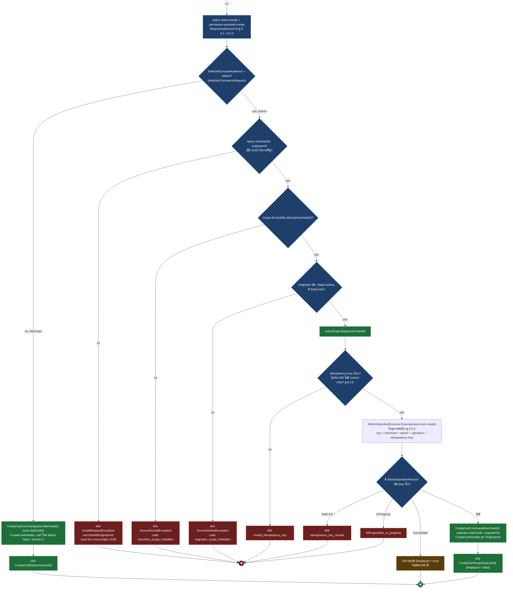
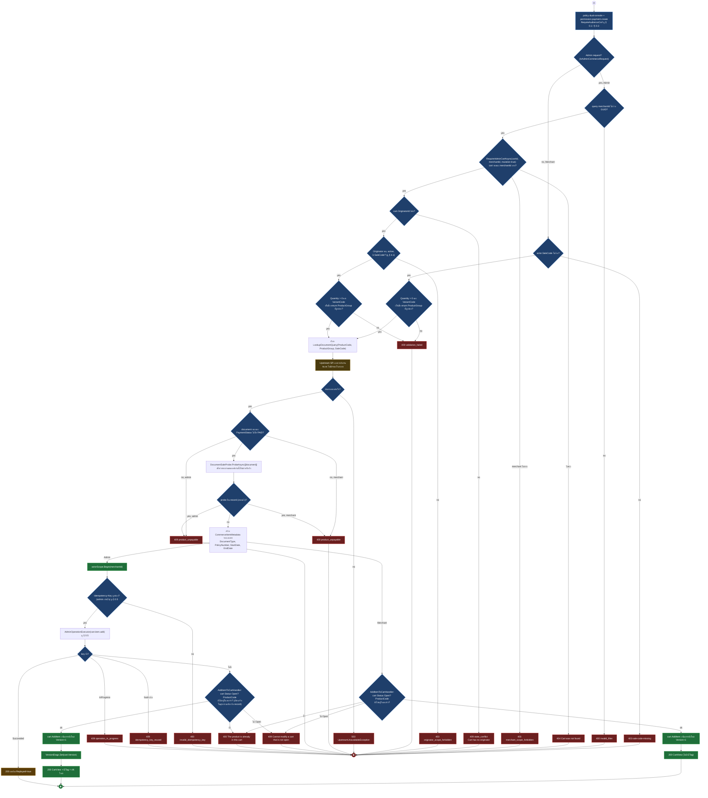
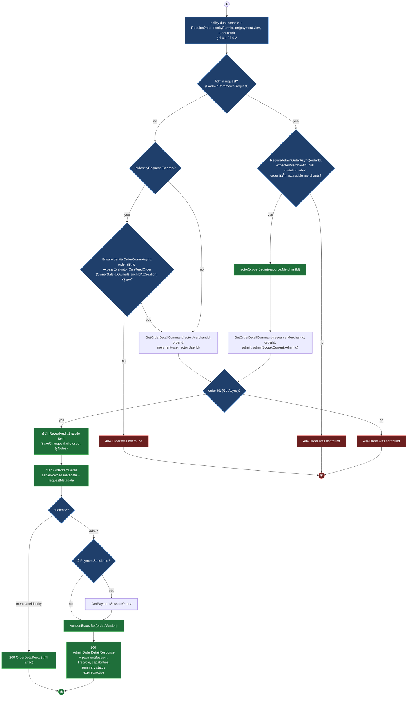
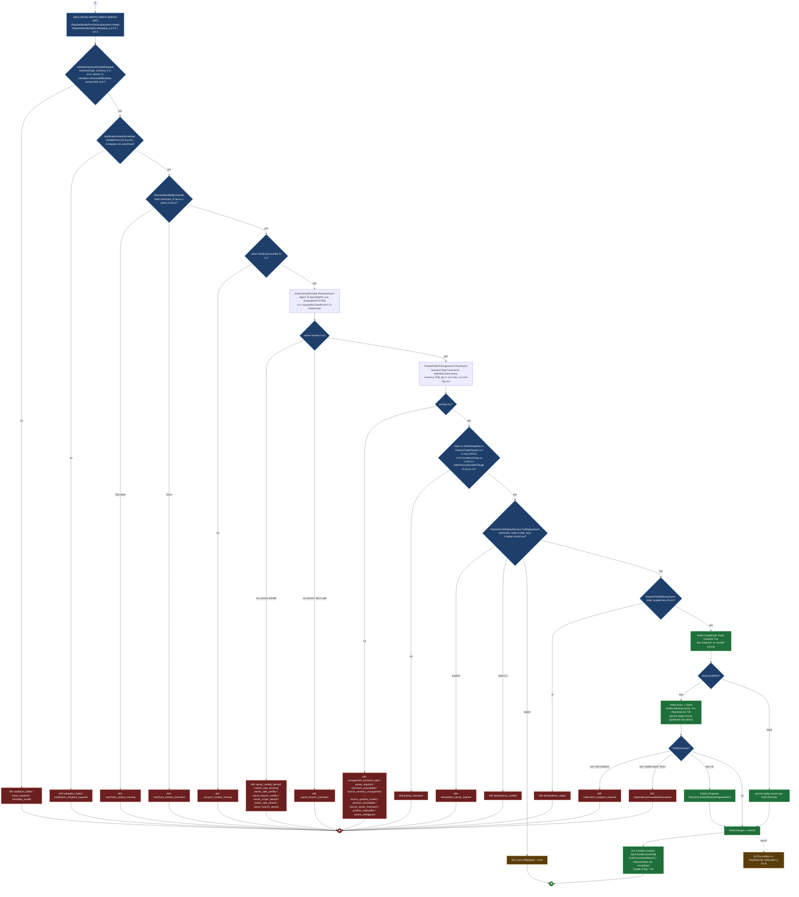
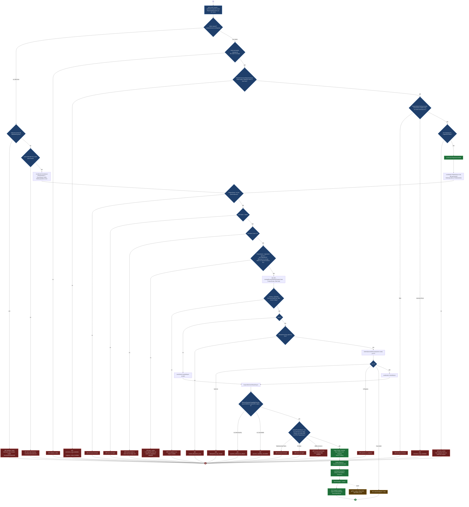
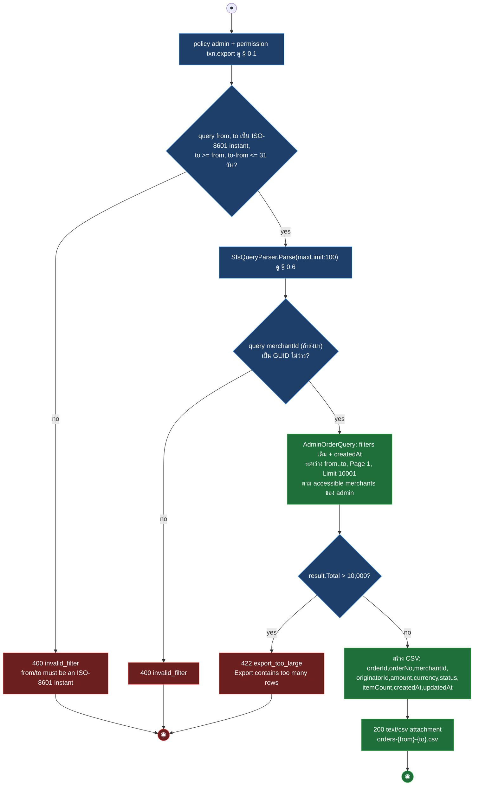
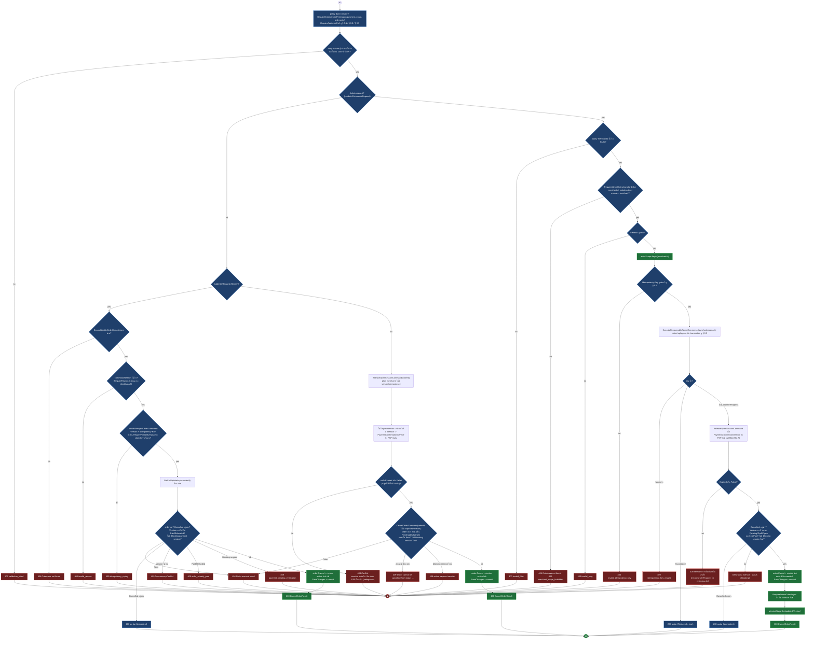
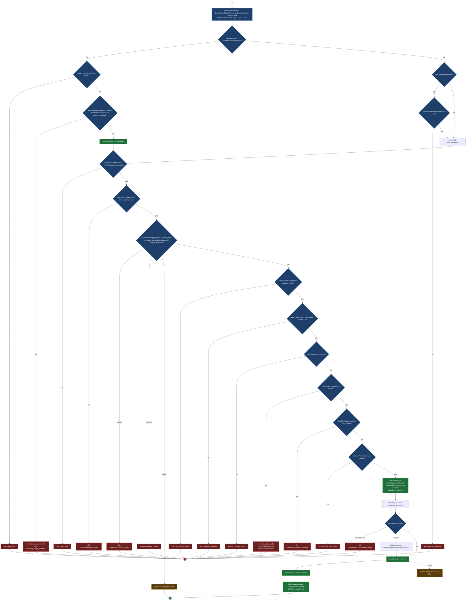
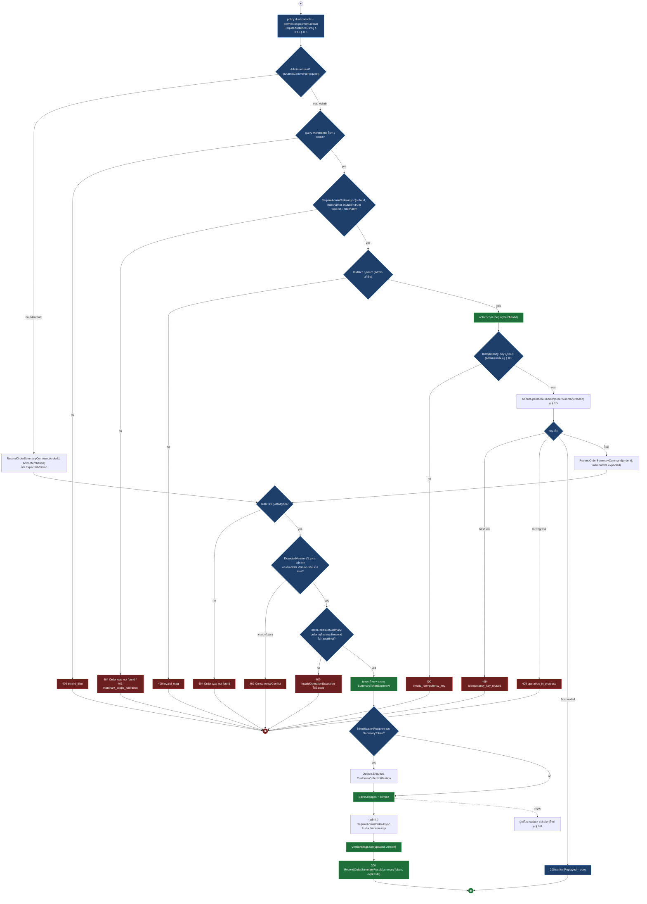
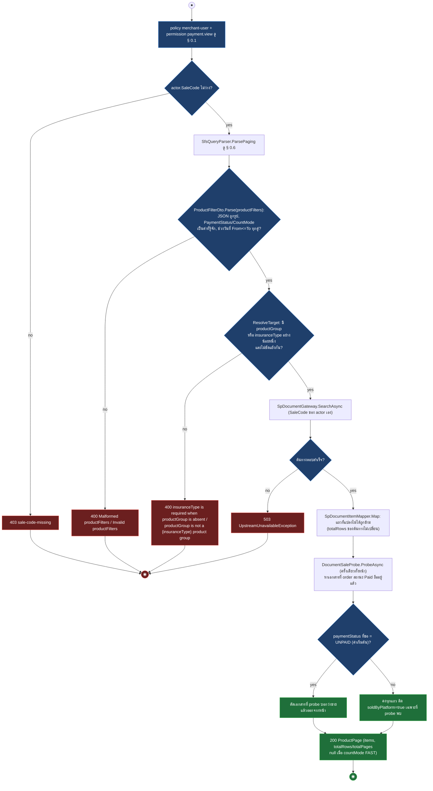

# pol-core API — Carts, products และ order lifecycle (Activity Diagrams)

> Source: `docs/reference/api-endpoints.md` section "Commerce, checkout และ orders" บรรทัด L84-L89, L95-L104, L109-L110 และ source ที่อ้างต่อ § (`src/Api/Api/Program.cs`, `src/Application/Modules/Carts.Application/*.cs`, `src/Domain/Modules/Carts.Domain/Cart.cs`, `src/Application/Modules/Orders.Application/*.cs`, `src/Api/Api/Orders/OrderCreationCoordinator.cs`, `src/Application/Modules/Products.Application/ListProducts.cs`, `src/Infrastructure/Modules/Products.Infrastructure/Orders/TrustedOrderPricingSource.cs`, `src/Infrastructure/Persistence/Persistence.ControlPlane/Orders/OrderOwnerResolver.cs`)
> Scope: 18 endpoints ของตะกร้าสินค้า คำสั่งซื้อ (canonical + compatibility) และแคตตาล็อกผลิตภัณฑ์ เกือบทุก endpoint เป็น dual-console (Admin Console ผ่าน query `merchantId`/`originatorId`, Merchant Console ผ่าน session, บาง endpoint ของ order รับ identity BFF/Bearer เพิ่ม) ยกเว้น `POST /orders` (identity-platform เท่านั้น), `GET /orders/export` (admin เท่านั้น) และ `GET /products` (merchant-user เท่านั้น)
> Generated: 2026-09-14

| § | Diagram | Endpoints |
| --- | --- | --- |
| 4.1 | เปิด/ดูตะกร้าสินค้า (dual audience) | `POST /api/v1/carts`, `GET /api/v1/carts/{cartId:guid}` |
| 4.2 | แก้ไขรายการในตะกร้า (เพิ่ม/ลบ/ปรับจำนวน/ล้าง) | `POST /api/v1/carts/{cartId:guid}/items`, `DELETE /api/v1/carts/{cartId:guid}/items/{itemId:guid}`, `PUT /api/v1/carts/{cartId:guid}/items/{itemId:guid}`, `POST /api/v1/carts/{cartId:guid}/clear` |
| 4.3 | อ่านคำสั่งซื้อ (รายละเอียด/รายการ/สถานะลิงก์) | `GET /api/v1/orders/{orderId:guid}`, `GET /api/v1/orders`, `GET /api/v1/orders/{orderId:guid}/payment-links` |
| 4.4 | สร้างคำสั่งซื้อแบบ canonical | `POST /api/v1/orders` |
| 4.5 | สร้างคำสั่งซื้อจากตะกร้า | `POST /api/v1/orders/from-cart` |
| 4.6 | ส่งออกรายการคำสั่งซื้อ | `GET /api/v1/orders/export` |
| 4.7 | ยกเลิกคำสั่งซื้อ | `POST /api/v1/orders/{orderId:guid}/cancel` |
| 4.8 | ออก/หมุน PaymentLink ของคำสั่งซื้อ | `POST /api/v1/orders/{orderId:guid}/payment-links`, `POST /api/v1/orders/{orderId:guid}/issue` |
| 4.9 | ส่งลิงก์สรุปคำสั่งซื้อซ้ำ | `POST /api/v1/orders/{orderId:guid}/summary/resend` |
| 4.10 | ผลิตภัณฑ์ (แคตตาล็อกเอกสารประกัน) | `GET /api/v1/products`, `GET /api/v1/products/documents` |

---

## 4.1 เปิด/ดูตะกร้าสินค้า

เปิดตะกร้าใหม่ (dual audience): Merchant Console สร้างทันทีด้วย session, Admin Console ต้องส่ง `merchantId`+`originatorId` แล้วผ่าน `AdminOperationExecutor` เพื่อ idempotency (source: `Program.cs:1395-1434,3719-3872`, `AdminOperationExecutor.cs:24-60`, `CreateCartHandler.cs:8-29`)

| Method | fullPath | ต่างจาก § กลางตรงไหน |
| --- | --- | --- |
| GET | `/api/v1/carts/{cartId:guid}` | permission `payment.view` (ไม่ใช่ `payment.create`), safe method จึงไม่มี CSRF ดู § 0.3, ไม่มี idempotency/If-Match; Merchant: `GetCartQuery(cartId, actor.MerchantId)` คืน `null` ทั้งกรณีไม่พบและเป็นของ merchant อื่น -> 404 `Results.NotFound` ตรง (ไม่ผ่าน exception handler) — คืนผลตรง ๆ ไม่เคยตั้ง `ETag`; Admin: ไม่ต้องส่ง query `merchantId`/`originatorId` เลย ใช้ `RequireAdminCartAsync(cartId, expectedMerchantId: null, mutation: false)` เช็คเฉพาะว่า cart อยู่ใน merchant ที่ scope เข้าถึงได้ ไม่พบ -> `NotFoundException` 404; **เฉพาะ Admin เท่านั้น** ที่ตอบ header `ETag = vN` จาก `cart.Version` เมื่อพบ (`VersionEtags.Set`) — ฝั่ง Merchant ไม่มี ETag เลย (source: `Program.cs:1491-1524`, `GetCart.cs:42-56`) |

---

## 4.2 แก้ไขรายการในตะกร้า

`AddCartItem` เป็นตัวแทน § กลาง: เดินผ่านการยืนยันเอกสารจากต้นทางสด (SP) ก่อนเขียนลงตะกร้า และ **ไม่มี** `If-Match` เลยทั้งสองด้าน; ต่างจาก remove/set-quantity/clear ที่ไม่มีขั้น lookup เอกสารแต่ (เฉพาะ Admin) บังคับ `If-Match` เสมอ (source: `Program.cs:1436-1489,1526-1630,3835-3965`, `AddItemToCartHandler.cs`, `CartEdits.cs`, `Cart.cs:58-129`)

| Method | fullPath | ต่างจาก § กลางตรงไหน |
| --- | --- | --- |
| DELETE | `/api/v1/carts/{cartId:guid}/items/{itemId:guid}` | ไม่มีขั้น document lookup/probe เลย; Merchant: `RemoveItemFromCartCommand(cartId, actor.MerchantId, itemId)` ไม่มี `ExpectedVersion` (ไม่ตรวจ ETag เลย) — cart ไม่พบ/merchant ไม่ตรง -> `InvalidOperationException` **409** (ไม่ใช่ 404), item ไม่พบ -> `NotFoundException` 404, cart ไม่ Open -> 409; Admin: ต้องส่ง `If-Match` (`RequireCartVersion`) เสมอผ่าน `AdminIfMatchMutationMarker` + `Idempotency-Key` ผ่าน `AdminOperationExecutor(cart.item.remove)`, version ไม่ตรง -> 409 `ConcurrencyConflict`; ตอบ 200 CartView + ETag ใหม่ (source: `Program.cs:1526-1560`, `CartEdits.cs:38-58`) |
| PUT | `/api/v1/carts/{cartId:guid}/items/{itemId:guid}` | โครงเดียวกับ DELETE ทุกจุด ต่างที่ตรวจ `Quantity > 0` ก่อนส่งคำสั่ง (ไม่ผ่าน -> 400 `ArgumentOutOfRangeException`) แล้วส่ง `SetCartItemQuantityCommand`; operation ของ Admin คือ `cart.item.quantity` (source: `Program.cs:1562-1597`, `CartEdits.cs:60-81`) |
| POST | `/api/v1/carts/{cartId:guid}/clear` | โครงเดียวกับ DELETE ทุกจุด ไม่มี `itemId` จึงไม่มี branch "item ไม่พบ"; ส่ง `ClearCartCommand` ลบทุกบรรทัด, operation ของ Admin คือ `cart.clear` (source: `Program.cs:1599-1630`, `CartEdits.cs:83-102`) |

---

## 4.3 อ่านคำสั่งซื้อ (รายละเอียด/รายการ/สถานะลิงก์)

`GetOrderDetail` เขียน reveal-audit ต่อ item ก่อนตอบ (fail-closed) เป็นตัวแทน § กลาง; ต่างจาก list (ไม่มี audit, ผ่าน SFS) และ payment-links (ไม่มี audit, ไม่มี Admin branch เลยในซอร์ส) (source: `GetOrderDetail.cs`, `GetOrders.cs`, `Program.cs:1100-1124,2311-2373`)

| Method | fullPath | ต่างจาก § กลางตรงไหน |
| --- | --- | --- |
| GET | `/api/v1/orders` | subject: list แบ่งหน้าแทน detail เดี่ยว ผ่าน SFS (`SfsQueryParser.Parse`, maxLimit 100) allowlist `orderNo` (eq/contains), `status` (eq/in), `paymentChannel` (eq/in), sort `createdAt`/`orderNo` ดู § 0.6; ไม่มี reveal-audit, ไม่มี ETag; Merchant -> `GetOrdersQuery` -> `PagedResult<OrderListItem>` (ไม่มี metadata); Admin -> query `merchantId` optional (guid ผิด -> 400 `invalid_filter`) -> `AdminOrderQuery` ตาม accessible merchants -> `PagedResult<AdminOrderListResponse>`; ไม่มี owner-identity check ราย order (source: `Program.cs:2184-2238`, `GetOrders.cs`) |
| GET | `/api/v1/orders/{orderId:guid}/payment-links` | subject: คืน array `PaymentLinkView` ของ order (ไม่มี raw token), ไม่มี reveal-audit, ไม่มี ETag; identity request ตรวจ owner ด้วย `EnsureIdentityOrderOwnerAsync` เหมือน § กลาง; **ไม่มี branch Admin ในซอร์สเลย** (ไม่เรียก `IsAdminCommerceRequest`) — Admin console (platform Bearer) ที่เรียก endpoint นี้จะได้ `actor.MerchantId` throw `InvalidOperationException` เพราะไม่มี `merchant_id` claim และไม่มีการ `actorScope.Begin` ในนี้ ต่างจาก sibling POST (§ 4.8) ที่จัดการ Admin ชัดเจน — ตอบ **409** ตาม § 0.9 ไม่ใช่ 404/403 (ดู Deviations) (source: `Program.cs:1049-1074`, `HttpActorContext.cs:56-58`) |

---

## 4.4 สร้างคำสั่งซื้อแบบ canonical

ใช้ trusted pricing เท่านั้น (ไม่รับราคาจาก client) มี idempotency 2 ชั้น (persisted replay + in-flight claim, ดู Notes) และแตก draft/issue-now ในธุรกรรมเดียว (source: `Program.cs:2060-2117,3766-3833`, `OrderWorkflow.cs:593-822`, `OrderOwnerResolver.cs`, `TrustedOrderPricingSource.cs`)

---

## 4.5 สร้างคำสั่งซื้อจากตะกร้า

สอง phase: `PrepareAsync` ตรวจสถานะเอกสารสดก่อนเปิด transaction, `CommitAsync` ล็อกและเขียนจริงในธุรกรรมเดียว; เฉพาะ Admin ที่มี idempotency คั่นกลาง (source: `Program.cs:2121-2182`, `OrderCreationCoordinator.cs`)

---

## 4.6 ส่งออกรายการคำสั่งซื้อ

Admin-only ต้องระบุช่วงวันที่ไม่เกิน 31 วัน แล้วส่งออกสูงสุด 10,000 แถวเป็น CSV (source: `Program.cs:2240-2308,4027-4045`)

---

## 4.7 ยกเลิกคำสั่งซื้อ

มี 3 เส้นจริง: merchant console ธรรมดา (ไม่มี version/idempotency), identity request (version+idempotency, `CancelManagedOrderCommand`), admin (version+idempotency ผ่าน `ExecuteRecoverableAdminCommerceAsync`) — ทุกเส้นปล่อย payment session ที่ค้างก่อนเสมอ โดยพิสูจน์กับ PSP ว่าไม่มีเงินเข้าได้แล้ว (source: `Program.cs:1993-2056`, `CancelOrder.cs`, `OrderWorkflow.cs:1301-1361`, `ReleaseOpenSessionHandler.cs`)

---

## 4.8 ออก/หมุน PaymentLink ของคำสั่งซื้อ

`RotatePaymentLink` เพิกถอนลิงก์ active เดิมแล้วออกใหม่ในธุรกรรมเดียว มี idempotency 2 ชั้นเหมือน § 4.4 (persisted replay + in-flight claim) และบังคับ `If-Match`/`Idempotency-Key` ทั้งสอง audience เสมอ (source: `Program.cs:1126-1177`, `OrderWorkflow.cs:928-1047`)

| Method | fullPath | ต่างจาก § กลางตรงไหน |
| --- | --- | --- |
| POST | `/api/v1/orders/{orderId:guid}/issue` | permission `payment.create (identity: order.write)` (ไม่ใช่ `checkout.write`); ไม่มีขั้น "หา active link เดิม" หรือ revoke — เป็นการออกลิงก์ **แรก**; precondition ต่างกัน: order ต้อง `Status = Draft` เท่านั้น (`Open` อยู่แล้ว -> 409 `order_already_issued`, สถานะอื่น -> 409 `order_state_conflict`); เรียก `order.Issue` (Draft -> Open) ก่อนออกลิงก์; ไม่มี `SendNotification` จาก body (ใช้ `order.NotifyOnIssue` ที่ตั้งไว้ตอนสร้างเท่านั้น); ตอบ **200** (ไม่ใช่ 201) พร้อม `OrderCommandResult`, ไม่มี `Location` header; replay operation name `order.issue` (source: `Program.cs:1179-1226`, `OrderWorkflow.cs:824-926`) |

---

## 4.9 ส่งลิงก์สรุปคำสั่งซื้อซ้ำ

หมุน token สรุปคำสั่งซื้อและต่ออายุ TTL แล้ว re-notify ลูกค้า เฉพาะ Admin ที่บังคับ `If-Match`/`Idempotency-Key` ผ่าน `AdminOperationExecutor` (source: `Program.cs:1948-1983`, `ResendOrderSummary.cs`)

---

## 4.10 ผลิตภัณฑ์ (แคตตาล็อกเอกสารประกัน)

รายการเอกสารประกันค้นสดจากต้นทาง SP ไม่มีสำเนาในระบบ; § กลางคือ Merchant Console (`ListProducts`), composed คือ Admin variant ที่ resolve `SaleCode` จาก Originator แทน `actor.SaleCode` (source: `Program.cs:1330-1391`, `ListProducts.cs`)

| Method | fullPath | ต่างจาก § กลางตรงไหน |
| --- | --- | --- |
| GET | `/api/v1/products/documents` | permission `txn.view`, policy `admin` (ไม่ใช่ `merchant-user`); ต้องส่ง query `merchantId` + `originatorId` (GUID ไม่ว่างทั้งคู่ ไม่งั้น 400 `invalid_filter`) แล้วผ่าน `RequireCommerceOriginatorAsync` (scope, active, มี SaleCode ไม่งั้น 403 `merchant_scope_forbidden`/`originator_scope_forbidden`) แทนการเช็ค `actor.SaleCode`; ใช้ `originator.SaleCode` แทน `actor.SaleCode`; ผลลัพธ์ห่อเป็น `AdminProductPage` (มี merchantId/originatorId ติดไปด้วย); ไม่มี 403 `sale-code-missing` (source: `Program.cs:1358-1391`) |

---

## Deviations

| fullPath | เอกสารบอก | source บอก | อ้างอิง |
| --- | --- | --- | --- |
| `GET /api/v1/orders/{orderId:guid}/payment-links` | policy `dual-console` (รองรับทั้ง Admin และ Merchant console เหมือน endpoint พี่น้องในกลุ่ม order) | ไม่มี branch `IsAdminCommerceRequest` เลยในซอร์ส และไม่เรียก `actorScope.Begin`; Admin console เป็น platform Bearer ที่ไม่มี claim `merchant_id` เมื่อเรียก endpoint นี้จะได้ `actor.MerchantId` throw `InvalidOperationException` — ตอบ **409** ผ่าน exception handler กลาง ไม่ใช่ผลลัพธ์ปกติของ dual-console | `src/Api/Api/Program.cs:1049-1074`, `src/Api/Api/HttpActorContext.cs:56-58`, `src/Api/BuildingBlocks.Web/ProblemDetailsExceptionHandler.cs:89-90` |

## Notes

| เรื่อง | ข้อเท็จจริงจาก source | source |
| --- | --- | --- |
| idempotency 2 ชั้นของ order.create/issue/rotate | `PaymentLinkReplayService.TryReplayAsync` เช็ค record ที่ persist แล้วก่อน (คืนผลเดิมรวม raw token ที่ protect ไว้ ตรง intent hash), ถ้าไม่มีค่อย `RequireFirstDeliveryAsync` claim key ชั่วคราวกันสองคำขอพร้อมกันชนกันก่อน record ถูกเขียน; ReplayTtl 30 นาที (หรือสั้นกว่าตามอายุ link) หมดอายุ = `idempotent_secret_expired` ต้องเริ่ม key ใหม่ — อยู่นอก frame ของ diagram | `OrderWorkflow.cs:473-591`, `OrderCommandGuards.cs` (`OrderWorkflow.cs:298-357`) |
| idempotency ชั้นเดียวของ cancel/resend/cart | `CancelManagedOrderCommand` ใช้ `RequireFirstDeliveryAsync` อย่างเดียว (ไม่มี persisted replay) เพราะผลลัพธ์ไม่มี secret ต้อง cache — ยึด idempotency ที่ domain state (`Cancelled` แล้ว = คืนผลเดิมได้เอง); `AdminOperationExecutor` (cart, resend) ใช้ record เดียวเก็บทั้ง claim และ cached response | `OrderWorkflow.cs:1330-1361`, `AdminOperationExecutor.cs:24-60` |
| cart ไม่พบ = 409 ไม่ใช่ 404 (เส้น merchant) | Merchant path ของ item mutation ไม่มีการเช็คว่า cart มีอยู่จริงก่อนส่ง command — handler เท่านั้นที่เช็คแล้ว throw `InvalidOperationException` (409 ตาม § 0.9) เมื่อ cart ไม่พบหรือเป็นของ merchant อื่น ต่างจาก Admin path ที่เช็คก่อนด้วย `RequireAdminCartAsync` แล้วได้ 404 | `CartEdits.cs:23-36`, `AddItemToCartHandler.cs:24-28` |
| currency mismatch ในตะกร้า | `Cart.EnsureCurrencyMatches` โยน `InvalidOperationException` (409) เมื่อบรรทัดใหม่คนละสกุลเงินกับบรรทัดเดิม — ไม่วาดเป็น branch เพราะทุกเอกสารในระบบตั้งราคาเป็น THB เท่านั้นจริง (ไม่เคย trigger ได้จาก endpoint เหล่านี้) | `Cart.cs:158-166` |
| `412 Precondition Failed` เป็น dead metadata | `POST /orders`, `POST /orders/{id}/issue`, `POST /orders/{id}/payment-links` ประกาศ `.ProducesProblem(StatusCodes.Status412PreconditionFailed)` แต่ไม่มี path ในโค้ด (handler หรือ `ProblemDetailsExceptionHandler`) ที่ throw หรือคืน 412 จริงสำหรับ 3 endpoint นี้ — เป็น metadata ที่ตกค้างจาก endpoint อื่น (เช่น `IdentityAccessEndpoints.cs`) ไม่ใช่ branch จริง | `Program.cs:1177,1226,2116`, `ProblemDetailsExceptionHandler.cs:71-100` |
| reveal-audit ล้มเหลว (GET order detail) | `GetOrderDetailHandler` เขียน audit ก่อน map response แบบ fail-closed — ถ้า `SaveChangesAsync` ล้ม handler throw ต่อ ไม่มี code เฉพาะ ตกไปเป็น 5xx ทั่วไปของ § 0.9 ไม่ใช่ branch ที่แยกแสดงในไดอะแกรม เพราะไม่มีเงื่อนไขให้ตัดสินใจ (fail ทุกครั้งที่ save ล้ม) | `GetOrderDetail.cs:53-64` |
| PSP confirmation ของ cancel | `ReleaseOpenSessionHandler` เรียก `PaymentConfirmationService.ConfirmAsync` ซึ่งเป็นกลไกร่วมกับ theme checkout/payment (นอก scopeไฟล์นี้); เอกสารนี้แสดงเฉพาะผลลัพธ์สองทาง (Expired/Failed = ปล่อยได้, อื่น ๆ/เรียกไม่สำเร็จ = 409) ที่ cancel ต้องใช้ | `ReleaseOpenSessionHandler.cs` |
| paging ของ products | `GET /products` และ `/products/documents` ใช้ `SfsQueryParser.ParsePaging` (page/limit เท่านั้น, clamp ไม่ 400) ไม่ใช่ `SfsQueryParser.Parse` เต็มรูป (ไม่มี filters/sort/search) ตรงกับ variant ที่ระบุไว้แล้วใน § 0.6 | `Program.cs:1336,1369`, `00-cross-cutting §0.6` |

**Render**: GitHub / Obsidian / VS Code Mermaid
