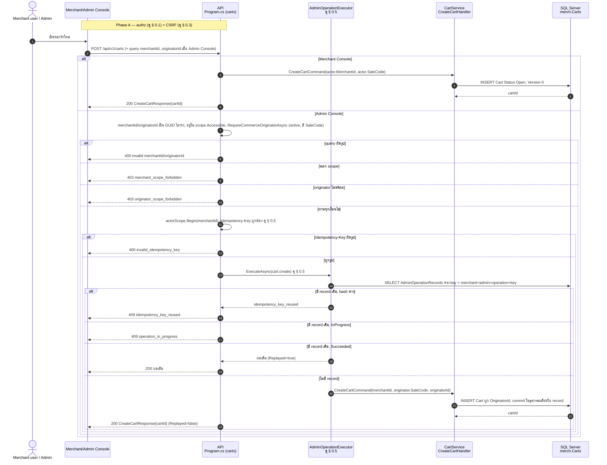
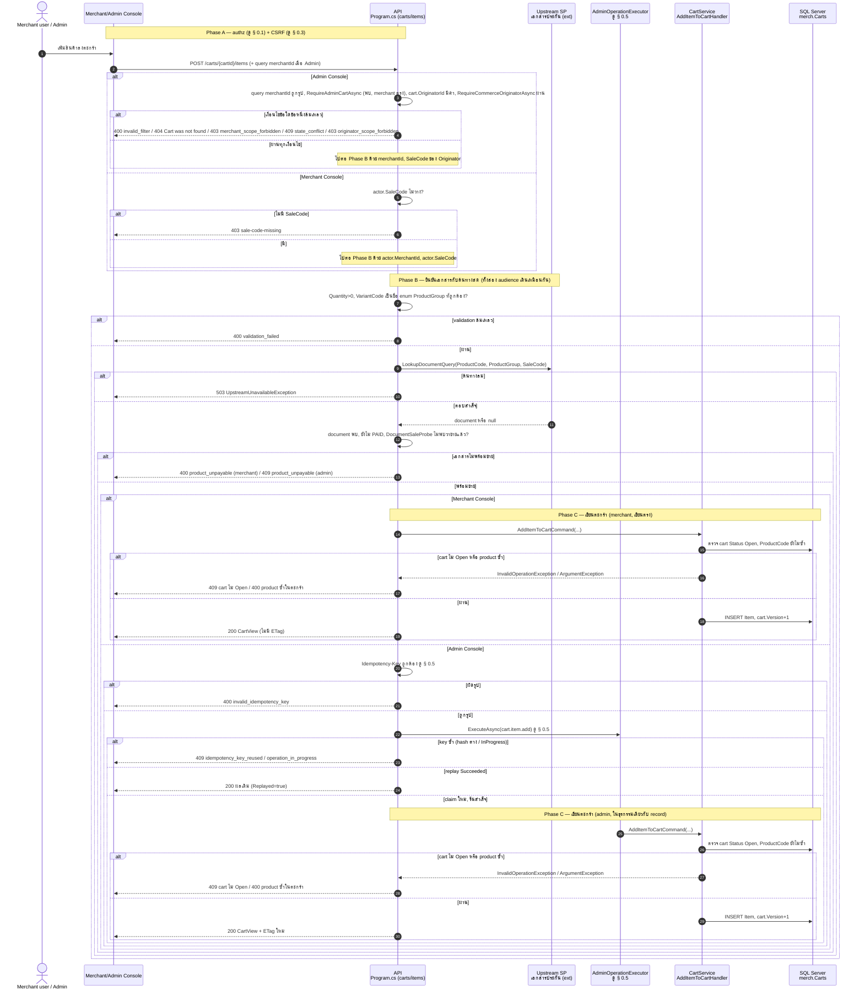
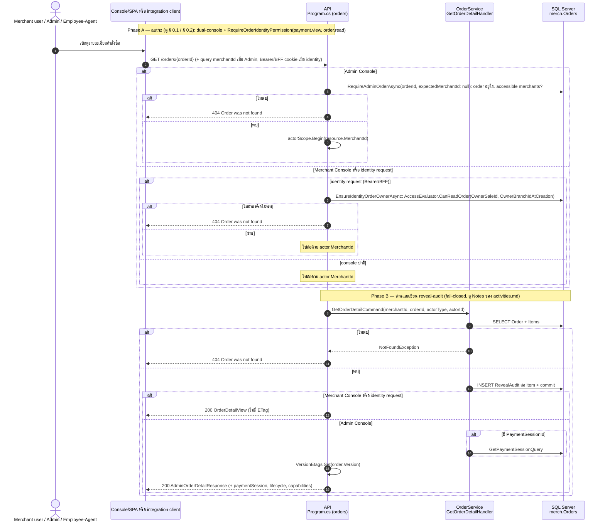
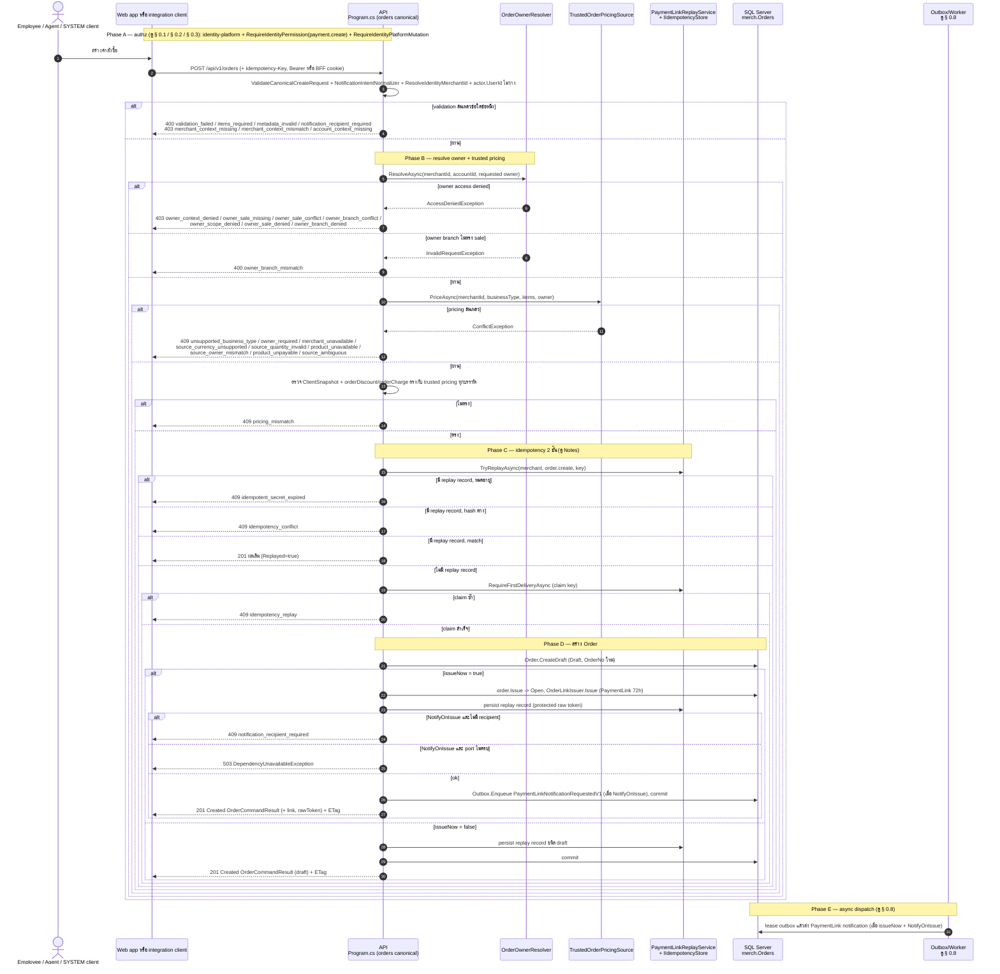
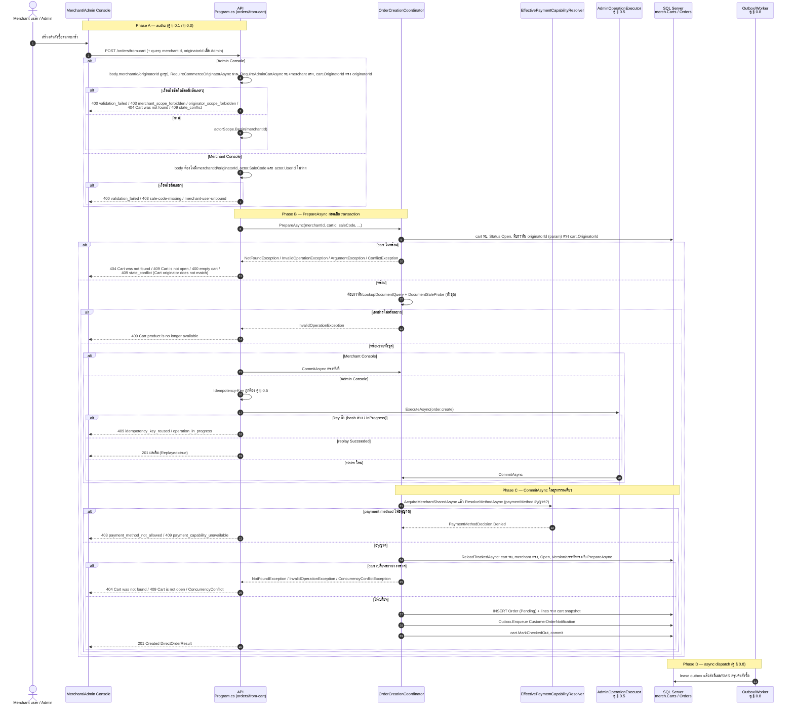
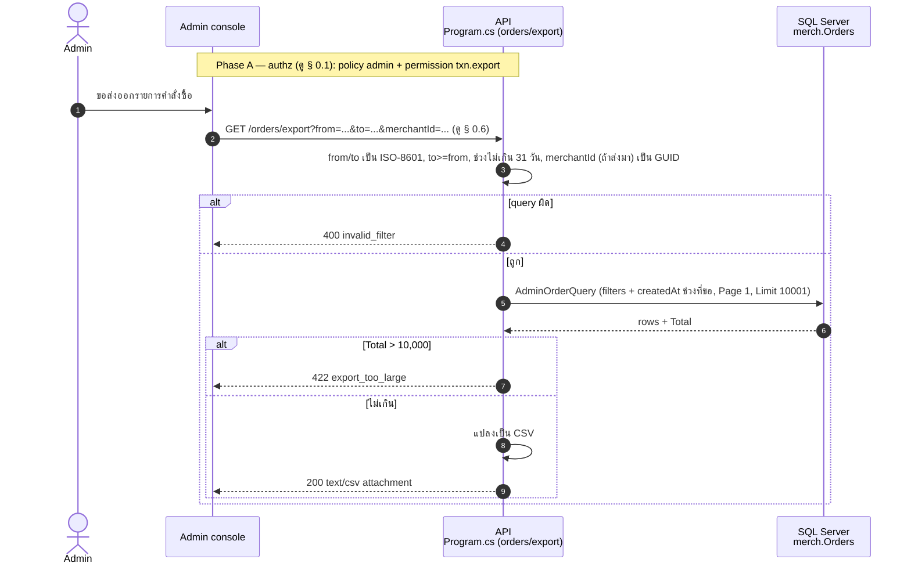
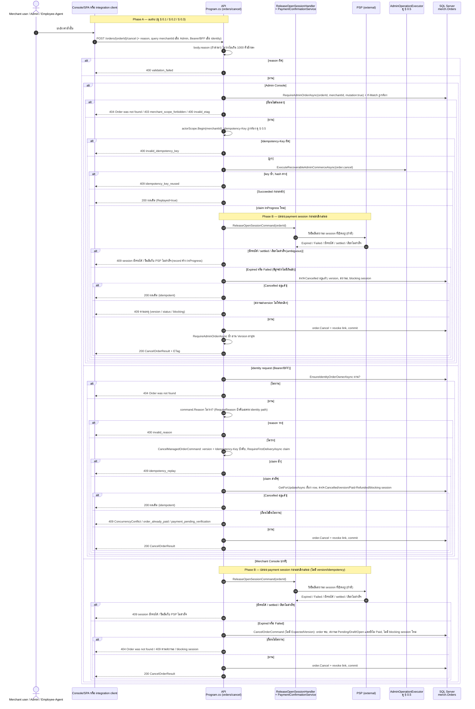
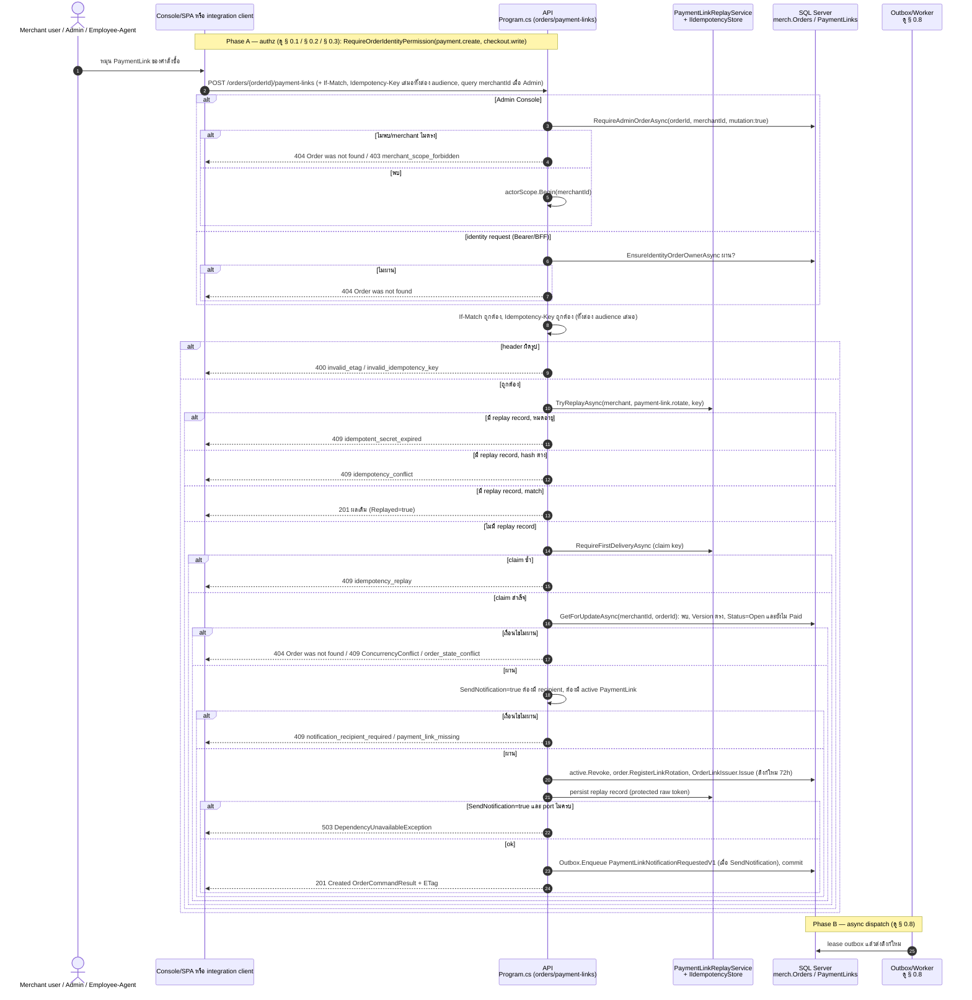
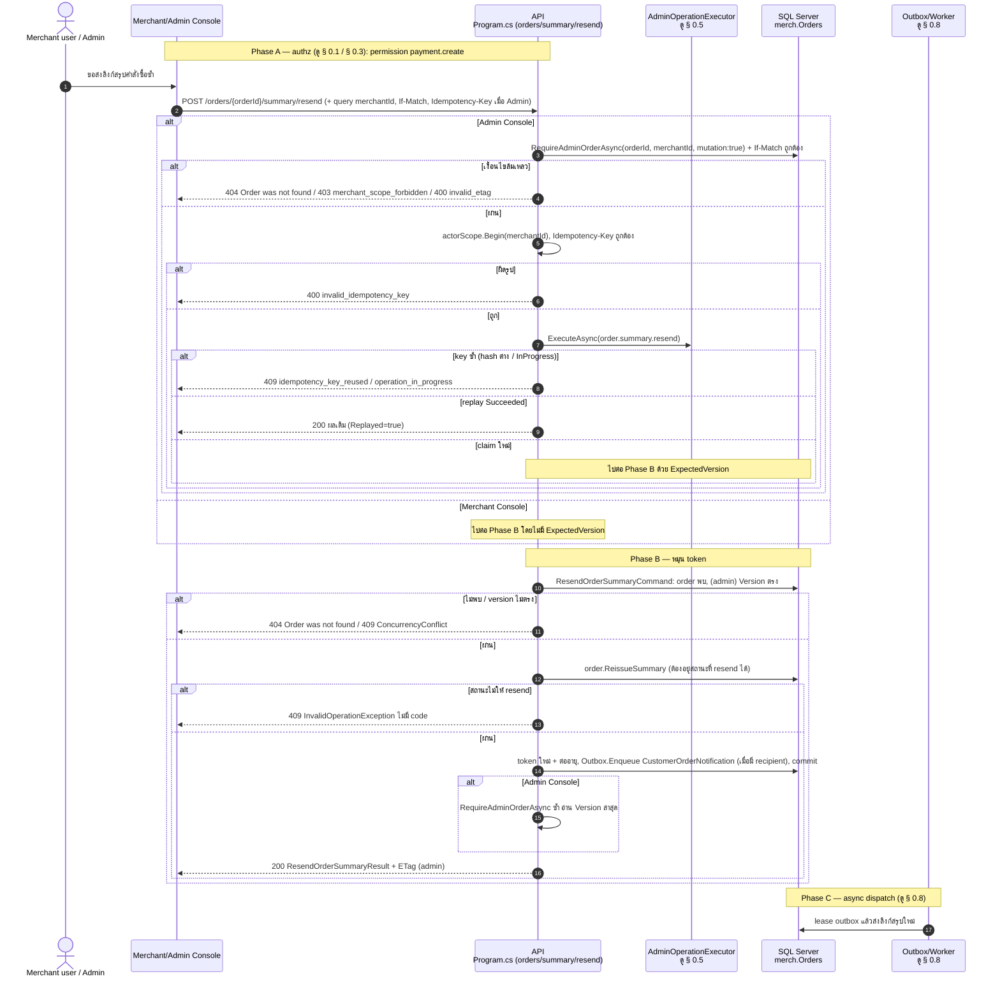
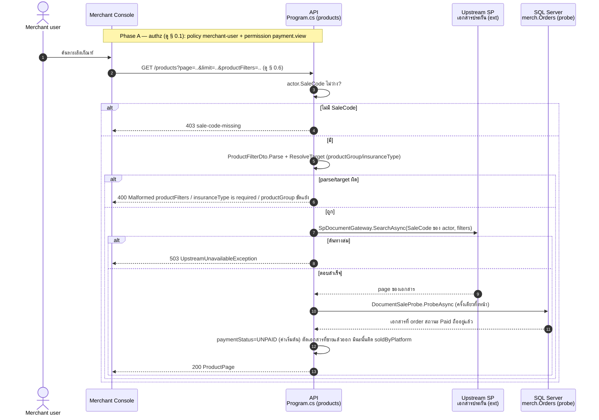

# pol-core API — Carts, products และ order lifecycle (Sequence Diagrams)

> Source: `docs/reference/api-endpoints.md` section "Commerce, checkout และ orders" บรรทัด L84-L89, L95-L104, L109-L110 และ source ที่อ้างต่อ § (`src/Api/Api/Program.cs`, `src/Application/Modules/Carts.Application/*.cs`, `src/Domain/Modules/Carts.Domain/Cart.cs`, `src/Application/Modules/Orders.Application/*.cs`, `src/Api/Api/Orders/OrderCreationCoordinator.cs`, `src/Application/Modules/Products.Application/ListProducts.cs`)
> Scope: 18 endpoints เดียวกับ `04-carts-products-orders.activities.md` (หมายเลข § ตรงกัน) แสดงลำดับข้าม actor / API / service / DB / PSP / async worker
> Generated: 2026-09-14

| § | Diagram | Endpoints |
| --- | --- | --- |
| 4.1 | เปิด/ดูตะกร้าสินค้า (dual audience) | `POST /api/v1/carts`, `GET /api/v1/carts/{cartId:guid}` |
| 4.2 | แก้ไขรายการในตะกร้า (เพิ่ม/ลบ/ปรับจำนวน/ล้าง) | `POST /api/v1/carts/{cartId:guid}/items`, `DELETE /api/v1/carts/{cartId:guid}/items/{itemId:guid}`, `PUT /api/v1/carts/{cartId:guid}/items/{itemId:guid}`, `POST /api/v1/carts/{cartId:guid}/clear` |
| 4.3 | อ่านคำสั่งซื้อ (รายละเอียด/รายการ/สถานะลิงก์) | `GET /api/v1/orders/{orderId:guid}`, `GET /api/v1/orders`, `GET /api/v1/orders/{orderId:guid}/payment-links` |
| 4.4 | สร้างคำสั่งซื้อแบบ canonical | `POST /api/v1/orders` |
| 4.5 | สร้างคำสั่งซื้อจากตะกร้า | `POST /api/v1/orders/from-cart` |
| 4.6 | ส่งออกรายการคำสั่งซื้อ | `GET /api/v1/orders/export` |
| 4.7 | ยกเลิกคำสั่งซื้อ | `POST /api/v1/orders/{orderId:guid}/cancel` |
| 4.8 | ออก/หมุน PaymentLink ของคำสั่งซื้อ | `POST /api/v1/orders/{orderId:guid}/payment-links`, `POST /api/v1/orders/{orderId:guid}/issue` |
| 4.9 | ส่งลิงก์สรุปคำสั่งซื้อซ้ำ | `POST /api/v1/orders/{orderId:guid}/summary/resend` |
| 4.10 | ผลิตภัณฑ์ (แคตตาล็อกเอกสารประกัน) | `GET /api/v1/products`, `GET /api/v1/products/documents` |

---

## 4.1 เปิด/ดูตะกร้าสินค้า

Merchant Console สร้างตะกร้าทันที ส่วน Admin Console ต้องผ่าน originator + idempotency (source: `Program.cs:1395-1434,3719-3872`, `AdminOperationExecutor.cs:24-60`, `CreateCartHandler.cs:8-29`)

| Method | fullPath | ต่างจาก § กลางตรงไหน |
| --- | --- | --- |
| GET | `/api/v1/carts/{cartId:guid}` | permission `payment.view`, ไม่มี CSRF (safe method), ไม่มี idempotency/If-Match; Merchant: `GetCartQuery` คืน `null` ทั้งไม่พบและเป็นของ merchant อื่น -> 404 ตรง (คืนผลตรง ไม่เคยตั้ง ETag); Admin: ไม่ต้องส่ง query `merchantId`/`originatorId`, ใช้ `RequireAdminCartAsync(expectedMerchantId: null)`; **เฉพาะ Admin เท่านั้น** ที่ตอบ `ETag = vN` เมื่อพบ (`VersionEtags.Set`) — ฝั่ง Merchant ไม่มี ETag เลย (source: `Program.cs:1491-1524`) |

---

## 4.2 แก้ไขรายการในตะกร้า

`AddCartItem` เดินผ่านการยืนยันเอกสารจากต้นทางสด (SP) ก่อนเขียน; remove/set-quantity/clear ไม่มีขั้นนี้แต่ (เฉพาะ Admin) บังคับ `If-Match` เสมอ (source: `Program.cs:1436-1489,1526-1630`, `AddItemToCartHandler.cs`, `CartEdits.cs`)

| Method | fullPath | ต่างจาก § กลางตรงไหน |
| --- | --- | --- |
| DELETE | `/api/v1/carts/{cartId:guid}/items/{itemId:guid}` | ไม่มีขั้น document lookup/probe; Merchant: `RemoveItemFromCartCommand` ไม่มี `ExpectedVersion` เลย — cart ไม่พบ/merchant ไม่ตรง -> `InvalidOperationException` **409** (ไม่ใช่ 404), item ไม่พบ -> 404; Admin: บังคับ `If-Match` + `Idempotency-Key` เสมอผ่าน `AdminOperationExecutor(cart.item.remove)` (source: `CartEdits.cs:38-58`) |
| PUT | `/api/v1/carts/{cartId:guid}/items/{itemId:guid}` | โครงเดียวกับ DELETE ต่างที่ตรวจ `Quantity > 0` ก่อน (ไม่ผ่าน -> 400) แล้วส่ง `SetCartItemQuantityCommand`, operation ของ Admin คือ `cart.item.quantity` |
| POST | `/api/v1/carts/{cartId:guid}/clear` | โครงเดียวกับ DELETE ไม่มี `itemId` จึงไม่มี branch "item ไม่พบ", operation ของ Admin คือ `cart.clear` |

---

## 4.3 อ่านคำสั่งซื้อ (รายละเอียด/รายการ/สถานะลิงก์)

`GetOrderDetail` เขียน reveal-audit ต่อ item ก่อนตอบ (fail-closed) เป็นตัวแทน § กลาง (source: `GetOrderDetail.cs`, `Program.cs:1100-1124,2311-2373`)

| Method | fullPath | ต่างจาก § กลางตรงไหน |
| --- | --- | --- |
| GET | `/api/v1/orders` | list แบ่งหน้าแทน detail เดี่ยว ผ่าน SFS (`SfsQueryParser.Parse`, maxLimit 100) ดู § 0.6; ไม่มี reveal-audit, ไม่มี ETag; Merchant -> `GetOrdersQuery`, Admin -> `AdminOrderQuery` ตาม accessible merchants (source: `GetOrders.cs`) |
| GET | `/api/v1/orders/{orderId:guid}/payment-links` | คืน array `PaymentLinkView` (ไม่มี raw token), ไม่มี audit/ETag; identity request ตรวจ owner เหมือน § กลาง; **ไม่มี branch Admin ในซอร์สเลย** — Admin console (cookie ล้วน) ที่เรียกจะได้ `actor.MerchantId` throw แล้วตอบ **409** ตาม § 0.9 (ดู Deviations ของ activities.md) |

---

## 4.4 สร้างคำสั่งซื้อแบบ canonical

ใช้ trusted pricing เท่านั้น มี idempotency 2 ชั้น (persisted replay + in-flight claim) และแตก draft/issue-now ในธุรกรรมเดียว (source: `Program.cs:2060-2117`, `OrderWorkflow.cs:593-822`, `OrderOwnerResolver.cs`, `TrustedOrderPricingSource.cs`)

---

## 4.5 สร้างคำสั่งซื้อจากตะกร้า

สอง phase: `PrepareAsync` ตรวจสถานะเอกสารสดก่อนเปิด transaction, `CommitAsync` ล็อกและเขียนจริงในธุรกรรมเดียว (source: `Program.cs:2121-2182`, `OrderCreationCoordinator.cs`)

---

## 4.6 ส่งออกรายการคำสั่งซื้อ

Admin-only ต้องระบุช่วงวันที่ไม่เกิน 31 วัน แล้วส่งออกสูงสุด 10,000 แถวเป็น CSV (source: `Program.cs:2240-2308,4027-4045`)

---

## 4.7 ยกเลิกคำสั่งซื้อ

3 เส้นจริง: merchant console ธรรมดา, identity request, admin — ทุกเส้นปล่อย payment session ที่ค้างก่อนเสมอโดยพิสูจน์กับ PSP ว่าไม่มีเงินเข้าได้แล้ว (source: `Program.cs:1993-2056`, `CancelOrder.cs`, `OrderWorkflow.cs:1301-1361`, `ReleaseOpenSessionHandler.cs`)

---

## 4.8 ออก/หมุน PaymentLink ของคำสั่งซื้อ

`RotatePaymentLink` เพิกถอนลิงก์ active เดิมแล้วออกใหม่ในธุรกรรมเดียว มี idempotency 2 ชั้นเหมือน § 4.4 และบังคับ `If-Match`/`Idempotency-Key` ทั้งสอง audience เสมอ (source: `Program.cs:1126-1177`, `OrderWorkflow.cs:928-1047`)

| Method | fullPath | ต่างจาก § กลางตรงไหน |
| --- | --- | --- |
| POST | `/api/v1/orders/{orderId:guid}/issue` | permission `payment.create (identity: order.write)`; ไม่มีขั้นหา active link เดิม/revoke — ออกลิงก์ **แรก**; precondition: order ต้อง `Status = Draft` เท่านั้น (`Open` -> 409 `order_already_issued`); เรียก `order.Issue` (Draft -> Open) ก่อนออกลิงก์; ไม่มี `SendNotification` จาก body; ตอบ **200** (ไม่ใช่ 201), ไม่มี `Location`; replay operation name `order.issue` (source: `Program.cs:1179-1226`, `OrderWorkflow.cs:824-926`) |

---

## 4.9 ส่งลิงก์สรุปคำสั่งซื้อซ้ำ

หมุน token สรุปคำสั่งซื้อและต่ออายุ TTL แล้ว re-notify ลูกค้า เฉพาะ Admin ที่บังคับ `If-Match`/`Idempotency-Key` (source: `Program.cs:1948-1983`, `ResendOrderSummary.cs`)

---

## 4.10 ผลิตภัณฑ์ (แคตตาล็อกเอกสารประกัน)

ค้นสดจากต้นทาง SP ไม่มีสำเนาในระบบ; § กลางคือ Merchant Console (source: `Program.cs:1330-1391`, `ListProducts.cs`)

| Method | fullPath | ต่างจาก § กลางตรงไหน |
| --- | --- | --- |
| GET | `/api/v1/products/documents` | permission `txn.view`, policy `admin`; ต้องส่ง query `merchantId` + `originatorId` แล้วผ่าน `RequireCommerceOriginatorAsync` แทนการเช็ค `actor.SaleCode`; ใช้ `originator.SaleCode`; ผลลัพธ์ห่อเป็น `AdminProductPage`; ไม่มี 403 `sale-code-missing` (source: `Program.cs:1358-1391`) |

---

## Notes

- Deviations ของ theme นี้อยู่ที่ `04-carts-products-orders.activities.md` (มี 1 รายการ: `GET /orders/{orderId}/payment-links` ไม่มี branch Admin ในซอร์ส) — sequences.md ไม่ทำซ้ำตาราง
- ทุก diagram ย่อ handler + store ของแต่ละ module ไว้ใน participant เดียว (เช่น `CartService`, `OrderService`) เพื่อความกระชับ รายละเอียด method/file แยกชั้นดู source ต่อ § ใน activities.md
- `EXE` (`AdminOperationExecutor`) และ `REPLAY` (`PaymentLinkReplayService` + `IIdempotencyStore`) เป็นกลไก idempotency คนละแบบกัน — ดู § 0.5 ของ cross-cutting และ Notes ของ activities.md สำหรับความต่าง
- `OB` (Outbox/Worker) วาดเป็น note บรรทัดเดียวปิดท้ายแต่ละ diagram ที่มี enqueue จริง (§ 4.4, 4.5, 4.8, 4.9) ปลายทาง dispatcher เต็มอยู่ที่ § 0.8 ของ cross-cutting ไม่ใช่ scope ของ theme นี้
- § 4.6 (export) และ § 4.10 (products) ไม่มี CSRF arrow เพราะเป็น GET (safe method) ดู § 0.3
- checker `check-mermaid.mjs` ในเครื่องนี้ผ่าน `OK` ครบ 10/10 block ของไฟล์นี้ (`sequenceDiagram`); แต่ error `purify.addHook is not a function` กับทุก block `flowchart TD` ใน `04-carts-products-orders.activities.md` (ยืนยันซ้ำหลังแก้ must-issue แล้วยัง FAIL เท่าเดิม) — เป็นปัญหา dependency ของ `mmdc`/`dompurify` ที่กระทบเฉพาะ flowchart parser ในเครื่องนี้ ไม่ใช่ syntax error ของเนื้อหา รอผู้ดูแล pipeline ซ่อม dependency แล้วรัน checker ซ้ำ

**Render**: GitHub / Obsidian / VS Code Mermaid
