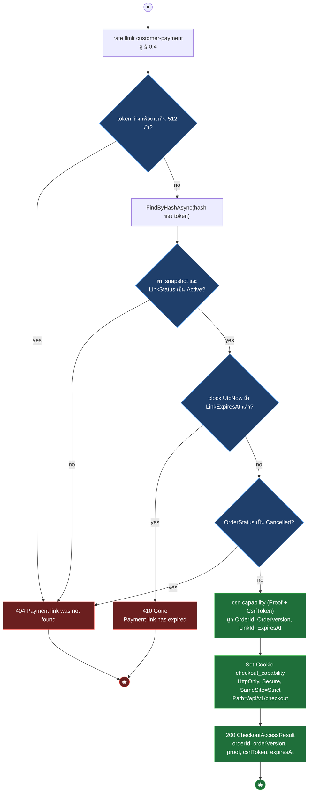
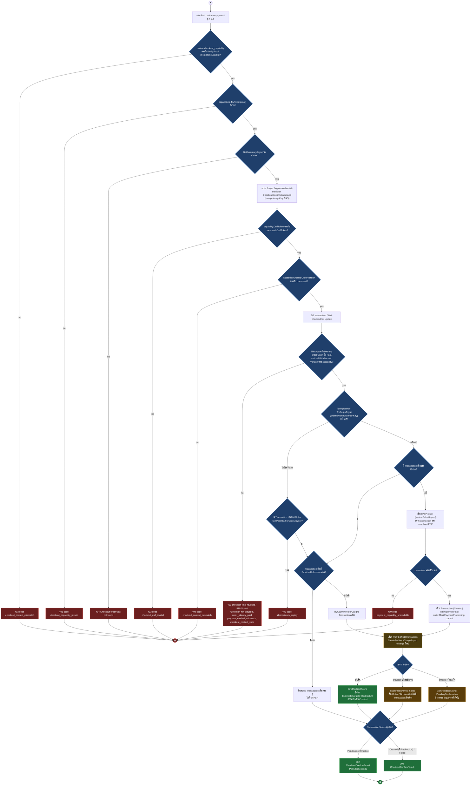
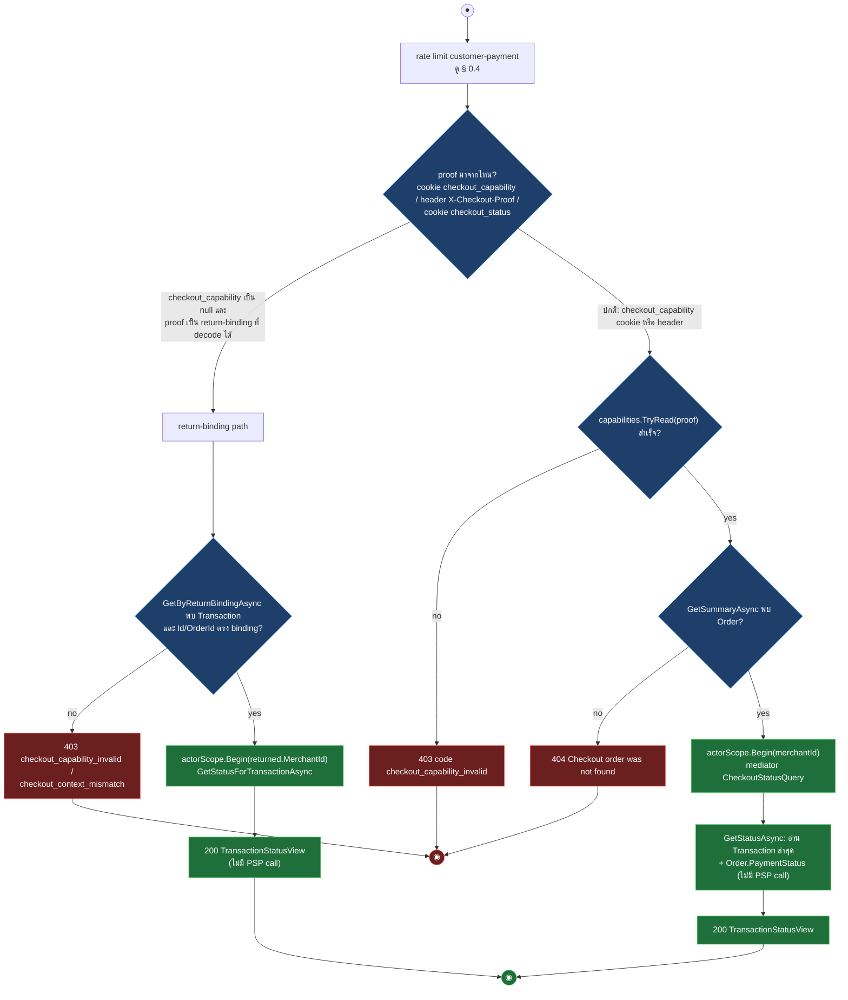
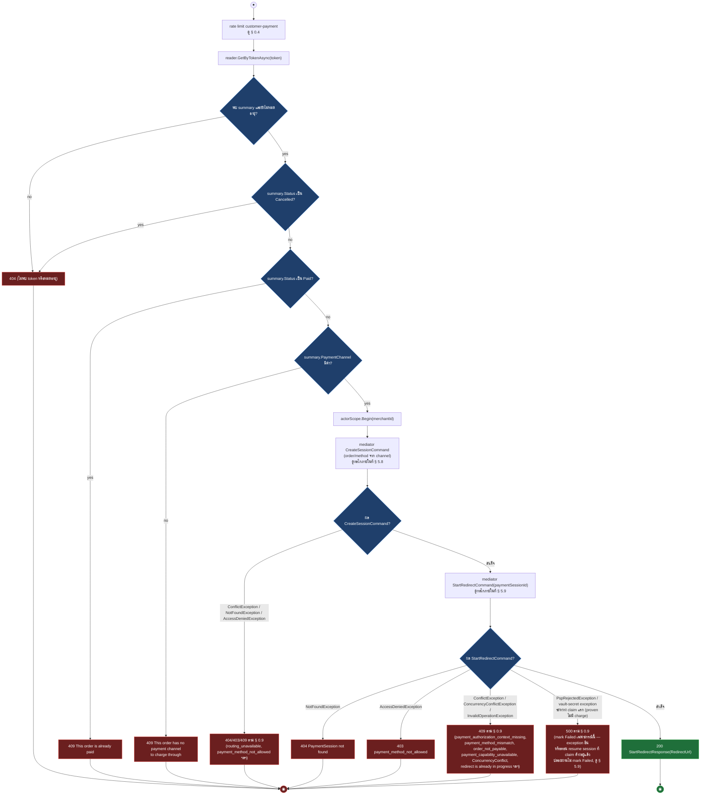
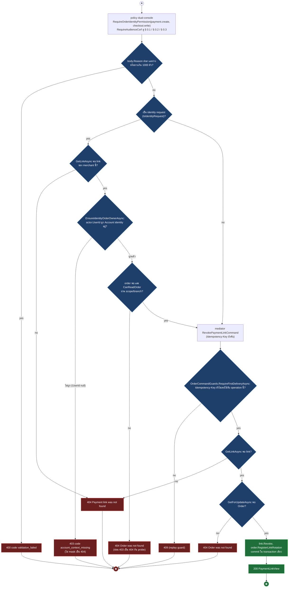
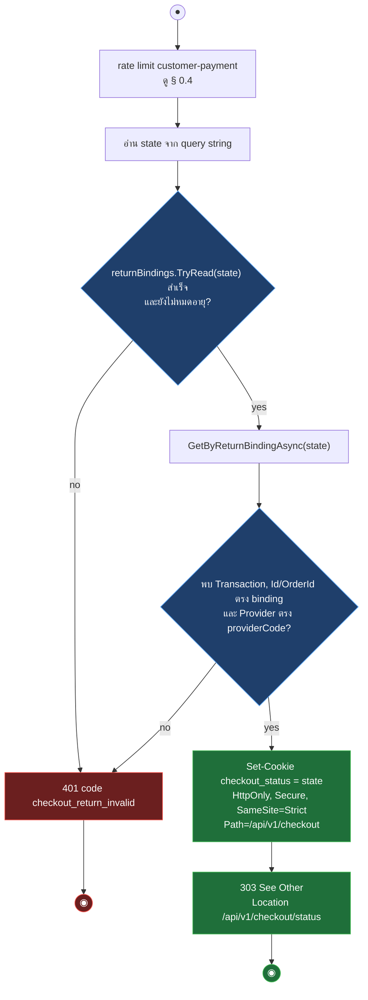
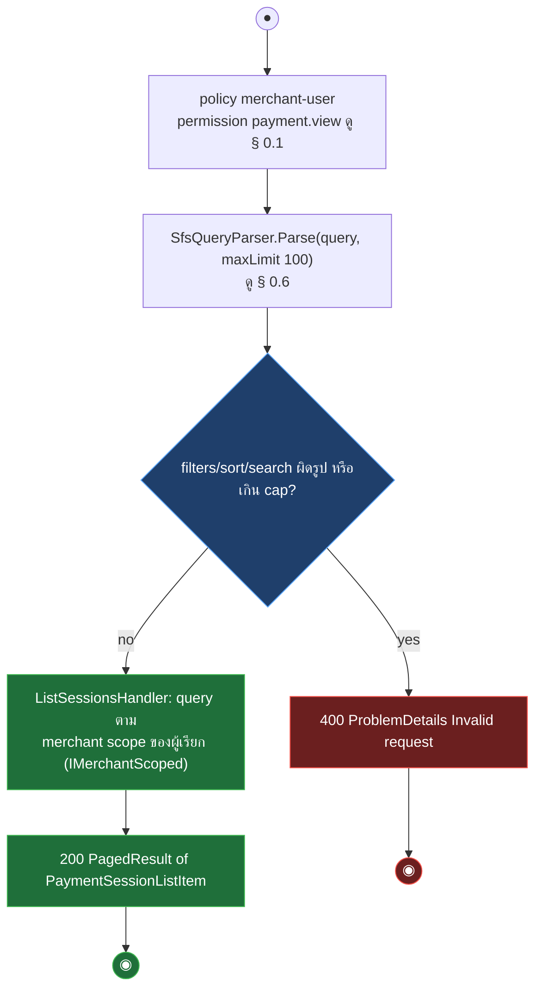
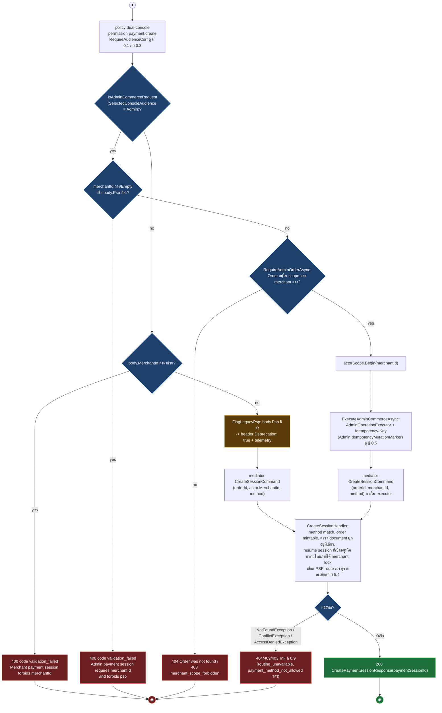
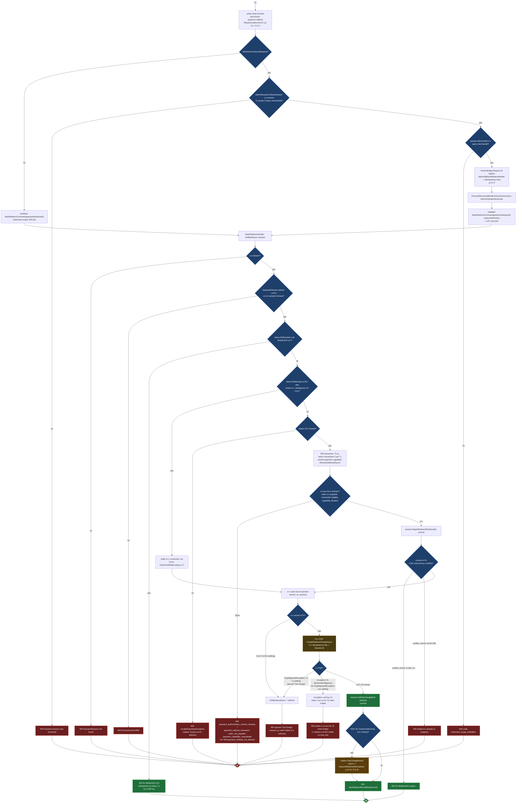
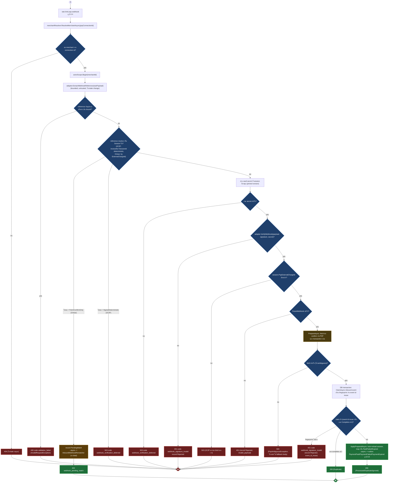

# pol-core API — Customer checkout, payment sessions และ PSP callbacks (Activity Diagrams)

> Source: `docs/reference/api-endpoints.md` section "Commerce, checkout และ orders" (L90-108), "Payment compatibility" (L116-121), "Payment webhooks" (L127-128) และ source ที่อ้างต่อ § (`src/Api/Api/Program.cs:784-1948`, `Application/Modules/Checkouts.Application/*`, `Application/Modules/Platform.Application/Transactions/CheckoutTransactionService.cs`, `Application/Modules/Payments.Application/*`, `Application/Modules/Orders.Application/OrderWorkflow.cs`)
> Scope: 17 endpoints ของ customer checkout (opaque capability), order-link payment, payment session (dual-console), PSP browser return และ PSP webhook — 10 §
> Generated: 2026-09-14

| § | Diagram | Endpoints |
| --- | --- | --- |
| 5.1 | Checkout capability exchange | `POST /api/v1/checkout/access` |
| 5.2 | Checkout confirm / verify — เริ่มหรือ re-check การชำระผ่าน PSP | `POST /api/v1/checkout/confirm` (กลาง), `POST /api/v1/checkout/verify` (ประกอบ) |
| 5.3 | Checkout reads (status / summary) | `GET /api/v1/checkout/status` (กลาง), `GET /api/v1/checkout/summary` (ประกอบ) |
| 5.4 | Order-link customer payment (pay / payment-status / summary) | `POST /api/v1/orders/{token}/pay` (กลาง), `POST /api/v1/orders/{token}/payment-status` (ประกอบ), `GET /api/v1/orders/{token}/summary` (ประกอบ) |
| 5.5 | Payment link revoke | `POST /api/v1/payment-links/{linkId:guid}/revoke` |
| 5.6 | PSP browser return (payment-returns) | `GET /api/v1/payment-returns/{providerCode}` (กลาง), `POST /api/v1/payment-returns/{providerCode}` (ประกอบ) |
| 5.7 | Payment session list | `GET /api/v1/payments/sessions` |
| 5.8 | Payment session create (dual-console) | `POST /api/v1/payments/sessions` |
| 5.9 | Payment session read + redirect (claim แล้วเรียก PSP) | `POST /api/v1/payments/sessions/{paymentSessionId:guid}/redirect` (กลาง), `GET /api/v1/payments/sessions/{paymentSessionId:guid}` (ประกอบ) |
| 5.10 | PSP webhooks (connection / provider account) | `POST /api/v1/webhooks/{pspConnectionId:guid}` (กลาง), `POST /api/v1/webhooks/payment-providers/{providerAccountId:guid}` (ประกอบ) |

---

## 5.1 Checkout capability exchange

ลูกค้าแลก payment-link token (จาก body เท่านั้น) เป็น checkout capability อายุสั้นที่ผูก cookie, ไม่มี session หรือ CSRF filter มาตรฐาน (source: `src/Api/Api/Program.cs:784-810`, `Application/Modules/Checkouts.Application/CheckoutAccess.cs:39-73`)

---

## 5.2 Checkout confirm / verify — เริ่มหรือ re-check การชำระผ่าน PSP

confirm สร้าง Transaction ใหม่แล้วเปิด charge กับ PSP, verify re-inquire Transaction ที่มีอยู่แล้วเท่านั้น (ไม่สร้างใหม่) ทั้งสองทางลงเอยที่กลไกแปลผล PSP เดียวกัน (source: `src/Api/Api/Program.cs:812-857,981-1036`, `Checkouts.Application/CheckoutConfirm.cs:35-94`, `Platform.Application/Transactions/CheckoutTransactionService.cs:63-247,414-577`)

| Method | fullPath | ต่างจาก § กลางตรงไหน |
| --- | --- | --- |
| POST | `/api/v1/checkout/verify` | ไม่สร้าง Transaction ใหม่: หา latest Transaction ของ Order ก่อน — ไม่มีเลยตอบ 409 `transaction_missing`; ข้าม gate STATE/IDEM/ROUTE ทั้งหมด; **PSP call มีเงื่อนไข**: Succeeded อยู่แล้ว → คืนผลเดิม (หรือบันทึก duplicate evidence เมื่อ event ซ้ำ) โดยไม่เรียก PSP; ยังไม่มี `ProviderReference` (ยังไม่เคยเปิด charge) → คืนสถานะปัจจุบันเลยโดยไม่เรียก PSP เช่นกัน (`CheckoutTransactionService.cs:198-204`); เหลือกรณีเดียวที่เรียก PSP จริง (ยังไม่ Succeeded และมี `ProviderReference` แล้ว) เป็น `FetchChargeAsync` (inquiry) ไม่ใช่สร้าง charge; ไม่มี branch "provider ปฏิเสธ" ผ่าน exception เพราะ `FetchChargeAsync` ที่ throw จะ map เป็น Pending เสมอ ไม่ใช่ Failed (`CheckoutTransactionService.cs:231-242`) แต่ transaction ยังจบเป็น **FAILED ได้** ผ่าน `TransactionResultReducer.ReduceFailure` เมื่อ inquiry สำเร็จ (ไม่ throw) แต่ PSP รายงานว่า charge นั้น failed ไปแล้ว (`TransactionResultReducer.cs:56-61,90-102`); สำเร็จจริงจะ enqueue outbox `TransactionSucceeded` ผ่าน `ApplyVerificationAsync` (ดู § 0.8); รองรับ path ลัดผ่าน cookie `checkout_status` (return-binding) ที่ข้าม checkout capability และ CSRF ไปเรียก `VerifyAsync` ตรงด้วย MerchantId จาก Transaction เอง — ดู Notes |

---

## 5.3 Checkout reads (status / summary)

status อ่านสถานะ Transaction ล่าสุดโดยไม่มี PSP call และรองรับ return-binding cookie เป็นทางเข้าอีกทาง, summary อ่านสรุป Order พร้อม re-validate link/version ที่ status ไม่ทำ (source: `src/Api/Api/Program.cs:859-901,1073-1098`, `Checkouts.Application/CheckoutConfirm.cs:58-71`, `Checkouts.Application/CheckoutAccess.cs:75-111`, `Platform.Application/Transactions/CheckoutTransactionService.cs:249-292`)

| Method | fullPath | ต่างจาก § กลางตรงไหน |
| --- | --- | --- |
| GET | `/api/v1/checkout/summary` | ไม่มี return-binding branch (มีแค่ cookie/header proof, mismatch ระหว่างสองค่าตอบ 403 `checkout_context_mismatch`); handler re-validate เพิ่ม 3 เงื่อนไขที่ status ไม่เช็ก — `LinkStatus != Active` → 403 `checkout_link_revoked`, หมดอายุ → 410 Gone, `OrderVersion` ไม่ตรง capability → 409 `checkout_context_stale`; ผลลัพธ์คือ `CheckoutSummaryView` (รายการสินค้า+ยอด) ไม่ใช่ `TransactionStatusView`; ไม่มี PSP call เหมือนกัน |

---

## 5.4 Order-link customer payment (pay / payment-status / summary)

pay เปิด payment session ใหม่ (ใช้กลไกเดียวกับ § 5.8/5.9) แล้วเริ่ม redirect ทันที; payment-status/summary เป็น read ที่ผูก token เดียวกันแต่ไม่มี branch สร้าง session (source: `src/Api/Api/Program.cs:1824-1946`, `Application/Modules/Payments.Application/CreateSession/CreateSessionHandler.cs:67-148`, `Application/Modules/Payments.Application/StartRedirect/StartRedirectHandler.cs:74-177`)

| Method | fullPath | ต่างจาก § กลางตรงไหน |
| --- | --- | --- |
| POST | `/api/v1/orders/{token}/payment-status` | ไม่สร้าง session: อ่าน Order ก่อน — status ปลายทาง (Paid/Refunded/Cancelled/Failed/Expired) ตอบทันทีไม่มี PSP call; ถ้ายังเปิดอยู่และไม่มี open Session ตอบ `pending`; มี open Session เรียก `PaymentConfirmationService.ConfirmAsync` (อาจ inquiry PSP) แล้ว map เหลือ 4 ค่า `paid/failed/pending/cancelled`; error ที่ ambiguous (timeout/`PspAmbiguousException`) map เป็น `pending` เสมอ ไม่ใช่ error response; handler ดักเฉพาะ `HttpRequestException`/`TaskCanceledException`/`JsonException`/`PspAmbiguousException` — wiring/config fault เช่นไม่มี PSP connection ผูกไว้ (`InvalidOperationException`) ไม่ถูกดัก หลุดออกไปเป็น 409 ผ่าน ProblemDetails handler กลาง (ดู § 0.9) ไม่ใช่ 200 pending เสมอไป |
| GET | `/api/v1/orders/{token}/summary` | อ่านอย่างเดียว ไม่มี rate limit (ตรงกับเอกสาร), ไม่มี actorScope/mediator, ไม่คืน MerchantId หรือ payment session id; หมดอายุตอบ 410 Gone (คนละโค้ดกับ pay ที่ตอบ 404 เมื่อหมดอายุ) |

---

## 5.5 Payment link revoke

console (dual-console) หรือ identity-order เรียกปิดสิทธิ์เริ่มชำระจากลิงก์โดยตรง ไม่ผ่าน maker-checker และไม่มี If-Match (มีแค่ Idempotency-Key) (source: `src/Api/Api/Program.cs:1228-1265,3747-3764`, `Application/Modules/Orders.Application/OrderWorkflow.cs:1050-1094`)

---

## 5.6 PSP browser return (payment-returns)

browser ที่กลับจาก PSP ผ่าน protected return binding เท่านั้น ไม่ trust query/form success flag และไม่สร้างหรือยืนยัน Transaction เอง เพียงออก status-only cookie แล้ว 303 ไปอ่านสถานะจริง (source: `src/Api/Api/Program.cs:903-979`)

| Method | fullPath | ต่างจาก § กลางตรงไหน |
| --- | --- | --- |
| POST | `/api/v1/payment-returns/{providerCode}` | อ่าน `state` จาก query string ก่อน ถ้าว่างและ request เป็น form content-type จึงอ่านจาก form body แทน (`ReadFormAsync`); ตรรกะ validate/response ที่เหลือเหมือนกันทุกจุด (401/303) |

---

## 5.7 Payment session list

merchant-user เท่านั้น (ไม่ใช่ dual-console) อ่านรายการ payment session ของร้านค้าตัวเองผ่าน SFS (source: `src/Api/Api/Program.cs:1697-1722`, `Application/Modules/Payments.Application/GetSession/ListSessions.cs:22-47`)

---

## 5.8 Payment session create (dual-console)

Merchant Console เปิด session ตรง, Admin Console ต้องมี merchantId + ผ่าน operation executor แบบ idempotent เท่านั้น (server เป็นผู้เลือก PSP เสมอทั้งสองฝั่ง) (source: `src/Api/Api/Program.cs:1632-1695,3719-3728,3967-3982`, `Application/Modules/Payments.Application/CreateSession/CreateSessionHandler.cs:67-148`)

---

## 5.9 Payment session read + redirect (claim แล้วเรียก PSP)

redirect claim session ก่อนแตะ PSP กัน double charge, ผลลัพธ์ที่ claim ค้างไว้ (ไม่มี URL) จะถูก settle ด้วย key เดิมเสมอ (source: `src/Api/Api/Program.cs:1727-1819`, `Application/Modules/Payments.Application/StartRedirect/StartRedirectHandler.cs:74-177`)

| Method | fullPath | ต่างจาก § กลางตรงไหน |
| --- | --- | --- |
| GET | `/api/v1/payments/sessions/{paymentSessionId:guid}` | อ่านอย่างเดียว ไม่มี CSRF/If-Match บังคับส่ง; merchant path เรียก `GetSessionQuery` ตรง, admin path resolve scope เหมือนกันแล้วตั้ง `VersionEtags.Set` (ETag ขาออกเท่านั้น) ดู § 0.5; ไม่พบหรือ merchant ไม่ตรง scope -> 404 เดียว (ไม่แยก 403 เหมือน redirect เพราะเป็น query ที่ scope ผ่าน `Accessible.Merchants` อยู่แล้ว); ไม่มี PSP call |

---

## 5.10 PSP webhooks (connection / provider account)

webhook คือ source of truth: resolve merchant จาก trusted id ก่อนแตะข้อมูลใด ๆ, verify signature ด้วย secret ที่ session/Transaction ปักหมุดไว้ แล้วจึง fetch-to-confirm กับ PSP เพื่อยืนยันจริง (source: `src/Api/Api/Program.cs:1038-1071,1271-1316`, `Application/Modules/Payments.Application/HandlePspWebhook/HandlePspWebhookHandler.cs:67-222`, `Application/Modules/Payments.Application/Transactions/TransactionWebhook.cs:37-109`)

| Method | fullPath | ต่างจาก § กลางตรงไหน |
| --- | --- | --- |
| POST | `/api/v1/webhooks/payment-providers/{providerAccountId:guid}` | เส้นทาง Transaction รุ่นเก่า ไม่ใช่ Session แต่ gate แรกไม่ได้ถูกแทนที่: (1) `connections.GetByIdAsync(providerAccountId)` คือ 404 gate เดียวกับ CFOUND ของ § กลางทุกประการ (resolve ซ้ำสองครั้ง ทั้งใน endpoint `Program.cs:1048` และในตัว handler `TransactionWebhook.cs:41-43`); (2) `GetByProviderReferenceAsync` (providerAccountId+environment=null+reference) คือสิ่งที่แทน SESLOOK ของ § กลาง — ไม่พบ Transaction ตอบ 202 `transaction_unresolved` (ไม่ใช่ 503/PendingMatch แบบ § กลาง); reference ผิดรูปหรือยาวเกินตอบ 400 `validation_failed` เหมือน § กลาง เพราะเรียก `ExtractWebhookReference` ตัวเดียวกัน (`TransactionWebhook.cs:45`); ไม่มี PendingMatch/FetchConfirmOnly branch เลย; ใช้กลไก `CheckoutTransactionService.VerifyAsync` ตัวเดียวกับ `/checkout/verify` ใน § 5.2 (inquiry ไม่ fetch-to-confirm แบบ session) — สำเร็จ enqueue outbox `TransactionSucceeded` เท่านั้น (ไม่มี PaymentFailed/PaymentExpired แยก); status (ตามลำดับที่ตรวจจริงใน `TransactionWebhook.cs:49-108`): พบ Transaction แต่ `ProviderAccountId`/`Provider` ไม่ตรง connection → Rejected 401 `code=binding_mismatch` (เช็คทันทีหลัง resolve Transaction ก่อนเงื่อนไขอื่นทั้งหมด รวมถึงก่อน charge_unbound, `TransactionWebhook.cs:51-53`); ยังไม่มี `ProviderReference` → Deferred 202 `code=charge_unbound`; event ซ้ำ → Duplicate 200; อ่าน secret ไม่ได้ → Deferred 202 `code=credential_unavailable`; signature ไม่ผ่าน → Rejected 401 `code=signature_invalid`; parse payload ไม่ได้ → Rejected 401 `code=payload_invalid`; reference ไม่ตรง → Processed 200 `code=reference_mismatch` (flag ผ่าน `MarkEvidenceMismatchAsync` ไม่ reject) |

---

## Deviations

ไม่พบ deviation ระหว่างเอกสารกับ source สำหรับ 17 endpoint ของ theme นี้ — คอลัมน์ caller/auth policy ในเอกสารตรงกับ metadata ที่ endpoint ประกาศจริงทุกแถว (ตรวจโดยเทียบ `docs/reference/api-endpoints.md:90-121,127-128` กับ `src/Api/Api/Program.cs:784-1948`)

## Notes

- **สอง payment engine คู่ขนาน**: `/checkout/*`, `/orders/{token}/pay|summary` (บางส่วน) และ `/webhooks/payment-providers/*` เดินบน `Transaction` (`CheckoutTransactionService`, legacy), ส่วน `/orders/{token}/payment-status`, `/payments/sessions/*` และ `/webhooks/{pspConnectionId}` เดินบน `Session` (`PaymentConfirmationService`) — คนละ aggregate คนละ outbox event (`TransactionSucceeded` vs `PaymentPaid/PaymentFailed/PaymentExpired`) แม้ปลายทางจะเป็น Order เดียวกัน
- **checkout CSRF ไม่ใช่ § 0.3**: `/checkout/confirm` และ `/checkout/verify` เทียบ `CsrfToken` ที่ฝังในตัว capability กับค่าที่ client ส่งมาเอง (`CryptographicOperations.FixedTimeEquals`) เป็นกลไกเฉพาะของ checkout ไม่ใช่ cookie/header double-submit ของ § 0.3 เพราะ endpoint กลุ่มนี้ `AllowAnonymous` ไม่มี session cookie
- **return-binding เป็น capability คู่ขนาน**: cookie `checkout_status` (ออกโดย § 5.6) ใช้แทน `checkout_capability` ได้ใน `/checkout/status` และ `/checkout/verify` เท่านั้น — ไม่ใช้กับ `/checkout/summary` หรือ `/checkout/confirm`
- **redirect ที่อ่าน secret ไม่สำเร็จหรือ PSP ปฏิเสธ (ไม่ settling)** จะ mark session Failed ก่อน rethrow exception ดิบซึ่งไม่อยู่ใน map ของ § 0.9 โดยตรง จึงตกไปที่ 500 ค่าเริ่มต้น — อยู่นอก frame ว่ามี custom exception filter เพิ่มเติมหรือไม่ (`StartRedirectHandler.cs:139-163`)
- **admin idempotency ไม่มี If-Match คู่กันเสมอ**: `POST /payments/sessions` (create) มีแค่ `AdminIdempotencyMutationMarker` แต่ `POST .../redirect` มีทั้ง `AdminIfMatchMutationMarker` และ `AdminIdempotencyMutationMarker` — สร้าง session ใหม่ไม่มี resource เดิมให้ version เทียบ

**Render**: GitHub / Obsidian / VS Code Mermaid
