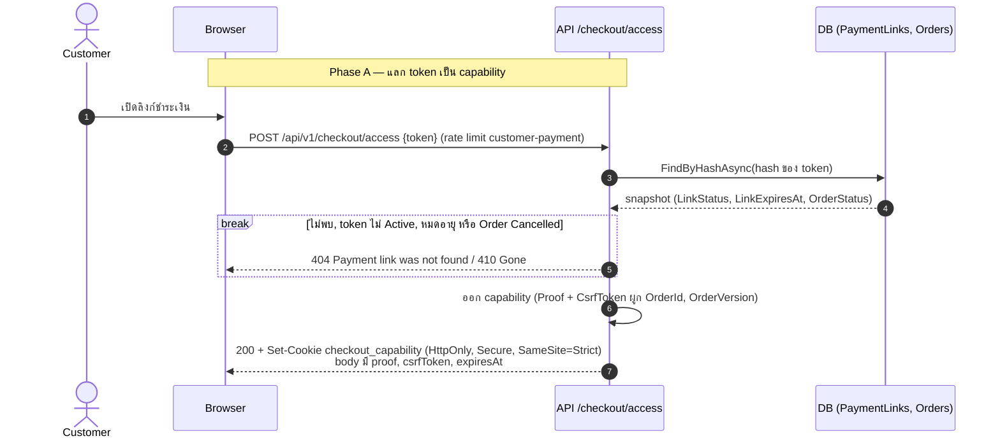
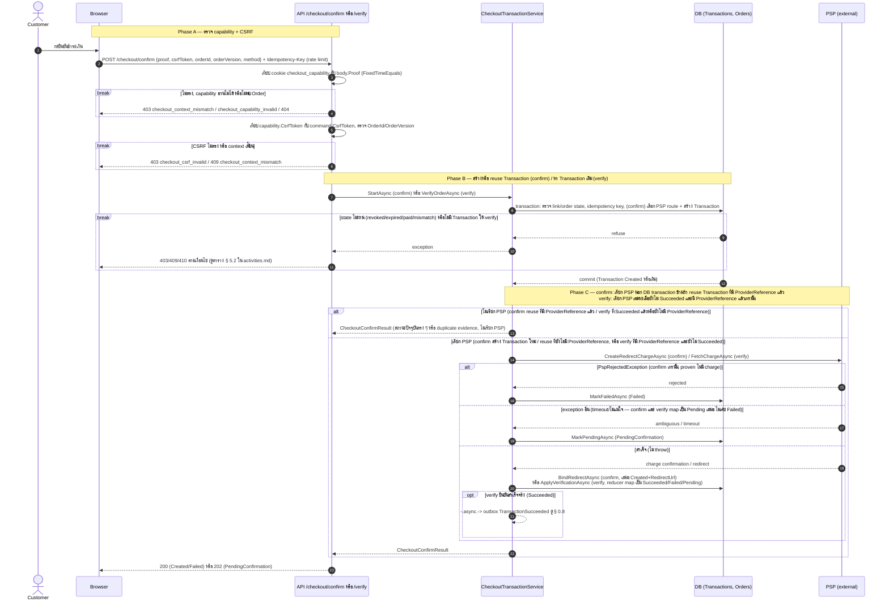
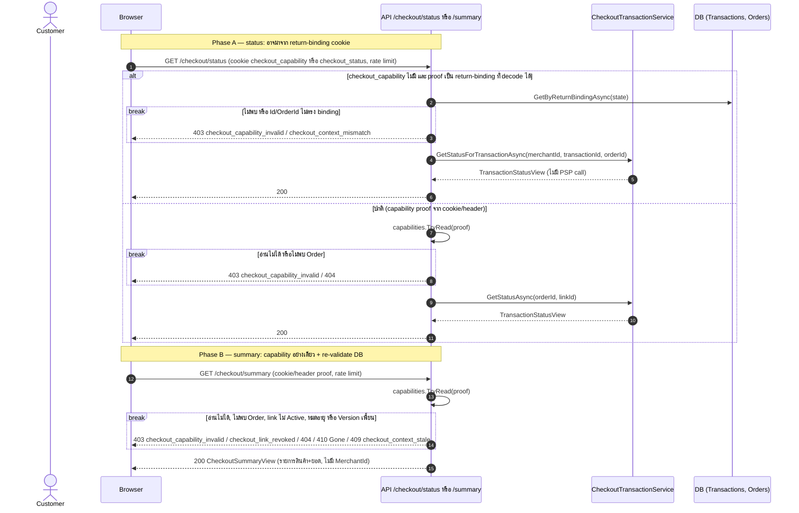
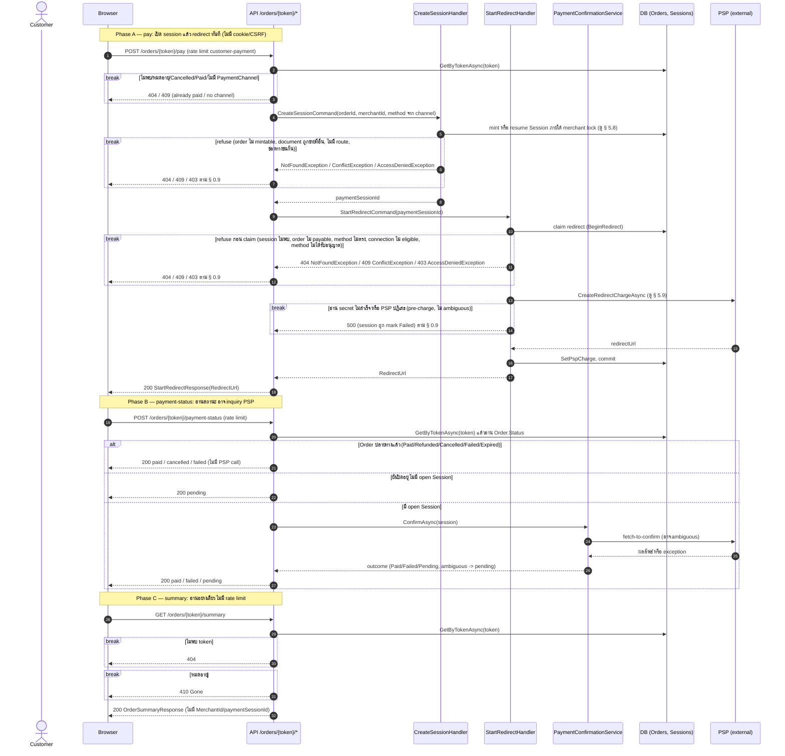
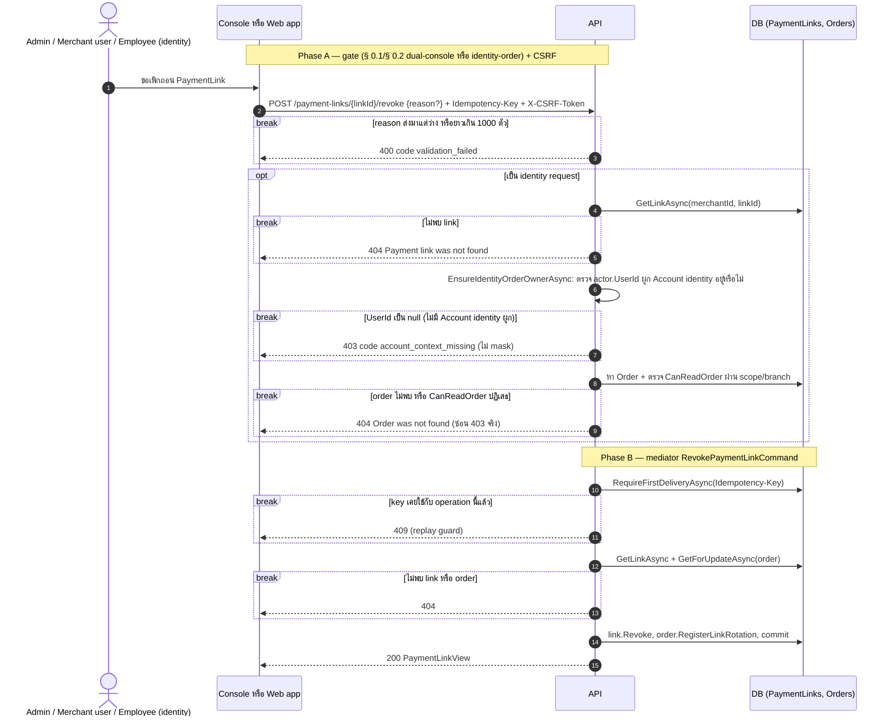
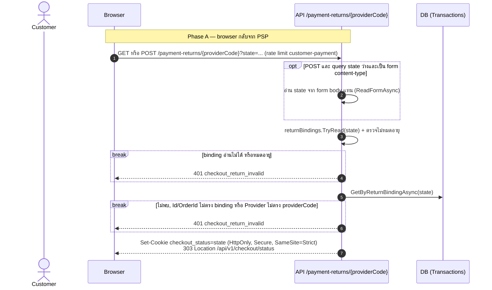
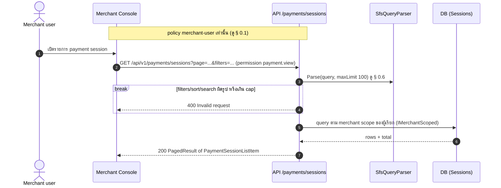
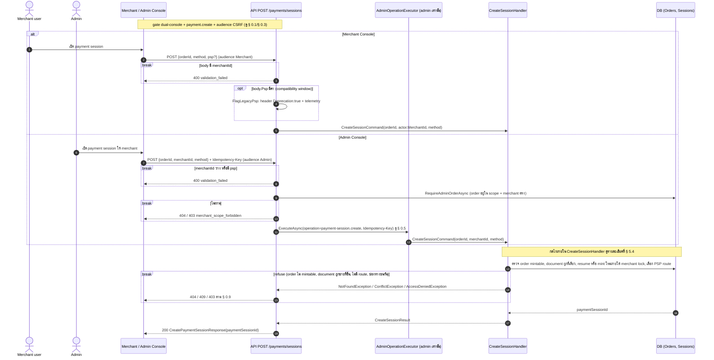
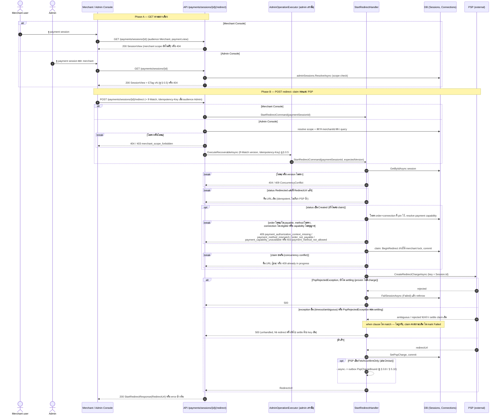
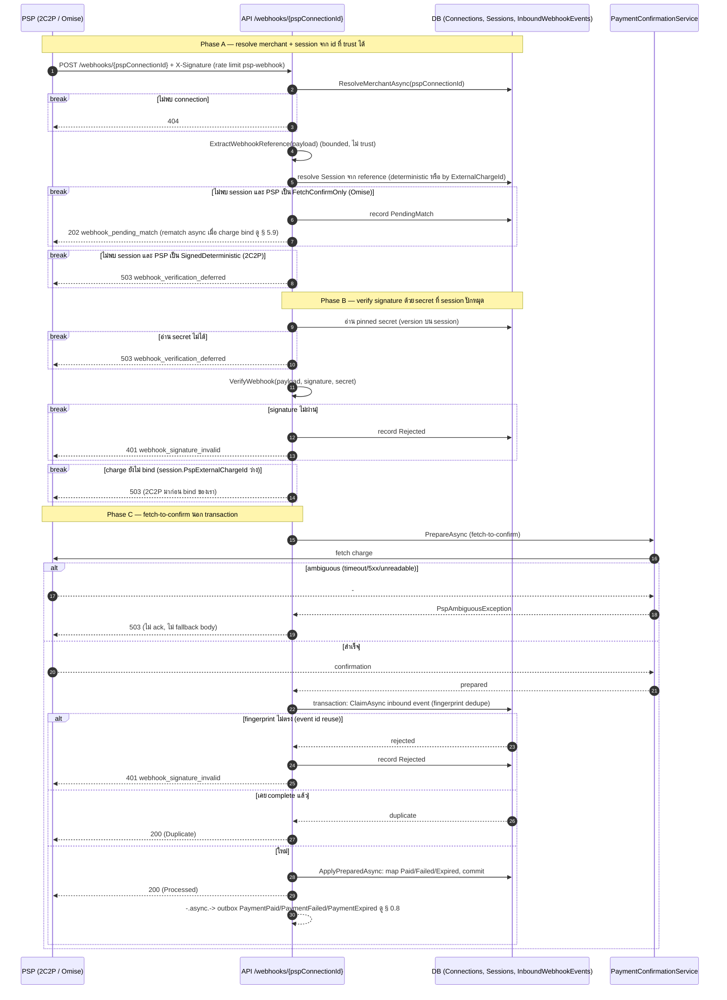

# pol-core API — Customer checkout, payment sessions และ PSP callbacks (Sequence Diagrams)

> Source: `docs/reference/api-endpoints.md` section "Commerce, checkout และ orders" (L90-108), "Payment compatibility" (L116-121), "Payment webhooks" (L127-128) และ source ที่อ้างต่อ § (`src/Api/Api/Program.cs:784-1948`, `Application/Modules/Checkouts.Application/*`, `Application/Modules/Platform.Application/Transactions/CheckoutTransactionService.cs`, `Application/Modules/Payments.Application/*`, `Application/Modules/Orders.Application/OrderWorkflow.cs`)
> Scope: 10 § เดียวกับ `05-customer-checkout-payment-psp.activities.md` (หมายเลข § ตรงกัน) แสดงลำดับข้าม actor / handler / DB / PSP / worker
> Generated: 2026-09-14

| § | Diagram | Endpoints |
| --- | --- | --- |
| 5.1 | Checkout capability exchange | `POST /api/v1/checkout/access` |
| 5.2 | Checkout confirm / verify — เริ่มหรือ re-check การชำระผ่าน PSP | `POST /api/v1/checkout/confirm` (กลาง), `POST /api/v1/checkout/verify` (ประกอบ) |
| 5.3 | Checkout reads (status / summary) | `GET /api/v1/checkout/status` (กลาง), `GET /api/v1/checkout/summary` (ประกอบ) |
| 5.4 | Order-link customer payment (pay / payment-status / summary) | `POST /api/v1/orders/{token}/pay` (กลาง), `POST /api/v1/orders/{token}/payment-status` (ประกอบ), `GET /api/v1/orders/{token}/summary` (ประกอบ) |
| 5.5 | Payment link revoke | `POST /api/v1/payment-links/{linkId:guid}/revoke` |
| 5.6 | PSP browser return (payment-returns) | `GET /api/v1/payment-returns/{providerCode}` (กลาง), `POST /api/v1/payment-returns/{providerCode}` (ประกอบ) |
| 5.7 | Payment session list | `GET /api/v1/payments/sessions` |
| 5.8 | Payment session create (dual-console) | `POST /api/v1/payments/sessions` |
| 5.9 | Payment session read + redirect (claim แล้วเรียก PSP) | `POST /api/v1/payments/sessions/{paymentSessionId:guid}/redirect` (กลาง), `GET /api/v1/payments/sessions/{paymentSessionId:guid}` (ประกอบ) |
| 5.10 | PSP webhooks (connection / provider account) | `POST /api/v1/webhooks/{pspConnectionId:guid}` (กลาง), `POST /api/v1/webhooks/payment-providers/{providerAccountId:guid}` (ประกอบ) |

---

## 5.1 Checkout capability exchange

token จาก body เท่านั้นแลกเป็น capability อายุสั้นที่ผูก cookie, ไม่มี console session (source: `src/Api/Api/Program.cs:784-810`, `Application/Modules/Checkouts.Application/CheckoutAccess.cs:39-73`)

---

## 5.2 Checkout confirm / verify — เริ่มหรือ re-check การชำระผ่าน PSP

confirm สร้าง Transaction ใหม่แล้วเปิด charge, verify re-inquire Transaction เดิม ทั้งสองทางลงเอยที่กลไกแปลผล PSP เดียวกัน (source: `src/Api/Api/Program.cs:812-857,981-1036`, `Platform.Application/Transactions/CheckoutTransactionService.cs:63-247,414-577`)

---

## 5.3 Checkout reads (status / summary)

status อ่าน Transaction ล่าสุดโดยไม่มี PSP call และรับ proof จาก return-binding ได้ด้วย, summary re-validate DB ลึกกว่าแต่ไม่มีทางเข้า return-binding (source: `src/Api/Api/Program.cs:859-901,1073-1098`, `Platform.Application/Transactions/CheckoutTransactionService.cs:249-292`)

---

## 5.4 Order-link customer payment (pay / payment-status / summary)

pay เปิด payment session ใหม่แล้วเริ่ม redirect ทันที (ใช้กลไกเดียวกับ § 5.8/5.9), payment-status/summary เป็น read ที่ผูก token เดียวกัน (source: `src/Api/Api/Program.cs:1824-1946`, `Application/Modules/Payments.Application/CreateSession/CreateSessionHandler.cs:67-148`, `Application/Modules/Payments.Application/StartRedirect/StartRedirectHandler.cs:74-177`, `ConfirmPaymentStatus/ConfirmPaymentStatusHandler.cs:22-89`)

---

## 5.5 Payment link revoke

console (dual-console) หรือ identity-order เรียกปิดสิทธิ์เริ่มชำระจากลิงก์โดยตรง ไม่ผ่าน maker-checker (source: `src/Api/Api/Program.cs:1228-1265,3747-3764`, `Application/Modules/Orders.Application/OrderWorkflow.cs:1050-1094`)

---

## 5.6 PSP browser return (payment-returns)

browser กลับจาก PSP ผ่าน protected return binding เท่านั้น ไม่ trust query/form success flag (source: `src/Api/Api/Program.cs:903-979`)

---

## 5.7 Payment session list

merchant-user เท่านั้น (ไม่ใช่ dual-console) อ่านรายการ payment session ของร้านค้าตัวเองผ่าน SFS (source: `src/Api/Api/Program.cs:1697-1722`, `Application/Modules/Payments.Application/GetSession/ListSessions.cs:22-47`)

---

## 5.8 Payment session create (dual-console)

Merchant Console เปิด session ตรง, Admin Console ต้องมี merchantId + ผ่าน operation executor แบบ idempotent เท่านั้น (source: `src/Api/Api/Program.cs:1632-1695,3719-3728,3967-3982`, `Application/Modules/Payments.Application/CreateSession/CreateSessionHandler.cs:67-148`)

---

## 5.9 Payment session read + redirect (claim แล้วเรียก PSP)

redirect claim session ก่อนแตะ PSP กัน double charge, claim ที่ค้างไว้ (ไม่มี URL) settle ด้วย key เดิมเสมอ (source: `src/Api/Api/Program.cs:1727-1819`, `Application/Modules/Payments.Application/StartRedirect/StartRedirectHandler.cs:74-177`)

---

## 5.10 PSP webhooks (connection / provider account)

webhook คือ source of truth: resolve merchant จาก trusted id ก่อน แล้ว verify signature ด้วย secret ที่ปักหมุดไว้ก่อนจะ fetch-to-confirm กับ PSP เพื่อยืนยันจริง (source: `src/Api/Api/Program.cs:1038-1071,1271-1316`, `Application/Modules/Payments.Application/HandlePspWebhook/HandlePspWebhookHandler.cs:67-222`)

---

## Notes

- Deviations ของ theme นี้อยู่ที่ `05-customer-checkout-payment-psp.activities.md` (ไม่พบ deviation) ไฟล์นี้ไม่ทำซ้ำ
- § 5.2/§ 5.4/§ 5.9/§ 5.10 ใช้ `break` แทนการซ้อน `alt` ลึกหลายชั้น เพื่อสะท้อน guard-clause ของโค้ดจริง (early throw/return) — อ่านว่าเงื่อนไขใน `break` เป็นทางออกจบ flow ทันที ไม่ตกไปยังบรรทัดถัดไป
- ลูกศร `-.async.->` แทน "การเขียนลง outbox ที่มี consumer/worker แยกต่างหาก" ไม่ใช่ syntax ลูกศรจริงของ mermaid sequence (mermaid sequence ไม่มีเส้นประ) — คือ self-message ที่บรรยายว่างานถัดไปเกิด "async" ดู § 0.8 สำหรับกลไก dispatcher จริง
- § 5.2/§ 5.10 ใช้กลไกเดียวกันคนละ aggregate: `/checkout/verify` (Transaction, `CheckoutTransactionService.VerifyAsync`) กับ `/webhooks/payment-providers/*` (Transaction เดียวกัน) VS `/webhooks/{pspConnectionId}` และ `/orders/{token}/payment-status` (Session, `PaymentConfirmationService`) — ดู Notes ของ activities.md

**Render**: GitHub / Obsidian / VS Code Mermaid
