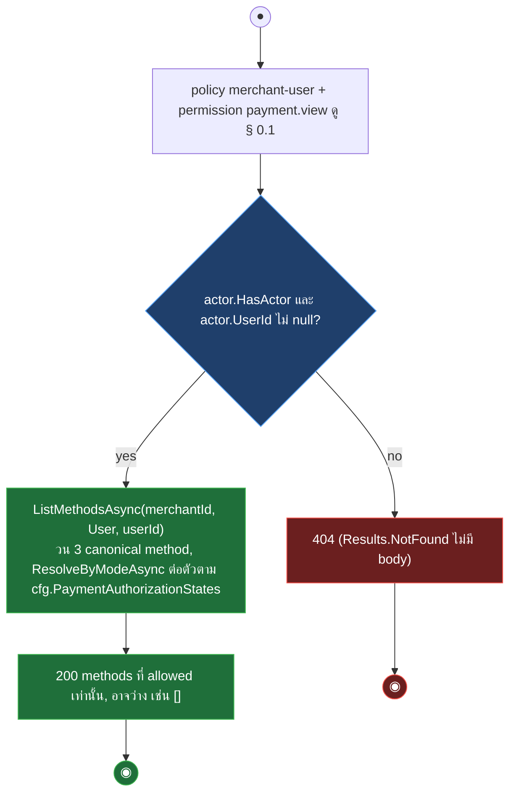
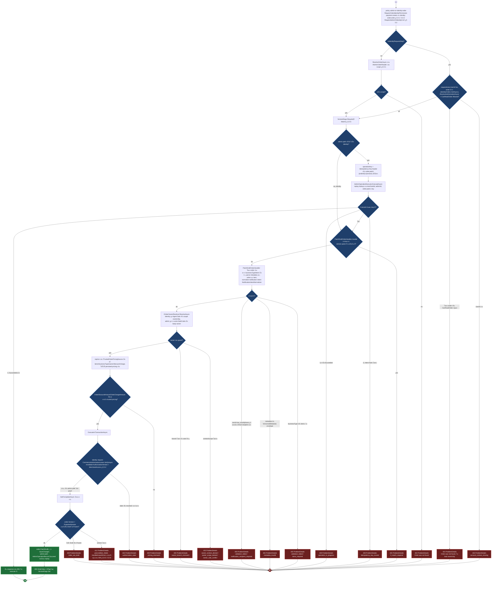
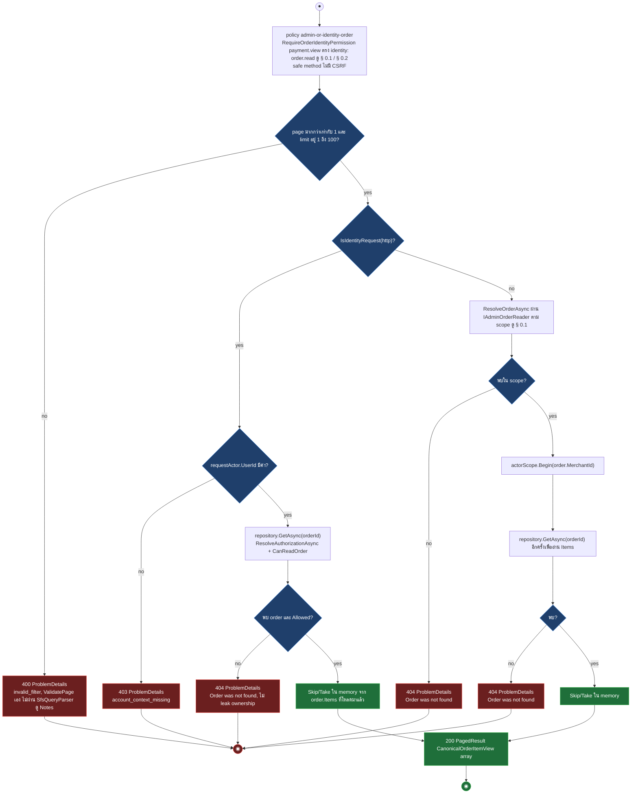
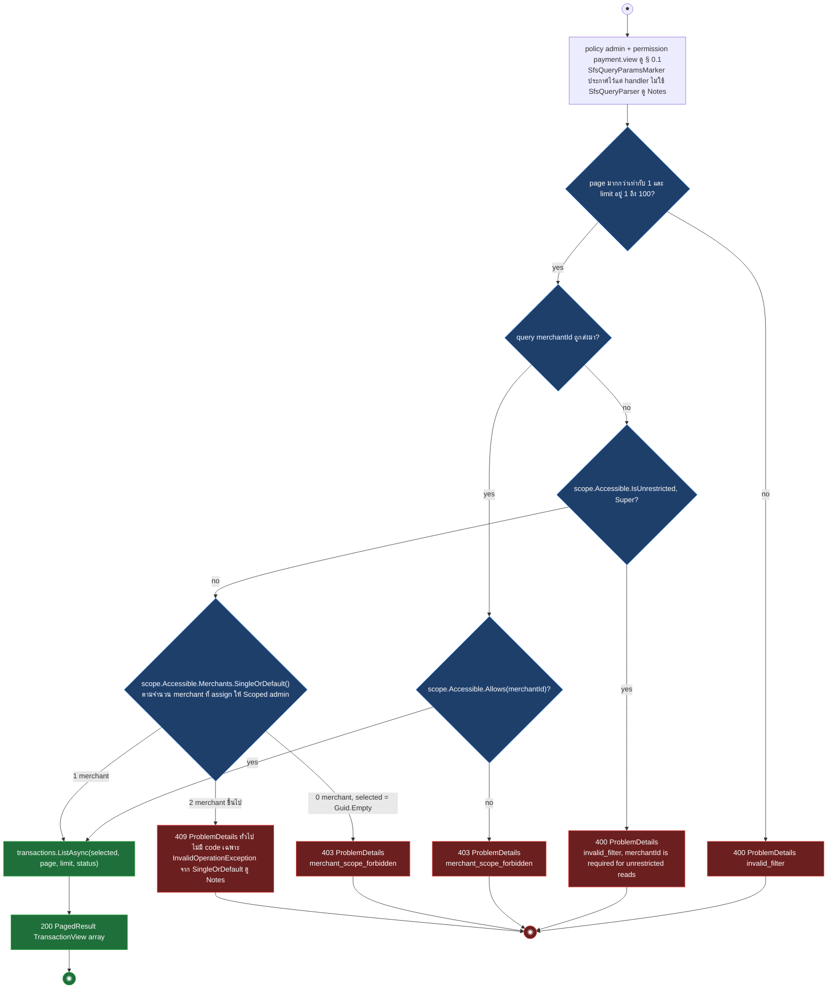
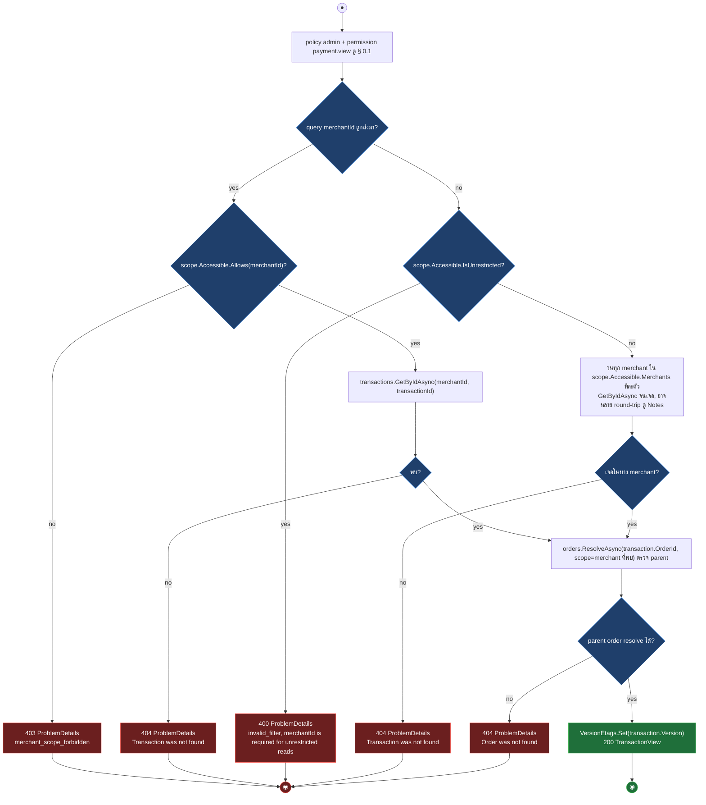
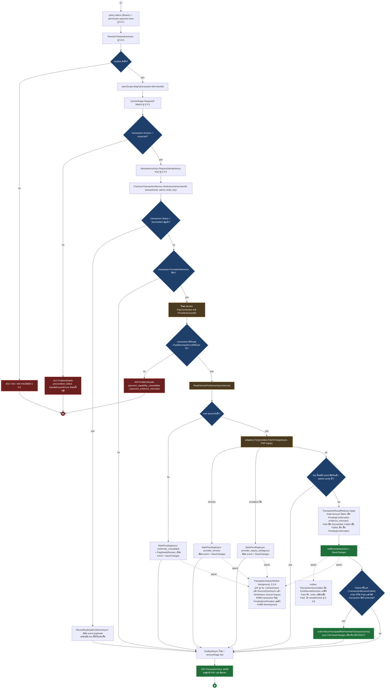
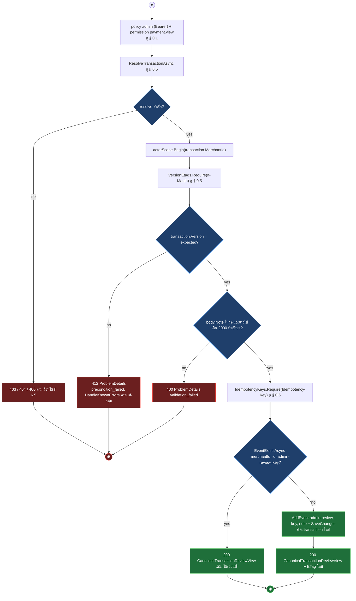

# pol-core API — Canonical commerce และ transactions (Activity Diagrams)

> Source: `docs/reference/api-endpoints.md` section "Canonical commerce และ transactions" บรรทัด L132-L144 และ source ที่อ้างต่อ § (`src/Api/Api/ControlPlane/CanonicalCommerceEndpoints.cs`, `Orders.Application/OrderWorkflow.cs`, `Platform.Application/Transactions/CheckoutTransactionService.cs`, `TransactionResultReducer.cs`, `Persistence.MerchantRuntime/Idempotency/AdminOperationExecutor.cs`, `Persistence.ControlPlane/Payments/Capabilities/EffectivePaymentCapabilityResolver.cs`)
> Scope: 9 endpoints — Checkout payment methods, Draft Order patch (dual identity/admin), Order child reads, Transaction list/detail/events, Transaction verify + review-notes (admin support writes)
> Generated: 2026-09-14

| § | Diagram | Endpoints |
| --- | --- | --- |
| 6.1 | รายการ Payment methods ของ Checkout | `GET /api/v1/checkout/payment-methods` |
| 6.2 | แก้ไข Draft Order (dual identity/admin) | `PATCH /api/v1/orders/{orderId:guid}` |
| 6.3 | อ่าน Order child resources (items + history) | `GET /api/v1/orders/{orderId:guid}/items` + 1 composed |
| 6.4 | รายการ Transaction ตาม Merchant scope | `GET /api/v1/transactions` |
| 6.5 | อ่าน Transaction + events ตาม parent visibility | `GET /api/v1/transactions/{transactionId:guid}` + 1 composed |
| 6.6 | ตรวจสอบ Transaction กับ PSP (admin verify) | `POST /api/v1/transactions/{transactionId:guid}/verify` |
| 6.7 | เพิ่ม Transaction review note (idempotent) | `POST /api/v1/transactions/{transactionId:guid}/review-notes` |

---

## 6.1 รายการ Payment methods ของ Checkout

Merchant user อ่าน method ที่ enable จริงสำหรับ merchant/user ปัจจุบัน โดย resolve ทีละ canonical method (card, promptpay, installment) ตาม `cfg.PaymentAuthorizationStates.Mode` โดยไม่เรียก PSP หรือ network (source: `src/Api/Api/ControlPlane/CanonicalCommerceEndpoints.cs:231-248`, `Persistence.ControlPlane/Payments/Capabilities/EffectivePaymentCapabilityResolver.cs:36-52,109-135`)

---

## 6.2 แก้ไข Draft Order (dual identity/admin)

Identity request ตรวจ ownership ด้วย `AccessEvaluator.CanReadOrder` ก่อนเข้า handler เดียวกับ admin, admin request ห่อด้วย `AdminOperationExecutor` (idempotent apply, ไม่ใช่ maker-checker), ทั้งสองทางจบที่ `PatchDraftOrderHandler` ซึ่ง validate, reprice ผ่าน trusted pricing source แล้ว persist ใน transaction เดียว (source: `CanonicalCommerceEndpoints.cs:35-123`, `Orders.Application/OrderWorkflow.cs:188-201,1123-1252,298-328`, `Persistence.ControlPlane/Orders/OrderOwnerResolver.cs:23-128`, `Persistence.MerchantRuntime/Authorization/CommerceAuthorizationLease.cs:22-50`, `Persistence.MerchantRuntime/Idempotency/AdminOperationExecutor.cs:24-60`, `Api/ConcurrencyEtags.cs:18-26`, `CanonicalCommerceEndpoints.cs:500-509` สำหรับ 412 ครอบทั้งกลุ่ม)

---

## 6.3 อ่าน Order child resources (items + history)

ทั้งสอง endpoint ตรวจ ownership ผ่าน parent Order ก่อนเสมอ (ไม่มี authorization surface แยกของ child) แล้วคืนเฉพาะข้อมูลปลอดภัย, `items` มี pagination ในหน่วยความจำแบบ manual ที่ไม่ผ่าน `SfsQueryParser` แม้ endpoint จะประกาศ `SfsQueryParamsMarker` ไว้ก็ตาม ดู Notes (source: `CanonicalCommerceEndpoints.cs:127-226,397-401,440-444`)

| Method | fullPath | ต่างจาก § กลางตรงไหน |
| --- | --- | --- |
| GET | `/api/v1/orders/{orderId:guid}/history` | ไม่มี page/limit, ไม่มี PAGE gate, ไม่ Skip/Take, คืน `[{status: "created", occurredAt}]` แล้วเพิ่มแถวสถานะปัจจุบัน ตัวพิมพ์เล็ก เมื่อ UpdatedAt ต่างจาก CreatedAt |

---

## 6.4 รายการ Transaction ตาม Merchant scope

List คนละ path จาก detail/events: ไม่มี parent-order resolve, แต่ตัดสิน merchant เป้าหมายจาก query หรือ scope ของ Admin เอง ซึ่งซ่อน edge case จำนวน merchant ที่ assign ให้ Scoped admin (source: `CanonicalCommerceEndpoints.cs:253-278,440-444`)

---

## 6.5 อ่าน Transaction + events ตาม parent visibility

`ResolveTransactionAsync` เป็น helper กลางของ detail และ events: เมื่อไม่ส่ง `merchantId` และ Admin เป็น Scoped จะสแกนทุก merchant ใน scope ทีละตัวจนเจอ แล้วยังต้อง resolve parent Order ซ้ำเพื่อยืนยัน visibility (source: `CanonicalCommerceEndpoints.cs:280-319,403-438`)

| Method | fullPath | ต่างจาก § กลางตรงไหน |
| --- | --- | --- |
| GET | `/api/v1/transactions/{transactionId:guid}/events` | resolve เหมือนกันทุกทาง, ต่อจากนั้นเรียก `ListEventsAsync(merchantId, transactionId)` แทน, คืน array ของ `CanonicalTransactionEventView` (SafeDetails สรุปแล้ว ไม่ใช่ raw webhook payload), ไม่มี ETag |

---

## 6.6 ตรวจสอบ Transaction กับ PSP (admin verify)

Endpoint นี้เป็น explicit support inquiry ไม่สร้าง charge ใหม่: เรียก PSP ผ่าน `CheckoutTransactionService.VerifyAsync` ซึ่งทุกความล้มเหลวของ PSP หรือ vault แปลงเป็น event `PendingConfirmation` แล้วตอบ 200 เสมอ มีเพียง connection ที่ pin ไว้ไม่ตรงเท่านั้นที่เป็น 409, แต่ผลตรวจที่เป็น Failed ครั้งแรกยังเขียนกลับ Order เป็น Unpaid ได้จริงเมื่อ order ยังไม่ Paid และไม่มี transaction อื่นที่ potential (source: `CanonicalCommerceEndpoints.cs:321-350`, `Platform.Application/Transactions/CheckoutTransactionService.cs:188-247,535-577`, `TransactionResultReducer.cs:22-121`)

---

## 6.7 เพิ่ม Transaction review note (idempotent)

Append-only support event: ตรวจ version และ note ก่อนเช็ค idempotency replay ผ่าน `EventExistsAsync`, ไม่แก้ financial field ใด ๆ และไม่เก็บ raw provider payload (source: `CanonicalCommerceEndpoints.cs:352-394`)

---

## Deviations

ไม่พบ deviation ระหว่างเอกสารกับ source: ทุกแถวของ theme นี้ตรงกับ policy, permission และ CSRF filter จริงใน `CanonicalCommerceEndpoints.cs`

## Notes

- PATCH ของ identity path ตรวจ ownership ด้วย `AccessEvaluator.CanReadOrder` ตัวเดียวกับที่ใช้ gate การอ่าน (history/items) ไม่มี `CanWriteOrder` แยก, สิทธิ์เขียนจริงมาจาก `RequireOrderIdentityPermission(..., "order.write")` ที่ § 0.2 คุมไว้ก่อนแล้ว
- PATCH ของ admin path ใช้ `AdminOperationExecutor` เป็น idempotent-apply pattern เฉพาะของ theme นี้ ไม่ใช่ marker pattern ของ § 0.5, ไม่มี `IdempotencyMutationMarker` บน endpoint, `Idempotency-Key` เป็น optional พร้อม fallback key `order.patch:{orderId}:v{version}`
- PATCH ของ admin path จริง ๆ ตรวจ metadata (`SerializePatchIntent`) ก่อนเข้า AdminOperationExecutor เลย ไม่ใช่ทีหลังแบบที่ผังย่อรวมไว้ที่ VALID, ผลลัพธ์ 400 metadata_invalid เหมือนกันแต่ยังไม่มี operation record ถูกสร้าง
- V0 (`if_match_required`) คือบรรทัดแรกจริงของ `PatchDraftOrderHandler.Handle` ซึ่งเป็น delegate `operation(ct)` ที่ `AdminOperationExecutor.ExecuteAsync` เรียกเท่านั้น: admin path จึงเช็ค V0 ได้ก็ต่อเมื่อ PRIOR ไม่พบ record เดิม (มี record แล้วจะ short-circuit คืน replay/409 โดยไม่เรียก Handle เลย), identity path ไม่มี AOE คั่นจึงเช็ค V0 ทันทีหลัง VER (source: `Orders.Application/OrderWorkflow.cs:1127-1128`, `Persistence.MerchantRuntime/Idempotency/AdminOperationExecutor.cs:32-56`)
- Identity path ของ PATCH ไม่มี replay record เลย retry บน identity path จึง execute ซ้ำเสมอ ต่างจาก admin path ที่ replay จาก record เดิมได้
- `GET /transactions` และ `GET /orders/{orderId}/items` ประกาศ marker ของ § 0.6 ไว้ แต่ handler ไม่เคยเรียก SfsQueryParser จริง อ่านแค่ page/limit เป็น int ธรรมดา
- ทั้งสอง endpoint clamp ด้วย ValidatePage เอง ตอบ 400 invalid_filter เมื่อผิดช่วง ต่างจาก § 0.6 ที่ clamp เงียบไม่ตอบ 400
- filters, sort, search ที่ client ส่งมาจะถูกเพิกเฉยเสมอสำหรับสองแถวนี้ ไม่ควรอ้าง § 0.6 กับมัน
- `GET /transactions` ที่ Scoped admin มี merchant ที่ assign ตั้งแต่ 2 merchant ขึ้นไปและไม่ส่ง `merchantId`: `scope.Accessible.Merchants.SingleOrDefault()` โยน `InvalidOperationException` กลายเป็น 409 ทั่วไปไม่มี code เฉพาะ ต่างจาก 0 merchant ที่ตอบ 403 `merchant_scope_forbidden` อย่างชัดเจน
- `ResolveTransactionAsync` เมื่อไม่ส่ง `merchantId` และ Admin เป็น Scoped จะวนเรียก `GetByIdAsync` ทีละ merchant ใน scope จนเจอ ต้นทุนแปรผันตามจำนวน merchant ที่ Admin คนนั้นดูแล
- `GET /transactions/{transactionId:guid}` มี defensive check `merchantId != transaction.MerchantId` หลัง resolve ที่คืน `Results.NotFound()` เปล่า แต่ไม่ reachable จริงในโค้ดปัจจุบัน เพราะ `GetByIdAsync` กรองด้วย `merchantId` เดียวกันไปแล้วตั้งแต่ resolve
- ธีมนี้มี 404 สองรูปแบบ: `Results.NotFound()` เปล่า (checkout/payment-methods เมื่อไม่มี actor, และ defensive check ข้างบน) กับ `NotFoundException` ที่กลายเป็น ProblemDetails ตาม § 0.9 สำหรับกรณี order/transaction ไม่พบจริง
- `POST .../verify`: PSP หรือ vault ล้มเหลว (`credential_unavailable`, `provider_timeout`, `provider_inquiry_ambiguous`) ไม่เคยกลายเป็น HTTP error, endpoint ยังตอบ 200 ด้วยสถานะ `PendingConfirmation` ล่าสุดเสมอ, มีเพียง connection ที่ pin ไว้ไม่ตรงเท่านั้นที่เป็น 409
- `POST .../verify` ที่ผลลัพธ์เป็น Failed ครั้งแรก (`TransactionBecameFailed`) จะเรียก `order.ReturnToUnpaidIfNoPotentialTransaction(now)` เมื่อ order ยังไม่ Paid และไม่มี transaction อื่นที่ potential อยู่ เป็นการเขียน sync ร่วม `SaveChanges` เดียวกับ `AddEvent` ไม่ใช่ async แยก (source: `CheckoutTransactionService.cs:564-568`, `TransactionResultReducer.cs:90-102`)
- `POST .../verify` ที่ผลเป็น `PendingConfirmation` (PEND1/PEND2/PEND3 จาก `MarkPendingAsync`, หรือ REDUCE เมื่อผลเป็น evidence_mismatch/อื่น) ไม่ใช่จุดจบ synchronous: `MarkPendingConfirmation` ตั้ง `NextInquiryAt` ให้ `TransactionInquiryWorker` (background, poll ทุก 5s ดู § 0.8) ดึงไปเรียก `ResumeDueAsync` แล้ว `VerifyAsync(source="inquiry")` ซ้ำเองได้โดยไม่มี admin action เพิ่ม อาจเปลี่ยนเป็น `Succeeded` และยิง outbox `TransactionSucceeded` เอง (source: `CheckoutTransactionService.cs:294-324,353-364,382-384`, `TransactionInquiryWorker.cs:44-69`)
- PATCH ของ identity path ยัง revalidate `AuthorizationVersion` ซ้ำอีกครั้งกลาง transaction ผ่าน `CommerceAuthorizationLease` (row lock บน `acct.Accounts`) เพื่อกัน permission revoke ที่มาถึงระหว่างผ่าน § 0.2 กับตอน persist จริง, admin path ไม่มีขั้นนี้เพราะไม่มี `CommerceAuthorizationProof`
- `EffectivePaymentCapabilityResolver.ListMethodsAsync` ไม่เคยตอบ error code เมื่อไม่มี method ใด allow เลย จะตอบ 200 พร้อม array ว่างเสมอ, เกณฑ์ allow ต่อ method ขึ้นกับ `cfg.PaymentAuthorizationStates.Mode` ที่ตั้งค่าใน DB จึงอยู่นอก frame ของ diagram

**Render**: GitHub / Obsidian / VS Code Mermaid
