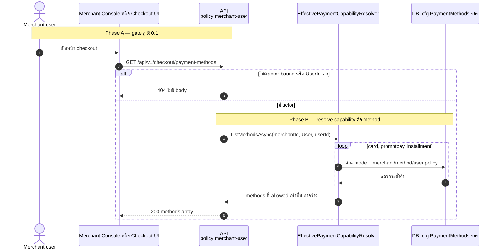
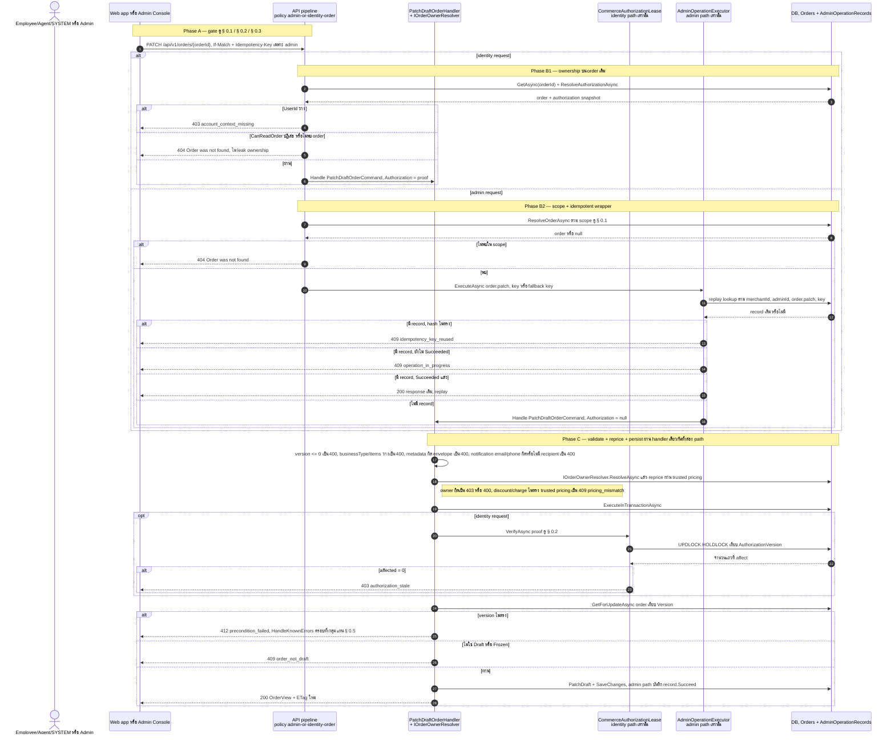
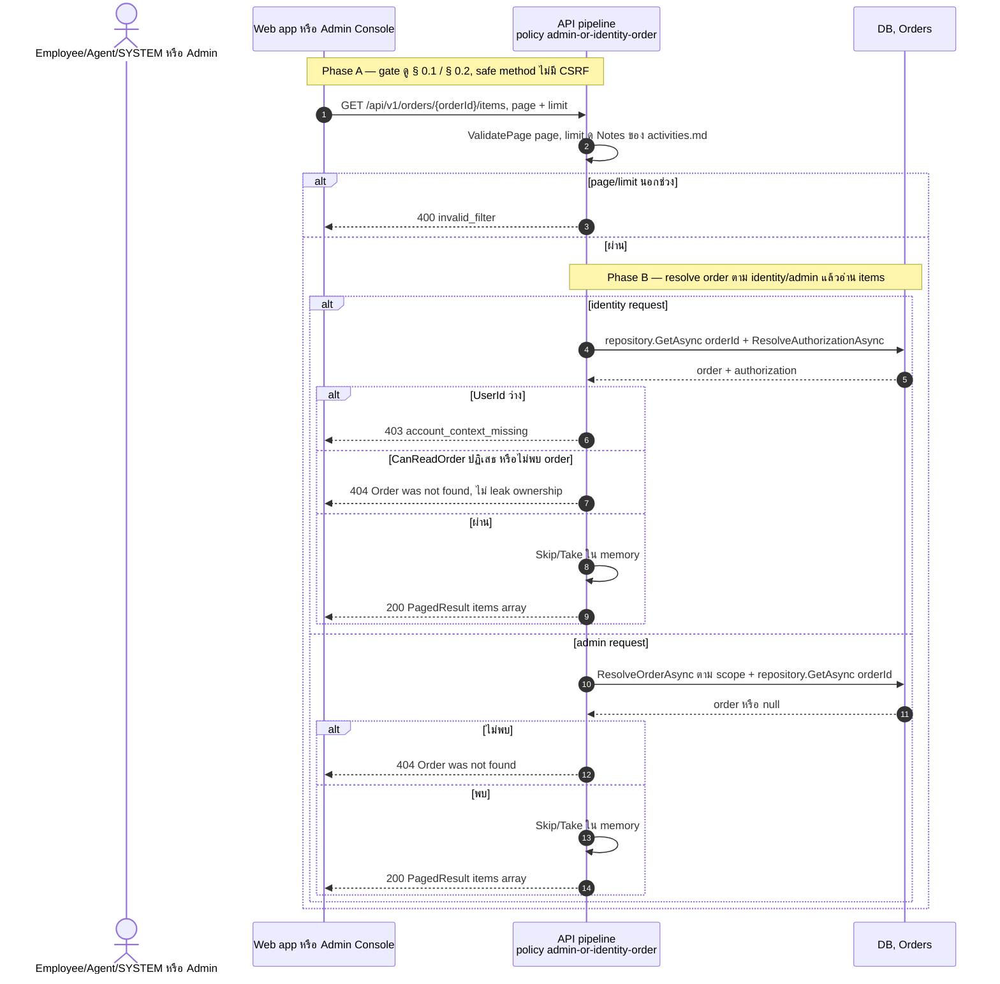
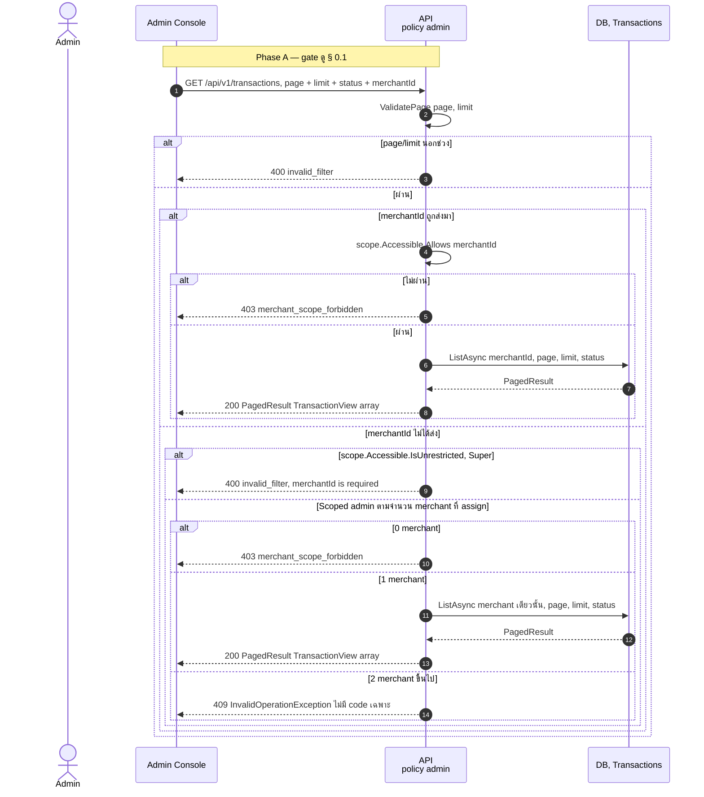
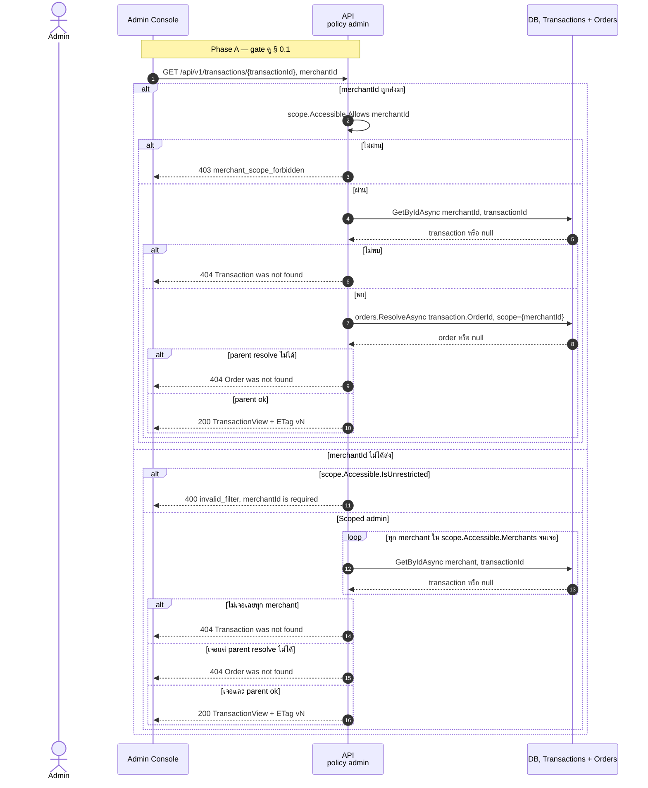
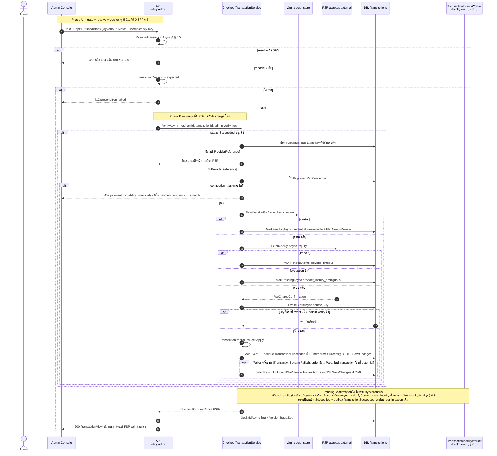
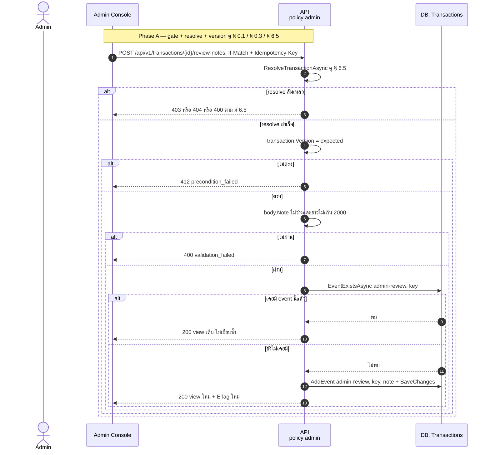

# pol-core API — Canonical commerce และ transactions (Sequence Diagrams)

> Source: `docs/reference/api-endpoints.md` section "Canonical commerce และ transactions" บรรทัด L132-L144 และ source ที่อ้างต่อ § เดียวกับ `06-canonical-commerce-transactions.activities.md` (หมายเลข § ตรงกัน)
> Scope: 9 endpoints เดียวกับไฟล์ activities แสดงลำดับข้าม actor / API / Application handler / DB / PSP
> Generated: 2026-09-14

| § | Diagram | Endpoints |
| --- | --- | --- |
| 6.1 | รายการ Payment methods ของ Checkout | `GET /api/v1/checkout/payment-methods` |
| 6.2 | แก้ไข Draft Order (dual identity/admin) | `PATCH /api/v1/orders/{orderId:guid}` |
| 6.3 | อ่าน Order child resources (items + history) | `GET /api/v1/orders/{orderId:guid}/items` + 1 composed |
| 6.4 | รายการ Transaction ตาม Merchant scope | `GET /api/v1/transactions` |
| 6.5 | อ่าน Transaction + events ตาม parent visibility | `GET /api/v1/transactions/{transactionId:guid}` + 1 composed |
| 6.6 | ตรวจสอบ Transaction กับ PSP (admin verify) | `POST /api/v1/transactions/{transactionId:guid}/verify` |
| 6.7 | เพิ่ม Transaction review note (idempotent) | `POST /api/v1/transactions/{transactionId:guid}/review-notes` |

---

## 6.1 รายการ Payment methods ของ Checkout

---

## 6.2 แก้ไข Draft Order (dual identity/admin)

---

## 6.3 อ่าน Order child resources (items + history)

`GET /api/v1/orders/{orderId:guid}/history` ใช้ gate และ branch identity/admin เดียวกันทุกประการ ต่างเพียงไม่มี page/limit และคืน `[{status, occurredAt}]` แทน items — ไม่วาดซ้ำ ดูตาราง flow ประกอบใน activities.md

---

## 6.4 รายการ Transaction ตาม Merchant scope

---

## 6.5 อ่าน Transaction + events ตาม parent visibility

`GET .../events` ใช้ resolve เดียวกันทุกประการ แล้วเรียก `ListEventsAsync` แทนการคืน view เดียว และไม่มี ETag — ดูตาราง flow ประกอบใน activities.md

---

## 6.6 ตรวจสอบ Transaction กับ PSP (admin verify)

---

## 6.7 เพิ่ม Transaction review note (idempotent)

## Notes

- Deviations ของ theme นี้อยู่ใน `06-canonical-commerce-transactions.activities.md` ทั้งหมด ไฟล์นี้ไม่ซ้ำ
- § 0.8 (background dispatch) เป็น cross-cutting mechanic กลาง ไม่วาด drain loop ซ้ำใน § 6.6 ดู `00-cross-cutting.sequences.md`
- `POST .../verify` ที่ผลเป็น `PendingConfirmation` ไม่ใช่จุดจบ: `TransactionInquiryWorker` (ดู § 0.8) ดึงไปเรียก `VerifyAsync(source="inquiry")` ซ้ำเองในพื้นหลังตาม `NextInquiryAt` รายละเอียดครบใน `06-canonical-commerce-transactions.activities.md`

**Render**: GitHub / Obsidian / VS Code Mermaid
