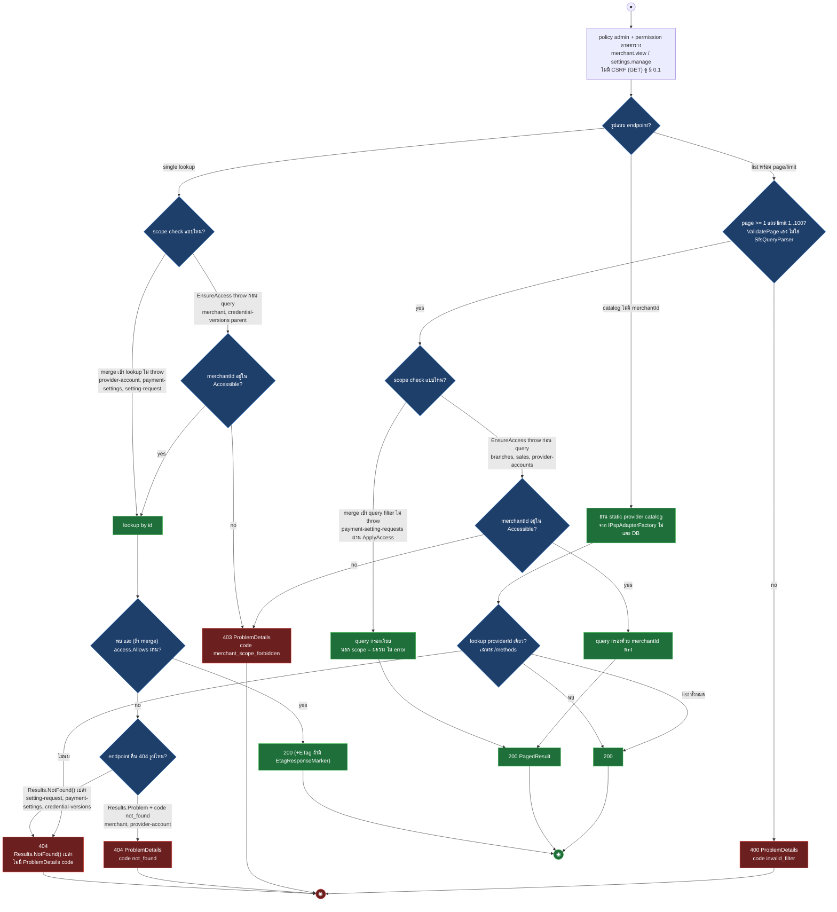
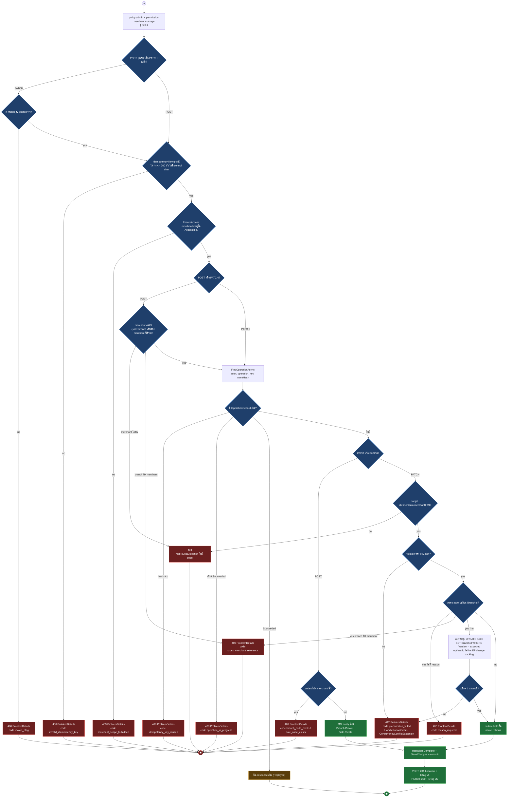
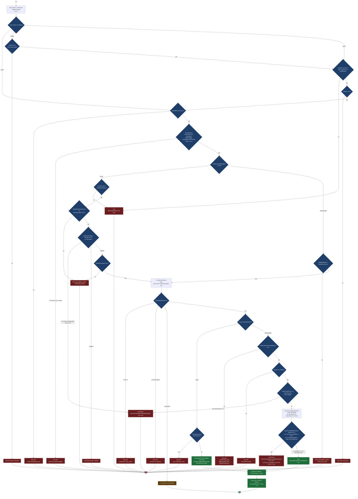
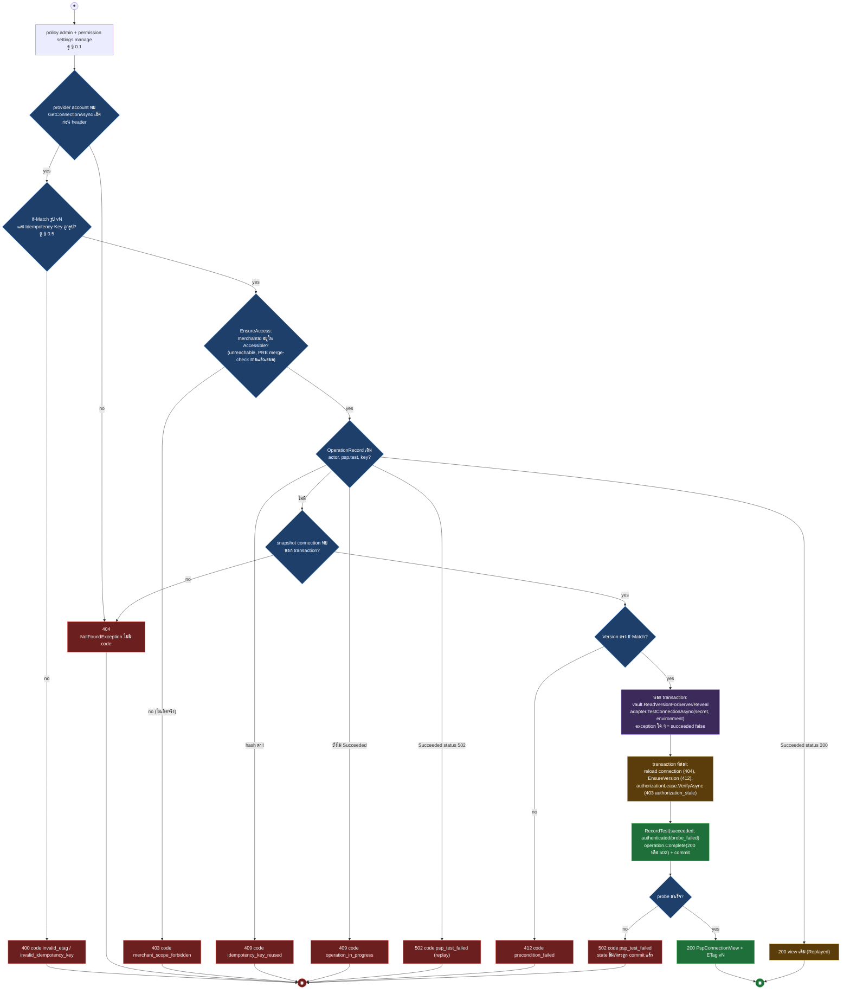
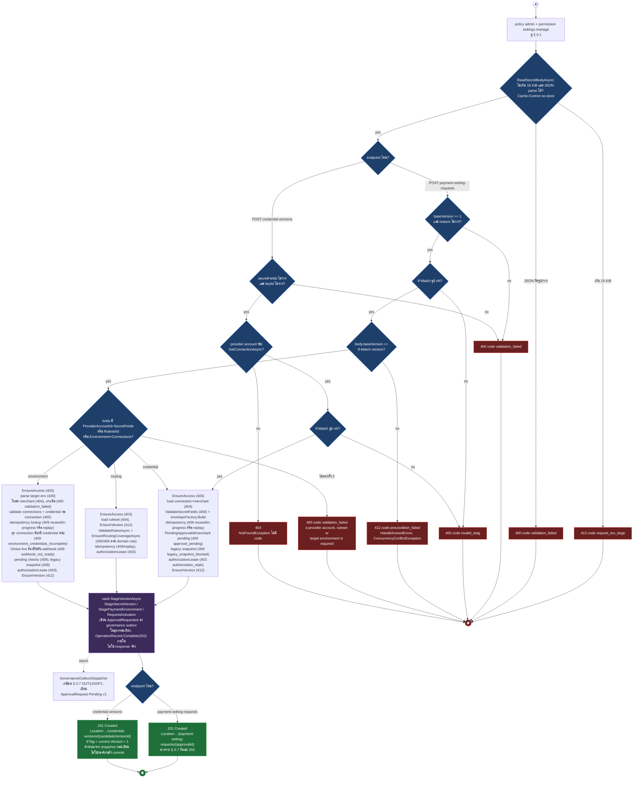
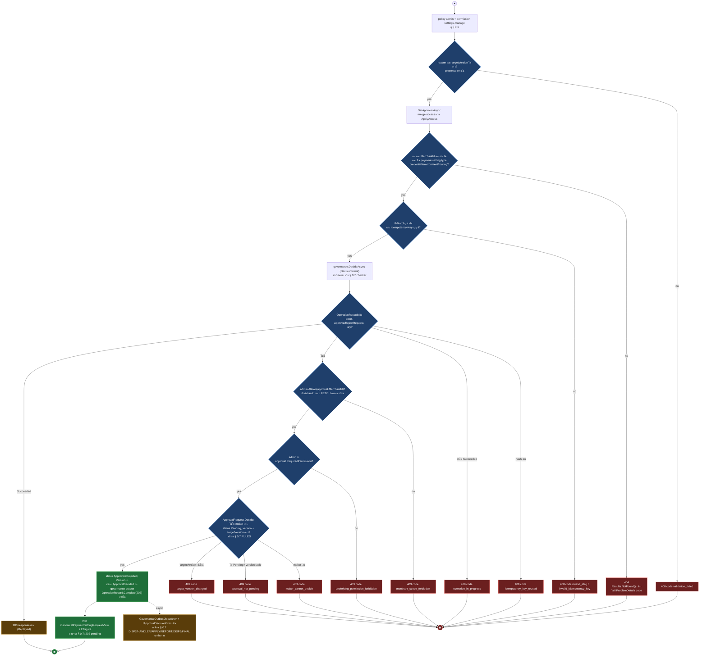

# pol-core API — Canonical control plane (Activity Diagrams)

> Source: `docs/reference/api-endpoints.md` section "Canonical control plane" บรรทัด L146-L173 และ source ที่อ้างต่อ § (`src/Api/Api/ControlPlane/CanonicalMerchantConfigurationEndpoints.cs`, `src/Api/Api/ControlPlane/CanonicalProviderConfigurationEndpoints.cs`, `src/Infrastructure/Persistence/Persistence.ControlPlane/Merchants/AdminMerchantControlStore.cs`, `Persistence.ControlPlane/Payments/AdminPaymentsControlStore.cs`, `Persistence.ControlPlane/Governance/GovernanceStore.cs`, `src/Api/Api/ConcurrencyEtags.cs`, `src/Api/BuildingBlocks.Web/ProblemDetailsExceptionHandler.cs`)
> Scope: 24 endpoint ใต้ `/api/v1/merchants/{merchantId}/*` และ `/api/v1/payment-providers/*` ครอบ Merchant/Branch/Sale master data, Provider Account (configuration, credential, test, disable), payment setting maker-checker และ payment provider catalog
> Generated: 2026-09-14

| § | Diagram | Endpoints |
| --- | --- | --- |
| 7.1 | อ่าน Merchant / Branch / Sale / Provider Account / catalog (single + list) | `GET /api/v1/merchants/{merchantId:guid}`, `GET /api/v1/merchants/{merchantId:guid}/branches`, `GET /api/v1/merchants/{merchantId:guid}/payment-setting-requests`, `GET /api/v1/merchants/{merchantId:guid}/payment-setting-requests/{requestId:guid}`, `GET /api/v1/merchants/{merchantId:guid}/payment-settings`, `GET /api/v1/merchants/{merchantId:guid}/provider-accounts`, `GET /api/v1/merchants/{merchantId:guid}/provider-accounts/{providerAccountId:guid}`, `GET /api/v1/merchants/{merchantId:guid}/provider-accounts/{providerAccountId:guid}/credential-versions`, `GET /api/v1/merchants/{merchantId:guid}/sales`, `GET /api/v1/payment-providers`, `GET /api/v1/payment-providers/{providerId:guid}/methods` |
| 7.2 | เขียน Merchant / Branch / Sale (create + patch) | `PATCH /api/v1/merchants/{merchantId:guid}`, `POST /api/v1/merchants/{merchantId:guid}/branches`, `PATCH /api/v1/merchants/{merchantId:guid}/branches/{branchId:guid}`, `POST /api/v1/merchants/{merchantId:guid}/sales`, `PATCH /api/v1/merchants/{merchantId:guid}/sales/{saleId:guid}` |
| 7.3 | เขียน Provider Account (create / patch / disable) | `POST /api/v1/merchants/{merchantId:guid}/provider-accounts`, `PATCH /api/v1/merchants/{merchantId:guid}/provider-accounts/{providerAccountId:guid}`, `POST /api/v1/merchants/{merchantId:guid}/provider-accounts/{providerAccountId:guid}/disable` |
| 7.4 | ทดสอบการเชื่อมต่อ Provider Account | `POST /api/v1/merchants/{merchantId:guid}/provider-accounts/{providerAccountId:guid}/connection-tests` |
| 7.5 | สร้างคำขอเปลี่ยน payment setting (maker) | `POST /api/v1/merchants/{merchantId:guid}/payment-setting-requests`, `POST /api/v1/merchants/{merchantId:guid}/provider-accounts/{providerAccountId:guid}/credential-versions` |
| 7.6 | อนุมัติ / ปฏิเสธ payment setting request (checker) | `POST /api/v1/merchants/{merchantId:guid}/payment-setting-requests/{requestId:guid}/approve`, `POST /api/v1/merchants/{merchantId:guid}/payment-setting-requests/{requestId:guid}/reject` |

---

## 7.1 อ่าน Merchant / Branch / Sale / Provider Account / catalog

ทุก GET ผ่าน gate เดียว (permission ตามตาราง ไม่มี CSRF) แล้วต่างกันที่มี pagination หรือไม่ และ scope check เป็น explicit throw หรือ merge เข้ากับ lookup เงียบ ๆ ซึ่งกำหนดว่า 403 เกิดได้จริงหรือถูกซ่อนเป็น 404 (source: `CanonicalMerchantConfigurationEndpoints.cs:28-49,84-105,164-186,278-282`, `CanonicalProviderConfigurationEndpoints.cs:32-55,59-74,100-119,149-162,246-267,272-308,450-454`, `AdminMerchantControlStore.cs:115-122,171-188,247-266,637-641`, `AdminPaymentsControlStore.cs:50-60,62-96,98-107,109-135,2129-2133`, `GovernanceStore.cs:23-70`)

| Method | fullPath | ต่างจาก § กลางตรงไหน |
| --- | --- | --- |
| GET | `/api/v1/merchants/{merchantId:guid}` | single, `EnsureAccess` throw ก่อน query -> 403, ไม่พบ = Problem 404 code `not_found`, สำเร็จ = 200 + ETag (`GetMerchantAsync` `AdminMerchantControlStore.cs:115-122`) |
| GET | `/api/v1/merchants/{merchantId:guid}/branches` | list, `EnsureAccess` throw -> 403, `ValidatePage` 400 `invalid_filter`, ไม่เช็คว่า merchant ยังอยู่จริง (merchant ถูกลบก็คืน 200 ว่าง) (`ListBranchesAsync` `AdminMerchantControlStore.cs:171-188`) |
| GET | `/api/v1/merchants/{merchantId:guid}/payment-setting-requests` | list, ไม่มี `EnsureAccess` (กรองเงียบผ่าน `ApplyAccess`), `ValidatePage` 400 `invalid_filter`, paging ทำ 2 ชั้น: ดึง governance 100 แถวแรกก่อนแล้ว filter ประเภทและ skip/take เอง — merchant ที่มี approval รวมเกิน 100 รายการจะเห็น page ถัดไปขาดหาย (`GovernanceStore.ListApprovalsAsync:23-62`, endpoint `CanonicalProviderConfigurationEndpoints.cs:272-290`) |
| GET | `/api/v1/merchants/{merchantId:guid}/payment-setting-requests/{requestId:guid}` | single, merge access ผ่าน `ApplyAccess` ใน `GetApprovalAsync`, merchantId ไม่ตรง route หรือไม่ใช่ payment-setting type = `Results.NotFound()` เปล่าเหมือนไม่พบ (`CanonicalProviderConfigurationEndpoints.cs:292-308`, `GovernanceStore.cs:64-70`) |
| GET | `/api/v1/merchants/{merchantId:guid}/payment-settings` | single ไม่มี id ปลาย, merge access+existence เป็น bool เดียวใน `MerchantExistsForAccessAsync` (403 ไม่เคยเกิดจริง เห็นแต่ 404 เปล่า), ประกอบ view จาก 3 store: environment, effective methods, simple routing (`AdminPaymentsControlStore.cs:50-60`, endpoint `CanonicalProviderConfigurationEndpoints.cs:246-267`) |
| GET | `/api/v1/merchants/{merchantId:guid}/provider-accounts` | list, `EnsureAccess` throw -> 403, `ValidatePage` 400 `invalid_filter` (`ListConnectionsAsync` `AdminPaymentsControlStore.cs:62-96`) |
| GET | `/api/v1/merchants/{merchantId:guid}/provider-accounts/{providerAccountId:guid}` | single, merge access ใน `GetConnectionAsync` (`access.Allows` คืน null ถ้าไม่ผ่าน ไม่ throw), ไม่พบ = Problem 404 code `not_found` (endpoint เขียนเองไม่ผ่าน exception), สำเร็จ = 200 + ETag ไม่คืน secret (`AdminPaymentsControlStore.cs:98-107`) |
| GET | `/api/v1/merchants/{merchantId:guid}/provider-accounts/{providerAccountId:guid}/credential-versions` | single (parent), `EnsureAccess` throw -> 403, connection ไม่พบ = `Results.NotFound()` เปล่า (ผสม throw + bare), คืนเฉพาะ version/state/masked hint ไม่คืน plaintext (`ListCredentialVersionsAsync` `AdminPaymentsControlStore.cs:109-135`) |
| GET | `/api/v1/merchants/{merchantId:guid}/sales` | list, `EnsureAccess` throw -> 403, `ValidatePage` 400 `invalid_filter`, filter เพิ่ม `branchId` ได้ (`ListSalesAsync` `AdminMerchantControlStore.cs:247-266`) |
| GET | `/api/v1/payment-providers` | catalog ไม่มี merchantId ไม่มี scope check เลย, คืนเสมอ 200 รายชื่อ provider คงที่ 2 ตัว (2c2p, Omise) จาก `IPspAdapterFactory` (`CanonicalProviderConfigurationEndpoints.cs:34-42,397-416`) |
| GET | `/api/v1/payment-providers/{providerId:guid}/methods` | catalog + lookup เดียว ไม่มี scope check, providerId ไม่อยู่ใน catalog คงที่ = `Results.NotFound()` เปล่า (`CanonicalProviderConfigurationEndpoints.cs:44-54`) |

---

## 7.2 เขียน Merchant / Branch / Sale (create + patch)

POST (สร้าง) ไม่ต้องมี `If-Match`, ตรวจ parent + duplicate code เป็น 409, ส่วน PATCH (แก้) ต้องมี `If-Match` และโหลด target ก่อนเช็ค version — ทั้งกลุ่มมี endpoint filter เฉพาะโมดูลที่ map `ConcurrencyConflictException` เป็น **412** ไม่ใช่ 409 ตามค่า default ทั่วระบบ (source: `CanonicalMerchantConfigurationEndpoints.cs:26-79,107-159,188-266`, `AdminMerchantControlStore.cs:124-169,190-245,268-344,437-467,630-647`, `ConcurrencyEtags.cs:14-42`)

| Method | fullPath | ต่างจาก § กลางตรงไหน |
| --- | --- | --- |
| PATCH | `/api/v1/merchants/{merchantId:guid}` | KIND=PATCH, ก่อนถึง GATE ต่อไปนี้มีเช็คพิเศษ: `body.MerchantId` (ถ้าส่งมา) ต้องตรง route มิฉะนั้น 400 `validation_failed` ก่อนแม้แต่ header, ไม่มี PARENT check, `LOAD` จาก `db.Merchants`, mutate = `Update()` + `Reactivate()`/`Suspend()` ตาม `body.Status` (`body.Status` ที่ไม่รู้จัก = 400 `invalid_filter` จาก `ParseMerchantStatus`), ไม่มีขั้น MOVE (`PatchMerchantAsync` `AdminMerchantControlStore.cs:124-169,602-615`) |
| POST | `/api/v1/merchants/{merchantId:guid}/branches` | KIND=POST, PARENT = `EnsureMerchantExistsAsync` เท่านั้น, DUP = code ซ้ำใน Branches, CREATE = `Branch.Create` (`CreateBranchAsync` `AdminMerchantControlStore.cs:190-213`) |
| PATCH | `/api/v1/merchants/{merchantId:guid}/branches/{branchId:guid}` | KIND=PATCH, `LOAD` จาก `db.Branches` ตรง branchId+merchantId, ไม่มีขั้น MOVE, mutate = `Rename`/`Enable`/`Disable` ตาม `body.Status` (ไม่รู้จัก = 400 `invalid_filter` จาก `ParseBranchStatus`) (`UpdateBranchAsync` `AdminMerchantControlStore.cs:215-245,616-622`) |
| POST | `/api/v1/merchants/{merchantId:guid}/sales` | KIND=POST, PARENT = `EnsureMerchantExistsAsync` + `EnsureBranchAsync` (branch ต้องเป็นของ merchant นี้), DUP = code ซ้ำใน Sales, CREATE = `Sale.Create` ผูก BranchId (`CreateSaleAsync` `AdminMerchantControlStore.cs:268-292`) |
| PATCH | `/api/v1/merchants/{merchantId:guid}/sales/{saleId:guid}` | KIND=PATCH, มีขั้น MOVE เต็ม: เปลี่ยน BranchId ต้องมี reason + `EnsureBranchAsync` + raw SQL optimistic update (ไม่ผ่าน EF), mutate อื่น = `Rename`/`Enable`/`Disable` ตาม `body.Status` (ไม่รู้จัก = 400 `invalid_filter` จาก `ParseSaleStatus`) (`UpdateSaleAsync` `AdminMerchantControlStore.cs:294-344,623-629`) |

---

## 7.3 เขียน Provider Account (create / patch / disable)

header/existence gate เหมือนกันทั้งสาม, แต่ validation อยู่ *ก่อน* idempotency lookup เสมอ (hash ต้องคำนวณจากค่าที่ validate แล้ว) — ดู Notes แถว "โอกาส 500" สำหรับ bug จริงที่พบใน patch/disable (source: `CanonicalProviderConfigurationEndpoints.cs:76-241`, `AdminPaymentsControlStore.cs:577-666,1606-1642,1678-1695,2129-2139`, `Connection.cs:97-102`)

| Method | fullPath | ต่างจาก § กลางตรงไหน |
| --- | --- | --- |
| POST | `/api/v1/merchants/{merchantId:guid}/provider-accounts` | KIND=create, ไม่มี `If-Match`, ไม่มี PRE-check (ไม่มี id ปลาย), เริ่ม `IsEnabled=false` และ `methods=[]` จึงไม่โดน SYNC bug (`CreateProviderAccountAsync` `AdminPaymentsControlStore.cs:577-627`) |
| PATCH | `/api/v1/merchants/{merchantId:guid}/provider-accounts/{providerAccountId:guid}` | KIND=patch, `body.IsEnabled` เป็น `bool?` — ไม่ส่งจะ fallback เป็น `current.IsEnabled` ที่อ่านจาก `GetConnectionAsync` ก่อน PATCH (`CanonicalProviderConfigurationEndpoints.cs:134`) ถ้าส่ง `IsEnabled=true` พร้อม methods valid จะผ่านปกติ, ถ้าส่ง `false` หรือไม่ส่งเลยขณะ `current.IsEnabled=false` (ค่าเริ่มต้นเสมอหลังสร้าง) พร้อม `EnabledMethods` ไม่ว่าง จะชน SYNC bug (500) เหมือนกันทั้งสองกรณี เพราะ `intent.IsEnabled` ตกเป็น false ทั้งคู่ (`UpdateConnectionAsync` `AdminPaymentsControlStore.cs:629-666`) |
| POST | `/api/v1/merchants/{merchantId:guid}/provider-accounts/{providerAccountId:guid}/disable` | KIND=disable, ต้องมี `Reason` (400 `reason_required`), ส่ง `EnabledMethods`/`Config` เดิมของ account กลับเข้าไปพร้อม `IsEnabled=false` เสมอ — ชน SYNC bug (500) ทุกครั้งที่ account มี method เปิดอยู่จริง ซึ่งเป็นกรณีใช้งานหลักของปุ่ม "หยุดฉุกเฉิน" (`CanonicalProviderConfigurationEndpoints.cs:215-241`) |

---

## 7.4 ทดสอบการเชื่อมต่อ Provider Account

probe adapter นอก transaction ด้วย secret จาก vault ก่อนเปิด transaction ที่สองมาบันทึกผล (health หรือ pending) พร้อม OperationRecord ที่เก็บ status 200/502 ไว้ replay — มีแค่ credential ที่ active เท่านั้น ไม่มี candidate-credential variant เหมือน legacy (source: `CanonicalProviderConfigurationEndpoints.cs:193-213`, `AdminPaymentsControlStore.cs:668-721`, `MerchantRuntimeAuthorizationLease.cs:38`)

---

## 7.5 สร้างคำขอเปลี่ยน payment setting (maker)

`/payment-setting-requests` (POST) dispatch เป็น 3 ชนิดตามรูป body (credential / routing / environment) ที่ล้วนจบด้วยเขียน `ApprovalRequested` ลง governance outbox ในธุรกรรมเดียวกับการ stage state เป็น pending — เหมือน § 0.7 OUT1 ทุกประการยกเว้น response code, ส่วน `/provider-accounts/{id}/credential-versions` (POST) เรียกฟังก์ชัน credential-kind เดียวกันตรง ๆ ผ่าน route คนละเส้น (source: `CanonicalProviderConfigurationEndpoints.cs:164-191,270-358`, `AdminPaymentsControlStore.cs:723-796,860-983,1064-1122,1503-1509`, `AdminControlEndpoints.cs:784-817`)

| Method | fullPath | ต่างจาก § กลางตรงไหน |
| --- | --- | --- |
| POST | `/api/v1/merchants/{merchantId:guid}/payment-setting-requests` | dispatch 3 kind ตาม body (credential / routing / environment), ต้องส่ง `baseVersion`+`reason` แยกจาก `If-Match`, mismatch ระหว่างสองค่านี้ = 412 ไม่ใช่ 400, เขียน operation record ภายในเป็น 202 แต่ response จริงคือ 201 Created เสมอ ต่างจากรูปแบบทั่วไปของ § 0.7 ที่ตอบ 202 (`CanonicalProviderConfigurationEndpoints.cs:310-358`) |
| POST | `/api/v1/merchants/{merchantId:guid}/provider-accounts/{providerAccountId:guid}/credential-versions` | เข้าถึง provider account ตรง (ไม่มี `baseVersion`/`reason` แยก), ExpectedVersion มาจาก `If-Match` อย่างเดียว, connection ไม่พบ = 404 เปล่า, ETag คำนวณ `current.Version + 1` จาก snapshot ก่อนเขียน (อาจไม่ตรง state จริงถ้ามีการเปลี่ยนแปลงคั่นกลาง), response 201 Created ไปที่ `credential-versions/{candidateVersionId}`, เรียก `RequestCredentialChangeAsync` ตัวเดียวกับ kind credential ของแถวบน (`CanonicalProviderConfigurationEndpoints.cs:164-191`) |

---

## 7.6 อนุมัติ / ปฏิเสธ payment setting request (checker)

ใช้ `GovernanceStore.DecideAsync` ตัวเดียวกับ § 0.7 (route คนละเส้นจาก `/approvals/{approvalId}`) เข้าถึงผ่าน merchant-scoped path ที่กรอง target type เฉพาะ payment setting — rule/version conflict คืน 409 ตาม § 0.7 เป๊ะ แต่ response สำเร็จเป็น **200** ไม่ใช่ 202 และ validation เป็น presence-only (source: `CanonicalProviderConfigurationEndpoints.cs:364-395`, `GovernanceStore.cs:64-146`)

| Method | fullPath | ต่างจาก § กลางตรงไหน |
| --- | --- | --- |
| POST | `/api/v1/merchants/{merchantId:guid}/payment-setting-requests/{requestId:guid}/approve` | decision = Approve, response 200 (ไม่ใช่ 202 เหมือน § 0.7 ทั่วไป), validation เป็น presence-only (code `validation_failed` ไม่ใช่ `invalid_request` ของ § 0.7) (`MapDecision` `CanonicalProviderConfigurationEndpoints.cs:364-395`) |
| POST | `/api/v1/merchants/{merchantId:guid}/payment-setting-requests/{requestId:guid}/reject` | decision = Reject, ที่เหลือเหมือนแถวบนทุกจุด |

---

## Deviations

ไม่พบ deviation ระหว่างเอกสารกับ source — คอลัมน์ caller/auth policy ของทุก 24 แถวใน `docs/reference/api-endpoints.md` (policy `admin`, permission `merchant.view`/`merchant.manage`/`settings.manage`) ตรงกับ `.RequireAuthorization("admin").RequirePermission(...)` ใน source ทุกตัว; admin เป็น Bearer JWT จึงไม่มี CSRF filter (admin double-submit ถูก retire)

## Notes

| เรื่อง | ข้อเท็จจริงจาก source | source |
| --- | --- | --- |
| 412 ไม่ใช่ 409 | ทั้งสองไฟล์มี `HandleKnownErrors` filter เฉพาะโมดูลที่ catch `ConcurrencyConflictException` แล้วคืน **412 Precondition Failed** code `precondition_failed` แทน 409 Conflict ที่เป็นค่า default ทั่วระบบ — มีผลกับทุก endpoint ใน § 7.2, 7.3, 7.4, 7.5 ที่ตรวจ version | `CanonicalMerchantConfigurationEndpoints.cs:247-266`, `CanonicalProviderConfigurationEndpoints.cs:456-487`, `ProblemDetailsExceptionHandler.cs:77-78` |
| 201 vs 202 (maker) | endpoint maker ทั้งสอง (§ 7.5) ตอบ **201 Created** เสมอ ทั้งที่ domain layer บันทึก `OperationRecord` ด้วย status 202 ภายใน ต่างจากรูปแบบทั่วไปของ § 0.7 (`/approvals`) ที่ endpoint ตอบ 202 ตรง ๆ | `CanonicalProviderConfigurationEndpoints.cs:310-358,164-191` |
| 200 vs 202 (checker) | endpoint approve/reject ของ theme นี้ (§ 7.6) ตอบ 200 ไม่ใช่ 202 ทั้งที่ domain logic (`GovernanceStore.DecideAsync`) เดียวกับ § 0.7 บันทึก 202 ภายในเช่นกัน | `CanonicalProviderConfigurationEndpoints.cs:364-395`, `GovernanceStore.cs:140` |
| 3 รูป 404 | § 7.1 มี 404 อย่างน้อย 3 รูปที่ไม่เหมือนกัน: (a) `Results.Problem(404, code: not_found)` (merchant, provider-account), (b) `NotFoundException` ไม่ใส่ code เลยทำให้ ProblemDetails ไม่มี field `code` (§ 7.2/7.3 เมื่อ load target ไม่เจอ), (c) `Results.NotFound()` เปล่า (setting-request, payment-settings, credential-versions list, provider methods) | `NotFoundException.cs:9-14`, endpoint files ตามตารางแต่ละ § |
| ACCESS หลัง PRE เป็น dead branch (§ 7.3 patch/disable, § 7.4) | endpoint เรียก `store.GetConnectionAsync(providerAccountId, merchantId, Access(scope), ct)` เป็น PRE ก่อนเสมอ ซึ่ง merge-check `access.Allows(row.MerchantId)` ด้วย `access`/`merchantId` ค่าเดียวกับที่ `EnsureAccess` ในสโตร์เมธอดถัดไปจะเช็คซ้ำ — เมื่อ PRE ผ่าน (ไม่ null) `EnsureAccess` ที่ตามมาจึงไม่มีทาง throw ได้อีก นอก scope จะโดน 404 จาก PRE เสมอ ไม่ใช่ 403 (ยกเว้น create ใน § 7.3 ที่ไม่มี PRE มาก่อน จึงยังเกิด 403 จริงได้) Class sweep: § 7.5 node CRED (`RequestCredentialChangeAsync` -> `EnsureAccess` line 727) เป็น dead branch เดียวกันเมื่อเข้าทาง route `POST credential-versions` (CVFOUND ทำ PRE มาก่อนแล้ว) แต่ยังเกิด 403 จริงเมื่อเข้าทาง route `POST payment-setting-requests` kind credential (ไม่มี PRE) — ไม่ปรับ diagram § 7.5 เพราะ fix ของ issue นี้ระบุ scope เฉพาะ § 7.3/7.4 | `AdminPaymentsControlStore.cs:98-107` (`GetConnectionAsync`), เทียบกับ `AdminPaymentsControlStore.cs:633` (`UpdateConnectionAsync`), `:671` (`TestConnectionAsync`), `:727` (`RequestCredentialChangeAsync`); เรียกจาก `CanonicalProviderConfigurationEndpoints.cs:130-131` (PATCH), `:226-227` (disable), `:201-202` (connection-tests), `:175-176` (credential-versions POST, PRE only) |
| โอกาส 500 โดยไม่ตั้งใจ (§ 7.3, code analysis ยังไม่ reproduce) | `SyncAccountMethodsAsync` เรียก `EnsureAccountMethodCanEnable(..., enabled: true)` แบบ literal ไม่ผูกกับ `intent.IsEnabled`, ขณะที่ `connection.Update(...)` set `IsEnabled` ไปก่อนแล้ว — PATCH ที่ตั้ง `IsEnabled=false` พร้อม method เดิม หรือ endpoint `/disable` (ส่ง `EnabledMethods` เดิมกลับเข้าไปเสมอ) โยน `PaymentCapabilityUnavailableException` ที่ไม่ถูก catch ทั้งใน `HandleKnownErrors` ของไฟล์นี้และใน `ProblemDetailsExceptionHandler` กลาง จึงตกเป็น 500 แทนที่จะเป็น 409 ที่ตั้งใจ (legacy `AdminControlEndpoints.cs:1038` catch exception เดียวกันแล้วคืน 409) — ยังไม่ได้ยืนยันด้วยการรันจริง | `AdminPaymentsControlStore.cs:1606-1642,1678-1688`, `Connection.cs:97-102` |
| LoadProviderAsync บน SQL Server | ถ้า `cfg.PaymentProviders` ไม่มีแถวของ psp ที่รองรับ (data ไม่ครบ) ทั้ง POST create (#13, line 588) และ PATCH/disable (#15, #19, line 654) ก็ชน `PaymentCapabilityUnavailableException` ที่ไม่ถูก catch เช่นกัน (500) — เป็น data-integrity edge case ไม่ใช่ path ปกติ | `AdminPaymentsControlStore.cs:588,654,1697-1722` |
| #18 ETag คำนวณจาก snapshot | `POST .../credential-versions` เซ็ต `ETag = current.Version + 1` จากค่าที่อ่านก่อนเขียน ไม่ใช่ version จริงหลัง commit — ถ้ามี mutation อื่นแทรกกลางทาง ETag ที่ส่งกลับอาจไม่ตรง resource จริง | `CanonicalProviderConfigurationEndpoints.cs:164-191` |
| #6 paging สองชั้น | `GET .../payment-setting-requests` ดึง governance approvals หน้าแรก 100 แถวก่อนแล้ว filter type + skip/take เอง — merchant ที่มี approval (ทุกประเภทรวมกัน) เกิน 100 รายการจะเห็นหน้าถัดไปของ payment-setting request ขาดหายแม้ query page/limit จะถูกต้อง | `GovernanceStore.cs:23-62`, `CanonicalProviderConfigurationEndpoints.cs:272-290` |
| catalog คงที่ในโค้ด | payment provider catalog (#23, #24) เป็นค่าคงที่ในโค้ด (2c2p, Omise) ไม่ได้มาจาก DB การเพิ่ม provider ใหม่ต้องแก้โค้ดนี้โดยตรง อยู่นอก frame ของ diagram | `CanonicalProviderConfigurationEndpoints.cs:397-416` |
| เลขบรรทัดใน theme file | ไฟล์ theme อ้าง L148-L171 แต่แถวจริงของ 24 endpoint ในเอกสารอยู่ L150-L173 (section heading L146, table header L148, เลื่อน 2 บรรทัด) เนื้อหาแถวตรงกันทุกคอลัมน์ | `docs/reference/api-endpoints.md:146-173` |

**Render**: GitHub / Obsidian / VS Code Mermaid
