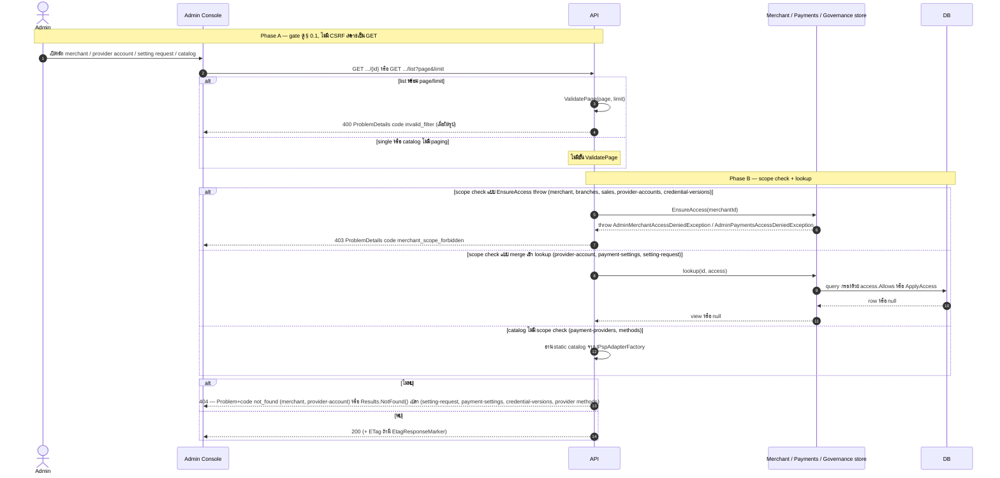
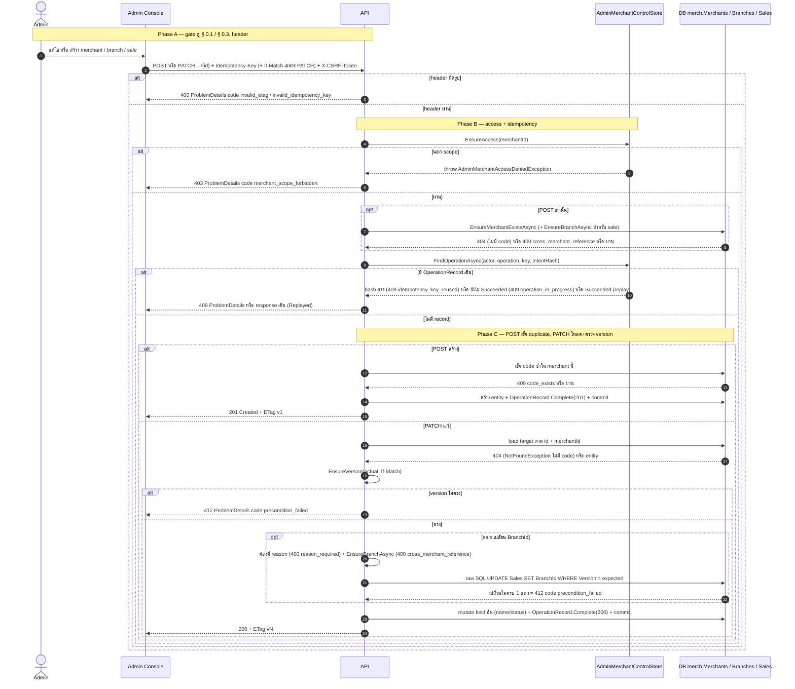
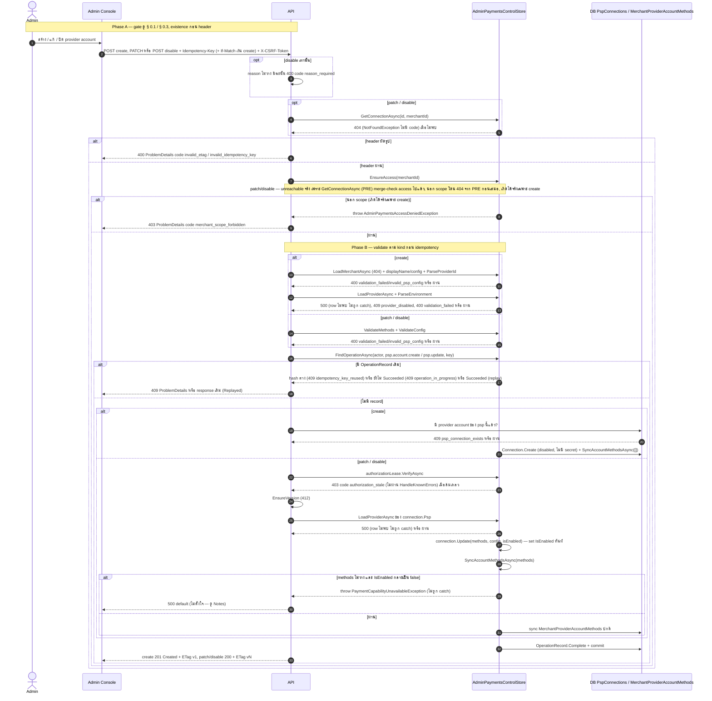
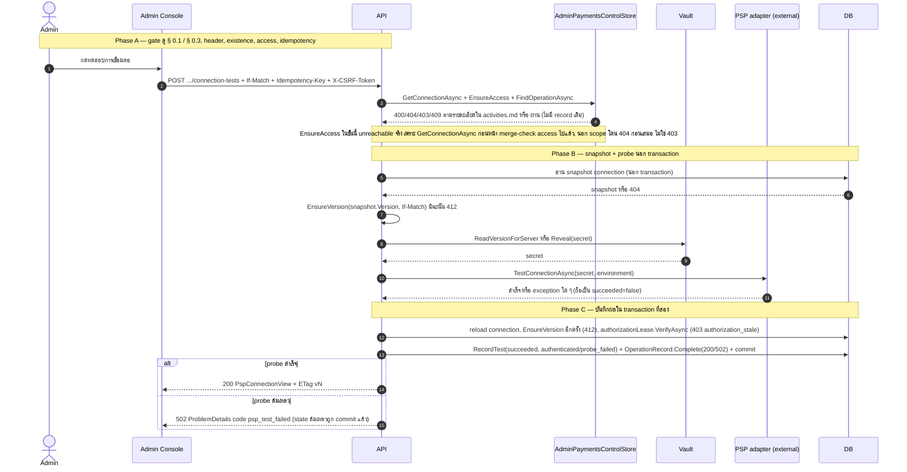
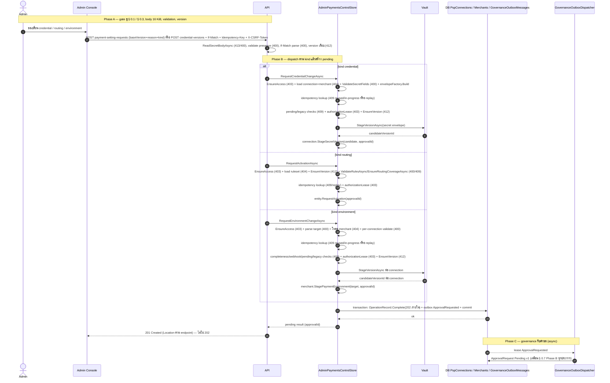
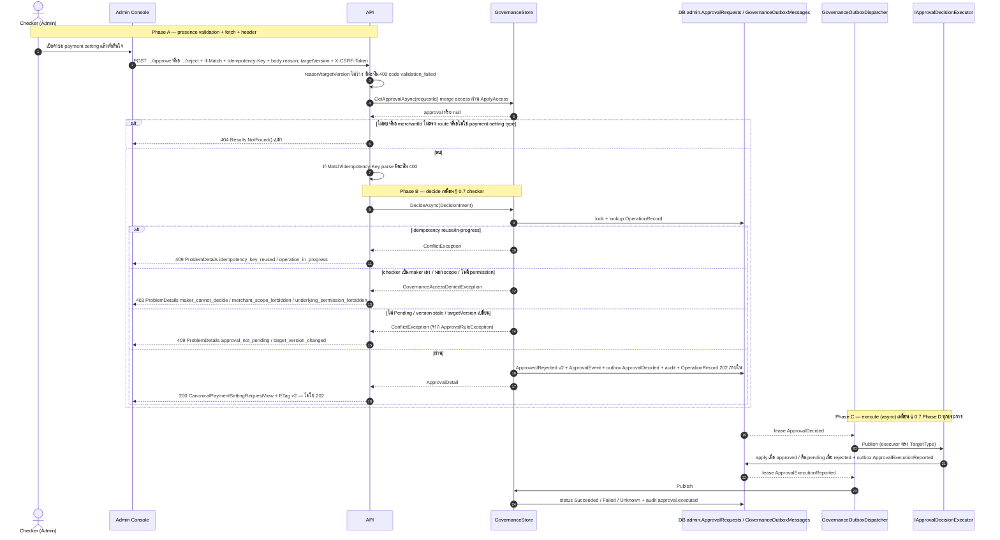

# pol-core API — Canonical control plane (Sequence Diagrams)

> Source: `docs/reference/api-endpoints.md` section "Canonical control plane" บรรทัด L146-L173 และ source ที่อ้างต่อ § (`src/Api/Api/ControlPlane/CanonicalMerchantConfigurationEndpoints.cs`, `src/Api/Api/ControlPlane/CanonicalProviderConfigurationEndpoints.cs`, `src/Infrastructure/Persistence/Persistence.ControlPlane/Merchants/AdminMerchantControlStore.cs`, `Persistence.ControlPlane/Payments/AdminPaymentsControlStore.cs`, `Persistence.ControlPlane/Governance/GovernanceStore.cs`)
> Scope: 6 § เดียวกับ `07-canonical-control-plane.activities.md` (หมายเลข § ตรงกัน) แสดงลำดับข้าม Console / API / Store / DB / Vault / PSP / Governance outbox
> Generated: 2026-09-14

| § | Diagram | Endpoints |
| --- | --- | --- |
| 7.1 | อ่าน Merchant / Branch / Sale / Provider Account / catalog (single + list) | `GET /api/v1/merchants/{merchantId:guid}`, `GET /api/v1/merchants/{merchantId:guid}/branches`, `GET /api/v1/merchants/{merchantId:guid}/payment-setting-requests`, `GET /api/v1/merchants/{merchantId:guid}/payment-setting-requests/{requestId:guid}`, `GET /api/v1/merchants/{merchantId:guid}/payment-settings`, `GET /api/v1/merchants/{merchantId:guid}/provider-accounts`, `GET /api/v1/merchants/{merchantId:guid}/provider-accounts/{providerAccountId:guid}`, `GET /api/v1/merchants/{merchantId:guid}/provider-accounts/{providerAccountId:guid}/credential-versions`, `GET /api/v1/merchants/{merchantId:guid}/sales`, `GET /api/v1/payment-providers`, `GET /api/v1/payment-providers/{providerId:guid}/methods` |
| 7.2 | เขียน Merchant / Branch / Sale (create + patch) | `PATCH /api/v1/merchants/{merchantId:guid}`, `POST /api/v1/merchants/{merchantId:guid}/branches`, `PATCH /api/v1/merchants/{merchantId:guid}/branches/{branchId:guid}`, `POST /api/v1/merchants/{merchantId:guid}/sales`, `PATCH /api/v1/merchants/{merchantId:guid}/sales/{saleId:guid}` |
| 7.3 | เขียน Provider Account (create / patch / disable) | `POST /api/v1/merchants/{merchantId:guid}/provider-accounts`, `PATCH /api/v1/merchants/{merchantId:guid}/provider-accounts/{providerAccountId:guid}`, `POST /api/v1/merchants/{merchantId:guid}/provider-accounts/{providerAccountId:guid}/disable` |
| 7.4 | ทดสอบการเชื่อมต่อ Provider Account | `POST /api/v1/merchants/{merchantId:guid}/provider-accounts/{providerAccountId:guid}/connection-tests` |
| 7.5 | สร้างคำขอเปลี่ยน payment setting (maker) | `POST /api/v1/merchants/{merchantId:guid}/payment-setting-requests`, `POST /api/v1/merchants/{merchantId:guid}/provider-accounts/{providerAccountId:guid}/credential-versions` |
| 7.6 | อนุมัติ / ปฏิเสธ payment setting request (checker) | `POST /api/v1/merchants/{merchantId:guid}/payment-setting-requests/{requestId:guid}/approve`, `POST /api/v1/merchants/{merchantId:guid}/payment-setting-requests/{requestId:guid}/reject` |

---

## 7.1 อ่าน Merchant / Branch / Sale / Provider Account / catalog

sequence เดียวครอบทุก GET ของ theme — ต่างกันที่มี paging หรือไม่ และ scope check เป็น throw หรือ merge เงียบ (ดูรายละเอียดต่อ endpoint ใน activities.md) (source เดียวกับ § 7.1 ของ activities.md)

---

## 7.2 เขียน Merchant / Branch / Sale (create + patch)

POST ตรวจ parent + duplicate code เป็น 409, PATCH โหลด target ก่อนแล้วเทียบ version — version ไม่ตรงในกลุ่มนี้ตอบ **412** เสมอ (endpoint filter เฉพาะโมดูล ไม่ใช่ 409 ของ § 0.5 ทั่วไป) (source: `CanonicalMerchantConfigurationEndpoints.cs:26-266`, `AdminMerchantControlStore.cs:124-344`)

---

## 7.3 เขียน Provider Account (create / patch / disable)

create เริ่ม disabled ไม่มี method จึงไม่ชน bug ด้านล่าง, validate เสมอก่อน idempotency lookup (hash ต้องใช้ค่าที่ validate แล้ว), patch/disable ผ่าน `authorizationLease` ก่อน sync methods — sync methods ที่ตั้ง `IsEnabled=false` พร้อม method เดิมโยน exception ที่ไม่ถูก catch (500) ดูรายละเอียดใน Notes ของ activities.md (source: `CanonicalProviderConfigurationEndpoints.cs:76-241`, `AdminPaymentsControlStore.cs:577-666,1606-1642`)

---

## 7.4 ทดสอบการเชื่อมต่อ Provider Account

probe เกิดนอก transaction ก่อนเปิด transaction ที่สองมาบันทึกผล เพื่อไม่ถือ lock ระหว่างรอ PSP ตอบ (source: `CanonicalProviderConfigurationEndpoints.cs:193-213`, `AdminPaymentsControlStore.cs:668-721`)

---

## 7.5 สร้างคำขอเปลี่ยน payment setting (maker)

`/payment-setting-requests` dispatch 3 kind จาก body shape แล้วทุก kind จบด้วยเขียน `ApprovalRequested` ลง governance outbox ในธุรกรรมเดียวกับ stage state — `/credential-versions` เรียก kind credential ตัวเดียวกันตรง ๆ ผ่าน route คนละเส้น ทั้งคู่ตอบ **201** ไม่ใช่ 202 (source: `CanonicalProviderConfigurationEndpoints.cs:164-358`, `AdminPaymentsControlStore.cs:723-1122`)

---

## 7.6 อนุมัติ / ปฏิเสธ payment setting request (checker)

route merchant-scoped คนละเส้นจาก `/approvals/{approvalId}` แต่เรียก `GovernanceStore.DecideAsync` ฟังก์ชันเดียวกับ § 0.7 — rule/version conflict คืน 409 ตาม § 0.7 เป๊ะ ต่างที่ response สำเร็จเป็น 200 ไม่ใช่ 202 (source: `CanonicalProviderConfigurationEndpoints.cs:364-395`, `GovernanceStore.cs:64-146`)

## Notes

- Deviations และข้อสังเกตเรื่อง status code (412, 201/202, 200/202, 3 รูป 404, bug 500 ของ SyncAccountMethodsAsync, ETag ของ #18, paging 2 ชั้นของ #6, ACCESS หลัง PRE เป็น dead branch ใน § 7.3 patch/disable และ § 7.4) อยู่ใน `07-canonical-control-plane.activities.md` — ไฟล์นี้อ้างกลับแทนการเขียนซ้ำ
- § 7.1 วาดเป็น sequence กลางเดียวครอบ 11 endpoint ตามตาราง flow ประกอบใน activities.md แทนการแยก lifeline ต่อ endpoint

**Render**: GitHub / Obsidian / VS Code Mermaid
