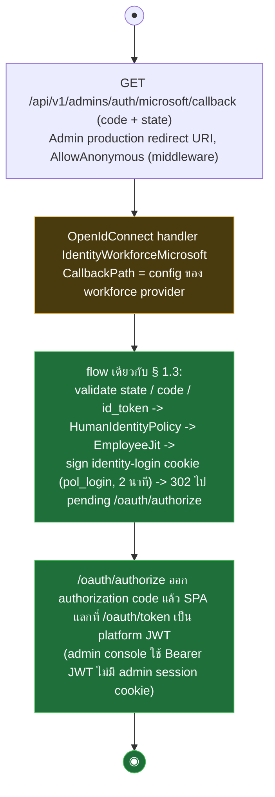

# pol-core API — Admin OIDC callback (Activity Diagrams)

> Source: `docs/reference/api-endpoints.md` section "OIDC callback ที่ middleware จัดการ" และ source ที่อ้างต่อ § (`src/Api/Api/IdentityAccess/IdentityAccessWiring.cs`, `WorkforceClientRegistration.cs`, `src/Api/Api/Program.cs`)
> Scope: legacy admin identity plane (`/api/v1/admins/**`, 25 route) ถูก retire แบ่งสอง PR — 20 route ลบใน PR #264 (`RetireLegacyAdminIdentityPlane`) และอีก 5 เส้น (`/admins/{id}/sessions`, `/admins/{id}/sessions/{sessionId}`, `/admins/auth/{provider}/login`, `/admins/auth/logout`, `/admins/auth/logout-all`) ลบก่อนใน PR #262 (`RetireAdminSessions`, commit `c483ce88`) — งานเดิมย้ายไป theme อื่นทั้งหมด (ดูตาราง mapping) ไฟล์นี้เหลือเฉพาะ OIDC callback path (`/admins/auth/microsoft/callback`) ที่ยังเป็น middleware จริง 1 เส้น
> Generated: 2026-09-14

| § | Diagram | Endpoints |
| --- | --- | --- |
| 8.1 | Admin (workforce) OIDC callback | `GET /api/v1/admins/auth/microsoft/callback` |

### เดิม theme นี้ครอบ /api/v1/admins/** — ตอนนี้ย้ายไปที่ไหน

admin console เปลี่ยนเป็น Bearer JWT (employee platform token) route `/api/v1/admins/**` ถูกลบทั้งหมด งานเดิม map ไป canonical surface ดังนี้:

| งานเดิม (`/api/v1/admins/**`) | canonical ปัจจุบัน | theme |
| --- | --- | --- |
| list / detail / create / suspend / reactivate / tier / roles / merchant-access ของ admin | `/api/v1/accounts`, `/accounts/{accountId}`, `PATCH /accounts/{accountId}`, `PUT/DELETE /accounts/{accountId}/platform-access` และ `/merchant-access/{merchantId}` | § 2.1, 2.3 |
| `/admins/me` | `GET /api/v1/me`, `/me/access` | § 1.5 |
| `/admins/{id}/sessions`, `/admins/{id}/sessions/{sessionId}` | `GET /api/v1/me/sessions`, `DELETE /me/sessions/{sessionId}` | § 1.5, 1.7 |
| `/admins/auth/logout`, `logout-all` | `POST /api/v1/auth/logout` | § 1.7 |
| `/admins/auth/{provider}/login` | employee เริ่มที่ `GET /oauth/authorize` | § 1.9 |
| `/admins/permissions`, `/admins/roles`, `/admins/roles/{code}` | `GET /api/v1/permissions`, `/api/v1/roles`, `POST /roles`, `GET/PUT /roles/{roleId}` | § 2.1, 2.4 |
| `/admins/merchants/users/{id}/registrations`, `/approve`, `/reject` | `/api/v1/agent-registrations/{id}`, `/attempts/{attemptId}/approve`, `/reject` | § 3.4, 3.5, 3.6 |

---

## 8.1 Admin (workforce) OIDC callback

`GET /api/v1/admins/auth/microsoft/callback` เป็น callback path ของ workforce OIDC scheme `IdentityWorkforceMicrosoft` (Admin production ถูกบังคับให้ใช้ path นี้ผ่าน `ProvisioningGuards.RequireWorkforceAdminProvider`) — flow เดียวกับ employee OIDC callback ใน § 1.3 ทุกประการ (JIT `(microsoft, tid, oid)` -> sign `pol_login` -> กลับ `/oauth/authorize` ออก authorization code) ต่างกันแค่ค่า `CallbackPath` ใน config ของ provider (source: `src/Api/Api/IdentityAccess/IdentityAccessWiring.cs:132-260`, `WorkforceClientRegistration.cs:16,71`, `src/Api/Api/Program.cs:3528-3548`)

> รายละเอียด callback flow เต็ม (policy gate, JIT race, login-error reason) อยู่ที่ § 1.3 ใน `01-identity-bff-oauth.activities.md` — ไฟล์นี้ไม่ทำซ้ำ

---

## Notes

- theme 08 เดิมมี 9 flow ของ `/api/v1/admins/**` ทั้งหมดถูก retire พร้อม legacy admin identity plane (migration `20260914111802_RetireLegacyAdminIdentityPlane`; ตาราง `admin.Users` / `MerchantAccess` / `RoleAssignments` / `AuthAudits` / `Workforce*` ถูก drop) — ดูตาราง mapping ด้านบนว่างานย้ายไป theme ใด
- admin console authenticate ด้วย employee platform token (Bearer) ผ่าน `PlatformTokenAuthentication.cs` — ไม่มี cookie / CSRF / `admin_tier` claim (ดู § 0.1); tier Super มาจาก `access.PlatformAccess` active

**Render**: GitHub / Obsidian / VS Code Mermaid
