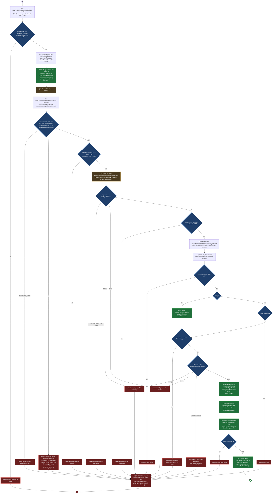
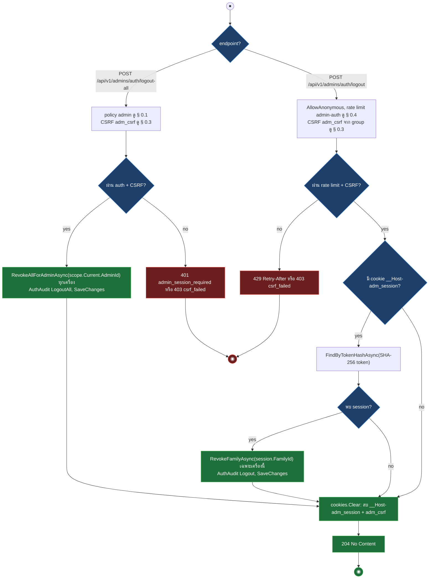
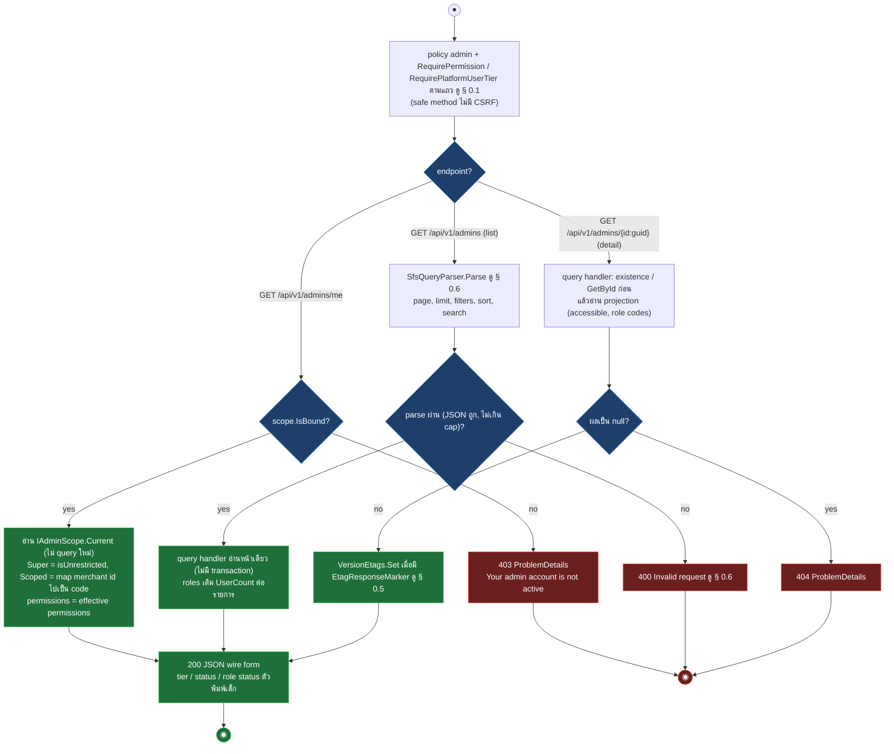
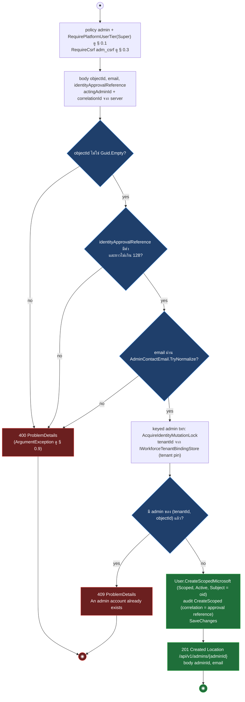
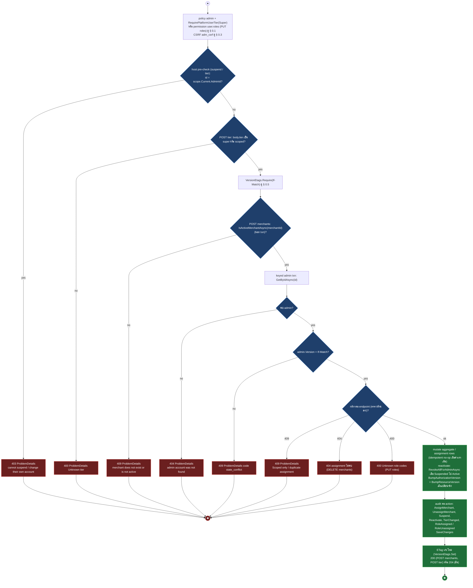
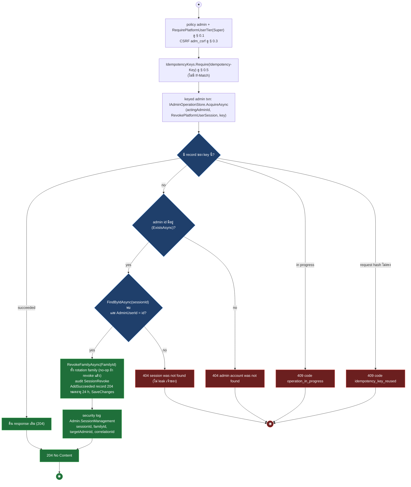
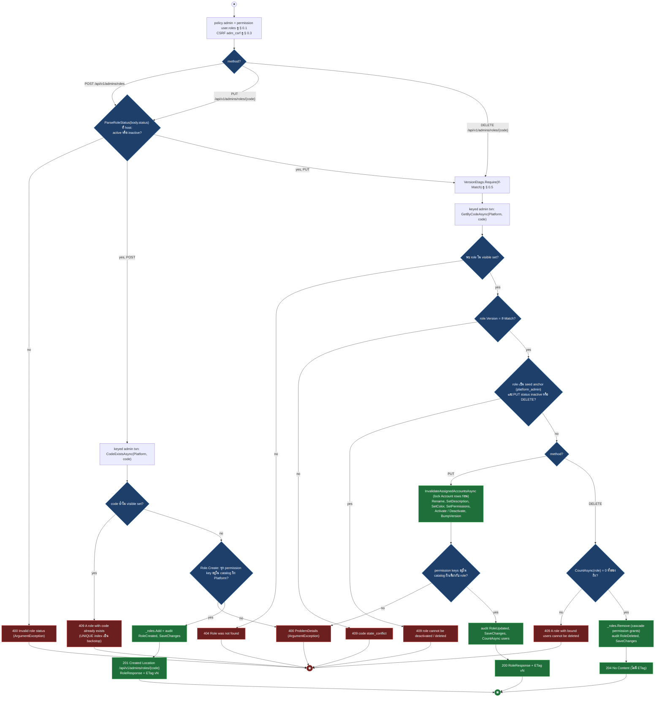
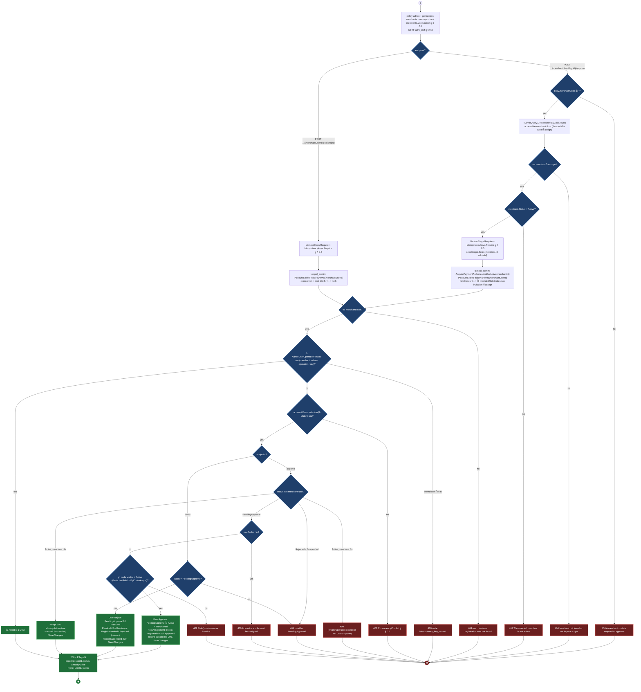
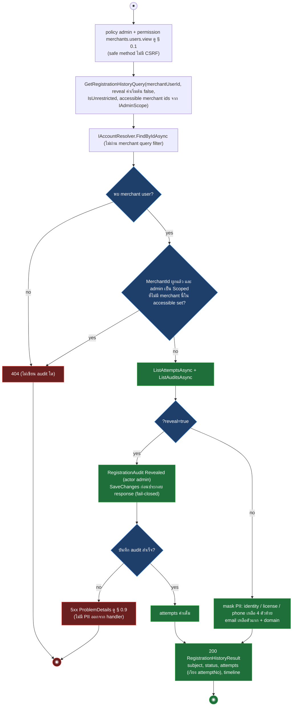

# pol-core API — Admin accounts, roles, sessions และ admin OIDC (Activity Diagrams)

> Source: `docs/reference/api-endpoints.md` section "Admin และ merchant identity" บรรทัด L179-L203 และ section "OIDC callback ที่ middleware จัดการ" บรรทัด L392, source ที่อ้างต่อ § (`src/Api/Api/Program.cs:2418-2496,3148-3706`, `src/Api/Api/Admins/*`, `src/Application/Modules/Admins.Application/Users/*`, `Iam.Application/Roles/*`, `Merchants.Application/Users/ApproveReject.cs`, `GetRegistrationHistory.cs`)
> Scope: 26 endpoints — admin OIDC login + middleware callback, logout, read model ของ admin / role / session, สร้าง Scoped admin, Super-only account mutations, session revoke, role CRUD, merchant-user approve / reject และ registration history
> Generated: 2026-09-14

| § | Diagram | Endpoints |
| --- | --- | --- |
| 8.1 | Admin OIDC login + middleware callback | `GET /api/v1/admins/auth/{provider}/login`, `GET /api/v1/admins/auth/microsoft/callback` |
| 8.2 | Logout เครื่องนี้ / ทุกเครื่อง | `POST /api/v1/admins/auth/logout`, `POST /api/v1/admins/auth/logout-all` |
| 8.3 | Admin read model (me / list / detail) | `GET /api/v1/admins/me`, `GET /api/v1/admins`, `GET /api/v1/admins/{id:guid}` + 5 composed |
| 8.4 | สร้าง Scoped Microsoft admin แบบ pre-bound | `POST /api/v1/admins` |
| 8.5 | Super account mutations + set roles (If-Match) | `POST /api/v1/admins/{id:guid}/tier` + 5 composed |
| 8.6 | เพิกถอน session family ของ admin (Idempotency-Key) | `DELETE /api/v1/admins/{id:guid}/sessions/{sessionId:guid}` |
| 8.7 | Role CRUD ฝั่ง Platform | `POST /api/v1/admins/roles`, `PUT /api/v1/admins/roles/{code}`, `DELETE /api/v1/admins/roles/{code}` |
| 8.8 | Merchant-user approve / reject โดย admin | `POST .../merchants/users/{merchantUserId:guid}/approve`, `POST .../reject` |
| 8.9 | Registration history พร้อม reveal audit | `GET /api/v1/admins/merchants/users/{merchantUserId:guid}/registrations` |

---

## 8.1 Admin OIDC login + middleware callback

login endpoint ตรวจ provider + returnTo แล้ว Challenge ไป Microsoft, callback ไม่มี endpoint map แต่ OIDC middleware ตรวจ protocol, workforce gate (tid / oid), Graph employeeId แล้วให้ LoginService JIT provision + สร้าง session ใน keyed admin transaction ก่อน 302 กลับ SPA, ทุก denial เขียน AuthDenied audit บน scope ใหม่แล้ว 302 ไป error page (source: `src/Api/Api/Program.cs:2425-2444`, `Admins/OidcAuthentication.cs:91-227`, `Admins/MicrosoftWorkforceClaims.cs:21-42,76-82`, `Admins/MicrosoftGraphEmployeeIdReader.cs:11-18,45-59`, `Admins/LoginService.cs:127-226`, `ReturnUrlPolicy.cs:8-14`, `Admins/SessionCookies.cs:45-68`, `src/Application/Modules/Admins.Application/Users/ResolveMicrosoftAdmin.cs:52-163`, `src/Api/appsettings.json:15,21,34-35`)

| reason (query `?reason=`) | trigger | audit reason | source |
| --- | --- | --- | --- |
| `access-denied` | OAuth `error=access_denied` จาก provider | เท่ากับ reason | `OidcAuthentication.cs:209-214` |
| `auth-failed` | state ไม่ตรง, code exchange ล้ม, remote failure ที่จำแนกไม่ได้, ticket ไม่มี claims | เท่ากับ reason | `OidcAuthentication.cs:191-198,217-226`, `MicrosoftWorkforceClaims.cs:82` |
| `workforce-access-denied` | tid ไม่ตรง tenant pin, oid ไม่ใช่ UUID เดียว หรือ `SecurityTokenInvalidIssuerException` | เท่ากับ reason | `MicrosoftWorkforceClaims.cs:27-33,99-102` |
| `employee-profile-unavailable` | Graph transport / status / parse, ไม่มี access token, `consent_required` หรือ HR mirror ล่ม | `hr-source-unavailable` เมื่อมาจาก HR lookup | `MicrosoftGraphEmployeeIdReader.cs:13`, `ResolveMicrosoftAdmin.cs:141`, `ResolveAdmin.cs:53-54` |
| `employee-profile-missing` / `employee-profile-invalid` | Graph ไม่มี employeeId / รูปผิด หรือ HR lookup ตอบ Missing / Invalid | เท่ากับ reason | `MicrosoftGraphEmployeeIdReader.cs:14-15`, `ResolveMicrosoftAdmin.cs:139-140` |
| `workforce-email-unavailable` | ไม่มี email ทั้งจาก id_token และ Graph | เท่ากับ reason | `OidcAuthentication.cs:176-181` |
| `suspended` | บัญชีมีอยู่แต่ Status Suspended (ไม่ re-provision) | เท่ากับ reason | `ResolveMicrosoftAdmin.cs:111-114`, `LoginService.cs:166` |
| `identity-conflict` | employeeId ถูกผูกกับ admin คนอื่น | `employee-taken` | `ResolveMicrosoftAdmin.cs:132-133`, `ResolveAdmin.cs:45` |
| `resolve-failed` / `session-write-failed` | command โยน exception / SaveChanges session ล้ม | เท่ากับ reason | `LoginService.cs:153-158,195-201` |

---

## 8.2 Logout เครื่องนี้ / ทุกเครื่อง

logout เป็น AllowAnonymous แบบ idempotent (ไม่มี cookie หรือไม่พบ session ก็ 204) แต่ยังผ่าน rate limit + CSRF ของ group, logout-all ต้อง session admin แล้ว revoke ทุก session ของ admin คนนั้น (source: `src/Api/Api/Program.cs:2452-2496`, `Admins/SessionCookies.cs:70-93`)

| Method | fullPath | ต่างจาก § กลางตรงไหน |
| --- | --- | --- |
| POST | `/api/v1/admins/auth/logout` | AllowAnonymous + rate limit `admin-auth`, cookie ไม่มีหรือ session ไม่พบ = ข้าม revoke แต่ล้าง cookie เสมอ, revoke เฉพาะ family ของ cookie ที่ส่งมา |
| POST | `/api/v1/admins/auth/logout-all` | policy `admin` (401 เมื่อ session หมดอายุ), revoke ทุก family ของ admin, audit `LogoutAll` |

---

## 8.3 Admin read model (me / list / detail)

reads ทั้งหมดผ่าน gate § 0.1 แล้วส่ง query แบบไม่มี transaction: `/me` อ่านจาก IAdminScope ที่ middleware bind ไว้ (403 ถ้าไม่ bound), list ผ่าน SfsQueryParser, detail ตรวจ existence ก่อนแล้วคืน 404 หรือ 200 + ETag (source: `src/Api/Api/Program.cs:3234-3264,3312-3392,3506-3520,3568-3624`, `src/Application/Modules/Admins.Application/Users/UserQueries.cs:11-88`, `Iam.Application/Roles/RoleQueries.cs:11-51`)

| Method | fullPath | ต่างจาก § กลางตรงไหน |
| --- | --- | --- |
| GET | `/api/v1/admins/me` | diagram — ไม่มี permission, 403 เมื่อ scope ไม่ bound, 503 เมื่ออ่าน merchant directory ล้ม (§ 0.9) |
| GET | `/api/v1/admins` | diagram — permission `user.view`, SFS filters email / tier / status, sort email / createdAt, search email, ค่านอกโดเมน 400 |
| GET | `/api/v1/admins/{id:guid}` | diagram — permission `user.view`, 404 เมื่อไม่พบ id, ETag `vN`, roleCodes รวม role Inactive, 503 เมื่อ directory ล้ม |
| GET | `/api/v1/admins/{id:guid}/effective-permissions` | permission `user.view`, ExistsAsync ก่อน (404), union permission ของ role ACTIVE เรียง ordinal, ใช้ได้กับบัญชี Suspended, ไม่มี ETag |
| GET | `/api/v1/admins/{id:guid}/sessions` | RequirePlatformUserTier(Super) แทน permission, ExistsAsync ก่อน (404), admin จริงที่ไม่มี session = 200 + [], isLive คำนวณตอนอ่าน, ไม่คืน token hash |
| GET | `/api/v1/admins/permissions` | ไม่มี permission, catalog `Scope.Platform`, ไม่มี 404 / SFS |
| GET | `/api/v1/admins/roles` | ไม่มี permission, SFS, RoleSideContext Platform (visible set), UserCount ต่อ role |
| GET | `/api/v1/admins/roles/{code}` | ไม่มี permission, 404 เมื่อ code ไม่อยู่ใน visible set, ETag `vN`, UserCount |

---

## 8.4 สร้าง Scoped Microsoft admin แบบ pre-bound

Super สร้างบัญชี Scoped จาก Entra object ID ที่ตรวจแล้ว: validate ที่ handler (400) ก่อนเข้า keyed admin txn ที่ lock identity, อ่าน tenant pin, กัน duplicate (409) แล้ว 201 (source: `src/Api/Api/Program.cs:3269-3283`, `src/Application/Modules/Admins.Application/Users/CreateScopedAdmin.cs:42-72`, `src/Domain/Modules/Admins.Domain/Users/User.cs:111-127`)

---

## 8.5 Super account mutations + set roles (If-Match)

mutation ต่อ admin หนึ่งคน: host pre-check (self 403, tier 400) ก่อน If-Match, assign merchant ตรวจ merchant Active นอก txn ก่อน, จากนั้นใน keyed admin txn โหลด admin (404) เทียบ version (409 state_conflict) ทำกติกา domain แล้ว bump AuthorizationVersion + Version พร้อม audit (source: `src/Api/Api/Program.cs:3395-3502,3688-3706`, `src/Application/Modules/Admins.Application/Users/AssignMerchant.cs:39-69`, `UnassignMerchant.cs:36-58`, `SuspendAdmin.cs:35-53`, `ReactivateAdmin.cs:40-65`, `ChangeAdminTier.cs:39-57`, `SetAdminRoles.cs:41-94`, `src/Domain/Modules/Admins.Domain/Users/User.cs:146-184`)

| Method | fullPath | ต่างจาก § กลางตรงไหน |
| --- | --- | --- |
| POST | `/api/v1/admins/{id:guid}/tier` | diagram — Super, self 403 ที่ host, tier ผิด 400 ที่ host, tier เท่าเดิม no-op (ไม่ bump), audit `TierChanged`, 200 adminId / tier / version + ETag |
| POST | `/api/v1/admins/{id:guid}/merchants` | Super, body merchantId, IsActiveMerchantAsync 409 ก่อน txn, admin ต้อง Scoped (409), assignment ซ้ำ 409, MerchantAccess.Create + audit `AssignMerchant`, 200 assignmentId / version + ETag |
| DELETE | `/api/v1/admins/{id:guid}/merchants/{merchantId:guid}` | Super, assignment ไม่พบ 404 หลัง version check, hard delete + audit `UnassignMerchant`, 204 + ETag |
| POST | `/api/v1/admins/{id:guid}/suspend` | Super, self 403 ที่ host, Suspended อยู่แล้ว = no-op แต่ยัง audit `Suspend`, 204 + ETag, ไม่ revoke session (session handler ปฏิเสธเองต่อ request) |
| POST | `/api/v1/admins/{id:guid}/reactivate` | Super, ไม่มี self-check, Suspended ไป Active = RevokeAllForAdminAsync ใน txn เดียว (ต้อง login ใหม่), Active อยู่แล้ว idempotent (audit `Reactivate` ยังเขียน), 204 + ETag |
| PUT | `/api/v1/admins/{id:guid}/roles` | permission `user.roles` แทน Super, body roleCodes (trim / distinct), role code ไม่รู้จัก 400 หลัง version check, add / remove assignment + audit ต่อรายการ, bump เฉพาะเมื่อ set เปลี่ยน, 204 + ETag |

---

## 8.6 เพิกถอน session family ของ admin (Idempotency-Key)

Super ส่ง Idempotency-Key (ไม่มี If-Match) แล้ว handler ทำ replay lookup ใน keyed admin txn ก่อนตรวจ admin / session แล้ว revoke ทั้ง rotation family + audit + บันทึก operation record, host เขียน security log หลัง commit (source: `src/Api/Api/Program.cs:3524-3547`, `src/Application/Modules/Admins.Application/Users/RevokeAdminSession.cs:50-96`)

---

## 8.7 Role CRUD ฝั่ง Platform

mutation ของ role ใช้ handler ร่วมกับ merchant console ผ่าน RoleSideContext Platform: host แปลง status (400) ก่อน If-Match, create กัน code ซ้ำ (409) และ permission key นอก catalog (400), update / delete โหลดจาก visible set (404) เทียบ version (409) แล้วกัน seed anchor `platform_admin` และ role ที่มีผู้ใช้ผูก (409) (source: `src/Api/Api/Program.cs:3555-3565,3627-3685`, `src/Application/Modules/Iam.Application/Roles/CreateRole.cs:35-50`, `UpdateRole.cs:40-76`, `DeleteRole.cs:36-59`)

| Method | fullPath | ต่างจาก § กลางตรงไหน |
| --- | --- | --- |
| POST | `/api/v1/admins/roles` | diagram — ไม่มี If-Match, code จาก body (trim), 409 code ซ้ำก่อน Role.Create, 400 permission key นอก catalog, 201 + Location + ETag, UserCount = 0 |
| PUT | `/api/v1/admins/roles/{code}` | diagram — code จาก route (body ไม่เปลี่ยน code), If-Match, 404 นอก visible set, 409 state_conflict / deactivate platform_admin, lock Account rows ที่ผูก role ก่อนแก้, 200 + ETag |
| DELETE | `/api/v1/admins/roles/{code}` | diagram — If-Match (EmitsEtag false), ไม่แตะ body.status, 409 seed anchor / มีผู้ใช้ผูก, 204 ไม่มี ETag |

---

## 8.8 Merchant-user approve / reject โดย admin

approve ตรวจ merchantCode + accessible-merchant floor + merchant Active ที่ host ก่อนเข้า txn (พร้อม If-Match + Idempotency-Key และ actor scope), reject เข้า txn ตรง, ทั้งสองทำ replay lookup ตาม key, เทียบ version แล้วเดิน state machine PendingApproval ก่อน audit + operation record ใน txn เดียว (source: `src/Api/Api/Program.cs:3148-3202`, `src/Application/Modules/Merchants.Application/Users/ApproveReject.cs:62-151,188-234,246-260`)

| Method | fullPath | ต่างจาก § กลางตรงไหน |
| --- | --- | --- |
| POST | `/api/v1/admins/merchants/users/{merchantUserId:guid}/approve` | diagram — permission `merchants.users.approve`, body merchantCode + roleCodes, floor 404 / merchant ไม่ Active 409 ที่ host, actor scope bind ก่อน dispatch, AcquirePaymentAuthorizationExclusive ใน txn, idempotent 200 alreadyActive |
| POST | `/api/v1/admins/merchants/users/{merchantUserId:guid}/reject` | diagram — permission `merchants.users.reject`, body reason (optional), ไม่มี host pre-check, revoke ทุก session ของ merchant user, 200 userId / status |

---

## 8.9 Registration history พร้อม reveal audit

GET ที่อาจเขียน DB: หา merchant user แบบไม่ผ่าน merchant filter (404), บังคับ accessible-merchant floor (404 เดียวกัน ไม่ leak), ถ้า `?reveal=true` ต้องบันทึก RegistrationAudit Revealed ก่อนประกอบ response, ค่าเริ่มต้น mask PII (source: `src/Api/Api/Program.cs:3209-3227`, `src/Application/Modules/Merchants.Application/Users/GetRegistrationHistory.cs:68-139`)

---

## Deviations

| fullPath | เอกสารบอก | source บอก | อ้างอิง |
| --- | --- | --- | --- |
| `/api/v1/admins` (POST) | policy `admin` · CSRF filter | เพิ่ม `RequirePlatformUserTier(Tier.Super)` เฉพาะ Super สร้างได้ (403 `super_required`) | `src/Api/Api/Program.cs:3275` |
| `/api/v1/admins/{id:guid}/merchants` (POST) | policy `admin` | `RequirePlatformUserTier(Tier.Super)` + IfMatchMutationMarker | `src/Api/Api/Program.cs:3402-3403` |
| `/api/v1/admins/{id:guid}/merchants/{merchantId:guid}` (DELETE) | policy `admin` | `RequirePlatformUserTier(Tier.Super)` + IfMatchMutationMarker | `src/Api/Api/Program.cs:3422-3423` |
| `/api/v1/admins/{id:guid}/suspend` (POST) | policy `admin` | `RequirePlatformUserTier(Tier.Super)` + IfMatchMutationMarker | `src/Api/Api/Program.cs:3445-3446` |
| `/api/v1/admins/{id:guid}/reactivate` (POST) | policy `admin` | `RequirePlatformUserTier(Tier.Super)` + IfMatchMutationMarker | `src/Api/Api/Program.cs:3466-3467` |
| `/api/v1/admins/{id:guid}/tier` (POST) | policy `admin` | `RequirePlatformUserTier(Tier.Super)` + IfMatchMutationMarker | `src/Api/Api/Program.cs:3492-3493` |
| `/api/v1/admins/{id:guid}/sessions` (GET) | policy `admin` | `RequirePlatformUserTier(Tier.Super)` | `src/Api/Api/Program.cs:3512` |
| `/api/v1/admins/{id:guid}/sessions/{sessionId:guid}` (DELETE) | policy `admin` | `RequirePlatformUserTier(Tier.Super)` + IdempotencyMutationMarker | `src/Api/Api/Program.cs:3536-3537` |
| `/api/v1/admins/*` (unsafe method ทุกตัวใน group รวม POST `/auth/logout` ที่ AllowAnonymous) | ระบุ CSRF filter เฉพาะ POST `/api/v1/admins` | group `api.MapGroup("/admins").RequireCsrf()` บังคับ adm_csrf ทุก unsafe method ใต้ `/admins` (logout, logout-all, approve, reject, roles, merchants, suspend, reactivate, tier, roles ของ admin, sessions) | `src/Api/Api/Program.cs:2418,2451` |

## Notes

- Callback `/api/v1/admins/auth/microsoft/callback` เป็น path จาก `AdminAuth:Providers:Microsoft:CallbackPath` (`appsettings.json:21`) ที่ production boot guard บังคับ, ไม่มี `MapGet` — handler จริงคือ event ของ OpenIdConnect scheme `AdminMicrosoft`
- reason `not-provisioned` ใน `LoginService.cs:165` มีไว้สำหรับ historical non-Microsoft resolver (`ResolveQuery`) เท่านั้น: `ResolveMicrosoftAdminHandler` JIT provision เสมอจึงไม่คืน `NotFound` ใน Microsoft path
- race ตอน JIT provision: `ConflictException` ใน txn แรกให้ retry ผ่าน `IAdminIdentityRecoveryReader.ResolveAfterConflictAsync` (ไม่มี employeeId) หรือ run ซ้ำหนึ่งครั้ง (มี employeeId) ก่อนตอบ `identity-conflict` (`ResolveMicrosoftAdmin.cs:74-93`)
- ที่อยู่ปลายทางของ 302 (WebAppBaseUrl, ScalarBaseUrl สำหรับ `/scalar` ใน Development, ErrorPath, ReturnUrlAllowlist) มาจาก config ต่อ environment จึงอยู่นอก frame ของ diagram
- คอลัมน์ caller / policy ของเอกสารไม่ระบุ header marker (`IfMatchMutationMarker`, `IdempotencyMutationMarker`, `EtagResponseMarker`) ทุก § วาดตาม source และอ้าง § 0.5 แทน
- `AuthRateLimiting.RequireAdminIdentityMutationRateLimit` (policy `admin-identity-mutation-ip`) ถูกประกาศไว้แต่ไม่มี endpoint ใน theme นี้เรียกใช้ (`Admins/AuthRateLimiting.cs:40-61`)
- error body ทุก 4xx / 5xx เป็น ProblemDetails ตาม § 0.9: `ArgumentException` 400, `NotFoundException` 404, `ConflictException` / `InvalidOperationException` 409, dependency ล้ม 503 (`/me`, `/{id}` ระบุ 503 ใน metadata)
- session table ฝั่ง admin คือ `PlatformUserSessions` (เก็บ SHA-256 ของ token, rotation family) และ audit login คือ `AuthAudits`, audit การจัดการบัญชีคือ `Audit` ของ Admins.Domain (action ต่อ command)

**Render**: GitHub / Obsidian / VS Code Mermaid
