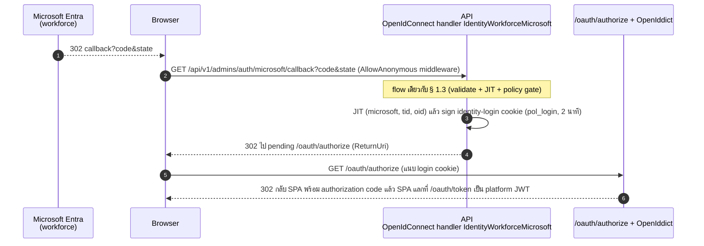

# pol-core API — Admin OIDC callback (Sequence Diagrams)

> Source: `docs/reference/api-endpoints.md` section "OIDC callback ที่ middleware จัดการ" และ source ที่อ้างต่อ § (`src/Api/Api/IdentityAccess/IdentityAccessWiring.cs`, `WorkforceClientRegistration.cs`, `src/Api/Api/Program.cs`)
> Scope: 1 § เดียวกับ `08-admin-accounts-auth.activities.md` (หมายเลข § ตรงกัน) — legacy `/api/v1/admins/**` ถูก retire งานย้ายไป theme 1, 2, 3 (ดูตาราง mapping ในไฟล์ activities)
> Generated: 2026-09-14

| § | Diagram | Endpoints |
| --- | --- | --- |
| 8.1 | Admin (workforce) OIDC callback | `GET /api/v1/admins/auth/microsoft/callback` |

---

## 8.1 Admin (workforce) OIDC callback

`GET /api/v1/admins/auth/microsoft/callback` เป็น redirect URI ของ workforce OIDC scheme `IdentityWorkforceMicrosoft` สำหรับ Admin production — flow เดียวกับ employee OIDC callback § 1.3 ต่างกันแค่ค่า `CallbackPath` (source: `src/Api/Api/IdentityAccess/IdentityAccessWiring.cs:132-260`, `WorkforceClientRegistration.cs:16,71`, `src/Api/Api/Program.cs:3528-3548`)

> รายละเอียด callback flow เต็มอยู่ที่ § 1.3 ใน `01-identity-bff-oauth.sequences.md` — ไฟล์นี้ไม่ทำซ้ำ

---

## Notes

- legacy `/api/v1/admins/**` (25 route) ถูก retire แบ่งสอง PR — 20 route ใน PR #264 (`RetireLegacyAdminIdentityPlane`) และ 5 เส้น auth/session (`/admins/{id}/sessions*`, `/admins/auth/{provider}/login`, `/admins/auth/logout`, `/admins/auth/logout-all`) ก่อนหน้าใน PR #262 (`RetireAdminSessions`) — งาน account / role / session ย้ายไป theme 1, 2, 3 (ดูตาราง mapping ในไฟล์ `08-admin-accounts-auth.activities.md`)
- admin console เป็น Bearer JWT (ดู § 0.1) ไม่มี admin session cookie / CSRF แล้ว

**Render**: GitHub / Obsidian / VS Code Mermaid
