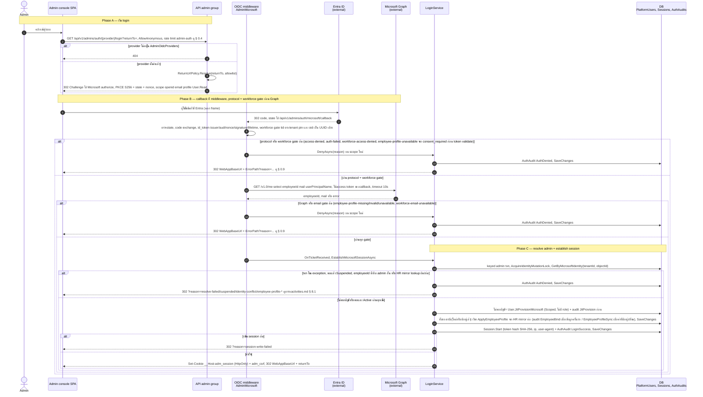
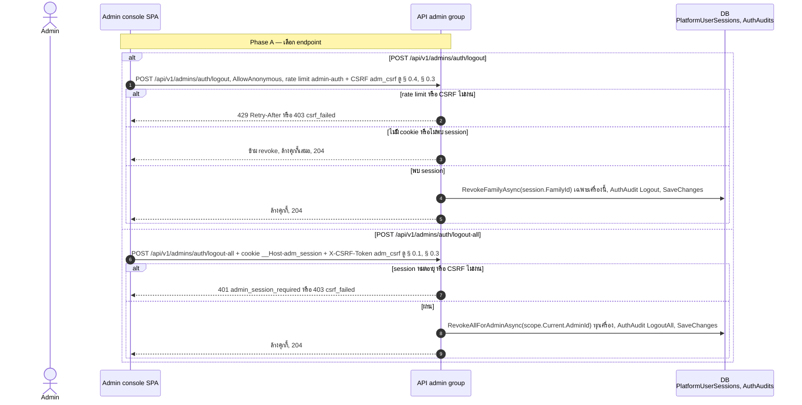
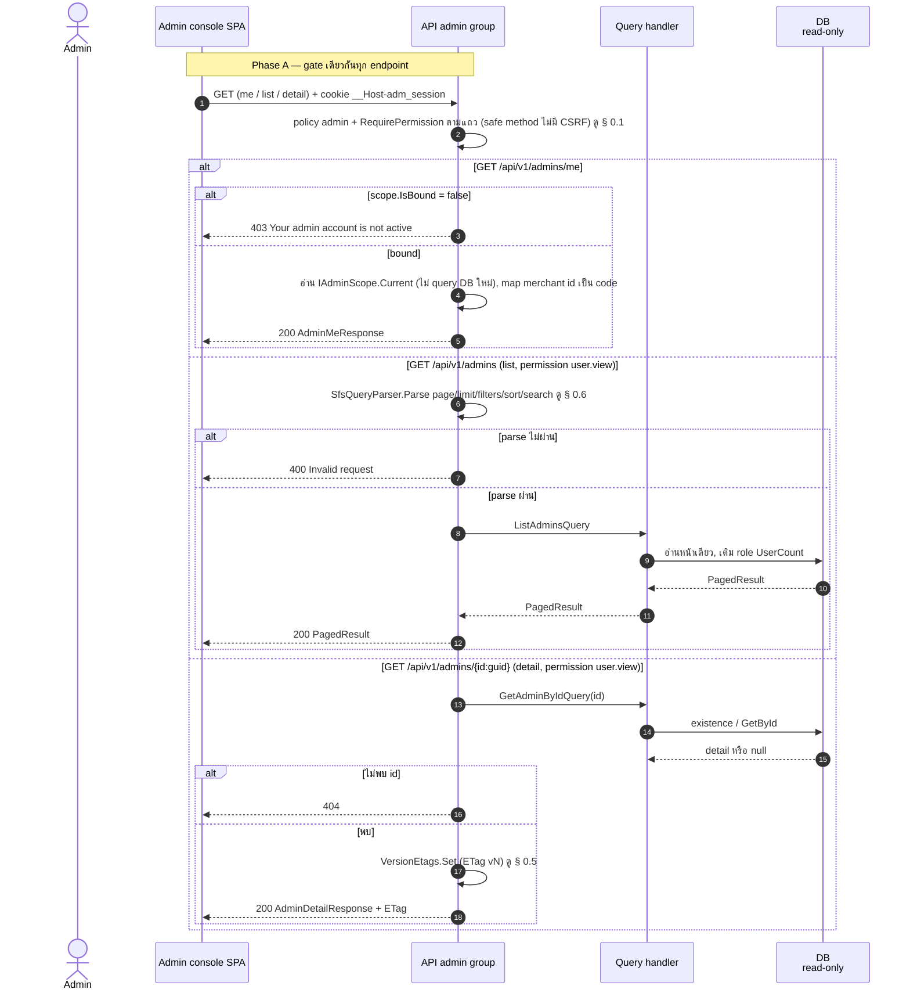
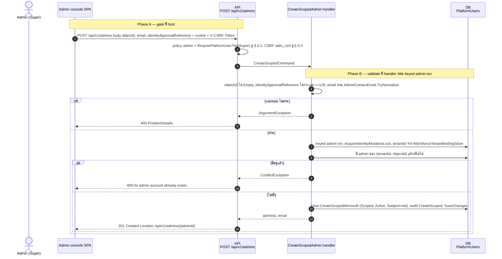
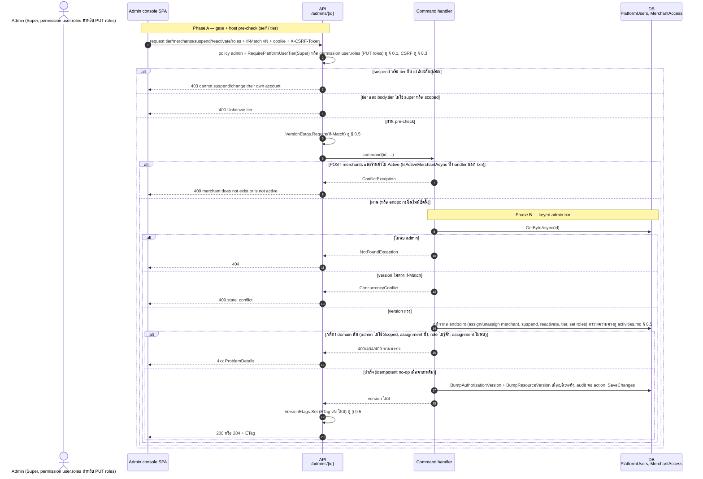
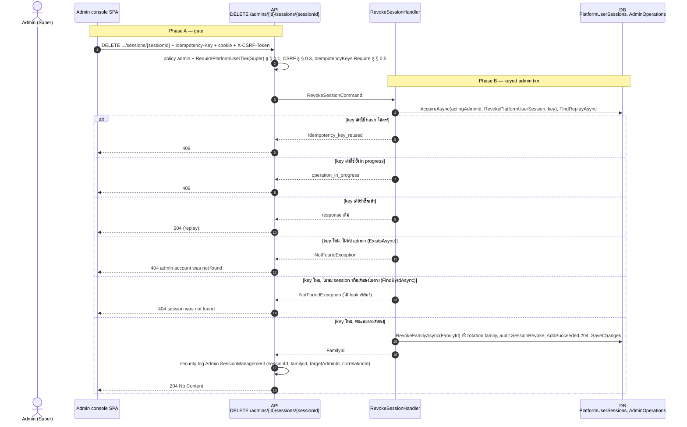
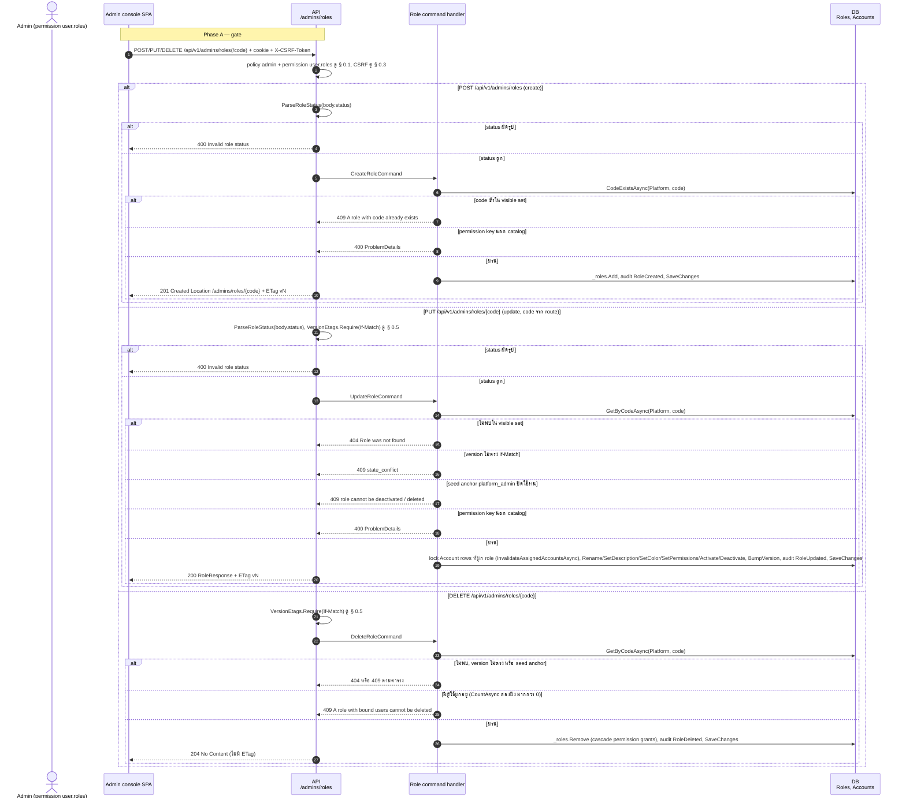
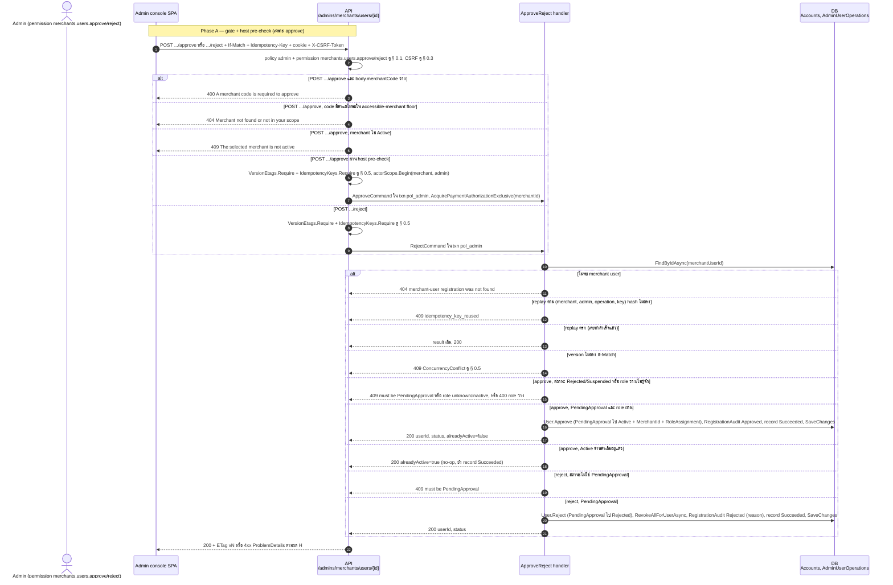
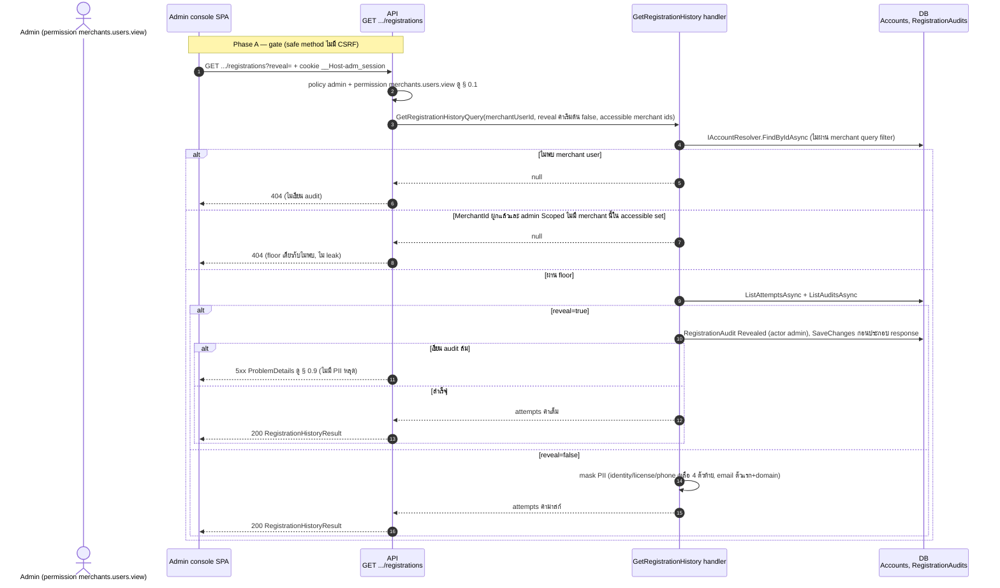

# pol-core API — Admin accounts, roles, sessions และ admin OIDC (Sequence Diagrams)

> Source: `docs/reference/api-endpoints.md` section "Admin และ merchant identity" บรรทัด L179-L203 และ section "OIDC callback ที่ middleware จัดการ" บรรทัด L392, source ที่อ้างต่อ § (`src/Api/Api/Program.cs:2418-2496,3148-3706`, `src/Api/Api/Admins/*`, `src/Application/Modules/Admins.Application/Users/*`, `Iam.Application/Roles/*`, `Merchants.Application/Users/ApproveReject.cs`, `GetRegistrationHistory.cs`)
> Scope: 9 § เดียวกับ `08-admin-accounts-auth.activities.md` (หมายเลข § ตรงกัน) แสดงลำดับข้าม actor / API / handler / DB / external
> Generated: 2026-09-14

| § | Diagram | Endpoints |
| --- | --- | --- |
| 8.1 | Admin OIDC login + middleware callback | `GET /api/v1/admins/auth/{provider}/login`, `GET /api/v1/admins/auth/microsoft/callback` |
| 8.2 | Logout เครื่องนี้ / ทุกเครื่อง | `POST /api/v1/admins/auth/logout`, `POST /api/v1/admins/auth/logout-all` |
| 8.3 | Admin read model (me / list / detail) | `GET /api/v1/admins/me`, `GET /api/v1/admins`, `GET /api/v1/admins/{id:guid}` + 5 composed |
| 8.4 | สร้าง Scoped Microsoft admin แบบ pre-bound | `POST /api/v1/admins` |
| 8.5 | Super account mutations + set roles (If-Match) | `POST /api/v1/admins/{id:guid}/tier` + 5 composed |
| 8.6 | เพิกถอน session family ของ admin (Idempotency-Key) | `DELETE /api/v1/admins/{id:guid}/sessions/{sessionId:guid}` |
| 8.7 | Role CRUD ฝั่ง Platform | `POST /api/v1/admins/roles`, `PUT /api/v1/admins/roles/{code}`, `DELETE /api/v1/admins/roles/{code}` |
| 8.8 | Merchant-user approve / reject โดย admin | `POST .../merchants/users/{merchantUserId:guid}/approve`, `POST .../reject` |
| 8.9 | Registration history พร้อม reveal audit | `GET /api/v1/admins/merchants/users/{merchantUserId:guid}/registrations` |

---

## 8.1 Admin OIDC login + middleware callback

ลำดับข้าม browser, OIDC middleware scheme `AdminMicrosoft`, Microsoft Graph และ `LoginService` ตั้งแต่ challenge จนออก cookie session หรือ 302 ไปหน้า error (source: `src/Api/Api/Program.cs:2425-2444`, `Admins/OidcAuthentication.cs:91-227`, `Admins/LoginService.cs:127-226`, `src/Application/Modules/Admins.Application/Users/ResolveMicrosoftAdmin.cs:52-163`)

รายละเอียด 12 reason, race JIT และตารางความต่างดู `08-admin-accounts-auth.activities.md` § 8.1

---

## 8.2 Logout เครื่องนี้ / ทุกเครื่อง

logout เป็น AllowAnonymous แบบ idempotent, logout-all ต้องมี session admin แล้ว revoke ทุก session (source: `src/Api/Api/Program.cs:2452-2496`)

ตารางความต่างระหว่างสอง endpoint ดู `08-admin-accounts-auth.activities.md` § 8.2

---

## 8.3 Admin read model (me / list / detail)

reads ผ่าน gate § 0.1 แบบไม่มี transaction, `/me` อ่านจาก scope ที่ middleware bind ไว้, list ผ่าน SFS, detail ตรวจ existence ก่อนคืน ETag (source: `src/Api/Api/Program.cs:3234-3264,3312-3392`)

composed (`effective-permissions`, `sessions` Super only, `permissions`, `roles`, `roles/{code}`) ใช้ gate และรูปแบบเดียวกัน — ตาราง flow ประกอบดู `08-admin-accounts-auth.activities.md` § 8.3

---

## 8.4 สร้าง Scoped Microsoft admin แบบ pre-bound

Super สร้างบัญชี Scoped จาก Entra object ID: validate ที่ handler ก่อนเข้า keyed admin txn ที่ lock identity แล้วกัน duplicate (source: `src/Api/Api/Program.cs:3269-3283`, `src/Application/Modules/Admins.Application/Users/CreateScopedAdmin.cs:42-72`)

---

## 8.5 Super account mutations + set roles (If-Match)

mutation ต่อ admin หนึ่งคน: host pre-check (self 403, tier 400) ก่อน If-Match, assign merchant ตรวจ merchant Active ที่ handler นอก txn ก่อน จากนั้นเข้า keyed admin txn โหลด-เทียบ version-ทำกติกา domain (source: `src/Api/Api/Program.cs:3395-3502,3688-3706`)

ตารางความต่างของ 6 endpoint (tier, merchants POST/DELETE, suspend, reactivate, roles PUT) ดู `08-admin-accounts-auth.activities.md` § 8.5

---

## 8.6 เพิกถอน session family ของ admin (Idempotency-Key)

Super ส่ง Idempotency-Key แล้ว handler ทำ replay lookup ใน keyed admin txn ก่อนตรวจ admin/session แล้ว revoke ทั้ง rotation family (source: `src/Api/Api/Program.cs:3524-3547`, `src/Application/Modules/Admins.Application/Users/RevokeAdminSession.cs:50-96`)

---

## 8.7 Role CRUD ฝั่ง Platform

mutation role ใช้ handler ร่วมกับ merchant console ผ่าน `RoleSideContext.Platform`: host แปลง status (400) ก่อน If-Match, create กัน code ซ้ำ, update/delete โหลดจาก visible set แล้วกัน seed anchor และ role ที่มีผู้ใช้ผูก (source: `src/Api/Api/Program.cs:3555-3565,3627-3685`)

---

## 8.8 Merchant-user approve / reject โดย admin

approve ตรวจ merchantCode + accessible-merchant floor + merchant Active ที่ host ก่อนเข้า txn (พร้อม If-Match + Idempotency-Key), reject เข้า txn ตรง, ทั้งสองเดิน state machine PendingApproval ก่อน audit ในทรานแซกชันเดียว (source: `src/Api/Api/Program.cs:3148-3202`, `src/Application/Modules/Merchants.Application/Users/ApproveReject.cs:62-151,188-234,246-260`)

---

## 8.9 Registration history พร้อม reveal audit

GET ที่อาจเขียน DB: หา merchant user ไม่ผ่าน merchant filter แล้วบังคับ accessible-merchant floor, `?reveal=true` ต้องบันทึก audit ก่อนประกอบ response แบบ fail-closed (source: `src/Api/Api/Program.cs:3209-3227`, `src/Application/Modules/Merchants.Application/Users/GetRegistrationHistory.cs:68-139`)

---

## Notes

- ไฟล์นี้แสดงเฉพาะลำดับการเรียกข้าม actor/ระบบ ตารางความต่างของ endpoint composed และ Deviations ระหว่างเอกสารกับ source ดู `08-admin-accounts-auth.activities.md`
- reason `?reason=` ทั้ง 12 ค่าของ § 8.1 และ error code ของทุก § ตรงกับ ProblemDetails ตาม § 0.9 (`ArgumentException` 400, `NotFoundException` 404, `ConflictException`/`InvalidOperationException` 409, dependency ล้ม 503)
- ปลายทางของ 302 (WebAppBaseUrl, ErrorPath, ReturnUrlAllowlist) มาจาก config ต่อ environment จึงอยู่นอก frame ของ diagram เหมือนกับ activities.md
- session table ฝั่ง admin คือ `PlatformUserSessions`, audit login คือ `AuthAudits`, audit จัดการบัญชีคือ `Audit` ของ `Admins.Domain`

**Render**: GitHub / Obsidian / VS Code Mermaid
