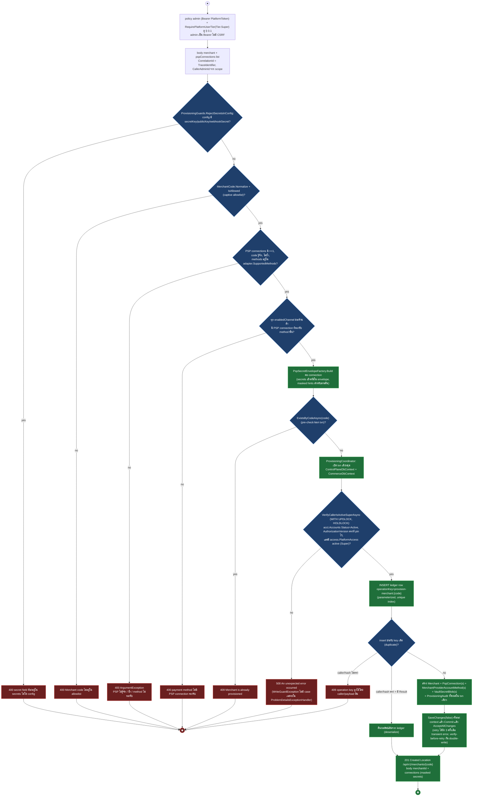
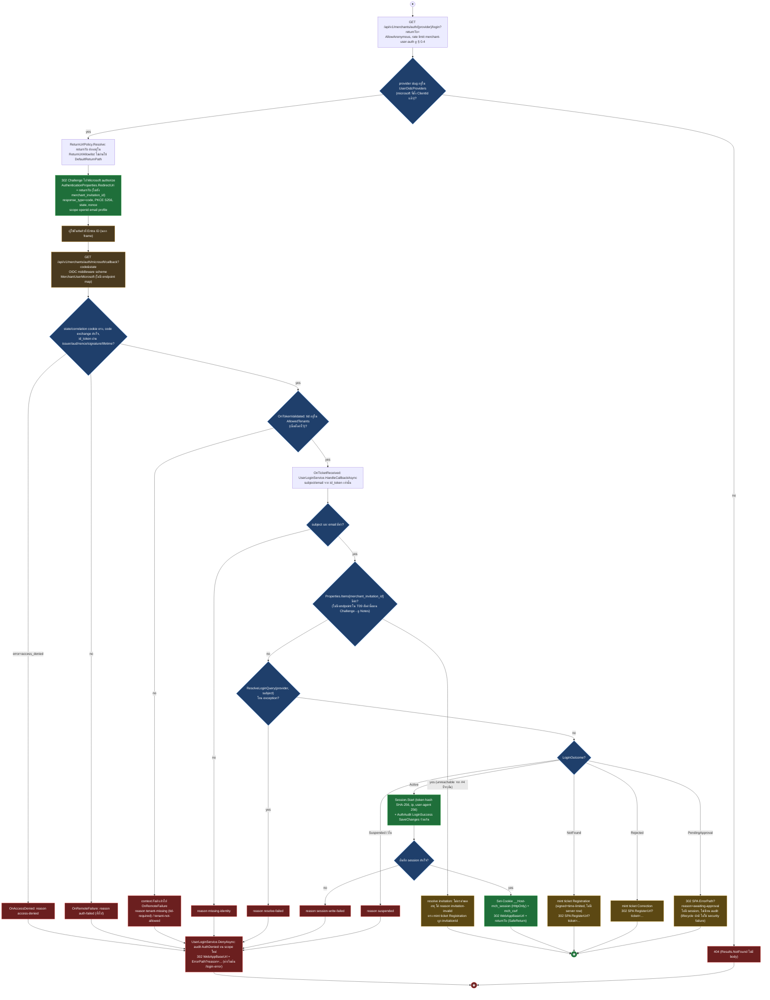
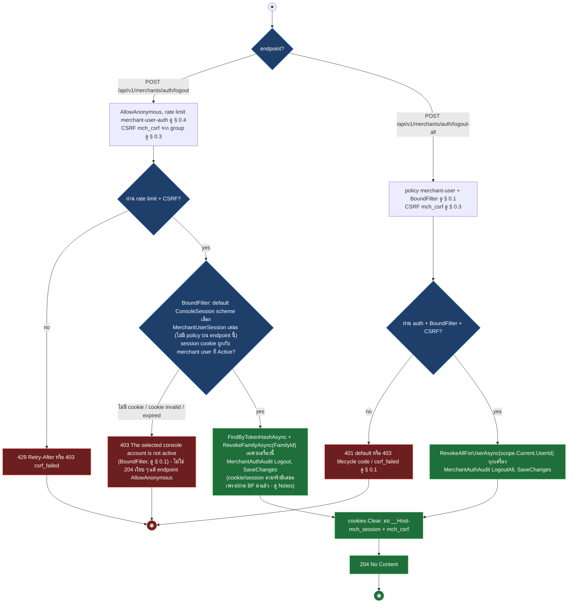
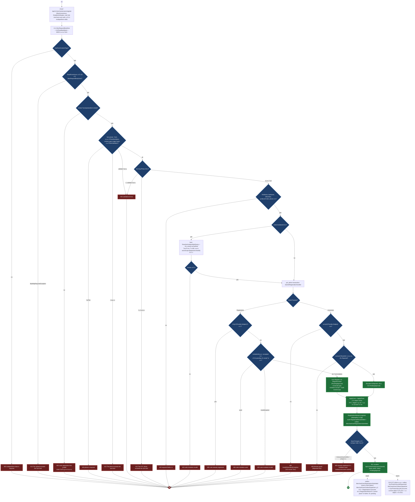
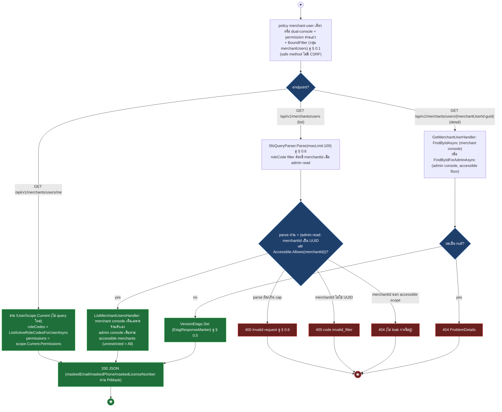
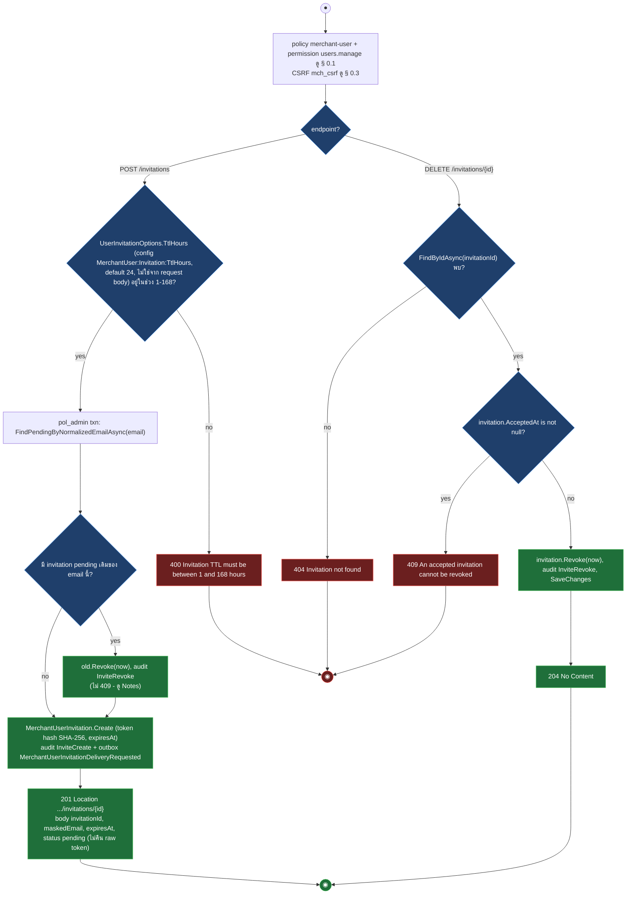
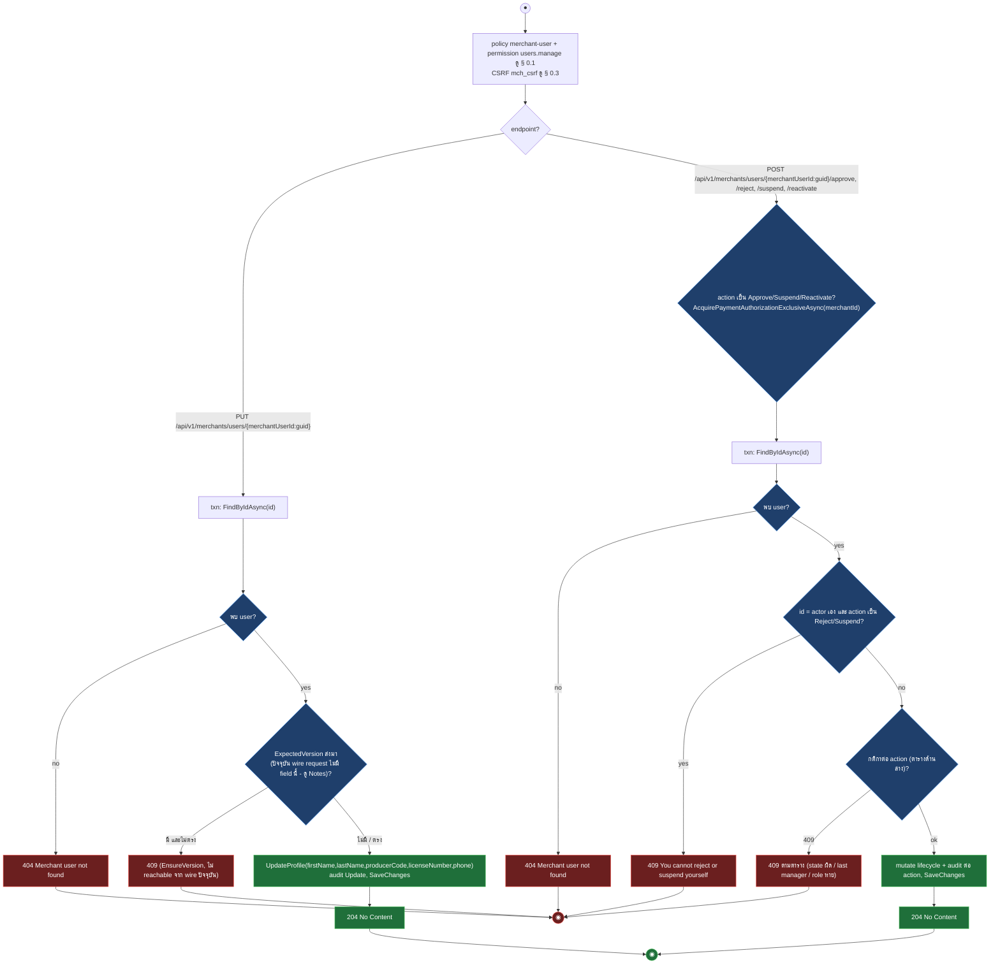
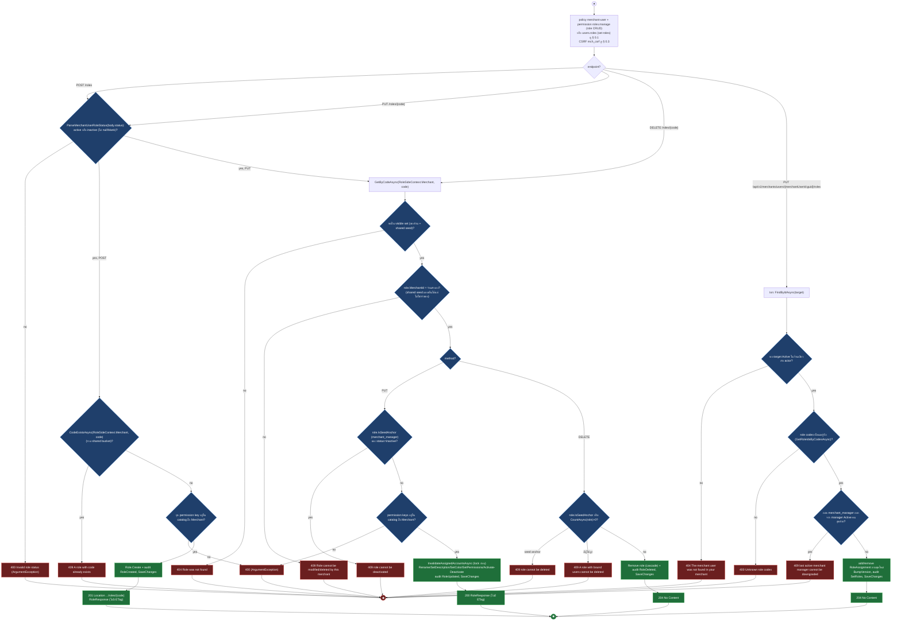

# pol-core API — Merchant provisioning, merchant users และ merchant OIDC (Activity Diagrams)

> Source: `docs/reference/api-endpoints.md` section "Admin และ merchant identity" บรรทัด L204-L227 และ section "OIDC callback ที่ middleware จัดการ" บรรทัด L393, source ที่อ้างต่อ § (`src/Api/Api/Program.cs:2506-3148`, `src/Api/Api/Merchants/UserOidcAuthentication.cs`, `UserLoginService.cs`, `UserSessionAuthenticationHandler.cs`, `UserPermissionAuthorization.cs`, `src/Application/Modules/Merchants.Application/ProvisionMerchant/ProvisionMerchantHandler.cs`, `src/Infrastructure/Persistence/Persistence.Provisioning/ProvisioningCoordinator.cs`, `src/Application/Modules/Merchants.Application/Users/SubmitRegistration.cs`, `ManageMerchantUsers.cs`, `SetUserRoles.cs`, `src/Application/Modules/Iam.Application/Roles/*.cs`)
> Scope: 25 endpoints — provision ร้านค้า (Super-only), merchant-user OIDC login/logout/callback, self-service registration, read model ของผู้ใช้ร้านค้า/ร้านค้า, invitation, profile + lifecycle mutation, role RBAC ฝั่งร้านค้า
> Generated: 2026-09-14

| § | Diagram | Endpoints |
| --- | --- | --- |
| 9.1 | Provision ร้านค้าใหม่ (Super-only) | `POST /api/v1/merchants` |
| 9.2 | Merchant-user OIDC login + callback | `GET /api/v1/merchants/auth/{provider}/login`, `GET /api/v1/merchants/auth/microsoft/callback` |
| 9.3 | Logout เครื่องนี้ / ทุกเครื่อง | `POST /api/v1/merchants/auth/logout`, `POST /api/v1/merchants/auth/logout-all` |
| 9.4 | ส่งคำขอลงทะเบียนผู้ใช้ร้านค้า (self-service) | `POST /api/v1/merchants/users/register` |
| 9.5 | Read model ผู้ใช้ร้านค้า + ร้านค้า (me / list / detail / catalog) | `GET .../users/me`, `GET .../users`, `GET .../users/{id}` + 5 composed |
| 9.6 | เชิญ / เพิกถอนคำเชิญผู้ใช้ร้านค้า | `POST .../users/invitations`, `DELETE .../invitations/{invitationId:guid}` |
| 9.7 | แก้ไขโปรไฟล์ + lifecycle ผู้ใช้ร้านค้า | `PUT .../users/{id}` + 4 composed (approve/reject/suspend/reactivate) |
| 9.8 | Role RBAC ฝั่งผู้ใช้ร้านค้า | `POST/PUT/DELETE .../users/roles(/{code})`, `PUT .../users/{id}/roles` |

---

## 9.1 Provision ร้านค้าใหม่ (Super-only)

Super validate ทุกอย่างก่อนเข้า transaction (pure, ไม่มี side effect) แล้วเปิด txn เดียวคุมทั้ง control plane และ commerce runtime พร้อม idempotency ledger ที่ key จาก merchant code (source: `src/Api/Api/Program.cs:2370-2411`, `src/Application/Modules/Merchants.Application/ProvisionMerchant/ProvisionMerchantHandler.cs:49-118`, `src/Infrastructure/Persistence/Persistence.Provisioning/ProvisioningCoordinator.cs:72-221,223-249`)

---

## 9.2 Merchant-user OIDC login + callback

login ตรวจ provider + returnTo แล้ว Challenge ไป Microsoft, callback ไม่มี endpoint map แต่ OIDC middleware ตรวจ protocol และ tenant gate แล้วให้ `UserLoginService` เดินสาขาตามสถานะบัญชี (Active/NotFound/Rejected/PendingApproval/Suspended) ไม่มี JIT provision และไม่มี Graph employeeId gate เหมือนฝั่ง admin (source: `src/Api/Api/Program.cs:2600-2619`, `Merchants/UserOidcAuthentication.cs:73-157`, `Merchants/UserLoginService.cs:89-245`, `src/Api/appsettings.json:40-52`)

---

## 9.3 Logout เครื่องนี้ / ทุกเครื่อง

ทั้งสอง endpoint อยู่ในกลุ่ม `/merchants/auth` ที่มี `BoundFilter` ผูกไว้ระดับกลุ่ม (ต่างจาก admin logout ที่กลุ่มไม่มี filter นี้เลย) จึงต้องมี merchant-user session ที่ bound จริงก่อนถึงจะ revoke ได้ แม้ endpoint แรกจะ `AllowAnonymous` (source: `src/Api/Api/Program.cs:2765-2819`, `Merchants/UserPermissionAuthorization.cs:16-29`, `Iam/ConsoleSessionAuthentication.cs:33-49`)

| Method | fullPath | ต่างจาก § กลางตรงไหน |
| --- | --- | --- |
| POST | `/api/v1/merchants/auth/logout` | diagram — AllowAnonymous แต่กลุ่มมี `BoundFilter` จึงต้องมี session ที่ bound จริงก่อน revoke ได้ (ต่างจาก employee logout § 1.7 ที่ไม่มี filter นี้) ไม่มี session -> 403 ไม่ใช่ 204 |
| POST | `/api/v1/merchants/auth/logout-all` | diagram — policy `merchant-user` (401/403 มาตรฐาน § 0.1), revoke ทุก session ของ user, audit `LogoutAll` |

---

## 9.4 ส่งคำขอลงทะเบียนผู้ใช้ร้านค้า (self-service)

Anonymous + ticket-gated multipart: จำกัดขนาด body ก่อนอ่าน form, validate ticket/รูป/invitation ก่อนเข้า `pol_admin` transaction เดียวที่ create หรือ resubmit บัญชี พร้อม audit + outbox ในทรานแซกชันเดียวกัน (source: `src/Api/Api/Program.cs:2633-2756`, `src/Application/Modules/Merchants.Application/Users/SubmitRegistration.cs:123-262`)

---

## 9.5 Read model ผู้ใช้ร้านค้า + ร้านค้า (me / list / detail / catalog)

reads ทั้งหมดผ่าน gate § 0.1 แล้วส่ง query แบบไม่มี transaction: `/me` อ่านจาก `IUserScope` ที่ middleware bind ไว้, list ผ่าน `SfsQueryParser`, detail ตรวจ existence ก่อนแล้วคืน 404 หรือ 200 + ETag (source: `src/Api/Api/Program.cs:2823-2916,3024-3064,2563-2584`, `src/Application/Modules/Merchants.Application/Users/ManageMerchantUsers.cs:218-304`)

| Method | fullPath | ต่างจาก § กลางตรงไหน |
| --- | --- | --- |
| GET | `/api/v1/merchants/users/me` | diagram — ไม่มี permission เพิ่มจาก policy `merchant-user`, ไม่ query DB ใหม่ (อ่านจาก scope), ไม่มี ETag |
| GET | `/api/v1/merchants/users` | diagram — policy `dual-console`, audience permission `merchants.users.view`(admin)/`users.view`(merchant), SFS filter `roleCode` ต้องมี `merchantId` เมื่อ admin, admin เลือก `merchantId` นอก scope -> 404, ไม่มี ETag |
| GET | `/api/v1/merchants/users/{merchantUserId:guid}` | diagram — policy `dual-console`, permission audience เดียวกับ list, ETag `vN`, 404 เมื่อไม่พบหรือ admin นอก scope |
| GET | `/api/v1/merchants/users/permissions` | composed — policy `merchant-user` + permission `roles.view`, catalog `Scope.Merchant` คงที่ ไม่มี query/404/ETag |
| GET | `/api/v1/merchants/users/roles` | composed — policy `merchant-user` + permission `roles.view`, `RoleSideContext.Merchant` (ของร้าน + shared seed), `Limit=int.MaxValue` ไม่ผ่าน SFS, ไม่มี ETag |
| GET | `/api/v1/merchants/users/roles/{code}` | composed — policy `merchant-user` + permission `roles.view`, 404 เมื่อไม่อยู่ visible set, ไม่มี ETag (ต่างจาก admin `roles/{code}` ที่มี ETag) |
| GET | `/api/v1/merchants/users/{merchantUserId:guid}/edit` | composed — policy `merchant-user` + permission `users.manage`, 404 เมื่อไม่พบ, **เขียน audit `Reveal` + SaveChanges ระหว่างอ่าน (ไม่ read-only จริง)**, คืนเฉพาะ field แก้ไขได้แบบไม่ mask |
| GET | `/api/v1/merchants/{code}` | composed — policy `admin` + permission `merchant.view` (ไม่ใช่ `merchant-user`), accessible-merchant floor (Scoped เห็นเฉพาะที่ assign), 404 เมื่อไม่พบ/นอก scope, ETag `vN`, entity เป็น Merchant ไม่ใช่ MerchantUser |

---

## 9.6 เชิญ / เพิกถอนคำเชิญผู้ใช้ร้านค้า

สร้าง invitation แบบ tenant-bound: TTL 1-168 ชั่วโมง, invitation pending เดิมของอีเมลเดียวกันถูก revoke อัตโนมัติแล้วสร้างใหม่ (ไม่ 409), enqueue outbox ส่งลิงก์แบบเข้ารหัส ไม่คืน raw token (source: `src/Api/Api/Program.cs:2918-2953`, `src/Application/Modules/Merchants.Application/Users/ManageMerchantUsers.cs:21-163`)

| Method | fullPath | ต่างจาก § กลางตรงไหน |
| --- | --- | --- |
| POST | `/api/v1/merchants/users/invitations` | diagram — invitation pending เดิม (ถ้ามี) ถูก revoke เงียบ ๆ แล้วสร้างใหม่แทน 409, audit `InviteRevoke`+`InviteCreate` |
| DELETE | `/api/v1/merchants/users/invitations/{invitationId:guid}` | diagram — 404 เมื่อไม่พบ, 409 เมื่อ invitation ถูก accept ไปแล้ว (`FindByIdAsync` ไม่กรอง `AcceptedAt` จึงเจอ invitation ที่ accept แล้วได้จริง) |

---

## 9.7 แก้ไขโปรไฟล์ + lifecycle ผู้ใช้ร้านค้า

profile update และ lifecycle action (approve/reject/suspend/reactivate) ใช้ permission `users.manage` เดียวกันแต่ domain rule ต่างกันจริงต่อ action: self-check บน reject/suspend, auto-assign role `merchant_staff` บน approve, last-manager guard บน suspend, revoke session บน reject/suspend เท่านั้น (source: `src/Api/Api/Program.cs:2955-3004`, `src/Application/Modules/Merchants.Application/Users/ManageMerchantUsers.cs:306-422`)

| Method | fullPath | ต่างจาก § กลางตรงไหน |
| --- | --- | --- |
| PUT | `/api/v1/merchants/users/{merchantUserId:guid}` | diagram — ไม่มี lock, ไม่มี self-check, 409 ประกาศไว้แต่ไม่ reachable จริง (wire request ไม่มี version field), audit `Update` |
| POST | `/api/v1/merchants/users/{merchantUserId:guid}/approve` | diagram — ต้อง `Status=PendingApproval` (ไม่งั้น 409 domain exception), assign role `merchant_staff` อัตโนมัติ (409 ถ้า role หายจากระบบ), ไม่ self-check, ไม่ revoke session |
| POST | `/api/v1/merchants/users/{merchantUserId:guid}/reject` | diagram — self-check (409), `Reject()` ต้องมีสถานะเดิมเป็น `PendingApproval` มิฉะนั้น 409, `RevokeAllForUserAsync` ทุกเครื่อง, ไม่ lock |
| POST | `/api/v1/merchants/users/{merchantUserId:guid}/suspend` | diagram — lock, self-check (409), `EnsureNotLastManagerAsync` (409 เมื่อเป็น manager Active คนสุดท้าย), `RevokeAllForUserAsync` |
| POST | `/api/v1/merchants/users/{merchantUserId:guid}/reactivate` | diagram — lock, ไม่ self-check, `Reactivate()` ต้องมีสถานะเดิมเป็น `Suspended` มิฉะนั้น 409, ไม่ revoke session |

---

## 9.8 Role RBAC ฝั่งผู้ใช้ร้านค้า

role CRUD ใช้ handler ร่วมกับ admin console ผ่าน `RoleSideContext.Merchant` (seed anchor คือ `merchant_manager` แทน `platform_admin`) set-user-roles เป็นคนละ handler ที่ผูก role ให้ target user ภายในร้านเดียวกัน (source: `src/Api/Api/Program.cs:3066-3139`, `src/Application/Modules/Iam.Application/Roles/CreateRole.cs`, `UpdateRole.cs`, `DeleteRole.cs`, `src/Application/Modules/Merchants.Application/Users/SetUserRoles.cs:24-103`)

| Method | fullPath | ต่างจาก § กลางตรงไหน |
| --- | --- | --- |
| POST | `/api/v1/merchants/users/roles` | diagram — 409 code ซ้ำ (รวม shared bucket), 400 permission key นอก catalog, ไม่มี ETag |
| PUT | `/api/v1/merchants/users/roles/{code}` | diagram — 404 นอก visible set, 409 ไม่ใช่เจ้าของ (shared seed) / seed anchor deactivate, lock Account ก่อนแก้, ไม่มี If-Match/ETag (ต่างจาก § 2.4 Platform role ที่มี If-Match/ETag) |
| DELETE | `/api/v1/merchants/users/roles/{code}` | diagram — 409 seed anchor (`merchant_manager`) หรือมีผู้ใช้ผูก, ไม่มี If-Match |
| PUT | `/api/v1/merchants/users/{merchantUserId:guid}/roles` | diagram — target ต้อง Active + merchant เดียวกัน (404 no leak), 400 unknown code, 409 ลด role ของ manager คนสุดท้าย |

---

## Deviations

| fullPath | เอกสารบอก | source บอก | อ้างอิง |
| --- | --- | --- | --- |
| `/api/v1/merchants` (POST) | policy `admin` (Bearer, ไม่มี CSRF) | `RequirePlatformUserTier(Tier.Super)` ที่ boundary แล้ว re-verify ใน txn ผ่าน `ProvisioningCoordinator.VerifyCallerIsActiveSuper` (`acct.Accounts` Status/AuthorizationVersion + `access.PlatformAccess` active) | `src/Api/Api/Program.cs:2370-2411`, `ProvisioningCoordinator.cs:223-249` |

## Notes

- `POST /api/v1/merchants/auth/logout` มี comment ในโค้ดว่า "idempotent -> 204 เสมอแม้ไม่มี cookie" แต่กลุ่ม `/merchants/auth` ผูก `BoundFilter` ไว้ (`Program.cs:2765-2767`) ซึ่งอาศัย default `ConsoleSession` scheme (`builder.Services.AddAuthentication(ConsoleSessionAuthentication.SchemeName)`, `Program.cs:351`) เลือก `MerchantUserSession` ให้เสมอเมื่อ endpoint ไม่มี policy — caller ที่ไม่มี cookie หรือ cookie invalid/expired จะได้ 403 จาก `BoundFilter` ก่อนถึง handler เสมอ ทำให้ path "ไม่มี cookie -> clear เงียบ ๆ" ในตัว handler เป็น dead code จริงในทางปฏิบัติ
- endpoint policy `merchant-user` เดี่ยว (`me`/`permissions`/`roles`/`edit`) ผ่าน `RequireAuthorization("merchant-user")` ที่ authenticate สำเร็จเฉพาะ user Active+bound อยู่แล้ว (`UserSessionAuthenticationHandler` เซ็ต `IUserScope` เฉพาะ path สำเร็จ) เช็ค `IsBound` ซ้ำใน handler/`BoundFilter` จึงเป็น defense-in-depth ไม่ใช่ branch ที่ caller ปกติไปถึงได้จริง — ต่างจาก logout ข้างต้นที่ `BoundFilter` ทำงานจริงเพราะ endpoint ไม่มี policy เลย
- callback `/api/v1/merchants/auth/microsoft/callback` เป็น path จาก `MerchantAuth:Providers:Microsoft:CallbackPath` (`appsettings.json:48`, ค่าเริ่มต้นตรงกับ inventory) — ไม่มี `MapGet`, handler จริงคือ event ของ OpenIdConnect scheme `MerchantUserMicrosoft`
- callback มี branch `Properties.Items["merchant_invitation_id"]` (`UserOidcAuthentication.cs:128`) แต่ไม่มี endpoint ใดใน source (รวม `GET /{provider}/login` ที่ตั้งแค่ `RedirectUri`) เซ็ตค่านี้ตอน Challenge จึง unreachable จาก endpoint จริงในปัจจุบัน — เก็บไว้เป็นโค้ดสำรองสำหรับ invitation-accept flow ที่ยังไม่ได้ wire
- `PUT /api/v1/merchants/users/{merchantUserId:guid}` ประกาศ `ProducesProblem(409)` แต่ `UpdateMerchantUserRequest` (wire DTO) ไม่มี version field เลย ทำให้ `ExpectedVersion` เป็น null เสมอและ branch 409 (`EnsureVersion`) ไม่ reachable จาก request จริง
- `POST /api/v1/merchants/users/invitations` เขียนใน `.WithDescription` ของตัวเองว่าอีเมลที่มี invitation ใช้ได้อยู่แล้ว -> 409 แต่ `CreateInvitationHandler` (merchant audience) revoke ใบเดิมเงียบ ๆ แล้วสร้างใบใหม่แทนเสมอ ไม่เคยโยน 409 กรณีนี้ (409 เกิดเฉพาะฝั่ง Admin audience ที่มี Idempotency-Key ซ้ำกับ intent ต่างกัน ซึ่งไม่ใช่ path นี้)
- `POST /api/v1/merchants` ที่ txn ตรวจพบว่า caller ไม่ใช่ Super/Active/AuthorizationVersion ตรงแล้วอีกต่อไป โยน `WriteGuardException` ซึ่งไม่มี case เฉพาะใน `ProblemDetailsExceptionHandler.Map` จึงตกไปที่ default 500 ไม่ใช่ 403 ตามที่อาจคาดไว้
- คอลัมน์ caller/policy ของเอกสารไม่ระบุ header marker (`EtagResponseMarker`, `SfsQueryParamsMarker`) หรือ endpoint filter (`BoundFilter`) ทุก § วาดตาม source และอ้าง § 0.1/0.5/0.6 แทน
- error body ทุก 4xx/5xx เป็น ProblemDetails ตาม § 0.9: `ArgumentException` 400, `NotFoundException` 404, `ConflictException`/`InvalidOperationException` 409, `WriteGuardException`/unhandled 500 — callback ทุกทางออกเป็น 302 redirect ไม่ใช่ JSON

**Render**: GitHub / Obsidian / VS Code Mermaid
