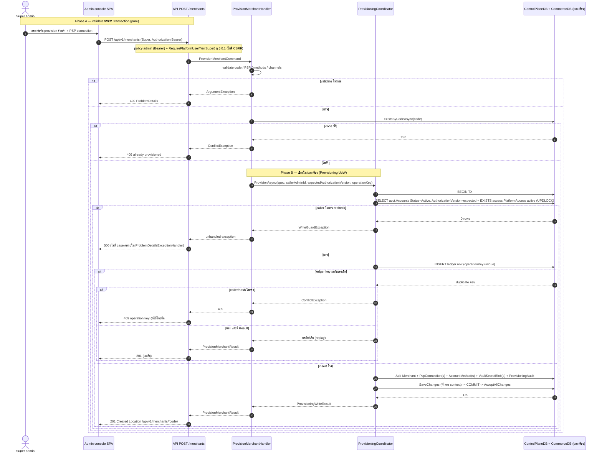
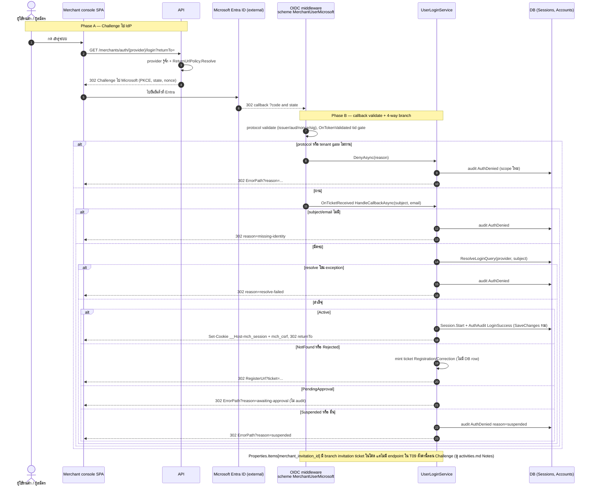
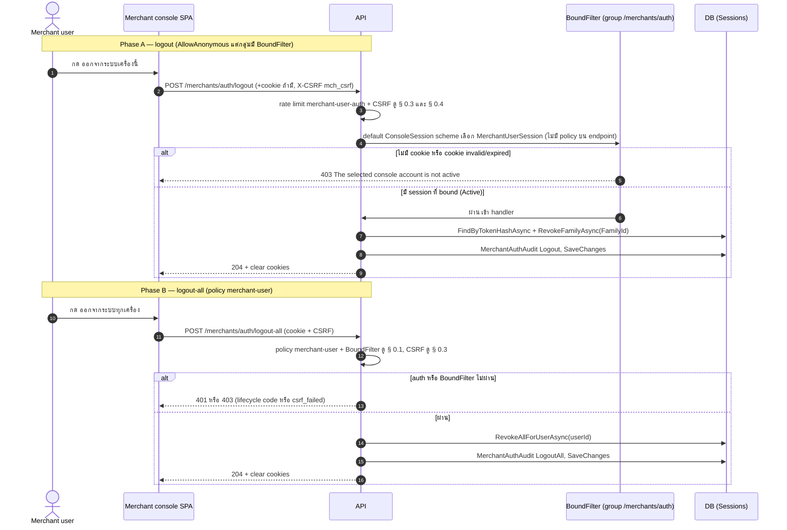
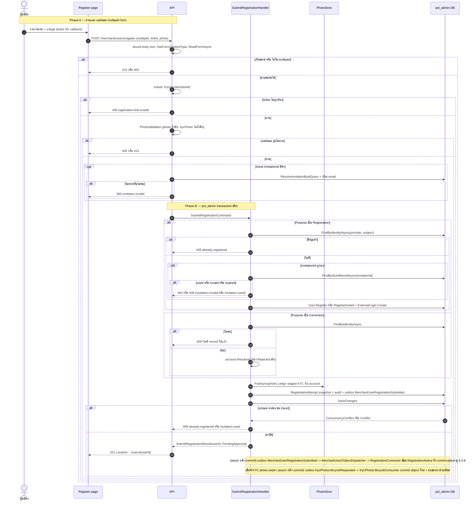
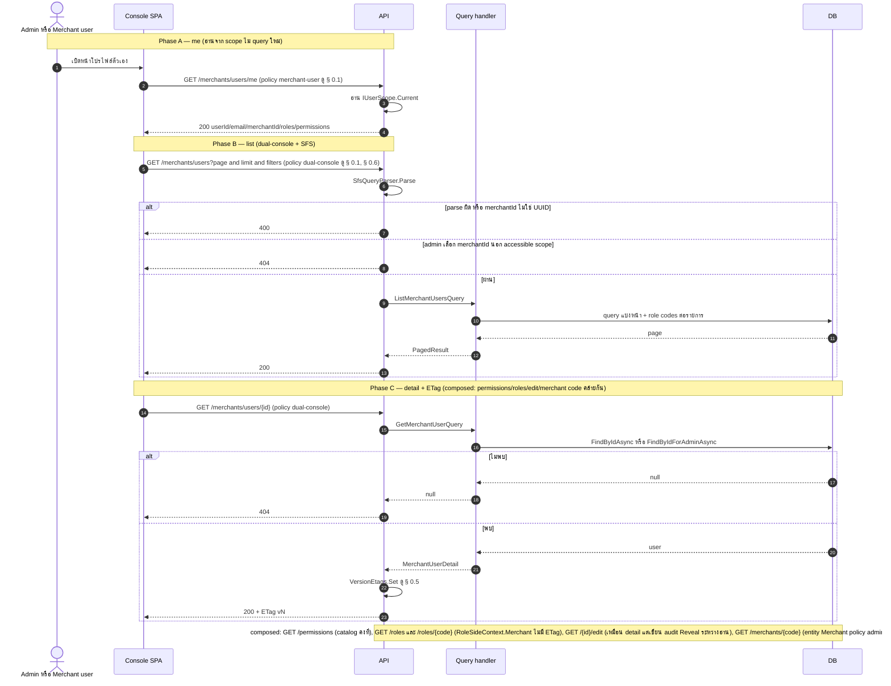
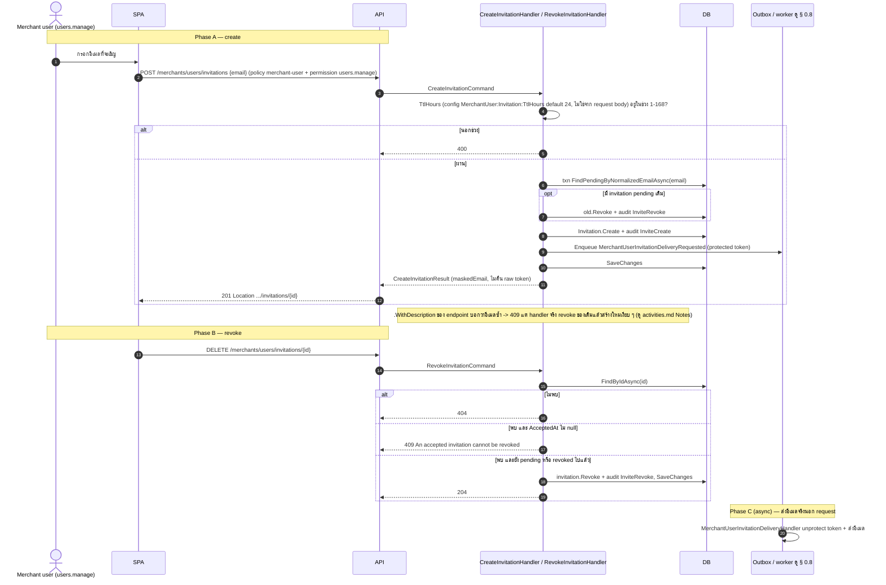
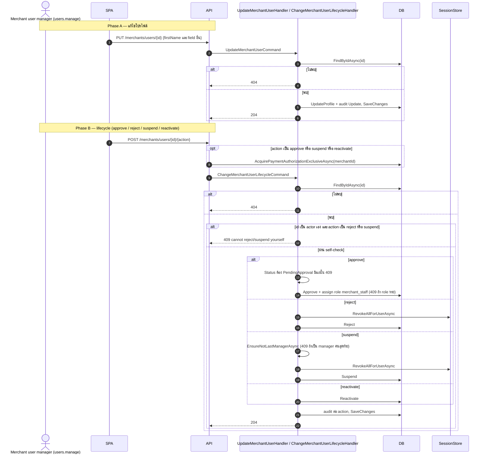
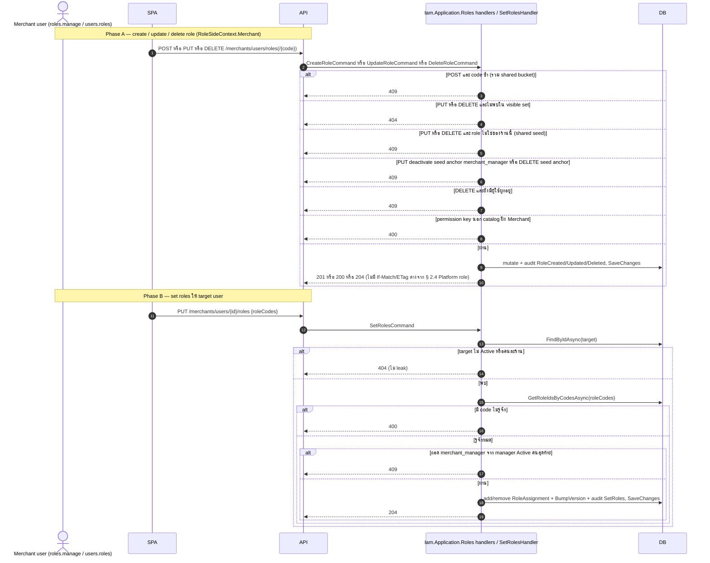

# pol-core API — Merchant provisioning, merchant users และ merchant OIDC (Sequence Diagrams)

> Source: `docs/reference/api-endpoints.md` section "Admin และ merchant identity" บรรทัด L204-L227 และ section "OIDC callback ที่ middleware จัดการ" บรรทัด L393, source ที่อ้างต่อ § เหมือน `09-merchant-provision-users-auth.activities.md`
> Scope: 8 § เดียวกับ `09-merchant-provision-users-auth.activities.md` (หมายเลข § ตรงกัน) แสดงลำดับข้าม actor / middleware / handler / DB / worker
> Generated: 2026-09-14

| § | Diagram | Endpoints |
| --- | --- | --- |
| 9.1 | Provision ร้านค้าใหม่ (Super-only) | `POST /api/v1/merchants` |
| 9.2 | Merchant-user OIDC login + callback | `GET /api/v1/merchants/auth/{provider}/login`, `GET /api/v1/merchants/auth/microsoft/callback` |
| 9.3 | Logout เครื่องนี้ / ทุกเครื่อง | `POST /api/v1/merchants/auth/logout`, `POST /api/v1/merchants/auth/logout-all` |
| 9.4 | ส่งคำขอลงทะเบียนผู้ใช้ร้านค้า (self-service) | `POST /api/v1/merchants/users/register` |
| 9.5 | Read model ผู้ใช้ร้านค้า + ร้านค้า (me / list / detail / catalog) | `GET .../users/me`, `GET .../users`, `GET .../users/{id}` + 5 composed |
| 9.6 | เชิญ / เพิกถอนคำเชิญผู้ใช้ร้านค้า | `POST .../users/invitations`, `DELETE .../invitations/{invitationId:guid}` |
| 9.7 | แก้ไขโปรไฟล์ + lifecycle ผู้ใช้ร้านค้า | `PUT .../users/{id}` + 4 composed (approve/reject/suspend/reactivate) |
| 9.8 | Role RBAC ฝั่งผู้ใช้ร้านค้า | `POST/PUT/DELETE .../users/roles(/{code})`, `PUT .../users/{id}/roles` |

---

## 9.1 Provision ร้านค้าใหม่ (Super-only)

---

## 9.2 Merchant-user OIDC login + callback

---

## 9.3 Logout เครื่องนี้ / ทุกเครื่อง

---

## 9.4 ส่งคำขอลงทะเบียนผู้ใช้ร้านค้า (self-service)

---

## 9.5 Read model ผู้ใช้ร้านค้า + ร้านค้า (me / list / detail / catalog)

---

## 9.6 เชิญ / เพิกถอนคำเชิญผู้ใช้ร้านค้า

---

## 9.7 แก้ไขโปรไฟล์ + lifecycle ผู้ใช้ร้านค้า

---

## 9.8 Role RBAC ฝั่งผู้ใช้ร้านค้า

---

## Notes

- ดู `09-merchant-provision-users-auth.activities.md` สำหรับ Deviations ทั้งหมด, สาเหตุที่ `PUT .../{id}` ไม่มี ETag/If-Match, และ evidence ของ `BoundFilter` ต่อ logout
- callback (§ 9.2) ทุกทางออกเป็น 302 redirect ตาม § 0.9 ไม่มีทางออกเป็น JSON เลย เพราะเป็น browser navigation flow
- § 9.1 ไม่มี external call จริง (PSP adapter แค่ตรวจ SupportedMethods ในหน่วยความจำ ไม่ยิง HTTP ไปที่ PSP ตอน provision)

**Render**: GitHub / Obsidian / VS Code Mermaid
