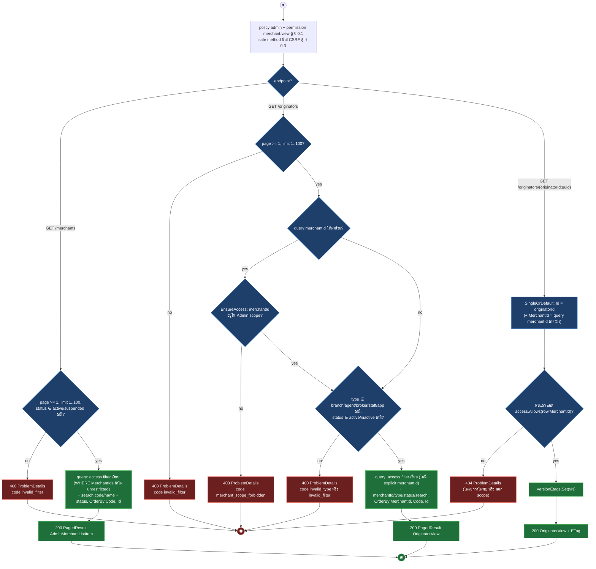
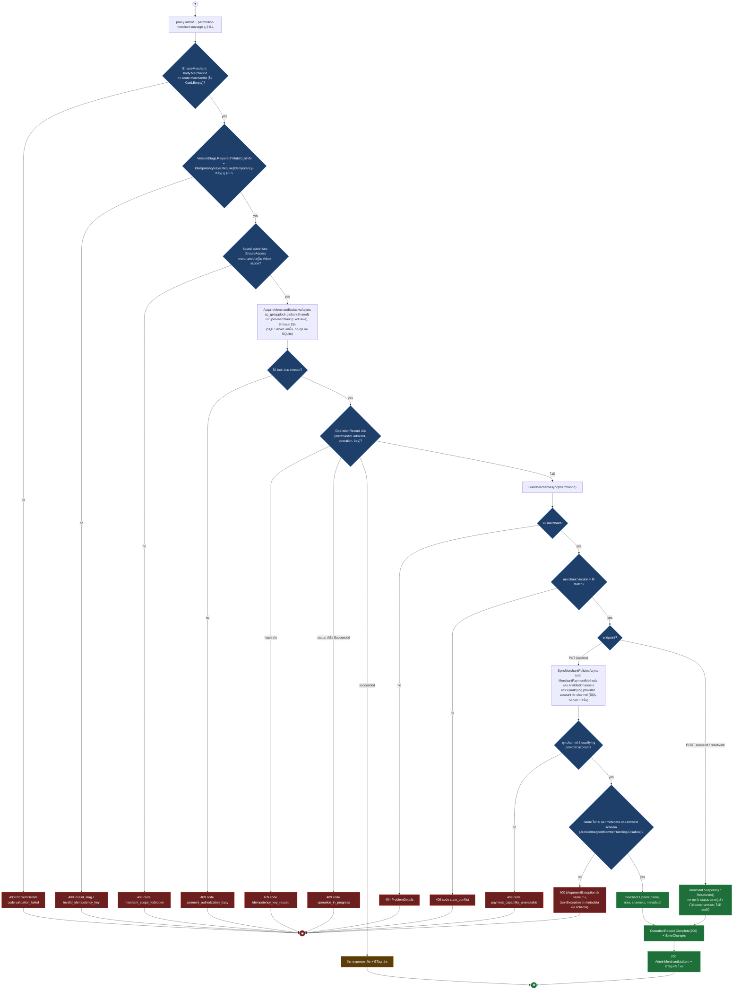
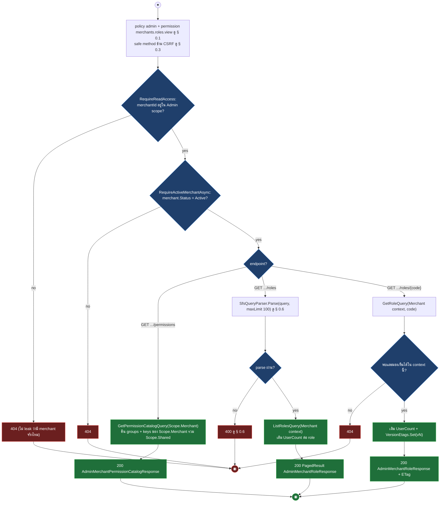
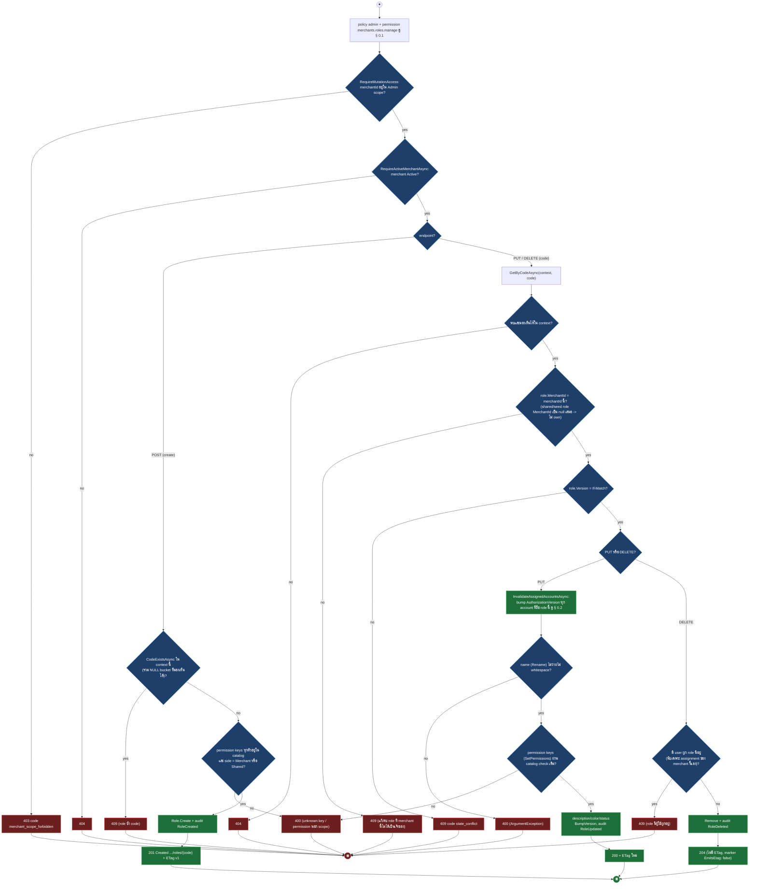
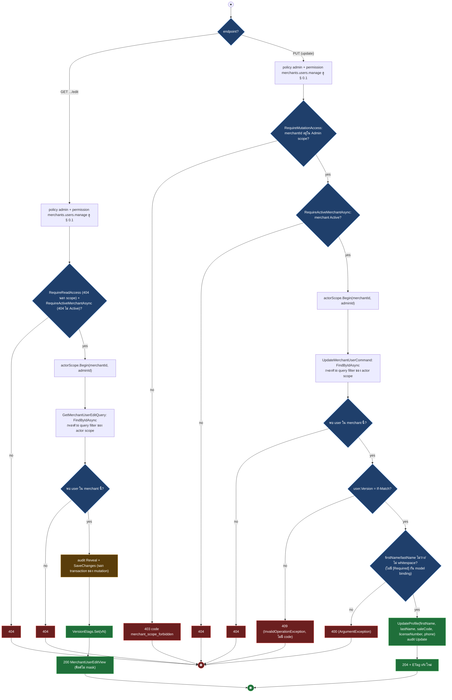
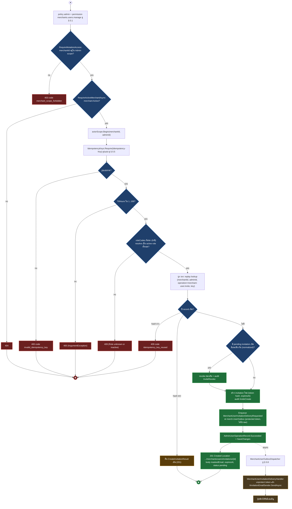
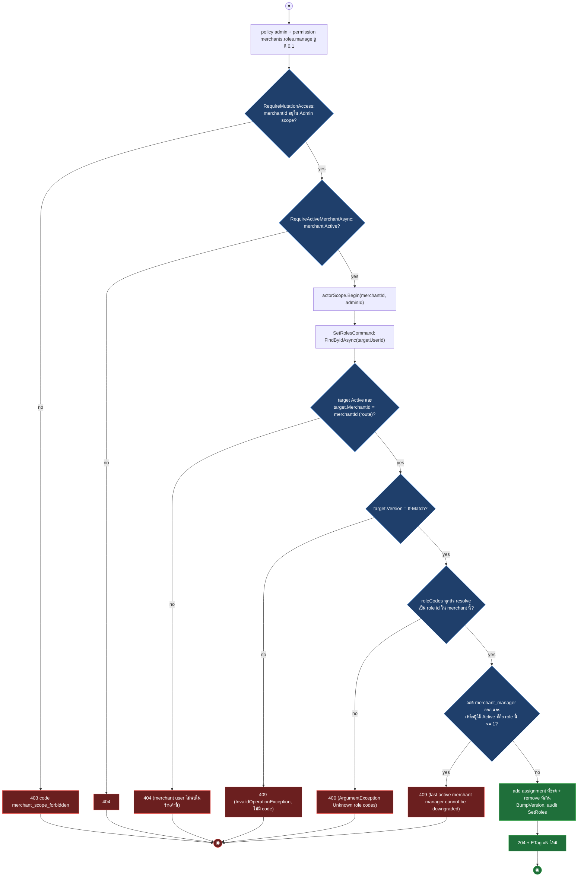
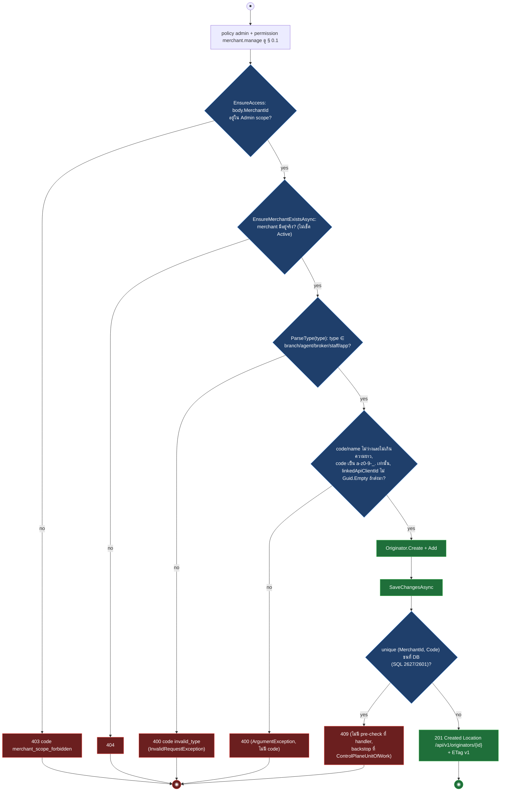
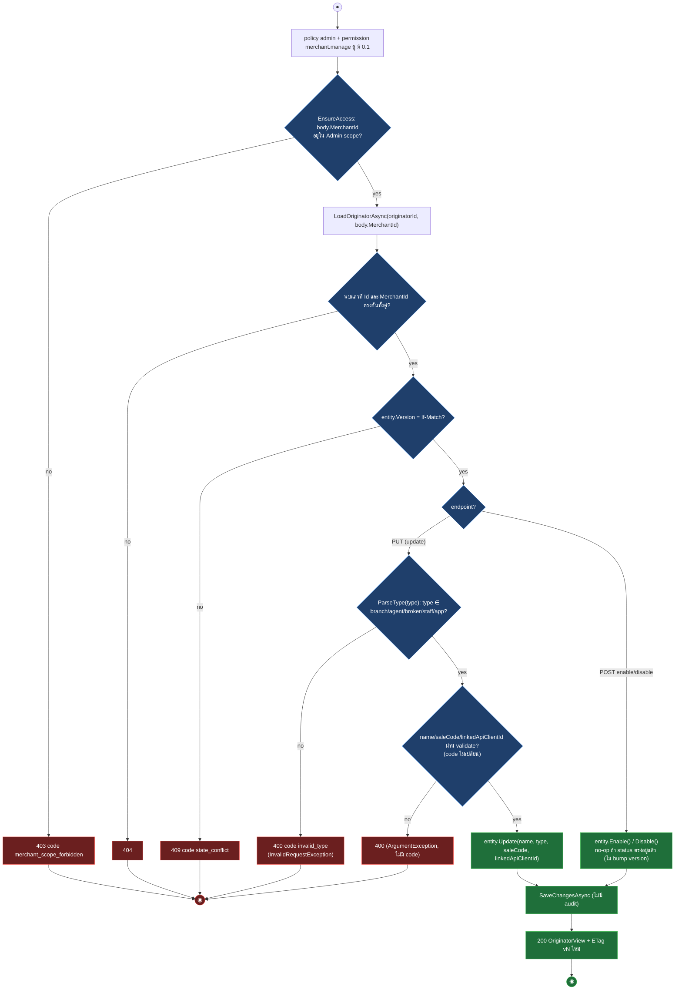
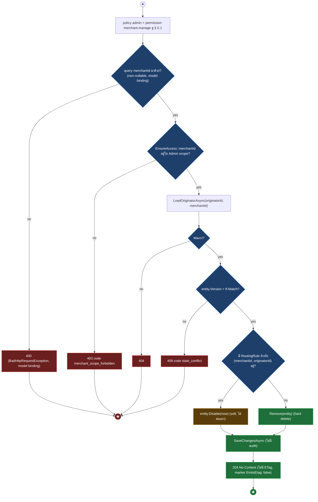

# pol-core API — Admin merchant console, merchant roles และ originators (Activity Diagrams)

> Source: `docs/reference/api-endpoints.md` section "Admin control และ merchant console" บรรทัด L233-L253 และ source ที่อ้างต่อ § (`src/Api/Api/ControlPlane/AdminControlEndpoints.cs`, `AdminMerchantIdentityEndpoints.cs`, `src/Application/Modules/Merchants.Application/AdminControlPlane/AdminMerchantControl.cs`, `Merchants.Application/Users/ManageMerchantUsers.cs`, `SetUserRoles.cs`, `src/Infrastructure/Persistence/Persistence.ControlPlane/Merchants/AdminMerchantControlStore.cs`, `Payments/PaymentAuthorizationSqlLockManager.cs`, `src/Application/Modules/Iam.Application/Roles/*`, `src/Domain/Modules/Iam.Domain/Roles/Role.cs`, `src/Domain/Modules/Merchants.Domain/Merchant.cs`, `Originator.cs`, `Users/User.cs`)
> Scope: 21 endpoints — Admin console อ่าน/แก้ร้านค้า, บทบาทของร้านค้า, ผู้ใช้ร้านค้า และ Originator (branch/agent/broker/staff/app) ทั้งหมดอยู่ใต้ policy `admin`
> Generated: 2026-09-14

| § | Diagram | Endpoints |
| --- | --- | --- |
| 10.1 | Merchant / Originator read model (list ×2 + originator detail) | `GET /api/v1/merchants`, `GET /api/v1/originators`, `GET /api/v1/originators/{originatorId:guid}` |
| 10.2 | แก้ไข / ระงับ / เปิดใช้งานร้านค้าอีกครั้ง (idempotent executor + SQL lock) | `PUT /api/v1/merchants/{merchantId:guid}`, `POST /api/v1/merchants/{merchantId:guid}/suspend`, `POST /api/v1/merchants/{merchantId:guid}/reactivate` |
| 10.3 | Merchant role และ permission read model | `GET /api/v1/merchants/{merchantId:guid}/permissions`, `GET /api/v1/merchants/{merchantId:guid}/roles`, `GET /api/v1/merchants/{merchantId:guid}/roles/{code}` |
| 10.4 | Merchant role CRUD | `POST /api/v1/merchants/{merchantId:guid}/roles`, `PUT /api/v1/merchants/{merchantId:guid}/roles/{code}`, `DELETE /api/v1/merchants/{merchantId:guid}/roles/{code}` |
| 10.5 | ผู้ใช้ร้านค้า: edit view (reveal audit) + update โดย Admin | `GET /api/v1/merchants/{merchantId:guid}/users/{merchantUserId:guid}/edit`, `PUT /api/v1/merchants/{merchantId:guid}/users/{merchantUserId:guid}` |
| 10.6 | เชิญผู้ใช้เข้าร้านค้าโดย Admin (idempotent, async email outbox) | `POST /api/v1/merchants/{merchantId:guid}/user-invitations` |
| 10.7 | กำหนดบทบาทให้ผู้ใช้ร้านค้าโดย Admin | `PUT /api/v1/merchants/{merchantId:guid}/users/{merchantUserId:guid}/roles` |
| 10.8 | สร้าง Originator | `POST /api/v1/originators` |
| 10.9 | แก้ไข / เปิดใช้งาน / ปิดใช้งาน Originator (If-Match เท่านั้น ไม่มี Idempotency-Key) | `PUT /api/v1/originators/{originatorId:guid}`, `POST /api/v1/originators/{originatorId:guid}/enable`, `POST /api/v1/originators/{originatorId:guid}/disable` |
| 10.10 | ลบ Originator (soft-disable เมื่อยังถูก routing rule อ้างอิง) | `DELETE /api/v1/originators/{originatorId:guid}` |

หมายเหตุ gate ท้องถิ่นของ theme นี้: endpoint ที่อ่านผ่าน `AdminMerchantIdentityEndpoints.cs` (§ 10.3-10.7) เช็ค `RequireReadAccess`/`RequireMutationAccess` (merchant นอก Admin scope) แยกจาก `RequirePermission` — read คืน **404** (กัน leak ว่ามี merchant จริงไหม), mutation คืน **403** `merchant_scope_forbidden`; ทุก endpoint ในกลุ่มนี้เช็คเพิ่มว่า merchant ต้อง Active (`RequireActiveMerchantAsync`, 404) ส่วน endpoint ที่แก้ตรงผ่าน `AdminControlEndpoints.cs` (§ 10.2, 10.8-10.10) ใช้ `EnsureAccess` เดียวกัน (403 mutation, 404 สำหรับ read ที่คืน null) แต่**ไม่เช็ค merchant Active เลย** (source: `AdminMerchantIdentityEndpoints.cs:284-301`, `AdminMerchantControlStore.cs:637-641`)

---

## 10.1 Merchant / Originator read model (list ×2 + originator detail)

ทั้งสาม endpoint ผ่าน policy `admin` + permission `merchant.view` แล้ว query ตรงแบบไม่มี transaction ไม่มี SFS filter เต็มรูป (typed filter ธรรมดา คล้าย variant "approvals/audits" ใน § 0.6) — list กรอง access แบบเงียบ (WHERE MerchantIds), ส่วน list originator ที่ระบุ `merchantId` เจาะจงเช็ค `EnsureAccess` แบบ throw (source: `AdminControlEndpoints.cs:316-367,397-435`, `AdminMerchantControlStore.cs:33-54,346-385`)

| Method | fullPath | รายละเอียดเพิ่มเติม |
| --- | --- | --- |
| GET | `/api/v1/merchants` | ไม่มี `merchantId` filter จึงไม่มี branch 403, มีเฉพาะ 400 invalid_filter |
| GET | `/api/v1/originators` | `merchantId` เป็น query filter เจาะจง — นอก scope คืน **403** (ต่างจาก detail ที่คืน 404) |
| GET | `/api/v1/originators/{originatorId:guid}` | ไม่มี paging, คืน ETag, นอก scope หรือไม่พบยุบรวมเป็น 404 เดียว |

---

## 10.2 แก้ไข / ระงับ / เปิดใช้งานร้านค้าอีกครั้ง (idempotent executor + SQL lock)

ทั้งสาม endpoint ใช้ permission `merchant.manage`, ตรวจ `body.MerchantId` ตรง route ก่อน แล้วเข้า keyed "admin" transaction เดียวกัน: ล็อก SQL แบบ exclusive ต่อ merchant, หา `OperationRecord` เดิมด้วย (merchantId, adminId, operation, Idempotency-Key) เพื่อ replay, เช็ค version แล้ว mutate — เฉพาะ PUT มีขั้น sync payment-method policy เพิ่ม (source: `AdminControlEndpoints.cs:316-395,1064-1089`, `AdminMerchantControlStore.cs:56-113,437-473,637-647`, `PaymentAuthorizationSqlLockManager.cs:32-73`, `Merchant.cs:115-123,180-194`)

| Method | fullPath | ต่างจากไดอะแกรมตรงไหน |
| --- | --- | --- |
| PUT | `/api/v1/merchants/{merchantId:guid}` | diagram — body name/note/enabledChannels/metadata, มี SyncMerchantPoliciesAsync, operation `merchant.update`, 200 |
| POST | `/api/v1/merchants/{merchantId:guid}/suspend` | diagram — body มีแค่ MerchantId, activate=false, ข้าม SyncMerchantPoliciesAsync, operation `merchant.suspend`, 200 |
| POST | `/api/v1/merchants/{merchantId:guid}/reactivate` | diagram — body มีแค่ MerchantId, activate=true, ข้าม SyncMerchantPoliciesAsync, operation `merchant.reactivate`, 200 |

---

## 10.3 Merchant role และ permission read model

สาม endpoint อ่านของร้านค้าเดียวกัน ผ่าน gate ท้องถิ่น `RequireReadAccess` (404 นอก scope) + `RequireActiveMerchantAsync` (404 ไม่ Active) ก่อนเสมอ — เฉพาะ list role ใช้ `SfsQueryParser` เต็มรูป (§ 0.6), permission catalog และ role detail ไม่มี filter (source: `AdminMerchantIdentityEndpoints.cs:105-175,284-301`, `Iam.Application/Roles/RoleQueries.cs:11-51`)

| Method | fullPath | รายละเอียดเพิ่มเติม |
| --- | --- | --- |
| GET | `/api/v1/merchants/{merchantId:guid}/permissions` | ไม่มี paging, catalog นิ่ง (ไม่ต่อ DB ต่อ role) |
| GET | `/api/v1/merchants/{merchantId:guid}/roles` | `SfsQueryParamsMarker(100)` เต็มรูป ดู § 0.6, filters/sort/search จริง |
| GET | `/api/v1/merchants/{merchantId:guid}/roles/{code}` | GET เดี่ยว ไม่มี paging, มี ETag |

---

## 10.4 Merchant role CRUD

สาม endpoint แก้ role ของร้านค้าเดียวกัน ผ่าน gate ท้องถิ่น `RequireMutationAccess` (403) + `RequireActiveMerchantAsync` (404) — create เช็คโค้ดซ้ำก่อนสร้าง, update/delete โหลด role ด้วย `GetByCodeAsync` แล้วเช็ค ownership (role ที่มองเห็นได้แต่ merchant ไม่ได้เป็นเจ้าของ เช่น shared/seed role ที่ `MerchantId` เป็น null เสมอ) ก่อนเช็ค version (source: `AdminMerchantIdentityEndpoints.cs:177-244,284-301`, `Iam.Application/Roles/CreateRole.cs:17-51`, `UpdateRole.cs:16-77`, `DeleteRole.cs:13-60`, `Iam.Domain/Roles/Role.cs:57-149`)

| Method | fullPath | ต่างจากไดอะแกรมตรงไหน |
| --- | --- | --- |
| POST | `/api/v1/merchants/{merchantId:guid}/roles` | diagram — 409 ซ้ำ code, 400 permission key, ไม่มี If-Match, 201 |
| PUT | `/api/v1/merchants/{merchantId:guid}/roles/{code}` | diagram — code เปลี่ยนไม่ได้, InvalidateAssignedAccountsAsync ก่อนเขียน, 200 |
| DELETE | `/api/v1/merchants/{merchantId:guid}/roles/{code}` | diagram — ต้องไม่มี user ผูกอยู่, ไม่มี ETag response, 204 |

---

## 10.5 ผู้ใช้ร้านค้า: edit view (reveal audit) + update โดย Admin

GET edit ผ่าน gate read (404 นอก scope) แล้วเขียน audit `Reveal` ทุกครั้งที่เปิดดู (นอก transaction) ก่อนคืนฟิลด์ที่ไม่ mask, PUT ผ่าน gate mutation (403 นอก scope) แล้วต้องมี If-Match — ทั้งคู่ไม่เช็ค `user.MerchantId == merchantId` ตรง ๆ ใน handler แต่พึ่ง query filter ของ `actorScope.Begin(merchantId, adminId)`; PUT request record ไม่มี `[Required]` บน `firstName`/`lastName` จึงผ่าน model binding ด้วยค่าว่างได้ แล้วไปชน `400` ที่ `User.UpdateProfile` แทน (source: `AdminMerchantIdentityEndpoints.cs:28-52,78-102,284-301,326-327`, `Merchants.Application/Users/ManageMerchantUsers.cs:288-333`, `Merchants.Domain/Users/User.cs:132-135,246-250`)

| Method | fullPath | ต่างจากไดอะแกรมตรงไหน |
| --- | --- | --- |
| GET | `/api/v1/merchants/{merchantId:guid}/users/{merchantUserId:guid}/edit` | diagram — gate read (404), เขียน audit Reveal ทุกครั้งที่เปิด, มี ETag |
| PUT | `/api/v1/merchants/{merchantId:guid}/users/{merchantUserId:guid}` | diagram — gate mutation (403), ต้อง If-Match, 409 ไม่มี machine code, 400 ถ้า firstName/lastName ว่าง (ไม่มี `[Required]` กัน model binding), 204 |

---

## 10.6 เชิญผู้ใช้เข้าร้านค้าโดย Admin (idempotent, async email outbox)

Endpoint เดียวแต่ branch ซับซ้อน: TTL validate, resolve roleCodes เป็น role ที่ Active (Admin audience เท่านั้น), replay ผ่าน `IAdminUserOperationStore` (เฉพาะ hash ต่าง หรือ hash ตรงแล้ว replay — ไม่มี state "in progress" เพราะรันจบใน transaction เดียว), revoke invitation เดิมที่ยัง pending อีเมลเดียวกัน แล้ว enqueue อีเมลผ่าน outbox จริง (source: `Merchants.Application/Users/ManageMerchantUsers.cs:21-130`, `AdminMerchantIdentityEndpoints.cs:54-76,284-301`, `Persistence.MerchantUsers/Outbox/MerchantRegistrationOutboxWriter.cs:46-64`)

---

## 10.7 กำหนดบทบาทให้ผู้ใช้ร้านค้าโดย Admin

ใช้ `SetRolesCommand` ตัวเดียวกับ endpoint self-service ฝั่ง merchant-user (`PUT /api/v1/merchants/users/{merchantUserId:guid}/roles`) — ฝั่ง Admin ส่ง `ActingMerchantUserId = scope.Current.AdminId` (Guid ของ admin เอง ไม่ใช่ merchant user จริง) เพื่อ stamp เป็นผู้ assign เท่านั้น target ต้อง Active และอยู่ merchant เดียวกับ route ไม่งั้น 404 (source: `AdminMerchantIdentityEndpoints.cs:246-269,284-301`, `Merchants.Application/Users/SetUserRoles.cs:17-103`)

---

## 10.8 สร้าง Originator

สร้าง Originator ใน merchant ที่ Admin เข้าถึงได้ — เช็คแค่ว่า merchant "มีอยู่จริง" (ไม่เช็ค Active เหมือน § 10.3-10.7) แล้วไม่มี pre-check โค้ดซ้ำที่ handler เลย รหัส (MerchantId, Code) ซ้ำจะชนที่ DB ตอน SaveChanges แล้วถูกแปลเป็น 409 โดย `ControlPlaneUnitOfWork` เป็น backstop — ตาราง Originators ไม่มี FK บน `ApiClientId` เลย (มีแค่ unique index (MerchantId, Code) และ FK ไปยัง Merchants) จึง apiClientId ที่ไม่มีอยู่จริงจะถูกบันทึกเงียบ ๆ โดยไม่มีการตรวจสอบใด ๆ (source: `AdminControlEndpoints.cs:397-467`, `AdminMerchantControlStore.cs:387-397,541-546,637-641`, `Originator.cs:36-61,85-110`, `Admins/ControlPlaneUnitOfWork.cs:34-54`, `OriginatorConfiguration.cs:20-22`)

---

## 10.9 แก้ไข / เปิดใช้งาน / ปิดใช้งาน Originator (If-Match เท่านั้น)

สามตัวนี้ใช้ `LoadOriginatorAsync(originatorId, body.MerchantId)` เดียวกัน (Id และ MerchantId ต้องตรงทั้งคู่ ไม่งั้น 404) แล้วเช็ค If-Match — **ไม่มี** Idempotency-Key และไม่มี operation executor เหมือน § 10.2 (ไม่มี replay), enable/disable เป็น no-op ถ้า status ตรงอยู่แล้ว และไม่มี audit log ใด ๆ ต่อการแก้ (source: `AdminControlEndpoints.cs:397-495,520-545`, `AdminMerchantControlStore.cs:399-419,548-551`, `Originator.cs:63-83`)

| Method | fullPath | ต่างจากไดอะแกรมตรงไหน |
| --- | --- | --- |
| PUT | `/api/v1/originators/{originatorId:guid}` | diagram — แก้ name/saleCode/linkedApiClientId, 400 code invalid_type ถ้า type ผิด, 400 (ArgumentException) ถ้า field อื่น validate ไม่ผ่าน |
| POST | `/api/v1/originators/{originatorId:guid}/enable` | diagram — SetStatus(Active), ไม่มี body validate เพิ่ม |
| POST | `/api/v1/originators/{originatorId:guid}/disable` | diagram — SetStatus(Inactive), ไม่มี body validate เพิ่ม |

---

## 10.10 ลบ Originator (soft-disable เมื่อยังถูก routing rule อ้างอิง)

`merchantId` เป็น query parameter (non-nullable — ไม่ส่งมาโดน model binding ปฏิเสธก่อนถึง handler) ใช้แทน body ของสาม § ก่อนหน้า ลบจริงเฉพาะเมื่อไม่มี `RoutingRule` อ้างอิง originator นี้อยู่ ไม่งั้น soft-disable แทนแล้วยังตอบ 204 เหมือนเดิม (source: `AdminControlEndpoints.cs:397-399,497-517`, `AdminMerchantControlStore.cs:421-435`)

---

## Deviations

ไม่พบ deviation ระหว่างตารางเอกสาร (`docs/reference/api-endpoints.md` L233-L253) กับ source — permission key, policy และ CSRF ตรงกันทุกแถว

## Notes

- theme file `theme-T10.md` อ้าง doc line L231-L251 (จุดเริ่มค้น) แต่บรรทัดจริงในไฟล์ปัจจุบันคือ L233-L253 (เอกสารถูกแก้เลื่อน 2 บรรทัดหลังสร้าง theme file) — 21 แถวยังต่อเนื่องและครบ
- seed-anchor guard ใน `UpdateRoleHandler`/`DeleteRoleHandler` (`Role.IsSeedAnchor` ต้อง `MerchantId is null`) เป็น dead code ในบริบท Merchant ของ theme นี้ เพราะ ownership guard (`role.MerchantId != merchantId`) ดักไว้ก่อนเสมอ — role ที่ merchant เป็นเจ้าของมี `MerchantId` ไม่ใช่ null (source: `UpdateRole.cs:48-55`, `DeleteRole.cs:43-48`)
- Originator mutations (สร้าง/แก้/enable/disable/ลบ) ไม่มี `IManagementAuditWriter`/`IRoleAuditSink` เขียน audit log ใด ๆ ต่างจาก Role CRUD (§ 10.4) และ merchant-user mutations (§ 10.5-10.7) ที่เขียน audit ทุกครั้ง (source: `AdminMerchantControlStore.cs:387-435`)
- ตาราง `Originators` ไม่มี foreign key บนคอลัมน์ `ApiClientId` (มีแค่ `HasIndex(MerchantId, Code).IsUnique()` และ FK ไปยัง `Merchants`) — apiClientId ที่ไม่มีอยู่จริง (แต่ไม่ใช่ `Guid.Empty`) ผ่าน validate ที่ handler แล้วถูกบันทึกเงียบ ๆ ไม่มี SQL error ใด ๆ (§ 10.8, source: `OriginatorConfiguration.cs:20-22`, `PolDbContextModelSnapshot.cs:2433-2481`, migration `20260810112718_AdminTenantPspRoutingControlPlane.cs:125`)
- `DeleteOriginator` endpoint's `WithDescription` (`AdminControlEndpoints.cs:512`) เขียนว่า "รายการที่ยังถูกอ้างอิงลบไม่ได้ -> 409" แต่ source จริงทำ soft-disable แล้วตอบ 204 เสมอ (409 มีทางเดียวคือ version stale) — ตาราง inventory ไม่ได้อ้างพฤติกรรมนี้จึงไม่นับเป็น Deviation แต่บันทึกไว้เพื่อความถูกต้อง
- `SetRolesCommand` (§ 10.7) ใช้ร่วมกับ endpoint self-service ของ merchant-user เอง (`PUT /api/v1/merchants/users/{merchantUserId:guid}/roles`, อยู่นอก theme นี้) — ฝั่ง Admin stamp `ActingMerchantUserId` ด้วย Guid ของ admin ไม่ใช่ merchant user จริง เป็นแค่ label ผู้ assign ใน audit
- 409 shape ในธีมนี้มี 3 แบบต่างกัน: `ConcurrencyConflictException` (merchant/role version) เป็น code `state_conflict` เสมอ, plain `InvalidOperationException` (merchant-user version, § 10.5/10.7) ไม่มี code field, ส่วน `ConflictException` (role ownership/bound/originator DB constraint) มี message คงที่และมี code เฉพาะบางจุด — เทียบ node ในแต่ละ § ก่อนอ้างอิง code

**Render**: GitHub / Obsidian / VS Code Mermaid
