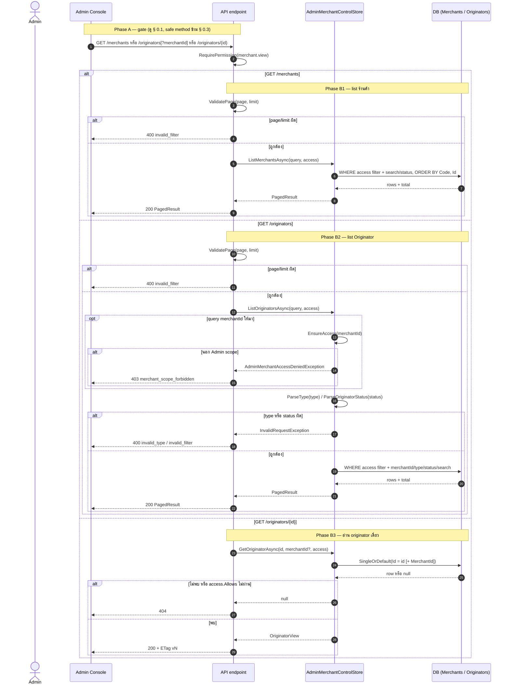
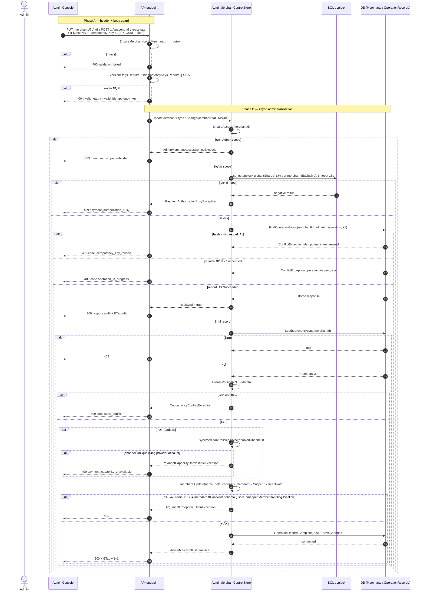
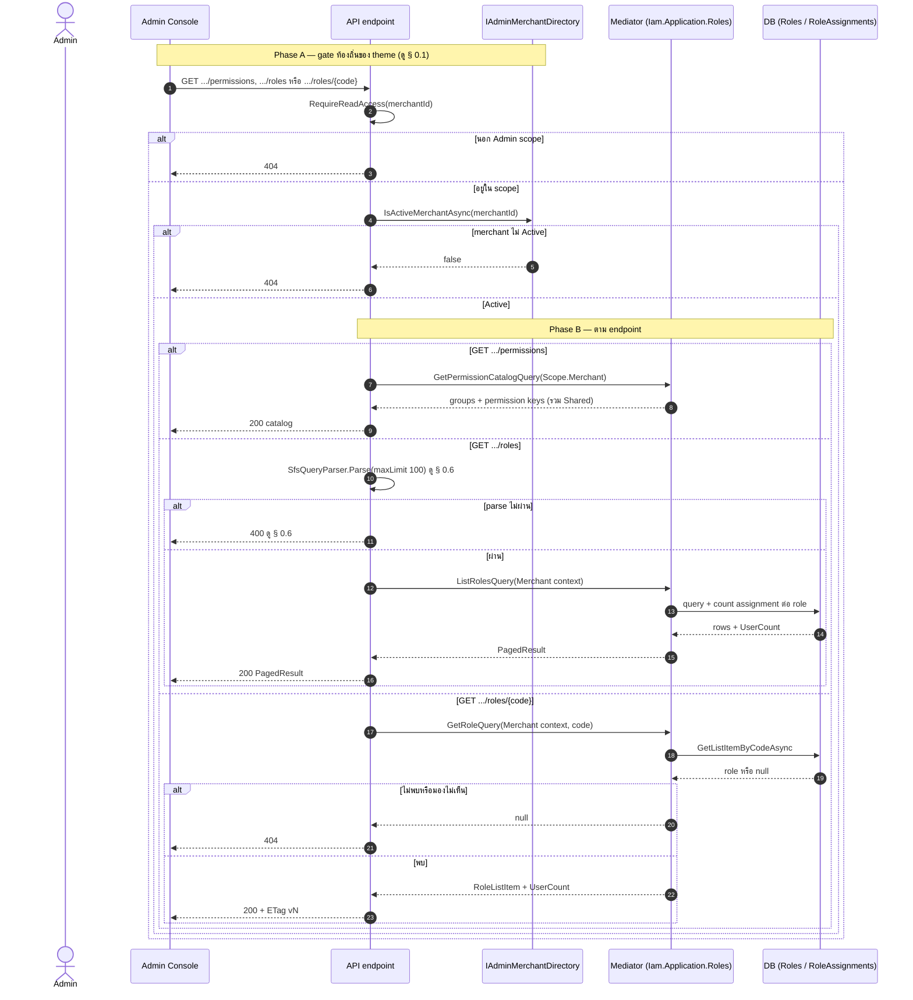
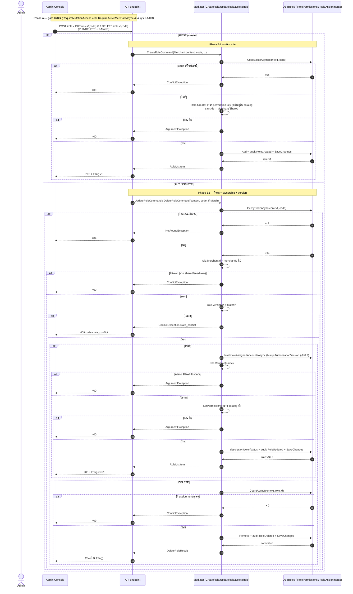
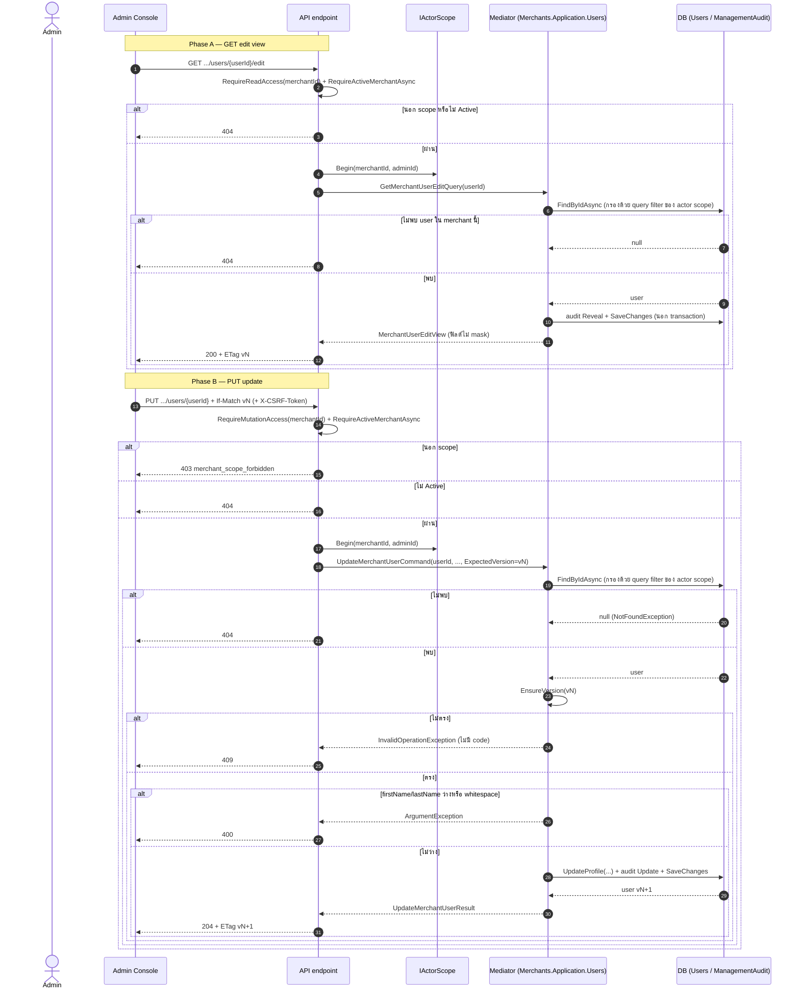
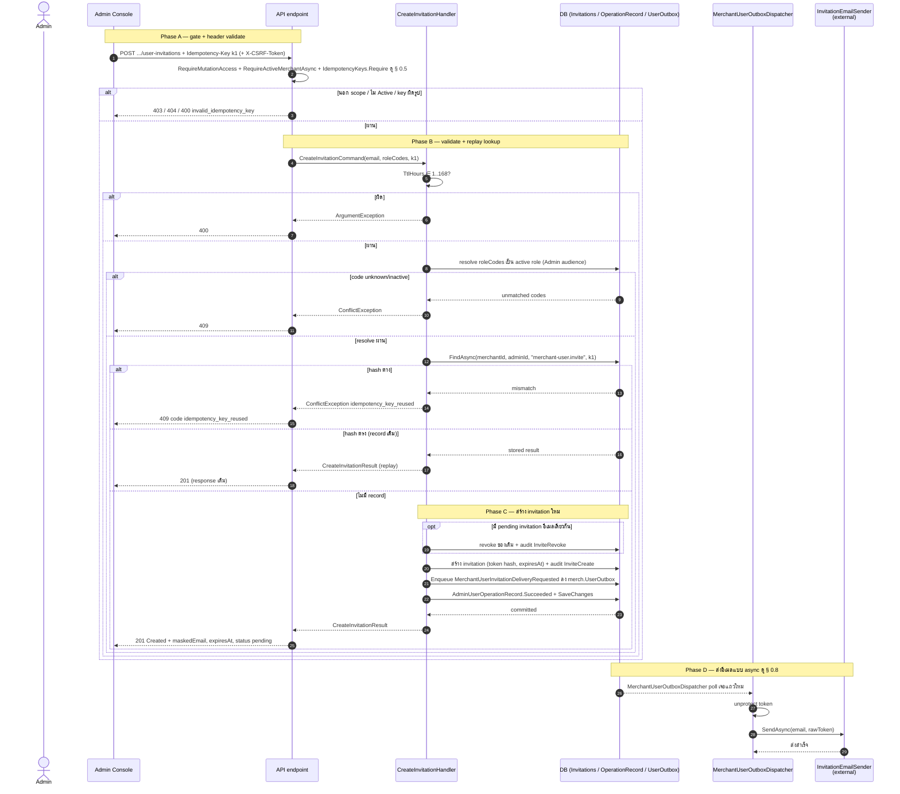
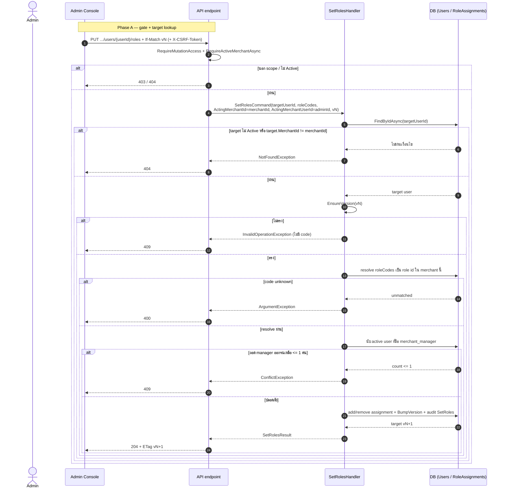
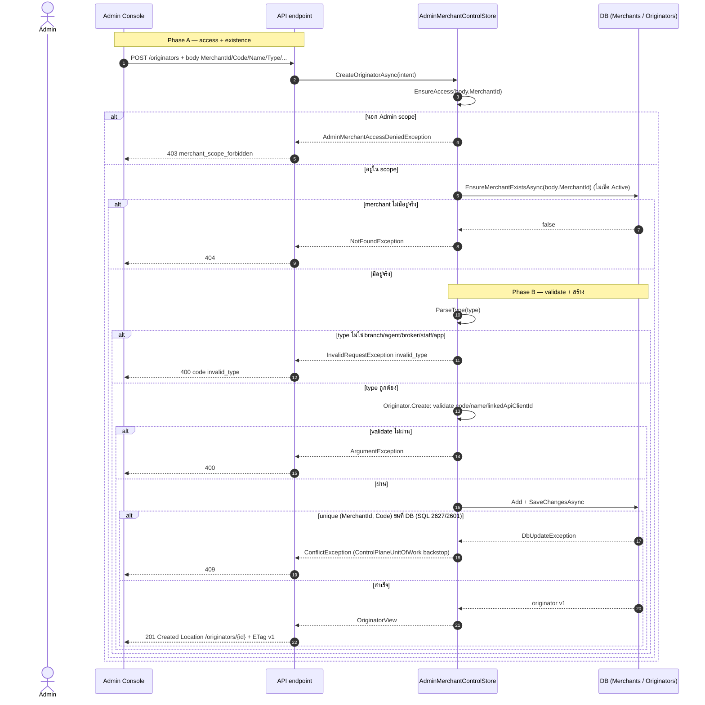
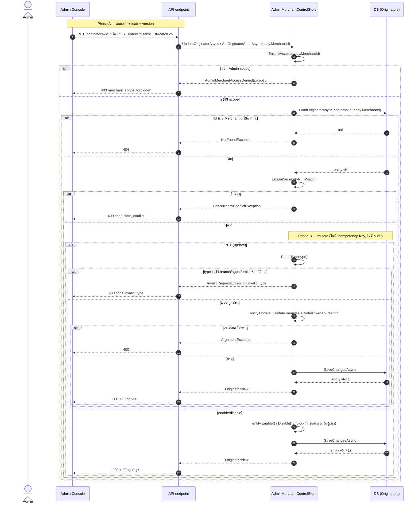
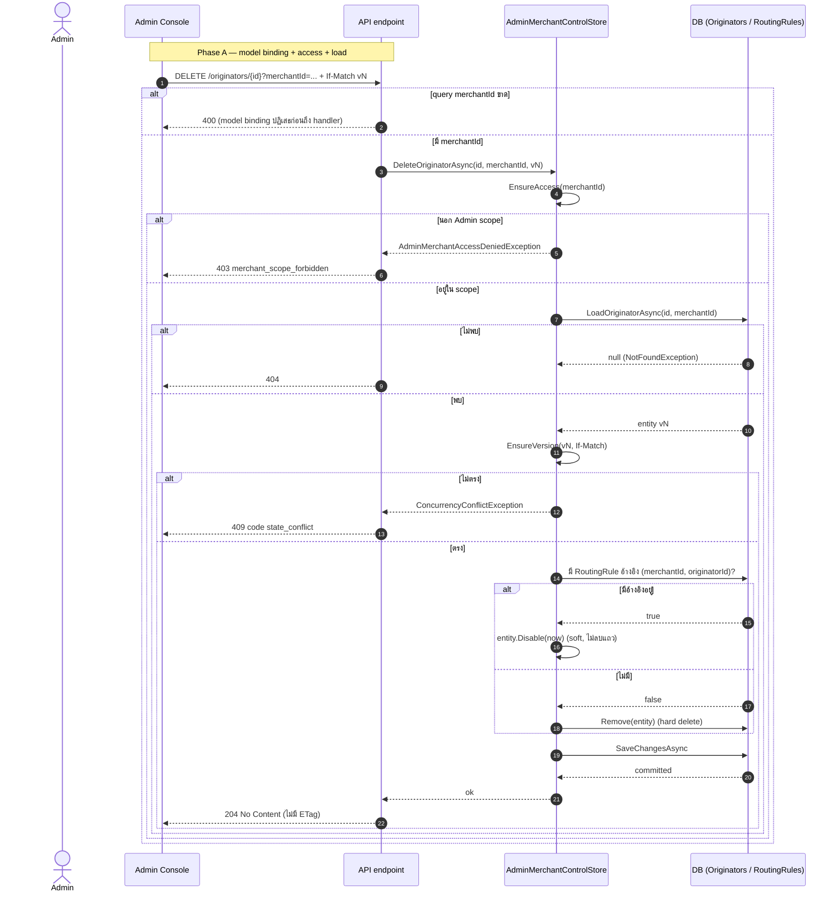

# pol-core API — Admin merchant console, merchant roles และ originators (Sequence Diagrams)

> Source: เดียวกับ `10-admin-merchant-console-originators.activities.md` (Deviations และ path:line เต็มอยู่ที่ไฟล์นั้น)
> Scope: 10 § เดียวกับไฟล์ activities (หมายเลข § ตรงกัน) แสดงลำดับข้าม actor / API / handler / DB / worker
> Generated: 2026-09-14

| § | Diagram | Endpoints |
| --- | --- | --- |
| 10.1 | Merchant / Originator read model (list ×2 + originator detail) | `GET /api/v1/merchants`, `GET /api/v1/originators`, `GET /api/v1/originators/{originatorId:guid}` |
| 10.2 | แก้ไข / ระงับ / เปิดใช้งานร้านค้าอีกครั้ง (idempotent executor + SQL lock) | `PUT /api/v1/merchants/{merchantId:guid}`, `POST /api/v1/merchants/{merchantId:guid}/suspend`, `POST /api/v1/merchants/{merchantId:guid}/reactivate` |
| 10.3 | Merchant role และ permission read model | `GET /api/v1/merchants/{merchantId:guid}/permissions`, `GET /api/v1/merchants/{merchantId:guid}/roles`, `GET /api/v1/merchants/{merchantId:guid}/roles/{code}` |
| 10.4 | Merchant role CRUD | `POST /api/v1/merchants/{merchantId:guid}/roles`, `PUT /api/v1/merchants/{merchantId:guid}/roles/{code}`, `DELETE /api/v1/merchants/{merchantId:guid}/roles/{code}` |
| 10.5 | ผู้ใช้ร้านค้า: edit view (reveal audit) + update โดย Admin | `GET /api/v1/merchants/{merchantId:guid}/users/{merchantUserId:guid}/edit`, `PUT /api/v1/merchants/{merchantId:guid}/users/{merchantUserId:guid}` |
| 10.6 | เชิญผู้ใช้เข้าร้านค้าโดย Admin (idempotent, async email outbox) | `POST /api/v1/merchants/{merchantId:guid}/user-invitations` |
| 10.7 | กำหนดบทบาทให้ผู้ใช้ร้านค้าโดย Admin | `PUT /api/v1/merchants/{merchantId:guid}/users/{merchantUserId:guid}/roles` |
| 10.8 | สร้าง Originator | `POST /api/v1/originators` |
| 10.9 | แก้ไข / เปิดใช้งาน / ปิดใช้งาน Originator (If-Match เท่านั้น) | `PUT /api/v1/originators/{originatorId:guid}`, `POST /api/v1/originators/{originatorId:guid}/enable`, `POST /api/v1/originators/{originatorId:guid}/disable` |
| 10.10 | ลบ Originator (soft-disable เมื่อยังถูก routing rule อ้างอิง) | `DELETE /api/v1/originators/{originatorId:guid}` |

---

## 10.1 Merchant / Originator read model (list ×2 + originator detail)

---

## 10.2 แก้ไข / ระงับ / เปิดใช้งานร้านค้าอีกครั้ง (idempotent executor + SQL lock)

---

## 10.3 Merchant role และ permission read model

---

## 10.4 Merchant role CRUD

---

## 10.5 ผู้ใช้ร้านค้า: edit view (reveal audit) + update โดย Admin

---

## 10.6 เชิญผู้ใช้เข้าร้านค้าโดย Admin (idempotent, async email outbox)

---

## 10.7 กำหนดบทบาทให้ผู้ใช้ร้านค้าโดย Admin

---

## 10.8 สร้าง Originator

---

## 10.9 แก้ไข / เปิดใช้งาน / ปิดใช้งาน Originator (If-Match เท่านั้น)

---

## 10.10 ลบ Originator (soft-disable เมื่อยังถูก routing rule อ้างอิง)

---

## Notes

- Deviations, สถิติ line-offset ของ inventory doc และรายละเอียดต่อ endpoint ทั้งหมดอยู่ที่ `10-admin-merchant-console-originators.activities.md` — ไฟล์นี้แสดงเฉพาะลำดับข้าม actor/system ของ flow เดียวกัน
- § 10.1/10.3/10.4/10.5/10.7 ใช้ participant `MED`/`STORE` แทน mediator handler หรือ store ตามที่ endpoint นั้นเรียกจริง (`IMediator.Send` ของ `Iam.Application.Roles`/`Merchants.Application.Users` หรือเรียก `AdminMerchantControlStore` ตรง) — ดู source citation ที่ไฟล์ activities ต่อ §

**Render**: GitHub / Obsidian / VS Code Mermaid
