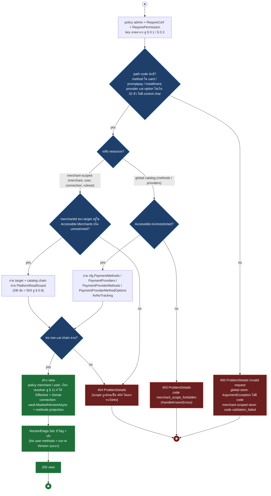
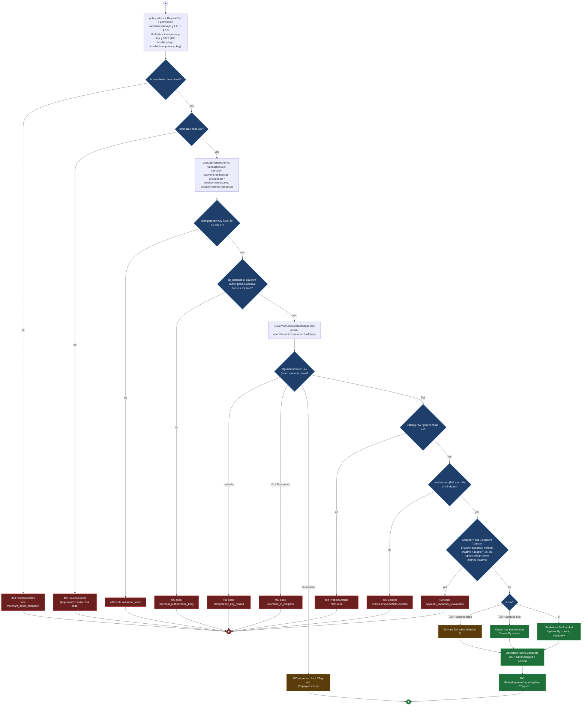
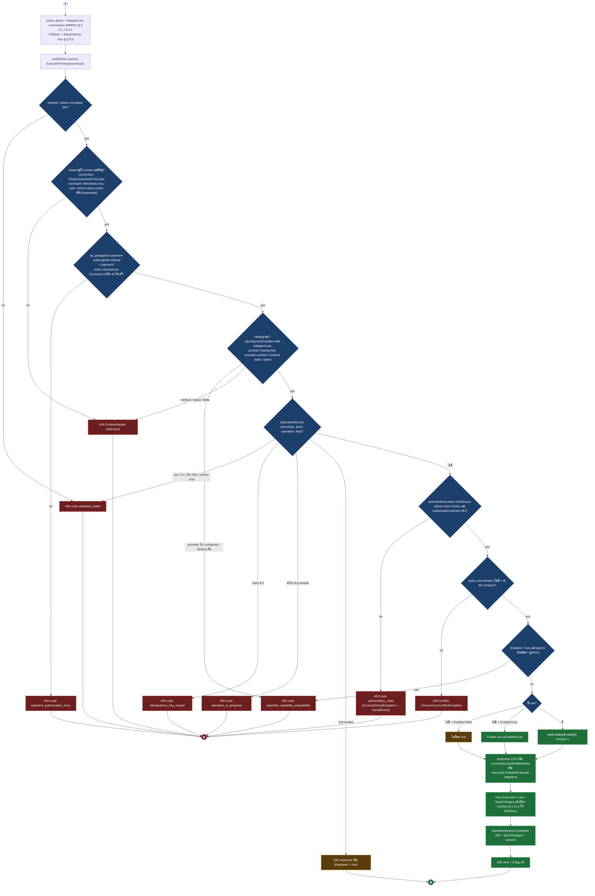
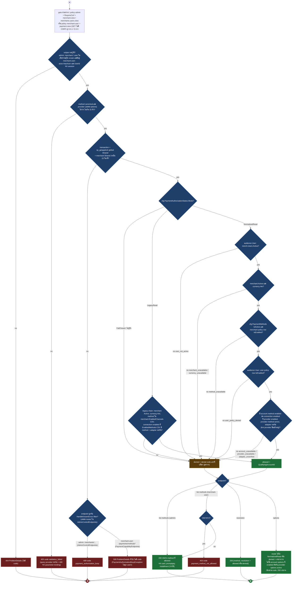
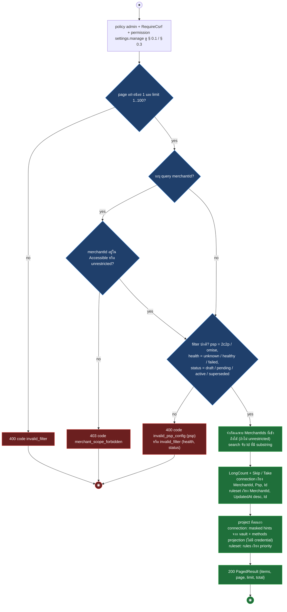
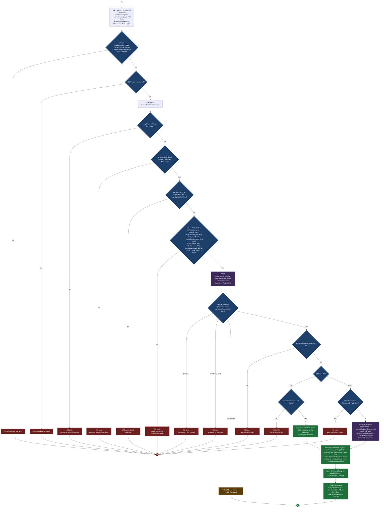
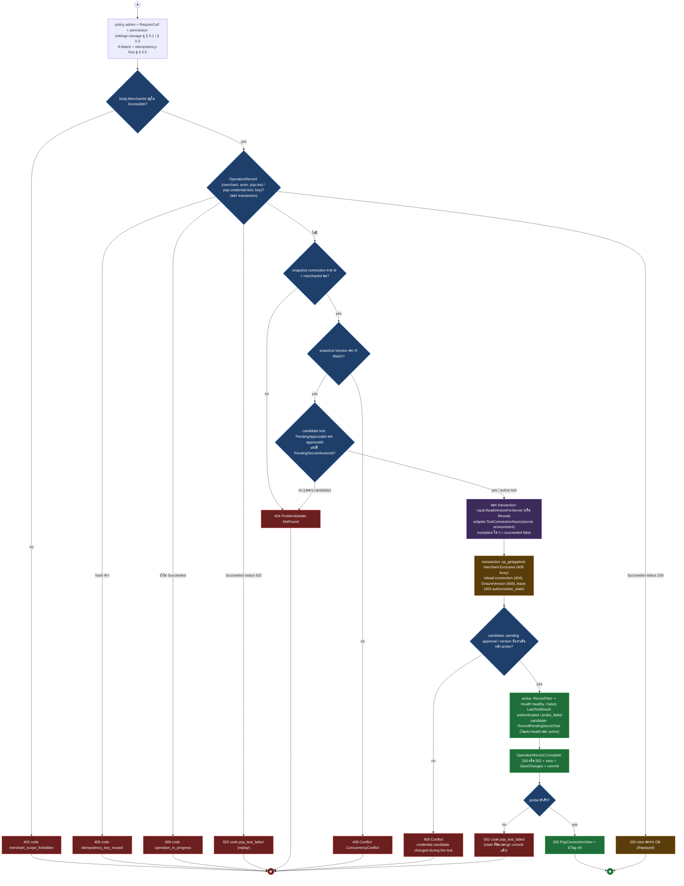
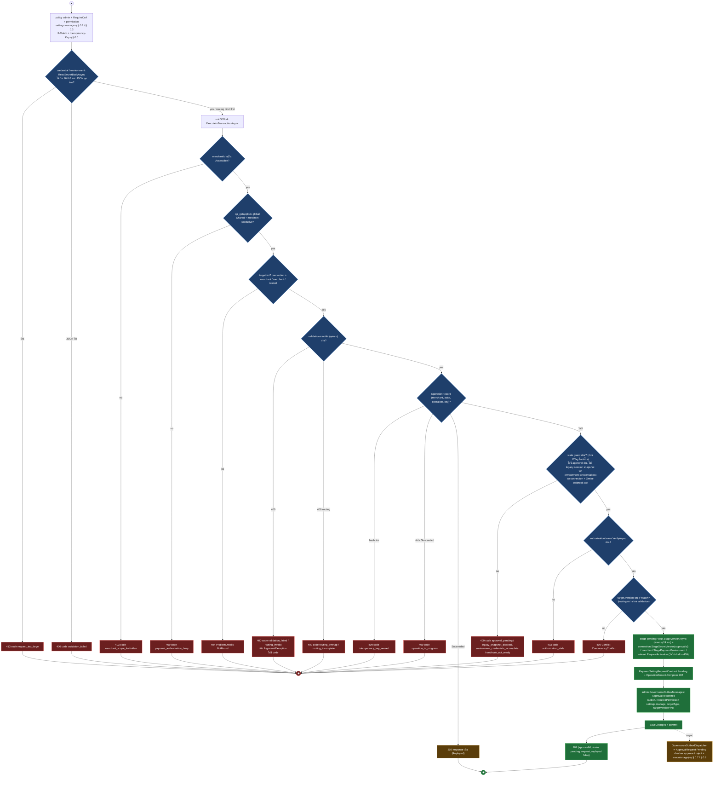
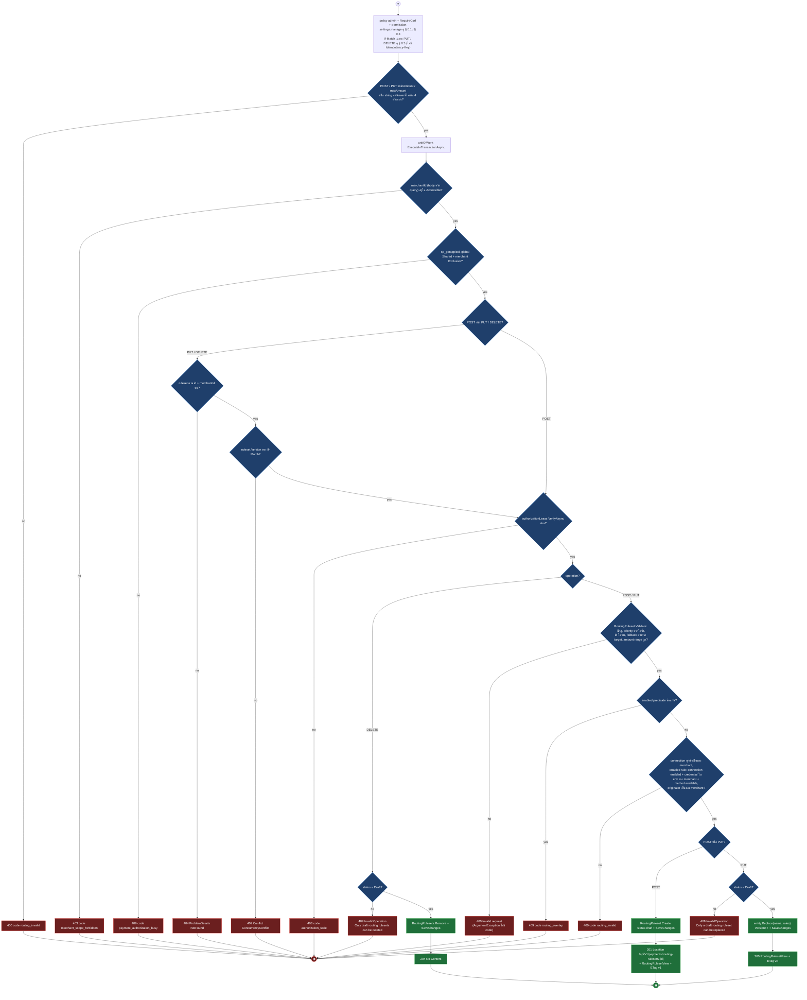
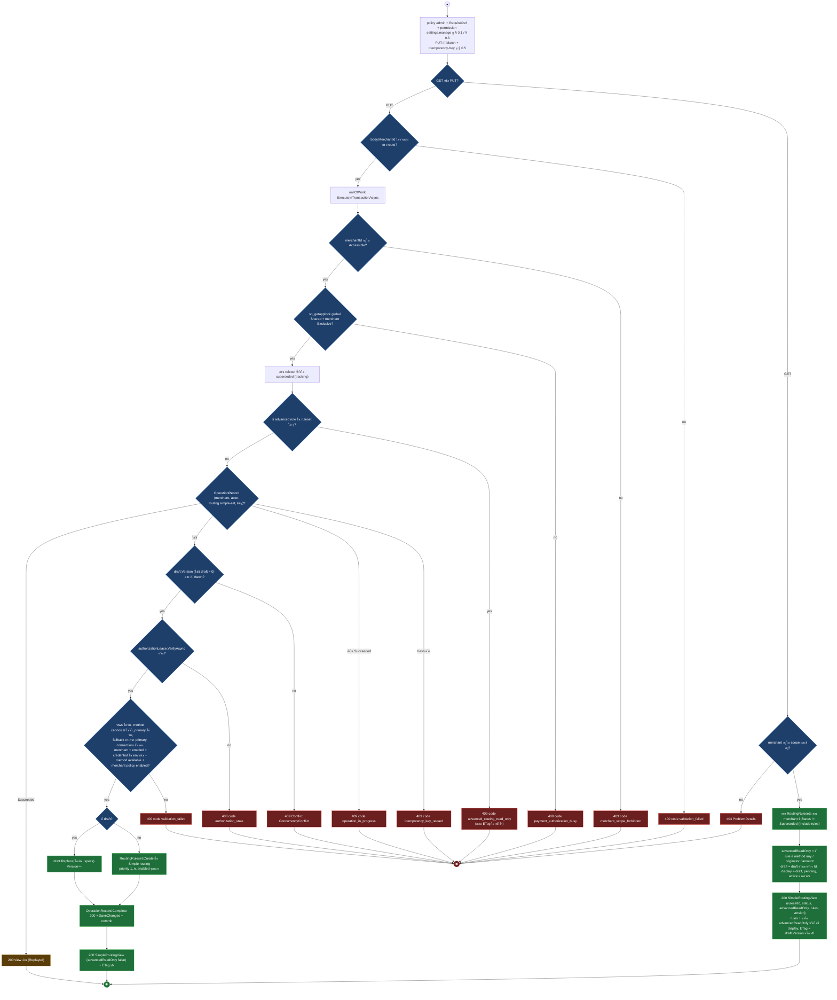

# pol-core API — Payment capability configuration (Activity Diagrams)

> Source: `docs/reference/api-endpoints.md` section "Admin control และ merchant console" บรรทัด L254-L292 และ source ที่อ้างต่อ § (`src/Api/Api/ControlPlane/AdminControlEndpoints.cs`, `src/Api/Api/Payments/PaymentCapabilityEndpoints.cs`, `src/Infrastructure/Persistence/Persistence.ControlPlane/Payments/AdminPaymentsControlStore.cs`, `GlobalPaymentCapabilityControlStore.cs`, `Capabilities/EffectivePaymentCapabilityResolver.cs`, `PaymentAuthorizationSqlLockManager.cs`, `MerchantRuntimeAuthorizationLease.cs`, `Governance/ControlPlaneOperationExecutor.cs`, `src/Domain/Modules/Payments.Domain/Routing.cs`, `Psp/Connection.cs`)
> Scope: 39 endpoint ใต้ `/api/v1/payments/*` ครอบ capability catalog ระดับ platform / provider / account / merchant / merchant user, effective resolution, PSP connection (สร้าง แก้ ทดสอบ เปลี่ยน credential), payment environment และ routing ruleset (draft, simple routing, activation) ไม่รวม checker (`/approvals/*` ดู § 0.7) และ webhook
> Generated: 2026-09-14

| § | Diagram | Endpoints |
| --- | --- | --- |
| 11.1 | อ่านรายละเอียด capability / setting พร้อม ETag | `GET /api/v1/payments/methods/{method}`, `GET /api/v1/payments/providers/{providerCode}`, `GET /api/v1/payments/providers/{providerCode}/methods/{method}`, `GET /api/v1/payments/providers/{providerCode}/methods/{method}/options/{option}`, `GET /api/v1/payments/psp-connections/{connectionId:guid}/methods/{method}`, `GET /api/v1/payments/psp-connections/{connectionId:guid}/methods/{method}/options/{option}`, `GET /api/v1/payments/merchants/{merchantId:guid}/methods/{method}`, `GET /api/v1/payments/merchants/{merchantId:guid}/users/{userId:guid}/methods`, `GET /api/v1/payments/merchants/{merchantId:guid}/users/{userId:guid}/methods/{method}`, `GET /api/v1/payments/merchant-settings/{merchantId:guid}`, `GET /api/v1/payments/psp-connections/{connectionId:guid}`, `GET /api/v1/payments/routing-rulesets/{rulesetId:guid}` |
| 11.2 | เปิด / ปิด capability ระดับ platform (global catalog) | `PUT /api/v1/payments/methods/{method}`, `PUT /api/v1/payments/providers/{providerCode}`, `PUT /api/v1/payments/providers/{providerCode}/methods/{method}`, `PUT /api/v1/payments/providers/{providerCode}/methods/{method}/options/{option}` |
| 11.3 | เปิด / ปิด capability ระดับ account / merchant / merchant user | `PUT /api/v1/payments/psp-connections/{connectionId:guid}/methods/{method}`, `PUT /api/v1/payments/psp-connections/{connectionId:guid}/methods/{method}/options/{option}`, `PUT /api/v1/payments/merchants/{merchantId:guid}/methods/{method}`, `PUT /api/v1/payments/merchants/{merchantId:guid}/users/{userId:guid}/methods/{method}` |
| 11.4 | Effective capability resolution (intersection chain) | `GET /api/v1/payments/merchants/{merchantId:guid}/methods`, `GET /api/v1/payments/merchants/{merchantId:guid}/users/{userId:guid}/methods/{method}/options`, `GET /api/v1/payments/merchants/{merchantId:guid}/users/{userId:guid}/methods/{method}/resolution`, `GET /api/v1/payments/methods`, `GET /api/v1/payments/methods/{method}/options` |
| 11.5 | รายการ PSP connection / routing ruleset แบบแบ่งหน้า | `GET /api/v1/payments/psp-connections`, `GET /api/v1/payments/routing-rulesets` |
| 11.6 | สร้าง / แก้ไข PSP connection | `POST /api/v1/payments/psp-connections`, `PUT /api/v1/payments/psp-connections/{connectionId:guid}` |
| 11.7 | ทดสอบ PSP connection (active credential / candidate credential) | `POST /api/v1/payments/psp-connections/{connectionId:guid}/test`, `POST /api/v1/payments/psp-connections/{connectionId:guid}/credential-change-requests/{approvalId:guid}/test` |
| 11.8 | คำขอ maker-checker: credential change, environment change, routing activation | `POST /api/v1/payments/psp-connections/{connectionId:guid}/credential-change-requests`, `POST /api/v1/payments/merchant-settings/{merchantId:guid}/environment-change-requests`, `POST /api/v1/payments/routing-rulesets/{rulesetId:guid}/activation-requests` |
| 11.9 | Routing ruleset draft: สร้าง / แทนที่ / ลบ | `POST /api/v1/payments/routing-rulesets`, `PUT /api/v1/payments/routing-rulesets/{rulesetId:guid}`, `DELETE /api/v1/payments/routing-rulesets/{rulesetId:guid}` |
| 11.10 | Simple routing ของหน้าตั้งค่าทั่วไป | `GET /api/v1/payments/merchant-settings/{merchantId:guid}/simple-routing`, `PUT /api/v1/payments/merchant-settings/{merchantId:guid}/simple-routing` |

---

## 11.1 อ่านรายละเอียด capability / setting พร้อม ETag

GET รายตัวทุกระดับใช้โครงเดียว: gate, normalize path code, ตัดสิน scope (global ต้อง unrestricted = 403, merchant-scoped ซ่อนเป็น 404), อ่าน catalog chain แล้วคืน view + `ETag` (source: `src/Api/Api/ControlPlane/AdminControlEndpoints.cs:28-37,55-64,82-92,111-121,140-150,169-179,210-220,239-267,549-569,622-643,842-863,1048-1062`, `src/Infrastructure/Persistence/Persistence.ControlPlane/Payments/GlobalPaymentCapabilityControlStore.cs:18-64,229-257`, `AdminPaymentsControlStore.cs:50-60,98-107,140-185,320-334,394-433,1008-1016,1420-1467,1531-1555,1595-1604`)

| Method | fullPath | ต่างจาก § กลางตรงไหน |
| --- | --- | --- |
| GET | `/api/v1/payments/methods/{method}` | permission `merchant.view`, global: ต้อง unrestricted (403), row = cfg.PaymentMethods ตาม code, view kind `method` AdapterSupported true เสมอ |
| GET | `/api/v1/payments/providers/{providerCode}` | permission `merchant.view`, global, row = cfg.PaymentProviders ตาม code (lower-case) |
| GET | `/api/v1/payments/providers/{providerCode}/methods/{method}` | permission `merchant.view`, global, provider หรือ method ไม่พบ = 404, ไม่มี provider-method row = view Enabled false Version 0 (ไม่ใช่ 404), AdapterSupported จาก adapter.SupportedMethods |
| GET | `/api/v1/payments/providers/{providerCode}/methods/{method}/options/{option}` | permission `merchant.view`, global, ต้องมี provider-method row และ canonical option ไม่งั้น 404, ไม่มี option row = Enabled false Version 0 |
| GET | `/api/v1/payments/psp-connections/{connectionId:guid}/methods/{method}` | permission `merchant.view`, connection ไม่อยู่ใน scope หรือยังไม่ bind provider = 404, provider ไม่ configured = 409 `payment_capability_unavailable`, view มี AdapterVerified + Denial (`connection_disabled`, `provider_disabled`, `method_inactive`, `provider_method_unavailable`, `adapter_unverified`, `account_method_disabled`) |
| GET | `/api/v1/payments/psp-connections/{connectionId:guid}/methods/{method}/options/{option}` | permission `merchant.view`, เพิ่มเงื่อนไข: ต้องมี account method row และ option catalog ไม่งั้น 404, Denial มีเฉพาะ `adapter_unverified` |
| GET | `/api/v1/payments/merchants/{merchantId:guid}/methods/{method}` | permission `merchant.view`, merchant ไม่อยู่ใน scope หรือ cfg.PaymentMethods ไม่มี code = 404, ไม่มี policy row = Enabled false Version 0, Effective + Denial จาก resolver audience PlatformAdmin (§ 11.4) |
| GET | `/api/v1/payments/merchants/{merchantId:guid}/users/{userId:guid}/methods` | permission `merchants.users.view`, user ต้อง Active หรือ Suspended ในร้านนั้น ไม่งั้น `Results.NotFound()` เปล่า (StatusCodePages แปลง ดู § 0.9), คืน list เรียง method, ETag = ผลรวม Version, Effective ต่อแถวจาก resolver audience User |
| GET | `/api/v1/payments/merchants/{merchantId:guid}/users/{userId:guid}/methods/{method}` | permission `merchants.users.view`, เหมือนแถวบนแต่รายตัว, ไม่มี policy row = Enabled false Version 0 |
| GET | `/api/v1/payments/merchant-settings/{merchantId:guid}` | permission `settings.manage`, ไม่มี path code ให้ parse, view = Environment (sandbox / live), PendingEnvironment, PendingApprovalId, ETag = Merchant.Version (ค่าที่ environment-change-requests ต้องส่ง) |
| GET | `/api/v1/payments/psp-connections/{connectionId:guid}` | permission `settings.manage`, query `merchantId` optional ใช้กรองเพิ่ม, view ไม่คืน credential (masked hints จาก vault.MaskedVersionAsync), CallbackUrl จาก adapter, HasPendingCredentialChange, PendingCredentialTest, WebhookRegistration, Methods projection |
| GET | `/api/v1/payments/routing-rulesets/{rulesetId:guid}` | permission `settings.manage`, query `merchantId` optional, view = Status (draft / pending / active / superseded), ApprovalId, Rules เรียง priority, amount เป็น string `0.00##` |

---

## 11.2 เปิด / ปิด capability ระดับ platform (global catalog)

PUT ระดับ platform ต้อง unrestricted admin, รันใน `ControlPlaneOperationExecutor.ExecutePlatformAsync` ที่ถือ global exclusive lock + OperationRecord แบบ platform scope, ตรวจ parent chain ก่อน upsert row (source: `src/Api/Api/ControlPlane/AdminControlEndpoints.cs:39-53,66-80,94-109,123-138`, `src/Infrastructure/Persistence/Persistence.ControlPlane/Payments/GlobalPaymentCapabilityControlStore.cs:66-186,226-239`, `Governance/ControlPlaneOperationExecutor.cs:31-82,93-97`, `Payments/PaymentAuthorizationSqlLockManager.cs:10-24`)

| Method | fullPath | ต่างจาก § กลางตรงไหน |
| --- | --- | --- |
| PUT | `/api/v1/payments/methods/{method}` | row = cfg.PaymentMethods (ไม่มี = 404 ไม่ create), ไม่มี PARENT check, `SetActive(Enabled)` |
| PUT | `/api/v1/payments/providers/{providerCode}` | row = cfg.PaymentProviders (ไม่มี = 404), ไม่มี PARENT check, `SetEnabled(Enabled)` |
| PUT | `/api/v1/payments/providers/{providerCode}/methods/{method}` | provider หรือ method ไม่พบ = 404, row = cfg.PaymentProviderMethods create-on-enable, PARENT = provider.IsEnabled + method.IsActive + adapter.SupportedMethods |
| PUT | `/api/v1/payments/providers/{providerCode}/methods/{method}/options/{option}` | provider-method row ไม่มี = 409 `payment_capability_unavailable`, canonical option (cfg.PaymentMethodOptions) ไม่มี = 404, row = cfg.PaymentProviderMethodOptions create-on-enable, PARENT เพิ่ม providerMethod.IsActive |

---

## 11.3 เปิด / ปิด capability ระดับ account / merchant / merchant user

PUT ระดับ merchant-scoped รันใน transaction ของ `AdminPaymentsControlStore` เอง: ถือ merchant exclusive lock, replay ผ่าน OperationRecord ต่อ merchant, ตรวจ authorization lease, parent chain, upsert policy row แล้ว project CSV เดิม (source: `src/Api/Api/ControlPlane/AdminControlEndpoints.cs:152-167,181-196,222-237,269-284`, `src/Infrastructure/Persistence/Persistence.ControlPlane/Payments/AdminPaymentsControlStore.cs:187-309,336-392,435-492,1476-1501,1570-1593,1606-1695,2141-2145`, `MerchantRuntimeAuthorizationLease.cs:24-39`, `PaymentAuthorizationSqlLockManager.cs:32-73`)

| Method | fullPath | ต่างจาก § กลางตรงไหน |
| --- | --- | --- |
| PUT | `/api/v1/payments/psp-connections/{connectionId:guid}/methods/{method}` | permission `merchant.manage`, operation `payment.account-method.set`, ตรวจ connection ก่อน lock, **PRIOR และ LEASE มาก่อน CATALOG** (replay check แล้ว authorization lease ก่อนโหลด provider/catalog chain, ต่างจาก diagram กลางที่วาง CATALOG ก่อน PRIOR), PARENT = connection.IsEnabled + provider.IsEnabled + method active + provider-method active + adapter รองรับ, projection = `connection.ProjectEnabledMethods` |
| PUT | `/api/v1/payments/psp-connections/{connectionId:guid}/methods/{method}/options/{option}` | permission `merchant.manage`, operation `payment.account-method-option.set`, **PRIOR และ LEASE มาก่อน CATALOG** เช่นเดียวกับแถวบน, ไม่มี account method row = 409 `payment_capability_unavailable`, option catalog ไม่มี = 404, PARENT เพิ่ม accountMethod.IsEnabled + provider-method-option active, ไม่มี projection |
| PUT | `/api/v1/payments/merchants/{merchantId:guid}/methods/{method}` | permission `merchant.manage`, operation `payment.merchant-method.set`, lock ก่อนตรวจ merchant, **CATALOG มาก่อน PRIOR** (โหลด method catalog ก่อน replay check, ตรงกับ diagram กลาง), PARENT = cfg.PaymentMethods active + `HasQualifyingAccountAsync` (มี account method บน connection enabled ที่ provider / provider-method active + adapter รองรับ), projection = `merchant.ProjectEnabledChannels`, view มี Denial |
| PUT | `/api/v1/payments/merchants/{merchantId:guid}/users/{userId:guid}/methods/{method}` | permission `merchants.users.manage`, operation `payment.merchant-user-method.set`, lock ก่อนตรวจ user, **CATALOG มาก่อน PRIOR** ตรงกับ diagram กลาง, PARENT = merchant policy row IsEnabled, ไม่มี projection, view ไม่มี Denial |

---

## 11.4 Effective capability resolution (intersection chain)

ทุก endpoint ที่คืนผล "ใช้ได้จริง" เรียก `EffectivePaymentCapabilityResolver` ภายใต้ shared lock: อ่าน authorization mode แล้วไล่ intersection ระดับ user, merchant, method catalog, merchant policy, user policy, account method, provider chain และ adapter จนได้ decision + denial แรกที่บล็อก (source: `src/Api/Api/Payments/PaymentCapabilityEndpoints.cs:12-59`, `src/Api/Api/ControlPlane/AdminControlEndpoints.cs:198-208,286-313`, `src/Infrastructure/Persistence/Persistence.ControlPlane/Payments/AdminPaymentsControlStore.cs:311-318,494-519,1531-1555`, `Capabilities/EffectivePaymentCapabilityResolver.cs:25-135,184-342`)

| Method | fullPath | ต่างจาก § กลางตรงไหน |
| --- | --- | --- |
| GET | `/api/v1/payments/merchants/{merchantId:guid}/methods` | policy `admin`, permission `merchant.view`, CSRF filter, subject audience PlatformAdmin (ข้าม C1 / C4), merchant นอก scope = 404, response = list ของ `EffectivePaymentMethod` |
| GET | `/api/v1/payments/merchants/{merchantId:guid}/users/{userId:guid}/methods/{method}/options` | policy `admin`, permission `merchants.users.view`, audience User, query `provider` บังคับ, user ต้อง Active หรือ Suspended (มีอยู่) แต่ chain C1 ต้อง Active, response = list ของ `EffectivePaymentOption` |
| GET | `/api/v1/payments/merchants/{merchantId:guid}/users/{userId:guid}/methods/{method}/resolution` | policy `admin`, permission `merchants.users.view`, audience User, ไม่ส่ง provider, response = `{method, resolution}` ไม่คืน denial code |
| GET | `/api/v1/payments/methods` | policy `merchant-user`, permission `payment.view`, ไม่มี CSRF, subject จาก session (actor.MerchantId + UserId), ไม่มี actor = 404, รายการว่าง = 403 `payment_method_not_allowed`, lock timeout = **500 ProblemDetails ทั่วไป ไม่มี code** (map ผ่าน `PaymentCapabilityEndpoints` ไม่ผ่าน `HandleKnownErrors` ของ `AdminControlEndpoints` ต่างจาก diagram กลาง — ดู Deviations) |
| GET | `/api/v1/payments/methods/{method}/options` | policy `merchant-user`, permission `payment.view`, query `provider` บังคับ, response `{method, provider, options}` โดย options ว่างเมื่อ method ไม่ effective, lock timeout = **500 ProblemDetails ทั่วไป ไม่มี code** เช่นเดียวกับแถวบน — ดู Deviations |

---

## 11.5 รายการ PSP connection / routing ruleset แบบแบ่งหน้า

GET list ทั้งสองใช้ query param ธรรมดา (ไม่ใช่ SFS): clamp ไม่มี ให้ 400 เมื่อ page / limit ผิด, merchantId นอก scope = 403, filter ไม่รู้จัก = 400, จำกัดผลตาม merchant ที่เข้าถึงได้ (source: `src/Api/Api/ControlPlane/AdminControlEndpoints.cs:599-620,821-840,1079-1083`, `src/Infrastructure/Persistence/Persistence.ControlPlane/Payments/AdminPaymentsControlStore.cs:62-96,985-1006,2072-2115`)

| Method | fullPath | ต่างจาก § กลางตรงไหน |
| --- | --- | --- |
| GET | `/api/v1/payments/psp-connections` | query `page`, `limit`, `search`, `merchantId`, `psp`, `health`, ต่อแถวอ่าน vault.MaskedVersionAsync + adapter.CallbackUrlFor + cfg.PaymentProviders (provider ไม่ configured = 409 `payment_capability_unavailable`) |
| GET | `/api/v1/payments/routing-rulesets` | query `page`, `limit`, `merchantId`, `status` (ไม่มี search / psp / health), Include rules, ไม่แตะ vault |

---

## 11.6 สร้าง / แก้ไข PSP connection

POST อ่าน body เองภายใต้ limit 16 KiB + `Cache-Control: no-store`, validate psp / methods / config / secret fields ก่อนแตะ vault, กัน record ซ้ำต่อ (merchant, psp) แล้ว stage + activate credential version แรก; PUT แก้ methods / config / IsEnabled โดยไม่แตะ credential (source: `src/Api/Api/ControlPlane/AdminControlEndpoints.cs:645-697,786-815`, `src/Infrastructure/Persistence/Persistence.ControlPlane/Payments/AdminPaymentsControlStore.cs:521-575,629-666,1606-1642,1939-2054`)

| Method | fullPath | ต่างจาก § กลางตรงไหน |
| --- | --- | --- |
| POST | `/api/v1/payments/psp-connections` | body อ่านเอง (413 / 400), ไม่มี If-Match, lease verify ครั้งแรกก่อน validate และซ้ำหลัง replay check, merchant ไม่พบ = 404, ซ้ำ provider = 409 `psp_connection_exists`, เขียน vault 2 ครั้ง (stage + activate), response 201 + Location + ETag |
| PUT | `/api/v1/payments/psp-connections/{connectionId:guid}` | body bind ปกติ (`UpdatePspConnectionRequest` ไม่มี secret), ต้อง If-Match, ข้าม BODY / JSON / secret validate / DUP, connection ต้องตรง body.MerchantId ไม่งั้น 404, ไม่แตะ vault, response 200 + ETag |

---

## 11.7 ทดสอบ PSP connection (active credential / candidate credential)

การทดสอบเป็นสองช่วง: probe adapter นอก transaction ด้วย secret จาก vault แล้วค่อยเปิด transaction บันทึกผล (health หรือ pending test) พร้อม OperationRecord ที่เก็บ status 200 หรือ 502 เพื่อ replay ผลเดิม, ล้มเหลวคืน 502 `psp_test_failed` พร้อม view ที่ health = failed (source: `src/Api/Api/ControlPlane/AdminControlEndpoints.cs:699-723,752-777,1030-1032`, `src/Infrastructure/Persistence/Persistence.ControlPlane/Payments/AdminPaymentsControlStore.cs:668-721,798-858`, `src/Domain/Modules/Payments.Domain/Psp/Connection.cs:171-176,228-233`)

| Method | fullPath | ต่างจาก § กลางตรงไหน |
| --- | --- | --- |
| POST | `/api/v1/payments/psp-connections/{connectionId:guid}/test` | operation `psp.test`, secret = ActiveSecretVersionId (หรือ Reveal ตาม SecretRefName เมื่อยังไม่มี version), environment = ActiveSecretEnvironment, ข้าม CAND / CAND2, เขียน Health + LastTestedAt + LastTestResult |
| POST | `/api/v1/payments/psp-connections/{connectionId:guid}/credential-change-requests/{approvalId:guid}/test` | operation `psp.credential-test`, ต้องมี pending approval ตรง approvalId ไม่งั้น 404, secret = PendingSecretVersionId, environment = PendingSecretEnvironment, compare-after-probe (409) แล้ว RecordPendingSecretTest เท่านั้น ไม่เปลี่ยน Health / ไม่ activate candidate |

---

## 11.8 คำขอ maker-checker: credential change, environment change, routing activation

maker ยื่นคำขอ 3 ชนิดที่ stage target เป็น pending ใน transaction เดียวกับ OperationRecord 202 และ `ApprovalRequested` ใน governance outbox, ส่วน checker / executor เป็นของ § 0.7 (source: `src/Api/Api/ControlPlane/AdminControlEndpoints.cs:571-597,725-750,933-955`, `src/Infrastructure/Persistence/Persistence.ControlPlane/Payments/AdminPaymentsControlStore.cs:723-796,860-983,1064-1122,1285-1302,1304-1360,1503-1509`, `src/Domain/Modules/Payments.Domain/Routing.cs:64-69`)

| Method | fullPath | ต่างจาก § กลางตรงไหน |
| --- | --- | --- |
| POST | `/api/v1/payments/psp-connections/{connectionId:guid}/credential-change-requests` | operation `psp.credential-change`, body มี secret, VALID = `ValidateSecretFields` ต่อ environment ปัจจุบันของ merchant, STATE = connection.PendingApprovalId / merchant.PendingPaymentEnvironmentApprovalId (`approval_pending`) + `legacy_snapshot_blocked`, ETag = connection.Version, stage 1 version, ApprovalRequested action `psp.credential.change` targetType `psp-credential-version`, response `PspCredentialChangeResult` (approvalId, candidateVersionId) |
| POST | `/api/v1/payments/merchant-settings/{merchantId:guid}/environment-change-requests` | operation `payment.environment-change`, VALID = ParseEnvironment, target ตรง env เดิม, connection แปลกปลอม / ซ้ำ (`validation_failed`) + secret fields ต่อ target env, STATE เพิ่ม `environment_credentials_incomplete` (ต้องครบทุก connection) และ `webhook_not_ready` (Omise ไป live ต้อง OmiseWebhookRegistered), ETag = Merchant.Version, stage ทุก connection + merchant.StagePaymentEnvironment + AcknowledgeWebhookRegistration (Omise live), action `psp.environment.change` targetType `merchant-environment`, response `EnvironmentChangeResult` (connectionCount) |
| POST | `/api/v1/payments/routing-rulesets/{rulesetId:guid}/activation-requests` | operation `routing.activation`, body `MerchantStatusRequest` ปกติ (ไม่มี BODY gate), ลำดับ: EnsureVersion ก่อน VALID, VALID = `ValidateRulesAsync` (400 `routing_invalid`, ArgumentException 400, 409 `routing_overlap`) + `EnsureRoutingCoverageAsync` (409 `routing_incomplete`), ไม่มี STATE guard / vault, stage = `ruleset.RequestActivation` (status pending, ไม่ใช่ draft = 409 InvalidOperation), action `routing.activate` targetType `routing-ruleset`, response `RoutingActivationResult` (ruleset view) |

---

## 11.9 Routing ruleset draft: สร้าง / แทนที่ / ลบ

draft ruleset แก้ตรงโดยไม่มี OperationRecord: validate โครงกฎ (domain), connection / originator ของ merchant และ eligibility ต่อ enabled rule ก่อนเขียน, ลบได้เฉพาะ draft (source: `src/Api/Api/ControlPlane/AdminControlEndpoints.cs:865-931,1091-1105`, `src/Infrastructure/Persistence/Persistence.ControlPlane/Payments/AdminPaymentsControlStore.cs:1018-1062,1304-1360`, `src/Domain/Modules/Payments.Domain/Routing.cs:38-59,116-139,197`)

| Method | fullPath | ต่างจาก § กลางตรงไหน |
| --- | --- | --- |
| POST | `/api/v1/payments/routing-rulesets` | ไม่มี If-Match / Idempotency-Key, merchantId จาก body, ข้าม LOAD / VER, `RoutingRuleset.Create` (merchantId ว่าง = ArgumentException 400), 201 + Location + ETag |
| PUT | `/api/v1/payments/routing-rulesets/{rulesetId:guid}` | If-Match บังคับ, ruleset ต้องตรง body.MerchantId ไม่งั้น 404, EnsureVersion ก่อน lease และก่อน validate, ไม่ใช่ draft = 409 InvalidOperation หลัง validate ผ่าน, 200 + ETag |
| DELETE | `/api/v1/payments/routing-rulesets/{rulesetId:guid}` | If-Match บังคับ, merchantId จาก query (บังคับ), ข้าม AMOUNT / DOMAIN / OVERLAP / REFS, ไม่ใช่ draft = 409 InvalidOperation, 204 ไม่มี ETag |

---

## 11.10 Simple routing ของหน้าตั้งค่าทั่วไป

หน้าตั้งค่าทั่วไปอ่านและเขียน draft ruleset ชื่อ "Simple routing" ที่มีแค่ method / primary / fallback: GET คำนวณ advancedReadOnly จาก ruleset ที่ยังไม่ superseded, PUT ปฏิเสธเมื่อมี advanced predicate ก่อนเทียบ ETag แล้วสร้างหรือแทน draft ภายใต้ OperationRecord (source: `src/Api/Api/ControlPlane/AdminControlEndpoints.cs:957-1003,1085-1089`, `src/Infrastructure/Persistence/Persistence.ControlPlane/Payments/AdminPaymentsControlStore.cs:1124-1283`)

| Method | fullPath | ต่างจาก § กลางตรงไหน |
| --- | --- | --- |
| GET | `/api/v1/payments/merchant-settings/{merchantId:guid}/simple-routing` | อ่านอย่างเดียว ไม่มี lock / OperationRecord, ETag = version ของ draft (0 เมื่อยังไม่มี draft แม้แสดง pending / active) |
| PUT | `/api/v1/payments/merchant-settings/{merchantId:guid}/simple-routing` | body bind เฉพาะ method / primary / fallback (key อื่นถูกทิ้ง), operation `routing.simple-set`, advanced guard ก่อน replay และ ETag, สร้าง draft ใหม่ได้ด้วย If-Match `"v0"` |

---

## Deviations

| fullPath | เอกสารบอก | source บอก | อ้างอิง |
| --- | --- | --- | --- |
| ไม่พบ deviation ระหว่างเอกสารกับ source | - | policy, permission และ CSRF ทั้ง 39 แถว (L254-L292) ตรงกับ chain ใน `AdminControlEndpoints.cs` และ `PaymentCapabilityEndpoints.cs` | `src/Api/Api/ControlPlane/AdminControlEndpoints.cs:26-314,547-778,819-1004`, `src/Api/Api/Payments/PaymentCapabilityEndpoints.cs:12-59` |
| `GET /api/v1/payments/methods`, `GET /api/v1/payments/methods/{method}/options` | ทั้ง § 11.4 กลางและตาราง flow ประกอบเดิมวาด lock timeout เป็น 409 code `payment_authorization_busy` เหมือน 3 endpoint admin อื่นในหมวดเดียวกัน | 2 endpoint นี้ map ผ่าน `PaymentCapabilityEndpoints.MapPaymentCapabilityEndpoints` ที่ต่อบน `api` ตรง ๆ ใน `Program.cs:780` (คนละ call กับ `Program.cs:770 api.MapAdminControlEndpoints()`) จึงไม่ได้อยู่ใต้ `routes` ที่ผูก `AddEndpointFilter(HandleKnownErrors)` ใน `AdminControlEndpoints.cs:18` — filter นี้ (`AdminControlEndpoints.cs:1042-1045`) เป็นจุดเดียวที่แปลง `PaymentAuthorizationBusyException` เป็น 409 `payment_authorization_busy`; exception เป็น bare `Exception` (`Payments.Application/AdminControlPlane/AdminPaymentsControl.cs:18`) ไม่อยู่ใน map switch ของ `ProblemDetailsExceptionHandler.Map` (`ProblemDetailsExceptionHandler.cs:71-100`, code extension เฉพาะ 5 exception type ที่ `:48-56`) จึงตกไปกรณี `_ => 500` ไม่มี `code`; exception นี้ถูกโยนจาก `EffectivePaymentCapabilityResolver.ExecuteLockedAsync` (`EffectivePaymentCapabilityResolver.cs:294-306`) ที่ใช้ resolver ตัวเดียวกันทั้ง admin และ merchant-user; ไม่มี test เจอเพราะ `PaymentAuthorizationSqlLockManager` ข้าม lock ทั้งหมดเมื่อไม่ใช่ SQL Server (`PaymentAuthorizationSqlLockManager.cs:12-13,40-41`) | `src/Api/Api/Program.cs:770,780`, `src/Api/Api/ControlPlane/AdminControlEndpoints.cs:18,1042-1045`, `src/Api/Api/Payments/PaymentCapabilityEndpoints.cs:10-12,29,52`, `src/Application/Modules/Payments.Application/AdminControlPlane/AdminPaymentsControl.cs:18`, `src/Api/BuildingBlocks.Web/ProblemDetailsExceptionHandler.cs:48-56,71-100`, `src/Infrastructure/Persistence/Persistence.ControlPlane/Payments/Capabilities/EffectivePaymentCapabilityResolver.cs:294-306`, `src/Infrastructure/Persistence/Persistence.ControlPlane/Payments/PaymentAuthorizationSqlLockManager.cs:12-13,38-73` |

## Notes

| เรื่อง | ข้อเท็จจริงจาก source | source |
| --- | --- | --- |
| error map เฉพาะกลุ่ม `/payments/*` | group ติด `HandleKnownErrors`: AdminPaymentsAccessDenied -> 403 `merchant_scope_forbidden`, RoutingOverlap -> 409 `routing_overlap`, PspConnectionTestFailed -> 502 `psp_test_failed`, SecretBodyTooLarge -> 413 `request_too_large`, PaymentCapabilityUnavailable -> 409 `payment_capability_unavailable`, PaymentAuthorizationBusy -> 409 `payment_authorization_busy` (ทุกตัวมี correlationId) นอกนั้นตกไป § 0.9 | `AdminControlEndpoints.cs:18,1011-1046,1064-1070` |
| 502 ไม่ใช่ 503 | การทดสอบ PSP ที่ล้มเหลวคืน 502 `psp_test_failed` (ไม่ใช่ 503 Upstream ของ § 0.9) และ state ล้มเหลวถูก commit + OperationRecord status 502 จึง replay ด้วย key เดิมได้ 502 เดิม | `AdminPaymentsControlStore.cs:668-721,798-858` |
| lock 2 ชั้น | mutation ทุกตัวถือ `sp_getapplock` ผ่าน `PaymentAuthorizationSqlLockManager`: global (Exclusive สำหรับ § 11.2, Shared สำหรับที่เหลือ) + `payment-authz:merchant:{id}` Exclusive สำหรับ write / Shared สำหรับ resolver, timeout 15 วินาที -> 409 `payment_authorization_busy`; นอก SQL Server (SQLite tests) ข้าม lock | `PaymentAuthorizationSqlLockManager.cs:10-73` |
| authorization lease | write ทุกตัวใน § 11.3, 11.6-11.10 เรียก `MerchantRuntimeAuthorizationLease.VerifyAsync` (UPDATE admin.Users แบบมีเงื่อนไข Status Active + AuthorizationVersion) หลัง replay check, ล้มเหลว = 403 `authorization_stale` + DenialEvent; § 11.2 ไม่มี lease (ใช้ global lock + executor แทน) | `MerchantRuntimeAuthorizationLease.cs:24-39`, `AdminPaymentsControlStore.cs:205,355,455,527,651,709,763,844,941,1024,1040,1056,1089,1190` |
| ลำดับ replay กับ ETag | ทุก write ใน store ตรวจ OperationRecord (replay / reused / in-progress) ก่อน EnsureVersion เพื่อให้ retry จริงได้ผลเดิมแม้ version เปลี่ยน, และ state guard (approval_pending, advanced_routing_read_only) มาก่อน ETag โดยตั้งใจ | `AdminPaymentsControlStore.cs:748-764,928-942,1171-1189` |
| draft ruleset ไม่มี idempotency | `POST/PUT/DELETE /payments/routing-rulesets*` ไม่มี `IdempotencyMutationMarker` และไม่เขียน OperationRecord ต่างจาก mutation อื่นในกลุ่ม | `AdminControlEndpoints.cs:876-877,900-901,922-923`, `AdminPaymentsControlStore.cs:1018-1062` |
| CSRF บน GET | ทุก endpoint ใน `AdminControlEndpoints.cs` ต่อ `RequireCsrf()` รวม GET ตรงตามเอกสาร, filter ตรวจเฉพาะ unsafe method (ดู § 0.3) ส่วน 2 endpoint ของ merchant-user ไม่มี CSRF | `AdminControlEndpoints.cs:32,203,561,613`, `PaymentCapabilityEndpoints.cs:29,52` |
| ETag ของ list user methods | `GET .../users/{userId}/methods` ตั้ง ETag = ผลรวม Version ของทุกแถว ไม่ใช่ version ของ resource เดียว จึงใช้เป็น If-Match กับ PUT รายตัวไม่ได้ | `AdminControlEndpoints.cs:247` |
| 404 เปล่า | `ListMerchantMethodsAsync`, `ListMerchantUserMethodsAsync`, resolution และ options ของ admin คืน `Results.NotFound()` (ไม่ใช่ `Results.Problem`) จึงเป็น ProblemDetails ผ่าน UseStatusCodePages ไม่มี code, ต่างจาก GET รายตัวที่ `CapabilityResult` คืน `Results.Problem(404)` | `AdminControlEndpoints.cs:202,246,293,307,1050-1051` |
| authorization mode | resolver อ่าน `cfg.PaymentAuthorizationStates.Mode` ทุกครั้ง: LegacyRead ใช้ CSV `EnabledChannels` / `EnabledMethods`, NormalizedRead ใช้ policy rows, ค่าอื่นหรือไม่มีแถว = fail-closed (denied ทุก method), options คืนว่างเสมอนอก NormalizedRead | `EffectivePaymentCapabilityResolver.cs:62-64,109-135` |
| secret ไม่ออกจาก server | body ที่มี credential อ่านเองภายใต้ 16 KiB + `Cache-Control: no-store`, intent hash ใช้ fingerprint ของ envelope, view คืน masked hints (`****` + hint) เท่านั้น, candidate version ใน vault หมดอายุ 24 ชม. หากไม่ถูก approve | `AdminControlEndpoints.cs:780-815`, `AdminPaymentsControlStore.cs:536-545,767-769,949-951,1420-1444` |
| นอก frame | ผลของ checker (activate candidate / flip PaymentEnvironment / activate ruleset + supersede) ทำใน `IApprovalDecisionExecutor` ของ Payments ผ่าน § 0.7 ไม่ได้วาดในไฟล์นี้; `CallbackUrlFor` ของ adapter ขึ้นกับ config ของ host; SQLite fallback (`FallbackProviderMethod`, ข้าม lock) ใช้เฉพาะ test | `AdminPaymentsControlStore.cs:1697-1814` |
| เลขบรรทัดใน theme file | ไฟล์ theme อ้าง L252-L290 แต่แถวจริงของ 39 endpoint ในเอกสารอยู่ L254-L292 (เลื่อน 2 บรรทัด) เนื้อหาแถวตรงกัน | `docs/reference/api-endpoints.md:254-292` |
| `check-mermaid.mjs` FAIL ทุก block ในไฟล์นี้ | เป็น environment defect ของ script เอง ไม่ใช่ปัญหาเนื้อหา: reproduce ซ้ำกับ baseline ที่อนุมัติแล้ว (`00-cross-cutting.activities.md`) ได้ error เดียวกันทุก block, เกิดเฉพาะไฟล์ที่มี `flowchart TD` (mermaid 11.14 เรียก `DOMPurify.addHook` ตอน parse โดยไม่มี DOM ใน Node) ไม่เกิดกับ `sequenceDiagram` ของ `11-payment-capability-config.sequences.md` คู่กันที่ผ่าน 10/10 block ด้วย parser เดียวกัน ยืนยันด้วย `mmdc -p pptr.json` (render จริงผ่าน Chrome) ผ่านครบ 10/10 block ทั้งไฟล์นี้ | `/Users/king_developer/.claude/skills/readable-markdown/check-mermaid.mjs:9` (import mermaid ESM ไม่มี DOM shim) |

**Render**: GitHub / Obsidian / VS Code Mermaid
