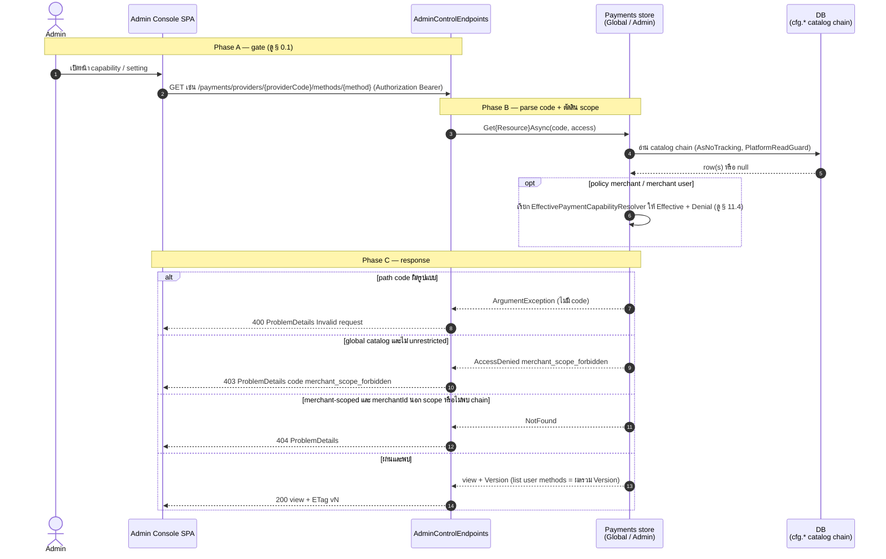
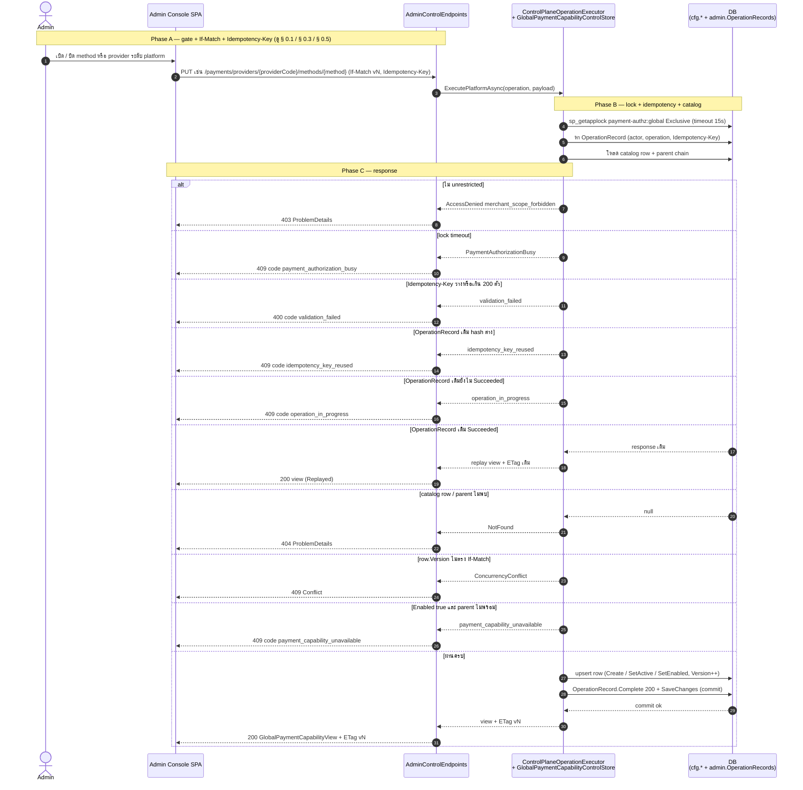
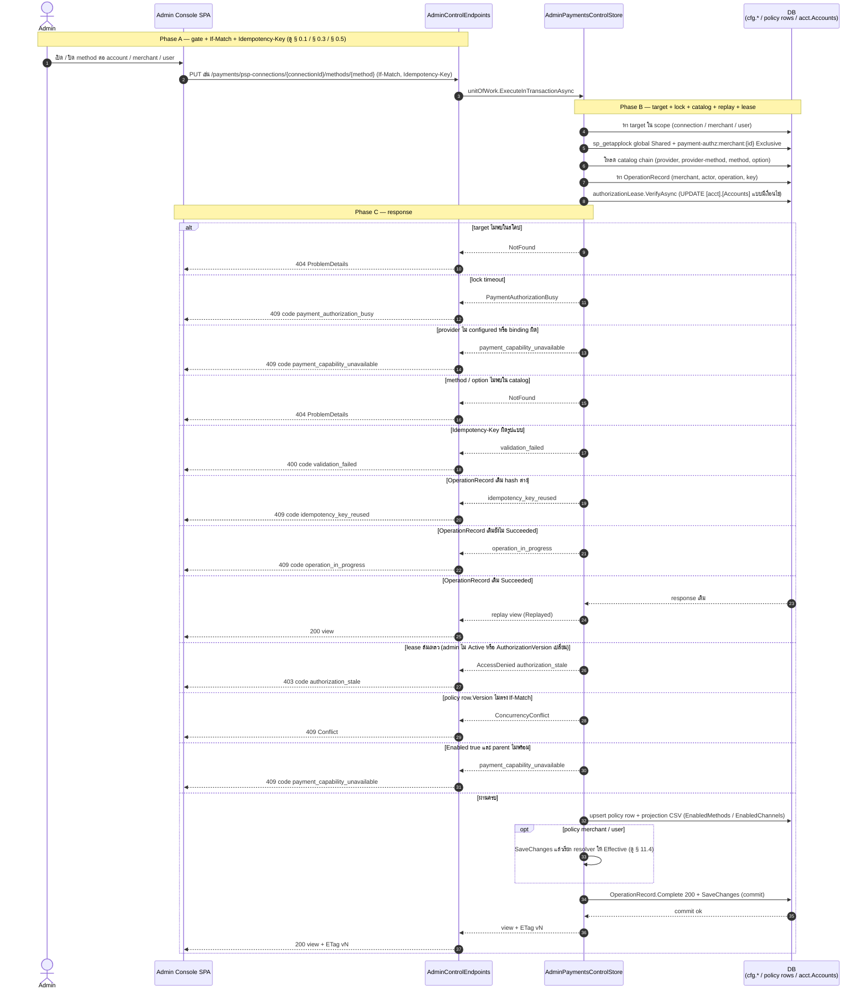
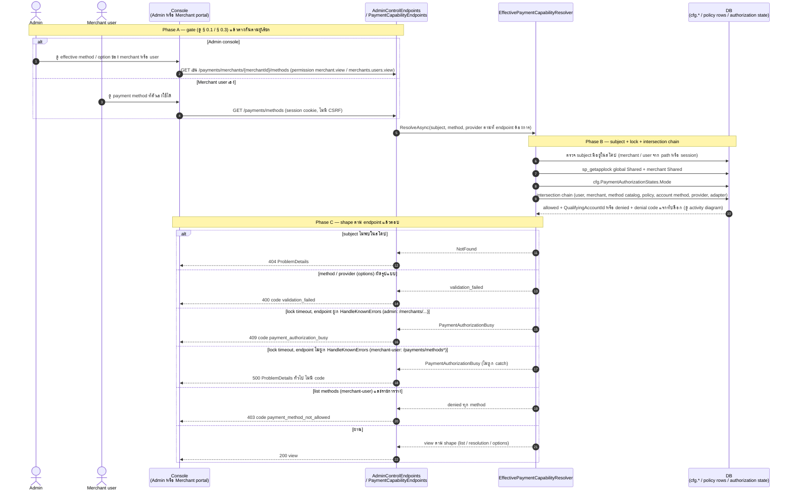
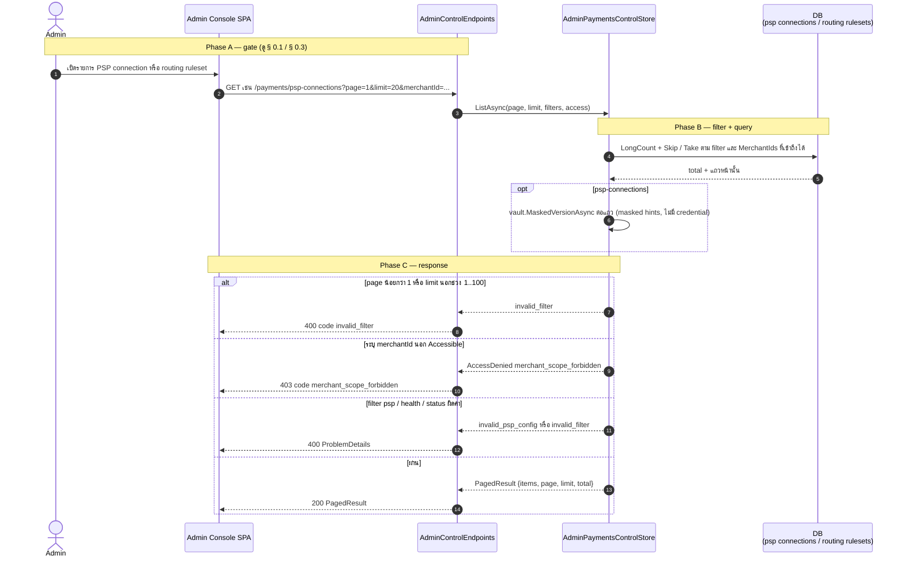
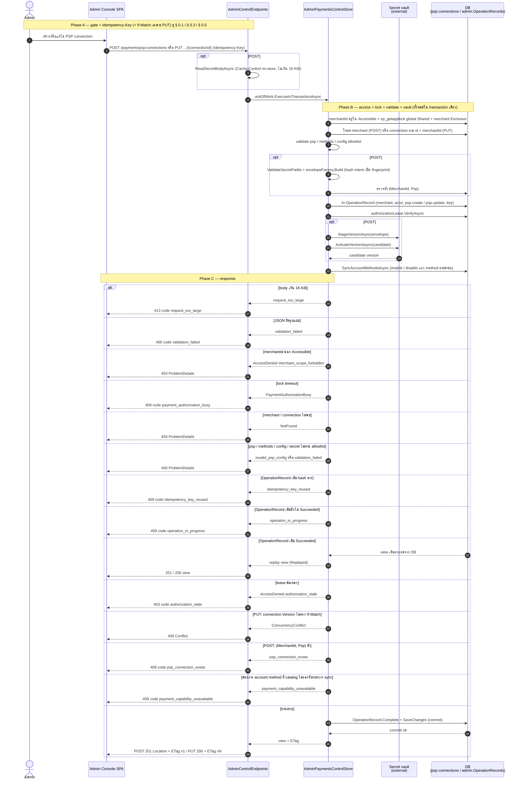
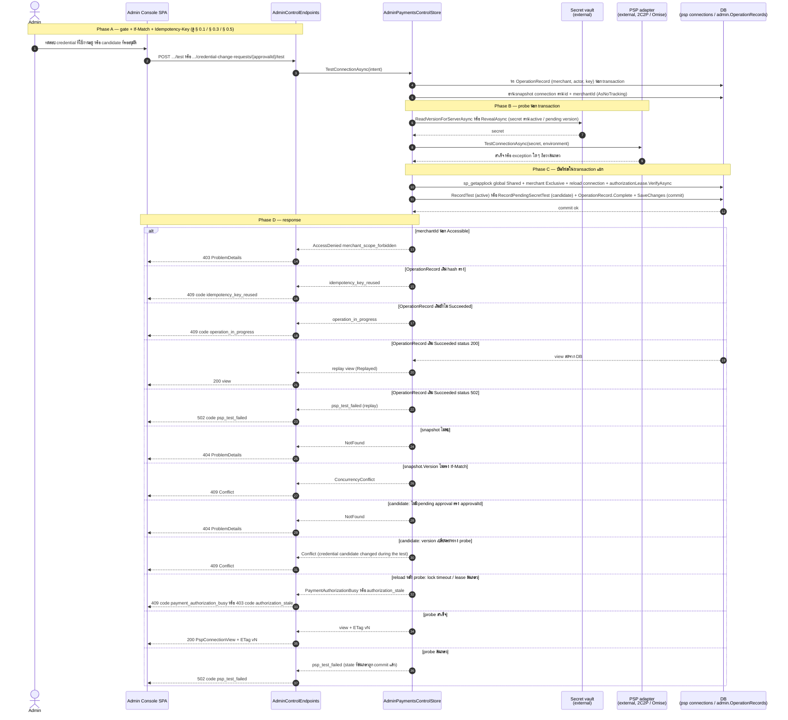
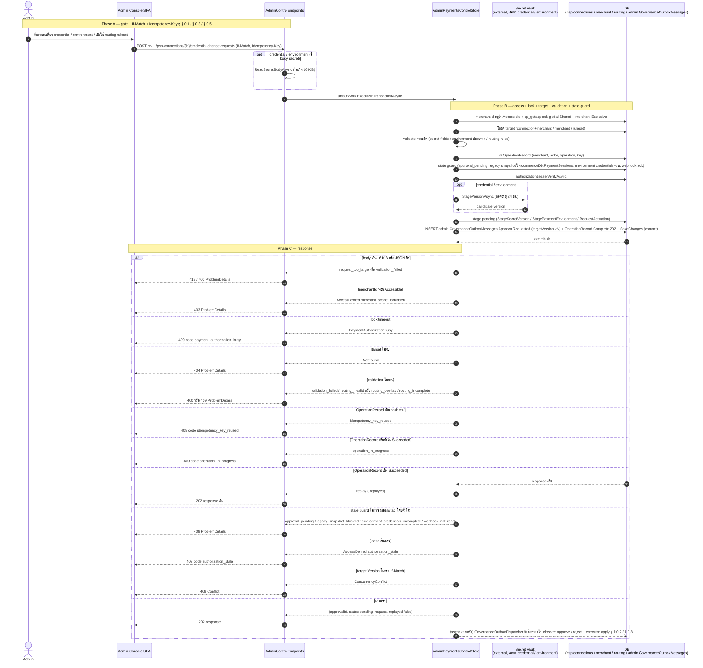
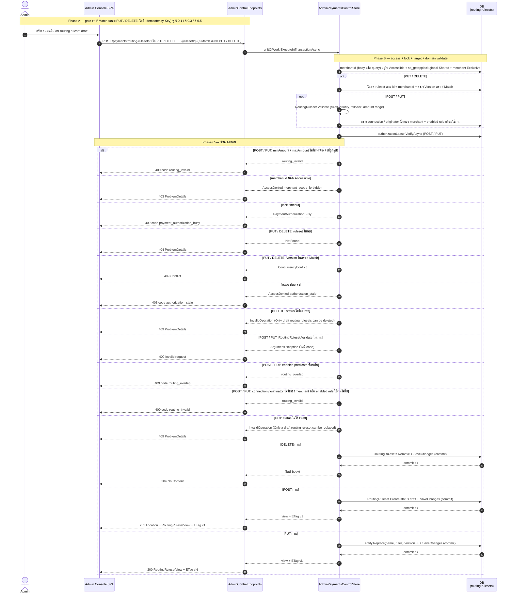
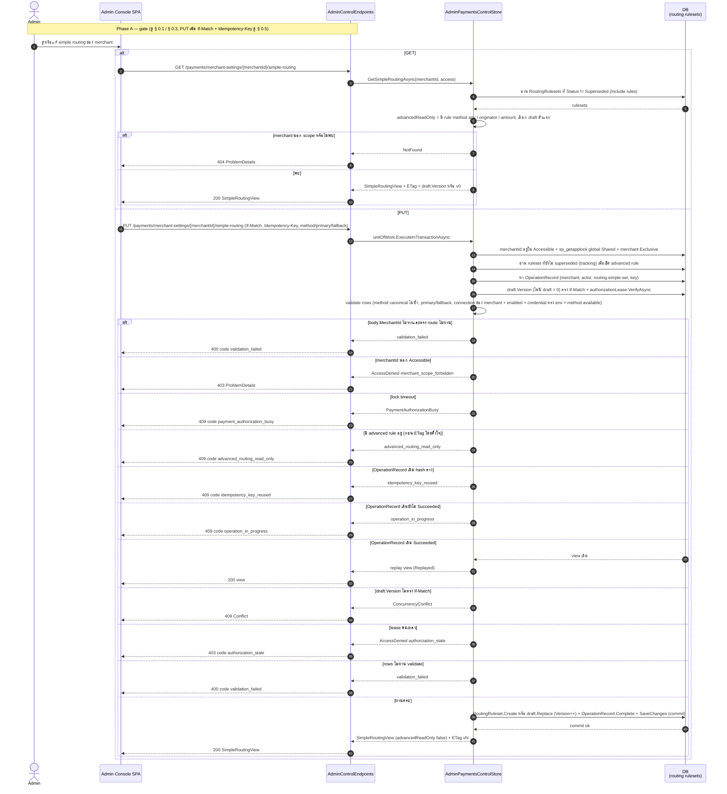

# pol-core API — Payment capability configuration (Sequence Diagrams)

> Source: `docs/reference/api-endpoints.md` section "Admin control และ merchant console" บรรทัด L254-L292 และ source ที่อ้างต่อ § (`src/Api/Api/ControlPlane/AdminControlEndpoints.cs`, `src/Api/Api/Payments/PaymentCapabilityEndpoints.cs`, `src/Infrastructure/Persistence/Persistence.ControlPlane/Payments/AdminPaymentsControlStore.cs`, `GlobalPaymentCapabilityControlStore.cs`, `Capabilities/EffectivePaymentCapabilityResolver.cs`, `PaymentAuthorizationSqlLockManager.cs`, `MerchantRuntimeAuthorizationLease.cs`, `Governance/ControlPlaneOperationExecutor.cs`, `src/Domain/Modules/Payments.Domain/Routing.cs`, `Psp/Connection.cs`)
> Scope: ลำดับข้าม actor / API / store / DB / external ของ 39 endpoint เดียวกับ `11-payment-capability-config.activities.md` (หมายเลข § ตรงกัน) — สาขา decision ทุกจุดดู activity diagram ไฟล์นั้น
> Generated: 2026-09-14

| § | Diagram | Endpoints |
| --- | --- | --- |
| 11.1 | อ่านรายละเอียด capability / setting พร้อม ETag | `GET /api/v1/payments/methods/{method}`, `GET /api/v1/payments/providers/{providerCode}`, `GET /api/v1/payments/providers/{providerCode}/methods/{method}`, `GET /api/v1/payments/providers/{providerCode}/methods/{method}/options/{option}`, `GET /api/v1/payments/psp-connections/{connectionId:guid}/methods/{method}`, `GET /api/v1/payments/psp-connections/{connectionId:guid}/methods/{method}/options/{option}`, `GET /api/v1/payments/merchants/{merchantId:guid}/methods/{method}`, `GET /api/v1/payments/merchants/{merchantId:guid}/users/{userId:guid}/methods`, `GET /api/v1/payments/merchants/{merchantId:guid}/users/{userId:guid}/methods/{method}`, `GET /api/v1/payments/merchant-settings/{merchantId:guid}`, `GET /api/v1/payments/psp-connections/{connectionId:guid}`, `GET /api/v1/payments/routing-rulesets/{rulesetId:guid}` |
| 11.2 | เปิด / ปิด capability ระดับ platform (global catalog) | `PUT /api/v1/payments/methods/{method}`, `PUT /api/v1/payments/providers/{providerCode}`, `PUT /api/v1/payments/providers/{providerCode}/methods/{method}`, `PUT /api/v1/payments/providers/{providerCode}/methods/{method}/options/{option}` |
| 11.3 | เปิด / ปิด capability ระดับ account / merchant / merchant user | `PUT /api/v1/payments/psp-connections/{connectionId:guid}/methods/{method}`, `PUT /api/v1/payments/psp-connections/{connectionId:guid}/methods/{method}/options/{option}`, `PUT /api/v1/payments/merchants/{merchantId:guid}/methods/{method}`, `PUT /api/v1/payments/merchants/{merchantId:guid}/users/{userId:guid}/methods/{method}` |
| 11.4 | Effective capability resolution (intersection chain) | `GET /api/v1/payments/merchants/{merchantId:guid}/methods`, `GET /api/v1/payments/merchants/{merchantId:guid}/users/{userId:guid}/methods/{method}/options`, `GET /api/v1/payments/merchants/{merchantId:guid}/users/{userId:guid}/methods/{method}/resolution`, `GET /api/v1/payments/methods`, `GET /api/v1/payments/methods/{method}/options` |
| 11.5 | รายการ PSP connection / routing ruleset แบบแบ่งหน้า | `GET /api/v1/payments/psp-connections`, `GET /api/v1/payments/routing-rulesets` |
| 11.6 | สร้าง / แก้ไข PSP connection | `POST /api/v1/payments/psp-connections`, `PUT /api/v1/payments/psp-connections/{connectionId:guid}` |
| 11.7 | ทดสอบ PSP connection (active credential / candidate credential) | `POST /api/v1/payments/psp-connections/{connectionId:guid}/test`, `POST /api/v1/payments/psp-connections/{connectionId:guid}/credential-change-requests/{approvalId:guid}/test` |
| 11.8 | คำขอ maker-checker: credential change, environment change, routing activation | `POST /api/v1/payments/psp-connections/{connectionId:guid}/credential-change-requests`, `POST /api/v1/payments/merchant-settings/{merchantId:guid}/environment-change-requests`, `POST /api/v1/payments/routing-rulesets/{rulesetId:guid}/activation-requests` |
| 11.9 | Routing ruleset draft: สร้าง / แทนที่ / ลบ | `POST /api/v1/payments/routing-rulesets`, `PUT /api/v1/payments/routing-rulesets/{rulesetId:guid}`, `DELETE /api/v1/payments/routing-rulesets/{rulesetId:guid}` |
| 11.10 | Simple routing ของหน้าตั้งค่าทั่วไป | `GET /api/v1/payments/merchant-settings/{merchantId:guid}/simple-routing`, `PUT /api/v1/payments/merchant-settings/{merchantId:guid}/simple-routing` |

---

## 11.1 อ่านรายละเอียด capability / setting พร้อม ETag

ลำดับเดียวกันทั้ง 12 endpoint: Console เรียก GET ตรง แล้ว store ตัดสิน scope ก่อนอ่าน catalog chain (source: `src/Api/Api/ControlPlane/AdminControlEndpoints.cs:28-37,55-64,82-92,111-121,140-150,169-179,210-220,239-267,549-569,622-643,842-863,1048-1062`).

| Method | fullPath | ต่างจาก § กลางตรงไหน |
| --- | --- | --- |
| GET | `/api/v1/payments/methods/{method}` | permission `merchant.view`, global: ต้อง unrestricted (403), row = cfg.PaymentMethods ตาม code, view kind `method` AdapterSupported true เสมอ |
| GET | `/api/v1/payments/providers/{providerCode}` | permission `merchant.view`, global, row = cfg.PaymentProviders ตาม code (lower-case) |
| GET | `/api/v1/payments/providers/{providerCode}/methods/{method}` | permission `merchant.view`, global, provider หรือ method ไม่พบ = 404, ไม่มี provider-method row = view Enabled false Version 0 (ไม่ใช่ 404), AdapterSupported จาก adapter.SupportedMethods |
| GET | `/api/v1/payments/providers/{providerCode}/methods/{method}/options/{option}` | permission `merchant.view`, global, ต้องมี provider-method row และ canonical option ไม่งั้น 404, ไม่มี option row = Enabled false Version 0 |
| GET | `/api/v1/payments/psp-connections/{connectionId:guid}/methods/{method}` | permission `merchant.view`, connection ไม่อยู่ใน scope หรือยังไม่ bind provider = 404, provider ไม่ configured = 409 `payment_capability_unavailable`, view มี AdapterVerified + Denial (`connection_disabled`, `provider_disabled`, `method_inactive`, `provider_method_unavailable`, `adapter_unverified`, `account_method_disabled`) |
| GET | `/api/v1/payments/psp-connections/{connectionId:guid}/methods/{method}/options/{option}` | permission `merchant.view`, เพิ่มเงื่อนไข: ต้องมี account method row และ option catalog ไม่งั้น 404, Denial มีเฉพาะ `adapter_unverified` |
| GET | `/api/v1/payments/merchants/{merchantId:guid}/methods/{method}` | permission `merchant.view`, merchant ไม่อยู่ใน scope หรือ cfg.PaymentMethods ไม่มี code = 404, ไม่มี policy row = Enabled false Version 0, Effective + Denial จาก resolver audience PlatformAdmin (§ 11.4) |
| GET | `/api/v1/payments/merchants/{merchantId:guid}/users/{userId:guid}/methods` | permission `merchants.users.view`, user ต้อง Active หรือ Suspended ในร้านนั้น ไม่งั้น `Results.NotFound()` เปล่า (StatusCodePages แปลง ดู § 0.9), คืน list เรียง method, ETag = ผลรวม Version, Effective ต่อแถวจาก resolver audience User |
| GET | `/api/v1/payments/merchants/{merchantId:guid}/users/{userId:guid}/methods/{method}` | permission `merchants.users.view`, เหมือนแถวบนแต่รายตัว, ไม่มี policy row = Enabled false Version 0 |
| GET | `/api/v1/payments/merchant-settings/{merchantId:guid}` | permission `settings.manage`, ไม่มี path code ให้ parse, view = Environment (sandbox / live), PendingEnvironment, PendingApprovalId, ETag = Merchant.Version (ค่าที่ environment-change-requests ต้องส่ง) |
| GET | `/api/v1/payments/psp-connections/{connectionId:guid}` | permission `settings.manage`, query `merchantId` optional ใช้กรองเพิ่ม, view ไม่คืน credential (masked hints จาก vault.MaskedVersionAsync), CallbackUrl จาก adapter, HasPendingCredentialChange, PendingCredentialTest, WebhookRegistration, Methods projection |
| GET | `/api/v1/payments/routing-rulesets/{rulesetId:guid}` | permission `settings.manage`, query `merchantId` optional, view = Status (draft / pending / active / superseded), ApprovalId, Rules เรียง priority, amount เป็น string `0.00##` |

---

## 11.2 เปิด / ปิด capability ระดับ platform (global catalog)

PUT ระดับ platform รันผ่าน `ControlPlaneOperationExecutor` ที่ถือ global exclusive lock และ OperationRecord แบบ platform scope ก่อนแตะ store (source: `src/Api/Api/ControlPlane/AdminControlEndpoints.cs:39-53,66-80,94-109,123-138`, `Governance/ControlPlaneOperationExecutor.cs:31-82,93-97`).

| Method | fullPath | ต่างจาก § กลางตรงไหน |
| --- | --- | --- |
| PUT | `/api/v1/payments/methods/{method}` | row = cfg.PaymentMethods (ไม่มี = 404 ไม่ create), ไม่มี parent check, `SetActive(Enabled)` |
| PUT | `/api/v1/payments/providers/{providerCode}` | row = cfg.PaymentProviders (ไม่มี = 404), ไม่มี parent check, `SetEnabled(Enabled)` |
| PUT | `/api/v1/payments/providers/{providerCode}/methods/{method}` | provider หรือ method ไม่พบ = 404, row = cfg.PaymentProviderMethods create-on-enable, parent = provider.IsEnabled + method.IsActive + adapter.SupportedMethods |
| PUT | `/api/v1/payments/providers/{providerCode}/methods/{method}/options/{option}` | provider-method row ไม่มี = 409 `payment_capability_unavailable`, canonical option (cfg.PaymentMethodOptions) ไม่มี = 404, row = cfg.PaymentProviderMethodOptions create-on-enable, parent เพิ่ม providerMethod.IsActive |

---

## 11.3 เปิด / ปิด capability ระดับ account / merchant / merchant user

PUT ระดับ merchant-scoped รันในธุรกรรมของ `AdminPaymentsControlStore` เอง: merchant exclusive lock, replay ผ่าน OperationRecord ต่อ merchant, ตรวจ authorization lease แล้วอัปเสิร์ตแถว policy (source: `src/Api/Api/ControlPlane/AdminControlEndpoints.cs:152-167,181-196,222-237,269-284`, `AdminPaymentsControlStore.cs:187-309,336-392,435-492`, `MerchantRuntimeAuthorizationLease.cs:24-56`).

| Method | fullPath | ต่างจาก § กลางตรงไหน |
| --- | --- | --- |
| PUT | `/api/v1/payments/psp-connections/{connectionId:guid}/methods/{method}` | permission `merchant.manage`, operation `payment.account-method.set`, ตรวจ connection ก่อน lock, **PRIOR และ LEASE มาก่อน CATALOG** (หา OperationRecord แล้ว authorizationLease.VerifyAsync ก่อนโหลด catalog chain, ต่างจากลำดับข้อความในไดอะแกรมกลางด้านบน), parent = connection.IsEnabled + provider.IsEnabled + method active + provider-method active + adapter รองรับ, projection = `connection.ProjectEnabledMethods` |
| PUT | `/api/v1/payments/psp-connections/{connectionId:guid}/methods/{method}/options/{option}` | permission `merchant.manage`, operation `payment.account-method-option.set`, **PRIOR และ LEASE มาก่อน CATALOG** เช่นเดียวกับแถวบน, ไม่มี account method row = 409 `payment_capability_unavailable`, option catalog ไม่มี = 404, parent เพิ่ม accountMethod.IsEnabled + provider-method-option active, ไม่มี projection |
| PUT | `/api/v1/payments/merchants/{merchantId:guid}/methods/{method}` | permission `merchant.manage`, operation `payment.merchant-method.set`, lock ก่อนตรวจ merchant, **CATALOG มาก่อน PRIOR** (โหลด method catalog ก่อนหา OperationRecord, ตรงกับลำดับข้อความในไดอะแกรมกลาง), parent = cfg.PaymentMethods active + `HasQualifyingAccountAsync` (มี account method บน connection enabled ที่ provider / provider-method active + adapter รองรับ), projection = `merchant.ProjectEnabledChannels`, view มี Denial |
| PUT | `/api/v1/payments/merchants/{merchantId:guid}/users/{userId:guid}/methods/{method}` | permission `merchants.users.manage`, operation `payment.merchant-user-method.set`, lock ก่อนตรวจ user, **CATALOG มาก่อน PRIOR** ตรงกับลำดับข้อความในไดอะแกรมกลาง, parent = merchant policy row IsEnabled, ไม่มี projection, view ไม่มี Denial |

---

## 11.4 Effective capability resolution (intersection chain)

ทุก endpoint ที่คืนผล "ใช้ได้จริง" เรียก `EffectivePaymentCapabilityResolver` ภายใต้ shared lock เดียวกัน ไม่ว่าผู้เรียกจะเป็น Admin console หรือ merchant-user เอง (source: `src/Api/Api/Payments/PaymentCapabilityEndpoints.cs:12-59`, `src/Api/Api/ControlPlane/AdminControlEndpoints.cs:198-208,286-313`, `Capabilities/EffectivePaymentCapabilityResolver.cs:25-135,184-342`).

| Method | fullPath | ต่างจาก § กลางตรงไหน |
| --- | --- | --- |
| GET | `/api/v1/payments/merchants/{merchantId:guid}/methods` | policy `admin`, permission `merchant.view`, CSRF filter, subject audience PlatformAdmin, merchant นอก scope = 404, response = list ของ `EffectivePaymentMethod` |
| GET | `/api/v1/payments/merchants/{merchantId:guid}/users/{userId:guid}/methods/{method}/options` | policy `admin`, permission `merchants.users.view`, audience User, query `provider` บังคับ, response = list ของ `EffectivePaymentOption` |
| GET | `/api/v1/payments/merchants/{merchantId:guid}/users/{userId:guid}/methods/{method}/resolution` | policy `admin`, permission `merchants.users.view`, audience User, ไม่ส่ง provider, response = `{method, resolution}` ไม่คืน denial code |
| GET | `/api/v1/payments/methods` | policy `merchant-user`, permission `payment.view`, ไม่มี CSRF, subject จาก session (actor.MerchantId + UserId), ไม่มี actor = 404, รายการว่าง = 403 `payment_method_not_allowed`, lock timeout = **500 ProblemDetails ทั่วไป ไม่มี code** (map ผ่าน `PaymentCapabilityEndpoints` ไม่ผ่าน `HandleKnownErrors` ต่างจาก diagram กลาง — deviation อยู่ใน activities.md) |
| GET | `/api/v1/payments/methods/{method}/options` | policy `merchant-user`, permission `payment.view`, query `provider` บังคับ, response `{method, provider, options}` โดย options ว่างเมื่อ method ไม่ effective, lock timeout = **500 ProblemDetails ทั่วไป ไม่มี code** เช่นเดียวกับแถวบน |

---

## 11.5 รายการ PSP connection / routing ruleset แบบแบ่งหน้า

GET list ทั้งสองใช้ query param ธรรมดา ไม่ใช่ SFS (source: `src/Api/Api/ControlPlane/AdminControlEndpoints.cs:599-620,821-840,1079-1083`, `AdminPaymentsControlStore.cs:62-96,985-1006,2072-2115`).

| Method | fullPath | ต่างจาก § กลางตรงไหน |
| --- | --- | --- |
| GET | `/api/v1/payments/psp-connections` | query `page`, `limit`, `search`, `merchantId`, `psp`, `health`, ต่อแถวอ่าน vault.MaskedVersionAsync + adapter.CallbackUrlFor + cfg.PaymentProviders (provider ไม่ configured = 409 `payment_capability_unavailable`) |
| GET | `/api/v1/payments/routing-rulesets` | query `page`, `limit`, `merchantId`, `status` (ไม่มี search / psp / health), Include rules, ไม่แตะ vault |

---

## 11.6 สร้าง / แก้ไข PSP connection

POST อ่าน body เองใน limit 16 KiB ก่อนเปิด transaction เดียวที่ครอบทั้ง validate, เขียน vault และ upsert row, PUT ไม่แตะ vault (source: `src/Api/Api/ControlPlane/AdminControlEndpoints.cs:645-697,786-815`, `AdminPaymentsControlStore.cs:521-575,629-666,1939-2054`).

| Method | fullPath | ต่างจาก § กลางตรงไหน |
| --- | --- | --- |
| POST | `/api/v1/payments/psp-connections` | body อ่านเอง (413 / 400), ไม่มี If-Match, lease verify ครั้งแรกก่อน validate และซ้ำหลัง replay check, merchant ไม่พบ = 404, ซ้ำ provider = 409 `psp_connection_exists`, เขียน vault 2 ครั้ง (stage + activate), response 201 + Location + ETag |
| PUT | `/api/v1/payments/psp-connections/{connectionId:guid}` | body bind ปกติ (`UpdatePspConnectionRequest` ไม่มี secret), ต้อง If-Match, ข้าม body/JSON/secret validate/ซ้ำ provider, connection ต้องตรง body.MerchantId ไม่งั้น 404, ไม่แตะ vault, response 200 + ETag |

---

## 11.7 ทดสอบ PSP connection (active credential / candidate credential)

การทดสอบแบ่งสองช่วงจริง: probe adapter นอก transaction ก่อน แล้วค่อยเปิด transaction แยกเพื่อบันทึกผล (source: `AdminControlEndpoints.cs:699-723,752-777`, `AdminPaymentsControlStore.cs:668-721,798-858`).

| Method | fullPath | ต่างจาก § กลางตรงไหน |
| --- | --- | --- |
| POST | `/api/v1/payments/psp-connections/{connectionId:guid}/test` | operation `psp.test`, secret = ActiveSecretVersionId (หรือ Reveal ตาม SecretRefName เมื่อยังไม่มี version), environment = ActiveSecretEnvironment, เขียน Health + LastTestedAt + LastTestResult |
| POST | `/api/v1/payments/psp-connections/{connectionId:guid}/credential-change-requests/{approvalId:guid}/test` | operation `psp.credential-test`, ต้องมี pending approval ตรง approvalId ไม่งั้น 404, secret = PendingSecretVersionId, environment = PendingSecretEnvironment, compare-after-probe (409) แล้ว RecordPendingSecretTest เท่านั้น ไม่เปลี่ยน Health / ไม่ activate candidate |

---

## 11.8 คำขอ maker-checker: credential change, environment change, routing activation

maker ยื่นคำขอในธุรกรรมเดียวที่ครอบ stage target, OperationRecord 202 และ enqueue `ApprovalRequested` เข้า governance outbox, checker / executor เป็นของ § 0.7 (source: `AdminControlEndpoints.cs:571-597,725-750,933-955`, `AdminPaymentsControlStore.cs:723-796,860-983,1064-1122`, `Routing.cs:64-69`).

| Method | fullPath | ต่างจาก § กลางตรงไหน |
| --- | --- | --- |
| POST | `/api/v1/payments/psp-connections/{connectionId:guid}/credential-change-requests` | operation `psp.credential-change`, body มี secret, validate = `ValidateSecretFields` ต่อ environment ปัจจุบันของ merchant, state guard = connection.PendingApprovalId / merchant.PendingPaymentEnvironmentApprovalId (`approval_pending`) + `legacy_snapshot_blocked`, ETag = connection.Version, action `psp.credential.change` targetType `psp-credential-version`, response `PspCredentialChangeResult` (approvalId, candidateVersionId) |
| POST | `/api/v1/payments/merchant-settings/{merchantId:guid}/environment-change-requests` | operation `payment.environment-change`, validate = ParseEnvironment + target ตรง env เดิม + secret fields ต่อ target env ทุก connection, state guard เพิ่ม `environment_credentials_incomplete` และ `webhook_not_ready` (Omise ไป live), ETag = Merchant.Version, stage ทุก connection พร้อมกัน, action `psp.environment.change` targetType `merchant-environment`, response `EnvironmentChangeResult` (connectionCount) |
| POST | `/api/v1/payments/routing-rulesets/{rulesetId:guid}/activation-requests` | operation `routing.activation`, body ปกติ (ไม่มี body-size gate), ไม่มี vault, validate = `ValidateRulesAsync` + `EnsureRoutingCoverageAsync`, ไม่มี state guard, stage = `ruleset.RequestActivation` (ไม่ใช่ draft = 409 InvalidOperation), action `routing.activate` targetType `routing-ruleset`, response `RoutingActivationResult` (ruleset view) |

---

## 11.9 Routing ruleset draft: สร้าง / แทนที่ / ลบ

draft ruleset แก้ตรงในธุรกรรมเดียวโดยไม่มี OperationRecord หรือ idempotency key (source: `AdminControlEndpoints.cs:865-931,1091-1105`, `AdminPaymentsControlStore.cs:1018-1062,1304-1360`, `Routing.cs:38-59,116-139,197`).

| Method | fullPath | ต่างจาก § กลางตรงไหน |
| --- | --- | --- |
| POST | `/api/v1/payments/routing-rulesets` | ไม่มี If-Match / Idempotency-Key, merchantId จาก body, ข้ามโหลด ruleset เดิม, `RoutingRuleset.Create` (merchantId ว่าง = ArgumentException 400), 201 + Location + ETag |
| PUT | `/api/v1/payments/routing-rulesets/{rulesetId:guid}` | If-Match บังคับ, ruleset ต้องตรง body.MerchantId ไม่งั้น 404, ตรวจ Version ก่อน lease และก่อน validate, ไม่ใช่ draft = 409 InvalidOperation หลัง validate ผ่าน, 200 + ETag |
| DELETE | `/api/v1/payments/routing-rulesets/{rulesetId:guid}` | If-Match บังคับ, merchantId จาก query (บังคับ), ข้าม amount / domain / overlap / refs validate, ไม่ใช่ draft = 409 InvalidOperation, 204 ไม่มี ETag |

---

## 11.10 Simple routing ของหน้าตั้งค่าทั่วไป

หน้าตั้งค่าทั่วไปอ่านและเขียน draft ruleset ชื่อ "Simple routing" ที่มีแค่ method / primary / fallback (source: `AdminControlEndpoints.cs:957-1003,1085-1089`, `AdminPaymentsControlStore.cs:1124-1283`).

| Method | fullPath | ต่างจาก § กลางตรงไหน |
| --- | --- | --- |
| GET | `/api/v1/payments/merchant-settings/{merchantId:guid}/simple-routing` | อ่านอย่างเดียว ไม่มี lock / OperationRecord, ETag = version ของ draft (0 เมื่อยังไม่มี draft แม้แสดง pending / active) |
| PUT | `/api/v1/payments/merchant-settings/{merchantId:guid}/simple-routing` | body bind เฉพาะ method / primary / fallback (key อื่นถูกทิ้ง), operation `routing.simple-set`, advanced guard ก่อน replay และ ETag, สร้าง draft ใหม่ได้ด้วย If-Match `"v0"` |

---

## Notes

- diagram นี้เป็นคู่กับ `11-payment-capability-config.activities.md` — สาขา decision ทุกจุด (parent-chain, denial code, validation ทีละฟิลด์) และตาราง Deviations อยู่ในไฟล์นั้น ที่นี่โฟกัสเฉพาะลำดับเรียก participant
- § 11.6 (POST) และ § 11.8 (credential / environment): เรียก secret vault (`StageVersionAsync` / `ActivateVersionAsync`) อยู่ภายในธุรกรรม DB เดียวกับ upsert row และ enqueue outbox ไม่ใช่ก่อนหรือหลัง commit (source: `AdminPaymentsControlStore.cs:521-575,766-793`)
- § 11.7: การทดสอบ PSP เรียก vault + adapter ภายนอก **นอก** transaction ก่อน แล้วเปิด transaction แยกต่างหากเพื่อ lock, reload และบันทึกผล จึงมีความเป็นไปได้ที่ candidate จะถูกเปลี่ยนระหว่าง probe (ตรวจด้วย version compare, 409) (source: `AdminPaymentsControlStore.cs:668-721,798-858`)
- § 11.8: `EnqueueApproval` เขียนแถวลง `admin.GovernanceOutboxMessages` ในธุรกรรมเดียวกับ SaveChanges ไม่ใช่การเรียก message broker ตรง ๆ, `GovernanceOutboxDispatcher` มาดึงภายหลังแบบ at-least-once (ดู § 0.7 / § 0.8 ของ `00-cross-cutting.sequences.md`)
- lock สองชั้น (`sp_getapplock payment-authz:global` + `payment-authz:merchant:{id}`) มาจาก `PaymentAuthorizationSqlLockManager.AcquireMerchantExclusiveAsync` ที่ขอ global Shared ก่อนเสมอแล้วค่อยขอ merchant lock จึงวาดเป็นข้อความเดียว (source: `PaymentAuthorizationSqlLockManager.cs:38-73`)
- `check-mermaid.mjs` ล้มเหลวทั้งไฟล์นี้และไฟล์ที่อนุมัติไปแล้วก่อนหน้า (`00-cross-cutting.*` เป็นต้น) ด้วย error เดียวกัน `purify.addHook is not a function` เป็นปัญหา environment ของ script เอง (mermaid 11.14 เรียก DOMPurify.addHook โดยไม่มี DOM ให้ instantiate) ไม่เกี่ยวกับเนื้อหาไฟล์นี้ ตรวจแทนด้วย `mmdc -p pptr.json -i <file>.md -o <out>.md` (render จริงผ่าน Chrome, เข้มกว่า parser-only check) — ผ่านครบ 10/10 block ทั้งไฟล์นี้และ `11-payment-capability-config.activities.md`

**Render**: GitHub / Obsidian / VS Code Mermaid
