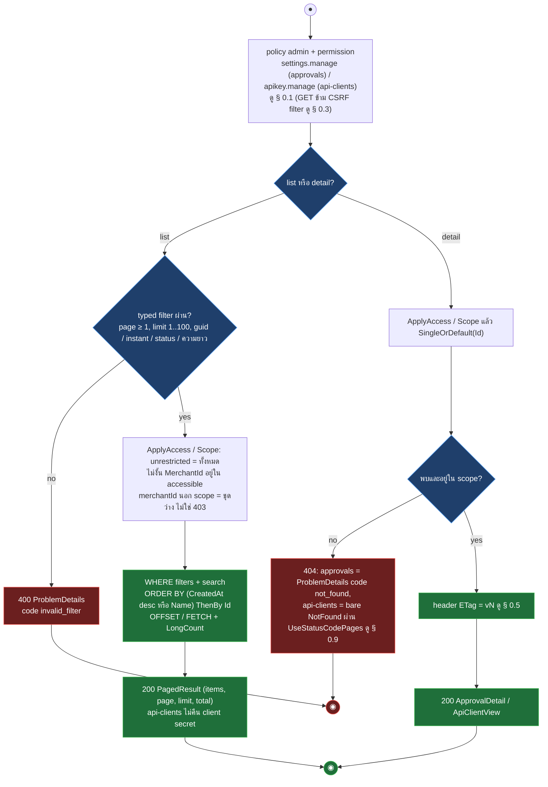
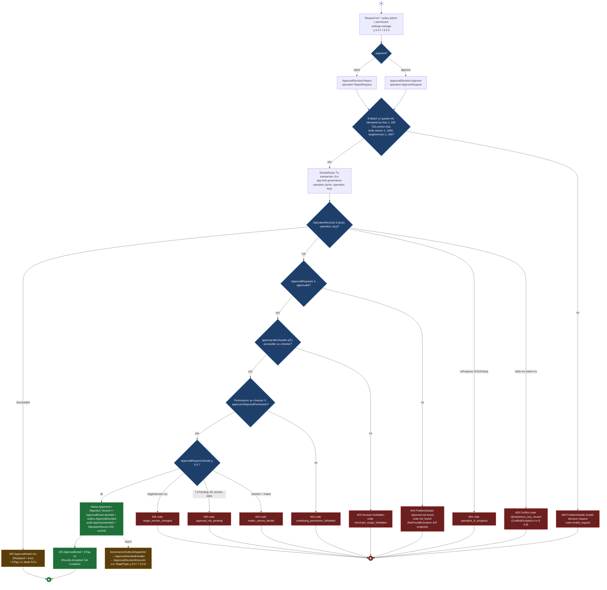
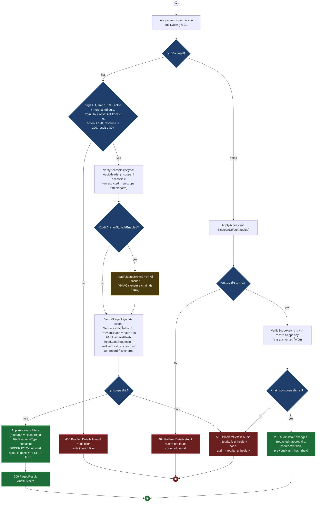
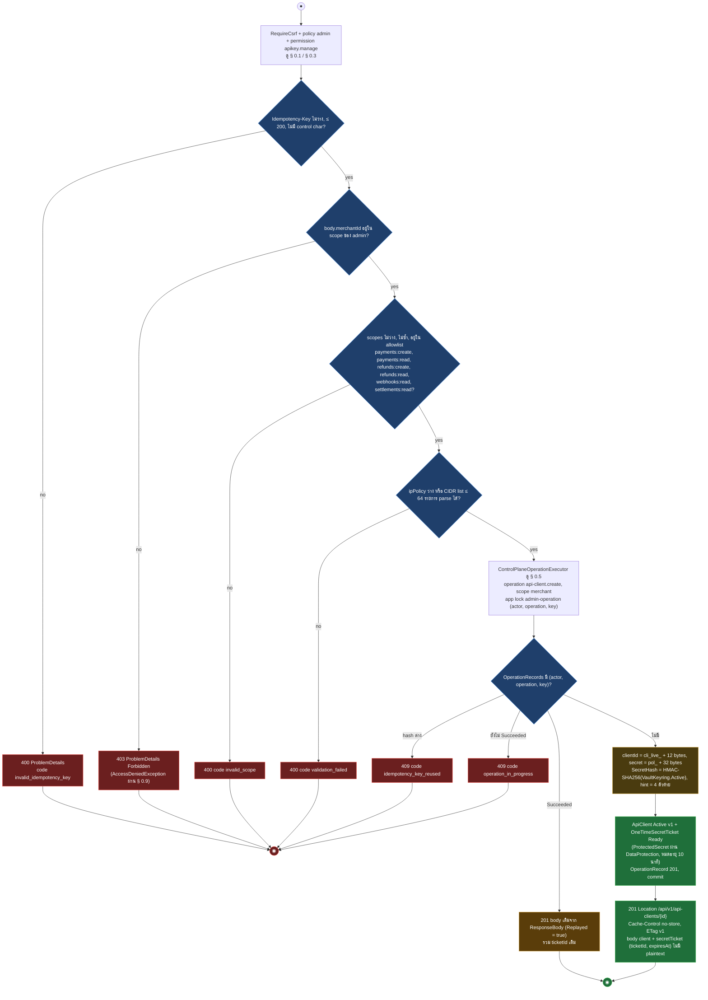
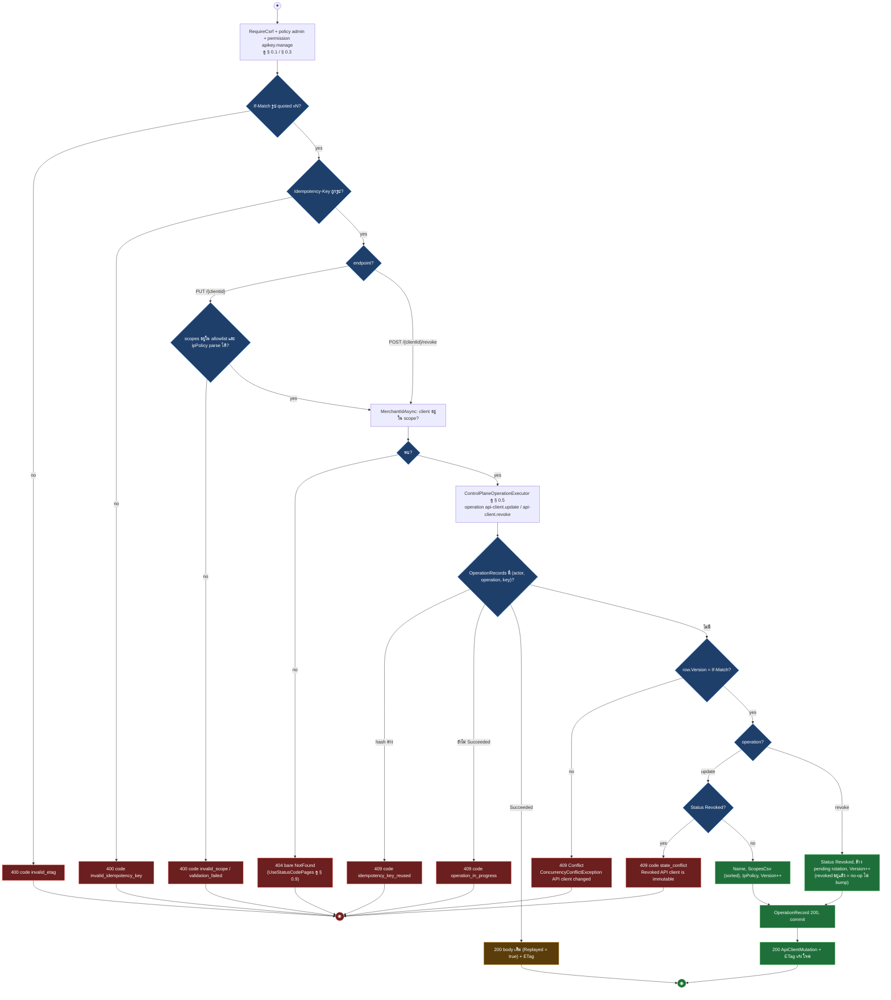
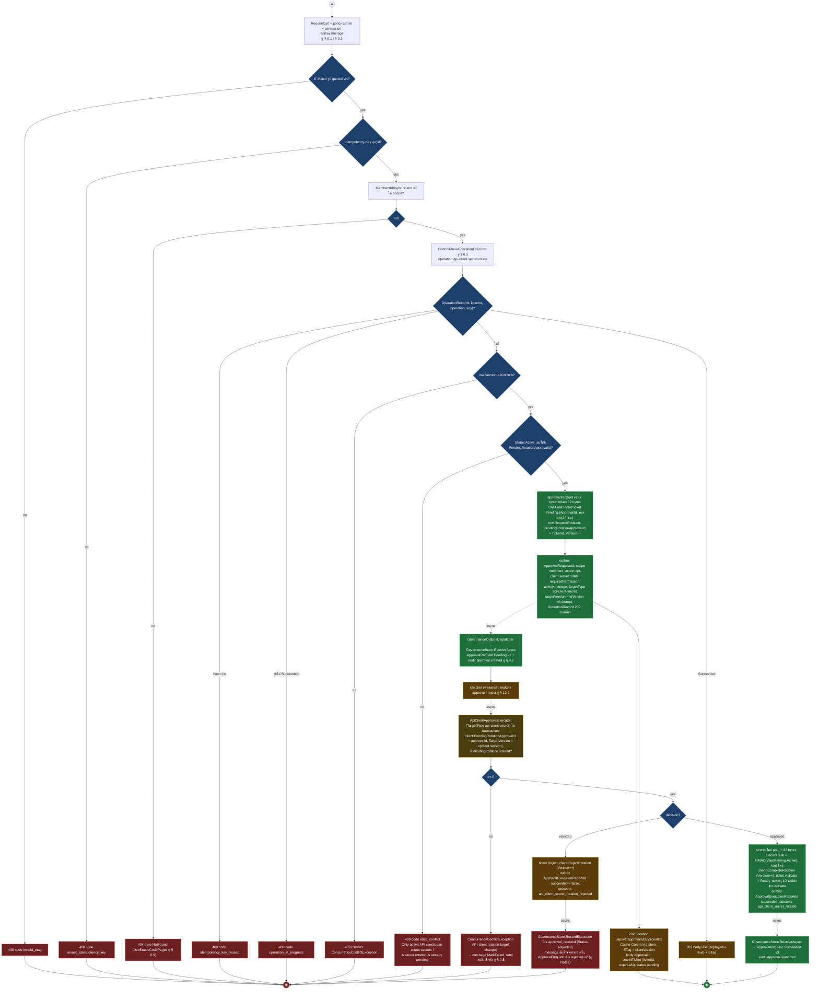
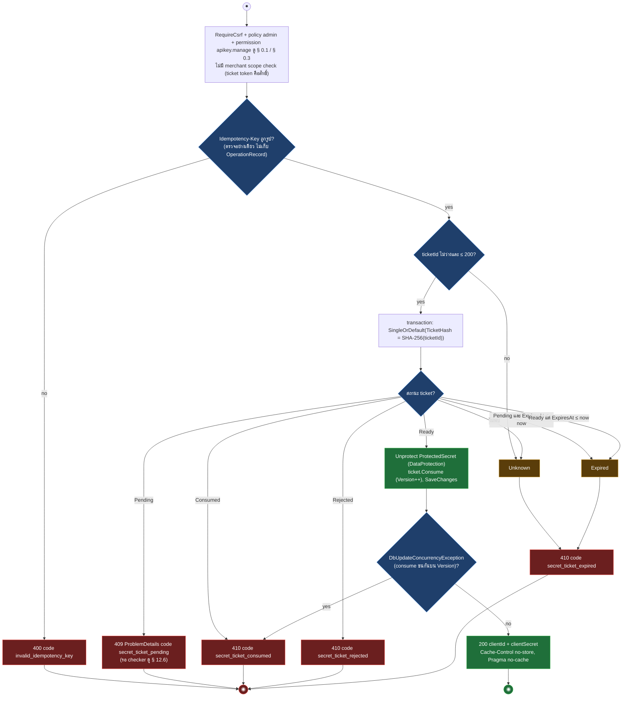

# pol-core API — Governance (maker-checker), audit และ API clients (Activity Diagrams)

> Source: `docs/reference/api-endpoints.md` section "Governance และ audit" บรรทัด L298-L303 และ section "API clients" บรรทัด L309-L315 พร้อม source ที่อ้างต่อ § (`src/Api/Api/Governance/GovernanceEndpoints.cs`, `src/Api/Api/Iam/ApiClientEndpoints.cs`, `src/Api/Api/ConcurrencyEtags.cs`, `src/Infrastructure/Persistence/Persistence.ControlPlane/Governance/GovernanceStore.cs`, `ControlPlaneOperationExecutor.cs`, `AuditAnchorRegistration.cs`, `Persistence.ControlPlane/Iam/ApiClientStore.cs`, `ApiClientApprovalExecutor.cs`, `src/Domain/Modules/Governance.Domain/ApprovalRequest.cs`, `src/Domain/Modules/Iam.Domain/ApiClients/ApiClient.cs`)
> Scope: 13 endpoints — อ่าน / ตัดสินคำขอ maker-checker (4), อ่าน audit hash chain (2), จัดการ API client และ one-time secret ticket (7) ทุกตัวอยู่ใต้ policy `admin` ผ่าน IAdminScope
> Generated: 2026-09-14

| § | Diagram | Endpoints |
| --- | --- | --- |
| 12.1 | GET list / detail ภายใน Admin merchant scope | `GET /api/v1/approvals`, `GET /api/v1/approvals/{approvalId:guid}`, `GET /api/v1/api-clients`, `GET /api/v1/api-clients/{clientId:guid}` |
| 12.2 | ตัดสินคำขอ maker-checker (approve / reject) | `POST /api/v1/approvals/{approvalId:guid}/approve`, `POST /api/v1/approvals/{approvalId:guid}/reject` |
| 12.3 | อ่าน audit แบบ append-only พร้อมตรวจ hash chain | `GET /api/v1/audits`, `GET /api/v1/audits/{auditId:guid}` |
| 12.4 | สร้าง API client + Ready secret ticket | `POST /api/v1/api-clients` |
| 12.5 | แก้ไข / เพิกถอน API client | `PUT /api/v1/api-clients/{clientId:guid}`, `POST /api/v1/api-clients/{clientId:guid}/revoke` |
| 12.6 | ขอหมุน client secret (maker) + executor async | `POST /api/v1/api-clients/{clientId:guid}/secret-rotation-requests` |
| 12.7 | เปิดดู client secret หนึ่งครั้ง | `POST /api/v1/api-clients/secrets/{ticketId}/reveal` |

---

## 12.1 GET list / detail ภายใน Admin merchant scope

GET ทั้ง 4 ตัวใช้โครงเดียวกัน: gate policy admin + permission, typed filter (ไม่ใช่ SFS parser) แล้วกรองด้วย accessible merchants ของ admin ก่อน query, detail ที่ไม่พบหรือนอก scope ตอบ 404 และ detail คืน ETag (source: `src/Api/Api/Governance/GovernanceEndpoints.cs:72-93,184-216,286-335`, `src/Api/Api/Iam/ApiClientEndpoints.cs:13-37,130-136`, `Persistence.ControlPlane/Governance/GovernanceStore.cs:23-70,332-335`, `Persistence.ControlPlane/Iam/ApiClientStore.cs:29-61,246-247`)

| Method | fullPath | ต่างจาก § กลางตรงไหน |
| --- | --- | --- |
| GET | `/api/v1/approvals` | permission `settings.manage`, filter page / limit / search ≤ 200 / action ≤ 120 / status (pending, approved, rejected, succeeded, failed, unknown) / merchantId guid D / from, to ต้องมี offset และ from ≤ to, 400 คืน `Problem` ตรงจาก endpoint (`GovernanceEndpoints.cs:198-202`), search เป็น guid = Id หรือ TargetId, ORDER BY CreatedAt desc, Id desc |
| GET | `/api/v1/approvals/{approvalId:guid}` | permission `settings.manage`, 404 ProblemDetails `not_found` ชัดเจน, body ApprovalDetail (maker, requiredPermission, targetVersion, decision / execution outcome) + ETag จาก `Version` (`GovernanceEndpoints.cs:208-216`) |
| GET | `/api/v1/api-clients` | permission `apikey.manage`, `RequireCsrf` ต่อไว้แต่ไม่ตรวจ GET, filter page / limit (400 จาก `InvalidRequestException invalid_filter` ผ่าน § 0.9), status ต้องเป็น active / revoked ไม่งั้น 400 `invalid_filter`, search LIKE บน Name หรือ PublicClientId (SfsLike.Escape), ORDER BY Name, Id (`ApiClientStore.cs:29-53`) |
| GET | `/api/v1/api-clients/{clientId:guid}` | permission `apikey.manage`, 404 เป็น `Results.NotFound()` ไม่มี code, body ApiClientView (clientId, scopes, ipPolicy, secretHint, status, rotationPending, version) + ETag (`ApiClientEndpoints.cs:25-37`) |

---

## 12.2 ตัดสินคำขอ maker-checker (approve / reject)

approve และ reject map จาก handler เดียว (`MapDecision`) ต่างกันแค่ `ApprovalDecision` และชื่อ operation, endpoint ตรวจ header + body เองเป็น 400 เดียว แล้ว `GovernanceStore.DecideAsync` ทำ idempotency, scope, permission และกฎ maker-checker ใน transaction เดียว (source: `src/Api/Api/Governance/GovernanceEndpoints.cs:123-182,290-295`, `Persistence.ControlPlane/Governance/GovernanceStore.cs:72-146,351-355`, `src/Domain/Modules/Governance.Domain/ApprovalRequest.cs:74-98`, `src/Application/Modules/Governance.Application/GovernanceHandlers.cs:26-30,64-75`)

| Method | fullPath | ต่างจาก § กลางตรงไหน |
| --- | --- | --- |
| POST | `/api/v1/approvals/{approvalId:guid}/approve` | `ApprovalDecision.Approve`, operation `ApproveRequest`, ApprovalDecided.Decision = `approved`, executor ของ target apply การเปลี่ยนแปลง (`GovernanceEndpoints.cs:95`, `GovernanceStore.cs:76,117`) |
| POST | `/api/v1/approvals/{approvalId:guid}/reject` | `ApprovalDecision.Reject`, operation `RejectRequest`, Decision = `rejected`, executor คืน target จาก pending (ดู Notes เรื่อง ApprovalExecutionReported ของ rejected) (`GovernanceEndpoints.cs:96`) |

---

## 12.3 อ่าน audit แบบ append-only พร้อมตรวจ hash chain

audit ต่างจาก § 12.1 ตรงที่ store ตรวจความสมบูรณ์ของ hash chain ก่อนคืนข้อมูล: list ตรวจทุก scope ที่ admin เข้าถึงได้ก่อน query ส่วน detail ตรวจเฉพาะ scope ของ record หลังพบ, ผิดปกติตอบ 503 (source: `src/Api/Api/Governance/GovernanceEndpoints.cs:98-120,218-265`, `Persistence.ControlPlane/Governance/GovernanceStore.cs:198-330,337-340`, `AuditAnchorRegistration.cs:22-46`, `AuditAnchorStore.cs:12-59`, `src/Domain/Modules/Governance.Domain/AuditRecord.cs:109-134`)

| Method | fullPath | ต่างจาก § กลางตรงไหน |
| --- | --- | --- |
| GET | `/api/v1/audits` | ตรวจ chain ของทุก scope ที่ accessible ก่อน query (`GovernanceStore.cs:200,267-279`), anchors อ่านครั้งเดียวแล้วส่งต่อทุก scope |
| GET | `/api/v1/audits/{auditId:guid}` | 404 ก่อน แล้วค่อยตรวจ chain เฉพาะ scope ของ record (`GovernanceStore.cs:243-247`), 503 เกิดหลัง 404 |

---

## 12.4 สร้าง API client + Ready secret ticket

สร้าง client ใน merchant ที่ admin เข้าถึงได้ พร้อม one-time ticket สถานะ Ready ที่ถือ secret แบบ protected, plaintext secret ไม่อยู่ใน response ต้องไปเปิดที่ § 12.7 (source: `src/Api/Api/Iam/ApiClientEndpoints.cs:39-52`, `src/Api/Api/ConcurrencyEtags.cs:31-42`, `Persistence.ControlPlane/Iam/ApiClientStore.cs:63-94,225-236,253-278`, `ControlPlaneOperationExecutor.cs:54-82`, `src/Domain/Modules/Iam.Domain/ApiClients/ApiClient.cs:27-49,138-149`)

---

## 12.5 แก้ไข / เพิกถอน API client

mutation ตรงสองตัวใช้ If-Match + Idempotency-Key ผ่าน executor เดียวกัน: update ตรวจ scopes / ipPolicy ก่อนหา client และปฏิเสธ client ที่ revoked, revoke ไม่มี body และ idempotent เมื่อ revoked อยู่แล้ว (source: `src/Api/Api/Iam/ApiClientEndpoints.cs:54-82`, `src/Api/Api/ConcurrencyEtags.cs:18-42`, `Persistence.ControlPlane/Iam/ApiClientStore.cs:96-133,238-241,258-278`, `src/Domain/Modules/Iam.Domain/ApiClients/ApiClient.cs:51-60,92-100`)

| Method | fullPath | ต่างจาก § กลางตรงไหน |
| --- | --- | --- |
| PUT | `/api/v1/api-clients/{clientId:guid}` | body name / scopes / ipPolicy ตรวจก่อนหา client (400 มาก่อน 404), operation `api-client.update`, revoked = 409 `state_conflict`, ไม่เปลี่ยน clientId หรือ secret (`ApiClientStore.cs:96-115`) |
| POST | `/api/v1/api-clients/{clientId:guid}/revoke` | ไม่มี body, operation `api-client.revoke`, ล้าง PendingRotationApprovalId / TicketId, revoked อยู่แล้ว = 200 โดยไม่ bump version, หลังสำเร็จ `VerifyAsync` ไม่รับ client นี้อีก (`ApiClientStore.cs:117-133,208-213`) |

---

## 12.6 ขอหมุน client secret (maker) + executor async

maker ยื่นคำขอแบบ maker-checker: stage ticket Pending อายุ 24 ชั่วโมงและ mark client ว่ามี rotation ค้าง แล้วเขียน ApprovalRequested ลง governance outbox ใน transaction เดียว, secret ใหม่ถูกสร้างเฉพาะตอน executor apply หลัง checker approve (source: `src/Api/Api/Iam/ApiClientEndpoints.cs:84-100`, `Persistence.ControlPlane/Iam/ApiClientStore.cs:135-170`, `ApiClientApprovalExecutor.cs:25-80`, `Persistence.ControlPlane/Governance/GovernanceStore.cs:148-196`, `GovernanceOutboxDispatcher.cs:111-138`, `src/Domain/Modules/Iam.Domain/ApiClients/ApiClient.cs:62-90,151-181`, `src/Domain/Modules/Governance.Domain/ApprovalRequest.cs:100-113`)

| สถานะ OneTimeSecretTicket | เปลี่ยนโดย | ผลต่อ § 12.7 | source |
| --- | --- | --- | --- |
| Ready (create) | `CreateReady` ตอน § 12.4, หมดอายุ 10 นาที | reveal ได้ทันที | `ApiClient.cs:138-149` |
| Pending (rotation) | `CreatePending` ตอนยื่นคำขอ, หมดอายุ 24 ชม. | 409 `secret_ticket_pending` (หมดอายุก่อนตัดสิน = 410) | `ApiClient.cs:151-162` |
| Ready (rotation) | `Activate` โดย executor เมื่อ approved, หมดอายุ 10 นาทีนับใหม่ | reveal ได้ | `ApiClient.cs:164-172` |
| Rejected | `Reject` โดย executor เมื่อ rejected | 410 `secret_ticket_rejected` | `ApiClient.cs:174-181` |
| Consumed | `Consume` ตอน reveal สำเร็จ | 410 `secret_ticket_consumed` | `ApiClient.cs:183-190` |

---

## 12.7 เปิดดู client secret หนึ่งครั้ง

consume one-time ticket ด้วย token ที่ได้จาก § 12.4 หรือ § 12.6: หา ticket ด้วย SHA-256 ของ token, ตัดสินจากสถานะ + วันหมดอายุ แล้ว unprotect secret และ mark Consumed ใน transaction เดียว, ไม่มี merchant scope check เพราะ token คือสิทธิ์ (source: `src/Api/Api/Iam/ApiClientEndpoints.cs:102-127`, `Persistence.ControlPlane/Iam/ApiClientStore.cs:172-206`, `src/Domain/Modules/Iam.Domain/ApiClients/ApiClient.cs:183-190`)

---

## Deviations

| fullPath | เอกสารบอก | source บอก | อ้างอิง |
| --- | --- | --- | --- |
| ไม่พบ deviation ระหว่างเอกสารกับ source | - | policy `admin`, permission (`settings.manage` / `audit.view` / `apikey.manage`) และ CSRF filter ทั้ง 13 แถวตรงกับ chain ใน endpoint, `RequireCsrf` บน GET api-clients ต่อไว้จริงแต่ไม่ตรวจ safe method | `GovernanceEndpoints.cs:72-121,168`, `ApiClientEndpoints.cs:19,32,47,62,77,94,122`, `Admins/CsrfFilter.cs` (ดู § 0.3) |

## Notes

| เรื่อง | ข้อเท็จจริงจาก source | source |
| --- | --- | --- |
| rejected decision ทำให้ report message ค้าง | executor commit การ revert แล้ว enqueue `ApprovalExecutionReported(succeeded false)` แต่ `GovernanceStore.ReceiveAsync` เรียก `RecordExecution` ซึ่งโยน `approval_rejected` เมื่อ Status เป็น Rejected, dispatcher `MarkFailed` แล้ว retry จนครบ 8 ครั้งแล้วหยุด lease, `ApprovalRequest` ค้าง `rejected` v2 โดย ExecutionOutcome เป็น null, ไม่มี test ครอบ path นี้ (test ตรวจเฉพาะ outcome ที่ executor เขียน) และ § 0.7 วาด REVERT → REPORT → FINAL ซึ่งไม่ตรงกับ source | `ApprovalRequest.cs:100-103`, `ApiClientApprovalExecutor.cs:41-48`, `GovernanceStore.cs:175-196`, `GovernanceOutboxDispatcher.cs:128-131`, `tests/ArchitectureTests/Architecture.Tests/AdminPaymentsApprovalExecutorTests.cs:143-157` |
| version drift ระหว่างรอ approve | `Update` / `Revoke` ไม่ block เมื่อมี rotation ค้าง, ทุก mutation bump `Version` ทำให้ `decision.TargetVersion != v{client.Version}` ตอน executor และโยน ConcurrencyConflict, message ApprovalDecided retry จนครบ 8 ครั้ง, ApprovalRequest ค้าง `approved` v2 | `ApiClient.cs:51-60,92-100`, `ApiClientApprovalExecutor.cs:35-38` |
| `ValidateKey` ใน executor ไม่ถึง | `ControlPlaneOperationExecutor.ValidateKey` (code `validation_failed`) อยู่หลัง `IdempotencyKeys.Require` (code `invalid_idempotency_key`) ที่ endpoint จึงไม่มีทางถูกเรียกจาก endpoint ในไฟล์นี้ | `ControlPlaneOperationExecutor.cs:93-97`, `ConcurrencyEtags.cs:33-41` |
| OperationRecord TTL | record หมดอายุ 24 ชม. และถูก prune ทุก 1 ชม. (`OperationRecordPruneService`), replay ของ create คืน ticketId เดิมจาก ResponseBody ซึ่ง ticket อาจหมดอายุหรือ consumed ไปแล้ว | `ControlPlaneOperationExecutor.cs:75-76`, `GovernanceOutboxDispatcher.cs:152-194`, `ApiClientStore.cs:82-86` |
| audit anchor | Development / Testing ใช้ `DisabledAuditAnchorStore` (ข้ามการเทียบ anchor), environment อื่นต้องตั้ง `AuditAnchor:Path` + `AuditAnchor:SigningKeyFile` ไม่งั้น boot ล้ม, `AuditAnchorService` เขียน checkpoint ทุก 5 วินาทีและ readiness check `audit-anchor` | `AuditAnchorRegistration.cs:22-46`, `AuditAnchorService.cs:43-125` |
| ต้นทุนการอ่าน audit | list re-hash ทุก record ของทุก scope ที่ accessible ต่อ request (unrestricted admin = ทุก scope), detail re-hash เฉพาะ scope ของ record | `GovernanceStore.cs:267-314` |
| body model validation | `[Required]` บน `DecisionRequest`, `CreateApiClientRequest`, `UpdateApiClientRequest` เป็น attribute ของ record, ผลของ minimal API model validation อยู่นอก frame (ไม่พบ pipeline ที่อ่านใน source ชุดนี้) | `GovernanceEndpoints.cs:344-346`, `ApiClientEndpoints.cs:139-142` |
| reveal ไม่มี scope | `RevealAsync` รับเฉพาะ ticket string ไม่รับ `Access(scope)`, admin ที่มี `apikey.manage` และถือ token เปิดได้ทุก merchant, Idempotency-Key ตรวจแล้วทิ้ง เรียกซ้ำ = 410 `secret_ticket_consumed` | `ApiClientEndpoints.cs:102-106`, `ApiClientStore.cs:172-206` |
| ETag ของ 202 rotation | ETag ตอบ `ClientVersion` (version ของ client หลัง RequestRotation) ไม่ใช่ version ของ ApprovalRequest, checker ต้องอ่าน `GET /api/v1/approvals/{approvalId}` เพื่อรับ ETag v1 ของ approval ก่อนตัดสิน | `ApiClientEndpoints.cs:92`, `ApiClientStore.cs:165-167` |

**Render**: GitHub / Obsidian / VS Code Mermaid
