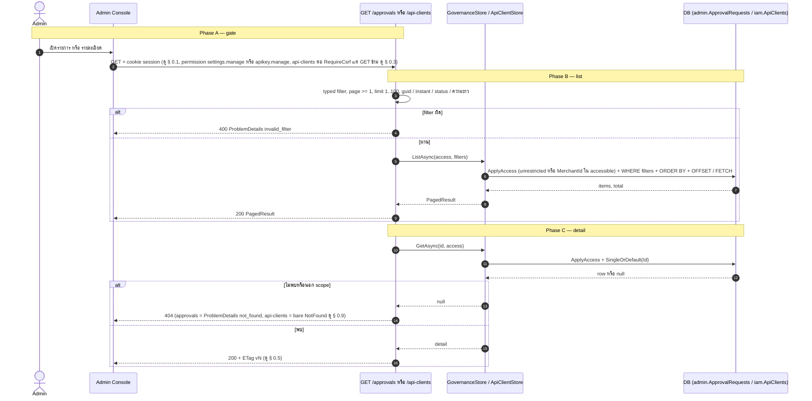
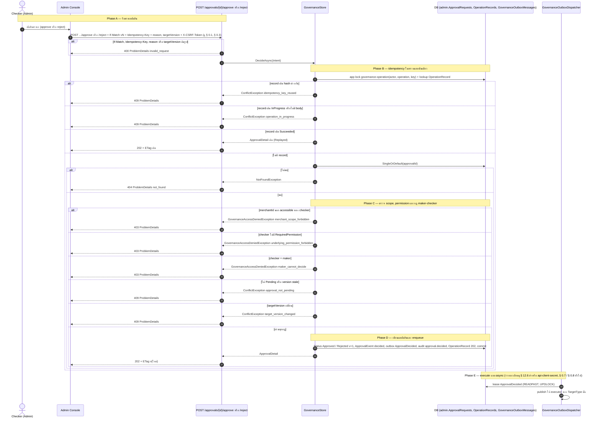
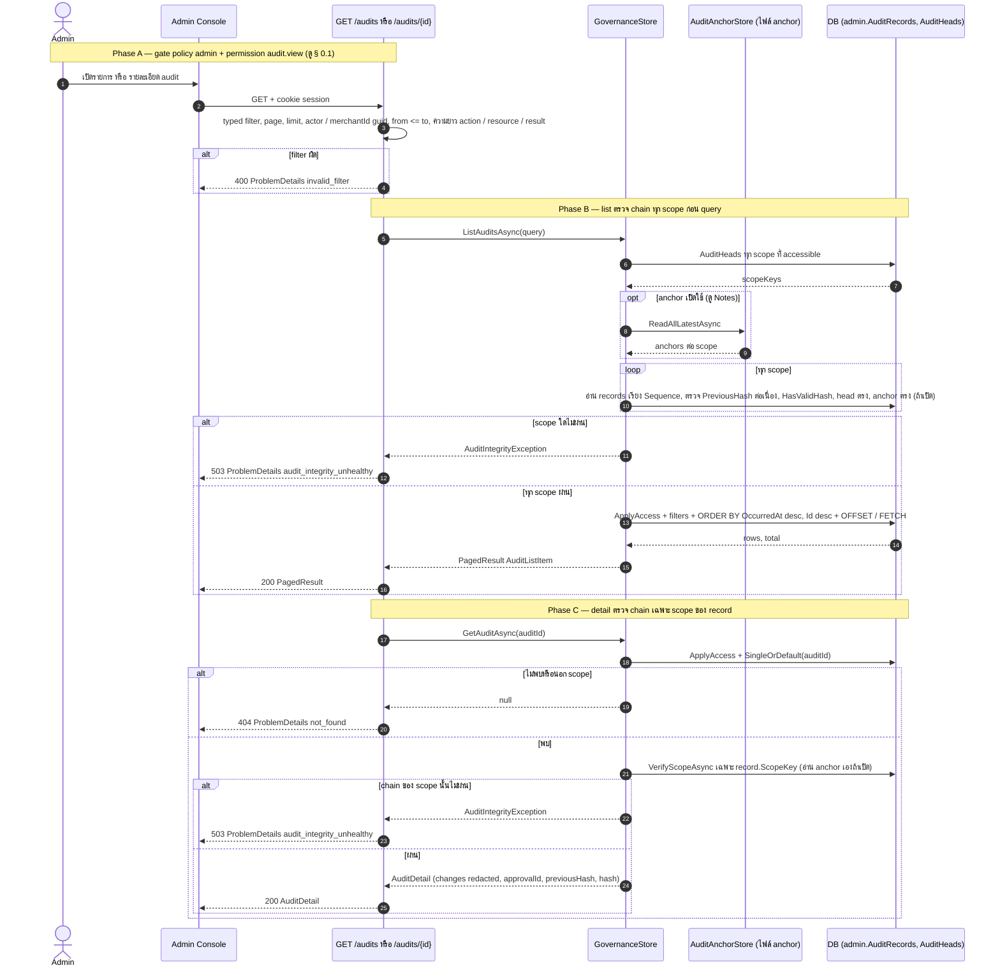
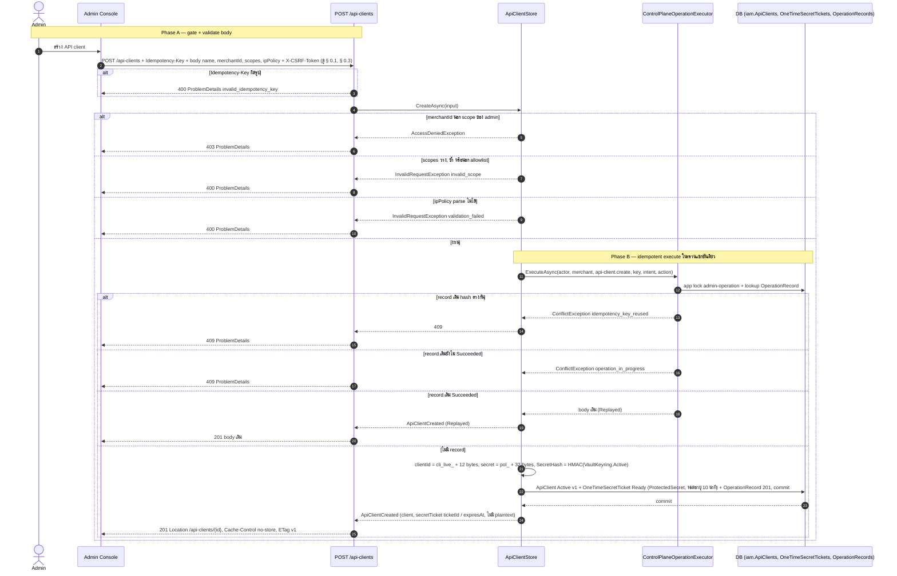
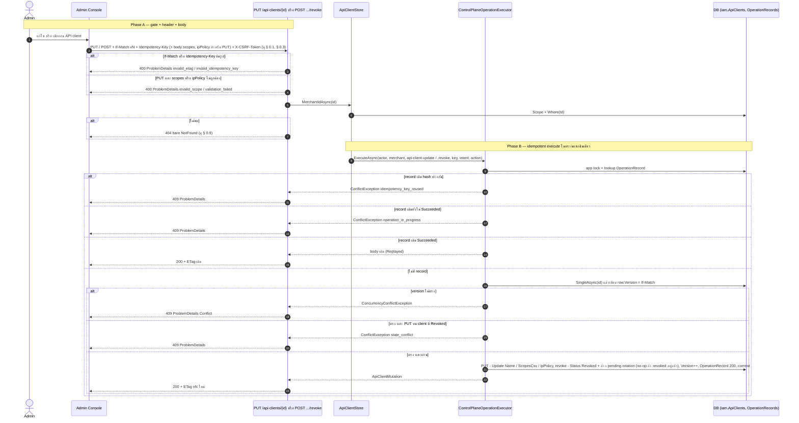
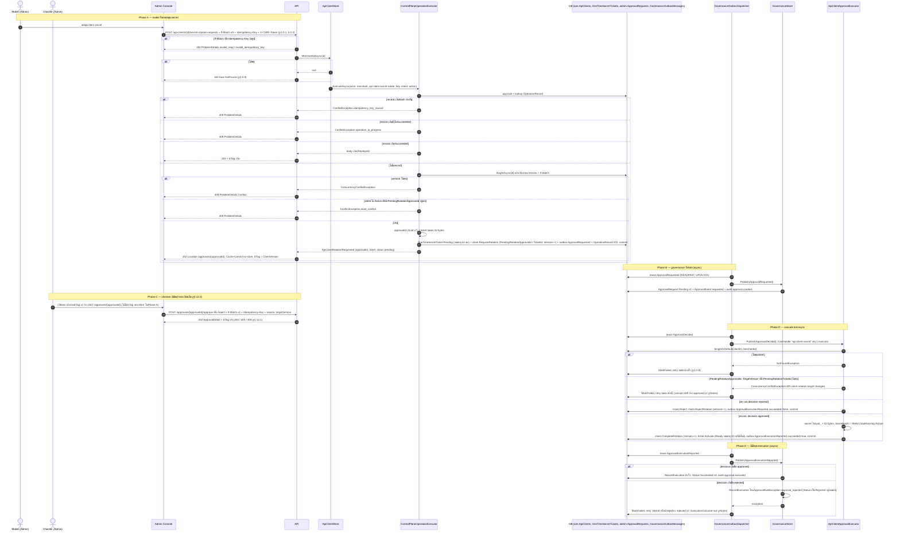
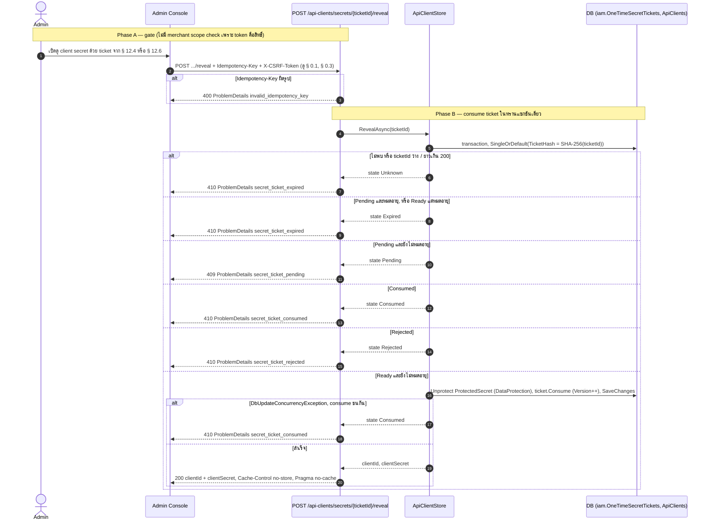

# pol-core API — Governance (maker-checker), audit และ API clients (Sequence Diagrams)

> Source: `docs/reference/api-endpoints.md` section "Governance และ audit" บรรทัด L298-L303 และ section "API clients" บรรทัด L309-L315 พร้อม source ที่อ้างต่อ § (`src/Api/Api/Governance/GovernanceEndpoints.cs`, `src/Api/Api/Iam/ApiClientEndpoints.cs`, `src/Api/Api/ConcurrencyEtags.cs`, `Persistence.ControlPlane/Governance/GovernanceStore.cs`, `ControlPlaneOperationExecutor.cs`, `GovernanceOutboxDispatcher.cs`, `Persistence.ControlPlane/Iam/ApiClientStore.cs`, `ApiClientApprovalExecutor.cs`, `src/Domain/Modules/Governance.Domain/ApprovalRequest.cs`, `src/Domain/Modules/Iam.Domain/ApiClients/ApiClient.cs`, `src/Application/Modules/Governance.Application/GovernanceHandlers.cs`)
> Scope: 7 § เดียวกับ `12-governance-audit-api-clients.activities.md` (หมายเลข § ตรงกัน) แสดงลำดับข้าม actor (maker, checker) / API / store / DB / outbox worker / executor
> Generated: 2026-09-14

| § | Diagram | Endpoints |
| --- | --- | --- |
| 12.1 | GET list / detail ภายใน Admin merchant scope | `GET /api/v1/approvals`, `GET /api/v1/approvals/{approvalId:guid}`, `GET /api/v1/api-clients`, `GET /api/v1/api-clients/{clientId:guid}` |
| 12.2 | ตัดสินคำขอ maker-checker (approve / reject) | `POST /api/v1/approvals/{approvalId:guid}/approve`, `POST /api/v1/approvals/{approvalId:guid}/reject` |
| 12.3 | อ่าน audit แบบ append-only พร้อมตรวจ hash chain | `GET /api/v1/audits`, `GET /api/v1/audits/{auditId:guid}` |
| 12.4 | สร้าง API client + Ready secret ticket | `POST /api/v1/api-clients` |
| 12.5 | แก้ไข / เพิกถอน API client | `PUT /api/v1/api-clients/{clientId:guid}`, `POST /api/v1/api-clients/{clientId:guid}/revoke` |
| 12.6 | ขอหมุน client secret (maker) + executor async | `POST /api/v1/api-clients/{clientId:guid}/secret-rotation-requests` |
| 12.7 | เปิดดู client secret หนึ่งครั้ง | `POST /api/v1/api-clients/secrets/{ticketId}/reveal` |

---

## 12.1 GET list / detail ภายใน Admin merchant scope

ลำดับเดียวกันสำหรับทั้ง 4 endpoint: gate แล้ว list ผ่าน typed filter + scope query หรือ detail ผ่าน scope + SingleOrDefault (source: `GovernanceEndpoints.cs:72-93,184-216`, `ApiClientEndpoints.cs:13-37`, `GovernanceStore.cs:23-70`, `ApiClientStore.cs:29-61`)

---

## 12.2 ตัดสินคำขอ maker-checker (approve / reject)

`DecideAsync` ทำ idempotency, scope, permission และกฎ maker-checker ทั้งหมดในทรานแซกชันเดียว ก่อนเขียนผลตัดสินและ enqueue ให้ executor ทำงานแบบ async (source: `GovernanceEndpoints.cs:123-182`, `GovernanceStore.cs:72-146`, `ApprovalRequest.cs:74-98`)

---

## 12.3 อ่าน audit แบบ append-only พร้อมตรวจ hash chain

list ตรวจ chain ของทุก scope ที่ accessible ก่อน query ส่วน detail ตรวจเฉพาะ scope ของ record ที่พบ (source: `GovernanceEndpoints.cs:98-120,218-265`, `GovernanceStore.cs:198-330`, `AuditAnchorRegistration.cs:22-46`)

---

## 12.4 สร้าง API client + Ready secret ticket

`ControlPlaneOperationExecutor` ผูก idempotency กับการสร้าง client และ Ready secret ticket ในทรานแซกชันเดียว plaintext secret ไม่อยู่ใน response (source: `ApiClientEndpoints.cs:39-52`, `ApiClientStore.cs:63-94`, `ControlPlaneOperationExecutor.cs:43-82`, `ApiClient.cs:27-49`)

---

## 12.5 แก้ไข / เพิกถอน API client

update และ revoke ผ่าน executor เดียวกันด้วย If-Match + Idempotency-Key, update ปฏิเสธ client ที่ revoked แล้ว, revoke เป็น no-op เมื่อ revoked อยู่แล้ว (source: `ApiClientEndpoints.cs:54-82`, `ApiClientStore.cs:96-133`, `ApiClient.cs:51-60,92-100`)

---

## 12.6 ขอหมุน client secret (maker) + executor async

maker stage ticket Pending และ enqueue `ApprovalRequested` ในทรานแซกชันเดียว secret ใหม่ถูกสร้างเฉพาะตอน executor apply หลัง checker approve (source: `ApiClientEndpoints.cs:84-100`, `ApiClientStore.cs:135-170`, `ApiClientApprovalExecutor.cs:25-80`, `GovernanceStore.cs:148-196`, `GovernanceOutboxDispatcher.cs:81-138`, `ApiClient.cs:62-90`, `ApprovalRequest.cs:100-113`)

---

## 12.7 เปิดดู client secret หนึ่งครั้ง

`RevealAsync` หา ticket ด้วย SHA-256 ของ token แล้ว consume ในทรานแซกชันเดียว ไม่มี merchant scope check เพราะ token คือสิทธิ์ (source: `ApiClientEndpoints.cs:102-127`, `ApiClientStore.cs:172-206`, `ApiClient.cs:183-190`)

---

## Notes

- Deviations ของ theme นี้อยู่ที่ `12-governance-audit-api-clients.activities.md` ไฟล์นี้ไม่ทำซ้ำ
- Phase ที่มาจาก outbox dispatcher (§ 12.2 Phase E, § 12.6 Phase B/D/E) เกิดหลัง HTTP response แล้ว ไม่มี caller รอ ผลสุดท้ายอ่านได้จาก `GET /api/v1/approvals/{approvalId}`
- § 12.6: ETag ที่ response 202 ตอบกลับ maker เป็น `ClientVersion` ไม่ใช่ version ของ approval checker ต้องอ่าน `GET /api/v1/approvals/{approvalId}` เพื่อรับ ETag v1 ของ approval เองก่อนตัดสิน
- § 12.6 Phase D/E มี 2 เส้นทางที่ dispatcher retry จนครบ 8 ครั้งแล้วต้องหยุดค้าง (ไม่มี resolution อัตโนมัติ) — version drift ระหว่าง Update/Revoke กับ rotation ที่รออนุมัติ และ execution report ของ decision ที่ rejected ที่ `RecordExecution` ปฏิเสธเพราะ Status เป็น Rejected อยู่แล้ว รายละเอียดเต็มอยู่ใน Notes ของ activities.md
- ` ` ไม่ได้ใช้ในไฟล์นี้เพราะชื่อ participant สั้นพอในบรรทัดเดียว

**Render**: GitHub / Obsidian / VS Code Mermaid
