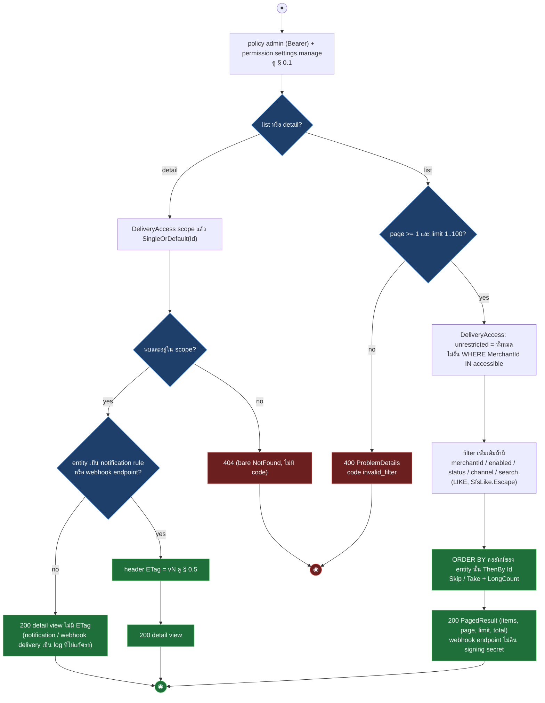
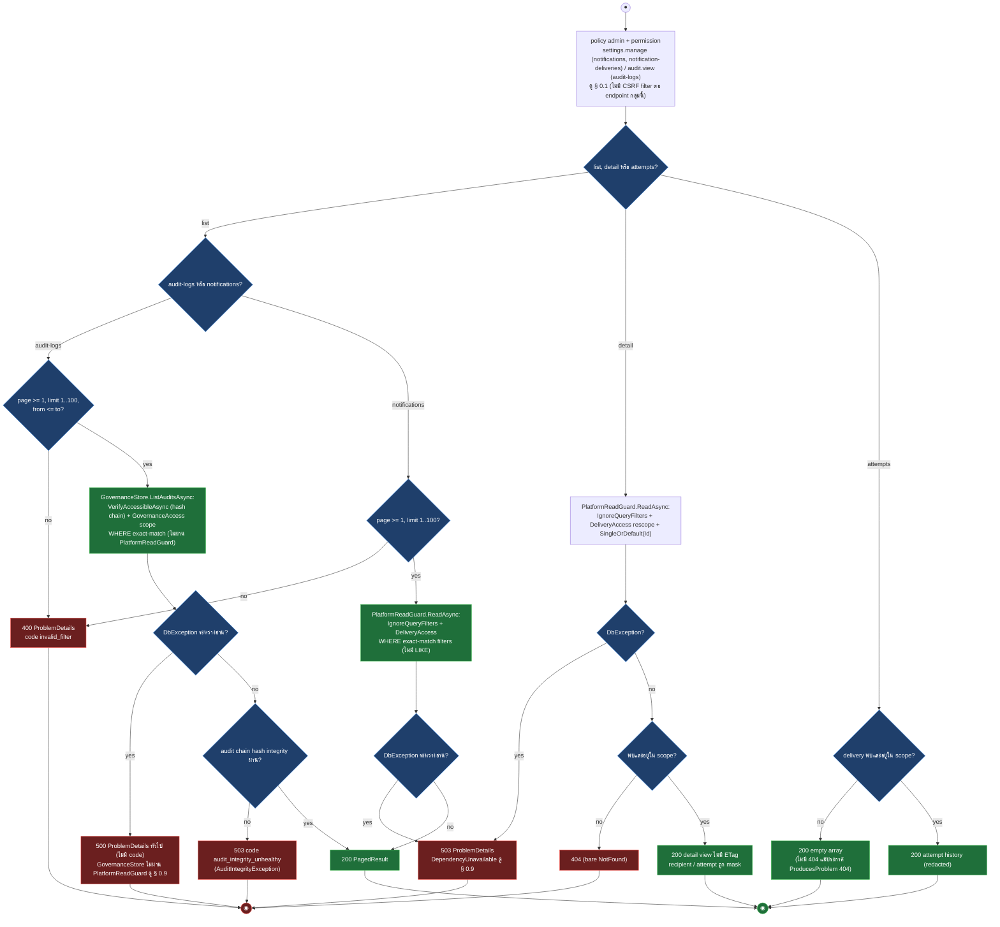
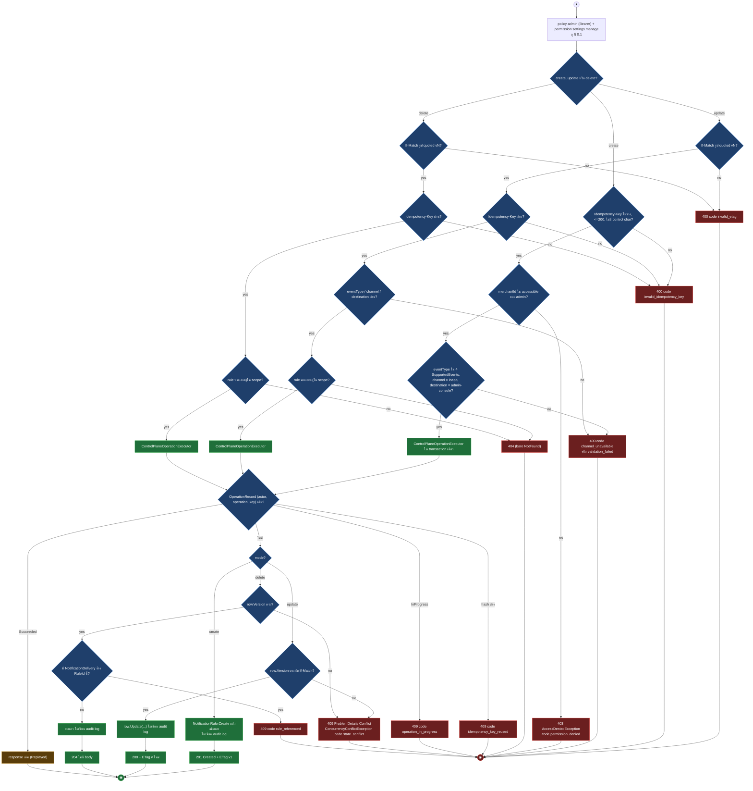
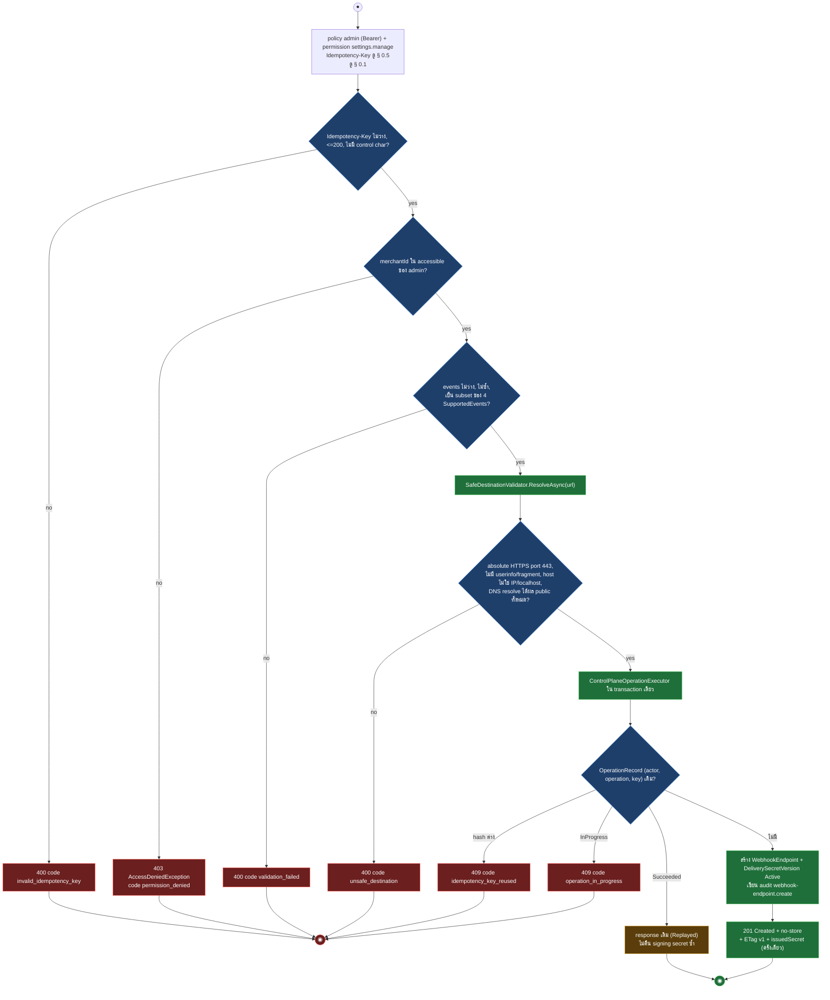
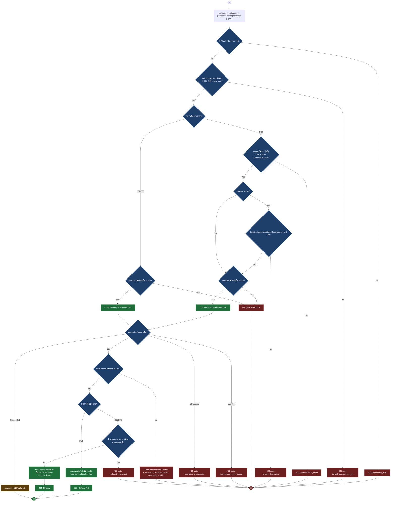
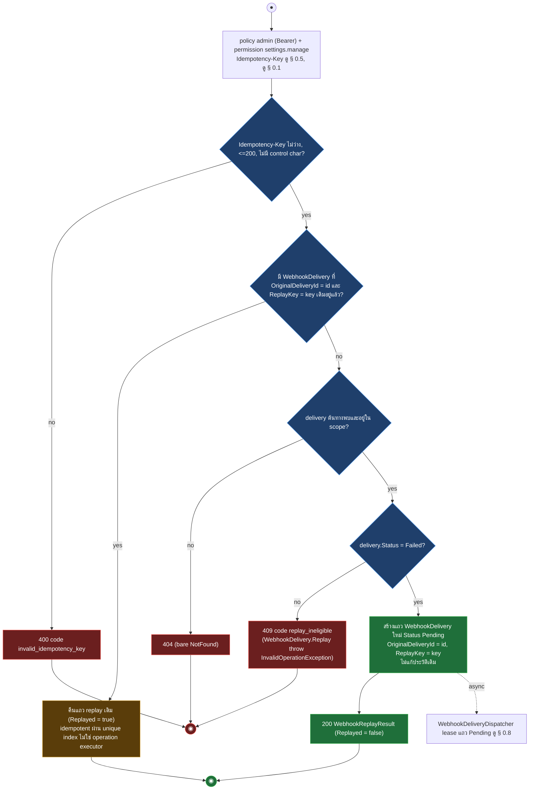
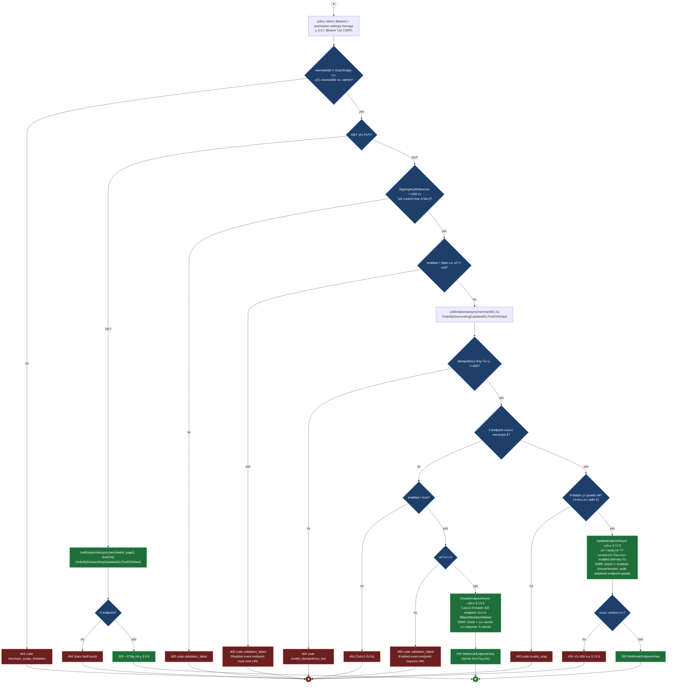
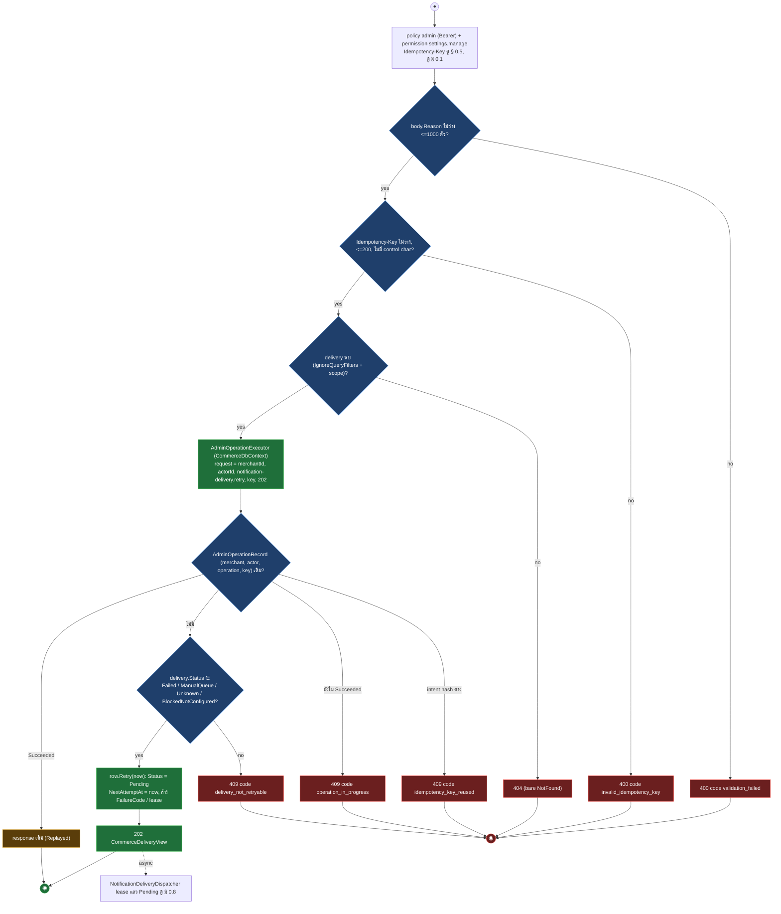
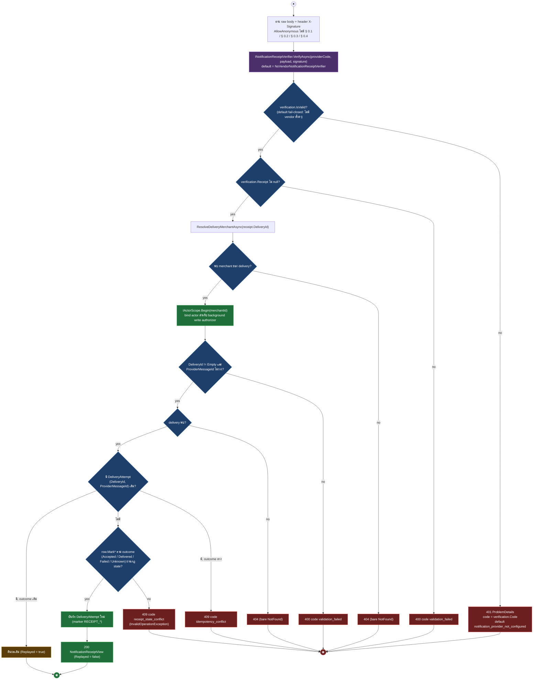

# pol-core API — Notifications และ outbound webhooks (Activity Diagrams)

> Source: `docs/reference/api-endpoints.md` section "Notification delivery" บรรทัด L321-L335 และ section "Canonical notifications" บรรทัด L341-L349 พร้อม source ที่อ้างต่อ § (`src/Api/Api/Notifications/DeliveryEndpoints.cs`, `src/Api/Api/Notifications/CanonicalNotificationEndpoints.cs`, `Persistence.ControlPlane/Notifications/DeliveryStore.cs`, `Persistence.MerchantRuntime/Notifications/NotificationOperations.cs`, `Persistence.MerchantRuntime/Idempotency/AdminOperationExecutor.cs`, `Persistence.ControlPlane/Governance/ControlPlaneOperationExecutor.cs`, `src/Application/Modules/Notifications.Application/DeliveryContracts.cs`, `src/Domain/Modules/Notifications.Domain/DeliveryModels.cs`, `src/Api/Api/ConcurrencyEtags.cs`, `src/Infrastructure/BuildingBlocks.Infrastructure/Persistence/PlatformReadGuard.cs`)
> Scope: 24 endpoints — admin console config ของ webhook endpoint / notification rule / delivery log (15), canonical audit-logs / notification / notification-delivery (8) และ inbound provider receipt (1) ทุกตัวใต้ policy `admin` ยกเว้น receipt ที่ `AllowAnonymous`
> Generated: 2026-09-14

| § | Diagram | Endpoints |
| --- | --- | --- |
| 13.1 | GET list / detail — notification rule, notification delivery, webhook delivery, webhook endpoint (admin config plane) | `GET /api/v1/notifications/deliveries`, `GET /api/v1/notifications/deliveries/{deliveryId:guid}`, `GET /api/v1/notifications/rules`, `GET /api/v1/notifications/rules/{ruleId:guid}`, `GET /api/v1/webhooks/deliveries`, `GET /api/v1/webhooks/deliveries/{deliveryId:guid}`, `GET /api/v1/webhooks/endpoints`, `GET /api/v1/webhooks/endpoints/{endpointId:guid}` |
| 13.2 | GET list / detail — canonical notification, notification-delivery, audit log | `GET /api/v1/audit-logs`, `GET /api/v1/notification-deliveries/{deliveryId:guid}`, `GET /api/v1/notification-deliveries/{deliveryId:guid}/attempts`, `GET /api/v1/notifications`, `GET /api/v1/notifications/{notificationId:guid}` |
| 13.3 | สร้าง / แก้ไข / ลบ notification rule | `POST /api/v1/notifications/rules`, `PUT /api/v1/notifications/rules/{ruleId:guid}`, `DELETE /api/v1/notifications/rules/{ruleId:guid}` |
| 13.4 | สร้าง webhook endpoint (SSRF-safe + secret ครั้งเดียว) | `POST /api/v1/webhooks/endpoints` |
| 13.5 | แก้ไข / ลบ webhook endpoint | `PUT /api/v1/webhooks/endpoints/{endpointId:guid}`, `DELETE /api/v1/webhooks/endpoints/{endpointId:guid}` |
| 13.6 | ส่ง outbound webhook ซ้ำ (replay) | `POST /api/v1/webhooks/deliveries/{deliveryId:guid}/replay` |
| 13.7 | Merchant canonical event-endpoint (อ่าน + กำหนด/ปิด) | `GET /api/v1/merchants/{merchantId:guid}/event-endpoint`, `PUT /api/v1/merchants/{merchantId:guid}/event-endpoint` |
| 13.8 | ลองส่ง canonical notification delivery ใหม่ (retry) | `POST /api/v1/notification-deliveries/{deliveryId:guid}/retries` |
| 13.9 | Receipt จาก notification provider (inbound, anonymous) | `POST /api/v1/webhooks/notifications/{providerCode}` |

---

## 13.1 GET list / detail — notification rule, notification delivery, webhook delivery, webhook endpoint (admin config plane)

ทั้ง 8 endpoint ใช้โครงเดียวกัน: gate policy admin (Bearer) + permission settings.manage (ไม่มี CSRF), scope ด้วย DeliveryAccess (unrestricted หรือ MerchantId ใน accessible) แล้ว list ผ่าน ValidatePage + filter ธรรมดา (ไม่ใช่ SFS parser) หรือ detail ผ่าน SingleOrDefault (source: `src/Api/Api/Notifications/DeliveryEndpoints.cs:14-38,85-107,123-147,195-217`, `Persistence.ControlPlane/Notifications/DeliveryStore.cs:106-129,237-262,283-305,360-391`)

| Method | fullPath | ต่างจาก § กลางตรงไหน |
| --- | --- | --- |
| GET | `/api/v1/notifications/deliveries` | filter merchantId / channel / status / search (LIKE eventType หรือ channel), ORDER BY SentAt desc, Id desc (`DeliveryStore.cs:360-384`) |
| GET | `/api/v1/notifications/deliveries/{deliveryId:guid}` | ไม่มี ETag (log ที่ไม่แก้), body NotificationDeliveryView (`DeliveryStore.cs:386-391`) |
| GET | `/api/v1/notifications/rules` | filter merchantId / enabled / search (LIKE eventType หรือ channel), ORDER BY EventType, Id (`DeliveryStore.cs:283-299`) |
| GET | `/api/v1/notifications/rules/{ruleId:guid}` | มี ETag vN, body NotificationRuleView (destination มาสก์แล้ว) (`DeliveryStore.cs:301-305`) |
| GET | `/api/v1/webhooks/deliveries` | filter merchantId / status / search (LIKE eventType หรือ transactionId), ORDER BY CreatedAt desc, Id desc (`DeliveryStore.cs:237-256`) |
| GET | `/api/v1/webhooks/deliveries/{deliveryId:guid}` | ไม่มี ETag, body มี attemptCount, latencyMs, failureCode, canReplay (`DeliveryStore.cs:258-262`) |
| GET | `/api/v1/webhooks/endpoints` | filter merchantId / enabled / search (LIKE Name / Url / EventsCsv), ORDER BY Name, Id, ไม่คืน signing secret (`DeliveryStore.cs:106-123`) |
| GET | `/api/v1/webhooks/endpoints/{endpointId:guid}` | มี ETag vN, body มี secretHint เท่านั้น ไม่คืน signing secret (`DeliveryStore.cs:125-129`) |

---

## 13.2 GET list / detail — canonical notification, notification-delivery, audit log

4 ใน 5 endpoint (ไม่รวม audit-logs) อยู่คนละชั้นกับ § 13.1: อ่านผ่าน `NotificationOperations` ที่ห่อด้วย `PlatformReadGuard.ReadAsync` (DbException กลายเป็น 503) และ `IgnoreQueryFilters()` แล้ว re-scope เอง; audit-logs อ่านผ่าน `IGovernanceStore.ListAuditsAsync` ซึ่งไม่ผ่าน PlatformReadGuard เลย (`PlatformReadGuard` เป็น `internal` แต่ `GovernanceStore` อยู่ assembly เดียวกัน คือ `Infrastructure.csproj` จึงเรียกได้ถ้าอยากเรียก เป็นแค่โค้ดปัจจุบันไม่ได้ wrap ไว้ ไม่ใช่ข้อจำกัดด้าน visibility/assembly) DbException จึงหลุดเป็น 500 ธรรมดา ไม่ใช่ 503, filter เป็น exact-match ไม่ใช่ SFS parser ทั้งที่ list 2 ตัวมี `SfsQueryParamsMarker` (variant ดู § 0.6) (source: `src/Api/Api/Notifications/CanonicalNotificationEndpoints.cs:23-100,269-309`, `Persistence.MerchantRuntime/Notifications/NotificationOperations.cs:15-74`, `Persistence.ControlPlane/Governance/GovernanceStore.cs:198-238,267-314`, `src/Infrastructure/BuildingBlocks.Infrastructure/Persistence/PlatformReadGuard.cs:15-30`, `src/Api/BuildingBlocks.Web/ProblemDetailsExceptionHandler.cs:71-100`)

| Method | fullPath | ต่างจาก § กลางตรงไหน |
| --- | --- | --- |
| GET | `/api/v1/audit-logs` | permission `audit.view`, filter actor / action / resource / result / merchantId / from / to, from <= to ไม่งั้น 400 invalid_filter, catch เฉพาะ `AuditIntegrityException` (503 audit_integrity_unhealthy); อ่านผ่าน `GovernanceStore` ที่ไม่ผ่าน `PlatformReadGuard` (ต่างจาก 4 endpoint ที่เหลือใน § นี้) DbException จริงจึงหลุดเป็น 500 ธรรมดา ไม่ใช่ 503 (`CanonicalNotificationEndpoints.cs:271-308`, `GovernanceStore.cs:198-238,267-314`); ตรรกะเดียวกับ `GET /api/v1/audits` (theme 12 § 12.3) ต่าง path และไม่ผ่าน mediator |
| GET | `/api/v1/notification-deliveries/{deliveryId:guid}` | อ่านจาก `txn.Deliveries` (CommerceDbContext) คนละตารางกับ `/api/v1/notifications/deliveries/{id}` ใน § 13.1 (`admin.NotificationDeliveries`, ControlPlaneDbContext) (`NotificationOperations.cs:49-56`) |
| GET | `/api/v1/notification-deliveries/{deliveryId:guid}/attempts` | ไม่มี 404 จริงแม้ประกาศ ProducesProblem(404): delivery ไม่พบหรือนอก scope คืน 200 empty array (`NotificationOperations.cs:58-74`) |
| GET | `/api/v1/notifications` | exact-match filter merchantId / orderNo / transactionNo / correlationId เท่านั้น ไม่มี LIKE / JSON filter แม้มี `SfsQueryParamsMarker` (variant ดู § 0.6), merchantId นอก scope คืนชุดว่างไม่ใช่ 403 (`NotificationOperations.cs:15-38`) |
| GET | `/api/v1/notifications/{notificationId:guid}` | ไม่มี ETag, ไม่มี attempts, body เดียว (`NotificationOperations.cs:40-47`) |

---

## 13.3 สร้าง / แก้ไข / ลบ notification rule

3 endpoint ใช้ ControlPlaneOperationExecutor เดียวกัน แต่ลำดับ validation ต่างกันจริงต่อ mode: create ตรวจ scope (403) ก่อน body (400) ส่วน update ตรวจ body (400) ก่อน scope (404); rule mutation ทั้ง 3 ไม่เขียน audit log (source: `src/Api/Api/Notifications/DeliveryEndpoints.cs:149-193`, `Persistence.ControlPlane/Notifications/DeliveryStore.cs:307-358,429-436`, `Persistence.ControlPlane/Governance/ControlPlaneOperationExecutor.cs:19-82`)

| Method | fullPath | ต่างจาก § กลางตรงไหน |
| --- | --- | --- |
| POST | `/api/v1/notifications/rules` | ไม่มี If-Match, ลำดับ EnsureAccess (403) ก่อน ValidateRule (400) ต่างจาก update, 201 + ETag v1, ไม่เขียน audit (`DeliveryStore.cs:307-322`) |
| PUT | `/api/v1/notifications/rules/{ruleId:guid}` | ValidateRule (400) ก่อนหา scope (404) ตรงข้ามกับ create, ไม่เขียน audit (`DeliveryStore.cs:324-340`) |
| DELETE | `/api/v1/notifications/rules/{ruleId:guid}` | ไม่มี body validation, เช็ค NotificationDelivery อ้างอิงก่อนลบ (409 rule_referenced), ไม่เขียน audit (`DeliveryStore.cs:342-358`) |

---

## 13.4 สร้าง webhook endpoint (SSRF-safe + secret ครั้งเดียว)

ต่างจาก § 13.3 ตรงต้องผ่าน `SafeDestinationValidator` (DNS resolve จริง) ก่อน executor และออก signing secret ที่คืนให้ client ครั้งเดียวเท่านั้น (source: `src/Api/Api/Notifications/DeliveryEndpoints.cs:40-53`, `Persistence.ControlPlane/Notifications/DeliveryStore.cs:39-91,131-167,438-443`)

---

## 13.5 แก้ไข / ลบ webhook endpoint

ต่างจาก § 13.3 ตรง SSRF check เฉพาะ PUT เมื่อ enabled = true และมี audit log ทุก mutation (source: `src/Api/Api/Notifications/DeliveryEndpoints.cs:55-83`, `Persistence.ControlPlane/Notifications/DeliveryStore.cs:169-235`)

| Method | fullPath | ต่างจาก § กลางตรงไหน |
| --- | --- | --- |
| PUT | `/api/v1/webhooks/endpoints/{endpointId:guid}` | SSRF check เฉพาะเมื่อ enabled = true, ไม่หมุน signing secret, เขียน audit webhook-endpoint.update (`DeliveryStore.cs:169-201`) |
| DELETE | `/api/v1/webhooks/endpoints/{endpointId:guid}` | เช็ค WebhookDelivery อ้างอิงก่อนลบ (409 endpoint_referenced), retire secret version, เขียน audit webhook-endpoint.delete (`DeliveryStore.cs:203-235`) |

---

## 13.6 ส่ง outbound webhook ซ้ำ (replay)

ต่างจาก § 13.3-13.5 ตรง idempotency ใช้ unique index `(OriginalDeliveryId, ReplayKey)` แทน operation executor และ eligibility ตรวจจาก domain method โดยตรง (source: `src/Api/Api/Notifications/DeliveryEndpoints.cs:109-121`, `Persistence.ControlPlane/Notifications/DeliveryStore.cs:264-281`, `src/Domain/Modules/Notifications.Domain/DeliveryModels.cs:104-121`)

---

## 13.7 Merchant canonical event-endpoint (อ่าน + กำหนด/ปิด)

`PUT` เป็น upsert: ไม่มี endpoint เดิม = สร้าง (เรียก path เดียวกับ § 13.4), มีเดิม = แก้ (เรียก path เดียวกับ § 13.5) ต้องเช็ค merchant scope เองก่อนเข้าทั้งสองสาขา (source: `src/Api/Api/Notifications/CanonicalNotificationEndpoints.cs:180-267,324-342`)

| Method | fullPath | ต่างจาก § กลางตรงไหน |
| --- | --- | --- |
| GET | `/api/v1/merchants/{merchantId:guid}/event-endpoint` | เช็ค `EnsureMerchantAccess` ก่อน (403 merchant_scope_forbidden ต่างจาก § 13.1 ที่ scope กรองเงียบ), คืน endpoint ล่าสุดของ merchant เท่านั้น (`CanonicalNotificationEndpoints.cs:182-205`) |
| PUT | `/api/v1/merchants/{merchantId:guid}/event-endpoint` | upsert: ไม่มี endpoint เดิม = create (ไม่ต้อง If-Match ทั้งที่ marker ประกาศไว้, ทิ้ง secret ที่ออก), มีเดิม = update (ต้อง If-Match), `url` ทั้งสอง branch ของ enabled คำนวณค่าเดียวกัน (`CanonicalNotificationEndpoints.cs:207-266`) |

---

## 13.8 ลองส่ง canonical notification delivery ใหม่ (retry)

ใช้ `AdminOperationExecutor` (Commerce plane, ลงทะเบียนจริงใน DI) แทน `ControlPlaneOperationExecutor`, ไม่มี If-Match เพราะไม่ใช่การแก้ field ของ resource (source: `src/Api/Api/Notifications/CanonicalNotificationEndpoints.cs:102-134`, `Persistence.MerchantRuntime/Notifications/NotificationOperations.cs:80-128`, `Persistence.MerchantRuntime/Idempotency/AdminOperationExecutor.cs:24-60`, `src/Domain/Modules/Notifications.Domain/DeliveryModels.cs:521-532`)

---

## 13.9 Receipt จาก notification provider (inbound, anonymous)

`AllowAnonymous` ไม่ผ่านกลุ่ม § 0.1-0.4 เลย, ตรวจสิทธิ์ด้วย signature ผ่าน provider port แทน คนละกลไกกับ webhook inbound ของ PSP (source: `src/Api/Api/Notifications/CanonicalNotificationEndpoints.cs:136-178`, `src/Application/Modules/Notifications.Application/DeliveryContracts.cs:60-65`, `Persistence.MerchantRuntime/Notifications/NotificationOperations.cs:155-235`, `Program.cs:300-301`)

---

## Deviations

ไม่พบ deviation ระหว่างเอกสารกับ source — ทุก policy / permission / caller ในตาราง inventory ตรงกับ `RequireAuthorization` / `RequirePermission` / `AllowAnonymous` จริงในทั้ง 2 ไฟล์ source

## Notes

| เรื่อง | ข้อเท็จจริงจาก source | source |
| --- | --- | --- |
| สอง "delivery" คนละตาราง | `/api/v1/notifications/deliveries/{id}` (§ 13.1) อ่าน `admin.NotificationDeliveries` (ControlPlaneDbContext, append-only) ส่วน `/api/v1/notification-deliveries/{id}` (§ 13.2) อ่าน `txn.Deliveries` (CommerceDbContext, จัดการโดย NotificationDeliveryDispatcher) เป็นคนละตาราง คนละ Id space | `DeliveryStore.cs:393-420`, `NotificationOperations.cs:49-56` |
| แถวต้นทางของ delivery มาจากนอก 24 endpoint นี้ | `IDeliveryEventSink.EnqueueAsync` (สร้าง WebhookDeliveries + NotificationDeliveries ของ § 13.1) ถูกเรียกจาก order/payment event consumer ของโมดูลอื่น ไม่ใช่จาก endpoint ใน theme นี้ ถือว่าอยู่นอก frame | `DeliveryStore.cs:393-420` |
| § 13.2 ผ่าน PlatformReadGuard เฉพาะ 4 ใน 5 endpoint, § 13.1 ไม่ผ่านเลย | ทุก read ใน `NotificationOperations` (notifications, notifications/{id}, notification-deliveries/{id}, attempts) ห่อด้วย `PlatformReadGuard.ReadAsync` (DbException กลายเป็น 503 DependencyUnavailable); `DeliveryControlStore` (§ 13.1) และ `GovernanceStore` (audit-logs) เรียก EF ตรงไม่มี guard นี้เลย (`PlatformReadGuard` เป็น `internal` แต่ `GovernanceStore` อยู่ assembly เดียวกัน คือ `Infrastructure.csproj` จึงเรียกได้ถ้าอยากเรียก เป็นความไม่สม่ำเสมอของ implementation ไม่ใช่ข้อจำกัดด้าน visibility/assembly) — DbException ของ audit-logs จึงหลุดเป็น 500 ธรรมดา ไม่ใช่ 503 | `PlatformReadGuard.cs:15,17-30`, `NotificationOperations.cs` ทุก method, `GovernanceStore.cs:198-238,267-314` |
| § 13.2 ข้าม global query filter เอง | ทุก query ใน `NotificationOperations` เรียก `IgnoreQueryFilters()` แล้ว re-scope ด้วย `DeliveryAccess` เอง ไม่พึ่ง EF global filter ปกติ | `NotificationOperations.cs:19,43,52,61,66,91,111,137,162` |
| attempts ไม่เคย 404 จริง | `ListAttemptsAsync` คืน `[]` เมื่อ delivery ไม่พบหรือนอก scope แทนที่จะ throw แม้ endpoint ประกาศ `ProducesProblem(404)` | `NotificationOperations.cs:58-74` |
| rule mutation ไม่มี audit log | `CreateRuleAsync` / `UpdateRuleAsync` / `DeleteRuleAsync` ไม่เรียก `audits.AppendAsync` เลย ต่างจาก webhook endpoint 3 ตัวที่เขียน audit ทุกครั้ง | `DeliveryStore.cs:307-358` เทียบ `131-235` |
| § 13.7 PUT ทิ้ง secret ที่ออกใหม่ | สาขา create เรียก `CreateEndpointAsync` แล้ว `Results.Ok(created.Endpoint)` เท่านั้น `created.Secret` (signing secret ที่ออกครั้งแรก) ไม่ถูกส่งกลับ client เลย | `CanonicalNotificationEndpoints.cs:230-239` |
| § 13.7 SigningKeyReference ตรวจแล้วไม่ใช้ | `ValidateSigningKeyReference(body.SigningKeyReference)` ตรวจความยาว/control char แต่ค่าที่ผ่านไม่ถูกเก็บหรือใช้ต่อในเมธอดนี้เลย | `CanonicalNotificationEndpoints.cs:207-266` |
| § 13.7 ประกาศ 412 แต่ไม่เคยส่งจริง | `ProducesProblem(Status412PreconditionFailed)` ประกาศไว้ แต่ If-Match รูปผิดออก 400 invalid_etag (ConcurrencyEtags) และ version ไม่ตรงออก 409 (ConcurrencyConflictException) ไม่มี path ไหนโยน 412 | `ConcurrencyEtags.cs:18-26`, `DeliveryStore.cs:169-201` |
| § 13.6 replay ไม่ผ่าน operation executor | idempotency ของ replay ใช้ unique index `(OriginalDeliveryId, ReplayKey)` เช็คเองใน transaction ไม่ใช้ ControlPlaneOperationExecutor, `ValidateKey` ภายในไม่มีทางถูกเรียกเพราะ `IdempotencyKeys.Require` ที่ endpoint กรองก่อนแล้ว | `DeliveryStore.cs:264-281` |
| unique index ที่ endpoint อาจไม่ได้กันชน (ยังไม่ยืนยัน) | ตาราง `WebhookEndpoints` มี unique filtered index `MerchantId WHERE Enabled=1` แต่ไม่พบจุดใน `CreateEndpointAsync` / `UpdateEndpointAsync` ที่ catch การชนแล้วแปลงเป็น 409 คาดว่าจะหลุดเป็น 500 ผ่าน § 0.9 "อื่น 500" ไม่พบ handler ที่ map เป็นค่าที่ต่างออกไป | `DeliveryStore.cs:517`, `131-167`, `169-201` |
| § 13.9 ไม่มี rate limit | endpoint ไม่มี `.RequireRateLimiting` ต่อไว้เลย (ไม่อยู่ใน policy `psp-webhook` ของ § 0.4 ซึ่งครอบเฉพาะ PSP inbound คนละกลุ่ม) | `CanonicalNotificationEndpoints.cs:138-178` |

**Render**: GitHub / Obsidian / VS Code Mermaid
