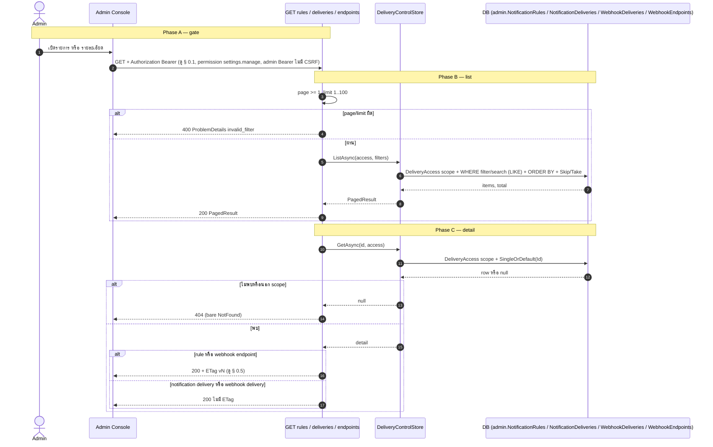
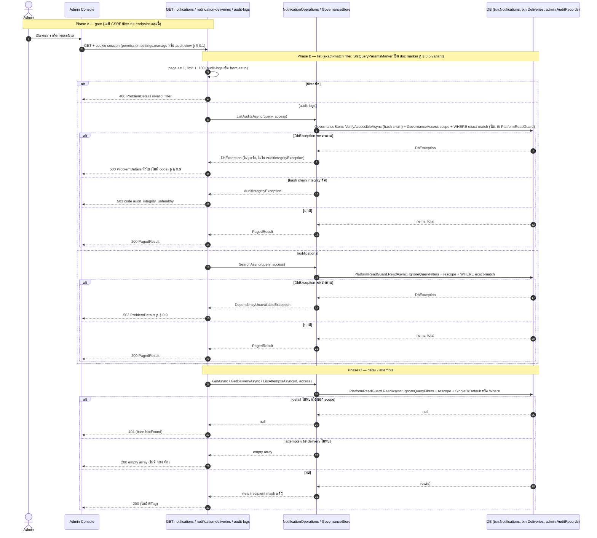
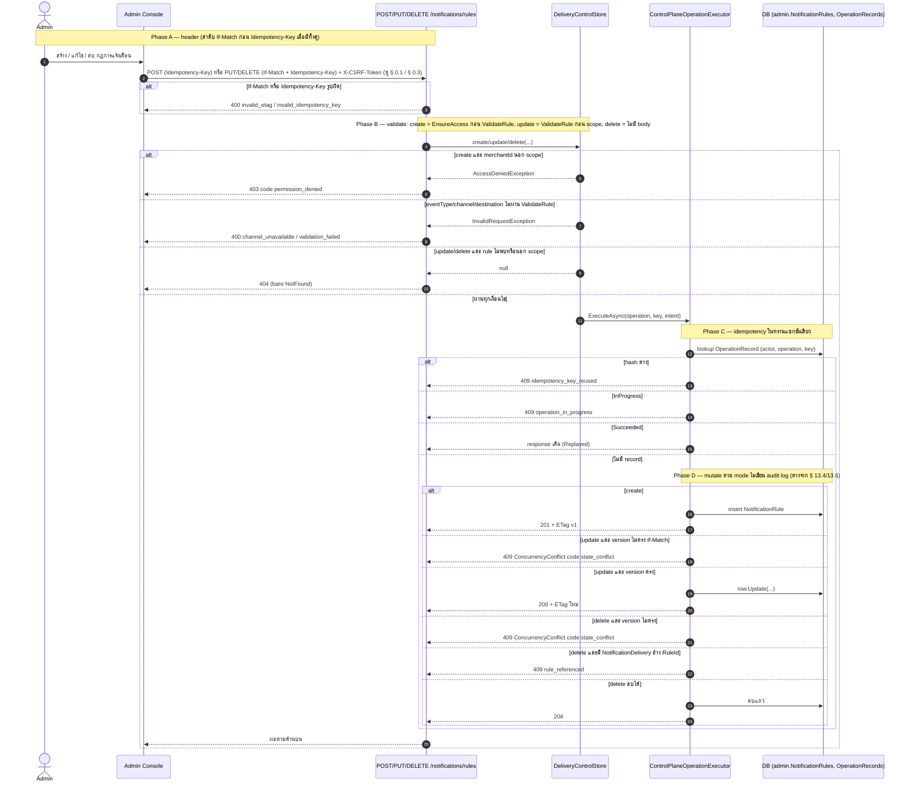
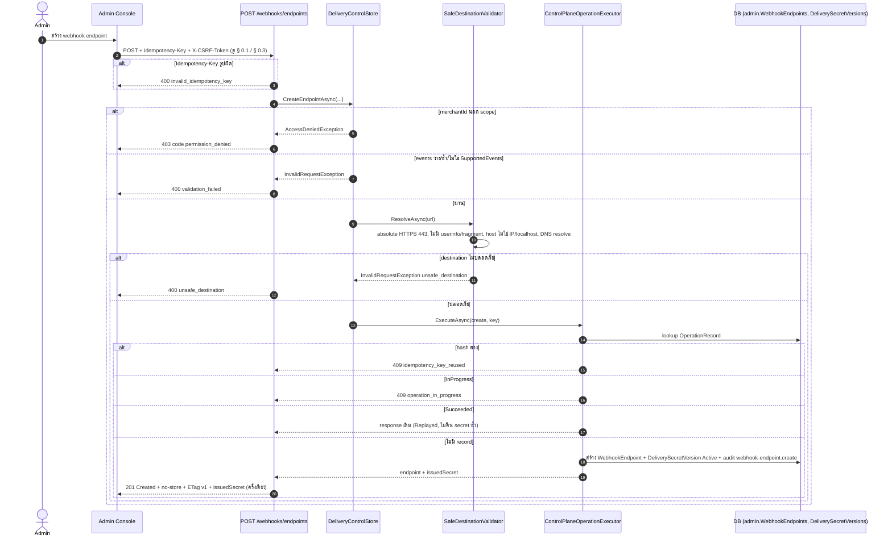
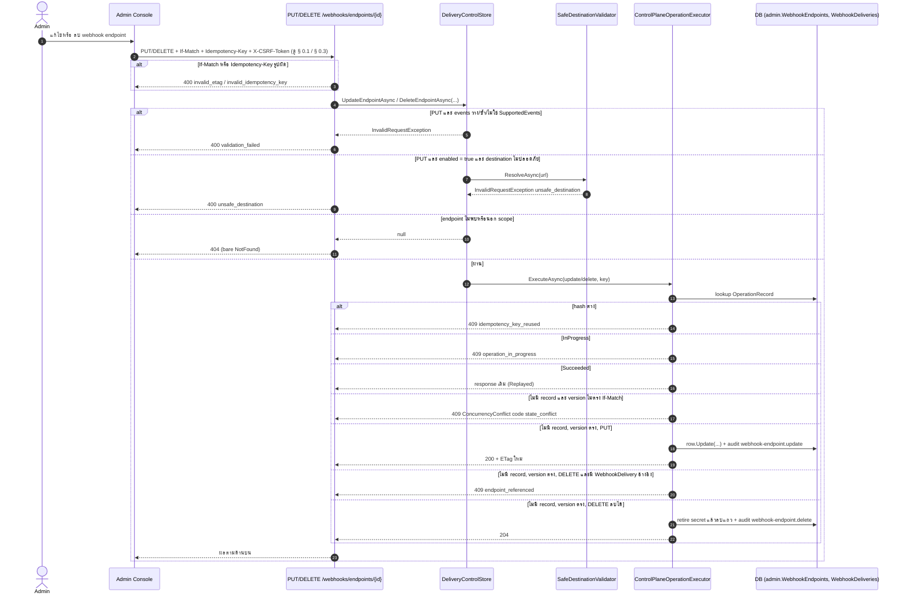
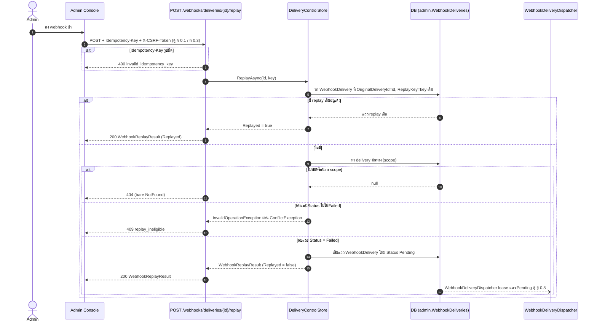
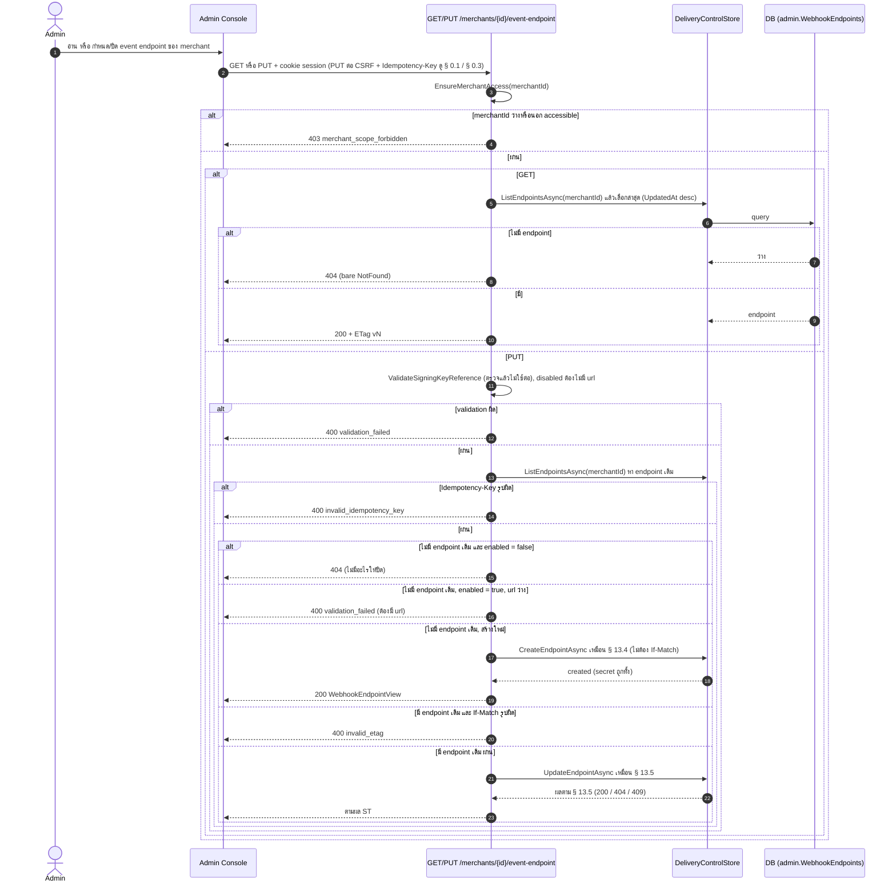
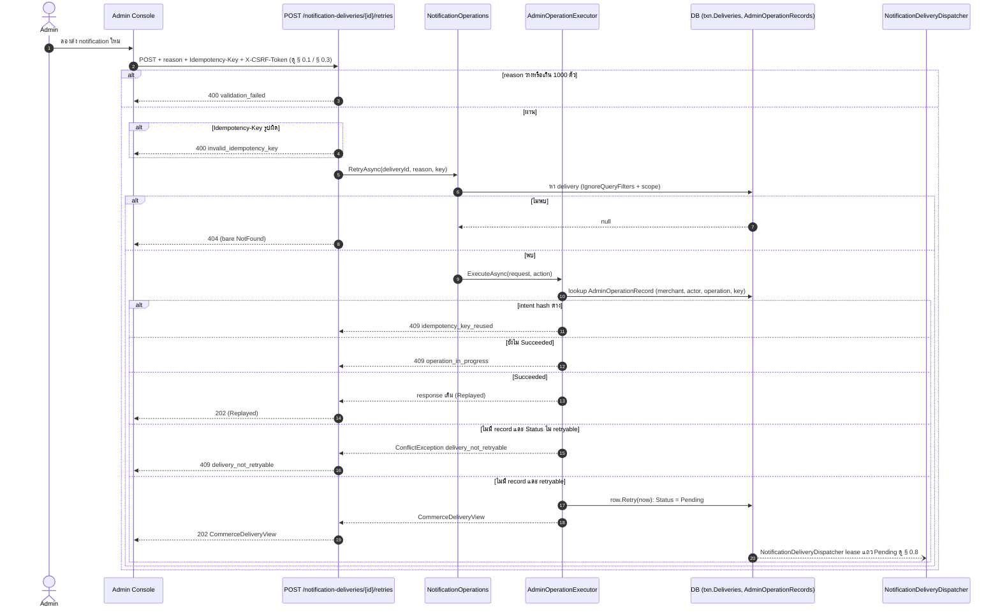
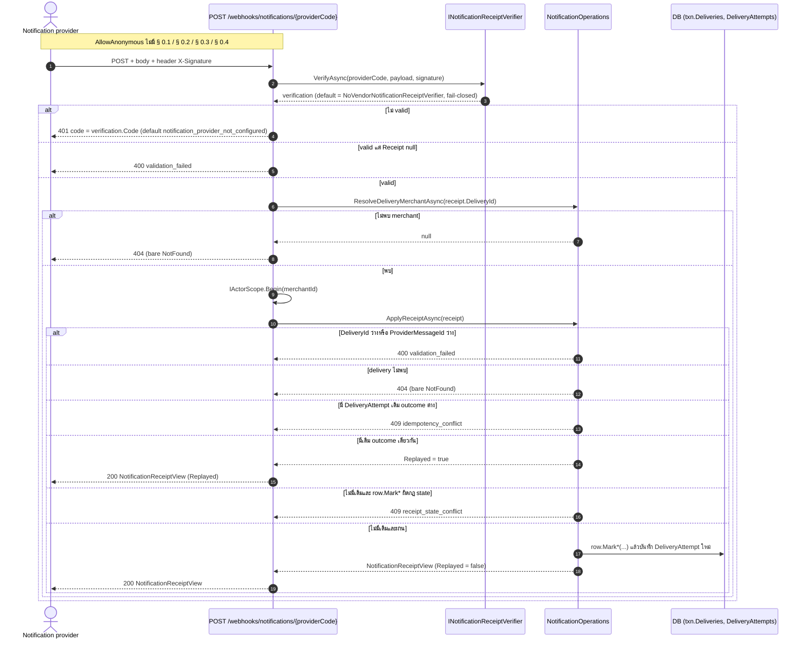

# pol-core API — Notifications และ outbound webhooks (Sequence Diagrams)

> Source: `docs/reference/api-endpoints.md` section "Notification delivery" บรรทัด L321-L335 และ section "Canonical notifications" บรรทัด L341-L349 พร้อม source ที่อ้างต่อ § (`src/Api/Api/Notifications/DeliveryEndpoints.cs`, `src/Api/Api/Notifications/CanonicalNotificationEndpoints.cs`, `Persistence.ControlPlane/Notifications/DeliveryStore.cs`, `Persistence.MerchantRuntime/Notifications/NotificationOperations.cs`, `Persistence.MerchantRuntime/Idempotency/AdminOperationExecutor.cs`, `Persistence.ControlPlane/Governance/ControlPlaneOperationExecutor.cs`, `src/Application/Modules/Notifications.Application/DeliveryContracts.cs`, `src/Domain/Modules/Notifications.Domain/DeliveryModels.cs`)
> Scope: 9 § เดียวกับ `13-notifications-outbound-webhooks.activities.md` (หมายเลข § ตรงกัน) แสดงลำดับข้าม actor (Admin, Notification provider) / API / store / executor / DB / dispatcher
> Generated: 2026-09-14

| § | Diagram | Endpoints |
| --- | --- | --- |
| 13.1 | GET list / detail — notification rule, notification delivery, webhook delivery, webhook endpoint (admin config plane) | `GET /api/v1/notifications/deliveries`, `GET /api/v1/notifications/deliveries/{deliveryId:guid}`, `GET /api/v1/notifications/rules`, `GET /api/v1/notifications/rules/{ruleId:guid}`, `GET /api/v1/webhooks/deliveries`, `GET /api/v1/webhooks/deliveries/{deliveryId:guid}`, `GET /api/v1/webhooks/endpoints`, `GET /api/v1/webhooks/endpoints/{endpointId:guid}` |
| 13.2 | GET list / detail — canonical notification, notification-delivery, audit log | `GET /api/v1/audit-logs`, `GET /api/v1/notification-deliveries/{deliveryId:guid}`, `GET /api/v1/notification-deliveries/{deliveryId:guid}/attempts`, `GET /api/v1/notifications`, `GET /api/v1/notifications/{notificationId:guid}` |
| 13.3 | สร้าง / แก้ไข / ลบ notification rule | `POST /api/v1/notifications/rules`, `PUT /api/v1/notifications/rules/{ruleId:guid}`, `DELETE /api/v1/notifications/rules/{ruleId:guid}` |
| 13.4 | สร้าง webhook endpoint (SSRF-safe + secret ครั้งเดียว) | `POST /api/v1/webhooks/endpoints` |
| 13.5 | แก้ไข / ลบ webhook endpoint | `PUT /api/v1/webhooks/endpoints/{endpointId:guid}`, `DELETE /api/v1/webhooks/endpoints/{endpointId:guid}` |
| 13.6 | ส่ง outbound webhook ซ้ำ (replay) | `POST /api/v1/webhooks/deliveries/{deliveryId:guid}/replay` |
| 13.7 | Merchant canonical event-endpoint (อ่าน + กำหนด/ปิด) | `GET /api/v1/merchants/{merchantId:guid}/event-endpoint`, `PUT /api/v1/merchants/{merchantId:guid}/event-endpoint` |
| 13.8 | ลองส่ง canonical notification delivery ใหม่ (retry) | `POST /api/v1/notification-deliveries/{deliveryId:guid}/retries` |
| 13.9 | Receipt จาก notification provider (inbound, anonymous) | `POST /api/v1/webhooks/notifications/{providerCode}` |

---

## 13.1 GET list / detail — notification rule, notification delivery, webhook delivery, webhook endpoint (admin config plane)

ลำดับเดียวกันสำหรับทั้ง 8 endpoint: gate แล้ว list ผ่าน filter ธรรมดา + scope query หรือ detail ผ่าน scope + SingleOrDefault (source: `DeliveryEndpoints.cs:14-38,85-107,123-147,195-217`, `DeliveryStore.cs:106-129,237-262,283-305,360-391`)

---

## 13.2 GET list / detail — canonical notification, notification-delivery, audit log

ต่างจาก § 13.1 ตรง 4 ใน 5 endpoint อ่านผ่าน `PlatformReadGuard` (DbException = 503) และ `IgnoreQueryFilters` + rescope เอง; audit-logs อ่านผ่าน `GovernanceStore` ที่ไม่ผ่าน PlatformReadGuard เลย ดังนั้น DbException ของ audit-logs จึงเป็น 500 ธรรมดา ไม่ใช่ 503 (source: `CanonicalNotificationEndpoints.cs:23-100,269-309`, `NotificationOperations.cs:15-74`, `GovernanceStore.cs:198-238,267-314`, `PlatformReadGuard.cs:15-30`, `ProblemDetailsExceptionHandler.cs:71-100`)

---

## 13.3 สร้าง / แก้ไข / ลบ notification rule

`ControlPlaneOperationExecutor` เดียวกัน แต่ลำดับ validation ต่างกันจริงต่อ mode (create: scope ก่อน body, update: body ก่อน scope), ไม่เขียน audit log ทั้ง 3 mode (source: `DeliveryEndpoints.cs:149-193`, `DeliveryStore.cs:307-358,429-436`, `ControlPlaneOperationExecutor.cs:19-82`)

---

## 13.4 สร้าง webhook endpoint (SSRF-safe + secret ครั้งเดียว)

ต่างจาก § 13.3 ตรงต้องผ่าน `SafeDestinationValidator` (DNS resolve จริง) ก่อน executor และออก signing secret ครั้งเดียว (source: `DeliveryEndpoints.cs:40-53`, `DeliveryStore.cs:39-91,131-167`)

---

## 13.5 แก้ไข / ลบ webhook endpoint

ต่างจาก § 13.4 ตรง SSRF check เฉพาะ PUT เมื่อ enabled = true (source: `DeliveryEndpoints.cs:55-83`, `DeliveryStore.cs:169-235`)

---

## 13.6 ส่ง outbound webhook ซ้ำ (replay)

idempotency ใช้ unique index `(OriginalDeliveryId, ReplayKey)` แทน operation executor (source: `DeliveryEndpoints.cs:109-121`, `DeliveryStore.cs:264-281`, `DeliveryModels.cs:104-121`)

---

## 13.7 Merchant canonical event-endpoint (อ่าน + กำหนด/ปิด)

`PUT` เป็น upsert เรียก path เดียวกับ § 13.4 (สร้าง) หรือ § 13.5 (แก้ไข) หลังเช็ค merchant scope เอง (source: `CanonicalNotificationEndpoints.cs:180-267,324-342`)

---

## 13.8 ลองส่ง canonical notification delivery ใหม่ (retry)

ใช้ `AdminOperationExecutor` (Commerce plane) แทน `ControlPlaneOperationExecutor`, ไม่มี If-Match (source: `CanonicalNotificationEndpoints.cs:102-134`, `NotificationOperations.cs:80-128`, `AdminOperationExecutor.cs:24-60`, `DeliveryModels.cs:521-532`)

---

## 13.9 Receipt จาก notification provider (inbound, anonymous)

`AllowAnonymous` ตรวจสิทธิ์ด้วย signature ผ่าน provider port แทน gate ปกติ (source: `CanonicalNotificationEndpoints.cs:136-178`, `DeliveryContracts.cs:60-65`, `NotificationOperations.cs:155-235`)

## Notes

- Deviations ของ theme นี้อยู่ที่ `13-notifications-outbound-webhooks.activities.md` ไฟล์นี้ไม่ทำซ้ำ
- สอง "delivery" คนละตาราง (§ 13.1 = `admin.NotificationDeliveries`, § 13.2 = `txn.Deliveries`) และการ async ต่อจาก § 13.6/§ 13.8 เป็นแค่การ lease แถว Pending ของ dispatcher ที่มีอยู่แล้ว ไม่ใช่ outbox message ใหม่ (ต่างจาก maker-checker ของ theme 12) รายละเอียดเต็มอยู่ใน Notes ของ activities.md
- § 13.9 เป็น sequence เดียวในไฟล์นี้ที่ actor เป็นระบบภายนอก (Notification provider) ไม่ใช่ Admin และไม่มี Admin Console เข้ามาเกี่ยวข้องเลย

**Render**: GitHub / Obsidian / VS Code Mermaid
