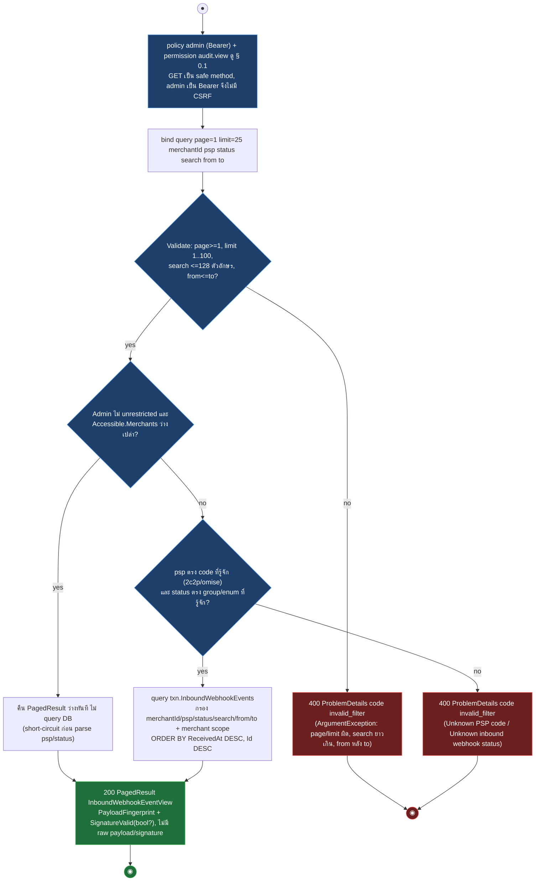
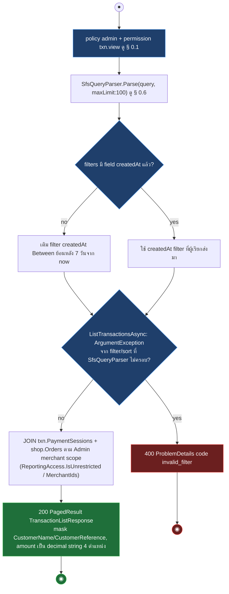
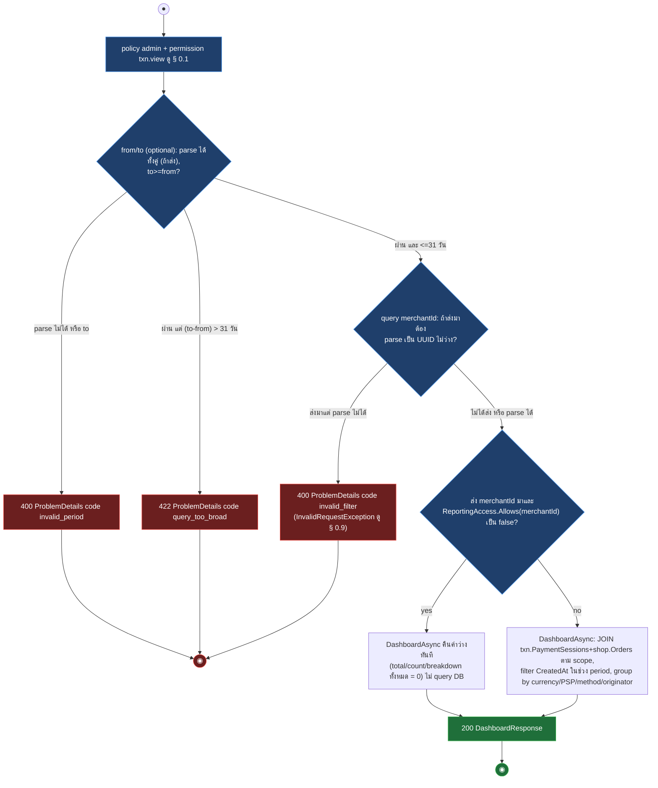
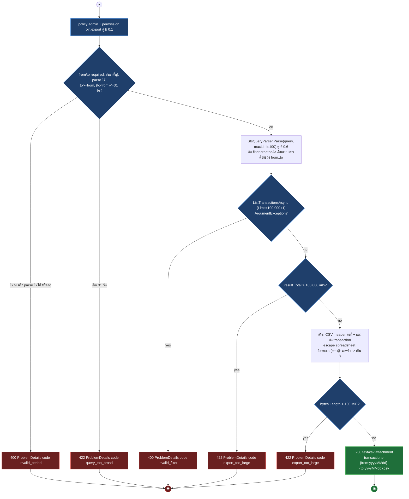
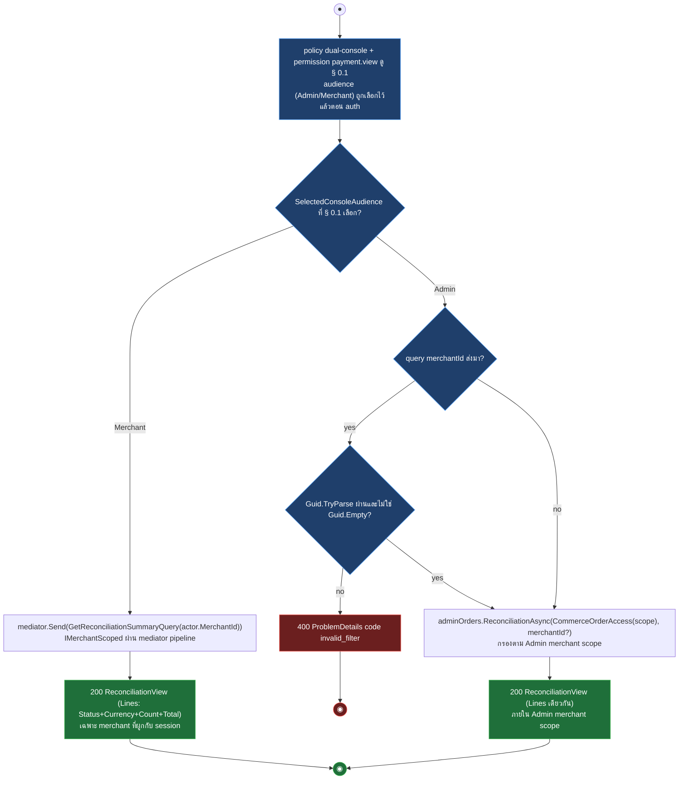
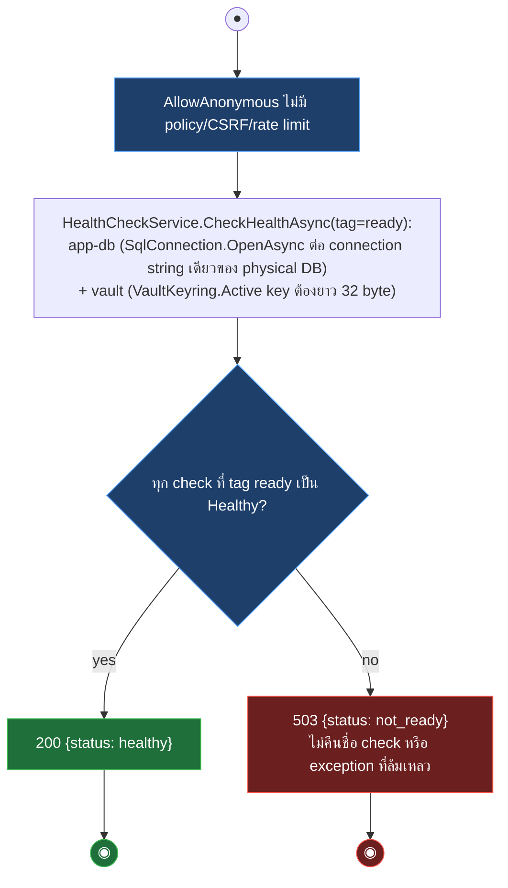
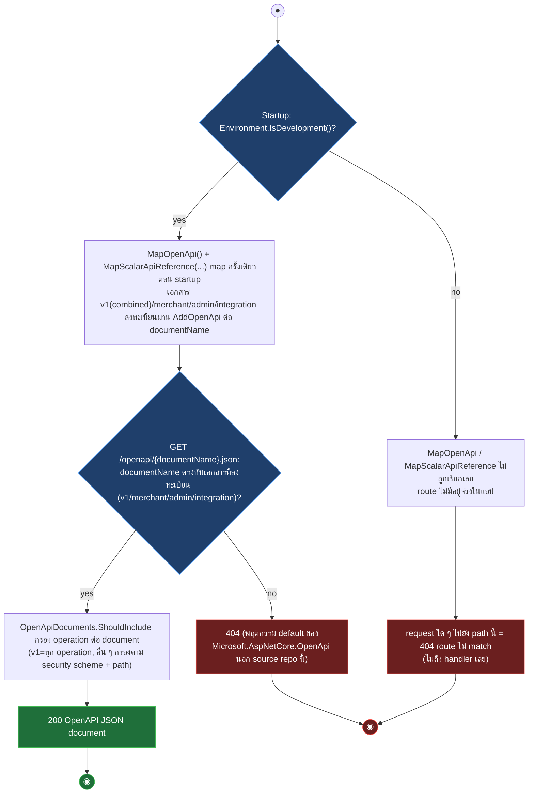

# pol-core API — Inbound PSP webhook log, reporting, health และ development surfaces (Activity Diagrams)

> Source: `docs/reference/api-endpoints.md` ส่วน "Inbound PSP webhooks" (L351-L356), "Reporting" (L358-L368), "Infrastructure และ health" (L370-L375), "OpenAPI และ Scalar (development only)" (L377-L384) และ source ที่อ้างต่อ § (`src/Api/Api/Webhooks/InboundWebhookEndpoints.cs`, `src/Api/Api/Reporting/AdminReportingEndpoints.cs`, `src/Api/Api/Program.cs`, `src/Api/BuildingBlocks.Web/HealthChecks.cs`, `src/Api/Api/OpenApiDocuments.cs`, `src/Infrastructure/Persistence/Persistence.MerchantRuntime/Payments/InboundWebhookStore.cs`, `src/Infrastructure/Persistence/Persistence.MerchantRuntime/Reporting/AdminReportingReader.cs`)
> Scope: 13 endpoints — อ่าน inbound PSP webhook log แบบลดข้อมูลอ่อนไหว (2), รายงานธุรกรรม/dashboard/reconciliation ฝั่ง Admin (7), health probe (2), OpenAPI/Scalar เฉพาะ development (2)
> Generated: 2026-09-14

| § | Diagram | Endpoints |
| --- | --- | --- |
| 14.1 | ค้นและอ่านรายละเอียด Inbound PSP webhook event | `GET /api/v1/webhooks/inbound-events`, `GET /api/v1/webhooks/inbound-events/{eventId:guid}` |
| 14.2 | รายการและรายละเอียดธุรกรรม (Transactions) | `GET /api/v1/payments/transactions`, `GET /api/v1/payments/transactions/{paymentSessionId:guid}` |
| 14.3 | สรุปยอด dashboard และรายงานปฏิบัติการ | `GET /api/v1/reports/dashboard`, `GET /api/v1/reports/operations` |
| 14.4 | ส่งออกรายงานเป็น CSV | `GET /api/v1/payments/transactions/export`, `GET /api/v1/reports/operations/export` |
| 14.5 | รายงาน reconciliation (dual-console) | `GET /api/v1/reports/reconciliation` |
| 14.6 | Health check (liveness/readiness) | `GET /health/live`, `GET /health/ready` |
| 14.7 | OpenAPI document และ Scalar UI (development only) | `GET /openapi/{documentName}.json`, `GET /scalar/{documentName?}` |

---

## 14.1 ค้นและอ่านรายละเอียด Inbound PSP webhook event

list กรอง merchant scope + query แล้วคืนเฉพาะ payload fingerprint และผล signature ไม่คืน raw payload หรือลายเซ็นจริง (source: `InboundWebhookEndpoints.cs:13-43`, `InboundWebhookStore.cs:126-178,215-223`, `Payments.Domain/Psp/Code.cs:27-36`)

| Method | fullPath | ต่างจาก § กลางตรงไหน |
| --- | --- | --- |
| GET | `/api/v1/webhooks/inbound-events/{eventId:guid}` | permission เดียวกัน (audit.view), ไม่มี query filter/validation, lookup ตรง `eventId` ในสโคปเดียวกัน, หา `eventId` ไม่พบหรือนอก scope -> 404 bare (ไม่แยกเหตุ), พบ -> 200 `InboundWebhookEventView` ตัวเดียวกัน (ไม่มี ETag) |

---

## 14.2 รายการและรายละเอียดธุรกรรม (Transactions)

list ใช้ SFS parser แล้วเติม createdAt ย้อนหลัง 7 วันเมื่อไม่ได้ระบุ, join session กับ order ภายใน merchant scope (source: `AdminReportingEndpoints.cs:51-88,165-188,258-270`, `AdminReportingReader.cs:97-132,134-169,171-209`)

| Method | fullPath | ต่างจาก § กลางตรงไหน |
| --- | --- | --- |
| GET | `/api/v1/payments/transactions/{paymentSessionId:guid}` | permission เดียวกัน (txn.view), ไม่มี SFS, lookup ตรง `paymentSessionId` ในสโคปเดียวกัน, ไม่พบหรือนอก scope -> 404, พบ -> 200 `TransactionDetailResponse` (transaction + Order lines + lifecycle events จาก outbox PaymentPaid/Failed/Expired + capability flags) พร้อม header ETag = vN จาก `Session.Version` ดู § 0.5, `ProducesProblem(409)` ประกาศไว้แต่ handler ไม่มี path คืน 409 จริง (ดู Notes) |

---

## 14.3 สรุปยอด dashboard และรายงานปฏิบัติการ

period ไม่ระบุ default ย้อนหลัง 7 วัน สูงสุด 31 วัน, ส่ง merchantId ที่นอก Admin scope ไม่ error แต่คืนค่าว่างเงียบ ๆ (source: `AdminReportingEndpoints.cs:20-49,190-217,275-296`, `AdminReportingReader.cs:19-95`)

| Method | fullPath | ต่างจาก § กลางตรงไหน |
| --- | --- | --- |
| GET | `/api/v1/reports/operations` | permission/period/merchantId/empty-scope logic เหมือนกันทุกจุด (เรียก `DashboardAsync` ตัวเดียวกัน), ต่างที่ response ห่อเป็น `OperationsReportResponse(Summary, UnavailableSections: [])` — `UnavailableSections` เป็น array ว่างตายตัว ไม่เคยเติมค่า |

---

## 14.4 ส่งออกรายงานเป็น CSV

period บังคับทั้งคู่ ไม่เกิน 31 วัน, ตรวจ cap ก่อนสร้างไฟล์และหลังสร้างไฟล์ พร้อม escape spreadsheet formula injection (source: `AdminReportingEndpoints.cs:15-16,90-163,219-252,307-378`)

| Method | fullPath | ต่างจาก § กลางตรงไหน |
| --- | --- | --- |
| GET | `/api/v1/reports/operations/export` | permission `txn.export` เดียวกัน, period required เหมือนกัน (400 `invalid_period` / 422 `query_too_broad`), ไม่มี SFS filter, ไม่มี row-count cap, `merchantId` optional เหมือน § 14.3 — นอก scope คืน summary ว่างเงียบ ๆ ก่อนสร้าง CSV, เรียก `DashboardAsync` แทน `ListTransactionsAsync`, สร้าง CSV totals+breakdown ต่อ PSP/method/originator, ยังตรวจ cap 100 MiB เดียวกัน -> 422 `export_too_large`, ไฟล์ `operations-{from}-{to}.csv` |

---

## 14.5 รายงาน reconciliation (dual-console)

audience Merchant เห็นเฉพาะร้านค้าที่ผูก session ผ่าน mediator query, audience Admin เห็นร้านค้าใน scope และกรอง merchantId ได้ผ่าน reader ตรง ทั้งสองคืนรูปแบบเดียวกัน (source: `Program.cs:2376-2411,3719-3720,3846-3847`, `Orders.Application/GetReconciliationSummary.cs:9,17-31`)

---

## 14.6 Health check (liveness/readiness)

ready ตรวจ DB connectivity และ vault key แล้วคืนเฉพาะ status token, live ไม่ตรวจ dependency ใด ๆ (source: `HealthChecks.cs:69-117`, `Program.cs:727`)

| Method | fullPath | ต่างจาก § กลางตรงไหน |
| --- | --- | --- |
| GET | `/health/live` | `AllowAnonymous` เหมือนกัน, ไม่ตรวจ dependency ใด ๆ (ไม่มี tag `ready`), ไม่มี branch, เสมอ 200 `{status: healthy}` — orchestrator ใช้เป็นสัญญาณ restart process เท่านั้น |

---

## 14.7 OpenAPI document และ Scalar UI (development only)

ทั้งสอง route ถูก map เฉพาะตอน startup เมื่อ `Environment.IsDevelopment()` เป็นจริง ไม่ใช่ per-request check (source: `Program.cs:729-740`, `OpenApiDocuments.cs:8-98`)

| Method | fullPath | ต่างจาก § กลางตรงไหน |
| --- | --- | --- |
| GET | `/scalar/{documentName?}` | boot-gate เดียวกัน (dev only), เมื่อ map แล้วเสิร์ฟ Scalar reference UI (HTML) ไม่ใช่ JSON, document ตัวเลือก merchant/admin/integration (default = merchant, `isDefault:true`), title คงที่ "pol-core API", ไม่มี 404 ต่อ documentName ที่ไม่รู้จัก (Scalar UI จัดการ selector เอง) เสมอ 200 |

---

## Deviations

| fullPath | เอกสารบอก | source บอก | อ้างอิง |
| --- | --- | --- | --- |
| ไม่พบ deviation ระหว่างเอกสารกับ source | - | - | - |

## Notes

| เรื่อง | ข้อเท็จจริงจาก source | source |
| --- | --- | --- |
| CSRF บน GET ของ webhook log | endpoint เป็น policy `admin` (Bearer JWT) จึงไม่มี CSRF filter — admin double-submit ถูก retire และเป็น GET (safe method) อยู่แล้ว | `Iam/CsrfParity.cs:19,94-125` |
| scope ว่างของ list vs detail | list คืน `PagedResult` ว่าง (200) เมื่อ Admin ไม่มี merchant ใน scope เลย ส่วน detail คืน null -> 404 แบบเดียวกับหาไม่พบ (ไม่แยกเหตุ) | `InboundWebhookStore.cs:131-132,185-186` |
| 409 ที่ประกาศไว้แต่ไม่มี path จริง | `GetAdminTransaction` (`GET /payments/transactions/{id}`) ประกาศ `ProducesProblem(409)` แต่ `GetTransactionAsync` อ่านแล้วคืน null หรือ object เท่านั้น ไม่มี branch ที่ throw exception ที่ map เป็น 409 — เผื่อ concurrency ในอนาคตหรือ metadata ตกค้าง | `AdminReportingEndpoints.cs:165-188`, `AdminReportingReader.cs:134-169` |
| merchantId นอก scope ของ dashboard/operations/operations-export | ไม่ตอบ 403/404 แต่คืนค่าว่าง/summary ศูนย์อย่างเงียบ ๆ (`DashboardAsync` เช็ค `access.Allows(selected)` ก่อน query) | `AdminReportingReader.cs:25-26` |
| reconciliation สองเส้นทาง | audience Merchant ส่งผ่าน `IMediator` (`GetReconciliationSummaryQuery`, `IMerchantScoped`) ส่วน audience Admin เรียก `IAdminOrderReader.ReconciliationAsync` ตรง — คนละ code path แต่คืน `ReconciliationView` ทรงเดียวกัน | `Program.cs:2384-2401`, `GetReconciliationSummary.cs:9,17-31` |
| openapi/scalar ไม่อยู่ในยอด explicit operations | เอกสารระบุว่า 2 route นี้ map เฉพาะ development และไม่นับรวมยอด explicit 274 operations ของ API ทั้งระบบ | `docs/reference/api-endpoints.md:379` |
| ขนาด export cap | `MaxExportRows = 100_000` ใช้เฉพาะ transactions/export (นับต่อแถว), ทั้งสอง export ใช้ `MaxExportBytes = 100 MiB` ร่วมกัน (นับ byte ของ CSV ที่ build เสร็จ) | `AdminReportingEndpoints.cs:15-16` |
| formula injection escape | ค่าที่ขึ้นต้นด้วย `= + - @` ถูกเติม `'` นำหน้าก่อนใส่ quote ใน CSV ทุกคอลัมน์ ป้องกัน spreadsheet formula injection | `AdminReportingEndpoints.cs:372-377` |
| health ไม่ตรวจ topology | ทั้ง live/ready คืนเฉพาะ `{status}` ไม่มี exception message, connection string หรือชื่อ check หลุดออกไป | `HealthChecks.cs:33-37,60-64,101-107` |

**Render**: GitHub / Obsidian / VS Code Mermaid
