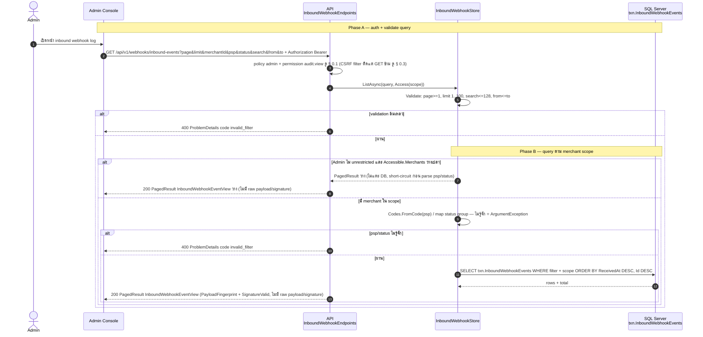
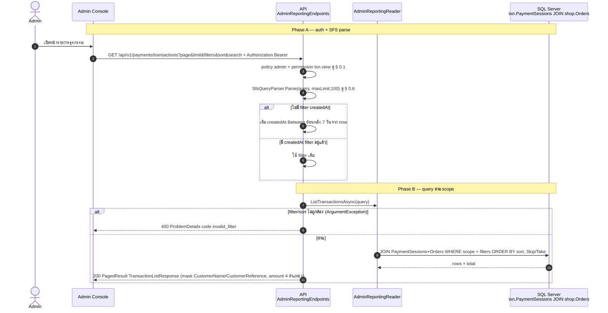
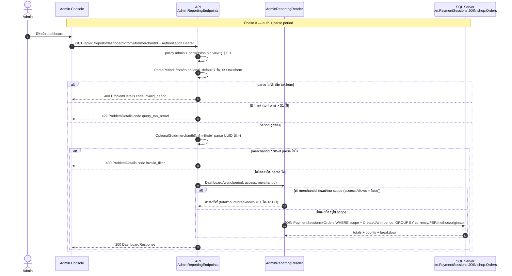
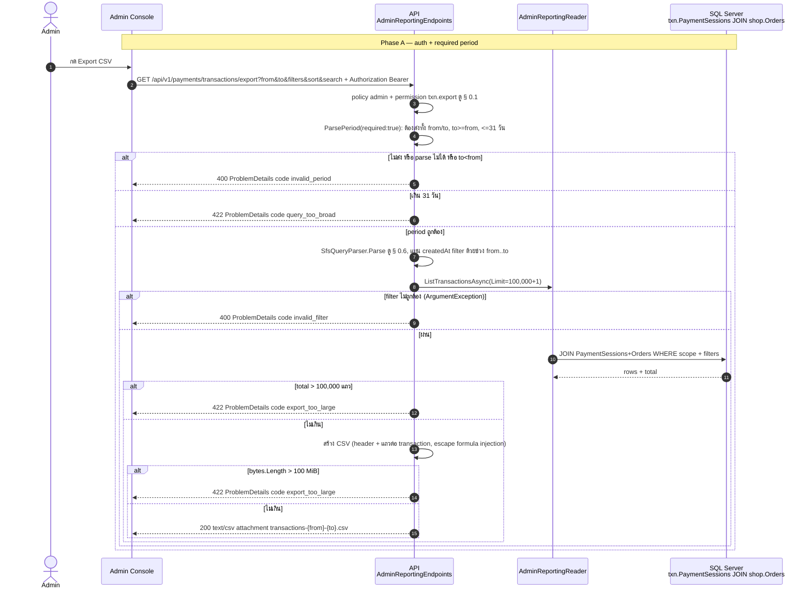
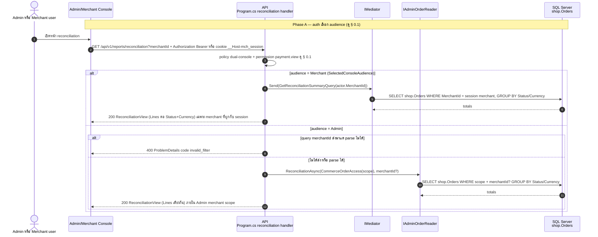
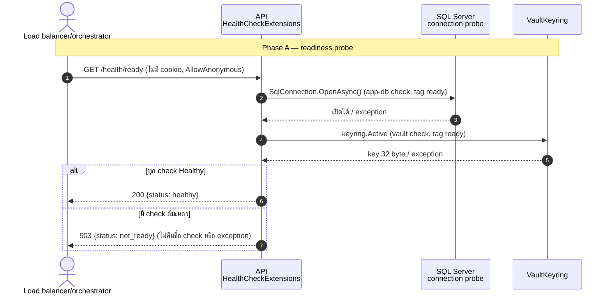
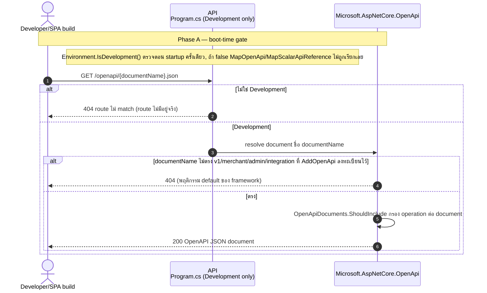

# pol-core API — Inbound PSP webhook log, reporting, health และ development surfaces (Sequence Diagrams)

> Source: `docs/reference/api-endpoints.md` ส่วน "Inbound PSP webhooks" (L351-L356), "Reporting" (L358-L368), "Infrastructure และ health" (L370-L375), "OpenAPI และ Scalar (development only)" (L377-L384) และ source ที่อ้างต่อ § (`src/Api/Api/Webhooks/InboundWebhookEndpoints.cs`, `src/Api/Api/Reporting/AdminReportingEndpoints.cs`, `src/Api/Api/Program.cs`, `src/Api/BuildingBlocks.Web/HealthChecks.cs`, `src/Api/Api/OpenApiDocuments.cs`, `src/Infrastructure/Persistence/Persistence.MerchantRuntime/Payments/InboundWebhookStore.cs`, `src/Infrastructure/Persistence/Persistence.MerchantRuntime/Reporting/AdminReportingReader.cs`, `src/Application/Modules/Orders.Application/GetReconciliationSummary.cs`)
> Scope: 13 endpoints เดียวกับ `14-inbound-webhooks-reporting-infra.activities.md` (หมายเลข § ตรงกัน) แสดงลำดับข้าม actor / API / reader / DB
> Generated: 2026-09-14

| § | Diagram | Endpoints |
| --- | --- | --- |
| 14.1 | ค้นและอ่านรายละเอียด Inbound PSP webhook event | `GET /api/v1/webhooks/inbound-events`, `GET /api/v1/webhooks/inbound-events/{eventId:guid}` |
| 14.2 | รายการและรายละเอียดธุรกรรม (Transactions) | `GET /api/v1/payments/transactions`, `GET /api/v1/payments/transactions/{paymentSessionId:guid}` |
| 14.3 | สรุปยอด dashboard และรายงานปฏิบัติการ | `GET /api/v1/reports/dashboard`, `GET /api/v1/reports/operations` |
| 14.4 | ส่งออกรายงานเป็น CSV | `GET /api/v1/payments/transactions/export`, `GET /api/v1/reports/operations/export` |
| 14.5 | รายงาน reconciliation (dual-console) | `GET /api/v1/reports/reconciliation` |
| 14.6 | Health check (liveness/readiness) | `GET /health/live`, `GET /health/ready` |
| 14.7 | OpenAPI document และ Scalar UI (development only) | `GET /openapi/{documentName}.json`, `GET /scalar/{documentName?}` |

---

## 14.1 ค้นและอ่านรายละเอียด Inbound PSP webhook event

validate query ก่อนแล้วจึง query ตาม merchant scope, scope ว่างคืนผลว่างโดยไม่แตะ DB (source: `InboundWebhookEndpoints.cs:13-43`, `InboundWebhookStore.cs:126-178,215-223`)

| Method | fullPath | ต่างจาก § กลางตรงไหน |
| --- | --- | --- |
| GET | `/api/v1/webhooks/inbound-events/{eventId:guid}` | permission เดียวกัน (audit.view), ไม่มี query filter/validation, lookup ตรง `eventId` ในสโคปเดียวกัน, หา `eventId` ไม่พบหรือนอก scope -> 404 bare (ไม่แยกเหตุ), พบ -> 200 `InboundWebhookEventView` ตัวเดียวกัน (ไม่มี ETag) |

---

## 14.2 รายการและรายละเอียดธุรกรรม (Transactions)

SFS parse แล้วเติม createdAt default ก่อน query join session+order (source: `AdminReportingEndpoints.cs:51-88,258-270`, `AdminReportingReader.cs:97-132,171-209`)

| Method | fullPath | ต่างจาก § กลางตรงไหน |
| --- | --- | --- |
| GET | `/api/v1/payments/transactions/{paymentSessionId:guid}` | permission เดียวกัน (txn.view), ไม่มี SFS, lookup ตรง `paymentSessionId` ในสโคปเดียวกัน, ไม่พบหรือนอก scope -> 404, พบ -> 200 `TransactionDetailResponse` (transaction + Order lines + lifecycle events จาก outbox PaymentPaid/Failed/Expired + capability flags) พร้อม header ETag = vN จาก `Session.Version` ดู § 0.5, `ProducesProblem(409)` ประกาศไว้แต่ handler ไม่มี path คืน 409 จริง (ดู Notes ของ activities.md) |

---

## 14.3 สรุปยอด dashboard และรายงานปฏิบัติการ

period default 7 วัน สูงสุด 31 วัน, merchantId นอก scope คืนค่าว่างเงียบ ๆ ไม่ error (source: `AdminReportingEndpoints.cs:20-49,275-296`, `AdminReportingReader.cs:19-95`)

| Method | fullPath | ต่างจาก § กลางตรงไหน |
| --- | --- | --- |
| GET | `/api/v1/reports/operations` | permission/period/merchantId/empty-scope logic เหมือนกันทุกจุด (เรียก `DashboardAsync` ตัวเดียวกัน), ต่างที่ response ห่อเป็น `OperationsReportResponse(Summary, UnavailableSections: [])` — `UnavailableSections` เป็น array ว่างตายตัว ไม่เคยเติมค่า |

---

## 14.4 ส่งออกรายงานเป็น CSV

period บังคับ, ตรวจ row cap ก่อนสร้างไฟล์แล้วตรวจ byte cap หลังสร้างไฟล์ (source: `AdminReportingEndpoints.cs:15-16,90-163,307-378`)

| Method | fullPath | ต่างจาก § กลางตรงไหน |
| --- | --- | --- |
| GET | `/api/v1/reports/operations/export` | permission `txn.export` เดียวกัน, period required เหมือนกัน (400 `invalid_period` / 422 `query_too_broad`), ไม่มี SFS filter, ไม่มี row-count cap, `merchantId` optional เหมือน § 14.3 — นอก scope คืน summary ว่างเงียบ ๆ ก่อนสร้าง CSV, เรียก `DashboardAsync` แทน `ListTransactionsAsync`, สร้าง CSV totals+breakdown ต่อ PSP/method/originator, ยังตรวจ cap 100 MiB เดียวกัน -> 422 `export_too_large`, ไฟล์ `operations-{from}-{to}.csv` |

---

## 14.5 รายงาน reconciliation (dual-console)

audience ถูกเลือกไว้แล้วตอน auth (§ 0.1) แล้ว handler แยกสอง code path ที่คืน `ReconciliationView` ทรงเดียวกัน (source: `Program.cs:2376-2411`, `GetReconciliationSummary.cs:9,17-31`)

---

## 14.6 Health check (liveness/readiness)

ready รวมผล 2 check แล้วคืนเฉพาะ status token, live ตอบทันทีไม่มี dependency (source: `HealthChecks.cs:69-117`)

| Method | fullPath | ต่างจาก § กลางตรงไหน |
| --- | --- | --- |
| GET | `/health/live` | `AllowAnonymous` เหมือนกัน, ไม่ตรวจ dependency ใด ๆ (ไม่มี tag `ready`), ไม่มี branch, เสมอ 200 `{status: healthy}` — orchestrator ใช้เป็นสัญญาณ restart process เท่านั้น |

---

## 14.7 OpenAPI document และ Scalar UI (development only)

boot-time gate ครั้งเดียว ไม่ใช่ per-request check (source: `Program.cs:729-740`, `OpenApiDocuments.cs:8-98`)

| Method | fullPath | ต่างจาก § กลางตรงไหน |
| --- | --- | --- |
| GET | `/scalar/{documentName?}` | boot-gate เดียวกัน (dev only), เมื่อ map แล้วเสิร์ฟ Scalar reference UI (HTML) ไม่ใช่ JSON, document ตัวเลือก merchant/admin/integration (default = merchant, `isDefault:true`), title คงที่ "pol-core API", ไม่มี 404 ต่อ documentName ที่ไม่รู้จัก (Scalar UI จัดการ selector เอง) เสมอ 200 |

---

## Notes

- Deviations ของ theme นี้อยู่ที่ `14-inbound-webhooks-reporting-infra.activities.md` (ไม่พบ deviation ระหว่างเอกสารกับ source) — sequences.md ไม่ทำซ้ำตาราง
- § 14.1-14.4 ใช้ participant `RDR`/`STORE` แทนชั้น reader/store จริง (`AdminReportingReader`, `InboundWebhookStore`) เพื่อความกระชับ รายละเอียด query ต่อบรรทัดดู source citation ใต้แต่ละ diagram
- § 14.5 แสดงสอง code path (mediator กับ reader ตรง) เป็น `alt` เดียวเพราะ auth (§ 0.1) เลือก audience ไว้ก่อนถึง handler แล้ว ไม่ใช่ decision ใหม่ในชั้น handler
- § 14.6 ใช้ actor "Load balancer/orchestrator" แทน Admin เพราะ endpoint นี้ anonymous และถูกเรียกโดย infrastructure จริง ไม่ใช่ผู้ใช้ผ่าน console
- § 14.7 ใช้ actor "Developer/SPA build" แทน Admin เพราะ route นี้เปิดเฉพาะ development สำหรับทีมพัฒนา ไม่ใช่ flow ของผู้ใช้ปลายทาง

**Render**: GitHub / Obsidian / VS Code Mermaid
